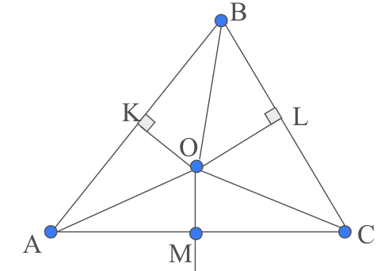
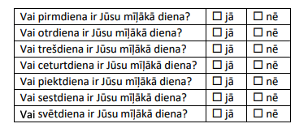

# Uzdevumu risināšanas heiristikas

Par **uzdevumu** (*problem*) parasti nav skaidrs, kā vajag risināt. Un kas vienam 
izskatās kā uzdevums, citam var būt **vingrinājums** (*exercise*, *numeric example*) 
ar zināmu risināšanas procedūru jeb algoritmu.

**Heiristika** (*heuristic*) ir tas, kā var mēģināt domāt tad, ja 
procedūra nav zināma. Atšķirībā no procedūras heiristika nepasaka, kā tieši vajag 
rīkoties un negarantē iznākumu.

* **Vienkāršota varianta aplūkošana:** Aizstāj mainīgos ar fiksētiem skaitļiem, 
  pievieno ērtākus pieņēmumus, ierobežo uz šaurāku uzdevumu vai mazāka izmēra piemēriem.

* **Piemēri un musturu ieraudzīšana:** Izveido piemērus, pamana tajos sakritības, 
  rekurentas atkarības (tālāki piemēri uzbūvējami no iepriekšējiem), 
  visādi “uzkrāj datus” (iepildot tos tabuliņās vai zīmējumos), lai redzētu, ko var vispārināt.

* **Pārveido par attēlu:** Uztaisa attēlu (grafu, diagrammu utt.), 
  kas vizualizē sakarības. Reizēm var labāk redzēt ierobežojumus, 
  simetrijas vai to, kas saglabājas nemainīgs.

* **Galējie un robežgadījumi:** 
  Pārbauda robežgadījumus (ļoti lielus vai ļoti mazus parametrus), 
  lai redzētu, kam uzdevumā ir vai nav jānotiek, lai atmestu tādas hipotēzes, 
  kas “vidusmēra” gadījumā šķistu ticamas.

* **Pārformulē zināmo un mērķi:** Izsaka saviem vārdiem, no jauna un 
  citādi uzskaita pieņēmumus, pieraksta simboliskā formā. Var palīdzēt 
  noskaidrot pieņēmumus, kuri uzdevuma tekstā pateikti neprecīzi.

* **Risina no beigām:** Iedomājas, ka pierādāmais apgalvojums 
  (vai uzvara spēlē) ir jau sasniegti; mēģina saprast, no kurām situācijām 
  varēja to sasniegt. Ja vajag, atkāpjas šādi vairākus soļus.

* **Saskaita dažādos veidos:** Apskata uzdevumu parametrus, kam jāsaglabājas, 
  bet ko var saskaitīt vai izteikt vairākos veidos. Izraksta šīs sakarības.

* **Pieņem pretējo:** Lai pamatotu kādu apgalvojumu, iedomājas, ka tas nav 
  spēkā un apskatās, kas no tā seko.

## Uzdevums 1

Pamatosim, ka jebkurā šaurleņķu trijstūrī $ABC$, kura sānu malas $BA$ un $BC$ 
nav vienādas, tām tomēr jābūt vienādām. 

No virsotnes $B$ velkam bisektrisi, kas krusto malas $AC$ vidusperpendikulu $MO$ 
punktā $O$. (Ja trijstūris būtu vienādsānu, tad šīs līnijas sakristu - tāpēc 
ir būtiski, ka $BA \neq BC$). No punkta $O$ velkam perpendikulus pret 
abām sānu malām $OK$ un $OL$. 

1. Ievērojam, ka $AM = BM$, jo $M$ ir viduspunkts. 
    Tāpēc trijstūri $AOM$ un $COM$
    ir vienādi pēc pazīmes $m \ell m$ (divas malas sakrīt un viens leņķis ir taisns). 

2. Trijstūri $BKO$ un $BLO$ arī ir vienādi, jo 
    ir vienādi leņķi $\sphericalangle KBO = \sphericalangle OBL$; 
    arī vienādi abi taisnie leņķi (kā arī atlikušie leņķi pie virsotnes 
    $O$) un var lietot pazīmi
    $\ell m \ell$ (sakrīt divi leņķi un mala $BO$). 
    Iegūstam, ka $BK = BL$. 

Pamatot, ka ir vienādi arī trijstūri $AOK$ un $COL$. 
Pamatot, ka $BA = BC$. Secināt, ka rodas paradokss - ja 
$BA \neq BC$, tad $BA = BC$. 

## Uzdevums 2 (LV.AMO.2023.7.5)

Daži no :math:`272` ciema iedzīvotājiem visu laiku saka patiesību, 
pārējie visu laiku melo. Katram no ciema iedzīvotājiem
ir tieši viena mīļākā nedēļas diena. Aptaujājot iedzīvotājus, 
viņiem tika lūgts atbildēt uz septiņiem jautājumiem,
katrā no tiem izvēloties vienu no dotajām atbildēm:

Uz katru jautājumu saņemto apstiprinošo (“jā”) atbilžu skaits bija šāds: 
pirmdiena -- :math:`53`, otrdiena -- :math:`54`,
trešdiena -- :math:`55`, ceturtdiena -- :math:`56`, 
piektdiena -- :math:`57`, sestdiena -- :math:`58`, svētdiena -- :math:`59`. 
Cik ciema iedzīvotāji visu laiku melo?

## Uzdevums 3

Zināms, ka $n$ ir naturāls skaitlis ($n \leq 1000$). 
Kad izrēķināja $n!$ (reizinājumu $1 \cdot 2 \cdot \ldots \cdot n$),
izrādījās, ka tas beidzas ar $N$ nullēm. Pierādīt, ka 

$$N = \left\lfloor \frac{n}{5} \right\rfloor + \left\lfloor \frac{n}{25} \right\rfloor + 
    \left\lfloor \frac{n}{125} \right\rfloor + \left\lfloor \frac{n}{625} \right\rfloor .$$

## Uzdevums 4 (LV.AMO.2016.8.5)

Divi spēlētāji spēlē spēli uz $N \times N$ rūtiņas liela laukuma. Sākumā laukuma
kreisajā apakšējā rūtiņā atrodas spēļu kauliņš. Katrā gājienā spēļu kauliņu
drīkst pārvietot vai nu vienu lauciņu pa labi, vai vienu lauciņu uz augšu, vai
arī divus lauciņus pa diagonāli uz augšu pa labi (skat. 12.att., kur kauliņa
sākumpozīcija apzīmēta ar baltu, bet atļautie gājieni -- ar pelēkiem aplīšiem).
Kauliņu nedrīkst pārvietot ārpus laukuma robežām. Spēlētāji gājienus izdara pēc
kārtas. Zaudē spēlētājs, kurš nevar izdarīt gājienu. Kurš no spēlētājiem,
pareizi spēlējot, uzvar, ja **(A)** $N=7$, **(B)** $N=8$?

