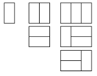
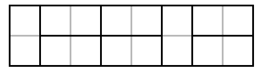

# Reizināšanas likums

* **Reizināšanas likums:** Ja 1.darbību var veikt $a$ veidos, bet 2.darbību $b$ veidos, 
  tad abu darbību secību var veikt $a \cdot b$ veidos.
* **Saskaitīšanas likums:** Ja ir divas nešķeļošas objektu kopas ar $a$ un $b$ elementiem 
  katrā, tad abās kopā ir $a+b$ elementi. (Ja kopas šķeļas, tad šķēlums jāatņem.)  
* **Atņemšanas likums:** Ja pavisam ir $N$ elementi un $a$ no tiem ir kādā kopā $A$, tad
  $N-a$ ir atlikušie elementi, kuru nav kopā $A$.
* **Dalīšanas likums:** Ja eksistē $n$ veidi, kā izveidot virknīti vai citu objektu, 
  bet katram objektam $d$ no šiem veidiem ir neatšķirami, tad objektu ir pavisam $n/d$. 
* **Kombinācijas:** no $n$ pa $k$ (cik veidos no $n$-elementu kopas var izvēlēties 
  $k$-elementu kopu): $C_n^k = \frac{n!}{(n-k)! \cdot k!}$.

**Apgalvojums:** Katram naturālam $n$ ir spēkā vienādība

$$\sum_{k=0}^n C_n^k = 2^n.$$

**1.uzdevums:** Cik veidos ap apaļu galdu var apsēsties 4 draugi, ja  
**(A)** Katrs krēsls ir atšķirīgs (vērsts uz citu debess pusi),  
**(B)** Visi krēsli ir vienādi, ir būtiski, kas katram sēž pa kreisi un pa labi,  
**(C)** Ir svarīgi, kādi katram ir kaimiņi, bet draugi vairs neatšķir kreiso pusi no labās.

**2.uzdevums (saskaitīšanas likums):**
Cik veidos garu sleju ar $2 \times 10$ rūtiņām var pārklāt ar $10$ "domino kauliņiem"
(kas sastāv no 2 blakus rūtiņām). 

 

**3.uzdevums (atņemšanas likums):** Cik veidos uz šaha galdiņa 
var novietot $8$ torņus tā, lai atrastos tādi torņi, kuri viens otru apdraud 
(ir tajā pašā horizontālē vai vertikālē)? 

**4.uzdevums (dalīšanas likums):** Rokas krelles sastāv no $19$ lodveida pērlītēm, kas izvietotas pa apli; 
pērlītēm ir $3$ dažādas krāsas. Cik dažādas rokas krelles var izgatavot 
(divas krelles uzskatām par vienādām, ja var panākt, lai tās vienādi izskatās -- varbūt 
pagriežot vai apsviežot uz otru pusi). 

**5.uzdevums (LV.AMO.2014.9.2):**
Doti četri dažādi cipari, neviens no tiem nav $0$. Visu divciparu skaitļu, kurus
var izveidot no šiem cipariem, summa ir $1276$. Atrast dotos četrus ciparus!

**Atrisinājums:** Dotos ciparus apzīmēsim ar $a, b, c, d$. 
No tiem var izveidot $16$ dažādus
divciparu skaitļus. Katrs no šiem cipariem četros skaitļos ir desmitu cipars un
četros skaitļos- vienu cipars. Visu šo divciparu skaitļu summa ir

$$4 \cdot 10 \cdot(a+b+c+d)+4 \cdot(a+b+c+d)=44(a+b+c+d)=1276$$

tātad $a+b+c+d=1276:44=29$. Vienīgā iespēja, ka četru dažādu nenulles ciparu
summa ir $29$, ir tad, ja šie cipari ir $5, 7, 8$ un $9$.

**6.uzdevums (LV.AMO.2023.7.1):** 
Vai rindā kaut kādā secībā var uzrakstīt naturālus skaitļus 
**(A)** no $1$ līdz $23$; **(B)** no $1$ līdz $2023$ tā, lai blakus
skaitļiem nebūtu vienādu ciparu?

**Atrisinājums:**

**(A)** Var, piemēram, šādā veidā:
$$1; 2; 10; 3; 11; 4; 12; 5; 13; 22; 14; 7; 15; 8; 16; 20; 17; 9; 18; 23; 19; 6; 21.$$

**(B)** Nē, nevar. Pierādīsim, ka, lai kā arī šos skaitļus uzrakstītu rindā, 
vienmēr blakus atradīsies divi skaitļi, kas abi satur ciparu $1$.
Ievērosim, ka ir daudz skaitļu, kuros ir cipars 1, 
to skaits noteikti ir vismaz $1100$, jo ir $1000$ četrciparu
skaitļu, kas sākas ar ciparu $1$, un $100$ trīsciparu skaitļu, 
kas sākas ar ciparu $1$.
Pieņemsim, ka dotie skaitļi kaut kādā secībā uzrakstīti rindā 
un sadalīsim tos blakusesošu skaitļu pāros,
iegūsim $1012$ pārus (pēdējam skaitlim nav pāra, 
tas savā “pārī” būs vienīgais skaitlis).
Redzam, ka četrciparu un trīsciparu skaitļu, kas satur ciparu $1$, 
ir vairāk nekā pāru, tātad pēc Dirihlē
principa kādā pārī atradīsies divi skaitļi, kas abi satur ciparu $1$.

**7.uzdevums:** Apskatām regulāru $(2n+1)$-stūri.
Cik ir trijstūru ar virsotnēm $(2n+1)$-stūra virsotnēs, 
kuri satur $(2n+1)$-stūra centru?

**Atrisinājums:** Fiksēsim vienu virsotni $A$. No tās uz dažādām 
pusēm atliksim lokus, kuru galapunktus uzskatīsim par trijstūra 
virsotnēm $B, C$. Par vienības loku uzskatīsim $2\pi/(2n+1)$.

Tātad lokus $AB$ un $AC$ raksturosim ar naturāliem skaitļiem 
$x$ un $y$, kas parāda, cik vienības lokus tie satur. Lai trijstūris 
$ABC$ saturētu daudzstūra centru, jāizpildās nevienādībām $x \le n$, $y \le n$, 
$x + y \ge n + 1$. Šos nosacījumus apmierina šādi pāri: 
$(1, n)$, $(2, n-1)$, $(2, n)$, $(3, n-2)$, $(3, n-1)$, $(3, n)$, $\ldots$, $(n, n)$. 
Viegli aprēķināt, ka to skaits ir $1 + 2 + 3 + \cdots + n = \frac{n(n+1)}{2}$. 
Tātad prasīto trijstūru skaits ir $\frac{n(n+1)(2n+1)}{6}$.

**8.uzdevums:** 
Atrast cik ir nedeģenerētu trijstūru, kam visas virsotnes pieder kopai 

$$\{(s,t)\in \mathbb{Z}\mid 0\le s\le 4,\ 0\le t\le 4\}.$$

**Atrisinājums:** Trīs punktus norādītajā kvadrātā var izvēlēties 
$C_{25}^{3}$ veidos. Saskaitīsim, cik no šiem trijniekiem veido 
deģenerētu trijstūri, t.i., kur visi 3 punkti atrodas uz vienas taisnes. 

Vertikālajā un horizontālajā virzienā tādu trijnieku ir $10\cdot C_{5}^{3}$. 
Paralēli galvenajām diagonālēm ir vēl 
$2\cdot\bigl(2\cdot C_{3}^{3}+2\cdot C_{4}^{3}+C_{5}^{3}\bigr)$ trijnieki. 
Virzienos $(1,\pm2)$, $(2,\pm1)$ var izvēlēties vēl $4\cdot4=16$ trijniekus. 
Citos virzienos 3 punktus uz vienas taisnes izvēlēties nevar. 
Atņemot no kopīgā trijnieku skaita trijnieku skaitu, kas atrodas uz vienas 
taisnes, iegūstam kopējo nedeģenerēto trijstūru skaitu. Tas ir $2152$.