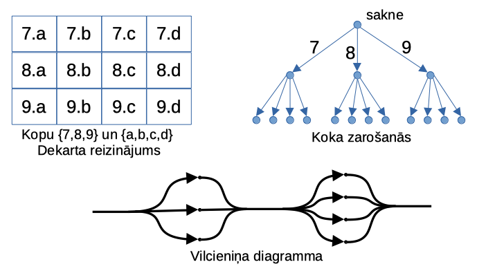
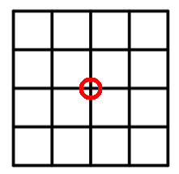

# Reizināšanas likums (2025-09-22)

Ja pirmo darbību var veikt $a$ veidos, bet otro darbību var veikt $b$ veidos, 
tad visu secību var veikt $a \cdot b$ veidos.
**Bieži dara tā:** Vispirms reizina (iespējamos variantus, virzoties uz priekšu pa ceļa posmiem), 
tad saskaita (pa visiem iespējamajiem ceļiem).

{ width=4.2in }

**1.uzdevums:**
**(A)** Cik veidos var izveidot trīs vienāda platuma svītru 
karogu, ja pieejamas $5$ krāsas un blakusesošām svītrām jābūt dažādām?  
**(B)** Tas pats jautājums par trīs vienāda platuma svītru lentītēm 
(atšķirībā no karoga, lentītei nav stingri noteiktas augšējās 
un apakšējās svītras). 

**2.uzdevums:** 
Kvadrātveida pilsēta sastāv no $4 \cdot 4$ kvartāliem, kurus 
atdala $5$ horizontālas un $5$ vertikālas ielas (arī pilsētas perimetru 
veido ielas). 
Cik dažādos veidos var nonākt no kvadrāta kreisā apakšējā uz labo augšējo 
stūri, ja katru no $8$ ceļa posmiem var iet tikai uz ziemeļiem vai uz austrumiem 
un nedrīkst iet caur pilsētas centru?

{ width=1in }

<!-- 98380 -->
**3.uzdevums:** 
**(A)** Katram trīsciparu skaitlim atrodam visu tā ciparu reizinājumu, un 
visus šos reizinājumus saskaitām. Kāds būs rezultāts?  
**(B)** Kāds ir rezultāts, ja saskaita ciparu reizinājumus visiem 
nepāra skaitļiem no $1$ līdz $999$?

**4.uzdevums:**   
**(A)** Pierādīt, ka skaitlim $10000$ ir tieši $25$ pozitīvi dalītāji. 
**(B)** Pierādīt, ka skaitļa $10000$ visu pozitīvo dalītāju summa ir 

$$(1 + 2 + 4 + 8 + 16)(1 + 5 + 25 + 125 + 625) = 31 \cdot 781 = 24211.$$ 

<!--  78840	-->
**5.uzdevums:**
Katrā kvadrāta $8 \times 8$ rūtiņā ierakstīja pa naturālam skaitlim.
Atļauts izvēlēties jebkuru kvadrātu ar izmēru $3 \times 3$ vai $4 \times 4$ 
un palielināt visus tajā esošos skaitļus par $1$. 
Vēlamies panākt, lai skaitļi visās rūtiņās dalītos ar $10$. 
Vai to vienmēr var izdarīt?

**Atrisinājums:** 
Tabulā rakstīsim tikai pēdējos ciparus (atlikumus, dalot ar $10$). 
Ievērosim, ka darbību veikšanas kārtība nav svarīga; svarīgi tikai, cik 
reizes katrā kvadrātā pieskaitīja. Desmitkārtēja darbības veikšana vienā kvadrātā 
atlikumus nemaina, tāpēc katrā no $3 \times 3$ vai $4 \times 4$ kvadrātiem 
pieskaitīšanu ir jēga veikt ne vairāk kā 10 reizes. 
Uz galdiņa pavisam ir $36$ kvadrāti $3 \times 3$ un 
$25$ kvadrāti $4 \times 4$. Tātad no katras tabulas var iegūt ne vairāk kā 
$10^{25+36} = 10^{61}$ dažādas tabulas. Tabulu ar visām nullēm varētu 
iegūt ne vairāk kā no $10^{61}$ tabulām (ja no tabulas $A$ var iegūt 
nulles tabulu, tad arī no nulles tabulas var iegūt tabulu $A$). 
Bet tas ir mazāk par kopējo tabulu skaitu $10^{64}$.

**6.uzdevums (LV.AMO.2022A.8.5):** 

Mārtiņš augošā secībā pēc kārtas sāka rakstīt skaitļus, kuru pirmie četri 
cipari ir "$3321$":

$$3321; 33210; 33211; 33212; 33213; 33214;\ldots $$

Kāds ir $3321.$ skaitlis šajā virknē?

**Atrisinājums:**  Pirmais naturālais skaitlis, kura pieraksts sākas ar "$3321$", ir pats 
skaitlis $3321$.  
Nākamie $10$: $3321\mathbf {0}; 3321\mathbf {1}; \ldots ; 3321\mathbf{9};$  
Nākamie $100$: $3321\mathbf {00}; 3321\mathbf {01}; \ldots ; 3321\mathbf {99};$  
Nākamie $1000$: $3321\mathbf {000}; \ldots ; 3321\mathbf {999};$  
Nākamie $1000$: $3321\mathbf {0000}; \ldots ; 3321\mathbf {0999};$  
Nākamie $1000$: $3321\mathbf {1000}; \ldots ; 3321\mathbf {1999};$  
Nākamie $200$: $3321\mathbf {2000}; \ldots; 3321\mathbf {2199};$  
Nākamie $10$: $3321\mathbf {2200}; \ldots ; 3321\mathbf {2209}$.  
Tātad kopā uzrakstīts $1+10+100+1000 \cdot 3+200+10=3321$ skaitlis, līdz ar to 
meklētais skaitlis ir $33212209$.

**7.uzdevums:** 
Uz šaha galdiņa $8 \times 8$ veido *labirintu*, novietojot 
starp dažiem lauciņiem šķērssienas. Ja šaha tornis (figūra, kas pārvietojas 
pa horizontāli vai pa vertikāli) var apstaigāt visus lauciņus, 
nepārlēcot pāri šķērssienām, tad labirintu saucam par *labu*. 
Pretējā gadījumā -- par *sliktu*. 
Kādu labirintu ir vairāk -- labo vai slikto? 

**Atrisinājums:** 
Visu labirintu skaitu apzīmēsim ar $N$. Mums šis skaitlis nebūs 
jāzina (bet to var izrēķināt, saskaitot, cik vietās var izvēlēties
likt vai nelikt šķērssienu).
Apskatīsim tikai stūra lauciņus (šahā tos apzīmē ar **a1**, **a8**, 
**h1** un **h8**). Ja stūra lauciņam, piemēram, **a1** 
ir divās pusēs ieliktas šķērssienas, tad labirints kļūst slikts. 
Tātad vismaz $(1/4)N$ no visiem labirintiem ir slikti kaut vai tādēļ, 
ka tajos ir "izolēts" lauciņš **a1**. 

No atlikušajiem $(3/4)N$ labirintiem tieši ceturtā daļa ir tādi, 
kur "izolēts" lauciņš **a8**. Un attiecīgi būs $(3/4) \cdot (3/4) \cdot N$
jeb ${\displaystyle \left( \frac{3}{4} \right)^2 \cdot N}$ labirintu, 
kuros lauciņi **a1** un **a8** nav pilnīgi izolēti.
Analoģiski ${\displaystyle \left( \frac{3}{4} \right)^3 \cdot N}$ 
labirintu ir tādi, kam trīs stūri nav izolēti.
Bet ${\displaystyle \left( \frac{3}{4} \right)^3 = \frac{27}{81}}$ jau ir mazāk nekā puse. 
Tātad slikto labirintu būs vairāk nekā labo.

**8.uzdevums:**
Algebriskā izteiksmē $(x+y+z+1)^{4}$ atvēra iekavas un ieguva daudzus saskaitāmos:

$$(x+y+z+1)^{4} = x^{4} + y^{4} + z^{4} + \cdots + A\cdot xyz + \cdots + 1.$$

Atrast koeficientu $A$ monomam $A \cdot xyz$. 

**Atrisinājums:** 
Reizinot četras vienādas iekavas $(x+y+z+1)$, no katras iekavas 
var paņemt tieši vienu burtu vai skaitli -- un tādēļ četras reizes 
var izvēlēties no četriem saskaitāmajiem. Iegūsim 
pavisam $4^4 = 256$ saskaitāmos, starp kuriem būs arī tādi, kuros 
jāsavelk kopā līdzīgie locekļi. 

Cik daudzi no tiem būs $xyz$? Šo reizinājumu var iegūt tad, ja no katras iekavas 
izvēlas citu burtu (un vēl arī vienu reizi izvēlas skaitli $1$, jo 
citādi iznāktu ceturtās pakāpes monoms). Protams, burtus un var izvēlēties 
dažādā secībā, tikai tie nedrīkst atkārtoties.
Četrus simbolus $x,y,z,1$ var samaisīt $4! = 24$ dažādos veidos. 
Tādēļ koeficients $A$ monomam $A \cdot xyz$ būs vienāds ar $24$. 
