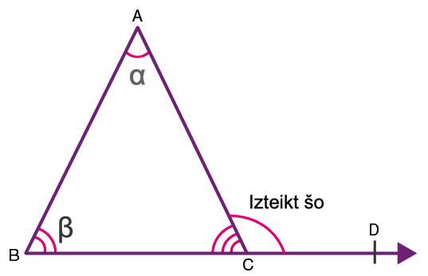
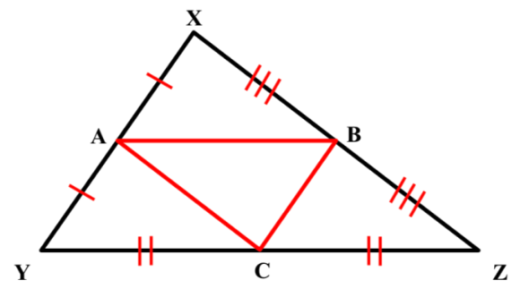
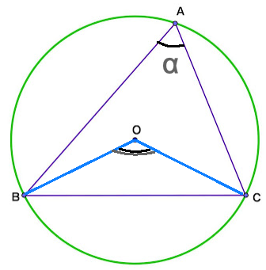
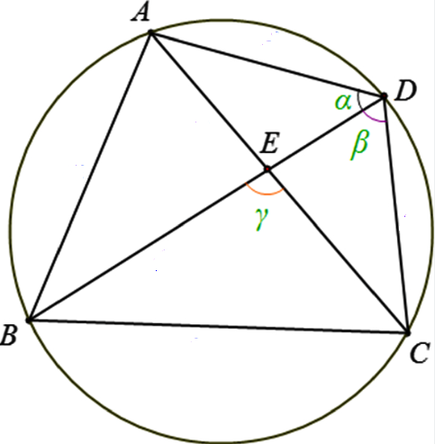
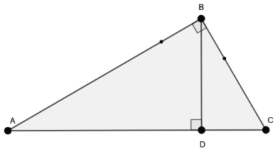
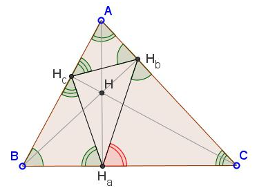
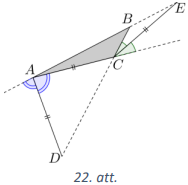
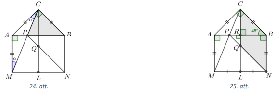

# Trijstūru ģeometrija (3A nodarbība, 2025-09-22)

Daudzstūru iekšējo leņķu summa; iekšējo/ārējo leņķu sakarības.
Blakusleņķi, krustleņķi, kāpšļu leņķi, iekšējie/ārējie šķērsleņķi.

{ width=2in } { width=2in }

Riņķa līnijā ievilkts leņķis, apvilkta četrstūra īpašības/pazīmes.

{ width=2in } { width=2in }

Trijstūru vienādības pazīmes, trijstūru līdzības pazīmes.

{ width=2in }

Leņķu vai attālumu vienādība "simetrijas dēļ".

{ width=2in }

**1.uzdevums (LV.AMO.2022A.9.3):**
Izliektā sešstūrī $ABCDEF$ pretējās malas ir pa pāriem paralēlas, tas ir, 
$AB \| DE$, $BC \| EF$ un $CD \| AF$. Zināms, ka $AB=DE$. Pierādīt, ka $BC=EF$ un 
$CD=AF$.

**2.uzdevums (LV.AMO.2023.9.3):**
Trijstūrī viens leņķis ir par $120^{\circ}$ lielāks nekā otrs. 
Pierādīt, ka bisektrise, kas vilkta no trešā leņķa
virsotnes, ir divas reizes garāka nekā augstums no tās pašas virsotnes!

**3.uzdevums (LV.AMO.2018.9.3):**
Ap vienādsānu trijstūri $ABC$ ($AB=AC$) apvilkta riņķa līnija. Caur virsotni 
$B$ un loka $AB$ (kas nesatur $C$) iekšēju punktu $D$ novilkta taisne, uz 
kuras atzīmēts punkts $E$ tā, ka $AD=AE$. Pierādīt, ka trijstūri $ABC$ un $ADE$
ir līdzīgi!

**4.uzdevums (LV.AMO.2016.9.3):**
Dots taisnstūris $ABCD$. Malas $AB$ viduspunkts ir $M$. Zināms, ka uz malas $BC$
var izvēlēties tādu punktu $N$, ka
$\sphericalangle BMN=\sphericalangle CDN=30^{\circ}$. Pierādīt, ka trijstūris
$CDM$ ir vienādmalu!

<!-- 
Alternatīvs atrisinājums
-->

**5.uzdevums (LV.AMO.2015.9.4):**
Vienādsānu trapeces $ABCD$ sānu malas ir $AB$ un $CD$, bet diagonāles $AC$ un
$BD$ krustojas punktā $E$. Ap trijstūri $CDE$ apvilktā riņķa līnija krusto
garāko pamatu $AD$ iekšējā punktā $F$. Nogriežņu $CF$ un $BD$ krustpunkts ir
$G$. Nosaki $\sphericalangle CGD$ lielumu, ja $\sphericalangle CAD=\alpha$!

<!--
Trijstūra iekšējo leņķu summa; trapeces leņķi (simetrija u.c.)
Ievilktie leņķi, iekšējie šķērsleņķi

Leņķu izteikšana (Apzīmē FCD ar beta un izsaka GDC. Beigās izsaka 
arī CGD.)

Alternatīvs atrisinājums
-->

**6.uzdevums (LV.AMO.2017.9.3):**
Dots trijstūris $ABC$, kuram $AB>AC>BC$. Virsotnes $A$ blakusleņķa bisektrise 
krusto malas $BC$ pagarinājumu punktā $D$, bet virsotnes $C$ blakusleņķa 
bisektrise krusto malas $AB$ pagarinājumu punktā $E$. Zināms, ka $AD=AC=CE$. 
Aprēķināt trijstūra $ABC$ leņķus!

## Atrisinājums

Apzīmējam $\sphericalangle BCE=\alpha$ (skat. 22.att.). Tad no bisektrises 
definīcijas un blakusleņķu īpašības izriet, ka 
$\sphericalangle ACE=180^{\circ}-\alpha$. Izmantojot krustleņķu īpašību un 
vienādsānu trijstūra īpašību, iegūstam, ka 
$\sphericalangle ADC=\sphericalangle ACD=2 \sphericalangle BCE=2 \alpha$ un 
$\sphericalangle DAC=180^{\circ}-4 \alpha$.

Izsakām $\sphericalangle CAE=180^{\circ}-2 \sphericalangle DAC=180^{\circ}-\left(360^{\circ}-8 \alpha\right)=8 \alpha-180^{\circ}$.
Tā kā trijstūris $ACE$ ir vienādsānu, tad 
$\sphericalangle CAB=\sphericalangle AEC=8 \alpha-180^{\circ}$.

{ width=2.5in }

No trijstūra $ACE$ iegūstam, ka

$$\begin{gathered}
2 \sphericalangle CAE+\sphericalangle ACE=180^{\circ}; \\
2\left(8 \alpha-180^{\circ}\right)+180^{\circ}-\alpha=180^{\circ}; \\
15 \alpha=360^{\circ}.
\end{gathered}$$

Tātad $\alpha=24^{\circ}$, un varam aprēķināt trijstūra $ABC$ leņķus: 
$\sphericalangle BAC=8 \cdot 24^{\circ}-180^{\circ}=12^{\circ}; \sphericalangle ACB=180^{\circ}-2 \cdot 24^{\circ}=132^{\circ}$
un $\sphericalangle ABC=180^{\circ}-132^{\circ}-12^{\circ}=36^{\circ}$.

## Atrisinājums

Apzīmējam $\sphericalangle BCE=\alpha$ un $\sphericalangle CAD=\beta$ (skat. 
22.att.). Tad pēc bisektrises definīcijas un blakusleņķu īpašības 
$\sphericalangle ACE=180^{\circ}-\alpha$ un 
$\sphericalangle ACB=180^{\circ}-2 \alpha$.

No vienādsānu trijstūra $ACE$ iegūstam, ka 
$\sphericalangle BAC=\sphericalangle AEC=\frac{\alpha}{2}$. Līdz ar to 
$2 \sphericalangle CAD+\sphericalangle BAC=180^{\circ}$ jeb 
$2 \beta+\frac{\alpha}{2}=180^{\circ}$. No vienādsānu trijstūra $ACD$ iegūstam,
ka $\sphericalangle ADC=\sphericalangle ACD=2 \alpha$ un 
$4 \alpha+\beta=180^{\circ}$. Esam ieguvuši vienādojumu sistēmu: 
$\left\{\begin{array}{l}2 \beta+\frac{\alpha}{2}=180^{\circ} \\ 4 \alpha+\beta=180^{\circ}\end{array}\right.$.
Reizinot otro vienādojumu ar $(-2)$ un saskaitot abus vienādojumus iegūstam 
$\frac{\alpha}{2}-8 \alpha=180^{\circ}-360^{\circ}$ jeb $-15 \alpha=-360^{\circ}$.
Tātad $\alpha=24^{\circ}$, un varam aprēķināt trijstūra $ABC$ leņķus: 
$\sphericalangle BAC=24^{\circ}: 2=12^{\circ};\ \sphericalangle ACB=180^{\circ}-2 \cdot 24^{\circ}=132^{\circ}$
un $\sphericalangle ABC=180^{\circ}-132^{\circ}-12^{\circ}=36^{\circ}$.

**7.uzdevums (LV.AMO.2019.9.3):**
Dots vienādsānu taisnleņķa trijstūris $ABC$ ar taisno leņķi $C$. Uz tā 
hipotenūzas konstruēts taisnstūris $ABNM$ tā, ka punkti $C$ un $N$ atrodas 
dažādās pusēs no taisnes $AB$ un $AC=AM$. Nogrieznis $CM$ krusto $AB$ punktā 
$P$. Punkts $L$ ir malas $MN$ viduspunkts. Nogrieznis $CL$ krusto $PN$ punktā 
$Q$. Pierādīt, ka **(A)** trijstūris $CBP$ ir vienādsānu; **(B)** četrstūris 
$QNBC$ ir rombs!

## Atrisinājums

**(A)** Tā kā $AC=AM$, tad trijstūris $MAC$ ir vienādsānu un 
$\sphericalangle ACM=\sphericalangle AMC=\alpha$ (skat. 24.att.). No taisnleņķa
trijstūra $MAP$ iegūstam, ka $\sphericalangle APM=90^{\circ}-\alpha$. 
Ievērojam, ka $\sphericalangle CPB=\sphericalangle APM=90^{\circ}-\alpha$ kā 
krustleņķi un 
$\sphericalangle PCB=\sphericalangle ACB-\sphericalangle ACM=90^{\circ}-\alpha$.
Tā kā $\sphericalangle CPB=\sphericalangle PCB$, tad trijstūris $CBP$ ir 
vienādsānu.

**(B)** Pierādīsim, ka četrstūra $QNBC$ pretējās malas ir pa pāriem paralēlas 
(skat. 25.att.).

Vienādsānu trijstūrī $ACB$ novelkam augstumu $CR$, kas ir arī mediāna un 
bisektrise. Tā kā $CR \perp AB$ un $AR=RB$, tad taisne $CR$ iet arī caur 
taisnstūra pretējās malas $MN$ viduspunktu $L$. Līdz ar to arī $Q$ pieder 
taisnei $CR$ un no tā, ka $CR \perp AB$ un $BN \perp AB$, izriet 
$CQ \parallel BN$.

Trijstūris $ACB$ ir vienādsānu taisnleņķa trijstūris, tāpēc 
$\sphericalangle CBA=45^{\circ}$.

No (A) gadījumā pierādītā izriet, ka $PB=CB=BN$. Tātad trijstūris $PBN$ ir 
vienādsānu taisnleņķa trijstūris, tāpēc $\sphericalangle BNP=45^{\circ}$. Esam 
ieguvuši, ka 
$\sphericalangle CBN+\sphericalangle BNP=45^{\circ}+90^{\circ}+45^{\circ}=180^{\circ}$,
tātad $CB \parallel QN$, jo iekšējo vienpusleņķu summa ir $180^{\circ}$.

Tā kā $QNBC$ ir paralelograms (jo tā pretējās malas ir pa pāriem paralēlas) un 
$CB=BN$, tad $QNBC$ ir rombs.

{ width=6in }

