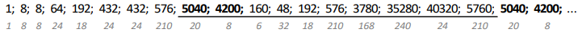
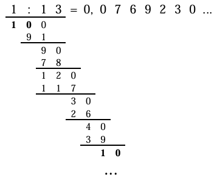

# Rekurentas virknes, Skaitļu teorija (6A: 2025-10-16)

* Rekurentai virknei definēts pirmais loceklis (vai daži locekļi) 
  un formula, ar kuru no iepriekšējiem locekļiem izrēķināt nākamos. 
  Ar to var saskaitīt variantus tad, ja citas metodes (*reizināšanas likums*)
  būtu par grūtu. Risinājuma secība:

  - Aprēķināt locekļus $a_n$ dažiem maziem $n$. Rekurentai 
    virknei nepieciešami pirmie locekļi (sākot ar $a_0$ vai ar $a_1$ vai tml.). 
  - Apskatīt $a_n$ un mēģināt izteikt ar $a_{n-1}$ (vai citiem iepriekšējiem 
    locekļiem). Pierakstīt prasību, ka $n \geq 2$ (vai tml., no kuras 
    vietas šo formulu lietot).
  - Pārliecināties, ka rekurentajā izteiksmē bez atkārtošanās 
    iekļauti visi varianti.
  - Ja uzdevumā prasīts, izveidot virknes locekļu tabuliņu līdz kādai vērtībai
    un pierakstīt secinājumus.

* Apzīmējums $a \equiv b \pmod{m}$ nozīmē, ka $a$ un $b$ dod vienādus atlikumus, 
  dalot ar $m$. Piemēram, $2026 \equiv 6 \pmod{10}$.  
  $1^2 = 1 \equiv 1 \pmod 8$, $3^2 = 9 \equiv 1 \pmod 8$, $5^2 = 25 \equiv 1 \pmod 8$. 
* Virkne, kas iegūstama, rakstot arvien jaunus decimālciparus
  $x_1 = \overline{a}$, $x_2 = \overline{ab}$, $x_3 = \overline{abc}$, 
  $x_4 = \overline{abcd}, \ldots$ ir izsakāma
  ar rekurentu sakarību:  
  $x_1 = a$, $x_2 = 10 \cdot x_1 + b$, $x_3 = 10 \cdot x_2 + c$, $x_4 = 10 \cdot x_3 + d$.  
  Var rakstīt arī uzreiz: $x_4 = a \cdot 10^3 + b \cdot 10^2 + c \cdot 10 + d$.

**0.uzdevums:**  
**(A)** Uzrakstīt virkni $a_n = 3n\;\text{mod} 7$.  
**(B)** Uzrakstīt virkni $a_n = n^3\;\text{mod} 7$.  
**(C)** Kā bez reizināšanas (ar saskaitīšanu un atņemšanu) 
uzzināt, kādu atlikumu dod skaitlis $\overline{abcdef}$ dalot ar $9$?  
**(D)** Kā bez reizināšanas (ar saskaitīšanu un atņemšanu) 
uzzināt, kādu atlikumu dod skaitlis $\overline{abcdef}$ dalot ar $11$?  

**1.uzdevums:** 
Ar $a_n$ apzīmē, cik dažādos veidos $n$ atšķiramus cilvēkus var 
sagrupēt pāros (cilvēku secība pārī nav svarīga). Ja $n$ ir nepāra, 
tad $a_n = 0$.   
**(A)** Izteikt $a_n$, izmantojot reizināšanas likumu,  
**(B)** Izteikt $a_n$ kā rekurentu virkni.

**2.uzdevums:** 
Ar $R_n$ apzīmējam gabalu skaitu, kuros $n$ taisnes sadala plakni, 
ja nekādas divas taisnes nav paralēlas un nekādas trīs taisnes 
neiet caur vienu punktu. 
Atrast rekurentu sakarību, lai rēķinātu $R_n$ virknes locekļus. 

**3.uzdevums (LV.AMO.2019.12.4):**
Sporta nometnē ir $100$ skolēni. Ar $N$ apzīmējam, cik veidos šos 
$100$ skolēnus var sadalīt $50$ pāros (pāru secība un
arī skolēnu secība pārī nav svarīga). Ar kādu lielāko trijnieka pakāpi dalās $N$? 

**Atrisinājums:**
Aprēķinām $N$, izmantojot reizināšanas likumu. 
Visjaunākajam skolēnam pāri var atrast $99$ veidos.
No atlikušajiem jaunākajam skolēnam pāri var atrast $97$ veidos.
Pēdējam skolēnam paliek tieši $1$ pāris.
Pilnu variantu skaitu izsaka reizinājums:  

$$N = 99\cdot{}97\cdot{}95\cdot\ldots\cdot{}3\cdot{}1.$$

Grupējam reizinātājus atkarībā no trijnieka pakāpes, ar
kuru tie dalās.

* $(99-3)/6 + 1 = 17$ reizinātāji dalās ar $3$:
$3 \cdot 9 \cdot 15 \cdot 21 \cdot 27 \cdot \ldots \cdot 99$.
* $(99-9)/18 + 1 = 6$ reizinātāji dalās ar $3^2$: 
$9 \cdot 27 \cdot 45 \cdot 63 \cdot 81 \cdot 99$
* $(81 - 27)/54 +1 = 2$ reizinātāji dalās ar $3^3$ ($27, 81$). 
* Viens reizinātājs dalās ar $3^4$ ($81$).

Saskaitot šīs pakāpes $17 + 6 + 2 + 1 = 26$. 

**4.uzdevums:** Monētu met $n$ reizes un katrreiz pieraksta 
rezultātu "C" (cipars) vai "Ģ" (ģerbonis). 
Pirmais spēlētājs uzvar, ja visu metienu virknītē nekad nav 
divi ģerboņi pēc kārtas (virknīte nesatur "ĢĢ").
Apzīmējam ar $a_n$ to, cik ir virknīšu garumā $n$ bez "ĢĢ" 
(jeb cik dažādos veidos 1.spēlētājs var uzvarēt).  
**(A)** Atrast rekurentu sakarību, kas $a_n$ izsaka
ar iepriekšējiem virknes locekļiem.  
**(B)** Atrast varbūtību, ar kuru pirmais spēlētājs uzvar, ja 
monētu met tieši $6$ reizes (par varbūtību saucam 
dalījumu starp to monētas uzmešanas veidu skaitu, kuros uzvar 1.spēlētājs, 
pret visu iespējamo monētu uzmešanas veidu skaitu).

**Atrisinājums:**  
**(A)** Atrod pirmos dažus virknes locekļus: $a_1 = 2$ (ja met vienreiz, 
der jebkurš no diviem iznākumiem), $a_2 = 3$ (ja met divreiz, tad 
no četriem iznākumiem "CC", "CĢ", "ĢC", "ĢĢ" neder viens).  
Ja $n>2$, tad izsaka $a_n$ ar iepriekšējiem virknes locekļiem:

* Ja sākumā uzkritis "C", tad pārējos $n-1$ metienus var izdarīt $a_{n-1}$
  dažādos veidos, lai uzvarētu 1.spēlētājs (jāpanāk, lai $n-1$ virknītē nebūtu "ĢĢ"). 
* Ja sākumā uzkritis "Ģ", tad 1.spēlētājam nav iespējams turpināt $a_{n-1}$ 
  veidos (jo tūlīt varētu parādīties vēl viens "Ģ"). Tādēļ 
  prasām, lai aiz pirmā "Ģ" tūlīt sekotu "C". Atlikušos $n-2$ metienus 
  var izdarīt $a_{n-2}$ veidos, lai 1.spēlētājs uzvarētu. 

Esam ieguvuši rekurenci: $a_1 =2$, $a_2 =3$, $a_{n} = a_{n-1} + a_{n-2}$ (ja $n>2$). 

**(B)** Ierakstām tabulā iegūtās vērtības $a_1, a_2, \ldots$ un arī 
varbūtības, ko iegūst, dalot 1.spēlētājam "veiksmīgo" virkņu skaitu $a_n$
ar visu virkņu skaitu $2^n$. 

| $n$        | $a_n$      | $2^n$      | uzvaras varbūtība $p$  |
| ---------- | ---------- | ---------- | ---------------------- |
| 1          | 2          | 2          | $2/2 = 1$              |  
| 2          | 3          | 4          | $3/4 = 0.75$           |  
| 3          | 5          | 8          | $5/8 = 0.625$          |  
| 4          | 8          | 16         | $8/16 = 0.5$           |  
| 5          | 13         | 32         | $13/32 \approx 0.4063$ | 
| 6          | 21         | 64         | $21/64 \approx 0.3281$ | 

**5.uzdevums:**
Kādā programmēšanas valodā visi vārdi satur tieši 
$n$ burtus; un katrs burts ir "A", "B" vai "C". 
Ar $a_n$ apzīmējam, cik ir vārdu garumā $n$, kuri 
satur divus "A" no vietas.  
**(A)** Uzrakstīt $a_n$ kā rekurentu virkni, norādot sākuma nosacījumus 
un rekurento sakarību, kas ļauj izrēķināt $a_n$ no iepriekšējiem 
locekļiem.  
**(B)** Atrast $a_6$ vērtību.

**6.uzdevums (LV.AMO.2023.9.2):** 
Ja divciparu skaitlim $\overline{ab}$ galā pieraksta divciparu skaitli
$\overline{cd}$, tad iegūtais četrciparu skaitlis dalās ar $13$.
Zināms, ka $12a + 9b$ dalās ar $13$. Kāds var būt skaitlis $\overline{cd}$?

**Atrisinājums:**
Skaitlis $\overline{cd}$ var būt $13$; $26$; $39$; $52$; $65$; $78$ vai $91$. 
Apzīmējam iegūto četrciparu skaitli ar $\overline{abcd}$. 
Ekvivalenti pārveidojam šo skaitli:

$$\overline{abcd} = 1000a + 100b + 10c + d = (12a + 9b) + (10c + d) + 988a + 91b =$$
$$= (12a + 9b) + (10c + d) + 13 \cdot 76a + 13 \cdot 7b.$$

Tā kā saskaitāmie $13 \cdot 76a$ un $13 \cdot 7b$ dalās ar $13$ 
un no dotā $12a + 9b$ dalās ar $13$, tad, lai viss skaitlis
dalītos ar $13$, arī $10c + d = \overline{cd}$ jādalās ar $13$. 
Tātad skaitlis $\overline{cd}$ var būt jebkurš skaitļa $13$ daudzkārtnis,
tas ir, $13$; $26$; $39$; $52$; $65$; $78$ vai $91$.

**7.uzdevums (LV.AMO.2019.9.4):**
Ja naturāla sešciparu skaitļa visus nepāra ciparus aizvietotu ar $7$, iegūtu 
skaitli, kas ir par $5998$ lielāks nekā sākotnējais skaitlis. Savukārt, ja 
sākotnējā skaitlī ar $7$ aizvietotu visus pāra ciparus, tad iegūtais skaitlis 
būtu par $500290$ lielāks nekā sākotnējais. Atrast doto sešciparu skaitli!

**Atrisinājums:**
Apzīmējam doto skaitli ar $x$, skaitli, ko iegūst visus pāra ciparus aizstājot 
ar septītniekiem, apzīmējam ar $A$ un skaitli, ko iegūst visus nepāra ciparus 
aizstājot ar septītniekiem, apzīmējam ar $B$.

Pamatosim, ja diviem skaitļiem samaina vietām to vienas šķiras ciparus, tad šo 
skaitļu summa nemainās. Pieņemsim, ka vienam skaitlim $n$-tās šķiras cipars ir 
$a$, bet otram $b$, pieņemsim arī, ka $a>b$. Tad pirmajam skaitlim ciparu $a$ 
aizstājot ar $b$, šis skaitlis samazinās par $(a-b) \cdot 10^{n}$. Otrajam 
skaitlim ciparu $b$ aizstājot ar $a$ tas palielinās par $(a-b) \cdot 10^{n}$. 
Tātad abu skaitļu summa nemainās.

Aplūkojam summu $A+B$. Katrā šķirā (vienos, desmitos, simtos utt.) šiem diviem 
skaitļiem viens cipars ir "oriģinālais" (kas bija skaitlī $x$), bet otrs ir 
septītnieks. Samainīsim katrā šķirā šos ciparus tā, lai septītnieks atrastos 
otrajā skaitlī, bet "oriģinālais" cipars - pirmajā.

Tad pirmais skaitlis pārvēršas par $x$, bet otrais - par skaitli, kas sastāv no
sešiem septītniekiem. Tā kā šīs darbības rezultātā skaitļu summa nemainās, tad 
$A+B=x+777777$.

Pēc dotā $A=x+500290$, bet $B=x+5998$. Atrisinot vienādojumu

$$(x+500290)+(x+5998)=x+777777$$

iegūstam, ka $x=271489$.
Pārbaudām, ka skaitlis $271489$ apmierina uzdevuma nosacījumus:

- aizvietojot šī skaitļa nepāra ciparus ar $7$, iegūstam $277487=271489+5998$,  
- aizvietojot šī skaitļa pāra ciparus ar $7$, iegūstam $771779=271489+500290$.

**8.uzdevums (LV.AMO.2018.9.4):**
Atrast lielāko naturālo skaitli, kas dalās ar $7$, kura ciparu summa ir $100$ 
un kuram neviens cipars nav $0$.

**Atrisinājums:**
Pamatosim, ka lielākais skaitlis, kas apmierina uzdevuma nosacījumus, ir 
$112 \underbrace{1111 \ldots 111}_{96\ vieninieki}$.

Skaidrs, ka skaitlī nevar būt vairāk kā $100$ cipari, jo tad tā ciparu summa 
būtu lielāka nekā $100$ (neviens cipars nav $0$). Vienīgais $100$ ciparu 
skaitlis, kura ciparu summa ir $100$ un neviens cipars nav $0$, sastāv no $100$
vieniniekiem, bet tas nedalās ar $7$, jo $111111$ dalās ar $7$, bet $1111$ 
(tas, kas paliek pāri no $100$ vieniniekiem, atdalot $16$ grupas pa $111111$) 
nedalās.

Ja skaitlim ir $99$ cipari, no kuriem neviens nav $0$, un tā ciparu summa ir 
$100$, tad tas sastāv no $98$ vieniniekiem un viena divnieka. Šo divnieku nevar
rakstīt skaitļa pirmajā vai otrajā pozīcijā, jo ne $211$, ne $121$ nedalās ar 
$7$, bet to var rakstīt trešajā pozicijā, jo $112$ dalās ar $7$ un atlikušais 
skaitlis no $96$ vieniniekiem arī dalās ar $7$.

**9.uzdevums (LV.AMO.2018.8.2):**
Naturālu skaitļu virknes $1;\ 8;\ 8;\ 64;\ 192;\ 432;\ \ldots$ katrs loceklis, sākot 
ar trešo, ir vienāds ar divu iepriekšējo locekļu nenulles ciparu reizinājumu. 
Kāds ir šīs virknes $2018.$ loceklis?

**Atrisinājums:**
Turpinot virkni tālāk, iegūsim, ka tā ir (ar pelēkiem cipariem norādīts katra 
virknes locekļa nenulles ciparu reizinājums):

Tā kā katrs nākamais virknes loceklis ir atkarīgs no diviem iepriekšējiem 
virknes locekļiem, tad, līdzko parādās divi jau iepriekš bijuši skaitļi, 
izveidojas periods. Tā kā virknes devītais un desmitais loceklis ir $5040$ un 
$4200$, un $19.$ un $20.$ loceklis arī ir $5040$ un $4200$, tad virkne, sākot 
ar $9.$ locekli, ir periodiska un perioda garums ir $10$. Tāpēc pēdējais 
pilnais periods beidzas pie $2018.$ virknes locekļa, jo $2018=8+10 \cdot 201$, 
un $2018.$ loceklis ir periodā pēdējais, tātad tas ir $5760$.

**10.uzdevums (LV.AMO.2014.8.1):** 
Skaitli $\frac{1}{13}$ pārveidoja par bezgalīgu decimāldaļu un tajā izsvītroja
$2014.$ ciparu aiz komata.
Kurš skaitlis lielāks -- sākotnējais vai iegūtais?

**Atrisinājums:**
Pārveidojot skaitli $\frac{1}{13}$ decimāldaļā (t.i., dalot $1$ ar $13$),
iegūstam

Tā kā katrs nākamais cipars dalījumā atkarīgs tikai no tā atlikuma, kurš iegūts
iepriekšējā dalīšanas solī., tad, līdzko parādās kāds jau iepriekš sastapts
skaitlis (atlikums), izveidojas periods. Kā redzam, daļa
$\frac{1}{13}=0,(076923)$ ir bezgalīga periodiska decimāldaļa ar perioda garumu
$6$ cipari. Tātad $2014.$ vietā aiz komata atrodas tāds pats cipars kā $4.$
vietā aiz komata, jo $2014=335 \cdot 6+4$. Tas ir cipars $9$. Ja mēs šo ciparu
izsvītrojam, tad jauniegūtajā skaitlī 2014. cipars aiz komata būs cipars $2$
(nākamais, kas seko aiz $9$). Skaitlim $\frac{1}{13}$ un iegūtajam skaitlim ir
$0$ veseli un pirmie $2013$ cipari aiz komata sakrīt, tad lielāks būs tas
skaitlis, kuram ir lielāks $2014.$ cipars aiz komata. Tā kā $9=2$, tad
$\frac{1}{13}$ ir lielāka nekā iegūtais skaitlis.
