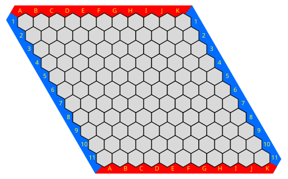

# Pierādījumi no pretējā (2025-10-27 .. 2025-10-31)

<!--
  - |
    \makeatletter
    \RedeclareSectionCommand[
      beforeskip=1.2ex plus 0.4ex minus 0.2ex,
      afterskip=-0.5ex plus -0.2ex
    ]{subsection}
    \makeatother
-->

## 1.uzdevums (LV.AMO.2022B.9.5) {-} 

Mākslas muzeja plānojums ir taisnstūris ar izmēriem **(A)** $8 \times 9$; 
**(B)** $9 \times 11$ rūtiņas, 
kur viena rūtiņa atbilst vienai muzeja telpai. 
Muzeja vadītājs vēlas izveidot apmeklētāju maršrutu, 
kuram izpildās šādas īpašības:

* maršruts sākas kādā no rūtiņām (telpām), kas atrodas pie taisnstūra malas;
* apmeklētājs no vienas rūtiņas (telpas) var pāriet uz citu rūtiņu (telpu), ja tām ir kopīga mala;
* apmeklētājs maršruta laikā apmeklē katru rūtiņu (telpu) tieši vienu reizi;
* maršruts beidzas rūtiņā (telpā), kas atrodas pie taisnstūra malas blakus maršruta sākuma rūtiņai (telpai).

Vai muzeja vadītājs var izveidot šādu maršrutu?

## 2.uzdevums (LV.AMO.2023.8.5) {-}

Uz palodzes sēž vairākas bizbizmārītes, katrai no tām uz muguras 
ir vai nu trīs punktiņi, vai astoņi
punktiņi. Tās bizbizmārītes, kurām uz muguras ir astoņi punktiņi, 
vienmēr saka patiesību, bet tās
bizbizmārītes, kurām uz muguras ir trīs punktiņi, vienmēr melo. 
Katra bizbizmārīte izteicās:

* pirmā bizbizmārīte teica: "punktiņu skaits uz muguras mums visām ir vienāds";
* otrā teica: "mums visām kopā uz muguras ir $38$ punktiņi";
* trešā teica: "nē, mums visām kopā uz muguras ir $48$ punktiņi";
* katra no atlikušajām bizbizmārītēm teica: "no pirmajām trijām bizbizmārītēm 
  tieši viena teica patiesību".

Cik bizbizmārītes sēž uz palodzes?

## 3.uzdevums (LV.AMO.2022B.8.4) {-}

Vai pa apli var uzrakstīt skaitļus  
**(A)** $0;\;1;\;2;\;3;\;4;\;5;\;6;\;7;\;8;\;9$  
**(B)** $0;\;1;\;2;\;3;\;4;\;5;\;6;\;7;\;8;\;9;\;10;\;11;\;12;\;13$  
tā, lai katri divi blakus esoši skaitļi atšķirtos par $3$; $4$ vai $5$?

## 4.uzdevums (LV.AMO.2018.8.5) {-}

**(A)** Kāds ir mazākais rūtiņu skaits, kas jāiekrāso $6 \times 6$ rūtiņu 
kvadrātā, lai katrā šī kvadrāta $2 \times 3$ rūtiņu taisnstūrī (tas var būt arī
pagriezts vertikāli) būtu vismaz viena iekrāsota rūtiņa?   
**(B)** Vai noteikti 
tad, kad ir iekrāsots mazākais rūtiņu skaits, visas četras stūra rūtiņas paliks
neiekrāsotas?

## 5.uzdevums (LV.AMO.2014.7.2) {-}

Vai var atrast tādus veselus skaitļus $a$ un $b$, kuriem izpildās vienādība
$a \cdot(3a+5b) \cdot 7b=7654321$?

## 6.uzdevums (LV.AMO.2023.10.1) {-}

Pie galda sēž zaļie bruņinieki un sarkanie bruņinieki -- kopā $10$ bruņinieku. 
Zaļie bruņinieki vienmēr saka patiesību, sarkanie bruņinieki vienmēr melo. 
Katrs bruņinieks izteicās:

* pirmais bruņinieks teica: "starp mums nav neviena zaļā bruņinieka";
* otrais bruņinieks teica: "starp mums ir ne vairāk kā viens zaļais bruņinieks";
* trešais teica: "starp mums ir ne vairāk kā divi zaļie bruņinieki";
* ceturtais teica: "starp mums ir ne vairāk kā trīs zaļie bruņinieki",
* un tā tālāk, līdz desmitais bruņinieks teica: "starp mums ir ne vairāk kā deviņi zaļie bruņinieki".

Cik zaļo un cik sarkano bruņinieku sēž pie galda?

## 7.uzdevums (LV.NOL.2018.10.4) {-}

No cipariem $1,\ 2,\ 3,\ 4,\ 5,\ 6,\ 7,\ 8,\ 9$, katru izmantojot divas reizes,
izveidoti trīs sešciparu skaitļi. Ar kādu lielāko nuļļu skaitu var beigties 
trīs izveidoto skaitļu summa?

## 8.uzdevums (LV.AMO.2015.7.3) {-}

**(A)** Atrast naturālu skaitli ar ciparu summu $13$, kam pēdējie divi
cipari ir $13$ un kas dalās ar $13$.  
**(B)** Vai var atrast naturālu skaitli, kam ciparu summa ir $11$, pēdējie
divi cipari ir $11$ un kas dalās ar $11$?

## 9.uzdevums (LV.AMO.2003.7.3) {-}

Divi spēlētāji pamīšus raksta uz tāfeles pa vienam naturālam skaitlim no $1$ 
līdz $9$ ieskaitot. Nedrīkst rakstīt skaitļus, ar kuriem dalās kaut viens jau 
uzrakstīts skaitlis. Kas nevar izdarīt gājienu, zaudē. 
Parādiet, ka tas, kas izdara pirmo gājienu, var uzvarēt.  
(*Piezīme:* Oriģinālā bija prasīts "Parādiet, **kā** tas, kas izdara pirmo gājienu, var uzvarēt.")

## 10.uzdevums {-}

Spēlē Hex dots rombveida laukums ar $11 \times 11$ regulāriem sešstūriem. 
Divas pretējās romba malas ir zilas, otras divas pretējās malas ir sarkanas.
Sāk zilais spēlētājs --- novieto zilu sešstūrīti vienā no lauciņiem; pēc 
tam iet sarkanais spēlētājs un novieto sarkaknu sešstūrīti utt. 
Gājienus nedrīkst izlaist. Uzvar tas spēlētājs, kuram izdevies 
savienot divas pretējās malas ar 
nepārtrauktu ķēdīti ar tās pašas krāsas sešstūrīšiem. 

{ width=192pt }

Kurš uzvar pareizi spēlējot --- zilais vai sarkanais?

