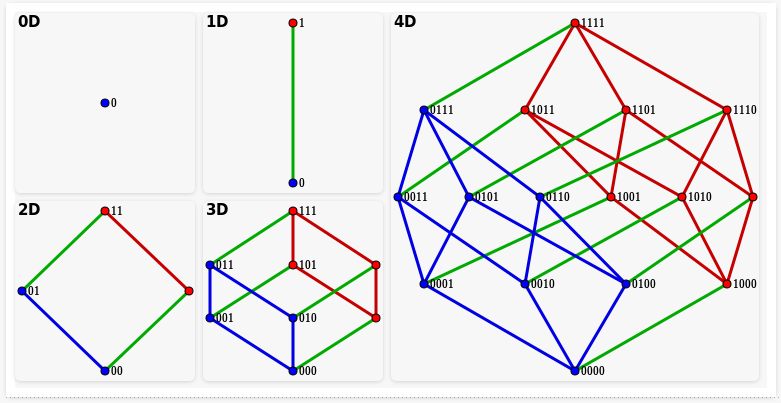

# Kombinatoriskā optimizācija (2025-11-10 .. 2025-11-14)

**1.jautājums:** 

* Ar kādu ciparu var sākties $\sqrt{5\ast\ast}$ -- kvadrātsakne 
  no trīsciparu skaitļa, kura pirmais cipars ir $5$, bet 
  divi pārējie cipari nav zināmi? 
* Ar kādu ciparu var sākties $\sqrt{5\ast\ast\ast}$ -- kvadrātsakne 
  no četrciparu skaitļa, kura pirmais cipars ir $5$?
* Ko var teikt par kvadrātsaknēm no piecciparu un sešciparu 
  skaitļiem $\sqrt{5\ast\ast\ast\ast}$ un 
  $\sqrt{5\ast\ast\ast\ast\,\ast}$? 

**2.jautājums:** 

Zīmējumā doti 2-dimensiju, 3-dimensiju un 4-dimensiju kubi. 
Sākot ceļu kuba pašā apakšā, uzzīmēt maršrutu, kas 
apstaigā visas kuba virsotnes, nevienā virsotnē 
neatgriežoties.

{ width=384pt }

**3.jautājums:** 

Kurus skaitļus no $1$ līdz $10$ var sareizināt, lai 
reizinājums būtu pilns kvadrāts?
(No visām iespējām izvēlēties to, 
kur reizinājums ir vislielākais.) 

**4.jautājums:** 

Uz galda novietoti $10$ cilindri, zem viena no tiem noslēpies trusītis.
Mums ir trusīšu meklēšanas ierīce ar jūtīgu sensoru. 
Mēs varam šai ierīcei uzdot jebkādus jautājumus latviešu valodā 
un uz katru jautājumu ierīce atbild, iededzot 
zilu, zaļu vai sarkanu lampiņu. Vai trusīti garantēti varēs atrast, uzdodot 
tieši divus jautājumus?

**5.jautājums:** 

* Annai jāizveido trīs atsvaru komplekts, ar kuru var nosvērt 
  visas masas $1, 2, 3, \ldots, n$ grami (iespējami lielam $n$) -- 
  atsvarus drīkst likt tikai kreisajā svaru kausā, bet sveramo objektu 
  labajā svaru kausā. 
* Baibai jāizveido trīs atsvaru komplekts, ar kuru var nosvērt 
  visas masas $1, 2, 3, \ldots, m$ grami (iespējami lielam $m$) -- 
  atsvarus drīkst likt gan pretī sveramajam objektam, gan arī 
  vienā kausā ar to. 

