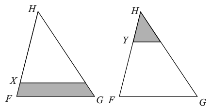

# Līdzīgi trijstūri (2025-11-24 .. 2025-12-07)

## 1.uzdevums (EU.PinkKangaroo.2014.24) {-} 

Zīmējumā attēlots trijstūris FHG, kur FH=6, GH=8 un FG=10. Punkts I ir FG viduspunkts un HIJK ir kvadrāts. Nogriežņi IJ un GH krustojas punktā L. Cik liels ir iekrāsotā četrstūra laukums?
**(A)** 124/8, **(B)** 125/8, **(C)** 126/8, **(D)** 127/8, **(E)** 128/8.

{ width=108pt }

<!--
The diagram shows a triangle FHG with FH= 6 GH= 8 and FG= 10. The point I is the midpoint of FG and HIJK is a square. The line segment IJ intersects GH at L. What is the area of the shaded quadrilateral?
(A) 124/8, (B) 125/8, (C) 126/8, (D) 127/8, (E) 128/8.
-->

## 2.uzdevums (UK.SMC.2014.14) {-} 

Attēlā dots taisnstūris PQRS, kurā PQ : QR = 1 : 2. Punkts T atrodas uz PR tā, ka ST ir perpendikulārs taisnei PR. Kāda ir trijstūra RST laukuma un taisnstūra PQRS laukuma attiecība? **(A)** $1:(4\sqrt{2})$, **(B)** $1:6$, **(C)** $1:8$, **(D)** $1:10$, **(E)** $1:12$. 

{ width=54pt }

<!--
The diagram shows a rectangle PQRS in which PQ : QR = 1 : 2. The point T on PR is such that ST is perpendicular to PR. What is the ratio of the area of the triangle RST to the area of the rectangle PQRS?
-->

## 3.uzdevums (UK.IMC.2015.25) {-} 

Uz katras trijstūra malas ir atzīmēts punkts, kas atrodas vienu ceturtdaļu no malas garuma (sk. attēlu).
Kāda daļa no trijstūra laukuma ir iekrāsota? **(A)** $\dfrac{7}{16}$, **(B)** $\dfrac{1}{2}$, **(C)** $\dfrac{9}{16}$, **(D)** $\dfrac{5}{8}$, **(E)** $\dfrac{11}{16}$.

{ width=108pt }

<!--
A point is marked one quarter of the way along each side of a triangle, as shown.
What fraction of the area of the triangle is shaded?

A $\dfrac{7}{16}$   B $\dfrac{1}{2}$   C $\dfrac{9}{16}$   D $\dfrac{5}{8}$   E $\dfrac{11}{16}$
-->

## 4.uzdevums (EU.PinkKangaroo.2015.20) {-}

Trijstūrī $FGH$ var novilkt taisni, kas ir paralēla tā pamatnei $FG$, caur punktu $X$ vai $Y$. Ieēnoto daļu laukumi ir vienādi. Dotā attiecība ir $HX : XF = 4 : 1$. Kāda ir attiecība $HY : YF$?  
**(A)** $1 : 1$, **(B)** $2 : 1$, **(C)** $3 : 1$, **(D)** $3 : 2$, **(E)** $4 : 3$

{ width=180pt }

<!--
In the triangle $FGH$, we can draw a line parallel to its base $FG$, through point $X$ or $Y$. The areas of the shaded regions are the same. The ratio $HX : XF = 4 : 1$. What is the ratio $HY : YF$?

A $1 : 1$   B $2 : 1$   C $3 : 1$   D $3 : 2$   E $4 : 3$
-->

## 5.uzdevums (UK.SMC.2015.17) {-}

$PQRS$ ir kvadrāts un $M$ ir malas $PQ$ viduspunkts (sk. attēlu). 
Kvadrāta laukums ir $k$ reizes lielāks par iekrāsotā apgabala laukumu. 
Atrast $k$ vērtību. 

{ width=108pt }

<!--
In the diagram, PQRS is a square. $M$ is the midpoint of $PQ$. 
The area of the square is $k$ times
the area of the shaded region. What is the value of $k$?
-->

## 6.uzdevums (UK.Maclaurin.2014.M4) {-}

Taisne $RAQ$ ir riņķa līnijas $ABC$ pieskare punktā $A$, un leņķi $\angle AQB$, $\angle CRA$ un $\angle APC$ visi ir taisni (sk. attēlu).
Pierādiet, ka $BQ \times CR = AP^2$.

{ width=108pt }

## 7.uzdevums (UK.MOG.2013.2) {-}

Izliektā četrstūrī $ABCD$ ar punktiem $A'$, $B'$, $C'$ un $D'$ apzīmēti attiecīgi trijstūru $BCD$, $CDA$, $DAB$ un $ABC$ mediānu krustpunkti.
**(A)** Aplūkojot trijstūri $MCD$, kur $M$ ir malas $AB$ viduspunkts, pierādiet, ka $C'D'$ ir paralēla $DC$ un ka $C'D' = \frac{1}{3} DC$.
**(B)** Pierādiet, ka četrstūri $ABCD$ un $A'B'C'D'$ ir līdzīgi.

<!--
In triangle $ABC$, the median from $A$ is the line $AM$, where $M$ is the midpoint of the side $BC$. In any triangle, the three medians intersect at the point called the centroid, which divides each median in the ratio $2:1$.

In the convex quadrilateral $ABCD$, the points $A'$, $B'$, $C'$ and $D'$ are the centroids of the triangles $BCD$, $CDA$, $DAB$ and $ABC$, respectively.

(a) By considering the triangle $MCD$, where $M$ is the midpoint of $AB$, prove that $C'D'$ is parallel to $DC$ and that $C'D' = \frac13 DC$.

(b) Prove that the quadrilaterals $ABCD$ and $A'B'C'D'$ are similar.
-->

## 8.uzdevums ([Prasolov 1.62, http://prasolov.loegria.net/planim5.pdf](http://prasolov.loegria.net/planim5.pdf)) {-}

Dots trijstūris $ABC$, kurā visi augstumi mazāki par $1$. 
Uzkonstruēt divas taisnes $x$ un $y$ tā, lai katram punktam 
$M$ uz malas $AC$, velkot nogriežņus $MX_M$ un $MY_M$ no $M$ 
paralēli taisnēm $x$ un $y$ 
līdz krustpunktiem attiecīgi ar malām $AB$ un $BC$, būtu spēkā 
$MX_M+MY_M = 1$.

## 9.uzdevums ([Prasolov 1.70](http://prasolov.loegria.net/planim5.pdf)) {-}

Kvadrāta malas garums ir $1$. Caur tā centru novilkta taisne
un izmērīti attālumi no visām četrām kvadrāta virsotnēm līdz 
šai taisnei (attālumu no punkta līdz taisnei mēra pa perpendikulu). 
Atrast visu četru attālumu kvadrātu summu. 

## 10.uzdevums ([Prasolov 1.33](http://prasolov.loegria.net/planim5.pdf)) {-}

Nogrieznis $BE$ sadala trijstūri $ABC$ divos līdzīgos trijstūros, 
turklāt līdzības koeficients ir $\sqrt{3}$. Atrast trijstūra 
$ABC$ leņķus.

