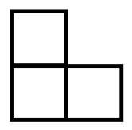
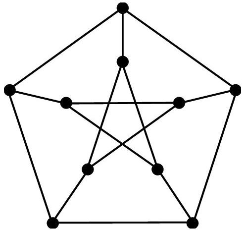
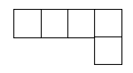

# 11.izdales lapa: Rūtiņu uzdevumi (2025-12-08 .. 2025-12-19) {-}

1. Veselās Dekarta koordinātes un modulārā aritmētika. 
2. Plaknes flīzēšana (*tiling*), lai nodrošinātu kādu īpašību.
3. Gadījumu analīze, atmetot/apgriežot nevajadzīgos (*pruning*). 
4. Grafu krāsošana un uzdevumi ar atkāpšanos (*backtracking*).
5. Simetrija kombinatoriskajā ģeometrijā un spriedumi "nezaudējot vispārīgumu".

**Piemērs #1A (koordinātes un modulārā aritmētika):**  
Uzzīmēt kvadrātu $8 \times 8$, sanumurēt tā rindiņas un kolonnas no 
$0$ līdz $7$. Iekrāsot $(i,j)$ (rūtiņu $i$-tajā rindiņā un $j$-tajā kolonnā)
tad un tikai tad, ja $i+j \equiv 0 \pmod 3$. 

**Piemērs #1B (koordinātes un modulārā aritmētika):**  
Uzzīmēt kvadrātu $8 \times 8$, sanumurēt tā rindiņas un kolonnas no 
$0$ līdz $7$. Iekrāsot $(i,j)$ tad un tikai tad, ja $(i+j)(i+j+1) \equiv 2 \pmod 4$. 

**Piemērs #2 (flīzēšana):** 
Kvadrāta $6 \times 6$ rūtiņās ierakstīt burtus "A", "B", "C" tā, 
lai katrā taisnstūrī $1 \times 3$ rūtiņas (horizontālā vai vertikālā)
visi burti būtu dažādi. Vai šī īpašība (visi burti dažādi katrā taisnstūrī $1 \times 3$), 
ja $6 \times 6$ kvadrātu izmanto kā šablonu/flīzi, ar ko noklāj visu bezgalīgo plakni?

**Piemērs #3 (gadījumu apgriešana):**  
No $4 \times 4$ kvadrāta izgrieza kādu rūtiņu (nav zināms kuru). 
Vai atlikušo daļu noteikti var sagriezt attēlā redzamajās figūriņās "stūrīšos"?

{ width=24pt }

**Piemērs #4A (grafu krāsošana):**  
Kāds ir mazākais krāsu skaits, ar kurām var izkrāsot Petersena grafa 
(sk. attēlu) $10$ virsotnes tā, lai katras divas blakus virsotnes (tās, kas savienotas ar šķautni)
būtu atšķirīgās krāsās?

{ width=72pt }

**Piemērs #4B (atkāpšanās):**  
Kvadrātā $6 \times 6$ novietot $6$ šaha dāmas tā, lai tās viena otru neapdraud. (Šaha dāma 
apdraud visas rūtiņas savā horizontālē, vertikālē un abās diagonālēs.)

## 1.uzdevums ([problems.ru #98498](https://problems.ru/view_problem_details_new.php?id=98498)) {-}

Dots neizkrāsots kvadrāts, kas sastāv no $8 \times 8$ rūtiņām. 
Cik veidos tās var iekrāsot melnā un baltā krāsā tā, lai melno rūtiņu būtu $31$ 
un nevienām divām melnām rūtiņām nebūtu kopīgas malas? 
(Divus iekrāsošanas veidus uzskatām par dažādiem, ja atrodas rūtiņa, kuras 
krāsa pie abiem iekrāsošanas veidiem atšķiras.)

## 2.uzdevums ([problems.ru #109770](https://problems.ru/view_problem_details_new.php?id=109770)) {-}

Uz šaha galdiņa $8 \times 8$ atrodas astoņi torņi, kuri cits citu neapdraud. 
Pierādiet, ka starp visiem divu torņu savstarpējiem attālumiem
atrodas divi vienādi attālumi. (Par attālumu starp torņiem sauc 
attālumu starp rūtiņu centriem, kuros tie atrodas. Tornis apdraud lauciņus,
kuri atrodas tajā pašā horizontālē vai tajā pašā vertikālē.)

## 3.uzdevums ([problems.ru #35167](https://problems.ru/view_problem_details_new.php?id=35167)) {-}

Uz galdiņa ar izmēriem $100 \times 100$ rūtiņas novietoti $100$ torņi, kuri 
viens otru neapdraud. Pierādīt, ka labajā augšējā un kreisajā apakšējā kvadrātā 
(abi ar izmēriem $50 \times 50$) atrodas vienāds torņu skaits.

## 4.uzdevums ([problems.ru #111357](https://problems.ru/view_problem_details_new.php?id=111357)) {-}

Kādu lielāko skaitu ar baltiem un melniem kauliņiem var izvietot uz šaha galdiņa $8 \times 8$ 
tā, lai katrā horizontālē un katrā vertikālē balto kauliņu būtu tieši divreiz vairāk nekā melno? 

## 5.uzdevums ([problems.ru #64538](https://problems.ru/view_problem_details_new.php?id=64538)) {-}

Sandis uzzīmējis kvadrātu $6 \times 6$ rūtiņas un pēc kārtas tajā iekrāso pa vienai 
rūtiņai. Pēc kārtējās rūtiņas iekrāsošanas viņš ieraksta tajā skaitli - cik no 
blakusesošajām rūtiņām jau ir iekrāsotas (par blakusesošām sauc rūtiņas, kurām 
ar doto ir kopīga mala). Pēc visu rūtiņu iekrāsošanas Sandis visus tajās ierakstītos 
skaitļus saskaita. 
Pierādīt, ka neatkarīgi no rūtiņu iekrāsošanas secības, 
iegūtā summa būs viena un tā pati. 

## 6.uzdevums ([LV.NOL.1986.7.4](https://www.nms.lu.lv/fileadmin/user_upload/lu_portal/projekti/nms.lu.lv/Arhivs/Olimpiades/NOL/ro_36_uzd.pdf), [3.19. atr.](https://www.nms.lu.lv/fileadmin/user_upload/lu_portal/projekti/nms.lu.lv/Arhivs/Olimpiades/NOL/ro_36_atr.pdf)) {-}

Plakne sadalīta kvadrātiņos kā rūtiņu lapa; viena kvadrātiņa malas garums ir 1.
Atzīmējam viena kvadrātiņa virsotni $O$. Cik dažādus nogriežņus ar garumu $1985$ 
var novilkt tā, lai viens galapunkts atrastos punktā $O$, bet otrs -- kāda kvadrātiņa virsotnē?

## 7.uzdevums ([LV.NOL.1992.7.5](https://www.nms.lu.lv/fileadmin/user_upload/lu_portal/projekti/nms.lu.lv/Arhivs/Olimpiades/NOL/ro_42_uzd.pdf), [42.15. atr.](https://www.nms.lu.lv/fileadmin/user_upload/lu_portal/projekti/nms.lu.lv/Arhivs/Olimpiades/NOL/ro_42_atr.pdf)) {-}

Kādu mazāko skaitu rūtiņu jānokrāso melnas taisnstūrī ar izmēriem $9 \times 15$
rūtiņas, lai katrā taisnstūrī ar izmēriem $5 \times 3$ rūtiņas atrastos vismaz 
viena melna rūtiņa?

## 8.uzdevums ([LV.NOL.1993.7.3](https://www.nms.lu.lv/fileadmin/user_upload/lu_portal/projekti/nms.lu.lv/Arhivs/Olimpiades/NOL/ro_43_uzd.pdf), [43.13. atr.](https://www.nms.lu.lv/fileadmin/user_upload/lu_portal/projekti/nms.lu.lv/Arhivs/Olimpiades/NOL/ro_43_atr.pdf)) {-}

Tabula sastāv no $3 \times 5$ rūtiņām. Vai var katrā rūtiņā ierakstīt "$+1$" vai "$-1$" tā,
lai katrs ierakstītais skaitlis būtu vienāds ar visu savu kaimiņu reizinājumu?
(Divus skaitļus sauc par kaimiņiem, ja tie ierakstīti rūtiņās ar kopīgu malu.) Visi
ierakstītie skaitļi nedrīkst būt vienādi. 

## 9.uzdevums ([LV.NOL.1994.7.5](https://www.nms.lu.lv/fileadmin/user_upload/lu_portal/projekti/nms.lu.lv/Arhivs/Olimpiades/NOL/ro_44_uzd.pdf), [44.15. atr.](https://www.nms.lu.lv/fileadmin/user_upload/lu_portal/projekti/nms.lu.lv/Arhivs/Olimpiades/NOL/ro_44_atr.pdf)) {-}

Kvadrāts sastāv no $8 \times 8$ baltām rūtiņām. Kāds mazākais daudzums rūtiņu
jānokrāso melnas tā, lai neviena tāda figūra, kāda parādīta zīmējumā, nepaliktu pilnīgi
balta? (Figūra var būt novietota arī citādi.)

{ width=54pt }

