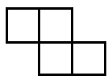

# Rūtiņas, grafi, vienādojumi (2026-01-29) {-}

## 1.uzdevums {-}

Izkrāsot $8 \times 8$ rūtiņu laukuma katru rūtiņu vienā no 3 krāsām tā, lai 
katrā Z-tetramino (sk. zīmējumu) būtu visu trīs krāsu rūtiņas. 

{ width=60pt }

## 2.uzdevums {-}

Uz kādas planētas dzīvo $5$ zili, $6$ zaļi un $7$ sarkani cilvēciņi. 
Katru rītu viņi visi satiekas un katri divi, kuru krāsas ir dažādas, sasveicinās. 
Sasveicināšanās laikā tieši viens no viņiem iedod otram atstarotāju (bet mēs nezinām, kurš 
ir devējs un kurš ir saņēmējs - to ikreiz izlemj cilvēciņi paši). Kad visi ir sasveicinājušies, 
tad visus atstarotājus, ko viņi bija iedevuši viens otram, saskaita. Cik to pavisam ir?

## 3.uzdevums {-}

Sandis uzzīmējis kvadrātu $6 \times 6$ rūtiņas un pēc kārtas tajā iekrāso pa vienai rūtiņai. 
Pēc kārtējās rūtiņas iekrāsošanas viņš ieraksta tajā skaitli - cik no blakusesošajām 
rūtiņām jau ir iekrāsotas (par blakusesošām sauc rūtiņas, kurām ar doto ir kopīga mala). 
Pēc visu rūtiņu iekrāsošanas Sandis visus tajās ierakstītos skaitļus saskaita. 
Pierādīt, ka neatkarīgi no rūtiņu iekrāsošanas secības, iegūtā summa būs viena un tā pati.  
Sk. [https://problems.ru/view_problem_details_new.php?id=64538](https://problems.ru/view_problem_details_new.php?id=64538)

## 4.uzdevums {-}

Uz skaitļu taisnes $(-\infty; 0) \cup (0; 1) \cup (1; +\infty)$ dzīvo kustīgi punkti (visas taisnes koordinātes
ir apdzīvojamas, izņemot $x=0$ un $x=1$).
Katru rītu punkts, kura pašreizējā koordināte ir $x$, pārlec uz vietu ar koordināti $\frac{1}{1-x}$. 
Starp punktiem, kuri sākumā dzīvoja atšķirīgās koordinātēs, notiek šāda saruna:

* Punkts $A$: Pēc $8$ pārlēcieniem es atgriezos tur, kur biju pašā sākumā. 
* Punkts $B$: Pēc $9$ pārlēcieniem es atgriezos tur, kur biju pašā sākumā. 
* Punkts $C$: Pēc 2.pārlēciena es saskrējos ar punktu $B$. 

Kuri no punktiem saka patiesību? 

## 5.uzdevums {-}

Vai kvadrātu ar izmēriem $6 \times 6$ rūtiņas var pārklāt ar $18$
domino kauliņiem tā, lai $13$ kauliņi atrastos horizontāli, bet $5$
— vertikāli? Katrs kauliņš pārklāj tieši $2$ rūtiņas, kauliņi
nedrīkst pārklāties.  
Sk. [Matemātikas olimpiāžu uzdevumu iekļaušana mācību procesā](https://ej.uz/q9fjv), 46.lappuse.

## 6.uzdevums (LV.NOL.2010.9.1) {-}

Atrodiet kaut vienu kvadrātvienādojumu ar veseliem koeficientiem, kam viena no saknēm ir  
**(A)** $\sqrt{2}+1$,  
**(B)** $\sqrt{7+4 \sqrt{3}}$.

**Piezīme.** Katrā uzdevuma daļā runā par **citu** kvadrātvienādojumu.  
[LV.NOL.2010 uzdevumi](https://www.nms.lu.lv/fileadmin/user_upload/lu_portal/projekti/nms.lu.lv/Arhivs/Olimpiades/NOL/nov_60_uzd.pdf) un 
[LV.NOL.2010 atrisinājumi](https://www.nms.lu.lv/fileadmin/user_upload/lu_portal/projekti/nms.lu.lv/Arhivs/Olimpiades/NOL/nov_60_atr.pdf)

## 7.uzdevums {-}

Atrisināt veselos skaitļos vienādojumu:  
$$x^3 + y^3 + z^3 = 2026 \cdot 31.$$

**Ieteikums:** Šo uzdevumu var risināt, aplūkojot atlikumus, kas rodas dalot abas izteiksmes puses ar 
to pašu skaitli.

