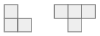
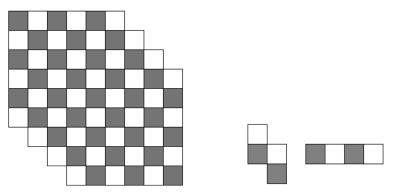
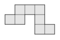
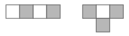

# Rūtiņu figūru sagriešana (2026-02-26) 

Sagriešanas uzdevumos parasti dota liela figūra no $N$ rūtiņām un gabali (piemēram, katrs no $k$ rūtiņām).
Dažos uzdevumos ir atļauti vairāku formu gabali; vai arī pēc sagriešanas dažas rūtiņas var palikt pāri. 

* Ja var sagriezt, tad jāizveido piemērs (reizēm noder simetrija - iemācās sagriezt mazāku gabalu un saliek lielāku) **VAI ARĪ**
* Ja nevar sagriezt, tad jāpamato - piemēram, ar invariantu metodi - visu (vai iekrāsoto) rūtiņu skaita dalāmību ar 
  viena gabala visu (iekrāsoto) rūtiņu skaitu.  

Ja ir jautāts, kādu *lielāko* skaitu rūtiņu var izgriezt, tad atrisinājums satur divas daļas: 

* Eksistē veids, kā izgriezt $m$ figūriņas **UN ARĪ** 
* Ir pamatots apgalvojums, ka $m+1$ figūriņas izgriezt nevar. 

# Iesildīšanās jautājumi {-}

## 1.jautājums {-}

Zināms, ka $7 \times 7$ kvadrātu var pilnībā sagriezt "stūrīšos" un "T-figūriņās" (sk. zīmējumu). Tās var būt dažādi pagrieztas. 

{width=90pt}

**(A)** Cik T-figūriņu var rasties sagriešanas rezultātā? (Aplūkot visas iespējas.)
**(B)** Uzzīmēt kaut vienu veidu, kurā parādīts, ka tiešām var sagriezt.

## 2.jautājums {-}

No lielās figūras jāizgriež I-veida, vai Z-veida tetramino figūriņas (abas var būt jebkurā skaitā).  
Atzīmēt, kuru apgalvojumu var pamatot, izmantojot parādīto krāsojumu melnajās un baltajās rūtiņās:

{width=288pt}

**Apgalvojums:** I-veida un Z-veida figūriņu kopā ir ${\displaystyle \left\{ \begin{array}{ll} \text{vismaz} \\ \text{ne vairāk kā} \end{array} \right\}\;\;\_\_\_\_}$. 

## 3.jautājums {-}

Zināms, ka attēlā redzamo figūru var atkārtoti pagriezt vairākas reizes par $90^\circ$ ap to pašu punktu, lai četras figūras, 
kas rodas pagriešanas rezultātā, ietilptu kvadrātā $6 \times 6$. Uzzīmēt, ap kuru virsotni jāgriež un kā izskatās šis 
kvadrāts $6 \times 6$ pēc visu figūru iezīmēšanas.

{width=72pt}

## 4.jautājums {-}

Vai kvadrātu $10 \times 10$ var pilnībā sagriezt $20$ tetramino "I" un $5$ tetramino "T" (sk. zīmējumā)? 

{width=108pt}

# Olimpiāžu uzdevumi par rūtiņu figūru sagriešanu {-}

## 1.uzdevums (LV.VOL.2015.9.3) {-}

TBD

## 2.uzdevums (LV.VOL.2016.9.5) {-}

TBD

## 3.uzdevums (LV.VOL.2017.9.4) {-}

TBD

## 4.uzdevums (LV.VOL.2018.9.5) {-}

TBD

