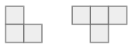
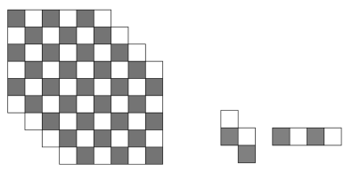
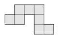
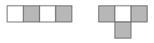
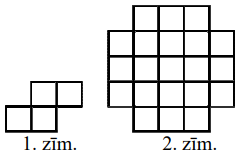
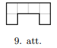
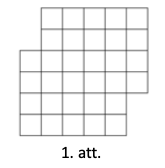

# Rūtiņu figūru sagriešana (2026-02-26) 

Lai pamatotu, *vai ir/nav iespējams* sagriezt, tad jāuzzina, kuru varēs pierādīt: 

* Ja **var** sagriezt, veido piemēru (piem. saliek mazāku gabalu un izmanto simetriju),
* **VAI ARĪ**, ja **nevar** sagriezt, pamato ka nevar (piemēram, ar iekrāsošanu).

Ja jānoskaidro, kādu *lielāko* skaitu rūtiņu var izgriezt, tad atrisinājums satur divas daļas: 

* Parāda piemēru, kā izgriezt $m$ figūriņas **UN ARĪ** 
* Ir pamatots apgalvojums, ka $m+1$ figūriņas izgriezt nevar. 

**1.jautājums:**  
Zināms, ka $7 \times 7$ kvadrātu var pilnībā sagriezt "stūrīšos" un "T-figūriņās" (sk. zīmējumu). Tās var būt dažādi pagrieztas.
{width=72pt}  
**(A)** Cik T-figūriņu var rasties sagriešanas rezultātā? (Aplūkot visas iespējas.)  
**(B)** Uzzīmēt kaut vienu veidu, kurā parādīts, ka tiešām var sagriezt.

**2.jautājums:**  
No lielās figūras jāizgriež I-veida, vai Z-veida tetramino figūriņas (abas var būt jebkurā skaitā).  
Atzīmēt, kuru apgalvojumu var pamatot, izmantojot parādīto krāsojumu melnajās un baltajās rūtiņās:

{width=234pt}

**Apgalvojums:** I-veida un Z-veida figūriņu kopā ir ${\displaystyle \left\{ \begin{array}{ll} \text{vismaz} \\ \text{ne vairāk kā} \end{array} \right\}\;\;\_\_\_\_}$. 

**3.jautājums:**  
Zināms, ka attēlā redzamo figūru var atkārtoti pagriezt vairākas reizes par $90^\circ$ ap to pašu punktu, lai četras figūras, 
kas rodas pagriešanas rezultātā, ietilptu kvadrātā $6 \times 6$. Uzzīmēt, ap kuru virsotni jāgriež un kā izskatās šis 
kvadrāts $6 \times 6$ pēc visu figūru iezīmēšanas.

{width=72pt}

**4.jautājums:**  
Vai kvadrātu $10 \times 10$ var pilnībā sagriezt $20$ tetramino "I" un $5$ tetramino "T" (sk. zīmējumā)? 

{width=108pt}

## 1.uzdevums (LV.VOL.2012.9.5) {-}

Kādu lielāko skaitu 1.zīm. attēloto figūru var izgriezt no 2.zīm. attēlotās 
figūras? Griezuma līnijām jāiet pa rūtiņu malām.

{ width=144pt }

## 2.uzdevums (LV.AMO.2024.7.4) {-}

Dots kvadrāts ar izmēriem $10 \times 10$ rūtiņas. 
Kāds ir lielākais skaits 9. att. redzamo figūru, kuras 
var izgriezt no šī kvadrāta, ja griezuma līnijām jāiet pa 
rūtiņu līnijām? Figūras drīkst būt pagrieztas.

{ width=72pt }

## 3.uzdevums {-}

Kvadrāts $8 \times 8$ ir izkrāsots kā šaha galdiņš un no tā ir izņemtas divas pretēju krāsu rūtiņas. 
Vai atlikušās rūtiņas vienmēr iespējams pārklāt ar taisnstūrīšiem $1 \times 2$ tā, ka  
taisnstūrīši ir novilkti pa rūtiņu līnijām un katrs pārklāj tieši divas rūtiņas?  
(Sk. [https://www.cut-the-knot.org/do_you_know/chessboard.shtml](https://www.cut-the-knot.org/do_you_know/chessboard.shtml))

## 4.uzdevums (LV.NOL.2023.6.3) {-}

Parādi, kā, griežot pa rūtiņu līnijām, 1.att. doto figūru var sagriezt 
$4$ vienādās figūrās! Figūras ir vienādas, ja tās var uzlikt vienu uz 
otras tā, ka abas figūras pilnīgi sakrīt (figūras var pagriezt un apmest otrādi).

{ width=180px }

