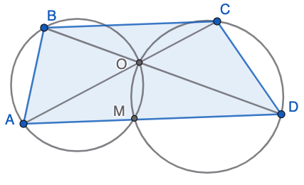
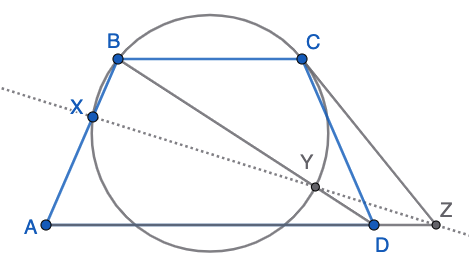
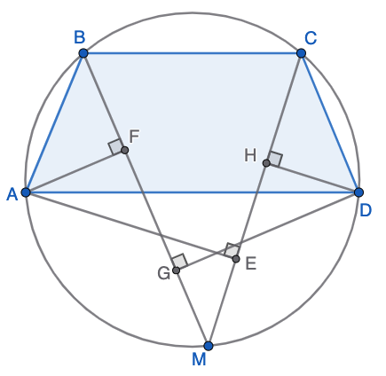
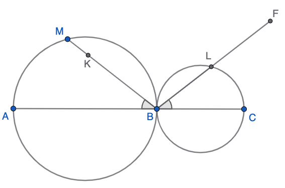

# Riņķa un četrstūra ģeometrija (2026-03-22) {-}

Ģeometrijas uzdevumiem vajadzīgā teorija ir atrodama [https://www.nms.lu.lv/olimpiades/valsts-olimpiade/](https://www.nms.lu.lv/olimpiades/valsts-olimpiade/) - sk. [šeit](https://www.nms.lu.lv/fileadmin/user_upload/lu_portal/projekti/nms.lu.lv/Dazadi/_matematikas_olimpiazu_programma_2022.pdf).

Biežāk vajadzīgie fakti: 

* Trijstūra iekšējo leņķu summa; apgalvojums, ka trijstūra ārējais leņķis vienāds ar divu atlikušo 
  iekšējo leņķu summu.
* Trijstūru vienādības un līdzības pazīmes. Pāriešana no vienas pazīmes uz citu -- piemēram, ja 
  divi trijstūri līdzīgi pēc pazīmes $\ell \ell$ (divi leņķi vienādi), tad var secināt, ka atbilstošo malu 
  attiecības ir vienādas (pazīme $mmm$).
* Vienādi leņķi paralelogramos un (vienādsānu) trapecēs. Simetrija (paralēlā pārnese, simetrija pret asi). 
* Leņķi pie paralēlām un krustiskām taisnēm (krustleņķi, blakusleņķi, iekšējie šķērsleņķi, kāpšļu leņķi).
* Teorēma par ievilktu leņķi (tas ir puse no centra leņķa, kas balstās uz to pašu loku). 
* Pazīmes, ka četrstūrim var apvilkt riņķa līniju: Pretējo leņķu summas ir $180^{\circ}$, arī 
  leņķi starp četrstūra malām un diagonālēm ir vienādi, ja tie balstās uz to pašu loku.

Seko 4 uzdevumi no [https://problems.ru/](https://problems.ru/).

## 1.uzdevums (#115458) {-}

Trapeces $ABCD$ diagonāles krustojas punktā $O$. Trijstūriem $AOB$ un $COD$ apvilktās 
riņķa līnijas krustojas punktā $M$ uz trapeces pamata $AD$. 
Pierādīt, ka $BMC$ ir vienādsānu trijstūris. 

{width=180pt}

## 2.uzdevums (#66148) {-}

Dota vienādsānu trapece $ABCD$ ar pamatiem $BC$ un $AD$. Riņķa līnija $\omega$ iet caur virsotnēm $B$ un $C$ un 
vēlreiz krusto malu $AB$ un diagonāli $BD$ attiecīgi punktos $X$ un $Y$. Pieskare, kas novilkta 
riņķa līnijai $\omega$ no punkta $C$, krusto $AD$ pagarinājumu punktā $Z$. 
Pierādīt, ka punkti $X, Y, Z$ atrodas uz vienas taisnes.

{width=180pt}

## 3.uzdevums (#116872) {-}

Dota vienādsānu trapece $ABCD$ ($AD \| BC$). Uz šai trapecei apvilktās riņķa līnijas loka $AD$ (kas nesatur punktus $B$ un $C$) izvēlēts punkts $M$.  Pierādīt, ka perpendikulu pamati, kas novilkti no virsotnēm $A$ un $D$ uz nogriežņiem $BM$ un $CM$, atrodas uz vienas riņķa līnijas.

{width=216pt}

## 4.uzdevums (#116180) {-}

Nogriežņa $AC$ iekšpusē izvēlēts punkts $B$ un novilktas riņķa līnijas ar diametriem $AB$ un $BC$. 
Uz šīm riņķa līnijām (vienā pusē taisnei $AC$) izvēlēti punkti $M$ un $L$ tā, ka 
$\sphericalangle MBA = \sphericalangle LBC$.  Punkti $K$ un $F$ atzīmēti attiecīgi 
uz stariem $BM$ un $BL$ tā, ka $BK = BC$ un $BF = AB$. Pierādīt, ka 
punkti $M$, $K$, $F$ un $L$ atrodas uz vienas riņķa līnijas. 

{width=288pt}

