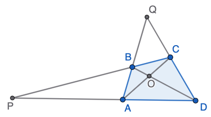
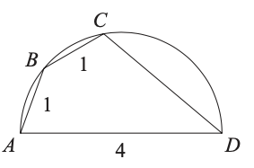
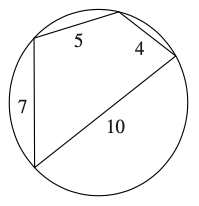
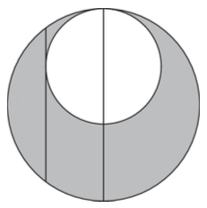

# Riņķa un ievilkto leņķu tests (2026-03-23) {-}

## 1.uzdevums {-}

Ap četrstūri $ABCD$ var apvilkt riņķa līniju, tā diagonāles krustojas punktā $O$, 
bet pretējo malu pagarinājumi $AD$ un $BC$ krustojas punktā $P$, bet $AB$ un $CD$ krustojas 
punktā $Q$. Ierakstīt katram no trijstūriem tam līdzīgu trijstūri ar virsotnēm dotajos punktos.

{width=180pt}

* Trijstūrim $AOD$ līdzīgs ir $\ldots$. 
* Trijstūrim $AOB$ līdzīgs ir $\ldots$. 
* Trijstūrim $PAB$ līdzīgs ir $\ldots$. 
* Trijstūrim $QBC$ līdzīgs ir $\ldots$. 

## 2.uzdevums {-}

Riņķa diametrs $AD$ ir $4$ vienības. Punkti $B$ un $C$ atrodas uz riņķa līnijas, un $AB = BC = 1$. 
Atrast $CD$ garumu.

{width=144pt}

## 3.uzdevums {-}

Ap četrstūri var apvilkt riņķa līniju. Brahmagupta (598–670 m. ē.) izveda šādu formulu 
riņķī ievilkta četrstūra laukuma $S$ aprēķināšanai, ja tā malu garumi ir $a$, $b$, $c$, $d$:  
$S = \sqrt{(p-a)(p-b)(p-c)(p-d)}$, kur $p$ ir četrstūra pusperimetrs.

{width=108pt}

Kāds ir četrstūra laukums, ja tā malu garumi ir $4$ cm, $5$ cm, $7$ cm un $10$ cm?

**(A)** $6\ \text{cm}^2$,
**(B)** $13\ \text{cm}^2$,
**(C)** $26\ \text{cm}^2$,
**(D)** $30\ \text{cm}^2$,
**(E)** $36\ \text{cm}^2$.

## 4.uzdevums {-}

Sešstūrim $UVWXYZ$ var apvilkt riņķa līniju; zināms, ka $\sphericalangle ZUV = 88^{\circ}$ un 
$\sphericalangle XYZ = 158^{\circ}$. Cik liels ir leņķis $\sphericalangle VWZ$?

**(A)** $92^{\circ}$, 
**(B)** $114^{\circ}$, 
**(C)** $120^{\circ}$, 
**(D)** $132^{\circ}$, 
**(E)** Nav iespējams noteikt. 

## 5.uzdevums {-}

Iekšējā riņķa līnijas diametrs ir daļa no ārējā riņķa līnijas diametra. 
Ārējai riņķa līnijai novilkta horda, kuras garums ir 16 vienības, tā ir 
paralēla abu riņķu kopīgajam diametram un pieskaras iekšējai riņķa līnijai 
(skat. attēlu). Kāds ir iekrāsotās figūras laukums?

{width=108pt}

**(A)** $36\pi$, 
**(B)** $49\pi$, 
**(C)** $64\pi$, 
**(D)** $81\pi$, 
**(E)** trūkst informācijas.

