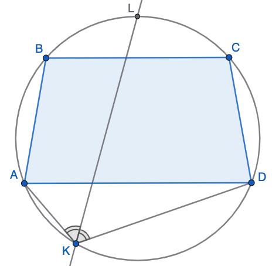
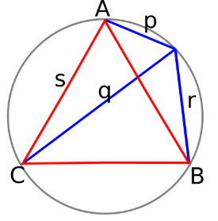

# Iesildīšanās pirms valsts olimpiādes (2026-03-28) {-}

## 1. uzdevums {-}

Ap trapeci $ABCD$ var apvilkt riņķa līniju. Uz loka $AD$, kas nesatur punktus $B$ un $C$, 
izvēlēts punkts $K$ tā, ka $AK < DK$. Novilkta leņķa $\sphericalangle AKD$ bisektrise, kas vēlreiz krusto 
trapecei apvilkto riņķa līniju punktā $L$. Kurš no apgalvojumiem ir patiess:

**(A)** $BL < CL$, **(B)** $BL > CL$, **(C)** $BL = CL$, **(D)** nepietiek informācijas.

{width=180pt}

::: solution
**Atrisinājums:**

Vienādi leņķi balstās uz vienāda garuma lokiem $AL$ un $DL$. 
Tā kā riņķa līniju var apvilkt tikai ap vienādsānu trapeci (kurai abās pusēs simetrijas asij 
leņķi pie pamata ir $\alpha$ un $180^{\circ} - \alpha$), tad arī loki $AB$ un $CD$ ir vienādi.

Iegūstam, ka vienādi ir arī loki $BL$ un $CL$, tāpēc tajos novilktās hordas $BL$ un $CL$ ir vienāda 
garuma, kas atbilst atbildei **(C)**. 
:::

## 2. uzdevums {-}

Ap vienādmalu trijstūri apvilkta riņķa līnija, uz šīs riņķa līnijas loka $AB$ atzīmēts punkts $K$, kura 
attālumi līdz vienādmalu trijstūra virsotnēm ir attiecīgi $p$, $q$ un $r$ (šeit $p$ un $q$ ir 
abi tuvākie attālumi -- attiecīgi līdz $A$ un $B$). 
Pierādīt, ka $q = p+r$. 

{width=180pt}

::: solution
**Atrisinājums:**

Sk. [Ptolemaja teorēma](https://en.wikipedia.org/wiki/Ptolemy%27s_theorem#Equilateral_triangle).
:::

## 3. uzdevums {-}

Divus naturālus skaitļus $n$ un $m$ sauc par *draudzīgiem*, ja 
$m^2+1$ dalās ar $n$ un arī $n^2 + 1$ dalās ar $m$.  
Atrast, cik ir draudzīgu naturālu skaitļu pāru, kam $m,n \leq 20$. 

::: solution
**Atrisinājums:**

Septiņi skaitļu pāri $(1;1)$, $(1;2)$, $(2;1)$, $(2;5)$, $(5;2)$, $(5;13)$ un $(13;5)$ apmierina doto sakarību. 

Ja $(a;b)$, kur $b < a$, ir draudzīgs pāris, tad 
aplūko pāri $(a; b')$, kur $a' = (b^2+1)/a$. 
Var pamatot, ka $a'$ ir vēl mazāks nekā $b$, turklāt arī pāris $(a';b)$ ir draudzīgs. 
Skaitļus samazina tikmēr, kamēr iegūst $(1;1)$.  
:::

## 4. uzdevums {-}

Definējam virkni $a_1=1$, $a_2 = 1$ un 
$a_{n+2}=3a_{n+1}−a_n$ visiem $n \ge 1$. 
Atrast atlikumu, ja $a_{2026}$ dala ar $8$. 

::: solution
**Atrisinājums:**

$$(1, 1), (1, 1), (2, 2), (5, 5), (13, 5), (34, 2), (89, 1), (233, 1), (610, 2), \dots$$

Katrs pārītis ir virknes loceklis $a_i$ un atlikums, dalot ar $8$. 
Redzams, ka $a_i$ ir Fibonači skaitļi (katrs otrais ir izlaists), bet 
atlikumi, dalot ar $8$ kļūst periodiski -- tie sāk atkārtoties tā, ka 
$a_7 \equiv a_1 \pmod{8}$ utt. (virkne ar periodu $6$). 

Tāpēc $a_{2026} \equiv a_{4} \pmod{8} \equiv 5 \pmod{8}$.
:::

## 5. uzdevums {-}

Alise uzzīmējusi uz papīra lapas piecus punktus $A,B,C,D,E$ un dažus no 
tiem savienojusi ar nogriežņiem. Zināms, ka iegūtais grafs ir koks 
(no katra punkta var tieši vienā veidā 
nokļūt uz katru citu, ejot pa novilktajiem nogriežņiem - t.i. grafs ir sakarīgs 
un tajā nav ciklu). 

Bobs vēlas uzminēt šo koku. Par katriem diviem punktiem 
$x,y \in \{ A,B,C,D,E \}$ viņš var Alisei pajautāt, vai tie ir savienoti ar nogriezni vai nē. 
Kāds ir mazākais jautājumu skaits, ar ko Bobam pietiek, lai atjaunotu visus nogriežņus
Alises zīmējumā?

::: solution
**Atrisinājums:**

Starp $A,B,C,D,E$ var novilkt pavisam $10$ nogriežņus (kombinācija pa $2$ no $5$), 
bet Bobam nav jājautā par diviem nogriežņiem, kuriem nav kopīgu punktu (piemēram, 
viņš var nejautāt par $AB$ un $CD$ - bet izsecināt, vai šīs šķautnes eksistē, no 
atbildēm uz citiem jautājumiem - ja pievienojot attiecīgi šķautni $AB$ vai $CD$ grafs 
kļūst sakarīgs. 

Piemēram, no $A$ un $B$ arī bez šķautnes $AB$ var aizbraukt uz $E$, 
tad šī šķautne jāpievieno. Ja arī bez šīs šķautnes var aizbraukt uz $E$, tad šo šķautni nedrīkst 
pievienot, lai neveidotos cikls. 
:::

## 6. uzdevums {-}

$10$ rūķīši kinoteātrī bija sasēdušies sēdvietās no $1$ līdz $10$; 
apzīmējam viņu secību ar $r_1, r_2, \dots, r_{10}$. 
Mežavecis kino neapmeklēja, bet viņš vēlas noskaidrot rūķīšu secību. 
Vienā gājienā viņš var nosaukt 
jebkuru skaitli $a \in [1;9]$ un tad rūķīši $r_a$ un $r_{a+1}$ abi paceļ rokas 
(bet viņi neatklāj, kurš no viņiem sēdēja pa kreisi). 
Cik gājieni Mežavecim nepieciešami, lai garantēti noteiktu rūķīšu secību?

::: solution
**Atrisinājums:**

Pietiek ar astoņiem jautājumiem.

Mežavecis var nosaukt pēc kārtas astoņus skaitļus $a = 2,3,4,5,6,7,8,9$.
Rūķītis, kurš vispār nepaceļ roku, ir $r_1$, tas, kurš paceļ roku pie $a = 2$, 
bet ne pie $a=3$ ir $r_2$ utt. 
:::

## 7. uzdevums {-}

Cik daudzi naturāli skaitļi $n$
($2 \leq n \leq 50$)
apmierina sakarību $\gcd⁡(n!+1,  (n+1)!+1)=1$ (kur $\gcd(a,b)$ apzīmē 
divu skaitļu lielāko kopīgo dalītāju). 

::: solution
**Atrisinājums:** 

Ja būtu kopīgs dalītājs $d > 1$ skaitļiem $n! + 1$ un $(n+1)! + 1$, tad arī 
starpība $(n+1)! + 1 - (n! + 1) = n! (n+1) - n! = n \cdot n!$ dalītos ar $d$. 
Bet $n! + 1$ un $n!$ nevar abi dalīties ar to pašu skaitli. 

Tāpēc vienmēr $\gcd⁡(n!+1,  (n+1)!+1)=1$, un šādu skaitļu $n$, 
kuriem  $\gcd⁡(n!+1,  (n+1)!+1)=1$, ir tieši $49$ (visi skaitļi intervālā $[2;50]$.). 
:::

## 8. uzdevums {-}

Katram naturālam skaitlim $n$ ar $f(n)$
apzīmējam lielāko $k$ vērtību, kurai 
$n!+60$ dalās ar $k!$. 
Atrast $f(10)+f(11)+f(12)+f(13)+f(14)$.

::: solution
**Atrisinājums:** 

$n! + 60$ visiem šiem skaitļiem dalās ar $3! = 6$. 
Bet nevienam $n \geq 10$ nevar būt $f(n) \geq 4$, jo 
$n!$ dalās ar $4! = 24$, bet $60$ nedalās ar $24$. 
Esam ieguvuši, ka $f(10) = \ldots = f(14) = 3$ jeb visu
piecu skaitļu summa ir $15$. 
:::

