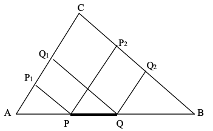
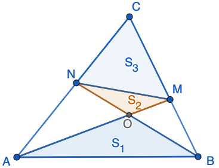
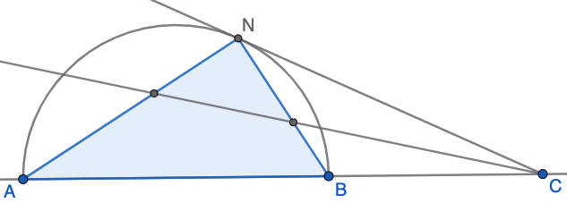
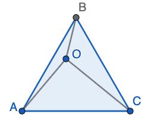
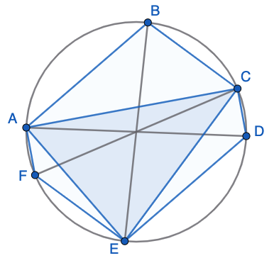
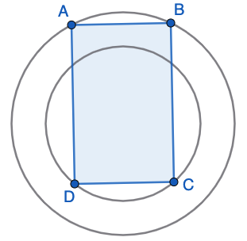

# Laukumi un citas metriskās sakarības (2026-03-30) {-}

## 1.uzdevums (LV.VOL.1990.9.4) {-}

Uz trijstūra $ABC$ malas $AB$ atzīmēts nogrieznis $PQ$ ar konstantu garumu $a$. 
Novilkti nogriežņi $PP_2 \parallel AC$, $QQ_2 \parallel AC$, 
$PP_1 \parallel BC$, $QQ_1 \parallel BC$. Pierādīt, 
ka trapeču $PP_1Q_1Q$ un $PP_2Q_2Q$ laukumu summa nav atkarīga no tā, 
kurā vietā uz malas $AB$ atzīmēts nogrieznis $PQ$.

{width=216pt}

## 2.uzdevums (LV.VOL.1991.9.4) {-}

Trijstūra $ABC$ laukums ir $S_0$. Punkti $M$ un $N$ ir attiecīgi malu $BC$ un 
$AC$ iekšējie punkti; taisnes nogriežņi $AM$ un $BN$ krustojas punktā $O$. 
Zināms, ka trijstūru $AOB$, $MON$ un $CMN$ laukumi ir attiecīgi $S_1$, 
$S_2$ un $S_3$. Pierādīt, ka $S_0 \cdot S_2 = S_1 \cdot S_3$.

{width=180pt}

## 3.uzdevums (LV.VOL.1992.9.5) {-}

Pusriņķa diametrs ir $AB$; uz tā pagarinājuma aiz punkta $B$ ņemts punkts $C$ 
un no tā novilkta pieskare $CN$. Pierādīt, ka leņķa $\sphericalangle NCA$ bisektrise atšķeļ 
no $ANB$ vienādsānu taisnleņķa trijstūri.

{width=306pt}

## 4.uzdevums (LV.VOL.1993.9.1) {-}

Vienādmalu trijstūra $ABC$ iekšpusē atrodas punkts $O$. Pierādīt, ka eksistē trijstūris, 
kura malas vienādas ar $OA$, $OB$ un $OC$.

{width=126pt}

## 5.uzdevums (LV.VOL.1993.9.3) {-}

Sešstūris $ABCDEF$ ievilkts riņķī, kura diametri ir $AD$, $BE$ un $CF$. Pierādīt, ka 
sešstūra $ABCDEF$ laukums divas reizes lielāks par trijstūra $ACE$ laukumu.

{width=198pt}

## 6.uzdevums (LV.VOL.1995.9.3) {-}

Divu koncentrisku riņķa līniju rādiusi ir $R$ un $r$ ($R > r$). Taisnstūra $ABCD$ 
virsotnes $A$ un $B$ atrodas uz lielākās riņķa līnijas, $C$ un $D$ — uz mazākās.  
**(A)** Kāds ir lielākais iespējamais taisnstūra $ABCD$ laukums?  
**(B)** Atrast, kādi šajā gadījumā ir tā malu garumi!

{width=162pt}

