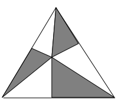
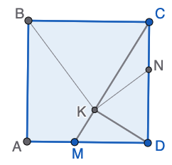
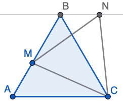
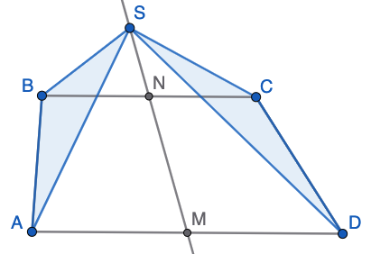
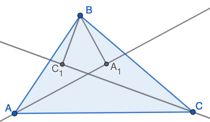

# Daudzstūri un nogriežņi (2026-04-27) {-}

## 1. uzdevums (LV.VOL.1996.9.3) {-}

Uz trijstūra $ABC$ malām $BC$, $AC$, $AB$ ņemti attiecīgi punkti $D$, $E$, $F$, kas atšķiras
no virsotnēm. Nogriežņi $AD$, $BE$, $CF$ ir vienādi un krustojas vienā punktā $O$. Pierādīt,
ka $OA + OB + OC = 2 \cdot (OD + OE + OF)$. 

## 2. uzdevums (LV.VOL.1997.9.4) {-}

Vienādmalu trijstūra iekšpusē ņemts punkts un savienots ar visām virsotnēm.
Bez tam no šī punkta novilkti perpendikuli pret visām trijstūra malām. 
Pierādīt, ka iesvītroto un neiesvītroto trijstūru laukumu summas ir vienādas. 

{ width=108pt }

## 3. uzdevums (LV.VOL.1998.9.4) {-}

Uz kvadrāta $ABCD$ malas $AD$ ņemts punkts $M$, bet uz malas $CD$ -- punkts $N$ tā,
ka $DM = DN$. No $D$ novilkts perpendikuls pret $MC$; perpendikula pamats ir $K$.
Pierādīt, ka $\sphericalangle BKN = 90^{\circ}$. 

{ width=108pt }

## 4. uzdevums (LV.VOL.1999.9.2) {-}

Dots, ka $ABC$ -- vienādmalu trijstūris, $M$ malas $AB$ iekšējais punkts, $CMN$ --
vienādmalu trijstūris, pie tam $B$ un $N$ atrodas vienā pusē no taisnes $CM$. 
Pierādīt, ka $BN \| AC$. 

{ width=108pt }

## 5. uzdevums (LV.VOL.1999.9.4) {-}

Trapeces $ABCD$ pamatu $AD$ un $BC$ viduspunkti ir atbilstoši $M$ un $N$. Uz taisnes
$MN$ ņemts punkts $S$, kas neatrodas ne uz vienas sānu malas pagarinājuma. Pierādīt, ka
trijstūru $ABS$ un $CDS$ laukumi ir vienādi. 

{ width=180pt }

## 6. uzdevums (LV.VOL.2000.9.3) {-}

No trijstūra $ABC$ virsotnes $B$ novilkti perpendikuli pret
trijstūra leņķu $A$ un $C$ bisektrisēm; šo perpendikulu pamati ir
attiecīgi $A_1$ un $C_1$. Pierādīt, ka $2 \cdot A_1C_1 = AB + BC - AC$. 

{ width=180pt }

