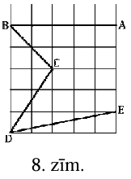
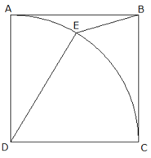

# <lo-sample/> LV.AMO.2014.9.3

Trijstūrī $ABC$ leņķis $\sphericalangle ABC=90^{\circ}$. Punkti $M$ un $N$ ir
attiecīgi nogriežņu $AC$ un $AM$ viduspunkti. Caur $B, M$ un $N$ vilktā riņķa
līnija krusto malas $AB$ un $BC$ attiecīgi to iekšējos punktos $P$ un $Q$.
Zināms, ka $AC \| PQ$. Aprēķināt $\sphericalangle BAC$ vērtību!

# <lo-sample/> LV.AMO.2019.9.3

Dots vienādsānu taisnleņķa trijstūris $ABC$ ar taisno leņķi $C$. Uz tā 
hipotenūzas konstruēts taisnstūris $ABNM$ tā, ka punkti $C$ un $N$ atrodas 
dažādās pusēs no taisnes $AB$ un $AC=AM$. Nogrieznis $CM$ krusto $AB$ punktā 
$P$. Punkts $L$ ir malas $MN$ viduspunkts. Nogrieznis $CL$ krusto $PN$ punktā 
$Q$. Pierādīt, ka **(A)** trijstūris $CBP$ ir vienādsānu; **(B)** četrstūris 
$QNBC$ ir rombs!

# <lo-sample/> LV.AMO.2007.9.2

Dots, ka $\triangle ABC$ ir regulārs. Punkts $P$ atrodas uz $ABC$ apvilktās 
riņķa līnijas (skat. 1.zīm.) Taisnes, kas caur $P$ vilktas paralēli 
$AB,\ BC$ un $CA$, krusto atbilstoši taisnes $BC,\ AC$ un $AB$ attiecīgi 
punktos $M,\ K$ un $N$. Pierādīt, ka $\sphericalangle BMN=\sphericalangle BMK$

# <lo-sample/> LV.AMO.2014.8.4

Rūtiņu lapā rūtiņu virsotnēs atzīmēti punkti $A, B, C, D, E$ un novilkti
nogriežņi $AB, BC, CD$ un $DE$ (skat. 8.zīm.). Kurš no leņķiem
$\sphericalangle ABC$ un $\sphericalangle CDE$ ir lielāks?

# <lo-sample/> LV.AMO.2015.9.4

Vienādsānu trapeces $ABCD$ sānu malas ir $AB$ un $CD$, bet diagonāles $AC$ un
$BD$ krustojas punktā $E$. Ap trijstūri $CDE$ apvilktā riņķa līnija krusto
garāko pamatu $AD$ iekšējā punktā $F$. Nogriežņu $CF$ un $BD$ krustpunkts ir
$G$. Nosaki $\sphericalangle CGD$ lielumu, ja $\sphericalangle CAD=\alpha$!

# <lo-sample/> LV.NOL.2011.9.2

Kvadrātā $ABCD$ ir ievilkts riņķa līnijas loks $AC$ (riņķa līnijas centrs ir $D$, bet
rādiuss $DA$; skat.zīm.). Uz loka $AC$ atzīmēts tāds punkts $E$, ka
$\sphericalangle ADE=2 \sphericalangle ABE$. Aprēķināt $\sphericalangle ABE$ lielumu.

# <lo-sample/> LV.AMO.2006.9.3

Dots, ka $\triangle ABC$ ir regulārs. Punkts $P$ atrodas uz $ABC$ apvilktās 
riņķa līnijas (skat. 1.zīm.) Taisnes, kas caur $P$ vilktas paralēli 
$AB,\ BC$ un $CA$, krusto atbilstoši taisnes $BC,\ AC$ un $AB$ attiecīgi 
punktos $M$, $K$ un $N$. Pierādīt, ka $\sphericalangle BMN=\sphericalangle BMK$

# <lo-sample/> LV.NOL.2004.9.3

Riņķa līnijas $W_{1}$ diametram $AB$ pieskaras otra riņķa līnija $W_{2}$, kuras
centrs atrodas uz $W_{1}$. Pierādīt: pieskares, kas no $A$ un $B$ vilktas riņķa
līnijai $W_{2}$ un kas nesakrīt ar $AB$, ir paralēlas savā starpā.

# <lo-sample/> LV.NOL.2017.8.4

Uz kvadrāta $ABCD$ malām atzīmēti punkti $E, F, G$ un $H$ tā, ka
$\frac{AE}{EB}=\frac{BF}{FC}=\frac{CG}{GD}=\frac{DH}{AH}=9$. Aprēķināt
iekrāsotās daļas (skat. 23.att.) laukuma attiecību pret $ABCD$ laukumu!

# <lo-sample/> LV.AMO.2017.7.3

Divus taisnstūra lapas stūrus nolocīja tā, kā parādīts 15.att. Izrādījās, ka 
lapas apakšējā mala tika sadalīta trīs vienāda garuma nogriežņos un augšējā 
mala - divos vienāda garuma nogriežņos. Pierādīt, ka iekrāsotais trijstūris ir 
vienādmalu!

# <lo-sample/> LV.AMO.2017.8.3

Taisnstūrveida papīra lapu pārlocīja tā, ka pārlocītais lapas stūris atrodas uz
pretējās malas (skat. 20.att.). Trijstūri $AFE$ un $CBE$ ir vienādi un 
$CB=7~\mathrm{cm}$, bet $BD=3~\mathrm{cm}$. Kādi ir sākotnējās papīra lapas 
malu garumi?

# <lo-sample/> LV.NOL.2020.9.3

Divas riņķa līnijas $\omega_{1}$ un $\omega_{2}$ iekšēji pieskaras punktā $A$ 
($\omega_{2}$ atrodas $\omega_{1}$ iekšpusē) un $\omega_{1}$ centrs neatrodas 
$\omega_{2}$ iekšpusē. Riņķa līnijas $\omega_{1}$ diametrs $AB$ šķērso 
$\omega_{2}$ punktā $C$. Zināms, ka $\omega_{1}$ hordas $DE$, kas iet caur $C$ 
perpendikulāri $AB$, garums sakrīt ar $BC$ garumu. Aprēķināt $\omega_{1}$ un 
$\omega_{2}$ diametru garumu attiecību $\frac{AB}{AC}$.

# <lo-sample/> LV.AMO.2004.9.3

Dots, ka $ABCD$ - kvadrāts, bet $w$ - riņķa līnija, kas iet caur $A$ un $B$; 
punkti $C$ un $D$ atrodas $w$ iekšpusē. Stari $BD$ un $BC$ krusto $w$ attiecīgi
punktos $E$ un $F$. Apzīmējam $CF$ viduspunktu ar $M$. Pierādīt, ka 
$EM \perp BC$.

# <lo-sample/> LV.AMO.2013.9.5

Dots izliekts četrstūris. Uzzīmēti četri riņķi, kuru diametri ir četrstūra 
malas. Pierādīt, ka šie riņķi pilnībā pārklāj doto četrstūri.

# <lo-sample/> LV.AMO.2014.5.3

Taisnstūra $ABCD$ malu garumi izsakāmi veselos centimetros. Iekrāsotās daļas
laukums ir $6~ \mathrm{cm}^{2}$ (skat. 1.zīm.). Nogrieznis $AE$ ir
$\frac{1}{3}$ no taisnstūra malas $AD$. Aprēķini taisnstūra laukumu un
perimetru, ja zināms, ka viena taisnstūra mala ir par $5~ \mathrm{cm}$ garāka
nekā otra mala.

# <lo-sample/> LV.NOL.2012.7.5

Vienādmalu trijstūris ar malas garumu $4$ sadalīts $16$ vienādos trijstūros 
(skat. 3.zīm.).

Katrā mazajā trijstūrī ir ierakstīts viens skaitlis, pavisam ierakstīti septiņi
trijnieki un deviņi piecinieki.

Pierādīt, ka var izvēlēties četrus trijstūrus, kas veido vienādmalu trijstūri 
ar malas garumu $2$ un kuros ierakstīto skaitļu summa ir vismaz $18$.

# <lo-sample/> LV.NOL.2012.8.5

Uzzīmēt figūru, kuru var sadalīt vienādos "stūrīšos" (skat. 4.zīm.) tieši divos
dažādos veidos. "Stūrīši" var būt pagriezti arī citādāk. (Divi sadalījumi, kas 
iegūstami viens no otra pagrieziena rezultātā vai ir viens otra spoguļattēls, 
uzskatāmi par vienādiem.)

# <lo-sample/> LV.NOL.2021.9.3

Uz kvadrāta $ABCD$ malas $AD$ izvēlēts punkts $E$ tā, ka $AB+AE=CE$. 
Aprēḳināt $S_{CED}$, ja $AB=1$.

# <lo-sample/> LV.NOL.2023.7.3

Dots četrstūris $ABCD$, kuram visi leņķi ir mazāki nekā 
$180^{\circ}$, $\sphericalangle A=\sphericalangle B$, $BC=1$ 
un $AD=3$. Pierādīt, ka $CD>2$.

# <lo-sample/> LV.AMO.2012.7.5

Figūriņa zilonis var pārvietoties vienu rūtiņu uz augšu, vienu rūtiņu pa labi vai vienu
rūtiņu pa diagonāli (skat. 2.zīm.). Cik dažādos veidos zilonis no rūtiņas $A$ var
nokļūt rūtiņā $B$ (skat. 3.zīm.)? Iekrāsotajā rūtiņā ir šķērslis, tajā zilonis nedrīkst
iet.

# <lo-sample/> LV.AMO.2014.9.1

Kvadrātā, kura malas garums ir $2$, ievilkts riņķis un šajā riņķī ievilkts
kvadrāts (skat. 10.zīm.). Aprēķināt iekrāsoto daļu laukumu summu!

# <lo-sample/> LV.NOL.2011.6.4

Sagriez zīmējumā redzamo figūru pa rūtiņu malām četrās gan pēc formas, gan pēc laukuma
vienādās daļās tā, lai katrā no tām būtu pa vienam melnam un pa vienam baltam aplītim.

# <lo-sample/> LV.NOL.2025.7.3

Uz trijstūra $ABC$ malas $AC$ atzīmēts punkts $M$, bet uz 
malas $AB$ atzīmēts punkts $N$ tā, ka $\sphericalangle BNC = 4x$, 
$\sphericalangle BCN = 6x$ un $\sphericalangle BMC = \sphericalangle CBM = 5x$. 
Pierādīt, ka trijstūra $ABC$ divi leņk̦i ir vienādi!

# <lo-sample/> LV.NOL.2021TEST.8.18

Nosaki leņķu $\alpha$ un $\beta$ summu (grādos)! 

{ width=150px }

# <lo-sample/> LV.AMO.2009.9.3

Uz taisnes $t$ novietots stienītis ar garumu $1$. Sākumā tā gali atrodas 
punktos $A$ un $B$. Stienīti bīda pa plakni tā, ka tas visu laiku paliek 
paralēls taisnei $t$ un beigās atkal nonāk uz $t$; šai brīdī tā gali atrodas 
punktos $C$ un $D$. Turklāt ceļiem, pa kuriem kustas stienīša gali, nav kopīgu 
punktu. Vai var gadities, ka $AC>2009$? (**Piezīme:** uzskatām, ka stienītis ir
paralēls $t$ arī tad, ja tas atrodas uz $t$)

# <lo-sample/> LV.NOL.2017.6.4

Uz rūtiņu lapas uzzīmē tādu trijstūri $ABC$, lai vienlaicīgi izpildītos šādi
nosacījumi:

- visas trijstūra virsotnes atrodas rūtiņu krustpunktos;
- punkts $X$ ir nogriežņa $AB$ viduspunkts;
- punkts $Y$ ir nogriežņa $AC$ viduspunkts;
- nogriežņi $BY$ un $CX$ krustojoties veido $90^{\circ}$ lielu leņķi.

*Piezīme.* Nogriežņa viduspunkts ir tāds punkts, kas sadala nogriezni divos
vienāda garuma nogriežnoos.

# <lo-sample/> LV.NOL.2022.7.1

Aprēķināt laukumu četrstūrim, kuru ierobežo taisnes
 $y=1, x=-2, x=3, y=\frac{3}{5} x+\frac{21}{5}$.

# <lo-sample/> LV.AMO.2011.7.4

Kvadrāts sadalīts piecos taisnstūros tā, ka šo taisnstūru malu garumi 
centimetros ir visi naturālie skaitļi no $1$ līdz $10$. Parādi vienu piemēru, 
kā to var izdarīt!

# <lo-sample/> LV.AMO.2014.6.4

Kvadrāts, kura malas garums ir $4~\mathrm{m}$, sagriezts taisnstūros, kā
parādīts 3.zīm. Četru izcelto nogriežņu garumu summa ir $2~\mathrm{m}$.
Aprēķināt iekšējā taisnstūra perimetru!

# <lo-sample/> LV.AMO.2022A.5.3

No taisnstūra ar izmēriem $6 \times 7$ rūtiņas izgriez sešas 3.att. 
redzamās figūras! Griezuma līnijām jāiet pa rūtiņu malām, 
figūras var būt pagrieztas vai apgāztas otrādi.

# <lo-sample/> LV.AMO.2022A.7.3

Vai taisnstūri ar izmēriem $3 \times 3370$ rūtiņas var noklāt ar 8.att. 
redzamām figūrām tā, lai paliktu tieši $2022$ nenoklātas rūtiņas? Dotās figūras
malām jāiet pa rūtiņu līnijām, tā var būt pagriezta vai apgriezta spoguļattēlā,
figūras nedrīkst pārklāties vai iziet ārpus taisnstūra.

# <lo-sample/> LV.AMO.2022B.6.2

Parādi, kā no 1. att. dotās rūtiņu lapas var izgriezt desmit figūras, 
kādas dotas 2. att. (iezīmē, kur jāiet griezuma līnijām)! 
Figūras var būt arī pagrieztas.  

# <lo-sample/> LV.AMO.2023.6.3

No četrām tādām figūrām, kāda dota 9. att., uzzīmē figūru, kurai ir tieši: **(A)** $2$ simetrijas asis;
**(B)** $4$ simetrijas asis!

*Piezīme.* Figūru, kas dota 9. att., drīkst pagriezt un apmest otrādi. Uzzīmētajai figūrai var būt arī
caurumi. Figūrai jābūt saistītai, tas ir, no figūras katras rūtiņas jābūt iespējai aiziet uz jebkuru citu šīs
figūras rūtiņu, ejot tikai pa šīs figūras rūtiņām, katru reizi pārejot no attiecīgās rūtiņas uz blakus rūtiņu,
ar ko tai ir kopīga mala.

# <lo-sample/> LV.AMO.2023.7.3

No četrām tādām figūrām, kāda dota 12. att., uzzīmē figūru, kurai ir tieši: 
**(A)** $2$ simetrijas asis;
**(B)** $4$ simetrijas asis!  
*Piezīme.* Figūru, kas dota 12. att., drīkst pagriezt. 
Uzzīmētajai figūrai var būt arī caurumi. Figūrai jābūt
saistītai, tas ir, no figūras katras rūtiņas jābūt iespējai 
aiziet uz jebkuru citu šīs figūras rūtiņu, ejot tikai
pa šīs figūras rūtiņām, katru reizi pārejot no attiecīgās 
rūtiņas uz blakus rūtiņu, ar ko tai ir kopīga mala.

# <lo-sample/> LV.NOL.2004.5.3

Katra kuba skaldne sadalīta $4$ vienādos kvadrātiņos. Vai kuba virsmu var 
pilnībā aplīmēt ar sešām tādām figūrām, kāda redzama 1.zīm.? (Rūtiņas, no kurām
sastāv šī figūra, ir tikpat lielas kā tās, kurās sadalīta kuba virsma.)

# <lo-sample/> LV.NOL.2005.9.3

Divas riņķa līnijas ar rādiusiem $R$ un $r$ ārēji pieskaras viena otrai punktā 
$A$. Taisne $t$ pieskaras abām riņķa līnijām punktā $A$ un krusto to kopējās 
ārējās pieskares punktos $K$ un $L$.

**(A)** pierādīt, ka $MK=KN$ (skat. 1.zīm.);

**(B)** izteikt $KL$ ar $R$ un $r$.

# <lo-sample/> LV.NOL.2012.8.4

Uzzīmēt plaknē sešus punktus tā, lai no katra uzzīmētā punkta tieši trīs citi 
uzzīmētie punkti atrastos tieši $1~\mathrm{cm}$ attālumā.

# <lo-sample/> LV.NOL.2015.5.3

Rihards ir izcepis interesantas formas torti, kuras pamatā ir $17$ kvadrātveida
cepumi (skat. 1.att.). Parādi vienu veidu, kā torti sadalīt četros pēc formas 
vienādos gabalos, lai katrs saturētu tieši četrus cepumus, un gabaliņš ar vienu
cepumu paliktu pāri. Tā kā tortes augšpuse ir izdekorēta, tad gabalus drīkst 
grozīt, bet nedrīkst apmest otrādi.

# <lo-sample/> LV.NOL.2018.5.3

Sadali 1.att. doto figūru $8$ vienādās daļās, tā, lai dalījuma līnijas ietu pa 
rūtiņu malām!

*Piezīme.* Daļas var būt pagrieztas vai apmestas otrādi attiecībā 
viena pret otru. Divas figūras sauc par vienādām, ja tās var uzlikt vienu uz 
otras tā, ka abas figūras pilnīgi sakrīt.

# <lo-sample/> LV.NOL.2021TEST.6.16

Cik trijstūri redzami dotajā zīmējumā?

{ width=100px }

# <lo-sample/> LV.NOL.2023.6.3

Parādi, kā, griežot pa rūtiņu līnijām, 1.att. doto figūru var sagriezt 
$4$ vienādās figūrās! Figūras ir vienādas, ja tās var uzlikt vienu uz 
otras tā, ka abas figūras pilnīgi sakrīt (figūras var pagriezt un apmest otrādi).

{ width=200px }

# <lo-sample/> LV.AMO.2011.5.3

Parādi, kā kvadrātu var sadalīt vairākos platleņķa trijstūros!

# <lo-sample/> LV.AMO.2012.5.2

Parādi, kā kvadrātu var sadalīt vairākos platleņķa trijstūros. (Trijstūri sauc par
platleņķa trijstūri, ja tam ir viens plats leņķis un divi šauri leņķi.)

# <lo-sample/> LV.AMO.2012.6.2

Sadali kvadrātu divos vienādos **(A)** sešstūros, **(B)** septiņstūros.

# <lo-sample/> LV.AMO.2016.5.4

Sadali 1.att. redzamo figūru trīs daļās, no kurām var salikt kvadrātu! Saliekot
daļas nedrīkst pārklāties, daļas drīkst pagriezt, bet nedrīkst apgāzt otrādi.

# <lo-sample/> LV.AMO.2019.6.4

Parādi, kā no taisnstūra ar izmēriem $6 \times 10$ rūtiņas var izgriezt **(A)** 
$9$, **(B)** $10$ figūras, kādas redzamas 9.att.! Figūras var būt pagrieztas vai
apgāztas otrādi.

# <lo-sample/> LV.AMO.2024.6.4

Parādi, kā griežot pa rūtiņu līnijām, 7. att. doto figūru var 
sagriezt divās vienādās daḷās. Daḷas ir vienādas, ja tās 
pagriežot vai apmetot otrādi var uzlikt vienu uz otras tā, 
ka tās sakrīt.

# <lo-sample/> LV.NOL.2006.5.3

Parādīt, ka trijstūri var sagriezt **(A)** četros, **(B)** sešos trijstūros tā,
ka neviena griežot iegūtā trijstūra mala pilnībā nesakrīt ne ar vienu citu 
griežot iegūtā trijstūra malu.

# <lo-sample/> LV.NOL.2012.5.2

Cik rūtiņas liels ir kvadrāta $ABCD$ laukums (skat. 1.zīm.)?

# <lo-sample/> LV.NOL.2013.5.2

Parādi, kā kvadrātu var sadalīt četros vienādos piecstūros.

# <lo-sample/> LV.NOL.2016.7.3

No trīs dotajām figūrām (skat. 7.att.) saliec simetrisku daudzstūri un uzzīmē 
arī simetrijas asi! Figūras drīkst būt pagrieztas vai apgrieztas spoguļattēlā.

*Piezīme.* Figūra ir simetriska, ja to var pārlocīt tā, ka tās abas puses 
sakrīt.

# <lo-sample/> LV.NOL.2020.6.1

Doti trīs kvadrāti ar laukumiem attiecīgi $1~\mathrm{m^{2}}, 4~\mathrm{m^{2}}$ 
un $9~\mathrm{m^{2}}$. Kvadrāti salikti viens virs otra tā, kā parādīts 9.att. 
Aprēķini iegūtās figūras perimetru!

# <lo-sample/> LV.NOL.2020.6.3

Izmantojot divas 11.att. un četrpadsmit 12.att. figūras, saliec taisnstūri ar 
izmēriem $10 \times 9$ tā, lai 11.att. figūras nesaskartos! Figūras drīkst 
pagriezt.

# <lo-sample/> LV.NOL.2021TEST.5.8

Cik krustpunktu ir trīs dotajām taisnēm (skat. att.)? 

{ width=150px }

# <lo-sample/> LV.NOL.2021TEST.6.5

Cik krustpunktu ir četrām dotajām taisnēm (skat. att.)?

{ width=150px }

# <lo-sample/> LV.NOL.2021TEST.6.13

Baiba uz galda no vairākiem vienādiem klucīšiem salika figūru 
(skat. 1.att.). No cik klucīšiem sastāv izveidotā figūra, 
ja zināms, ka no augšas tā izskatās, kā parādīts 2.att.?

{ width=150px }

# <lo-sample/> LV.NOL.2021TEST.7.3

Zīmējumā (skat. zemāk) bija uzzīmēti vairāki kvadrāti, bet 
Jevgēnijs izdzēsa kvadrātu malas tā, ka palika redzamas 
tikai visas kvadrātu virsotnes. Cik kvadrāti ar dotajām 
virsotnēm bija attēloti sākotnējā zīmējumā?

{ width=100px }

# <lo-sample/> LV.NOL.2021TEST.7.15

Sākotnēji klucǐši bija sakārtoti kubā ar malas garumu $4$ klucīši, taču 
kāds dažus klucǐšus aiznesa prom. Cik klucǐši tika aiznesti prom, ja 
tagadējais klucǐšu izkārtojums redzams attēlā? 

{ width=120px }

# <lo-sample/> LV.NOL.2021TEST.7.21

Kāds ir nogriežņa $AB$ garums centimetros, ja punkti $A$ un $B$ atrodas rinķa 
līniju centros un taisnstūra $LMNO$ perimetrs ir $112~\mathrm{cm}$?

{ width=180px }

# <lo-sample/> LV.NOL.2021TEST.8.5

Zīmējumā uz rūtiņu lapas (skat. zemāk) bija attēloti vairāki kvadrāti, 
bet laika gaitā kvadrātu malas izdzisa un palika redzamas 
tikai visas kvadrātu virsotnes. Cik kvadrāti ar dotajām virsotnēm bija attēloti sākotnējā zīmējumā?

{ width=100px }

# <lo-sample/> LV.NOL.2023.5.3

Parādi, kā 2.att. figūru ($6 \times 8$ rūtiņu taisnstūris, 
no kura izgriezts $3 \times 4$ rūtiņu taisnstūris), griežot pa 
rūtiņu līnijām, var sagriezt trīs vienādās figūrās! Figūras ir vienādas, 
ja tās var uzlikt vienu uz otras tā, ka abas figūras sakrīt 
(figūras var pagriezt un apmest otrādi).

{ width=200px }

# <lo-sample/> LV.NOL.2024.5.3

Dots kvadrāts ar izmēriem $6 \times 6$ rūtiṇas, kurā dažas rūtiṇas atzīmētas ar 
"$o$" un "$x$ " (skat. 3. att.). Parādi, kā šo kvadrātu sagriezt pa rūtiṇu līnijām 
četrās vienādās daļās tā, lai katra dạla saturētu vienu rūtiṇu, kurā ierakstīts "$o$", 
un vienu rūtiṇu, kurā ierakstīts "$x$"!

*Piezīme.* Figūras ir vienādas, ja tās var uzlikt vienu uz otras tā, ka abas figūras 
sakrīt (figūras var pagriezt un apmest otrādi).

# <lo-sample/> LV.NOL.2024.6.3

Dots kvadrāts ar izmēriem $6 \times 6$ rūtiṇas, kurā dažas rūtinas atzīmētas ar 
"$o$" un " $x$ " (skat. 11. att.). Parādi, kā šo kvadrātu sagriezt pa rūtiṇu 
līnijām četrās vienādās dalās tā, lai katra daḷa saturētu vienu rūtiṇu, 
kurā ierakstīts "$o$", un vienu rūtinu, kurā ierakstīts "$x$"!

*Piezīme.* Figūras ir vienādas, ja tās var uzlikt vienu uz otras tā, 
ka abas figūras sakrīt (figūras var pagriezt un apmest otrādi).

# <lo-sample/> LV.NOL.2024.7.4

No 15. att. un 16. att. figūrām, katru izmantojot vismaz vienu reizi, 
salikt taisnstūri, kurā 16. att. figūras nesaskaras ne ar malu, ne ar stūri! Figūras drīkst pagriezt.

# <lo-sample/> LV.AMO.2008.5.3

Kvadrāts sastāv no $5 \times 5$ vienādām kvadrātiskām rūtiņām. Parādiet, ka 
visas rūtiņas var pārsvītrot ar četrām taisnēm, kuras neiet caur rūtiņu 
stūriem.

# <lo-sample/> LV.AMO.2012.5.5

Sadali 1.zīmējumā attēloto figūru trīs vienādās figūrās. (Figūru un tās spoguļattēlu
saucam par vienādām figūrām.)

# <lo-sample/> LV.AMO.2013.8.2

Dots trijstūris $ABC$ un punkts $P$ tā iekšpusē. Pierādi, ka attālumu summa no 
punkta $P$ līdz dotā trijstūra virsotnēm ir lielāka nekā puse no trijstūra 
perimetra.

# <lo-sample/> LV.AMO.2013.8.4

Vai regulāru sešstūri var sadalīt **(A)** deviņos; **(B)** astoņos vienādos 
daudzstūros?

# <lo-sample/> LV.AMO.2016.6.5

Sadali 7.att. redzamo figūru trīs pilnīgi vienādās (gan pēc formas, gan pēc
laukuma) daļās! Gabali attiecībā viens pret otru drīkst būt gan pagriezti, gan
"apmesti otrādi".

# <lo-sample/> LV.AMO.2022B.7.3

Parādi, kā plaknē novilkt $6$ taisnes un uz tām atlikt $7$ punktus tā, 
lai uz katras no taisnēm būtu atzīmēti tieši trīs punkti!

# <lo-sample/> LV.NOL.2021TEST.5.12

Ilze uz galda no vairākiem vienādiem klucīšiem salika 
figūru (skat. 1.att.). No cik klucīšiem sastāv izveidotā 
figūra, ja zināms, ka no augšas tā izskatās, kā parādīts 2.att.?

{ width=200px }

# <lo-sample/> LV.NOL.2021TEST.5.16

Flīzes raksts veidots no četriem pusriņķiem (skat.att. vienu flīzi). 
Kāds ir flīzes perimetrs centimetros, ja pusriņķa rādiuss ir $4~\mathrm{cm}$?

{ width=100px }

# <lo-sample/> LV.NOL.2021TEST.6.17

Kāds ir taisnstūra perimetrs, ja riņķa līnijas rādiuss ir $4~\mathrm{cm}$?

{ width=120px }

# <lo-sample/> LV.NOL.2021TEST.7.9

Cik krustpunktu ir trīs dotajām taisnēm un staram (skat.att.)

{ width=150px }

