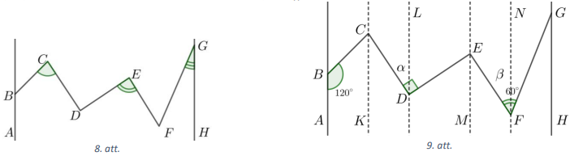

# <lo-sample/> LV.AMO.2005.8.4

Trijstūrī $ABC$ pastāv sakarības $AC=BC$ un $\sphericalangle ACB=20^{\circ}$. 
Leņķa $CAB$ bisektrise un malas $AC$ vidusperpendikuls krustojas punktā $M$. 
Aprēķināt

**(A)** $\sphericalangle MCB$, **(B)** $\sphericalangle MBC$.

# <lo-sample/> LV.AMO.2007.8.2

Trijstūrī $ABC$ pastāv sakarības $AC=BC$ un $\sphericalangle ACB=20^{\circ}$. 
Leņķa $CAB$ bisektrise un malas $AC$ vidusperpendikuls krustojas punktā $M$. 
Aprēķināt **(A)** $\sphericalangle MCB$, **(B)** $\sphericalangle MBC$.

# <lo-sample/> LV.NOL.2024.9.1

Dots izliekts četrstūris $K L M N$. Zināms, ka $\sphericalangle LKN = \sphericalangle MNK$ 
un malu $K L$ un $M N$ vidusperpendikulu krustpunkts $X$ atrodas uz malas $K N$. Pierādīt, ka $K M=L N$!

# <lo-sample/> LV.NOL.2017.7.4

Trijstūrī $ABC(AB < BC)$ novilkta bisektrise $BD$. Uz $BD$ izvēlēts tāds punkts
$F$, ka $\sphericalangle AFD=\sphericalangle ADF$, un uz $BC$ izvēlēts tāds
punkts $E$, ka $FE || AC$. Pierādīt, ka
$\sphericalangle BAF=\sphericalangle BEF!$

# <lo-sample/> LV.AMO.2023.9.3

Trijstūrī viens leņķis ir par $120^{\circ}$ lielāks nekā otrs. 
Pierādīt, ka bisektrise, kas vilkta no trešā leņķa
virsotnes, ir divas reizes garāka nekā augstums no tās pašas virsotnes!

# <lo-sample/> LV.AMO.2017.9.3

Dots trijstūris $ABC$, kuram $AB>AC>BC$. Virsotnes $A$ blakusleņķa bisektrise 
krusto malas $BC$ pagarinājumu punktā $D$, bet virsotnes $C$ blakusleņķa 
bisektrise krusto malas $AB$ pagarinājumu punktā $E$. Zināms, ka $AD=AC=CE$. 
Aprēķināt trijstūra $ABC$ leņķus!

# <lo-sample/> LV.AMO.2024.8.4

Uz riņk̦a līnijas ar centru $O$ ir atlikti punkti 
$A, B$ un $C$ tā, lai punkts $O$ atrastos trijstūrī $ABC$. 
Pie tam zināms, ka $\sphericalangle AOC=\alpha$, bet 
$\sphericalangle OAB=\beta$. Izteikt leņķi 
$\sphericalangle BCO$ ar $\alpha$ un $\beta$!

# <lo-sample/> LV.NOL.2013.8.2

Trijstūrī $ABC$ novilkts augstums $BH$, bisektrise $BL$ un mediāna $BM$. Zināms,
ka punkts $L$ atrodas starp punktiem $M$ un $H$, turklāt
$\sphericalangle MBL=\sphericalangle LBH$,
$\sphericalangle CBH=\sphericalangle BAH$ un $BM=BC$. Nosaki trijstūra $ABC$
leņķu lielumus!

# <lo-sample/> LV.AMO.2008.9.3

Šaurleņku trijstūrī $ABC$ dots, ka $\sphericalangle ABC=30^{\circ},\ AX$ un 
$CY$ ir augstumi, $M$ un $N$ - attiecīgi malu $AB$ un $BC$ viduspunkti. 
Pierādīt, ka $MX \perp NY$.

# <lo-sample/> LV.AMO.2022B.9.3

Taisnleņķa trijstūrī $ACB$ ($\sphericalangle C = 90^{\circ}$) 
novilkts augstums $CH$. Uz malas $AC$ atlikts punkts $K$ tā, ka 
$\sphericalangle CBK = \sphericalangle BAC$.
Pierādīt, ka taisne $CH$ dala nogriezni $BK$ divās vienādās daļās!

# <lo-sample/> LV.NOL.2012.8.2

Trijstūrī $ABC$ leņķis $ABC$ ir $30^{\circ}$ liels. Uz malas $AB$ izvēlēts 
punkts $E$, bet uz malas $BC$ punkts $F$ tā, ka trijstūris $CEF$ ir vienādmalu.
Pierādīt, ka punkts $F$ ir malas $BC$ viduspunkts.

# <lo-sample/> LV.NOL.2014.7.2

Uz taisnā leņķa $KLM$ malām atlikti punkti $X$ un $Y$ (katrs uz savas malas); 
uz tā bisektrises ņemts tāds punkts $O$, ka $\sphericalangle XOY=90^{\circ}$. 
Pierādīt, ka $OX=OY$.

# <lo-sample/> LV.NOL.2020.8.3

Trijstūrī $ABC$ novilktas bisektrises $AK$ un $BM$. Zināms, ka $AK=BM=AB$. 
Aprēķini trijstūra $ABC$ leņķus!

# <lo-sample/> LV.NOL.2025.9.3

Šaurleņku trijstūrī $ABC$ novilkti augstumi $AK$ un $BL$. 
Zināms, ka $BK=KL$. Pierādīt, ka trijstūris $ABC$ ir vienādsānu!

# <lo-sample/> LV.AMO.2022B.8.3

Trijstūrī $ABC$ uz malas $BC$ atlikts tāds punkts $D$, 
ka $AD = BD$ un $AB = DC = AC$. Aprēķināt trijstūra $ABC$ leņķus!

# <lo-sample/> LV.AMO.2023.8.3

Divi vienādmalu trijstūri novietoti plaknē kā parādīts 15. att. 
Zināms, ka $\sphericalangle CAD = \alpha$ un $\sphericalangle FDJ = \beta$.
Izsaki leņķi $CGF$ ar $\alpha$ un $\beta$.

# <lo-sample/> LV.NOL.2011.8.3

Trijstūrī $ABC$ $\sphericalangle ABC=30^{\circ}$. Uz malas $AB$ izvēlēts punkts $E$, bet
uz malas $BC$ punkts $F$, tā, ka trijstūris $CEF$ ir vienādmalu. Pierādīt, ka punkts $F$
ir malas $BC$ viduspunkts.

# <lo-sample/> LV.NOL.2018.7.3

Aprēķināt $\sphericalangle BCD+\sphericalangle DEF+\sphericalangle FGH$ (skat. 
8.att.), ja $AB \parallel GH, \sphericalangle ABC=120^{\circ}, \sphericalangle CDE=90^{\circ}$
un $\sphericalangle EFG=60^{\circ}$.

# <lo-sample/> LV.NOL.2024.8.2

Vienādsānu trijstūrī $ABC$ ($AB=AC$) uz malām $BC$ un $AC$ atlikti attiecīgi punkti 
$D$ un $E$ tā, lai $AE=AD$ un $\sphericalangle BAD=30^{\circ}$. Aprēk̄ināt leṇki $CDE$.

# <lo-sample/> LV.NOL.2022.9.3

Punkts $R$ ir nogriežņa $KO$ iekšējs punkts, punkts $P$ izvēlēts tā,
ka $\sphericalangle RPO=80^{\circ}$. Leņķu $KRP$ un $KOP$ bisektrises
krustojas punktā $A$. Aprēķināt $\sphericalangle RAO$.

# <lo-sample/> LV.AMO.2019.6.3

Cik lielu leņķi (šaurāko) veido pulksteņa stundu un minūšu rādītājs **(A)** 
plkst. 14:00; **(B)** plkst. 13:40?

