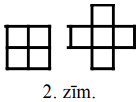
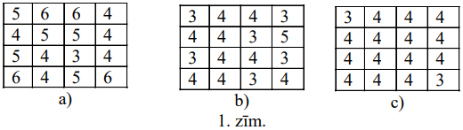
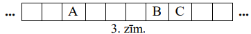
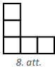

# 5-6.klases AMO uzdevumi par lasītprasmi (2026-05-11) {-}

## LV.AMO.2004.5.3 {-}

Kvadrātā, kas sastāv no $4 \times 4$ vienādām kvadrātiskām rūtiņām, katrā 
rūtiņā dzīvo pa vienam votivapam; taisnstūrī, kas sastāv no $2 \times 8$ 
vienādām kvadrātiskām rūtiņām, katrā rūtiņā dzīvo pa vienam šillišallam. Rūķīši
grib mainīt dzīves vietas: votivapas grib pārcelties uz taisnstūri, bet 
šillišallas - uz kvadrātu.

**(A)** vai to var izdarīt tā, lai katri divi votivapas, kas kvadrātā dzīvoja 
blakus rūtiņās, arī taisnstūrī dzīvotu blakus rūtiņās?

**(B)** vai to var izdarīt tā, lai katri divi šillišallas, kas taisnstūrī 
dzīvoja blakus rūtiņās, arī kvadrātā dzīvotu blakus rūtiņās?

*Piezīme:* divas rūtiņas sauc par blakus rūtiņām, ja tām ir kopīga mala.

## LV.AMO.2004.5.4 {-}

Vai eksistē taisnstūris, kura malas iet pa rūtiņu līnijām un kuru var sagriezt 
tādās daļās, kādas attēlotas 2.zīm.? Jābūt vismaz vienai katra veida daļai.

## LV.AMO.2006.5.3 {-}

Pa apli stāv Andris, Dzintars, Gunārs, Juliata, Maija un Skaidrīte. Visi 
attālumi starp bērniem ir dažādi. Katrs bērns nosauc sev vistuvāk stāvošā bērna
vārdu. Cik vārdi var tikt nosaukti divreiz? (Attālumus starp bērniem mēra "pa 
apli".)

## LV.AMO.2007.5.3 {-}

Uz kādas planētas tiek lietotas $2007$ dažādas valodas. Kāds mazākais daudzums 
vārdnīcu pietiekams, lai no katras valodas varētu tulkot uz katru citu? 
(Pieļaujamas vairākpakāpju tulkošanas; ar katru vārdnīcu tulko tikai vienā 
virzienā, piemēram, no latviešu valodas uz lietuviešu valodu, bet ne otrādi.)

## LV.AMO.2007.6.3 {-}

Kvadrāts sastāv no $4 \times 4$ rūtiņām. Katrā no tām ierakstīts vesels 
pozitīvs skaitlis. Ar vienu gājienu drīkst pieskaitīt vieninieku skaitļiem 
divās rūtiņās, kurām ir kopīga mala. Vai var panākt, lai visi skaitļi rūtiņās 
būtu vienādi, ja sākotnējais izvietojums ir tāds, kāds parādīts 1.zīm. **(A)**,
**(B)** un **(C)**?

## LV.AMO.2007.6.4 {-}

Kvadrāts sastāv no $8 \times 8$ rūtiņām. Kādu mazāko daudzumu rūtiņu var 
atzīmēt, lai nekādām divām atzīmētām rūtiņām nebūtu ne kopīgas malas, ne kopīga
stūra, bet katrai neatzīmētai rūtiņai būtu vai nu kopīga mala, vai kopīgs 
stūris ar kādu atzīmēto?

## LV.AMO.2007.6.5 {-}

Seši rūķīši brīvdienās apciemo cits citu. Katru dienu daži rūķīši sēž mājās un 
neiet nekur, bet citi viņus apciemo (katrs rūķītis vienā dienā var veikt 
vairākus apciemojumus). Kāds ir mazākais dienu skaits, ar ko pietiek, lai katrs
rūķītis varētu apciemot katru citu?

## LV.AMO.2008.5.1 {-}

Uz kādas planētas tiek lietotas $2008$ dažādas valodas. Kāds mazākais daudzums 
vārdnīcu pietiekams, lai no katras valodas varētu tulkot uz katru citu? 
(Pieļaujamas vairākpakāpju tulkošanas; ar katru vārdnīcu tulko tikai vienā 
virzienā, piemēram, no latviešu valodas uz lietuviešu valodu, bet ne otrādi.)

## LV.AMO.2010.5.4 {-}

Vairāki domino kauliņi ir salikti rindā viens aiz otra tā, ka katri divi viens 
otram sekojoši kauliņi saskaras ar pusēm, uz kurām attēlots vienāds punktu 
skaits

3.zīmējumā parādītā rūtiņu virkne attēlo iegūtās domino kauliņu rindas 
fragmentu: katra rūtiņa atbilst domino kauliņa vienai pusei, bet nav iezīmētas 
kauliņu robežas.

Nosaki, vai punktu skaits rūtiņā " $A$ " var būt vienāds ar punktu skaitu 
**(A)** rūtiņā " $B$ ", **(B)** rūtiņā " $C$ "!

(Domino kauliņu komplekts sastāv no $28$ kauliņiem. Katrs kauliņš sastāv no 
divām kvadrātveida pusēm, uz kurām attēloti punkti - uz katras puses attēloto 
punktu skaits ir no $0$ līdz $6$. Katram iespējamam punktu daudzumu pārim 
komplektā ir tieši viens kauliņš.)

## LV.AMO.2010.5.5 {-}

Taisnstūris sastāv no $3 \times 5$ rūtiņām. Divas rūtiņas sauc par 
kaimiņiem, ja tām ir kopēja mala vai kopējs stūris. Tieši $6$ rūtiņas 
nokrāsotas melnas; pārējās ir baltas.

Vai var gadīties, ka vienai melnai rūtiņai ir tieši $1$ balts kaimiņš, vienai 
melnai rūtiņai - tieši $2$ balti kaimiņi, $\ldots$ , vienai melnai rūtiņai - 
tieši $6$ balti kaimiņi?

## LV.AMO.2010.6.5 {-}

Puķu dobe sadalīta $n$ rindās pa $n$ stādiem katrā rindā. Šajā dobē ir 
jāiestāda trīs veidu puķes: narcises, hiacintes un tulpes tā, lai izpildītos 
sekojoši nosacījumi:

1. katrā rindā ir iestādīts nepāra skaits katra veida stādu;  
2. nav iespējams atrast divas tādas rindas, kurās gan narcišu, gan hiacinšu, 
   gan tulpju daudzumi sakristu.

Nosaki, kāda ir mazākā iespējamā $n$ vērtība, pie kuras iespējams to izdarīt!

## LV.AMO.2012.5.4 {-}

$24$-stāvu mājā ir lifts, kuram ir divas pogas. Nospiežot vienu pogu, tas paceļas
(ja iespējams) $17$ stāvus uz augšu, nospiežot otru nolaižas $8$ stāvus uz leju (ja
iespējams). Noskaidro, no kura stāva ar šo liftu var nokļūt uz jebkuru citu stāvu šajā
mājā. (Lifts nevar uzbraukt augstāk par 24. stāvu un zemāk par 1. stāvu.)

## LV.AMO.2013.5.5 {-}

Kuba katra skaldne sadalīta četros vienādos kvadrātos. Vai šos kvadrātus var 
nokrāsot **(A)** divās; **(B)** trīs krāsās tā, ka kvadrāti, kam ir kopīga 
mala, ir nokrāsoti dažādās krāsās? Katrs kvadrāts pilnībā ir jākrāso vienā 
krāsā. Atbildi pamatot!

## LV.AMO.2017.6.3 {-}

Kāds mazākais skaits stūrīšu (skat. 8.att.) jāizgriež no $6 \times 6$ rūtiņu 
laukuma, lai no tā vairs nevarētu izgriezt nevienu šādu stūrīti? Griezuma 
līnijām jāiet pa rūtiņu līnijām un stūrīši var būt pagriezti.

## LV.AMO.2018.5.4 {-}

Naturālu pāra skaitli sauksim par raibu, ja tam vienlaikus ir spēkā šādas 
īpašības:

1. tajā neviens cipars nav nulle,
2. tam nav divu vienādu ciparu,
3. nekur blakus neatrodas divi pāra un divi nepāra cipari.

Vai ir iespējams, ka

**(A)** saskaitot divus piecciparu raibus skaitļus, arī summa būs piecciparu 
raibs skaitlis;

**(B)** saskaitot divus sešciparu raibus skaitļus, arī summa būs sešciparu raibs
skaitlis?

## LV.AMO.2022B.5.5 {-}

Katrai no trīs meitenēm Elīnai, Gunai un Marutai patīk viena no krāsām: 
zaļa, dzeltena, oranža (katrai cita krāsa),
bet abas pārējās krāsas nepatīk. Zināms, ka tieši viens no apgalvojumiem ir patiess:

* Gunai nepatīk oranža krāsa;
* Elīnai nepatīk zaļa krāsa;
* Elīnai nepatīk oranža krāsa.

Kāda krāsa patīk katrai meitenei? Atbildi pamatot!

## LV.AMO.2003.6.2 {-}

Kvadrāts sastāv no $n \times n$ rūtiņām; viena stūra rūtiņa izgriezta. Rūtiņas 
malas garums ir $1$. Atlikušo daļu jāsadala taisnstūros ar izmēriem 
$1 \times 2$ tā, lai pusei no tiem garākā mala ietu vienā virzienā, bet pusei -
otrā. Vai to var izdarīt, ja **(A)** $n=5$, **(B)** $n=7$?