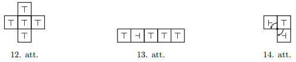

# 7-8.klases AMO uzdevumi par lasītprasmi (2026-05-11) {-}

## LV.AMO.2004.7.4 {-}

Izliektā $7$-stūrī $ABCDEFG$ punkti 
$A_{1}, B_{1}, C_{1}, D_{1}, E_{1}, F_{1}, G_{1}$ ir attiecīgi malu   
$DE,\ EF,\ FG,\ GA,\ AB,\ BC,\ CD$ viduspunkti. Dots, ka 
$AA_{1} \perp DE,\ BB_{1} \perp EF,\ CC_{1} \perp FG,\ DD_{1} \perp GA,\ EE_{1} \perp AB$
un $FF_{1} \perp BC$. Pierādīt, ka $GG_{1} \perp CD$.

## LV.AMO.2004.7.5 {-}

Kādā komisijā strādā $7$ diplomāti. Katri divi savā starpā sarunājas angļu, 
vācu vai franču valodā (tikai vienā). Katrs diplomāts ar $2$ kolēģiem sarunājas
angliski, ar $2$ - vāciski, ar $2$ - franciski. Pierādiet: var atrast $3$ 
diplomātus, kas savā starpā sazinoties lieto visas $3$ valodas.

## LV.AMO.2004.8.5 {-}

Virknē augošā kārtībā izrakstīti naturālie skaitļi no $1$ līdz $2004$ 
ieskaitot, katrs vienu reizi. Izsvītrojam no tās skaitļus, kas atrodas 
$1.,\ 4.,\ 7.,\ 10.,\ \ldots$ vietās. No palikušās virknes atkal izsvītrojam 
skaitļus, kas tajā atrodas $1.,\ 4.,\ 7.,\ \ldots$ vietās. Ar iegūto virkni 
rīkojamies tāpat, utt., kamēr paliek neizsvītrots viens skaitlis. Kurš tas ir?

## LV.AMO.2005.7.5 {-}

Rindā izrakstīti $10$ dažādi skaitļi, kas visi lielāki par $0$ un mazāki par 
$1$. To skaitļu summa, kas atrodas $2.,\ 4.,\ 6.,\ 8.,\ 10.$ vietās, par $1$ 
lielāka nekā to skaitļu summa, kas atrodas $1.,\ 3.,\ 5.,\ 7.,\ 9.$ vietās.

Pierādiet: rindā var atrast tādu skaitli, kas mazāks par abiem saviem 
kaimiņiem.

## LV.AMO.2006.7.4 {-}

Radījuši Trio salu, dievi tajā nometināja $2005$ princeses, $2006$ bruņiniekus 
un $2007$ pūķus. Pūķi ēd princeses; bruņinieki nogalina pūķus; princeses noved 
līdz bojāejai bruņiniekus. Saskaņā ar dievu ieviesto kārtību nav iespējams 
iznīcināt to, kurš pats iznīcinājis nepāra skaitu citu būtņu. Pašreiz Trio salā
palikusi tikai viena dzīva būtne. Kas tā ir?

## LV.AMO.2006.7.5 {-}

Pa apli izvietoti $24$ trauki; katrā ir pa vienai konfektei. Ar vienu gājienu 
var paņemt vienu konfekti no jebkura trauka. Ja abos blakus esošajos traukos 
arī ir pa vienai konfektei, tad paņemto konfekti drīkst apēst; pretējā gadījumā
tā jāieliek tajā blakus esošajā traukā, kurā konfekšu nav (jebkurā no tiem, ja 
tie abi ir tukši). Kādu lielāko konfekšu daudzumu var apēst?

## LV.AMO.2006.8.2 {-}

Matemātikas pulciņā piedalās Andris, Dzintars, Gunārs, Juliata, Liene un Maija.
Uzdevumus viņi risina grupās pa trim. Kāds mazākais skaits uzdevumu tika 
risināts, ja katri divi bērni kopā risināja vismaz vienu no tiem?

## LV.AMO.2006.8.5 {-}

Kvadrāts sastāv no $33 \times 33$ kvadrātiskām rūtiņām. No šīm rūtiņām $32$ ir 
nokrāsotas melnas, pārējās baltas. Ar vienu gājienu var izvēlēties baltu 
rūtiņu, no kuras kaimiņu rūtiņām vismaz divas jau ir melnas, un nokrāsot arī šo
rūtiņu melnu. (Rūtiņas sauc par kaimiņu rūtiņām, ja tām ir kopīga mala)

Vai var gadīties, ka izdodas nokrāsot melnu visu kvadrātu?

Vai tas var gadīties, ja sākotnēji melnas ir $33$ rūtiņas?

## LV.AMO.2007.7.1 {-}

Kādu lielāko daudzumu dažādu ciparu var izrakstīt pa apli tā, lai katri divi 
blakus uzrakstīti cipari, lasot tos vienalga kādā virzienā, veidotu pirmskaitļa
pierakstu?

## LV.AMO.2007.7.3 {-}

Uz tāfeles sākumā uzrakstīti $6$ divciparu naturāli skaitļi. Andris ar savu 
gājienu var pieskaitīt dažiem skaitļiem $1$, bet pārējiem skaitļiem $2$. (Var 
arī pieskaitīt visiem skaitļiem $1$ vai visiem skaitļiem $2$.) Pēc tam Maija ar
savu gājienu var nodzēst jebkuru skaitli, kas dalās ar $7$ vai kam ciparu summa
dalās ar $7$. Pēc tam gājienu izdara Andris, pēc tam - Maija, utt. Pierādīt, ka
Maija var panākt, lai skaitļu uz tāfeles vairs nebūtu (pieņemsim, ka tiek 
spēlēts pietiekoši ilgi).

## LV.AMO.2007.7.4 {-}

Divpadsmit cilvēku grupā katrs pazīst tieši $7$ citus (ja $A$ pazīst $B$, tad 
$B$ pazīst $A$). Pierādīt: var atrast tādus $3$ cilvēkus, kas visi pazīst cits 
citu.

## LV.AMO.2007.7.5 {-}

Pa apli izrakstīti $16$ skaitļi. Nekādu triju pēc kārtas uzrakstītu skaitļu 
summa nav mazāka par $2$; nekādu piecu pēc kārtas uzrakstītu skaitļu summa nav 
lielāka par $4$. Kāda ir lielākā iespējamā divu blakus uzrakstītu skaitļu 
starpība?

## LV.AMO.2007.8.4 {-}

Dzintars un Gunārs svētkos rāda burvju triku. Viņiem ir $20$ kartītes; uz 
katras no tām uzrakstīts naturāls skaitlis no $1$ līdz $20$. Visi skaitļi ir 
dažādi. Vispirms Gunārs iedod visas kartītes kādam no skatītājiem. Skatītājs 
izvēlas no tām $9$ kartītes un patur sev, bet pārējās $11$ atdod Gunāram. 
Gunārs patur sev $9$ kartītes, bet pārējās $2$ atdod skatītājam. Skatītājs 
pievieno šīm divām kartītēm vienu no sākotnēji paturētajām deviņām un nodod šīs
trīs kartītes Dzintaram. Dzintars pareizi norāda, kuru no trim kartītēm 
skatītājs pievienoja pēdējā posmā.

Izdomājiet, kā šādu triku var organizēt. (Trika izpildes laikā Gunārs un 
Dzintars savā starpā nesazinās un nespiego, ko dara skatītājs.)

## LV.AMO.2007.8.5 {-}

Kvadrāts sastāv no $9 \times 9$ rūtiņām, kas izkrāsotas šaha galdiņa kārtībā; 
stūra rūtiņas ir melnas. Figūriņu novieto melnajā rūtiņā. Ja figūriņa ir kādā 
rūtiņā $A$, tad ar vienu gājienu to var pārvietot uz jebkuru rūtiņu, kam ar $A$
ir kopīgs stūris, bet ne kopīga mala. Kāds ir mazākais iespējamais gājienu 
skaits, ar kuru var apstaigāt visas melnās rūtiņas, dažās no tām varbūt ieejot 
vairākas reizes? Sākuma rūtiņa automātiski skaitās apstaigāta. Ar pēdējo 
gājienu nav obligāti jāatgriežas sākuma rūtiņā. Spēlētājs var izvēlēties 
figūriņas sākuma pozīciju.

## LV.AMO.2008.7.5 {-}

Plaknē atzīmēti $17$ punkti. Pierādīt, ka $5$ no tiem var nokrāsot sarkanus tā,
lai nevienam trijstūrim ar trim sarkanām virsotnēm visas malas nebūtu vienādas.

## LV.AMO.2008.8.5 {-}

Šaha turnīrā piedalās $8$ spēlētāji; katrs ar katru citu spēlē tieši $1$ reizi.
Par uzvaru spēlētājs saņem $1$ punktu, par neizšķirtu $\frac{1}{2}$ punkta, par
zaudējumu $0$ punktus. Turnīru beidzot, izrādījās, ka nekādiem diviem 
spēlētājiem nav vienāds punktu daudzums. Kāds ir mazākais iespējamais 
uzvarētāja iegūtais punktu daudzums? (Par uzvarētāju uzskata to spēlētāju, kam 
turnīra noslēgumā ir visvairāk punktu.)

## LV.AMO.2009.7.5 {-}

Vairākiem rūķīšiem ir vienādi naudas daudzumi. Brīdi pa brīdim kāds no rūķīšiem
paņem daļu savas naudas un sadala to pārējiem vienādās daļās. Pēc kāda laika 
izrādījās, ka vienam no rūķīšiem ir $8$ dālderi, bet citam - $25$ dālderi. Cik 
pavisam ir rūķīšu? (Dālderis ir vienīgā rūķīšiem pieejamā naudas vienība.)

## LV.AMO.2009.8.2 {-}

Šaha turnīrā piedalās $8$ spēlētāji; katrs ar katru citu spēlē tieši $1$ 
reizi. Par uzvaru spēlētājs saņem $1$ punktu, par neizšķirtu $\frac{1}{2}$ 
punkta, par zaudējumu $0$ punktus. Tunīru beidzot, izrādījās, ka nekādiem 
diviem spēlētājiem nav vienāds punktu daudzums. Kāds ir mazākais iespējamais 
uzvarētāja iegūtais punktu daudzums? (Par uzvarētāju uzskata to spēlētāju, kam 
turnīra noslēgumā ir visvairāk punktu.)

## LV.AMO.2009.8.4 {-}

Profesors Cipariņš ar savu ārzemju kolēģi ieradās Ziemassvētku eglītes 
pasākumā, kurā piedalījās universitātes darbinieki, viņu draugi, ģimenes 
locekļi, paziņas utt. Norādot uz trim viesiem, Cipariņš piezīmēja: "Šo cilvēku 
vecumu reizinājums ir $2450$, bet summa - divas reizes lielāka nekā Jūsu 
vecums." Kolēģis atteica: "Es nezinu un nevaru noskaidrot, cik veci ir šie 
ļaudis." Tad Cipariņš piebilda: "Es esmu vecāks par jebkuru citu šai eglītē." 
Tagad kolēģis uzreiz pateica minēto $3$ viesu vecumus. Cik gadu tai laikā bija 
Cipariņam un cik - viņa kolēgim? (Visus vecumus izsaka veselos gados.)

## LV.AMO.2009.8.5 {-}

Uz riņķa līnijas atzīmēti vairāki punkti. Katram punktam jāpieraksta viens no 
burtiem $A;\ B;\ C;\ D;\ E;\ F$ tā, lai katri divi dažādi burti kaut vienā 
vietā uz riņķa līnijas atrastos blakus (vienalga kādā secībā).

**(A)** pierādīt, ka vajag vismaz $15$ punktus,

**(B)** pierādīt, ka vajag vismaz $18$ punktus,

**(C)** vai ar $18$ punktiem pietiek?

## LV.AMO.2010.7.4 {-}

Vairākiem bērniem visiem ir vienāds skaits konfekšu. Brīdi pa brīdim kāds no 
bērniem paņem daļu savu konfekšu un sadala to pārējiem vienādās daļās. Pēc kāda
laika izrādījās, ka vienam no bērniem ir $4$ konfektes, bet citam - $23$ 
konfektes. Cik pavisam ir bērnu? (Konfektes netiek dalītas daļās, apēstas vai 
izmestas.)

## LV.AMO.2010.7.5 {-}

Rindā stāv $2010$ rūķīši. Katrs no viņiem vai nu vienmēr saka patiesību (ir 
*patiesis*), vai arī vienmēr melo (ir *melis*). Uz jautājumu:

*"Vai pa labi no jums esošo patiešu skaits ir lielāks nekā pa kreisi no jums 
esošo patiešu skaits?"*

ar "jā" atbildēja tieši $100$ rūķīši.

Kāds lielākais un kāds - mazākais skaits *patiešu* var būt starp visiem 
rūķīšiem?

## LV.AMO.2013.8.5 {-}

Rūķītis ir iedomājies skaitļus $x_{1}, x_{2}, x_{3}$ un $x_{4}$, katrs no tiem 
ir vai nu $0$, vai $1$. Ja rūķītim pajautā: "Kāds ir $i$-tais skaitlis?" 
($i=1,2,3$ vai $4$ pēc izvēles), tad viņš pasaka $x_{i}$ vērtību.

Pierādīt, ka ar $3$ jautājumiem pietiek, lai uzzinātu, vai virkne 
$x_{1},\ x_{2},\ x_{3},\ x_{4}$ ir monotona.

Skaitļu virkne $x_{1},\ x_{2},\ x_{3},\ x_{4}$ ir monotona, ja tā ir nedilstoša
vai neaugoša (t. i., $x_{1} \leq x_{2} \leq x_{3} \leq x_{4}$ vai 
$x_{1} \geq x_{2} \geq x_{3} \geq x_{4}$ ).

## LV.AMO.2018.8.5 {-}

**(A)** Kāds ir mazākais rūtiņu skaits, kas jāiekrāso $6 \times 6$ rūtiņu 
kvadrātā, lai katrā šī kvadrāta $2 \times 3$ rūtiņu taisnstūrī (tas var būt arī
pagriezts vertikāli) būtu vismaz viena iekrāsota rūtiņa?   
**(B)** Vai noteikti 
tad, kad ir iekrāsots mazākais rūtiņu skaits, visas četras stūra rūtiņas paliks
neiekrāsotas?

## LV.AMO.2019.7.5 {-}

Kādai mazākajai naturālai $n$ vērtībai skaitli $10^{n}$ iespējams izteikt kā 
septiņu naturālu skaitļu reizinājumu tā, lai to visu pēdējie cipari ir dažādi 
(tas ir, nevienam no tiem pēdējais cipars nesakrīt ar kāda cita skaitļa pēdējo
ciparu)?

## LV.AMO.2019.8.1 {-}

Atjaunojot taisnu žogu, Raimonds izraka vecos žoga stabus, kuri atradās $8$ 
metru attālumā viens no otra un kuru skaits bija nepāra skaitlis. Raimonds 
sanesa visus stabus pie vidējā, nesdams tos pa vienam un sākdams ar vienu no 
malējiem stabiem. Cik bija stabu, ja viņš nostaigāja $840~\mathrm{m}$?

## LV.AMO.2019.8.4 {-}

Mežā dzīvo $m$ rūķīši. Daži no tiem savā starpā draudzējas (ja $A$ draudzējas 
ar $B$, tad $B$ draudzējas ar $A$), pie tam katra rūķīša draugu skaits ir kāda
naturāla skaitļa kubs. Kādām $m$ vērtībām tas ir iespējams?

## LV.AMO.2019.8.5 {-}

Kādai mazākajai naturālai $n$ vērtībai skaitli $10^{n}$ iespējams izteikt kā 
sešu naturālu skaitļu reizinājumu tā, ka neviens no tiem nav mazāks kā $10$ un 
to visu pēdējie cipari ir dažādi (tas ir, nevienam no tiem pēdējais cipars 
nesakrīt ar kāda cita skaitļa pēdējo ciparu)?

## LV.AMO.2023.8.5 {-}

Uz palodzes sēž vairākas bizbizmārītes, katrai no tām uz muguras 
ir vai nu trīs punktiņi, vai astoņi
punktiņi. Tās bizbizmārītes, kurām uz muguras ir astoņi punktiņi, 
vienmēr saka patiesību, bet tās
bizbizmārītes, kurām uz muguras ir trīs punktiņi, vienmēr melo. 
Katra bizbizmārīte izteicās:

* pirmā bizbizmārīte teica: "punktiņu skaits uz muguras mums visām ir vienāds";
* otrā teica: "mums visām kopā uz muguras ir $38$ punktiņi";
* trešā teica: "nē, mums visām kopā uz muguras ir $48$ punktiņi";
* katra no atlikušajām bizbizmārītēm teica: "no pirmajām trijām bizbizmārītēm 
  tieši viena teica patiesību".

Cik bizbizmārītes sēž uz palodzes?

## LV.AMO.2024.7.3 {-}

Skaitḷu virknes pirmais loceklis ir $12$. Katru nākamo iegūst 
iepriekšējo vai nu reizinot ar $2$ vai $3$, vai arī izdalot ar 
$2$ vai $3$ (ja tas dalās bez atlikuma). Vai šīs skaitļu virknes 
61.loceklis var būt skaitlis $54$?

## LV.AMO.2024.8.5 {-}

Dotas piecas smagas kastes un tās izkārtotas, kā tas redzams 12. att. Šīs kastes var pārvietot tikai pagriežot par 90 grādiem ap kādu no kastes stūriem. Kastes nav iespējams pārvietot citām kastēm virsū. Pēc vairākiem šādiem pārvietojumiem šīs kastes tika izkārtotas, kā tas redzams 13. att. Kuras no šīm kastēm varēja sākotnēji atrasties 12. att. izkārtojuma centrā? Piemēru, kā kasti var pārvietot ap vienu stūri divos dažādos veidos skatīt 14. att.

## LV.AMO.2003.8.4 {-}

Andrim un Jurim iedots pa papīra kvadrātam ar izmēriem 
$1~\text{m} \times 1~\text{m}$. Katrs no viniem savā kvadrātā novilka 
vairākas līnijas, sadalot to daļās; katra daļa ir taisnstūris ar izmēriem 
$4~\text{cm} \times 4~\mathrm{cm}$ vai 
$3~\text{cm} \times 6~\mathrm{cm}$.

Pierādiet, ka Andra novilkto līniju kopgarums vienāds ar Jura novilkto līniju 
kopgarumu. (Tika novilktas **tikai** līnijas, kas dala kvadrātus taisnstūros.)