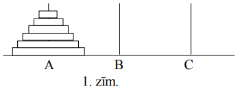
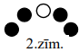
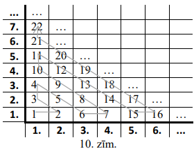
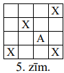
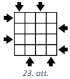

# 9.klases AMO uzdevumi par lasītprasmi (2026-05-11) {-}

## LV.AMO.2004.9.2 {-}

Dots, ka $a$ un $b$ - naturāli skaitļi un $a+b$ ir nepāra skaitlis. Zināms, ka
katrā skaitļu ass punktā ar veselu koordināti dzīvo pa rūķīitim: dažos 
punktos - votivapas, pārējos - šillišallas. Pierādīt, ka eksistē tādi divi 
vienas cilts rūķīši, attālums starp kuriem ir vai nu $a$, vai $b$.

## LV.AMO.2004.9.4 {-}

Dots, ka $n$ - naturāls skaitlis. Katrs no $2n+1$ rūķīšiem Lieldienās vienu 
reizi ieradās pie Sniegbaltītes un kādu laiku tur uzturējās. Ja divi rūķīši 
vienlaikus bija pie Sniegbaltītes, tad viņi tur satikās. Zināms, ka katrs 
rūķītis pie Sniegbaltītes satika vismaz $n$ citus rūķīšus.

Pierādīt: ir tāds rūķītis, kas pie Sniegbaltītes satika visus $2n$ citus 
rūķīšus.

## LV.AMO.2004.9.5 {-}

Kvadrāts sastāv no $n \times n$ rūtiņām. Katrā rūtiņā jāieraksta viens no 
skaitļiem $-1;\ 0;\ 1$ tā, lai $n$ rindās un $n$ kolonnās ierakstīto skaitļu 
summas visas būtu dažādas.

Vai to var izdarīt, ja **(A)** $n=4$; **(B)** $n=5$?

## LV.AMO.2005.9.2 {-}

Trijstūra $ABC$ ievilktā riņķa centrs ir $I$. Dots, ka $CA+AI=CB$. Pierādīt, ka
$\sphericalangle BAC=2 \sphericalangle CBA$.

## LV.AMO.2005.9.5 {-}

Doti $3$ stienīši. Uz viena no tiem sākotnēji uzmaukti $n$ dažādu izmēru diski 
ar caurumiem vidū tā, ka to rādiusi samazinās no lejas uz augšu; abi pārējie 
stienīši sākotnēji ir tukši (skat. 1.zīm., kur $n=6$).

Ar vienu gājienu var pārlikt augšējo disku no jebkura stienīša uz jebkuru citu,
ja tikai pārliekamais disks $D$ nav lielāks par to disku, kas atrodas pašā 
apakšā uz stienīša, uz kuru pārliek $D$.

Ar kādu mazāko gājienu skaitu var panākt, lai visi diski atrastos uz stienīša 
$C$ tādā pašā kārtībā, kādā tie sākotnēji atradās uz stienīša $A$?

## LV.AMO.2006.9.5 {-}

Apskatām naturālos skaitļus no $1$ līdz $100$ ieskaitot. Kādu lielāko daudzumu 
no tiem var izvēlēties tā, lai nekādi divi izvēlētie skaitļi nedalītos viens ar
otru un katriem diviem izvēlētajiem skaitļiem lielākais kopīgais dalītājs būtu 
lielāks par $1$?

## LV.AMO.2007.9.4 {-}

Regulārā $n$-stūrī jāuzzīmē vairākas slēgtas lauztas līnijas tā, lai katra no 
tām sastāvētu tieši no $n$ dažādiem posmiem, lai katras līnijas katrs posms 
būtu vai nu $n$-stūra mala, vai diagonāle un lai gan katra nstūra mala, gan 
katra tā diagonāle būtu posms tieši vienā no šīm līnijām. Vai to var izdarīt, 
ja **(A)** $n=8$, **(B)** $n=9$?

## LV.AMO.2007.9.5 {-}

Pa apli novietotas $10$ viena lata monētas, visas ar "lasi" uz augšu. Ar vienu 
gājienu atļauts apgriezt otrādi vai nu četras pēc kārtas novietotas monētas, 
vai arī divas pirmās un divas pēdējās monētas piecu pēc kārtas esošu monētu 
virknē (skat. 2.zīm.) Šādus gājienus drīkst atkārtot vairākkārt. Kāds lielākais
monētu daudzums var vienlaicīgi atrasties ar ģerboni uz augšu?

## LV.AMO.2008.9.1 {-}

Kvadrātveida tabula sastāv no $12 \times 12$ rūtiņām. Katrā rūtiņā ierakstīts 
nenulles cipars. No katras rindiņas un katras kolonnas cipariem, ņemot tos 
patvaļīgā secībā, izveidots viens divpadsmitciparu naturāls skaitlis. Vai var 
gadīties, ka tieši $23$ no šiem skaitļiem (ne vairāk un ne mazāk) dalās ar $3$?

## LV.AMO.2008.9.4 {-}

Naturālie skaitļi no $1$ līdz $2008$ ieskaitot jāsadala grupās tā, lai 
izpildītos sakarība: ja $a$ dalās ar $b$ un $b$ dalās ar $c$ ($a,\ b,\ c$ - 
dažādi naturāli skaitļi), tad $a,\ b$ un $c$ visi nepieder vienai un tai pašai 
grupai. Kāds ir mazākais iespējamais grupu skaits?

## LV.AMO.2008.9.5 {-}

Kvadrāts sadalīts rūtiņās ar malu garumu $1$. Pa dalījuma līnijām (kvadrāta 
iekšpusē un uz tā ārējās robežas) uzzīmētas vairākas slēgtas līnijas; katra no 
tām ierobežo kaut kādu taisnstūri. Vai var gadīties, ka katras rūtiņas katra 
mala pieder

**(A)** pāra skaitam līniju,

**(B)** nepāra skaitam līniju?

## LV.AMO.2009.9.3 {-}

Uz taisnes $t$ novietots stienītis ar garumu $1$. Sākumā tā gali atrodas 
punktos $A$ un $B$. Stienīti bīda pa plakni tā, ka tas visu laiku paliek 
paralēls taisnei $t$ un beigās atkal nonāk uz $t$; šai brīdī tā gali atrodas 
punktos $C$ un $D$. Turklāt ceļiem, pa kuriem kustas stienīša gali, nav kopīgu 
punktu. Vai var gadities, ka $AC>2009$? (**Piezīme:** uzskatām, ka stienītis ir
paralēls $t$ arī tad, ja tas atrodas uz $t$)

## LV.AMO.2010.9.2 {-}

Četri atšķirīgi punkti $A,\ B,\ C$ un $D$ atrodas uz parabolas $y=x^{2}$. 
Nogriežņi $AB$ un $CD$ krustojas punktā $E$. Pierādi, ka $E$ nevar būt 
vienlaicīgi gan $AB$, gan $CD$ viduspunkts!

## LV.AMO.2010.9.4 {-}

$2010 \times 2010$ rūtiņas lielā kvadrātā, sākot ar apakšējo kreiso rūtiņu, pēc
kārtas tiek ierakstīti naturālie skaitļi kā parādīts 10.zīmējumā (katrā rūtiņā 
ierakstīts viens skaitlis).

Piemēram, skaitlis $19$ ierakstīts ceturtajā rindā, trešajā kolonnā.

**(A)** Kurš skaitlis ierakstīts 20. rindā, 10. kolonnā?  
**(B)** Kurā rindā un kurā kolonnā atrodas rūtiņa, kurā ierakstīts skaitlis $2010$?

## LV.AMO.2011.9.5 {-}

Kvadrāta ar izmēriem $8 \times 8$ rūtiņas apakšējā labajā stūra rūtiņā atrodas 
figūriņa sienāzis. 5.zīmējumā attēloti sienāža iespējamie gājieni. No jebkuras 
rūtiņas, kurā sienāzis kādā brīdī atrodas, viņš var pārvietoties tādā pašā 
virzienā par tādu pašu attālumu kā no $A$ uz jebkuru rūtiņu $X$ pie nosacījuma,
ka viņš paliek kvadrāta iekšpusē

Kurās no pārējām trijām kvadrāta stūra rūtiņām sienāzis var nonākt un kurās - 
nevar, izpildot tikai atļautos gājienus?

## LV.AMO.2012.9.4 {-}

Uz tāfeles uzrakstītas deviņas zvaigznītes * * * * * * * * *. Jānis ieraksta kādas
zvaigznītes vietā jebkuru ciparu no $1$ līdz $9$. Pēc tam Pēteris jebkuru divu citu
zvaigznīšu vietā ieraksta divus ciparus (tie var arī atkārtoties). Pēc tam vēl divas
reizes viņi atkārto šo darbību. Pēteris uzvar, ja iegūtais deviņciparu skaitlis dalās
ar $37$. Vai Pēteris vienmēr var uzvarēt?

## LV.AMO.2014.9.5 {-}

Katram marsietim ir trīs rokas un dažas antenas. Visi marsieši sadevās rokās
(katrs marsietis sadevās rokās ar $3$ citiem marsiešiem tā, ka visas rokas bija
aizņemtas). Izrādījās, ka katriem diviem marsiešiem, kas bija sadevuši rokās,
antenu skaits atšķīrās tieši $6$ reizes. Vai kopējais antenu skaits visiem
marsiešiem var būt $2014$?

## LV.AMO.2017.9.3 {-}

Dots trijstūris $ABC$, kuram $AB>AC>BC$. Virsotnes $A$ blakusleņķa bisektrise 
krusto malas $BC$ pagarinājumu punktā $D$, bet virsotnes $C$ blakusleņķa 
bisektrise krusto malas $AB$ pagarinājumu punktā $E$. Zināms, ka $AD=AC=CE$. 
Aprēķināt trijstūra $ABC$ leņķus!

## LV.AMO.2017.9.4 {-}

**(A)** Pierādi, ka dotajā $4 \times 4$ rūtiņu laukumā (skat. 23.att.) nevar 
ierakstīt $16$ dažādus naturālus skaitļus tā, lai katrā rūtiņā būtu ierakstīts 
viens skaitlis un katrā rindā un katrā kolonnā skaitļi pieaugtu bultiņas 
norādītajā virzienā.

**(B)** Kāds mazākais bultiņu skaits jāapvērš pretējā virzienā, lai skaitļus 
varētu izvietot saskaņā ar uzdevuma nosacījumiem?

## LV.AMO.2018.9.5 {-}

Kāds ir mazākais rūtiņu skaits, kas jāiekrāso taisnstūrī ar izmēriem 
$5 \times 8$ rūtiņas, lai katrā šī taisnstūra $2 \times 3$ rūtiņu taisnstūrī 
(tas var būt arī pagriezts vertikāli) būtu vismaz viena iekrāsota rūtiņa?

## LV.AMO.2022B.9.5 {-}

Mākslas muzeja plānojums ir taisnstūris ar izmēriem **(A)** $8 \times 9$; 
**(B)** $9 \times 11$ rūtiņas, 
kur viena rūtiņa atbilst vienai muzeja telpai. 
Muzeja vadītājs vēlas izveidot apmeklētāju maršrutu, 
kuram izpildās šādas īpašības:

* maršruts sākas kādā no rūtiņām (telpām), kas atrodas pie taisnstūra malas;
* apmeklētājs no vienas rūtiņas (telpas) var pāriet uz citu rūtiņu (telpu), ja tām ir kopīga mala;
* apmeklētājs maršruta laikā apmeklē katru rūtiņu (telpu) tieši vienu reizi;
* maršruts beidzas rūtiņā (telpā), kas atrodas pie taisnstūra malas blakus maršruta sākuma rūtiņai (telpai).

Vai muzeja vadītājs var izveidot šādu maršrutu?

## LV.AMO.2023.9.4 {-}

Uz katras no $36$ kartītēm uzrakstīts kāds naturāls skaitlis 
(daži no tiem var būt arī vienādi). Kartītes
iespējams sadalīt deviņās grupās pa četrām kartītēm katrā tā, ka visās grupās uz 
kartītēm uzrakstīto skaitļu summas ir vienādas. Kā arī kartītes iespējams sadalīt 
četrās grupās pa deviņām kartītēm katrā
tā, ka visās grupās uz kartītēm uzrakstīto skaitļu summas ir vienādas.
Vai vienmēr visas kartītes var sadalīt sešās grupās pa sešām kartītēm katrā tā, ka visās grupās uz
kartītēm uzrakstīto skaitļu summas ir vienādas?

