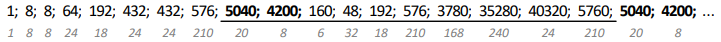

# Rekurentas virknes, Skaitļu teorija (2025-10-18)

* Rekurentai virknei definēts pirmais loceklis (vai daži locekļi) 
  un formula, ar kuru no iepriekšējiem locekļiem izrēķināt nākamos. 
  Ar to var saskaitīt variantus tad, ja citas metodes (*reizināšanas likums*)
  būtu par grūtu. Risinājuma secība:

  - Aprēķināt locekļus $a_n$ dažiem maziem $n$. Rekurentai 
    virknei nepieciešami pirmie locekļi (sākot ar $a_0$ vai ar $a_1$ vai tml.). 
  - Apskatīt $a_n$ un mēģināt izteikt ar $a_{n-1}$ (vai citiem iepriekšējiem 
    locekļiem). Pierakstīt prasību, ka $n \geq 2$ (vai tml., no kuras 
    vietas šo formulu lietot).
  - Pārliecināties, ka rekurentajā izteiksmē bez atkārtošanās 
    iekļauti visi varianti.
  - Ja uzdevumā prasīts, izveidot virknes locekļu tabuliņu līdz kādai vērtībai
    un pierakstīt secinājumus.

**1.uzdevums:** 
Ar $R_n$ apzīmējam gabalu skaitu, kuros $n$ taisnes sadala plakni, 
ja nekādas divas taisnes nav paralēlas un nekādas trīs taisnes 
neiet caur vienu punktu. 
Atrast rekurentu sakarību, lai rēķinātu $R_n$ virknes locekļus. 

**2.uzdevums:** Ir uzrakstīta izteiksme ar $n+1$ skaitļiem vai burtiem un 
operāciju $\circ$ (aplītis), kuru raksta starp diviem skaitļiem 
vai divām izteiksmēm, kas liktas iekavās. 
Ar $C_n$ apzīmē atšķirīgo veidu skaitu, kuros var salikt iekavas. 
(Iekavu salikšanas veidus uzskata par atšķirīgiem, ja tie 
izraisa citādu darbību secību.) 
Ievērojam, ka $C_0 = C_1 = 1$ (ja ir tikai viens skaitlis vai arī ir divi skaitļi, 
tad iekavas var salikt tikai vienā veidā).
Bet, piemēram, $C_3 = 5$, jo ir 
pavisam pieci veidi, kā salikt iekavas, ja izteiksmē ir $3$ aplīši:

$$((a \circ b) \circ c) \circ d,\;\; (a \circ (b \circ c)) \circ d,\;\;
(a \circ b) \circ (c \circ d),\;\; a \circ ((b \circ c) \circ d),\;\; 
a \circ (b \circ (c \circ d)).$$

**(A)** Atrast rekurentu sakarību, kā izteikt $C_n$, izmantojot $C_0, C_1, \ldots, C_{n-1}$.  
**(B)** Izveidot tabulu ar vērtībām $C_0,\cdots,C_6$. 

**3.uzdevums (LV.AMO.2019.12.4):**
Sporta nometnē ir $100$ skolēni. Ar $N$ apzīmējam, cik veidos šos 
$100$ skolēnus var sadalīt $50$ pāros (pāru secība un
arī skolēnu secība pārī nav svarīga). Ar kādu lielāko trijnieka pakāpi dalās $N$? 

*Ieteikums:* Lai atrastu $N$, var apzīmēt ar $a_n$ veidu skaitu, 
kuros var sadalīt pāros $n$ skolēnus (ja $n$ ir nepāra, uzskatām, ka $a_n = 0$).  
Var atrast, cik ir $a_2$ un tad arī izteikt $a_n$ ar iepriekšējiem 
virknes locekļiem.

**Atrisinājums:**
Izmantojam ieteikumu: Kā rekurenta virkne $a_n$ ir definējama šādi: 
$a_2 = 1$ (ja ir divi skolēni, no viņiem var izveidot pāri tikai vienā veidā). 

Ja $n$ ir pāra skaitlis ($n > 2$), tad pirmo skolēnu var salikt pārī ar katru no $n-1$ 
atlikušajiem. Pāri paliek $n-2$ skolēni, kurus var sadalīt pāros $a_{n-2}$ veidos. 
Tātad $a_n = (n-1) \cdot a_{n-2}$. Iegūstam, ka $a_2 = 1$, $a_4 = 3 \cdot 1 = 3$, 
$a_6 = 5 \cdot 3 \cdot 1 = 15$, $a_8 = 7 \cdot 5 \cdot 3 \cdot 1 = 105$ utt. 

$N$ var aprēķināt arī, atkārtoti izmantojot reizināšanas likumu: 
Vispirms sakārtojam skolēnus kaut kādā secībā (piemēram, pēc vecuma). 
Visjaunākajam skolēnam pāri var atrast $99$ veidos.
No atlikušajiem jaunākajam skolēnam pāri var atrast $97$ veidos.
Pēdējam skolēnam paliek tieši $1$ pāris.
Pilnu variantu skaitu izsaka reizinājums:  

$$N = 99\cdot{}97\cdot{}95\cdot\ldots\cdot{}3\cdot{}1.$$

Grupējam reizinātājus atkarībā no trijnieka pakāpes, ar
kuru tie dalās.

* $(99-3)/6 + 1 = 17$ reizinātāji dalās ar $3$:
$3 \cdot 9 \cdot 15 \cdot 21 \cdot 27 \cdot \ldots \cdot 99$.
* $(99-9)/18 + 1 = 6$ reizinātāji dalās ar $3^2$: 
$9 \cdot 27 \cdot 45 \cdot 63 \cdot 81 \cdot 99$
* $(81 - 27)/54 +1 = 2$ reizinātāji dalās ar $3^3$ ($27, 81$). 
* Viens reizinātājs dalās ar $3^4$ ($81$).

Saskaitot šīs pakāpes $17 + 6 + 2 + 1 = 26$. 

**4.uzdevums:** Monētu met $n$ reizes un katrreiz pieraksta 
rezultātu "C" (cipars) vai "Ģ" (ģerbonis). 
Pirmais spēlētājs uzvar, ja visu metienu virknītē nekad nav 
divi ģerboņi pēc kārtas (virknīte nesatur "ĢĢ").
Apzīmējam ar $a_n$, cik dažādos veidos 1.spēlētājs var uzvarēt.  
Atrast varbūtību, ar kuru pirmais spēlētājs uzvar, ja 
monētu met tieši $6$ reizes.  
*Piezīme:* Par varbūtību šeit apzīmē
attiecību starp to monētas uzmešanas veidu skaitu, kuros uzvar 1.spēlētājs, 
pret visu iespējamo monētu uzmešanas veidu skaitu.

**Atrisinājums:**  
**(A)** Atrod pirmos dažus virknes locekļus: $a_1 = 2$ (ja met vienreiz, 
der jebkurš no diviem iznākumiem), $a_2 = 3$ (ja met divreiz, tad 
no četriem iznākumiem "CC", "CĢ", "ĢC", "ĢĢ" neder viens).  
Ja $n>2$, tad izsaka $a_n$ ar iepriekšējiem virknes locekļiem:

* Ja sākumā uzkritis "C", tad pārējos $n-1$ metienus var izdarīt $a_{n-1}$
  dažādos veidos, lai uzvarētu 1.spēlētājs (jāpanāk, lai $n-1$ virknītē nebūtu "ĢĢ"). 
* Ja sākumā uzkritis "Ģ", tad 1.spēlētājam nav iespējams turpināt $a_{n-1}$ 
  veidos (jo tūlīt varētu parādīties vēl viens "Ģ"). Tādēļ 
  prasām, lai aiz pirmā "Ģ" tūlīt sekotu "C". Atlikušos $n-2$ metienus 
  var izdarīt $a_{n-2}$ veidos, lai 1.spēlētājs uzvarētu. 

Esam ieguvuši rekurenci: $a_1 =2$, $a_2 =3$, $a_{n} = a_{n-1} + a_{n-2}$ (ja $n>2$). 

**(B)** Ierakstām tabulā iegūtās vērtības $a_1, a_2, \ldots$ un arī 
varbūtības, ko iegūst, dalot 1.spēlētājam "veiksmīgo" virkņu skaitu $a_n$
ar visu virkņu skaitu $2^n$. 

| $n$        | $a_n$      | $2^n$      | uzvaras varbūtība $p$  |
| ---------- | ---------- | ---------- | ---------------------- |
| 1          | 2          | 2          | $2/2 = 1$              |  
| 2          | 3          | 4          | $3/4 = 0.75$           |  
| 3          | 5          | 8          | $5/8 = 0.625$          |  
| 4          | 8          | 16         | $8/16 = 0.5$           |  
| 5          | 13         | 32         | $13/32 \approx 0.4063$ | 
| 6          | 21         | 64         | $21/64 \approx 0.3281$ | 

**5.uzdevums:**
Kādā programmēšanas valodā visi vārdi satur tieši 
$n$ burtus; katrs burts ir "A", "B" vai "C". 
Ar $a_n$ apzīmējam, cik ir vārdu garumā $n$, kuri 
satur divus "A" no vietas.  
**(A)** Uzrakstīt $a_n$ kā rekurentu virkni, norādot sākuma nosacījumus 
un rekurento sakarību, kas ļauj izrēķināt $a_n$ no iepriekšējiem 
locekļiem.  
**(B)** Atrast $a_6$ vērtību.

**Atrisinājums:**   
**(A)** $a_1 = 0$, bet $a_2 = 1$, jo garumā $2$ ir tikai viens 
derīgs vārds "AA". 

Ja vārda garums $n > 2$, tad apskatām tajā pirmo burtu: ja šis 
burts ir "B" vai "C", tad atlikušos $n-1$ burtus var izvēlēties $a_{n-1}$ veidos. 
Tātad ir $2 \cdot a_{n-1}$ šādi vārdi. 

Ja savukārt pirmais burts ir "A", tad aiz tā obligāti jāliek "B" vai "C". 
Atliek $a_{n-2}$ burti, kurus var izvēlēties $a_{n-2}$ veidos. 
Tātad ir $2 \cdot a_{n-2}$ šādi vārdi. 

Iegūstam rekurentu virkni $a_1 = 0$, $a_2 = 1$, un $a_n = 2a_{n-1} + 2a_{n-2}$. 

**(B)** Izmantojam rekurento virkni, lai aizpildītu tabuliņu: 

| $n$ | 1 | 2 | 3 | 4 | 5 | 6 | 
| --- | --- | --- | --- | --- | --- | --- | 
| $a_n$ | 0 | 1 | 2 | 6 | 16 | 44 | 

**6.uzdevums (No gatavošanās materiāla):** 
Rindā salikti 10 krēsli, uz katra no tiem sēž pa skolēnam. 
Skolēni vienu reizi pieceļas un tad apsēžas, 
pie tam katrs drīkst apsēsties vai nu uz sava agrākā krēsla, 
vai uz cita krēsla, kurš ir tieši blakus agrākajam krēslam. Cik
dažādi skolēnu izvietojumi iespējami pēc pārsēšanās?

**Atrisinājums.** Ar $a_n$ apzīmējam dažādos iespējamos $n$ skolēnu 
izvietojumus pēc pārsēšanās. Ievērojam, ka $a_1 = 1$ 
(skolēns pieceļas un pēc tam atkal apsēžas savā vietā) un 
$a_2 = 2$ (abi skolēni pieceļas un pēc tam katrs apsēžas 
savā vietā vai arī abi skolēni apmainās vietām).

Apskatām $n$ skolēnus un meklējam formulu, kas 
izsaka $a_n$. Visas pārsēšanās iedalās divās grupās.

- Pirmais skolēns paliek uz vietas. Tad pārsēžas tikai atlikušie 
  $(n - 1)$ skolēni un šādu dažādo izvietojumu skaits ir $a_{n-1}$.
- Pirmais skolēns pāriet uz otro krēslu. Tad uz pirmo krēslu 
  pāriet skolēns no otrā krēsla. Pārējie $(n - 2)$ skolēni 
  var pārsēsties savā starpā $a_{n-2}$ veidos.

Tātad $a_n = a_{n-1} + a_{n-2}$. Izmantojot sākuma nosacījumus un iegūto formulu, iegūstam

| $n$ | 1 | 2 | 3 | 4 | 5 | 6 | 7 | 8 | 9 | 10 |
| --- | --- | --- | --- | --- | --- | --- | --- | --- | --- | --- |
| $a_n$ | 1 | 2 | 3 | 5 | 8 | 13 | 21 | 34 | 55 | 89 |

Līdz ar to iespējami 89 dažādi skolēnu izvietojumi.

**7.uzdevums:** Ciparu virknīti sauksim par "labu", ja tajā ir 
pāra skaits nuļļu. Piemēram, "11" vai "0407869" ir labas virknītes, 
bet "0" vai "120987045608" nav labas.  
Ar $a_n$ apzīmējam, cik ir "labu" virkņu ar tieši $n$ cipariem.  
**(A)** Uzrakstīt $a_2$, $a_3$, $a_4$ ar reizināšanas likumu.
**(B)** Atrast rekurentu sakarību virknei $a_n$.  

**Atrisinājums:** 
**(A)** Apskata visus veidus, kādos skaitlī $a_2$ (vai $a_3$ vai $a_4$)
var būt pāra skaits nuļļu. Piemēram virknītes, kas ietilpst $a_4$ 
var saturēt 

* Nevienu nulli (šādu ciparu virknīšu ir $9^4 = 6561$, jo var lietot 
  četrus ciparus, kuri katrs pieņem deviņas vērtbas),
* Vai nu tieši divas nulles, kuras var novietot sešos dažādos 
  veidos (un atlikušos ciparus var salikt $9^2 = 81$ veidos).
  Tātad šādu veidu ir pavisam $6 \cdot 9^2$. 
* Vai nu visas četras nulles (šāds veids ir tieši viens). 

Esam ieguvuši, ka $a_4 = 9^4 + 6 \cdot 9^2 + 1 = 7048$.
Līdzīgi var izteikt arī citus locekļus:

* $a_1 = 9$ (jo vienu ciparu var izvēlēties $9$ veidos, lai nebūtu $0$).
* $a_2 = 9^2 + 1 = 82$,
* $a_3 = 9^3 + 3 \cdot 9^1 = 756$,
* $a_4 = 9^4 + 6 \cdot 9^2 + 1 = 7048$, 
* $a_5 = 9^5 + 10 \cdot 9^3 + 5 \cdot 9^1 = 66384$, $\ldots$

Šīs izteiksmes, ja pieaug $n$, kļūst arvien garākas.
Tāpēc rodas vajadzība pēc rekurentām virknēm.

**(B)** Apskatām pirmo ciparu virknītē $a_n$. 
Ja tas nav $0$, tad atlikušos $n-1$ ciparus 
varēs izvēlēties $a_{n-1}$ dažādos veidos, 
jo nuļļu kopskaits būs pāra skaitlis gan visiem 
$n$ cipariem, gan arī tiem $n-1$ cipariem, kas paliek, 
ja pirmo ciparu nodzēš. Šo gadījumu ir 
$9 \cdot a_{n-1}$, jo pirmais cipars var būt jebkurš no 
$1$ līdz $9$.  

Ja turpretī pirmais cipars ir $0$, tad atlikušos $n-1$ 
ciparus jāizvēlas tā, lai starp tiem būtu nepāra skaits 
nuļļu jeb $10^{n-1} - a_{n-1}$ dažādos veidos (jo pavisam $n-1$ 
ciparus var izvēlēties $10^{n-1}$ veidos, bet $a_{n-1}$ no 
šiem veidiem mums neder, jo tajos ir pāra skaits nuļļu). 

Saskaitot abas iespējas, iegūsim 
$a_n = 9 \cdot a_{n-1} + (10^{n-1} - a_{n-1}) = 8 \cdot a_{n-1} + 10^{n-1}$.  
Tātad $a_1 = 9$ un $a_n = 8 \cdot a_{n-1} + 10^{n-1}$ ir rekurentas 
virknes definīcija.

**8.uzdevums:** Dota josla, kuras izmērs ir $2 \times n$ rūtiņas. 
Ar $a_n$ apzīmē, cik veidos to var pārklāt ar flīzēm, kuru 
izmēri ir vai nu $2 \times 1$ (domino figūras) 
vai arī $2 \times 2$ (kvadrāti).   
**(A)** Izteikt $a_n$ ar *rekurentu sakarību*.  
**(B)** Atrast $a_8$ - cik veidos taisnstūri $2 \times 8$
var pārklāt ar šīm flīzēm.  
**(C)** Pārbaudīt, ka ir spēkā formula $a_n = \frac{2^{n+1} + (-1)^{n+1}}{3}$.
(Parasti izmantot formulu ir ērtāk, jo katru $a_n$ var izrēķināt tieši, 
neveidojot tabulu.)

**Atrisinājums:**  
**(A)** Ievērosim, ka $a_1 = 1$ (joslu $2 \times 1$ var noklāt ar 1 domino kauliņu un 
nekā citādi). Un $a_2 = 3$ (joslu $2 \times $ var noklāt ar 2 domino kauliņiem 
vertikāli, vai diviem kauliņiem horizontāli vai arī ar vienu kvadrātu). 

Apskatām joslu $2 \times n$, ja $n > 2$. Tad eksistē 3 veidi, kā šajā joslā noklāt, 
piemēram, abas rūtiņas kreisajā joslas galā: 

* Tās var nosegt ar vertikālu domino kauliņu. Tad 
  paliek vēl josla $2 \times (n-1)$, ko var noklāt $a_{n-1}$ dažādos veidos.
* Kreiso apakšējo rūtiņu var nosegt ar horizontālu domino kauliņu, bet tad 
  tai virsū jāliek otrs horizontāls kauliņš. Tad paliek josla $2 \times (n-2)$, 
  ko var noklāt $a_{n-2}$ dažādos veidos. 
* Visbeidzot kreisajā galā esošās rūtiņas var nosegt ar vienu kvadrātiņu. Arī tad
  paliek josla $2 \times (n-2)$, ko var noklāt $a_{n-2}$ dažādos veidos. 

Visus šos variantus saskaitot, iegūstam, ka $a_n = a_{n-1} + a_{n-2} + a_{n-2} = a_{n-1} + 2 \cdot a_{n-2}$.  

**(B)** Var izveidot tabuliņu ar $a_n$ vērtībām pie $n \leq 8$: 

| $n$     | 1    | 2    | 3    | 4    | 5    | 6    | 7    | 8    |   
| ------- | ---- | ---- | ---- | ---- | ---- | ---- | ---- | ---- |
| $a_n$   | 1    | 3    | 5    | 11   | 21   | 43   | 85   | 171  |

**(C)** Var ievietot dažas vērtības un pārbaudīt, ka $a_n = \frac{2^{n+1} + (-1)^{n+1}}{3}$, 
ja $n=1,2,3$ (*Indukcijas bāze*).  
Lielākiem $n$ apskata divus gadījumus. Ja $n$ ir pāra skaitlis, tad 
jāpārbauda, ka $a_n = \frac{2^{n+1} + 1}{3}$. Ievieto šajā formulā $a_{n-1}$ un $a_{n-2}$
(izdara *induktīvo pieņēmumu, ka šiem locekļiem formula jau izpildās), un tad 
pārbauda ka līdzīga izteiksme ir spēkā arī priekš $a_n$. 
Ja $n$ ir nepāra, tad šo gadījumu apskata līdzīgi.

-----

* Apzīmējums $a \equiv b \pmod{m}$ nozīmē, ka $a$ un $b$ dod vienādus atlikumus, 
  dalot ar $m$. Piemēram, $2026 \equiv 6 \pmod{10}$.  
  $1^2 = 1 \equiv 1 \pmod 8$, $3^2 = 9 \equiv 1 \pmod 8$, $5^2 = 25 \equiv 1 \pmod 8$. 
* Dalāmības pazīmes ar $2,4,8,\ldots$: Skaitlis dalās ar $2$, 
  ja pēdējais cipars dalās ar $2$. Skaitlis dalās ar $4$, 
  ja pēdējo divu ciparu veidotais skaitlis dalās ar $4$, utt.
* Dalāmības pazīmes ar $5,25,125,\ldots$: 
  Skaitlis dalās ar $5$, 
  ja pēdējais cipars dalās ar $5$. Skaitlis dalās ar $25$, 
  ja pēdējo divu ciparu veidotais skaitlis dalās ar $25$, utt.
* Dalāmības pazīmes ar $3$ un $9$: Skaitlis dalās ar $3$ vai ar $9$, 
  tad un tikai tad, ja tā ciparu summa dalās ar $3$ vai ar $9$.
* Dalāmības pazīme ar $11$: 
  Skaitlis dalās ar $11$ tad un tikai tad, ja tā ciparu summas, kas atrodas
  nepāra pozīcijās, un ciparu summas, kas atrodas pāra
  pozīcijās, starpība dalās ar $11$. 
  Piemēram, $108647$ dalās ar $11$, jo $(1 + 8 + 4) − (0 + 6 + 7) = 0$
  un $0$ dalās ar $11$.
* Skaitlis $n$ dalās ar divu savstarpēju pirmskaitļu reizinājumu 
  $a \cdot b$ tad un tikai tad, ja $n$ dalās ar $a$ un $n$
  dalās ar $b$. 

**Iesildīšanās vingrinājumi:**

* Uzrakstīt virkni $a_n = 3n\;\text{mod}\;7$.  
* Uzrakstīt virkni $a_n = n^3\;\text{mod}\;7$.  
* Kā bez reizināšanas (ar saskaitīšanu un atņemšanu) 
  uzzināt, kādu atlikumu dod skaitlis $\overline{abcdef}$ dalot ar $9$?  
* Kā bez reizināšanas (ar saskaitīšanu un atņemšanu) 
  uzzināt, kādu atlikumu dod skaitlis $\overline{abcdef}$ dalot ar $11$?  

**9.uzdevums (LV.AMO.2023.9.2):** 
Ja divciparu skaitlim $\overline{ab}$ galā pieraksta divciparu skaitli
$\overline{cd}$, tad iegūtais četrciparu skaitlis dalās ar $13$.
Zināms, ka $12a + 9b$ dalās ar $13$. Kāds var būt skaitlis $\overline{cd}$?

**Atrisinājums:**
Skaitlis $\overline{cd}$ var būt $13$; $26$; $39$; $52$; $65$; $78$ vai $91$. 
Apzīmējam iegūto četrciparu skaitli ar $\overline{abcd}$. 
Ekvivalenti pārveidojam šo skaitli:

$$\overline{abcd} = 1000a + 100b + 10c + d = (12a + 9b) + (10c + d) + 988a + 91b =$$
$$= (12a + 9b) + (10c + d) + 13 \cdot 76a + 13 \cdot 7b.$$

Tā kā saskaitāmie $13 \cdot 76a$ un $13 \cdot 7b$ dalās ar $13$ 
un no dotā $12a + 9b$ dalās ar $13$, tad, lai viss skaitlis
dalītos ar $13$, arī $10c + d = \overline{cd}$ jādalās ar $13$. 
Tātad skaitlis $\overline{cd}$ var būt jebkurš skaitļa $13$ daudzkārtnis,
tas ir, $13$; $26$; $39$; $52$; $65$; $78$ vai $91$.

**10.uzdevums (LV.AMO.2019.9.4):**
Ja naturāla sešciparu skaitļa visus nepāra ciparus aizvietotu ar $7$, iegūtu 
skaitli, kas ir par $5998$ lielāks nekā sākotnējais skaitlis. Savukārt, ja 
sākotnējā skaitlī ar $7$ aizvietotu visus pāra ciparus, tad iegūtais skaitlis 
būtu par $500290$ lielāks nekā sākotnējais. Atrast doto sešciparu skaitli!

**Atrisinājums:**
Apzīmējam doto skaitli ar $x$, skaitli, ko iegūst visus pāra ciparus aizstājot 
ar septītniekiem, apzīmējam ar $A$ un skaitli, ko iegūst visus nepāra ciparus 
aizstājot ar septītniekiem, apzīmējam ar $B$.

Pamatosim, ja diviem skaitļiem samaina vietām to vienas šķiras ciparus, tad šo 
skaitļu summa nemainās. Pieņemsim, ka vienam skaitlim $n$-tās šķiras cipars ir 
$a$, bet otram $b$, pieņemsim arī, ka $a>b$. Tad pirmajam skaitlim ciparu $a$ 
aizstājot ar $b$, šis skaitlis samazinās par $(a-b) \cdot 10^{n}$. Otrajam 
skaitlim ciparu $b$ aizstājot ar $a$ tas palielinās par $(a-b) \cdot 10^{n}$. 
Tātad abu skaitļu summa nemainās.

Aplūkojam summu $A+B$. Katrā šķirā (vienos, desmitos, simtos utt.) šiem diviem 
skaitļiem viens cipars ir "oriģinālais" (kas bija skaitlī $x$), bet otrs ir 
septītnieks. Samainīsim katrā šķirā šos ciparus tā, lai septītnieks atrastos 
otrajā skaitlī, bet "oriģinālais" cipars - pirmajā.

Tad pirmais skaitlis pārvēršas par $x$, bet otrais - par skaitli, kas sastāv no
sešiem septītniekiem. Tā kā šīs darbības rezultātā skaitļu summa nemainās, tad 
$A+B=x+777777$.

Pēc dotā $A=x+500290$, bet $B=x+5998$. Atrisinot vienādojumu

$$(x+500290)+(x+5998)=x+777777$$

iegūstam, ka $x=271489$.
Pārbaudām, ka skaitlis $271489$ apmierina uzdevuma nosacījumus:

- aizvietojot šī skaitļa nepāra ciparus ar $7$, iegūstam $277487=271489+5998$,  
- aizvietojot šī skaitļa pāra ciparus ar $7$, iegūstam $771779=271489+500290$.

**11.uzdevums (LV.AMO.2018.9.4):**
Atrast lielāko naturālo skaitli, kas dalās ar $7$, kura ciparu summa ir $100$ 
un kuram neviens cipars nav $0$.

**Atrisinājums:**
Pamatosim, ka lielākais skaitlis, kas apmierina uzdevuma nosacījumus, ir 
$112 \underbrace{1111 \ldots 111}_{96\ vieninieki}$.

Skaidrs, ka skaitlī nevar būt vairāk kā $100$ cipari, jo tad tā ciparu summa 
būtu lielāka nekā $100$ (neviens cipars nav $0$). Vienīgais $100$ ciparu 
skaitlis, kura ciparu summa ir $100$ un neviens cipars nav $0$, sastāv no $100$
vieniniekiem, bet tas nedalās ar $7$, jo $111111$ dalās ar $7$, bet $1111$ 
(tas, kas paliek pāri no $100$ vieniniekiem, atdalot $16$ grupas pa $111111$) 
nedalās.

Ja skaitlim ir $99$ cipari, no kuriem neviens nav $0$, un tā ciparu summa ir 
$100$, tad tas sastāv no $98$ vieniniekiem un viena divnieka. Šo divnieku nevar
rakstīt skaitļa pirmajā vai otrajā pozīcijā, jo ne $211$, ne $121$ nedalās ar 
$7$, bet to var rakstīt trešajā pozicijā, jo $112$ dalās ar $7$ un atlikušais 
skaitlis no $96$ vieniniekiem arī dalās ar $7$.

**12.uzdevums (LV.AMO.2018.8.2):**
Naturālu skaitļu virknes $1;\ 8;\ 8;\ 64;\ 192;\ 432;\ \ldots$ katrs loceklis, sākot 
ar trešo, ir vienāds ar divu iepriekšējo locekļu nenulles ciparu reizinājumu. 
Kāds ir šīs virknes $2018.$ loceklis?

**Atrisinājums:**
Turpinot virkni tālāk, iegūsim, ka tā ir (ar pelēkiem cipariem norādīts katra 
virknes locekļa nenulles ciparu reizinājums):

Tā kā katrs nākamais virknes loceklis ir atkarīgs no diviem iepriekšējiem 
virknes locekļiem, tad, līdzko parādās divi jau iepriekš bijuši skaitļi, 
izveidojas periods. Tā kā virknes devītais un desmitais loceklis ir $5040$ un 
$4200$, un $19.$ un $20.$ loceklis arī ir $5040$ un $4200$, tad virkne, sākot 
ar $9.$ locekli, ir periodiska un perioda garums ir $10$. Tāpēc pēdējais 
pilnais periods beidzas pie $2018.$ virknes locekļa, jo $2018=8+10 \cdot 201$, 
un $2018.$ loceklis ir periodā pēdējais, tātad tas ir $5760$.

**13.uzdevums (LV.AMO.2014.8.1):** 
Skaitli $\frac{1}{13}$ pārveidoja par bezgalīgu decimāldaļu un tajā izsvītroja
$2014.$ ciparu aiz komata.
Kurš skaitlis lielāks -- sākotnējais vai iegūtais?

**Atrisinājums:**
Pārveidojot skaitli $\frac{1}{13}$ decimāldaļā (t.i., dalot $1$ ar $13$),
iegūstam

Tā kā katrs nākamais cipars dalījumā atkarīgs tikai no tā atlikuma, kurš iegūts
iepriekšējā dalīšanas solī., tad, līdzko parādās kāds jau iepriekš sastapts
skaitlis (atlikums), izveidojas periods. Kā redzam, daļa
$\frac{1}{13}=0,(076923)$ ir bezgalīga periodiska decimāldaļa ar perioda garumu
$6$ cipari. Tātad $2014.$ vietā aiz komata atrodas tāds pats cipars kā $4.$
vietā aiz komata, jo $2014=335 \cdot 6+4$. Tas ir cipars $9$. Ja mēs šo ciparu
izsvītrojam, tad jauniegūtajā skaitlī 2014. cipars aiz komata būs cipars $2$
(nākamais, kas seko aiz $9$). Skaitlim $\frac{1}{13}$ un iegūtajam skaitlim ir
$0$ veseli un pirmie $2013$ cipari aiz komata sakrīt, tad lielāks būs tas
skaitlis, kuram ir lielāks $2014.$ cipars aiz komata. Tā kā $9=2$, tad
$\frac{1}{13}$ ir lielāka nekā iegūtais skaitlis.

**14.uzdevums (LV.AMO.2022B.11.1)**
Vai skaitli 2022 var izteikt kā divu veselu skaitļu kubu summu?

**Atrisinājums:**
Vispirms noskaidrosim, ar ko var būt kongruenti veselu skaitlu kubi pēc moduļa $9$:

* ja $n \equiv 0\pmod 9$, tad $n^{3} \equiv 0^{3} \equiv 0\pmod 9$;
* ja $n \equiv 1\pmod 9$, tad $n^{3} \equiv 1^{3} \equiv 1\pmod 9 ;$
* ja $n \equiv 2\pmod 9$, tad $n^{3} \equiv 2^{3} \equiv 8 \equiv-1\pmod 9$;
* ja $n \equiv 3\pmod 9$, tad $n^{3} \equiv 3^{3} \equiv 27 \equiv 0\pmod 9$;
* ja $n \equiv 4\pmod 9$, tad $n^{3} \equiv 4^{3} \equiv 64 \equiv 1\pmod 9$;
* ja $n \equiv 5 \equiv-4\pmod 9$, tad $n^{3} \equiv(-4)^{3} \equiv-1\pmod 9$;
* ja $n \equiv 6 \equiv-3\pmod 9$, tad $n^{3} \equiv(-3)^{3} \equiv 0\pmod 9$;
* ja $n \equiv 7 \equiv-2\pmod 9$, tad $n^{3} \equiv(-2)^{3} \equiv 1\pmod 9$;
* ja $n \equiv 8 \equiv-1\pmod 9$, tad $n^{3} \equiv(-1)^{3} \equiv-1\pmod 9$.

Tātad veselu skaitlu kubi ir kongruenti ar 0 vai $\pm 1$ pēc moduļa $9$. 
Aplūkosim, ar ko var būt kongruenta divu veselu skaitllu kubu summa pēc moduļa $9$.

| $a^{3}\pmod 9$ | -1 | 0 | 1 |
| :---: | :--- | :--- | :--- |
| $b^{3}\pmod 9$ |  |  |  |
| -1 | -2 | -1 | 0 |
| 0 | -1 | 0 | 1 |
| 1 | 0 | 1 | 2 |

Esam ieguvuši, ka divu šādu skaitlu summa pēc moduļa $9$ var 
pieņemt jebkuru no vērtībām $-2,-1,0,1,2$, taču nekādas citas. 
Tā kā $2022 \equiv 6 \equiv-3 \pmod 9$ neparādās starp šīm vērtībām, 
tad divu veselu skaitļu kubu summa nevar būt $2022$.
