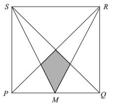
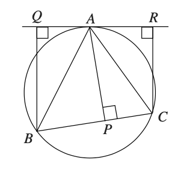

# Līdzīgi trijstūri: Uzdevumi {-}

## 1.uzdevums ([problems.ru #116136](https://problems.ru/view_problem_details_new.php?id=116136)) {-}

Divus līdzīgus trijstūrus sagrieza divos trijstūrveida gabalos tā, ka viens 
gabals, kas iegūts no pirmā trijstūra, līdzīgs gabalam, kas 
iegūts no otrā trijstūra. 
Vai var apgalvot, ka arī atlikušie gabali ir savstarpēji līdzīgi?

## 2.uzdevums ([problems.ru #98389](https://problems.ru/view_problem_details_new.php?id=98389)) {-}

Minhauzens apgalvo, ka viņam izdevies salikt taisnstūri no savstarpēji līdzīgiem trijstūriem, 
kuri nav taisnleņķa trijstūri. 
Vai viņam var ticēt? (Starp līdzīgiem trijstūriem drīkst būt arī vienādi.)

## 3.uzdevums ([problems.ru #98449](https://problems.ru/view_problem_details_new.php?id=98449)) {-}

Trijstūrī bisektrišu krustpunktu savienoja ar virsotnēm; tā rezultātā tas sadalījās $3$ mazākos trijstūros. 
Viens no mazajiem trijstūriem ir līdzīgs sākotnējam. Atrast šī trijstūra leņķus.

## 4.uzdevums ([Prasolov 1.33, http://prasolov.loegria.net/planim5.pdf](http://prasolov.loegria.net/planim5.pdf)) {-}

Nogrieznis $BE$ sadala trijstūri $ABC$ divos līdzīgos trijstūros, 
turklāt līdzības koeficients ir $\sqrt{3}$. Atrast trijstūra 
$ABC$ leņķus.

## 5.uzdevums ([Prasolov 4.66, http://prasolov.loegria.net/planim5.pdf](http://prasolov.loegria.net/planim5.pdf)) {-}
Vai ar diviem taisniem griezieniem, kas iet caur trijstūra virsotnēm, sagriezt to četrās daļās tā, 
lai trīs trijstūri (no iegūtajām daļām) būtu ar vienādu laukumu?

## 6.uzdevums (UK.SMC.2015.17) {-}

$PQRS$ ir kvadrāts un $M$ ir malas $PQ$ viduspunkts (sk. attēlu). 
Kvadrāta laukums ir $k$ reizes lielāks par iekrāsotā apgabala laukumu. 
Atrast $k$ vērtību. 

{ width=108pt }

<!--
In the diagram, PQRS is a square. $M$ is the midpoint of $PQ$. 
The area of the square is $k$ times
the area of the shaded region. What is the value of $k$?
-->

## 7.uzdevums (UK.Maclaurin.2014.M4) {-}

Taisne $RAQ$ ir riņķa līnijas $ABC$ pieskare punktā $A$, un leņķi $\angle AQB$, $\angle CRA$ un $\angle APC$ visi ir taisni (sk. attēlu).
Pierādiet, ka $BQ \times CR = AP^2$.

{ width=108pt }

## 8.uzdevums ([problems.ru #52872](https://problems.ru/view_problem_details_new.php?id=52872)) {-}

Atrast hordas garumu, ja dots riņķa rādiuss $r$ un attālums $a$ no viena hordas galapunkta līdz 
riņķa pieskarei, kas novilkta otrā hordas galapunktā.

## 9.uzdevums (UK.MOG.2013.2) {-}

Izliektā četrstūrī $ABCD$ ar punktiem $A'$, $B'$, $C'$ un $D'$ apzīmēti attiecīgi trijstūru $BCD$, $CDA$, $DAB$ un $ABC$ mediānu krustpunkti.  
**(A)** Aplūkojot trijstūri $MCD$, kur $M$ ir malas $AB$ viduspunkts, pierādiet, ka $C'D'$ ir paralēla $DC$ un ka $C'D' = \frac{1}{3} DC$.  
**(B)** Pierādiet, ka četrstūri $ABCD$ un $A'B'C'D'$ ir līdzīgi.

<!--
In triangle $ABC$, the median from $A$ is the line $AM$, where $M$ is the midpoint of the side $BC$. In any triangle, the three medians intersect at the point called the centroid, which divides each median in the ratio $2:1$.

In the convex quadrilateral $ABCD$, the points $A'$, $B'$, $C'$ and $D'$ are the centroids of the triangles $BCD$, $CDA$, $DAB$ and $ABC$, respectively.

(a) By considering the triangle $MCD$, where $M$ is the midpoint of $AB$, prove that $C'D'$ is parallel to $DC$ and that $C'D' = \frac13 DC$.

(b) Prove that the quadrilaterals $ABCD$ and $A'B'C'D'$ are similar.
-->

## 10.uzdevums ([Prasolov 1.62, http://prasolov.loegria.net/planim5.pdf](http://prasolov.loegria.net/planim5.pdf)) {-}

Dots trijstūris $ABC$, kurā visi augstumi mazāki par $1$. 
Uzkonstruēt divas taisnes $x$ un $y$ tā, lai katram punktam 
$M$ uz malas $AC$, velkot nogriežņus $MX_M$ un $MY_M$ no $M$ 
paralēli taisnēm $x$ un $y$ 
līdz krustpunktiem attiecīgi ar malām $AB$ un $BC$, būtu spēkā 
$MX_M+MY_M = 1$.

## 11.uzdevums ([Prasolov 1.70, http://prasolov.loegria.net/planim5.pdf](http://prasolov.loegria.net/planim5.pdf)) {-}

Kvadrāta malas garums ir $1$. Caur tā centru novilkta taisne
un izmērīti attālumi no visām četrām kvadrāta virsotnēm līdz 
šai taisnei (attālumu no punkta līdz taisnei mēra pa perpendikulu). 
Atrast visu četru attālumu kvadrātu summu. 

## 12.uzdevums ([problems.ru #108029](https://problems.ru/view_problem_details_new.php?id=108029)) {-}

Vai var izvēlēties tādu trapeces pamatu garumu attiecību, pie kuras 
var novilkt tādu taisni $t$, uz kuras seši punkti -- taisnes $t$ krustpunkti 
ar trapeces diagonālēm, sānu malām un pamatu turpinājumiem -- 
veido piecus vienāda garuma nogriežņus?

