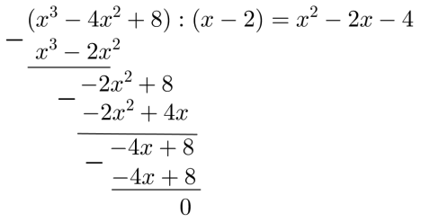

# Algebra: Vienādojumi, funkcijas, grafiki {-}

## 1.uzdevums (LV.NOL.2022.10.2) {-}

Atrisināt reālos skaitļos vienādojumu $x^{3}-4 x^{2}+8=0$.

::: solution
**Atrisinājums:**  
Uzminam, ka $x=2$ ir dotā vienādojuma sakne, jo $8-16+8=0$. Izdalot
polinomus (skat. 5.att.), iegūstam $(x-2)\left(x^{2}-2x-4\right)=0$.

<!--
$$\begin{aligned}
& \left(x^{3}-4 x^{2}+8\right):(x-2)=x^{2}-2 x-4 \\
& \frac{x^{3}-2 x^{2}}{-2 x^{2}+8} \\
& \;\;\; -2 x^{2}+4 x \\
& \;\;\; -4 x+8 \\
& \frac{-4 x+8}{0}
\end{aligned}$$
-->

{ width=250px }

Katru reizinātāju pielīdzinot nullei, iegūstam, ka $x-2=0$ vai $x^{2}-2x-4=0$.
Vienādojumu $x^{2}-2x-4=0$ risinām, atrodot diskriminantu $D=4+16=20$,
tad $x_{2 ; 3}=\frac{2 \pm 2 \sqrt{5}}{2}=1 \pm \sqrt{5}$. Tātad esam ieguvuši,
ka dotā vienādojuma saknes ir $x_{1}=2$ un $x_{2 ; 3}=1 \pm \sqrt{5}$.
:::

## 2.uzdevums (LV.NOL.2010.9.1) {-}

Atrodiet kaut vienu kvadrātvienādojumu ar veseliem koeficientiem, kam viena no saknēm ir
**(A)** $\sqrt{2}+1$,
**(B)** $\sqrt{7+4 \sqrt{3}}$.

**Piezīme.** Katrā uzdevuma daļā runā par **citu** kvadrātvienādojumu.

::: solution
**Atrisinājums:**

**(A)** piemēram, $x^{2}-2x-1=0$.

**(B)** ievērojam, ka $\sqrt{7+4 \sqrt{3}}=\sqrt{(\sqrt{3}+2)^{2}}=\sqrt{3}+2$. 
Tāpēc der, piemēram, vienādojums $x^{2}-4x+1=0$.
:::

## 3.uzdevums (LV.AMO.2004.8.1) {-}

Dots, ka kvadrātvienādojuma $x^{2}+px+q=0$ saknes ir $x_{1}$ un $x_{2}$, bet 
kvadrātvienādojuma $x^{2}+ax+b=0$ saknes ir $x_{1}^{2}$ un $x_{2}^{2}$. Izsacīt
$a$ un $b$ ar $p$ un $q$ palīdzību.

::: solution  
**Atrisinājums:**

No Vjeta teorēmas 
$b=x_{1}^{2} \cdot x_{2}^{2}=\left(x_{1}x_{2}\right)^{2}=q^{2}$,

bet 
$a=-\left(x_{1}^{2}+x_{2}^{2}\right)=2x_{1}x_{2}-\left(x_{1}+x_{2}\right)^{2}=2q-p^{2}$.
:::

## 4.uzdevums (LV.AMO.2015.8.1) {-}

Nosaki, vai izteiksmes $\sqrt{6+2 \sqrt{5}}-\sqrt{6-2 \sqrt{5}}$ vērtība ir
racionāls skaitlis!

::: solution
**Atrisinājums:**

Pārveidojam doto izteiksmi:

$$\begin{gathered}
\sqrt{6+2\sqrt{5}}-\sqrt{6-2\sqrt{5}}=\sqrt{(\sqrt{5})^{2}+2\sqrt{5}+1}-\sqrt{(\sqrt{5})^{2}-2\sqrt{5}+1}=\sqrt{(\sqrt{5}+1)^{2}}-\sqrt{(\sqrt{5}-1)^{2}}= \\
=\left|\sqrt{5}+1\right|-\left|\sqrt{5}-1\right|=\sqrt{5}+1-\sqrt{5}+1=2
\end{gathered}$$

Izteiksmes vētība ir racionāls skaitlis, jo $2$ ir racionāls.
:::

## 5.uzdevums (LV.VOL.2015.11.1) {-}

Kvadrātvienādojuma

$$(1+\sqrt{5}) x^{2}-\sqrt[4]{7} \cdot(1+\sqrt{5})^{2} x+\sqrt[4]{7}=0$$

saknes ir skaitļi $a$ un $b$. Pierādīt, ka izteiksmes 
$a^{4}b+ab^{4}+3a^{3}b^{2}+3a^{2}b^{3}+16a^{4}b^{3}+16a^{3}b^{4}$ vērtība ir 
vesels skaitlis!

::: solution
**Atrisinājums:**

No Vjeta teorēmas izriet, ka

$$\left\{\begin{array}{l}
a+b=\sqrt[4]{7} \cdot(1+\sqrt{5}) \\
ab=\frac{\sqrt[4]{7}}{1+\sqrt{5}}
\end{array}\right.$$

Pārveidojam doto izteiksmi:

$a^{4}b+ab^{4}+3a^{3}b^{2}+3a^{2}b^{3}+16a^{4}b^{3}+16a^{3}b^{4}=ab\left(a^{3}+b^{3}+3a^{2}b+3ab^{2}+16a^{3}b^{2}+16a^{2}b^{3}\right)=$  
$=ab\left((a+b)^{3}+16a^{2}b^{2}(a+b)\right)=\frac{\sqrt[4]{7}}{1+\sqrt{5}} \cdot\left(\sqrt[4]{7^{3}} \cdot(1+\sqrt{5})^{3}+16 \cdot \frac{\sqrt[4]{7^{2}} \cdot \sqrt[4]{7} \cdot(1+\sqrt{5})}{(1+\sqrt{5})^{2}}\right)=$

$=7 \cdot(1+\sqrt{5})^{2}+\frac{16 \cdot 7}{(1+\sqrt{5})^{2}}=7 \cdot\left((6+2 \sqrt{5})+\frac{16}{6+2 \sqrt{5}}\right)=$

$=7 \cdot \frac{36+24 \sqrt{5}+20+16}{6+2 \sqrt{5}}=7 \cdot 12 \cdot \frac{6+2 \sqrt{5}}{6+2 \sqrt{5}}=84.$

Tā kā skaitlis $84$ ir vesels skaitlis, tad prasītais ir pierādīts.
:::

\newpage

## 6.uzdevums (LV.VOL.2021.11.1) {-}

Pierādìt, ka $\sqrt[3]{6 \sqrt{3}+10}-\sqrt[3]{6 \sqrt{3}-10}=2$.

::: solution
**Atrisinājums:**

Ievērosim, ka $(\sqrt{3}+1)^{3}=6 \sqrt{3}+10$ un 
$(\sqrt{3}-1)^{3}=6 \sqrt{3}-10$. Līdz ar to

$$\sqrt[3]{6 \sqrt{3}+10}-\sqrt[3]{6 \sqrt{3}-10}=(\sqrt{3}+1)-(\sqrt{3}-1)=2$$
Un ievērojam, ka $2$ ir vesels skaitlis.
:::

## 7.uzdevums (LV.VOL.2006.10.4) {-}

Pierādīt, ka 
$\frac{1}{\sqrt{1}+\sqrt{2}}+\frac{1}{\sqrt{3}+\sqrt{4}}+\frac{1}{\sqrt{5}+\sqrt{6}}+\ldots+\frac{1}{\sqrt{2005}+\sqrt{2006}}>21,8$

::: solution
**Atrisinājums:**

Ievērojam, ka

$$\begin{aligned}
& S=\frac{1}{\sqrt{1}+\sqrt{2}}+\frac{1}{\sqrt{2}+\sqrt{3}}+\frac{1}{\sqrt{3}+\sqrt{4}}+\ldots+\frac{1}{\sqrt{2004}+\sqrt{2005}}+\frac{1}{\sqrt{2005}+\sqrt{2006}}= \\
& =(\sqrt{2}-\sqrt{1})+(\sqrt{3}-\sqrt{2})+(\sqrt{4}-\sqrt{3})+\ldots+(\sqrt{2005}-\sqrt{2004})+(\sqrt{2006}-\sqrt{2005})=
\end{aligned}$$

$=\sqrt{2006}-1 \geq 43,7$. Tā kā **šajā** summā katrs nākošais saskaitāmais 
mazāks par iepriekšējo, tad uzdevuma formulējumā minēto saskaitāmo summa ir 
lielāka par $\frac{1}{2} S$, tātad lielāka par $21,85$.
:::

## 8.uzdevums (LV.NOL.2004.9.4) {-}

Uz tāfeles uzrakstīti $2004$ skaitļi; viens no tiem ir $1$. Ar vienu gājienu 
atļauts nodzēst vienu skaitli un tā vietā uzrakstīt skaitli $a+b-c$, kur 
$a,\ b$ un $c$ - kaut kādi trīs no nenodzēstajiem skaitļiem. Vai, atkārtojot 
šādus gājienus vairākas reizes, var panākt, lai uz tāfeles vienlaicīgi būtu 
uzrakstīti $2004$ skaitļi, kas visi vienādi ar $1$?

::: solution
**Atrisinājums:**

Jā, var.  
Ja pieci no sākotnējiem skaitļiem ir 
$x;\ y;\ z;\ t;\ 1$, aizstājam $x$ un $y$ ar $a=z+t-1$. Tālāk $z$ un $t$ 
aizstājam ar $1+a-a=1$. Tālāk $a$ un $a$ aizstājam ar $1+1-1=1$. Tagad ir 
vismaz $5$ vieninieki. Līdzīgi pakāpeniski pārvēršam par vieniniekiem visus 
skaitļus, kas tādi vēl nav.
:::

## 9.uzdevums (LV.VOL.2023.12.3) {-}

 

Uz tāfeles uzrakstīti $100$ reāli pozitīvi skaitļi (ne obligāti dažādi). 
Ja uz tāfeles ir uzrakstīti skaitļi $x$ un $y$ (ne obligāti dažādi), 
tad uz tās ir uzrakstīts arī skaitlis $\frac{2xy}{x+y}$. 
Kāda var būt visu $100$ uzrakstīto skaitlu summa, ja zināms, 
ka viens no uzrakstītajiem skaitliem ir $73$?

::: solution
**Atrisinājums:**

Pierādīsim, ka visi $100$ uzrakstītie skaitļi ir vienādi.

Pieņemsim pretējo, ka uz tāfeles ir atrodami vismaz divi dažādi skaitļi. 
Sakārtosim visus skait|us nedilstošā secībā un ṇemsim divus ar mazākajām vērtībām 
$a<b$ ($a$ ir vismazākais skaitlis un $b$ ir otrs mazākais skaitlis). Pēc uzdevuma 
nosacījuma uz tāfeles ir rakstīts arī skaitlis $\frac{2 a b}{a+b}$. Parādīsim, ka 
$a<\frac{2 a b}{a+b}<b$, kas būs pretruna ar to, ka $a$ un $b$ ir divi mazākie skaitļi.

Lai pamatotu, ka $a<\frac{2ab}{a+b}$, reizinām abas nevienādības puses ar 
$a+b>0$ un iegūstam, ka $a^{2}+ab<2ab$ jeb $a^{2}<ab$, 
kas ir patiesa nevienādība, jo $a<b$.

Līdzīgi, lai pamatotu, ka $\frac{2ab}{a+b}<b$, reizinām abas 
nevienādības puses ar $a+b>0$ un iegūstam nevienādību $2ab<ab+b^{2}$, 
kas ir ekvivalenta patiesai nevienādībai $ab<b^{2}$, jo $a<b$.

Tātad visi uzrakstītie skaitļi ir vienādi un to summa ir 
$73 \cdot 100=7300$.

*Piezīme.* Skaitlis $\frac{2ab}{a+b}=\frac{2}{\frac{1}{a}+\frac{1}{b}}$ 
ir skaitļu $a$ un $b$ vidējais harmoniskais.
:::

## 10.uzdevums (LV.AMO.2015.9.1) {-}

No visiem tādiem skaitļiem, kuru starpība ir $2015$, noteikt tos divus, kuru
reizinājums ir vismazākais!

::: solution
**Atrisinājums:**

Dotos skaitļus apzīmējam ar $x$ un $x+2015$. Šo skaitļu reizinājums ir
$x \cdot(x+2015)$. Apskatām funkciju $f(x) = x \cdot(x+2015) = x^{2}+2015x$.
Funkcijas grafiks ir parabola ar zaru vērsumu uz augšu. Parabolas virsotnes
abscisa $x_{0}=\frac{-2015}{2}=-1007.5$ ir punkts, kurā funkcija sasniedz
vismazāko vērtību. Tātad meklētie divi skaitļi ir $-1007.5$ un $1007.5$.
:::

