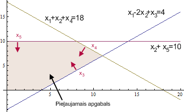
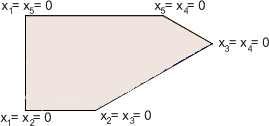

10. Simpleksalgoritms
======================================

Simpleksalgoritma ievads
--------------------------

Simpleksalgoritma pamatideja:

1. Sāk ar :math:`v` -- patvaļīgu stūri pieļaujamajā apgabalā.
2. Kamēr stūrim :math:`v` blakus atrodas stūris :math:`u`, kurā
   :math:`c_{11}x_1+\ldots+c_nx_n` vērtība ir lielāka, aizstāj 
   :math:`v` ar :math:`u`.

Atkārto otro soli tik ilgi, kamēr nevar atrast blakus stūri, 
kurā mērķa funkcijai ir lielāka vērtība. 
Ja tāda blakus stūra nav, tad mērķa funkcija 
jau sasniegusi maksimālo vērtību visā pieļaujamajā apgabalā.

Vienkāršs piemērs
--------------------

* Ar kāpostu sēklām var apsēt 3 hektārus. 
* Ar burkānu sēklām var apsēt 4 hektārus. 
* Mums ir 5 brīvi hektāri. 
* Peļņa ir 1200 EUR par kāpostu hektāru un 1700 EUR par burkānu hektāru. 
  Uzdevums ir maksimizēt peļņu. 

**Formalizēts uzdevums:** 
  :math:`\textcolor{blue}{\max \left( 1200x_k + 1700x_b \right)}`, kur

  .. math:: 

    \left\{ \begin{array}{l} 
    x_k \leq 3,\\
    x_b \leq 4\\
    x_k + k_b \leq 5,\\
    x_k,x_b \geq 0. 
    \end{array} \right.

1. Uzzīmēt pieļaujamo apgabalu (*feasible region*); 
   kāpostus zīmēt uz horizontālās taisnes, burkānus uz 
   vertikālās taisnes.
2. Atrast un atzīmēt pieļaujamā apgabala stūrus -- tos 
   2D plaknes punktus, kuros vismaz 2 no dotajām nevienādībām 
   pārvēršas par vienādībām. 
3. Uzzīmēt plaknē peļņas gradienta vektoru :math:`(1200, 1700)`. 
4. Atrast vistālāko stūri pieļaujamajā apgabalā, 
   uz kuru var aizbraukt ar šo gradienta vektoru. 

**Definīcija:** 
  Skalārs lauks (*scalar field*) ir reālvērtīga funkcija, kas 
  definēta katrā telpas punktā. Piemēram, divu dimensiju gadījumā 
  katram :math:`(x_1,x_2)` atbilst vērtība :math:`f(x_1,x_2)`.
  Piemēram, katrai kāpostu un burkānu apsētajai vērtībai var 
  izrēķināt peļņu: :math:`f(x_k,x_b) = 1200x_k + 1700 x_b`. 
  
*Piezīme:* Skalāriem laukiem nav sakara ar galīgiem laukiem
(algebrisko struktūru, kas parādījās Rīda-Solomona kodos). 

**Definīcija:** 
  Par *gradientu* skalāram laukam :math:`f` sauc vektoru 
  :math:`\nabla f(x_1, x_2)`, kas definēts katram 
  :math:`(x_1,x_2) \in \mathbb{R}^2`. To definē šādi: 

  .. math:: 

    \nabla f(x_1, x_2) = \left( \frac{\partial f}{\partial x_1}(x_1, x_2), \frac{\partial f}{\partial x_2}(x_1, x_2) \right)

Mūsu piemērā peļņas funkcijas parciālie atvasinājumi ir attiecīgi 
:math:`1200` un :math:`1700` (konstantas vērtības). Tātad peļņas funkcija 
vienmērīgi aug gradienta vektora norādītajā virzienā. 

Duālais uzdevums
~~~~~~~~~~~~~~~~~~~

Iedomāsimies, ka vēlamies pierādīt, ka :math:`(x_k,x_b) = (1,4)`
ir optimālais kāpostu-burkānu lineārās programmas atrisinājums. 

Apskatām sistēmu: 

.. math:: 

  \left\{ \begin{array}{l} 
  x_k \leq 3,\\
  x_b \leq 4\\
  x_k + k_b \leq 5,\\
  x_k,x_b \geq 0. 
  \end{array} \right.

Tajā pirmo nevienādību var pareizināt ar kaut kādu skaitli, 
piemēram, :math:`y_1 = 1200` un otro nevienādību ar skaitli 
:math:`y_2 = 1700`, un trešo nevienādību ar :math:`0` 
un tad var iegūt, ka 

.. math:: 

  \left\{ \begin{array}{l} 
  1200x_k \leq 3600,\\
  1700x_b \leq 6800\\
  \end{array} \right.

Saskaitot abas nevienādības, iegūstam, ka 
:math:`1200x_k + 1700x_b \leq 10400`. 

Bet var arī dabūt citus novērtējumus. 
Teiksim, pirmo nevienādību reizina ar :math:`y_1 = 200`; 
otro ar :math:`y_2 = 700` un trešo ar :math:`y_3 = 1000`.
Var dabūt jau labāku novērtējumu. 

Uzdevuma pārveidojums standartformā
-------------------------------------

Par uzdevuma standartformu sauc uzdevumu tādā formā, 
ka nosacījumi ir nevienādības formā :math:`x_i \geq 0` vai arī vienādības. 

Piemēram, lai nosacījumu :math:`x_1 - 2x_2 \leq 4` pārvērstu standartformā, 
ievieš papildus mainīgo (*slack variable*) :math:`x_3 \geq 0`. Tātad:

.. math:: 

  \begin{array}{l}
  x_1-2x_2 \leq 4\;\; \Leftrightarrow \\
  x_1-2x_2+x_3=4,\;x_3 \geq 0\\
  \end{array}

Tādā veidā var iegūt ekvivalentu uzdevumu, kurā vienīgās nevienādības ir formā 
:math:`x_i \geq 0`.

Jo vairāk nevienādību, jo vairāk papildus mainīgo: 

**Piemērs:**  
  :math:`\textcolor{blue}{\max \left( 2x_1 + 3x_2 \right)}`, kur

  .. math:: 

    \left\{ \begin{array}{l} 
    x_1-2x_2 \leq 4,\\
    x_1+x_2 \leq 18,\\
    x_2 \leq 10,\\
    x_1,x_2 \geq 0. 
    \end{array} \right.

  Pārveidojam: :math:`\textcolor{blue}{\max \left( 2x_1 + 3x_2 \right)}`, kur

  .. math:: 

    \left\{ \begin{array}{l}
    x_1-2x_2+x_3=4,\\
    x_1+x_2+x_4=18,\\
    x_2+x_5=10,\\
    x_1,x_2,x_3,x_4,x_5 \geq 0.
    \end{array} \right.

Nosacījumiem atbilstošais apgabals
~~~~~~~~~~~~~~~~~~~~~~~~~~~~~~~~~~~~

Stūris -- punkts, kur krustojas :math:`2` taisnes, kas atbilst nosacījumam - 
ir punkts, kurā divi no mainīgajiem :math:`x_1,\ldots,x_n` vienādi ar :math:`0`.

Attēls ar stūriem: 

Plaknes gadījumā stūri var aprakstīt, pasakot kuri 
divi mainīgie ir vienādi ar :math:`0`. Vairāku dimensiju gadījumā ir līdzīgi. 
Trīs dimensiju gadījumā stūris ir punkts, kurā :math:`3` 
mainīgie ir :math:`0`.

Ja ir :math:`k` dimensijas (meklē 
:math:`\textcolor{blue}{\max \left(a_1x_1 + \ldots + a_kx_k\right)}`), 
tad stūris ir punkts, kurā sastopas :math:`k` plaknes :math:`n`-dimensiju telpā, 
t.i. :math:`k` mainīgie ir vienādi ar :math:`0`.

Simpleksalgoritma tabula
---------------------------

Simpleksalgoritma parādīšanai turpinām agrāko piemēru:

.. math:: 

  \textcolor{blue}{\max \left( 2x_1+3x_2 \right)}

.. math:: 

  \left\{ \begin{array}{l}
  x_1-2x_2+x_3=4\\
  x_1+x_2+x_4=18\\
  x_2+x_5=10\\
  x_1,x_2,x_3,x_4,x_5 \geq 0 
  \end{array} \right.

Simpleksalgoritma soļus ērti pierakstīt ar tabulas palīdzību. 
Sākotnējo tabulu sastāda tabulas rindiņās ierakstot uzdevuma ierobežojumus. 
Tabulas pēdējā rindiņa raksta funkciju, kuru maksimizēt. 

.. raw:: latex
    
    \begin{center}
    \begin{tabular}{|c|c|c|c|c|c|c|}
    \hline
    \cellcolor{lightgray}\(\displaystyle x_1\) & \cellcolor{lightgray}\(\displaystyle x_2\) & \(\displaystyle x_3\) & \(\displaystyle x_4\) & \(\displaystyle x_5\) & \(\displaystyle b_i\) & Atbilstošā izteiksme \\
    \hline
    \cellcolor{lightgray}1 & \cellcolor{lightgray}-2 & $1$ & $0$ & $0$ & $4$ & $x_1 - 2x_2 + x_3 = 4$ \\
    \hline
    \cellcolor{lightgray}1 & \cellcolor{lightgray}1 & \(\displaystyle 0\) & \(\displaystyle 1\) & \(\displaystyle 0\) & 18 & \(\displaystyle x_1 + x_2 + x_4 = 18\) \\
    \hline
    \cellcolor{lightgray}0 & \cellcolor{lightgray}1 & \(\displaystyle 0\) & \(\displaystyle 0\) & \(\displaystyle 1\) & 10 & \(\displaystyle x_2 + x_5 = 10\) \\
    \hline
    \cellcolor{lightgray}\textbf{2} & \cellcolor{lightgray}\textbf{3} & \textbf{0} & \textbf{0} & \textbf{0} & \textbf{0} & \(\displaystyle \max\left(2x_1+3x_2\right)\) \\
    \hline
    \end{tabular}
    \end{center}

* Šīs tabulas pēdējā rindiņa atbilst vērtībām 
  :math:`x_1 = 0`, :math:`x_2 = 0`. Tos abus sauc par *brīvajiem mainīgajiem* 
  (*non-basic variables*, *tight variables*).
* Visi citi :math:`x_3,x_4,x_5 \neq 0` ir *pamatmainīgie* (*basic variables*, 
  *loose variables*). 

*Piezīme:* Tā kā par pirmo tuvinājumu izvēlējāmies :math:`(x_1, x_2) = (0,0)`, 
tad sagadījās tā, ka brīvie mainīgie ir :math:`x_1, x_2`, kuri bija doti sākumā, 
bet pamatmainīgie ir no jauna ieviestie (*slack*) mainīgie :math:`x_3,x_4,x_5`. 
Bet turpmāk brīvie/pamata mainīgie visu laiku mainīsies vietām --
tie allaž atkarīgi no tuvinājuma punkta.

Pirmais simpleksalgoritma solis
~~~~~~~~~~~~~~~~~~~~~~~~~~~~~~~~~~~

Esam stūrī, kuru apraksta iepriekšējā tabula. 
Pārbauda, vai blakus stūrī vērtība nav lielāka

1. Atrod brīvo mainīgo, kuru palielinot mērķfunkcija pieaug visstraujāk.
   (Ir arī citi simpleksalgoritma varianti, kuri izvēlas kādu citu 
   brīvo mainīgo, pie kura ir pozitīvs koeficients mērķfunkcijai -- 
   ne vienmēr lielākais koeficients būs optimāls.)
2. Palielina šo mainīgo. Tas bija :math:`0`, tagad pozitīvs, 
   vienlaikus mainot pamatmainīgos tā, lai visi nosacījumi paliktu patiesi.
3. Tur, kur kāds no pamatmainīgajiem kļūst :math:`0`, apstājas.

Izteiksmē  :math:`\max \left( 2x_1+3x_2 \right)` lielākais pozitīvais koeficients 
ir pie :math:`x_2`; var palielināt to. (Kaut arī varētu arī palielināt :math:`x_1`.)

Ja :math:`x_2`` pieaug par :math:`d`:  
:math:`x_1-2x_2+x_3` samazinās par :math:`2d`. Pēc nosacījumiem izteiksmei 
jābūt vienādai ar :math:`4`. Lai to panāktu :math:`x_3` palielina par :math:`2d`.  
:math:`x_1+x_2+x_4` pieaug par :math:`d`. Lai saglabātu vienādību, 
:math:`x_4` samazina par :math:`d`; :math:`x_2+x_5` pieaug par :math:`d`. 
Jāsamazina :math:`x_5` par :math:`d`.

Par cik var palielināt :math:`x_2`, nepadarot citu mainīgo negatīvu?  
:math:`x_3=4`, :math:`x_4=18`, :math:`x_5=10`.

Palielinot :math:`x_2` par :math:`d`:  
:math:`x_3= 4 + 2d`;
:math:`x_4=18 - d`; 
:math:`x_5=10 - d`.  
Ja :math:`d = 10`, tad :math:`x_5 = 0`. Ja :math:`d > 10`, :math:`x_5 < 0`. 
Tātad maksimālais palielinājums ir :math:`10`.

Tādā gadījumā mēs būsim pārgājuši no stūra, 
kurā :math:`x_1 = x_2 = 0` uz stūri, kurā :math:`x_1 = x_5 = 0`.
Tāpēc jāmaina vietām kolonna :math:`x_2` un kolonna :math:`x_5`: 

.. raw:: latex

    \begin{center}
    \begin{tabular}{|c|c|c|c|c|c|c|}
    \hline
    \cellcolor{lightgray}$x_1$ & 
    \cellcolor{lightgray}$x_5$ & 
    $x_3$ & 
    $x_4$ & 
    $x_2$ & 
    $b_i$ & Atbilstošā izteiksme \\
    \hline
    \cellcolor{lightgray}$1$ & 
    \cellcolor{lightgray}$0$ & 
    $1$ & 
    $0$ & 
    \cellcolor{paleblue}$-2$ & 
    $4$ & 
    $x_1 - 2x_2 + x_3 = 4$ \\ 
    \hline
    \cellcolor{lightgray}$1$ & 
    \cellcolor{lightgray}$0$ & 
    $0$ & 
    $1$ & 
    \cellcolor{paleblue}$1$ & 
    $18$ & 
    $x_1 + x_2 + x_4 = 18$ \\
    \hline
    \cellcolor{lightgray}$0$ & 
    \cellcolor{lightgray}$1$ & 
    $0$ & 
    $0$ & 
    $1$ & 
    $10$ & 
    $x_2 + x_5 = 10$ \\
    \hline
    \cellcolor{lightgray}\textbf{2} & 
    \cellcolor{lightgray}\textbf{0} & 
    \textbf{0} & 
    \textbf{0} & 
    \textbf{3} & 
    \textbf{0} & 
    $\max\left(2x_1+3x_2\right)$ \\
    \hline
    \end{tabular}
    \end{center}

Pēc kolonnu apmainīšanas, tabula jāpārveido par ekvivalentu tabulu 
standartformā (standartformas tabulā pamatmainīgajiem atbilstošie 
vienādojumi veido vienības matricu, apakšējā rindā ir visas nulles). 

1. Pareizina 3.rindu ar :math:`2`, pieskaita 1.rindai:  
   :math:`(x_1+x_3-2x_2)+2(x_5+x_2)=4 + 2 \cdot 10`
2. Atņem 3.rindu no 2.rindas

.. raw:: latex 

  \begin{center}
  \begin{tabular}{|c|c|c|c|c|c|c|}
  \hline
  \cellcolor{lightgray}$x_1$ & 
  \cellcolor{lightgray}$x_5$ & 
  $x_3$ & 
  $x_4$ & 
  $x_2$ & 
  $b_i$ & 
  Atbilstošā izteiksme \\
  \hline
  \cellcolor{lightgray}1 & 
  \cellcolor{lightgray}2 & 
  $1$ & 
  $0$ & 
  $0$ & 
  $24$ & 
  $x_1 + 2x_5 + x_3 = 24$ \\
  \hline
  \cellcolor{lightgray}$1$ & 
  \cellcolor{lightgray}$-1$ & 
  $0$ & 
  $1$ & 
  $0$ & 
  $8$ & 
  $x_1 - x_5 + x_4 = 8$ \\
  \hline
  \cellcolor{lightgray}$0$ & 
  \cellcolor{lightgray}$1$ & 
  $0$ & 
  $0$ & 
  $1$ & 
  $10$ & 
  $x_2 + x_5 = 10$ \\
  \hline
  \cellcolor{lightgray}\textbf{2} & 
  \cellcolor{lightgray}\textbf{0} & 
  \textbf{0} & 
  \textbf{0} & 
  \cellcolor{paleblue}\textbf{3} & 
  \textbf{0} & 
  $\max\left(2x_1+3x_2\right)$ \\
  \hline
  \end{tabular}
  \end{center}

Visbeidzot, atbrīvojamies no nenulles koeficienta pēdējā rindā: 
No apakšējās rindas atņem trīskāršotu 3.rindu: 

.. raw:: latex

  \begin{center}
  \begin{tabular}{|c|c|c|c|c|c|c|}
  \hline
  \cellcolor{lightgray}$x_1$ & 
  \cellcolor{lightgray}$x_5$ & 
  $x_3$ & 
  $x_4$ & 
  $x_2$ & 
  $b_i$ & 
  Atbilstošā izteiksme \\
  \hline
  \cellcolor{lightgray}1 & \cellcolor{lightgray}2 & \(\displaystyle 1\) & \(\displaystyle 0\) & \(\displaystyle 0\) & 24 & \(\displaystyle x_1 + 2x_5 + x_3 = 24\) \\
  \hline
  \cellcolor{lightgray}1 & \cellcolor{lightgray}-1 & \(\displaystyle 0\) & \(\displaystyle 1\) & \(\displaystyle 0\) & 8 & \(\displaystyle x_1 - x_5 + x_4 = 8\) \\
  \hline
  \cellcolor{lightgray}0 & \cellcolor{lightgray}1 & \(\displaystyle 0\) & \(\displaystyle 0\) & \(\displaystyle 1\) & 10 & \(\displaystyle x_2 + x_5 = 10\) \\
  \hline
  \cellcolor{lightgray}\textbf{2} & 
  \cellcolor{lightgray}\textbf{-3} & 
  \textbf{0} & 
  \textbf{0} & 
  \textbf{0} & 
  \textbf{-30} & 
  $\max\left(2x_1-3x_5\right)$ \\
  \hline
  \end{tabular}
  \end{center}

Iegūta tabula standartformā. Pirmā simpleksalgoritma soļa beigas.

Otrais simpleksalgoritma solis
~~~~~~~~~~~~~~~~~~~~~~~~~~~~~~~~~~~

Tā kā palielinot :math:`x_5` mērķa funkcija samazinātos, atliek palielināt :math:`x_1`.

:math:`x_1 = x_1 + d`; :math:`x_3 = x_3 - d`; 
:math:`x_3 = 24 - d`, :math:`x_4 = x_4 - d`, :math:`x_4 = 8 - d`.   
Ja :math:`d=8`, tad :math:`x_4=0`.

Tātad var mainīt vietām kolonnas :math:`x_1` un :math:`x_4`: 

.. raw:: latex

  \begin{center}
  \begin{tabular}{|c|c|c|c|c|c|c|}
  \hline
  \cellcolor{lightgray}$x_4$ & 
  \cellcolor{lightgray}$x_5$ & 
  $x_3$ & 
  $x_1$ & 
  $x_2$ & 
  $b_i$ & 
  Atbilstošā izteiksme \\
  \hline
  \cellcolor{lightgray}$0$ & 
  \cellcolor{lightgray}$2$ & 
  $1$ & 
  \cellcolor{paleblue}$1$ & 
  $0$ & 
  24 & 
  $x_1 + 2x_5 + x_3 = 24$ \\
  \hline
  \cellcolor{lightgray}1 & \cellcolor{lightgray}-1 & \(\displaystyle 0\) & \(\displaystyle 1\) & \(\displaystyle 0\) & 8 & \(\displaystyle x_1 - x_5 + x_4 = 8\) \\
  \hline
  \cellcolor{lightgray}0 & \cellcolor{lightgray}1 & \(\displaystyle 0\) & \(\displaystyle 0\) & \(\displaystyle 1\) & 10 & \(\displaystyle x_2 + x_5 = 10\) \\
  \hline
  \cellcolor{lightgray}\textbf{0} & 
  \cellcolor{lightgray}\textbf{-3} & 
  \textbf{0} & 
  \cellcolor{paleblue}\textbf{2} & 
  \textbf{0} & 
  \textbf{-30} & 
  $\max\left(2x_1-3x_5\right)$ \\
  \hline
  \end{tabular}
  \end{center}

Pārveidojam standartformā: No pirmās rindas atņemam otro rindu. 
Un no pēdējās rindas atņemam divkāršotu otro rindu. 

.. raw:: latex

  \begin{center}
  \begin{tabular}{|c|c|c|c|c|c|c|}
  \hline
  \cellcolor{lightgray}$x_4$ & 
  \cellcolor{lightgray}$x_5$ & 
  $x_3$ & 
  $x_1$ & 
  $x_2$ & 
  $b_i$ & 
  Atbilstošā izteiksme \\
  \hline
  \cellcolor{lightgray}$-1$ & 
  \cellcolor{lightgray}$3$ & 
  $1$ & 
  $0$ & 
  $0$ & 
  $16$ & 
  $-x_4 + 3x_5 + x_3 = 16$ \\
  \hline
  \cellcolor{lightgray}$1$ & 
  \cellcolor{lightgray}$-1$ & 
  $0$ & 
  $1$ & 
  $0$ & 
  $8$ & 
  $x_1 - x_5 + x_4 = 8$ \\
  \hline
  \cellcolor{lightgray}$0$ & 
  \cellcolor{lightgray}$1$ & 
  $0$ & 
  $0$ & 
  $1$ & 
  $10$ & 
  $x_2 + x_5 = 10$ \\
  \hline
  \cellcolor{lightgray}\textbf{-2} & 
  \cellcolor{lightgray}\textbf{-1} & 
  \textbf{0} & 
  \textbf{0} & 
  \textbf{0} & 
  \textbf{-46} & 
  $\max\left(-2x_4-x_5\right)$ \\
  \hline
  \end{tabular}
  \end{center}

Brīvos mainīgos nevar palielināt tā, lai izteiksmes 
vērtība palielinātos, jo visi koeficienti izteiksmē :math:`-2x_4 - x_5` ir negatīvi. 
Sasniegts maksimums.

Atrisinājuma iegūšana
~~~~~~~~~~~~~~~~~~~~~~~~~~~~~~

Abi brīvie mainīgie :math:`x_4 = x_5 = 0`. 
Ievietojam tos sākotnējā sistēmā: 

.. math:: 

  \left\{ \begin{array}{l}
  x_1-2x_2+x_3=4,\\
  x_1+x_2+x_4=18,\\
  x_2+x_5=10,\\
  x_1,x_2,x_3,x_4,x_5 \geq 0.
  \end{array} \right.

Iegūstam: 

.. math:: 

  \left\{ \begin{array}{l}
  x_1-2x_2+x_3=4,\\
  x_1+x_2+x_4=18,\\
  x_2+x_5=10,\\
  x_1,x_2,x_3,x_4,x_5 \geq 0.
  \end{array} \right.

* No :math:`x_2 + x_5 = 10` seko :math:`x_2 = 10`, jo :math:`x_5 = 0`. 
* No :math:`x_1 + x_2 + x_4 = 18` seko :math:`x_1 = 18 - x_2 - x_4 = 8`.

Ievietojam iegūtās vērtības sākotnējā mērķa funkcijā: 

.. math:: 

  2x_1 + 3x_2 = 2 \cdot 8 + 3 \cdot 10  = 16 + 30 = 46. 

Tātad lielākā vērtība, ko var sasniegt :math:`2x_1 + 3x_2` pie dotajiem 
nosacījumiem ir :math:`46`, kas iestājas pie :math:`(x_1, x_2) = (8, 10)`.  

LP vispārīgajā formā
------------------------

**LP uzdevums:** 
  Atrast :math:`\textcolor{blue}{\max(c_1x_1 + \ldots + c_nx_n)}`, 
  ja izpildās :math:`k+n` nosacījumi:

.. math:: 

  \left\{
  \begin{array}{l}
  a_{11}x_1 + a_{12}x_2 + \ldots + a_{1n}x_n = b_1\\
  \ldots\\
  a_{k1}x_1 + a_{m2}x_2 + \ldots + a_{kn}x_n = b_k\\
  x_1,x_2,\ldots,x_n \geq 0
  \end{array} \right.

.. list-table:: 
   :header-rows: 1
   :align: center

   * - :math:`x_1`
     - :math:`\ldots`
     - :math:`x_{n-k}`
     - :math:`x_{n-k+1}`
     - 
     - :math:`\ldots`
     - :math:`x_n`
     - :math:`b_i`
     - Atbilstošā izteiksme
   * - :math:`a_{1,1}`
     - :math:`\ldots`
     - :math:`a_{1,n-k}`
     - :math:`a_{1,n-k+1}`
     - :math:`\ldots`
     - :math:`\ldots`
     - :math:`a_{1,n}`
     - :math:`b_1`
     - :math:`a_{1,1}x_1+\ldots+a_{1,n}x_n=b_1`
   * - :math:`a_{2,1}`
     - :math:`\ldots`
     - :math:`a_{2,n-k}`
     - :math:`a_{2,n-k+1}`
     - :math:`\ldots`
     - :math:`\ldots`
     - :math:`a_{2,n}`
     - :math:`b_2`
     - :math:`a_{2,1}x_1+\ldots+a_{2,n}x_n=b_2`
   * - :math:`\ldots`
     - :math:`\ldots`
     - :math:`\ldots`
     - :math:`\ldots`
     - :math:`\ldots`
     - :math:`\ldots`
     - :math:`\ldots`
     - :math:`\ldots`
     - :math:`\ldots`
   * - :math:`c_1`
     - :math:`\ldots`
     - :math:`c_{n-k}`
     - :math:`c_{n-k+1}`
     - :math:`c_{n-k+2}`
     - :math:`\ldots`
     - :math:`c_n`
     - 
     - :math:`\max(c_1x_1 + \ldots + c_nx_n)`

TODO: Bottom tables: 
:math:`x_1 = 0, \ldots, x_{n-k} = 0`
and :math:`x_i \neq 0`. 

Ar šo *simpleksalgoritma tabulu* (*simplex tableau*), 
kas ir taisnstūrveida :math:`(k+1) \times (n+1)` matrica,
veiksim rindu un kolonnu pārveidojumus. 

Pārveidošana standartformā
~~~~~~~~~~~~~~~~~~~~~~~~~~~~

**Tāpat kā agrāk:** 
  Mainīgie :math:`x_1,\ldots,x_n \geq 0` apmierina :math:`k`
  lineāras vienādības (:math:`k < n`).   

**Papildus zināms:** 
  Simpleksalgoritms atrodas stūrī: :math:`x_1,\ldots,x_{n-k} = 0`. 

.. list-table:: 
   :header-rows: 1
   :align: center

   * - :math:`x_1`
     - :math:`\ldots`
     - :math:`x_{n-k}`
     - :math:`x_{n-k+1}`
     - 
     - :math:`\ldots`
     - :math:`x_{n}`
     - :math:`b_i`
     - Atbilstošā izteiksme
   * - :math:`a_{1,1}`
     - :math:`\ldots`
     - :math:`a_{1,n-k}`
     - :math:`1`
     - :math:`0`
     - :math:`\ldots`
     - :math:`0`
     - :math:`b_1`
     - 
   * - 
     - 
     - 
     - :math:`0`
     - :math:`1`
     - :math:`\ldots`
     - :math:`0`
     - :math:`b_2`
     - 
   * - 
     - 
     - 
     - :math:`\ldots`
     - :math:`\ldots`
     - :math:`\ldots`
     - :math:`\ldots`
     - :math:`\ldots`
     - 
   * - 
     - 
     - 
     - :math:`0`
     - :math:`0`
     - :math:`\ldots`
     - :math:`1`
     - :math:`b_k`
     - 
   * - :math:`c_1`
     - :math:`\ldots`
     - :math:`c_{n-k}`
     - :math:`0`
     - :math:`0`
     - :math:`\ldots`
     - :math:`0`
     - 
     - 
   * - :math:`x_1 = 0, \ldots, x_{n-k} = 0`
     - 
     - 
     - :math:`x_i \neq 0`
     - 
     - 
     - 
     - 
     - 

Lineāra un veselo skaitļu programmēšana ar Python  
---------------------------------------------------

Mugursomas uzdevums 
~~~~~~~~~~~~~~~~~~~~~~

Doti :math:`N` objekti. Katram no tiem dota 
cena :math:`c_i` un svars :math:`w_i`. 

===========  ====  ====  ====  ====  ====  ====  ====  ====
:math:`i`    1     2     3     4     5     6     7     8
===========  ====  ====  ====  ====  ====  ====  ====  ====
:math:`c_i`  19    17    30    13    25    29    23    10
:math:`w_i`  4     2     8     3     7     5     9     6
===========  ====  ====  ====  ====  ====  ====  ====  ====

Pārveidot mugursomas uzdevumu par lineārās/veselo skaitļu 
programmēšanas uzdevumu.
Use "pulp" package to solve this in Python.

.. https://youtu.be/E72DWgKP_1Y?si=hcea7o5EMqtuY0OS

