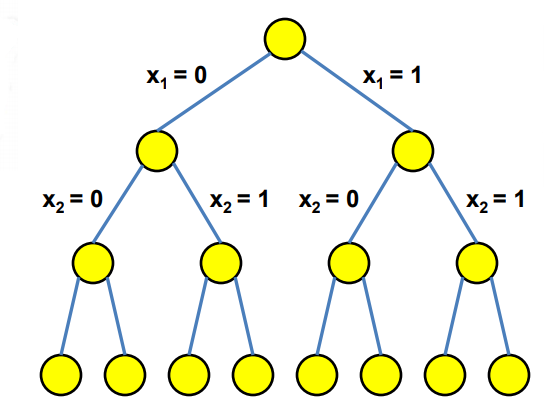
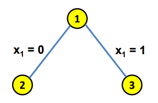
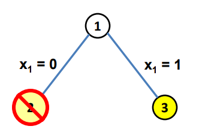
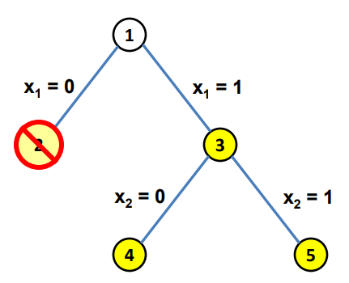
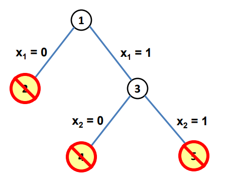
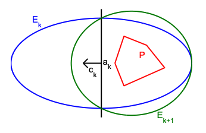
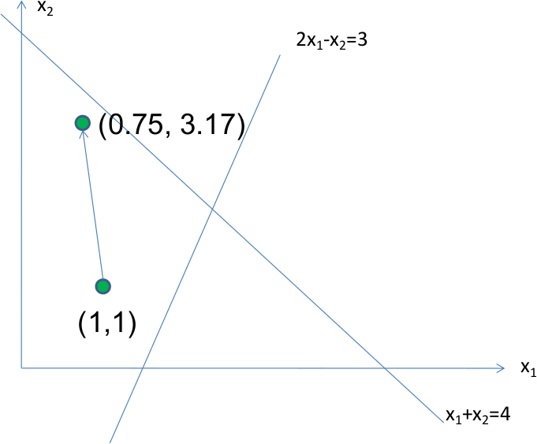

12. Heiristikas un tuvinātas metodes
========================================

Šajā nodaļā apskatītas dažas praktiskas metodes lineārās un veselo skaitļu 
programmēšanas uzdevumiem. 

Branch and Bound metode
----------------------------

**Mugursomas uzdevums (0-1 Knapsack Problem):** 
  Kombinatoriskās optimizācijas 
  uzdevums: Dotas vairākas lietas (katrai zināms gan svars :math:`w_i`, 
  gan vērtība :math:`c_i`), 
  atrast kuras no tām pievienot kolekcijai ("mugursomai") tā, 
  lai kopīgais svars nepārsniedz doto limitu un kopīgā vērtība ir iespējami liela.  
  (Piemēram, resursu piešķiršanas uzdevumi, kur jāizvēlas no daudziem 
  nedalāmiem projektiem pie fiksēta budžeta vai laika ierobežojuma.)

.. math:: 

  \textcolor{blue}{\max \left( \sum\limits_{i=1}^n v_i x_i \right)},\;\;\text{kur}\;\;
  \left\{ \begin{array}{l}
  \sum\limits_{i=1}^n w_i x_i \leq W,\\
  x_i \in \{0,1\}\\
  \end{array} \right.

Cits šī uzdevuma variants *Bounded knapsack problem*
atļauj ņemt vairākas identiskas lietas (katru lietu līdz skaitam :math:`d`).  
Vai arī *Unbounded knapsack problem*, kas atļauj paņemt 
jebkuru veselu skaitu kopiju.

Var meklēt risinājumu ar pilno pārlasi. 
Rodas lēmumu koks (*decision tree*) mainīgajiem :math:`x_1,x_2,x_3,\ldots`.

* Jau zināms, ka LP uzdevuma mainīgie ir veseli skaitļi, kas
  izpilda nevienādības: :math:`0 \leq x_i \leq 1` visiem :math:`i = 1,\ldots,m`. 
* Pilnā pārlase vienmēr strādās (:math:`4` mainīgajiem un :math:`16` gadījumiem 
  tā ir efektīvākā metode), bet lielākām problēmām pilnās pārlases 
  ilgums pieaugs eksponenciāli. 

**Branch and Bound algorithma pamatideja:** 

  * "Branch and bound" izmanto *LP relaksāciju*
    (atļauj reālus :math:`x_i \in [0;1]`), lai risinātu sākotnējo veselo skaitļu uzdevumu.
  * Ja arī relaksētā LP uzdevuma atrisinājums ir mazāks, 
    nekā līdz šim atrastais veselo skaitļu risinājums - 
    *pašreizējais risinājums* (*incumbent solution*), 
    tad attiecīgo zaru *nogriež* (*prune*).  

Atskaitot mazus vai īpaši uzkonstruētus (praksē maz sastopamus) piemērus, 
šādai pieejai var atmest :math:`>99.99999\%` utml. 
no lēmumu koka virsotnēm. Iespēja ievērojami samazināt pilno pārlasi 
dod ietaupījumu -- pat ja ir papildus jārisina relaksētie LP apakšuzdevumi. 

* Ieviesīsim numurētus *mezglus* (*nodes*) lēmumu kokā (atkarībā no tā, 
  cik mainīgos esam fiksējuši par :math:`0` vai :math:`1`). Tos saliek BFS 
  apstaigāšanas secībā:
  
  - Mezglā :math:`v_1` nekas nav fiksēts (visus mainīgos var izvēlēties patvaļīgi); 
  - Mezglā :math:`v_2` ir zināms, ka :math:`x_1 = 0` (visi citi ir patvaļīgi); 
  - Mezglā :math:`v_3` ir zināms, ka :math:`x_1 = 1` (visi citi ir patvaļīgi); 
  - Mezglā :math:`v_4` ir zināms, ka :math:`x_1 = 0` un :math:`x_2 = 0` (visi citi ir patvaļīgi). 

* Ar :math:`\mathbf{x}(j)` apzīmējam (relaksētā) LP uzdevuma optimālās reālās 
  vērtības :math:`x_i \in [0;1]` mezglā :math:`v_j` un :math:`z_{LP}(j)` apzīmē iegūto 
  mērķfunkcijas maksimumu mezglā :math:`v_j`. 

**"Branch and Bound" Pseidokods:**
  *Ievade:* Veselo skaitļu programmēšanas uzdevums (mainīgo vērtības :math:`x_i \in \{ 0,1 \}`) 
  ar mērķa funkcijas koeficientiem 
  :math:`\mathbf{c}`, ar ierobežojumu nevienādību labajām pusēm :math:`\mathbf{b}` un 
  matricu :math:`A`.

  *Izvade:* Optimālās mainīgo vērtības :math:`x_i \in \{ 0,1 \}`. 
  
  | :math:`\text{\sc BranchAndBound}(\mathbf{c},A,\mathbf{b})`
  | 1. :math:`\quad` Active nodes = :math:`\{ v_1 \}` :math:`\quad` *// neviens x(i) nav fiksēts*
  | 2. :math:`\quad` Incumbent solution :math:`\mathbf{x} = (0,\ldots,0)`, :math:`z^{\ast} = 0`.
  | 3. :math:`\quad` **while** Active nodes :math:`\neq \varnothing`. 
  | 4. :math:`\quad\quad` Select an active node :math:`j` and mark it inactive
  | 5. :math:`\quad\quad` Let :math:`\mathbf{x}(j)` be a solution for the relaxed LP and 
    :math:`z_{LP}(j) = \mathbf{c}^T \cdot \mathbf{x}(j)`.
  | 6. :math:`\quad\quad` **if** :math:`z^{\ast} \geq z_{LP}(j)`: :math:`\quad` *// Pat relaksētais LP nav labāks par pašreizējo*
  | 7. :math:`\quad\quad\quad\;` Prune :math:`j`
  | 8. :math:`\quad\quad`  **else if** :math:`z^{\ast} < z_{LP}(j)` **and** :math:`\mathbf{x}(j)` 
    are all integers: :math:`\quad` *// Labāks nekā pašreizējais/incumbent atrisinājums*
  | 9. :math:`\quad\quad\quad\;` Incumbent becomes :math:`\mathbf{x}(j)`
  | 10. :math:`\quad\quad\quad` Prune :math:`j`
  | 11. :math:`\quad\quad` **else if** :math:`z^{\ast} < z_{LP}(j)` **and** :math:`\mathbf{x}(j)` 
    is not all integers: :math:`\quad` *// Varbūt var uzlabot pašreizējo?* 
  | 12. :math:`\quad\quad\quad` Mark the descendants of node :math:`j` as active

Veselu skaitļu uzdevuma piemērs
-----------------------------------

Meklēsim mainīgos :math:`x_i \in \{0,1\}`. 
Veselo skaitļu programmēšanas uzdevums: 

.. math:: 

  \textcolor{blue}{\max \left( 15x_1 + 12x_2 + 4x_3 + 2x_4 \right)},\;\;\text{kur}\;\;
  \left\{ \begin{array}{l}
  8x_1 + 5x_2 + 3x_3 + 2x_4 \leq 10,\\
  x_k \in \{0,1\}\;\;\text{pie}\;\;k=1,2,3,4.\\
  \end{array} \right. 

.. code-block:: python 

  from pulp import *

  n = 4
  weights = [8, 5, 3, 2]
  prices = [15, 12, 4, 2]
  carry_weight = 10

  model = LpProblem(sense=LpMaximize)
  variables = [LpVariable(name=f"x_{i}", cat=LpBinary) for i in range(n)]
  model += lpDot(weights, variables) <= carry_weight
  model += lpDot(prices, variables)

  status = model.solve(PULP_CBC_CMD(msg=False))
  print("price:", model.objective.value())
  print("take:", [variables[i].value() for i in range(n)])

Šajā programmā (``cat=LpBinary``) aprakstīts veselo skaitļu programmēšanas 
uzdevums -- parasti atrisinājumu atrod ātri, bet vispārīgajā gadījumā tas ir NP pilns.

Tas pats uzdevums matricu pierakstā:

.. math:: 

  \textcolor{blue}{\max \left( \mathbf{c}^T \cdot \mathbf{x} \right)},\;\;\text{kur}\;\;
  \left\{ \begin{array}{l}
  A\mathbf{x} \leq \mathbf{b},\\
  x_i \in \{ 0, 1 \}.
  \end{array} \right.

.. math:: 

  \mathbf{x} = \left( 
  \begin{array}{c} 
  x_1 \\
  x_2 \\
  x_3 \\
  x_4 \\
  \end{array} \right),\;\;\mathbf{c} = \left( 
  \begin{array}{c} 
  15 \\
  12 \\
  4 \\
  2 \\
  \end{array} \right),

.. math:: 

  A = \left( 
  \begin{array}{cccc} 
  8 & 5 & 3 & 2 \\
  \end{array} \right),\;\;\;\mathbf{b} = \left( 
  \begin{array}{c} 
  10 \\
  \end{array} \right)

Pirmais solis 
~~~~~~~~~~~~~~

Mezglā :math:`v_1` (neviens no :math:`x_i` nav fiksēts) relaksētais LP uzdevums:

.. math:: 

  \textcolor{blue}{\max \left( 15x_1 + 12x_2 + 4x_3 + 2x_4 \right)},\;\;\text{kur}  
  \left\{ \begin{array}{l}
  8x_1 + 5x_2 + 3x_3 + 2x_4 \leq 10,\\
  x_k \leq 1,\;\;k=1,2,3,4,\\
  x_k \geq 0,\;\;k=1,2,3,4.\\
  \end{array} \right.

*Pašreizējais* (*Incumbent*) atrisinājums:
:math:`\mathbf{x}^{\ast} = (0, 0, 0, 0)`, un :math:`z^{\ast} = 0`.

.. code-block:: python 

  from pulp import *

  n = 4
  weights = [8, 5, 3, 2]
  prices = [15, 12, 4, 2]
  carry_weight = 10

  model = LpProblem(sense=LpMaximize)
  variables = [LpVariable(name=f"x_{i}", lowBound=0, upBound=1) for i in range(n)]
  model += lpDot(weights, variables) <= carry_weight
  model += lpDot(prices, variables)

  status = model.solve(PULP_CBC_CMD(msg=False))
  print("price:", model.objective.value())
  print("take:", [variables[i].value() for i in range(n)])

Relaksētā LP atrisinājums:
:math:`\mathbf{x}_{LP}(1) = (5/8, 1 , 0, 0)` un
:math:`z_{LP}(1) = 21\frac{3}{8}`.
Varētu būt labāks atrisinājums par pašreizējo :math:`z^{\ast} = 0`, bet 
nav redzami veselie skaitļi. Pievieno kokam abus :math:`v_1` bērnus:

Otrais solis 
~~~~~~~~~~~~~

Mezglā :math:`v_2` (fiksēts :math:`x_1=0`) relaksētais LP uzdevums:

.. math:: 

  \textcolor{blue}{\max \left( 15x_1 + 12x_2 + 4x_3 + 2x_4 \right)},\;\;\text{kur}\;\;  
  \left\{ \begin{array}{l} 
  8x_1 + 5x_2 + 3x_3 + 2x_4 \leq 10,\\ 
  x_1 = 0,\\
  x_k \leq 1,\;\;k=1,2,3,4,\\
  x_k \geq 0,\;\;k=1,2,3,4.\\
  \end{array} \right.

*Pašreizējais* (*Incumbent*) risinājums joprojām:
:math:`\mathbf{x}^{\ast} = (0, 0, 0, 0)`, un :math:`z^{\ast} = 0`.

Relaksētā LP atrisinājums:
:math:`\mathbf{x}_{LP}(2) = (0, 1, 1, 1)`; 
:math:`z_{LP}(2) = 18`.

Tā kā :math:`z_{LP}(2) = 18 > z^{\ast}`, un 
:math:`\mathbf{x}_{LP}(2) = (0, 1, 1, 1)` ir veseli skaitļi, tad
tas ir jaunais tekošais risinājums. Mezgls :math:`v_2` kļūst neaktīvs;
apakškoku zem tā nogriež.

Trešais solis 
~~~~~~~~~~~~~

.. math:: 

  \textcolor{blue}{\max \left( 15x_1 + 12x_2 + 4x_3 + 2x_4 \right)},\;\;\text{kur}\;\;  
  \left\{ \begin{array}{l}
  8x_1 + 5x_2 + 3x_3 + 2x_4 \leq 10,\\ 
  x_k \leq 1,\;\;k=1,2,3,4,\\
  x_k \geq 0,\;\;k=1,2,3,4.\\
  \end{array} \right.

Spēkā esošais risinājums: :math:`\mathbf{x}^{\ast} = (0, 1, 1, 1)`; 
:math:`z^{\ast} = 18`.

:math:`\mathbf{x}_{LP}(3) = (1, 2/5 , 0, 0)`, 
:math:`z_{LP}(3) = 19\frac{4}{5}.`

Ceturtais solis 
~~~~~~~~~~~~~~~~

.. math:: 

  \textcolor{blue}{\max \left( 15x_1 + 12x_2 + 4x_3 + 2x_4 \right)},\;\;\text{kur}\;\; 
  \left\{ \begin{array}{l}
  8x_1 + 5x_2 + 3x_3 + 2x_4 \leq 10,\\
  x_k \leq 1,\;\;k=1,2,3,4,\\
  x_k \geq 0,\;\;k=1,2,3,4.\\
  \end{array} \right.

Spēkā esošais risinājums: :math:`\mathbf{x}^{\ast} = (0, 1, 1, 1)`; 
:math:`z^{\ast} = 18`.

Atbilstošā lineārā programma: 

:math:`\mathbf{x}_{LP}(4) = (1, 0, 2/3, 0)` un mērķa funkcija   
:math:`z_{LP}(4) = 17 \frac{2}{3}`. 

:math:`\mathbf{x}_{LP}(5)` ir neizpildāms.

Efektīvu LP algoritmu pārskats
---------------------------------

Simpleksa algoritma pretpiemērs
~~~~~~~~~~~~~~~~~~~~~~~~~~~~~~~~~~

Maksimizēt izteiksmi ar :math:`D` mainīgajiem:  
:math:`2^{D-1}x_1+2^{D-2}x_2+ \dots + 2x_{D-1}+x_D`

Nevienādības ir sekojošas:

.. math::

  \left\{ \begin{array}{l}
  x_1 \leq 5\\
  4x_1+x_2 \leq 25\\
  8x_1+4x_2+x_3 \leq 125 \\
  \vdots\\
  2^Dx_1+2^{D-1}x_2+ \dots +4x_{D-1}+x_D \leq 5^D \\
  x_1 \geq 0, \, \, \dots , \, \, x_D \geq 0.
  \end{array} \right.

Klee-Minty saspiestais hiperkubs

  * Deterministisks simpleksa algoritms apciemo visas :math:`2^D` hiperkuba 
    virsotnes pirms atrod optimālo risinājumu :math:`x_D = 5^D` (visas citas 
    ir nulles).
  * Ja simpleksu algoritms izvēlas nākamo soli ar varbūtisku (nevis 
    deterministisku) metodi, pietiek ar polinomiālu laiku.
  * Piemērs ir nestabils; reālo skaitļu aritmētika un noapaļošana 
    arī parasti noved pie tā, ka algoritms beidzas pēc polinomiāli daudziem soļiem.

`Reālo LP algoritmu ātrdarbība <https://cstheory.stackexchange.com/questions/2373/complexity-of-the-simplex-algorithm>`_

Elipsoīda algoritms
~~~~~~~~~~~~~~~~~~~~~~

Šo algoritmu izgudroja Hačijans (Khachiyan) 1979. gadā.  
Elipsoīda algoritms pazīstams kā pirmais lineārās programmēšanas algoritms, 
kuram tika pierādīts, ka tas atrod atrisinājumu polinomiālā laikā (:math:`O(n^4L)`),
kur :math:`n` - dimensiju skaits, :math:`L` -- ar cik bitu precizitāti jāatrod atrisinājums. 

Lai gan teorētiski darbības laiks ir polinomiāls, praksē algoritms ir 
lēns un netiek lietots. Tāpēc šajā kursā mēs ierobežosimies ar īsu šī algoritma aprakstu.

Elipsoīda algoritma kopsavilkums: 
  Dualitātes teorēmas (un redukcijas uz primāro+duālo) dēļ 
  pietiek ar algoritmu, kas atrod punktu, kur izpildās visi nosacījumi. To meklē šādi:

  Sāk ar elipsoīdu :math:`E_0`, kas noteikti ietver LP pieļaujamo apgabalu.  
  Pilda sekojošus soļus līdzkamēr sasniegta vajadzīgā precizitāte:

  1. Ņem iepriekšējā elipsoīda :math:`E_i` centru :math:`c_i`.
  2. Ja :math:`c_i` neapmierina visus LP nosacījumus, tad atrod nosacījumu 
     :math:`a_k`, kas tiek pārkāpts visvairāk.
  3. Ar plakni, kas sastāv no visiem punktiem, kur nosacījuma :math:`a_k` 
     izteiksmei ir vienāda vērtība :math:`c` (kur :math:`c` ir pa vidu starp vērtību punktā 
     :math:`c_i` un pieļaujamajām izteiksmes vērtībām) pārdala telpu divās daļās. 
     Ar :math:`R_1` apzīmējam daļu, kur nonāk :math:`c_i` un ar :math:`R_2` apzīmējam daļu, 
     kur nonāk pieļaujamais apgabals.
  4. Uzkonstruē jaunu elipsoīdu :math:`E_{i+1}`, tā lai izpildītos
     :math:`E_i \cap R_2 \subseteq E_{i+1}`.

Meklē punktu izliektā :math:`n` dimensiju telpas apgabalā.
Hačjana konstrukcijā (*barycentric coordinate descent*) veido elipsoīdu virkni, kurai 

.. math:: 

  \frac{\text{Volume}(E_{k+1})}{\text{Volume}(E_{k})} = e^{-\frac{1}{2n+1}}

jeb tilpumu attiecība ir stingri mazāka par :math:`1` 
(atkarīga tikai no dimensiju skaita :math:`n`). 

Sal. `Elipsoīda algoritma lekcija 6-854J.L12 <https://ocw.mit.edu/courses/electrical-engineering-and-computer-science/6-854j-advanced-algorithms-fall-2008/lecture-notes/lec12.pdf>`_. 

Iekšējā punkta metodes piemērs 
---------------------------------

Iekšējā punkta metožu kopīgās idejas:

  * Apgabalu, kurā meklē atrisinājumu var aizstāt ar **barjerfunkciju** (*barrier function*), 
    kas strauji aug tad, ja tuvojas atļautā apgabala robežai.
  * Atšķirībā no simpleksmetodes, kas pārmeklē pieļaujamā 
    apgabala stūrus, iekšējā punkta metodes meklē arvien labākus  
    atrisinājumus pieļaujamā apgabala iekšienē.  
    Algoritma soļi tuvojas stūrim tikai algoritma beigās.  

Iterācijas iekšējā apgabalā mēdz realizēt šādos divos veidos:

Iekšējā punkta metožu 1.veids
  Modificē mērķfunkciju tā, lai tās vērtība kļūtu 
  sliktāka pieļaujamā apgabala malās. 
  Piemēram, mērķfunkciju :math:`\max (c_1 x_1 + c_2 x_2 + \ldots + c_n x_n)` 
  var aizstāt ar

  .. math::

     \max \left( c_1 x_1 + c_2 x_2 + \ldots + c_n x_n + \ln x_1 + \ldots + \ln x_n \right).

  Tad, tuvojoties :math:`x_i=0` plaknēm, kas ierobežo pieļaujamo apgabalu, 
  :math:`\ln x_i` tiecas uz :math:`-\infty` un mērķfunkcija arī tieksies uz :math:`-\infty`.

Iekšējā punkta metožu 2.veids
  Ievieš papildus nosacījumus, 
  kas attur no pieļaujamā apgabala malām.
  Ar katru soli, papildus nosacījumi tiek vājināti, 
  ļaujot algoritmam pietuvoties stūrim, kur ir sākotnējas 
  mērķfunkcijas maksimālā vērtība. Mērķis ir panākt, 
  lai algoritms sākumā atrod optimālo vērtību pieļaujamā 
  apgabala iekšienē un tad nonāk optimālajā stūrī.

Afīnās mērogošanas metode
~~~~~~~~~~~~~~~~~~~~~~~~~~~~

Afīnā mērogošana ir atsevišķs gadījums iekšējā punkta metodēm. 

**Uzdevums:** 

  .. math::

     \mathbf{x} = \left( 
     \begin{array}{c}
     x_1\\
     x_2\\
     \ldots\\
     x_n
     \end{array} \right),\;\;
     A=\left( 
     \begin{array}{cccc}
     a_{11} & a_{12} & \ldots & a_{1n}\\
     \ldots & \ldots & \ldots & \ldots\\
     a_{m1} & a_{m2} & \ldots & a_{mn}
     \end{array} \right),\;\;
     \mathbf{b}=\left( 
     \begin{array}{c}
     b_1\\
     \ldots\\
     b_m
     \end{array} \right).

  .. math:: 
  
    \textcolor{blue}{\max(c_1 x_1 + c_2 x_2 + \ldots + c_n x_n)},\;\;\text{kur}\;\;
    \left\{ \begin{array}{l}
    A\mathbf{x} = \mathbf{b},\\ 
    x_1 \geq 0,\, x_2 \geq 0,\, \ldots,\, x_n \geq 0.\\
    \end{array} \right. 

Afīnās mērogošanas metodes soļi
  Sākam ar kaut kādu lineārās programmas atrisinājumu 
  :math:`\mathbf{x} = (x_1, x_2, \ldots, x_n)`.
  Atkārto šādu darbību virkni:

  1. Novelk elipsoīdu ap tekošo atrisinājumu 
     :math:`\mathbf{x} = (x_1, x_2, \ldots, x_n)`, kas pieskaras visām plaknēm :math:`x_i=0`.

  2. Atrod, kurā elipsoīda punktā mērķfunkcija ir maksimāla.
     (Maksimumu meklē visos elipsoīda punktos, arī kur :math:`A\mathbf{x}=\mathbf{b}` neizpildās.) 
     Atrasto maksimumu apzīmē ar :math:`\mathbf{x}' = (x'_1, x'_2, \ldots, x'_n)`.

  3. Projicē vektoru :math:`\mathbf{x}' - \mathbf{x}` 
     uz plakni :math:`Ax=0`. Iegūto projekciju apzīmē ar :math:`\mathbf{z} = (z_1, z_2, \ldots, z_n)`.

  4. Jebkuram :math:`a \in \mathbb{R}`, vektors :math:`\mathbf{x} + a \mathbf{z}` 
     apmierina nosacījumus :math:`A\mathbf{x} = b`. 
     Aprēķinām maksimālo :math:`a`, pie kura :math:`x_i + az_i \geq 0` (t.i. joprojām :math:`x_i \geq 0`).

  5. Jaunais atrisinājums būs :math:`\mathbf{x}' = (x'_1, x'_2, \ldots, x'_n)`, kur
     :math:`x'_i = x_i + 0.96 \cdot a \cdot z_i`.

Šeit :math:`\beta = 0.96` ir *soļa garums* (*step size*), ko bieži izmanto praksē. 
Atkarībā no situācijas var izvēlēties 
arī citas vērtības :math:`\beta \in \left[ \frac{2}{3};1 \right)`.

Afīnās mērogošanas metodes piemērs
~~~~~~~~~~~~~~~~~~~~~~~~~~~~~~~~~~~~

**LP Uzdevums** 

  .. math:: 

    \textcolor{blue}{\max \left( -\frac{x_1}{3} + x_2 \right)},\;\;\text{kur}\;\;
    \left\{ 
    \begin{array}{l}
    x_1 + x_2 \leq 4,\\
    2x_1 - x_2 \leq 3,\\
    x_1 \geq 0, x_2 \geq 0. 
    \end{array} \right.

  **Sākumpunkts:** 
    :math:`x_1=1`, :math:`x_2=1`.

  .. figure:: figs/affine-scaling-sample-problem.png
     :width: 3in

**Pārveidošana standartformā**
  Pārveido LP formā, kur ir tikai vienādības.

  .. math:: 
    
      \max \left( -\frac{x_1}{3} + x_2 \right),\;\;\text{kur}\;\;
      \left\{ 
      \begin{array}{l}
      x_1 + x_2 + x_3 = 4,\\
      2x_1 - x_2 + x_4 = 3,\\
      x_1 \geq 0, x_2 \geq 0, x_3 \geq 0, x_4 \geq 0.
      \end{array} \right.

**Sākumpunkts:** :math:`x_1=1`, :math:`x_2=1`, :math:`x_3=2`, :math:`x_4=2`.

**1.solis**

  * Koordinātu transformācija.  
    :math:`x_1=1+y_1`, :math:`x_2=1+y_2`, :math:`x_3=2+y_3`, :math:`x_4=2+y_4`.  
    Koordinātu pārveidojums: :math:`(1, 1, 2, 2) \rightarrow (0, 0, 0, 0)`.

  * Jaunā programma.

    .. math::   
    
      \textcolor{blue}{\max \left( -\frac{y_1 + 1}{3} + (y_2+1) = -\frac{y_1}{3} + y_2 + \frac{2}{3} \right)}\;\;\text{jeb}\;\; 
      \textcolor{blue}{\max \left( -\frac{y_1}{3} + y_2 \right) },\;\;\text{kur}

    .. math::

      \left\{ 
      \begin{array}{l}
      y_1 + y_2 + y_3 = 0,\\
      2y_1 - y_2 + y_4 = 0,\\
      y_1 \geq -1,\; y_2 \geq -1,\; y_3 \geq -2,\; y_4 \geq -2.
      \end{array} \right.

**2.solis**

  * Koordinātu "saspiešana".  
    :math:`y_1=z_1`, :math:`y_2=z_2`, :math:`y_3=2z_3`, :math:`y_4=2z_4`.
  * Jaunā programma:  

    .. math:: 

      \textcolor{blue}{\max \left( -\frac{z_1}{3} + z_2 \right)},\;\;\text{kur}\;\;
      \left\{ 
      \begin{array}{l}
      z_1 + z_2 + 2z_3 = 0,\\
      2z_1 - z_2 + 2z_4 = 0,\\
      z_1 \geq -1, z_2 \geq -1, z_3 \geq -1, z_4 \geq -1.
      \end{array} \right.

  Tekošais punkts -- vienādā apkārtnē no visiem ierobežojumiem.

**3.solis**

  .. math:: 

      \textcolor{blue}{\max \left( -\frac{z_1}{3} + z_2 \right)},\;\;\text{kur}\;\;
      \left\{ 
      \begin{array}{l}
      2z_1-z_2 + 2z_3 = 0,\\
      z_1+z_2 + 2z_4 = 0,\\
      z_1 \geq -1, z_2 \geq -1, z_3 \geq -1, z_4 \geq -1.
      \end{array} \right.

  Sfēra, kas pieskaras visiem ierobežojumiem:

  .. math::

      z_1^2 + z_2^2 + z_3^2 + z_4^2 = 1.

**4.solis**
  Ievērojam, ka izteiksmes :math:`a_1z_1 + a_2z_2 +\ldots + a_nz_n`
  maksimums uz sfēras 

  .. math::

      z_1^2 + z_2^2 + \ldots + z_n^2 = 1

  tiek sasniegts virzienā

  .. math::

      z_1 = a_1,\;z_2=a_2,\,\ldots,\;z_n = a_n.

  Mūsu gadījumā izteiksmei 
  :math:`{\displaystyle -\frac{z_1}{3} + z_2}` 
  maksimums ir uz tā vektora, kas 
  rāda virzienā :math:`z_{\max} = (z_1,z_2,z_3,z_4) = (-1/3,1,0,0)`.

**5.solis:** 
  Vēlamies projicēt :math:`z_{\max} = (-1/3, 1, 0, 0)` 
  uz divdimensiju hipertelpu (divu trīsdimensiju hipertelpu šķēlumu), kur izpildās nosacījumi:  

  .. math::

      \left\{ 
      \begin{array}{l} 
      z_1 + z_2 + 2z_3 = 0,\\
      2z_1 - z_2 + 2z_4 = 0.
      \end{array} \right.

  Koeficientu matrica ir

  .. math::

      B = \left( 
      \begin{array}{cccc}
      1 & 1 & 2 & 0 \\ 
      2 & -1 & 0 & 2 
      \end{array} \right)

  Aprēķinām :math:`B \cdot B^T` un :math:`B \cdot z_{\max}`

  .. math::

      B \cdot B^T = 
      \left( 
      \begin{array}{cccc}
      1 & 1 & 2 & 0 \\ 
      2 & -1 & 0 & 2 
      \end{array} \right) \cdot 
      \left( 
      \begin{array}{cc}
      1 & 2 \\ 
      1 & -1 \\
      2 & 0 \\
      0 & 2
      \end{array} \right)
      =
      \left(
      \begin{array}{cc}
      6 & 1\\
      1 & 9 
      \end{array} \right)

  .. math::

      B \cdot z_{\max} = B \cdot \left( \begin{array}{c}
      -1/3\\
      1\\
      0\\
      0 \end{array} \right) = \left(
      \begin{array}{c}
      2/3\\
      -5/3
      \end{array} \right)

**6.solis**
  Risinām sistēmu :math:`B \cdot B^T \cdot w = B \cdot z_{max}`.

  .. math::

      \left\{ \begin{array}{l}
      6w_1 + w_2 = \frac{2}{3}\\
      w_1 + 9w_2 = -\frac{5}{3}
      \end{array} \right.

  Vienādojumu sistēmas atrisinājums ir 

  .. math::

      w_1 = \frac{23}{159},\;\;w_2 = -\frac{32}{159}.

**7.solis**
  Projekcijas vektora virziens:

  .. math::

      p = z - B^T \cdot w = 
      \left( \begin{array}{c}
      -\frac{1}{3}\\
      1\\
      0\\
      0 \end{array} \right) - 
      \left( \begin{array}{cc}
      1 & 2\\
      1 & -1\\
      2 & 0\\
      0 & 2 \end{array} \right) \cdot 
      \left( \begin{array}{c}
      \frac{23}{159}\\
      -\frac{32}{159} \end{array} \right) = 
      \left( \begin{array}{c}
      -\frac{12}{159}\\
      \frac{104}{159}\\
      -\frac{46}{159}\\
      \frac{64}{159}
      \end{array} \right).

**8.solis:**
  Novelkam taisni virzienā :math:`p`. Šo taisni var uzdot parametriski:

  .. math::

      \left\{ \begin{array}{l}
      z_1 = -12t,\\
      z_2 = 104t,\\
      z_3 = -46t,\\
      z_4 = 64t,
      \end{array} \right.

  kur :math:`t` ir parametrs.

  Tagad jānosaka pirmais krustpunkts starp šo taisni un plaknēm :math:`z_i \geq -1` 
  (virzienā :math:`t \geq 0`). Tas ir :math:`t = 1/46`, kur mūsu taisne krusto 
  :math:`z_3 \geq -1`.

**9.solis:** 
  Tātad jaunais atrisinājums būs

  .. math::

      \left\{ \begin{array}{l}
      z_1 = -0.96 \cdot 12 \cdot \frac{1}{46} = -0.25043,\\
      z_2 = 0.96 \cdot 104 \cdot \frac{1}{46} = 2.17044,\\
      z_3 = -0.96 \cdot 46 \cdot \frac{1}{46} = 0.96000,\\
      z_4 = 0.96 \cdot 64 \cdot \frac{1}{46} = 1.33565.
      \end{array} \right.

  Pārveidojam atpakaļ uz sākotnējās koordinātēm:

  .. math::

      \left\{ \begin{array}{l}
      y_1 = z_1 = -0.25043\\
      y_2 = z_2 = 2.17044\\
      y_3 = 2z_3 = 1.92000\\
      y_4 = 2z_4 = 2.67130 
      \end{array} \right.;\;\;
      \left\{ \begin{array}{l}
      x_1 = 1 + y_1 = 0.74957\\
      x_2 = 1 + y_2 = 3.17044\\
      x_3 = 2 + y_3 = 3.92000\\
      x_4 = 2 + y_4 = 4.67130 
      \end{array} \right.

   Afīnās mērogošanas galarezultāts

Maksimizēt :math:`{\displaystyle -\frac{x_1}{3} + x_2}`
pie nosacījumiem:

.. math::

    \left\{ 
    \begin{array}{l}
    x_1 + x_2 \leq 4,\\
    2x_1 - x_2 \leq 3,\\
    x_1 \geq 0, x_2 \geq 0. 
    \end{array} \right.

No punkta :math:`(x_1,x_2) = (1,1)` pēc 1.iterācijas
ieguvām :math:`(0.74957;3.17044)`

Izmantotā literatūra
----------------------

.. _Ber2009: 

**[Ber2009]** 
  D.Bertsimas, *Introduction to Mathematical Programming*, MIT OpenCourseWare, 
  Massachusetts Institute of Technology, Fall 2009. 
  Available at `<https://bit.ly/493SnRh>`_, 
  `Archived <https://web.archive.org/web/20221007151158/https://ocw.mit.edu/courses/6-251j-introduction-to-mathematical-programming-fall-2009/>`_. 

.. _Lee2023: 

**[Lee2023]**
  J.Lee, *A First Course in Linear Optimization*, 4th ed., 
  Ann Arbor, Michigan, 2024. 
  Available at `<https://github.com/jon77lee/JLee_LinearOptimizationBook>`_. 

