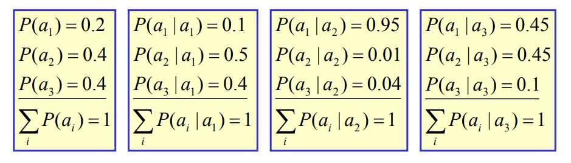
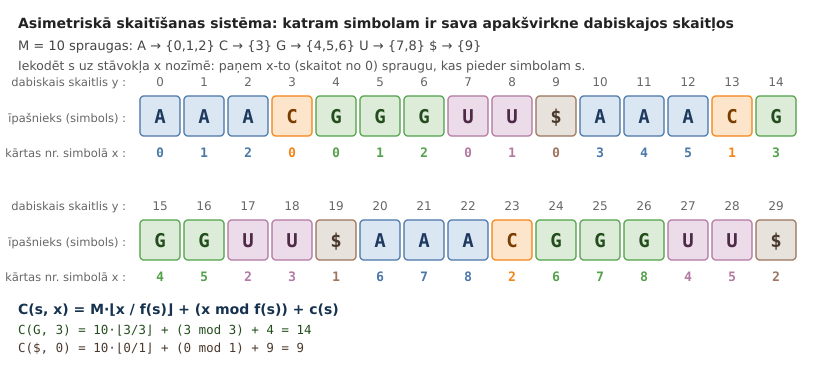
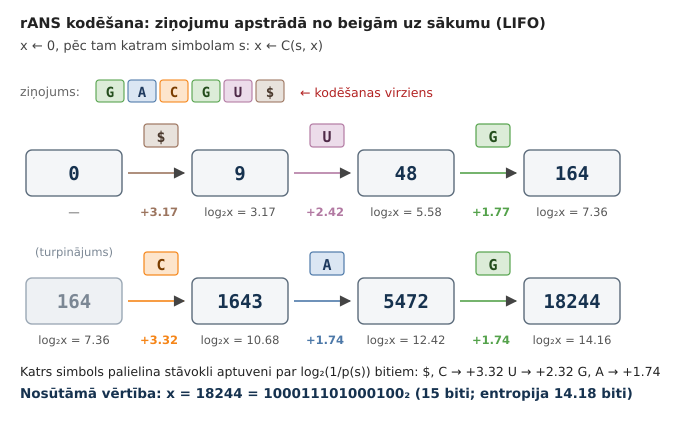
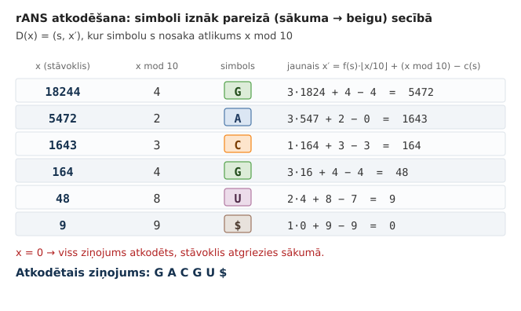
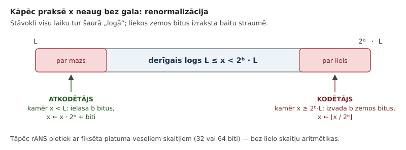
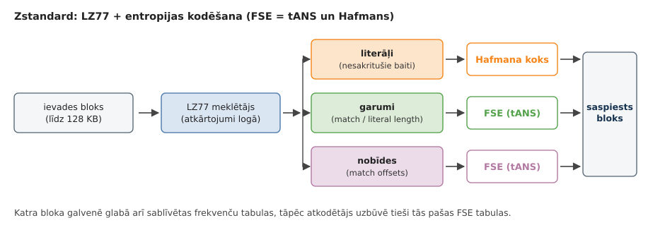

# 2. Bezzudumu saspiešana: Aritmētiskais kods

Hafmana kodi ir optimāli gadījumā, ja katru ziņojumu jākodē ar vienu un to pašu bitu virknīti un neviena kodējumu virknīte nav citas virknītes prefikss. Vidējais bitu skaits uz ziņojumu, ko izmanto Hafmana kodējums (tāpat kā citi optimāli kodējumi) nepārsniedz $H(S)+1$.

Dažos gadījumos tas ir neefektīvi: Ja ir ziņojumu kopa $S=\lbrace \mathtt{0}, \mathtt{1} \rbrace$ ar varbūtībām attiecīgi $1023/1024$ un $1/1024$, tad Hafmana kods joprojām tērētu vienu bitu katram ziņojumam kaut arī entropija ir

```python
>>> import math
>>> pp = [1023/1024, 1/1024]
>>> H = sum([-p*math.log2(p) for p in pp])
>>> H
0.011173818721219527
```

Lai iekodētu 1000 šādi sadalītus ziņojumus, vajadzīgi vidēji $11.17$ biti, nevis $1000$ biti.

Ir divas populāras pieejas, kas šo atrisina:

* [Aritmētiskie kodi](https://web.mat.upc.edu/sebastia.xambo/CDI15/CDI15-04-ArithmeticCoding.pdf)
* [Asimetriskas skaitīšanas sistēmas](https://en.wikipedia.org/wiki/Asymmetric_numeral_systems) - kopš publicēšanas 2014.gadā izmantots Zstandard (`Zstd` implementācija)

```bash
sudo apt-get install zstd
# brew install zstd    ## (Mac OS X users)
echo "A quick brown fox jumped over a lazy dog" > input.txt
zstd input.txt -o output.zst
zstd -d output.zst -o input2.txt
diff input.txt input2.txt
```

**Aritmētiskie kodi:** Ir labāki adaptīviem varbūtiskiem modeļiem, kur ziņojumu varbūtības var mainīties atkarībā no līdz šim saņemtās ievades. Aritmētiskās darbības sākotnējā algoritmā ir paredzēts veikt ar reāliem skaitļiem; tāpēc šī algoritma (veselās aritmētikas) implementācija nav ļoti vienkārša. Tas arī var zaudēt ātrdarbību, jo regulāri nodarbojas ar reizināšanu un dalīšanu.

**Asimetriskās skaitīšanas sistēmas:** Parasti nav adaptīvas (visas varbūtības ir izrēķināmas jau iepriekš). Saspiešana un atspiešana ir ļoti ātra, maksimāli izmanto bitu operācijas.

## Aritmētiskās saspiešanas pamatideja

### Piemērs: Metamais kauliņš


*Metamā kauliņa piemērs.*

Alise grib nosūtīt Bobam $1000$ (godīga) metamā kauliņa rezultātus. Prefiksu kodējumam reizēm vajag $2$, reizēm $3$ bitus. Piemēram, var izmantot šādu kodējumu:

$$
C = \{ (1,\texttt{00}), (2,\texttt{010}), (3,\texttt{011}),
(4,\texttt{100}), (5,\texttt{101}), (6,\texttt{11}) \}.
$$

$$
\ell_a(C) = \frac{2 + 3 + 3 + 3 + 3 + 2}{6} = 2.666\ldots
$$

> *Piezīme:* Lai nosūtītu $1000$ metamā kauliņa rezultātus ar Hafmana kodu, Alise izlietos vidēji $2666.67$ bitus. Nedaudz mazāk, ja starp rezultātiem ir vairāk "1" un "6", bet nedaudz vairāk, ja vairāk nekā vidēji tiek uzmesti "2", "3", "4", "5".

**Cerība uz samazinājumu no 2667 uz 2585**

Entropija (vidējais informācijas saturs) vienā kauliņa metienā ir ap $\log_2 6 \approx 2.585$.

$$
H = \sum\limits_{s \in S} p(s) \cdot \left( - \log_2 p(s) \right) =
6 \cdot \left( \frac{1}{6} \cdot \left( - \log_2\,\frac{1}{6} \right) \right) \approx 2.584963.
$$

Prefiksu kodi to nevar atrisināt, jo katram ziņojumam sūta divus vai trīs bitus (nevar sūtīt daļveida bitus). Aritmētiskais kods rīkojas citādi: Katram metamā kauliņa rezultātam var izveidot sešas reizes īsāku intervālu (kā aprakstīts aritmētiskajā kodējumā). Un tikai pašās beigās iekodē iegūto ļoti īso intervālu ar bitu virknīti.

### Piemērs: Angļu burtu biežumi


Dabīgo valodu burtu sadalījums parasti nav labākais piemērs, jo tie mēdz parādīties prognozējamās virknītēs, atsevišķa simbolu kodēšana (gan ar Hafmana, gan aritmētisko kodējumu) parasti ir neoptimāla. [Burtu biežumi](http://pi.math.cornell.edu/~mec/2003-2004/cryptography/subs/frequencies.html)

**Aritmētiskā saspiešana**

**Kāpēc lietot aritmētisko kodēšanu?** Ja ziņojumu telpā ir jocīgas varbūtības, tad Hafmana kodi (kas dala kodu telpas "nekustamo īpašumu" gabalos pa $1/2$, $1/4$ utt.) iznieko daudz vietas un neizmanto to, ka dažu ziņojumu informācijas saturs ir daudz mazāks par $1$.

**Kā nosūtīt ziņojumu, kura informācijas saturs ir nepilns bits?** Piemēram, ziņojumam ar varbūtību $1023/1024$ informācijas saturs ir $\log_2 (1023/1024) \approx 0.0014$. Griežam kodu telpu cita veida gabalos, un bitos iekodējam tikai pašās beigās.

### Aritmētiskās saspiešanas algoritms

**Ievade:** Dots ziņojumu alfabēts un tā varbūtību sadalījums. Dota arī ziņojumu virkne šajā alfabētā.

**Izvade:** Intervāls $I \subseteq [0;1]$ (pietiek nosūtīt skaitli no šī intervāla).

* Ir $m$ ziņojumi $\lbrace 1,\ldots,m \rbrace$. To varbūtības ir $\lbrace p(1),\ldots , p(m)\rbrace$, kuru summa ir $1$.
* Definējam *kumulatīvās varbūtības*:

  $$
  f(j) = \sum\limits_{i=1}^{j-1} p(i),\;\;j=1,\ldots,m.
  $$

**Intervālu konstruēšana**

Dota ziņojumu virkne $x_1,x_2,\ldots,x_k \in \lbrace 1,\ldots,m \rbrace$. Veidojam intervālu virkni, kur katram intervālam zināms kreisais galapunkts $\ell_i$ un garums $s_i$.

$$
[0;1] \supset [l_1;l_1+s_1) \supset [l_2;l_2+s_2) \supset \ldots \supset [l_k; l_k+s_k).
$$

1.intervāls: $[l_1;l_1 + s_1) = \left[ f(x_1);p(x_1) \right)$. Intervāliem $2,\ldots,k$ apzīmējam:

$$
\left\{
\begin{array}{l}
l_i = l_{i-1} + f(x_i) \cdot s_{i-1}\\
s_i = s_{i-1} \cdot p(x_i)
\end{array} \right.
$$

**Piemērs**


*Intervālu virkne.*

* Alfabētā ir 3 burti *a,b,c*. Varbūtības ir attiecīgi 0.2, 0.5, 0.3 (entropija viena burta nosūtīšanai būs 1.485475)
* Piemērā parādīts, ka `babc` atbilst intervāls [.255, .27).
* Galīga bināra daļa šajā intervālā: `.0100001` jeb $[33/128,34/128) \subseteq [.255, .27)$.
* 4 ziņojumu virknītes nosūtīšanai iztērējām 7 bitus (vidēji 1.75 biti uz vienu ziņojumu).

**Jautājums:** Vai robežā nosūtīto bitu daudzums pret ziņojuma garumu tieksies uz entropiju 1.485475. Kāpēc?

**Intervālu nosūtīšana**

* Ja dots intervāls ar garumu $s$, tad tā iekšienē var atrast skaitli, kura binārajā pierakstā ir ne vairāk kā $-\left\lceil \log_2 s \right\rceil$ biti.
* Gribam sūtīt tikai vienu skaitli. Lai saprastu, cik garš ir tā intervāls, interpretējam, teiksim $0.010$ nevis vienkārši kā $1/4$, bet kā intervālu $[1/4, 3/8)$.
* Nepazaudējot vairāk kā 1-2 bitus, varam izveidot šādu intervālu $[k/2^n,(k+1)/2^n)$, kurš atradīsies stingri iekšpusē tam $I$, ko dod aritmētiskais kods.

**Aritmētiskā koda īpatnības**

* Aritmētiskā koda algoritmus jābūvē vai nu relatīvi nelielām ziņojumu kopām (kur mums pietiek ar floating aritmētiku), vai arī jāizveido tuvinājums, kur reālos skaitļus tuvina ar veseliem skaitļiem.

Sk arī 21.lpp. no teksta [G.Blelloch. Introduction to Data Compression](https://www.cs.cmu.edu/~guyb/realworld/compression.pdf) - ar veseliem skaitļiem tuvināts aritmētiskās kodēšanas algoritms.

**Iekodēšanas piemērs**

Sūtām stringu `GACGU$`, kur simboli `A`, `C`, `G`, `U` ir RNS-virknes nukleobāzes, bet `$` apzīmē stringa beigas. Simbolu apriorās varbūtības ir šādas:


| `A` | `C` | `G` | `U` | `$` |
| --- | --- | --- | --- | --- |
| 30% | 10% | 30% | 20% | 10% |

**Intervālu aprēķini**

* $S_0 = [0.000000; 1.000000]$ atbilst `""` (tukšais strings),
* $S_1 = [0.400000; 0.700000]$ atbilst `G`,
* $S_2 = [0.400000; 0.490000]$ atbilst `GA`,
* $S_3 = [0.427000; 0.436000]$ atbilst `GAC`,
* $S_4 = [0.430600; 0.433300]$ atbilst `GACG`,
* $S_5 = [0.432490; 0.433030]$ atbilst `GACGU`,
* $S_6 = [0.432976; 0.433030]$ atbilst `GACGU$`.

Bināri pierakstītais skaitlis

$$
\beta = 0.011011101101100_2 \approx 0.4329834_{10}
$$

pieder intervālam $S_6 = [0.432976; 0.433030]$.

Kāpēc $\beta$ binārais pieraksts beidzas ar divām nullēm? Tieši 15 cipari aiz komata un $\left[\beta;\,\beta + \frac{1}{2^{15}}\right] \subseteq S_6$.

> *Piezīme:* Katrai galīgai binārai daļai atbilst $[0;1]$ apakšintervāls.

## Aritmētiskais kods veselos skaitļos

Reālo skaitļu aritmētika, darbojoties ar 4 baitu vai 8 baitu peldošā punkta skaitļiem var saskarties ar reģistra pārpildīšanos (*overflow* vai *underflow*) -- vienā skaitlī var iekodēt tikai nedaudz informācijas. Ir arī noapaļošanas kļūdas; ir kaut kā jānodrošina, lai iekodējot un atkodējot noapaļošanas kļūdas vienmēr notiktu vienādi.

Parastais risinājums ir pāriet uz veselo skaitļu aritmētiku un noapaļot varbūtības līdz skaitļiem formā $i/2^k$.

Definējam, cik reižu parādās katrs ziņojums (aptuveni proporcionāli varbūtībām) un arī kumulatīvās summas:

$$
c(1), c(2), \ldots, c(m)
$$

$$
f(i) = c(1) + \ldots + c(i-1),\;\; \mbox{katram $i \in [1;m]$}
$$

Visu skaitu summa $T = c(1) + \ldots + c(m)$, un $R = 2^k$ ir reģistra izmērs (praksē $k = 16$ vai $32$).

**Trīs mērogošanas gadījumi**

Visa algoritma sarežģītība slēpjas vienā vietā: intervāls $[l;u]$ nedrīkst kļūt tik šaurs, ka veselo skaitļu aritmētikā tas "saplok". Tāpēc pēc katra simbola intervālu mērogo divkārši, kamēr tas vairs neietilpst nevienā no trim gadījumiem:

* $u < R/2$ -- intervāls ir apakšējā pusē, tātad rezultāta nākamais bits noteikti ir $0$;
* $l \geq R/2$ -- intervāls ir augšējā pusē, nākamais bits noteikti ir $1$;
* $R/4 \leq l$ un $u < 3R/4$ -- intervāls ir pa vidu; **vēl nezinām**, kāds bits būs nākamais, bet zinām, ka pēc tā sekos pretējais bits. Tādus "atliktos" bitus saskaitām mainīgajā $m$ un izvadām vēlāk.

$\textsf{Emit}(b, m)$ $\quad$ *// izvada bitu $b$ un tam sekojošus $m$ pretējos bitus*
1. $\textsf{WriteBit}(b)$
2. **for** $j = 1$ **to** $m$: $\textsf{WriteBit}(1 - b)$

$\textsf{Arithmetic-Encode}(x_1 x_2 \ldots x_n, f, T, k)$
1. $l = 0$; $\;\;u = R - 1$; $\;\;m = 0$
2. **for** $i = 1$ **to** $n$
3. $\quad s = u - l + 1$
4. $\quad u = l + \left\lfloor s \cdot f(x_i + 1)/T \right\rfloor - 1$
5. $\quad l = l + \left\lfloor s \cdot f(x_i)/T \right\rfloor$
6. $\quad$ **while** $\textsf{True}$
7. $\quad\quad$ **if** $u < R/2$ **then** $\textsf{Emit}(0, m)$; $\;m = 0$
8. $\quad\quad$ **elseif** $l \geq R/2$ **then** $\textsf{Emit}(1, m)$; $\;m = 0$; $\;l = l - R/2$; $\;u = u - R/2$
9. $\quad\quad$ **elseif** $l \geq R/4$ **and** $u < 3R/4$ **then** $m = m + 1$; $\;l = l - R/4$; $\;u = u - R/4$
10. $\quad\quad$ **else** **break**
11. $\quad\quad l = 2l$; $\;\;u = 2u + 1$
12. **if** $l \geq R/4$ **then** $\textsf{Emit}(1, m+1)$ **else** $\textsf{Emit}(0, m+1)$ $\quad$ *// noslēgums*

Visos trijos gadījumos vispirms atņem attiecīgo nobīdi ($0$, $R/2$ vai $R/4$), un tikai pēc tam 11.rindiņā notiek pati divkāršošana -- tāpēc trīs gadījumi izskatās gandrīz vienādi.

### Atspiešanas algoritms

Atkodētājs atkārto tieši to pašu intervālu dalīšanu un mērogošanu, tikai papildus glabā *nolasīto* $k$ bitu logu $t$. Zinot $t$ novietojumu intervālā $[l;u]$, var pateikt, kurā apakšintervālā tas iekrīt, tātad kurš simbols bija nosūtīts.

$\textsf{Arithmetic-Decode}(f, T, k, n)$
1. $l = 0$; $\;\;u = R - 1$
2. $t = \textsf{ReadBits}(k)$ $\quad$ *// pirmie $k$ biti kā vesels skaitlis*
3. **for** $i = 1$ **to** $n$
4. $\quad s = u - l + 1$
5. $\quad v = \left\lfloor \left( (t - l + 1) \cdot T - 1 \right)/s \right\rfloor$ $\quad$ *// $t$ novietojums skalā $[0;T)$*
6. $\quad j = \textsf{Find-Symbol}(v)$ $\quad$ *// vienīgais $j$, kuram $f(j) \leq v < f(j+1)$*
7. $\quad \textsf{Output}(j)$
8. $\quad u = l + \left\lfloor s \cdot f(j+1)/T \right\rfloor - 1$
9. $\quad l = l + \left\lfloor s \cdot f(j)/T \right\rfloor$
10. $\quad$ **while** $\textsf{True}$
11. $\quad\quad$ **if** $u < R/2$ **then** *(nekas nav jāatņem)*
12. $\quad\quad$ **elseif** $l \geq R/2$ **then** $l = l - R/2$; $\;u = u - R/2$; $\;t = t - R/2$
13. $\quad\quad$ **elseif** $l \geq R/4$ **and** $u < 3R/4$ **then** $l = l - R/4$; $\;u = u - R/4$; $\;t = t - R/4$
14. $\quad\quad$ **else** **break**
15. $\quad\quad l = 2l$; $\;\;u = 2u + 1$; $\;\;t = 2t + \textsf{ReadBit}()$

Rindiņas 10-15 ir *burtiski* tās pašas, kas kodētāja 6-11, tikai bitu izvadīšanas vietā tiek pārbīdīts $t$. Tāpēc abus algoritmus var pierakstīt ar vienu kopīgu palīgprocedūru, un tieši šī simetrija garantē, ka noapaļošanas kļūdas kodētājā un atkodētājā notiek vienādi.

> *Piezīme:* Ar $k = 16$, skaitiem $c = (3,1,3,2,1)$ un $T = 10$ šis algoritms ziņojumam `GACGU$` izvada tieši bitus $011011101101100$, t.i., to pašu skaitli $\beta = 0.011011101101100_2$, ko iepriekš atradām ar reālo skaitļu aritmētiku.

### Beigu marķieris

Aritmētiskā koda atspiešana veic pārveidojumus ar nosūtīto skaitli jeb intervālu un atkodē arvien jaunus ziņojumus. Var noteikt brīdi, kad atspiežamais intervāls jau izgājis ārpus $[0;1]$ un tad atspiešana ir jābeidz.

Ir cits populārs risinājums: `PSEUDO_EOF` - kods var beigties baita vidū. Parasti pievieno īpašu simbolu (teksta beigu marķieri), lai saprastu, kad atkodēšana jāpārtrauc.

Beigu marķieris nodrošina arī to, ka viena saspiesta ziņojumu virkne nevar būt citas ziņojumu virknes prefikss (jo beigu marķieris nedrīst atrasties kodējuma vidū). Sk. arī detalizētu [Hafmana aprakstu](https://web.stanford.edu/class/archive/cs/cs106b/cs106b.1172/assn/huffman.html), kurā aprakstīta līdzīga problēma.

## Citi entropijas kodi

**Nosacītās varbūtības modelis**

Aritmētisko kodu var uzlabot, ja ņem vērā simbolu parādīšanās varbūtību atkarību no konteksta (1.kārtas modelis - tikai viens iepriekšējais simbols). Tad nākamo intervālu dala gabalos atkarībā no iepriekšējā simbola.



*Nosacītās varbūtības modelis.*

> *Piezīme:* [Bildes par aritmētisko kodēšanu](http://www.ws.binghamton.edu/fowler/fowler%20personal%20page/EE523_files/Ch_04%20Arithmetic%20Coding%20(PPT).pdf)

**Asimetriskās skaitīšanas sistēmas**

*Asymmetric numeral systems (ASN)* -- Jaroslaw Duda (2014) pētījumi. Kalpo līdzīgam mērķim kā aritmētiskie kodi (saspiež ievades datu plūsmu līdz entropijas noteiktajai robežai). Ar ko atšķiras no aritmētiskajiem kodiem: Lietojumi dažos jaunos standartos.

1. Facebook Zstandard.
2. Apple LZFSE.
3. Google Draco 3D compressor.

Jaunie algoritmi var labāk saspiest vai pārraidīt vairāk datu pa to pašu sakaru kanālu; tiem reizēm vajadzīgas lielākas skaitļošanas jaudas (vai tie labākai efektivitātei jāprogrammē paralēli), tāpēc tos visas platformas neatbalsta.

Būtiski, uz kādas ierīces un kādā situācijā notiek saspiešana/atspiešana. (Kešošana, retāka un mazāka tīkla izmantošana. CPU var izmantot drošāk.)

**Entropijas kodēšana kā paralēli algoritmi?**

Visos šajos algoritmos nākamais iekodējamais/atkodējamais simbols atkarīgs no iepriekšējiem simboliem (un algoritma iekšējā stāvokļa). Parasti paralelizēt nevar.

* Ar Hafmana kodiem var mēģināt paralelizēt dažādu datu bloku iekodēšanu un atkodēšanu vairākos pavedienos.
* GPU izmantot nevar, jo aprēķini katrā pavedienā izskatās citādi.

Varbūt iespējamas saspiešanas/atspiešanas instrukcijas uz garākiem vektoriem, ja ievades dati iegūti kādā īpašā veidā. Bet pagaidām rezultātu par to nav.

## Asimetriskās skaitīšanas sistēmas (ANS)

**Pamatideja: viens vesels skaitlis visa stāvokļa vietā**

Aritmētiskais kods glabā *intervālu* $[l;\,l+s)$ -- divus skaitļus, kurus turklāt visu laiku jāreizina un jādala. Asimetriskā skaitīšanas sistēma (*asymmetric numeral systems*, ANS; Jaroslavs Duda, 2009-2014) glabā tikai **vienu naturālu skaitli** $x$, ko sauc par *stāvokli*. Šajā skaitlī ir iekodēta visa līdz šim apstrādātā informācija, un tajā ir aptuveni $\log_2 x$ bitu.

Ideja ir parastās pozicionālās skaitīšanas sistēmas vispārinājums. 
Ja alfabētā ir $b$ simboli ar vienādām varbūtībām, tad 
"pierakstīt vēl vienu ciparu $s$ skaitļa $x$ galā" nozīmē

$$
x \;\longmapsto\; b \cdot x + s, \qquad\text{bet cipara izņemšana ir}\qquad
s = x \bmod b, \;\; x \longmapsto \left\lfloor x/b \right\rfloor .
$$

Katrs cipars palielina $x$ tieši $b$ reizes, tātad pievieno $\log_2 b$ bitu. Tā ir *simetriska* sistēma: visiem cipariem ir viena un tā pati cena.

ANS dara to pašu, tikai **asimetriski**: simbolam ar varbūtību $p(s)$ jāpalielina stāvoklis aptuveni $1/p(s)$ reizes, t.i., jāpievieno $\log_2 \frac{1}{p(s)}$ bitu -- tieši tik, cik prasa Šenona entropija. Tāpēc dabiskie skaitļi $0, 1, 2, \ldots$ tiek sadalīti starp simboliem *nevienmērīgi*: simbolam $s$ atvēl aptuveni $p(s)$ daļu no visiem dabiskajiem skaitļiem, izkaisot tos pēc iespējas vienmērīgi.

**Frekvenču kvantēšana**

Tāpat kā aritmētiskajam kodam veselos skaitļos, arī šeit varbūtības aizstāj ar veseliem *skaitiem* $f(s)$, kuru summa ir $M$ (parasti izvēlas $M = 2^k$). 
Definējam kumulatīvās summas $c(s)$ tāpat kā iepriekš:

$$
M = \sum\limits_{s} f(s), \qquad c(s) = \sum\limits_{t < s} f(t), \qquad p(s) \approx \frac{f(s)}{M}.
$$

Mūsu piemēra alfabētam $\lbrace \mathtt{A}, \mathtt{C}, \mathtt{G}, \mathtt{U} \rbrace$ un beigu marķierim `$` ar varbūtībām $0.3,\,0.1,\,0.3,\,0.2,\,0.1$ pietiek ar $M = 10$, un kvantēšana ir *precīza* (varbūtības jau tāpat ir veseli desmitdaļu skaitļi):

| simbols | `A` | `C` | `G` | `U` | `$` |
| --- | --- | --- | --- | --- | --- |
| $p(s)$ | 0.3 | 0.1 | 0.3 | 0.2 | 0.1 |
| $f(s)$ | 3 | 1 | 3 | 2 | 1 |
| $c(s)$ | 0 | 3 | 4 | 7 | 9 |
| spraugas $r = x \bmod 10$ | 0,1,2 | 3 | 4,5,6 | 7,8 | 9 |

**Dabisko skaitļu sadalīšana starp simboliem**

Sadalām visus dabiskos skaitļus $M$ elementu blokos. Katrā blokā simbolam $s$ pieder $f(s)$ *spraugas* -- tās, kurām atlikums $r = x \bmod M$ apmierina $c(s) \le r < c(s) + f(s)$. Tagad katram simbolam ir *sava* skaitīšanas sistēma: sanumurējam ar $0, 1, 2, \ldots$ tikai tās spraugas, kas pieder simbolam $s$.



*Katram simbolam ir sava apakšvirkne dabiskajos skaitļos. Piemēram, simbolam* `G` *pieder skaitļi* $4,5,6,14,15,16,24,\ldots$*, un to kārtas numuri ir* $0,1,2,3,4,5,6,\ldots$

Iegūstam **rANS** (*range ANS*) kodēšanas un atkodēšanas funkcijas:

$$
C(s,x) = M \cdot \left\lfloor \frac{x}{f(s)} \right\rfloor + \left( x \bmod f(s) \right) + c(s)
\qquad \text{(“}x\text{-tā sprauga, kas pieder }s\text{”)}
$$

$$
D(x) = (s, x'), \quad \text{kur } r = x \bmod M, \;\; s = s(r), \;\;
x' = f(s) \cdot \left\lfloor \frac{x}{M} \right\rfloor + r - c(s).
$$

> *Piezīme:* Attēlojums $(s,x) \mapsto C(s,x)$ ir **bijekcija** no $\Sigma \times \mathbb{N}$ uz $\mathbb{N}$: katrs dabiskais skaitlis $y$ pieder tieši vienam simbolam un tam ir tieši viens kārtas numurs šī simbola apakšvirknē. Tāpēc $D$ ir precīza $C$ apgrieztā funkcija un saspiešana ir bezzudumu.

Tā kā $C(s,x) \approx \frac{M}{f(s)} \cdot x \approx \frac{x}{p(s)}$, katrs simbols pieaudzē stāvokli aptuveni par $\log_2 \frac{1}{p(s)}$ bitiem. Tas arī ir viss "informācijas teorijas saturs" šajā algoritmā.

### ANS pamatalgoritms

Svarīgākā atšķirība no aritmētiskā koda: ANS ir **LIFO** (*last in, first out*, kā steks). Simbols, ko iekodē pēdējo, tiek atkodēts pirmais. Tāpēc kodētājs iet pa ziņojumu **no beigām uz sākumu**, un tad atkodētājs izvada simbolus pareizā secībā.

$\textsf{Rans-Encode}(x_1 x_2 \ldots x_n, f, c, M)$
1. $x = 0$ $\quad$ *// sākuma stāvoklis*
2. **for** $i = n$ **downto** $1$ $\quad$ *// ziņojumu apstrādā atpakaļgaitā*
3. $\quad s = x_i$
4. $\quad x = M \cdot \left\lfloor x / f(s) \right\rfloor + \left( x \bmod f(s) \right) + c(s)$
5. **end for**
6. **return** $x$

$\textsf{Rans-Decode}(x, f, c, M)$
1. **repeat**
2. $\quad r = x \bmod M$
3. $\quad s = \textsf{Lookup}(r)$ $\quad$ *// vienīgais $s$, kuram $c(s) \leq r < c(s) + f(s)$*
4. $\quad \textsf{Output}(s)$
5. $\quad x = f(s) \cdot \left\lfloor x / M \right\rfloor + r - c(s)$
6. **until** $s = \textsf{Eof}$ $\quad$ *// beigu marķieris; šajā brīdī atkal $x = 0$*

Rindiņā 3 meklēšanu praksē neveic ar ciklu, bet ar $M$ elementu tabulu $\textsf{Lookup}[0 \ldots M-1]$, kas katrai spraugai uzreiz pasaka tās īpašnieku. Tieši šī tabula (nevis reizināšana un dalīšana) padara ANS ātru.

**Beigu marķieris.** Kā redzams, ANS ir *dabisks* apstāšanās nosacījums: kad viss ziņojums atkodēts, stāvoklis atgriežas sākuma vērtībā. Tāpēc beigu marķieris `$` (`PSEUDO_EOF`) šeit nav obligāts -- pietiek, ja atkodētājs zina simbolu skaitu $n$. Mēs to tomēr paturēsim, lai piemērs būtu tieši salīdzināms ar aritmētiskā koda piemēru; ievērojiet, ka LIFO dēļ `$` tiek iekodēts **pirmais**.

### Piemērs: ziņojums `GACGU$`

Kodējam to pašu ziņojumu, ko iepriekš kodējām ar aritmētisko kodu, un ar tām pašām varbūtībām. Simbolus apstrādā secībā `$`, `U`, `G`, `C`, `A`, `G`:

| solis | simbols $s$ | $f(s)$ | $c(s)$ | $x$ pirms | aprēķins $C(s,x)$ | $x$ pēc |
| --- | --- | --- | --- | --- | --- | --- |
| 1 | `$` | 1 | 9 | 0 | $10 \cdot \lfloor 0/1 \rfloor + 0 + 9$ | **9** |
| 2 | `U` | 2 | 7 | 9 | $10 \cdot \lfloor 9/2 \rfloor + 1 + 7 = 40 + 8$ | **48** |
| 3 | `G` | 3 | 4 | 48 | $10 \cdot \lfloor 48/3 \rfloor + 0 + 4 = 160 + 4$ | **164** |
| 4 | `C` | 1 | 3 | 164 | $10 \cdot \lfloor 164/1 \rfloor + 0 + 3$ | **1643** |
| 5 | `A` | 3 | 0 | 1643 | $10 \cdot \lfloor 1643/3 \rfloor + 2 + 0 = 5470 + 2$ | **5472** |
| 6 | `G` | 3 | 4 | 5472 | $10 \cdot \lfloor 5472/3 \rfloor + 0 + 4 = 18240 + 4$ | **18244** |



*Stāvokļa augšana. Katrs simbols pievieno aptuveni* $\log_2 (1/p(s))$ *bitu.*

Rezultāts ir **viens skaitlis** $x = 18244$, kura binārais pieraksts ir

$$
18244 = 100011101000100_2 \qquad (15 \text{ biti}).
$$

Salīdzināsim ar teorētisko robežu:

$$
-\log_2 \left( 0.3 \cdot 0.3 \cdot 0.1 \cdot 0.3 \cdot 0.2 \cdot 0.1 \right)
= -\log_2 (0.000054) \approx 14.177 \text{ biti},
$$

$$
\log_2 18244 \approx 14.155 \text{ biti}.
$$

Tātad stāvoklis $x$ pieaudzis gandrīz tieši tik reižu, cik ir ziņojuma varbūtības apgrieztā vērtība: $1/0.000054 \approx 18519$. Kā jau aritmētiskajam kodam, pāris bitu pazūd tikai pašās beigās, kad $x$ jāieraksta veselā bitu skaitā (šeit 15 biti pret 14.18 bitiem entropijas).

**Atkodēšana**

Atkodētājs sāk ar $x = 18244$ un katrā solī skatās atlikumu $x \bmod 10$:



Simboli iznāk secībā `G`, `A`, `C`, `G`, `U`, `$` -- t.i., **pareizajā** secībā, un pēc `$` stāvoklis atgriežas nullē. Tas ir tas pats ziņojums, ar kuru sākām.

### Straumējošā versija: renormalizācija

Iepriekšējais algoritms nav lietojams tieši: pēc dažiem tūkstošiem simbolu $x$ kļūtu par vairāku tūkstošu bitu garu skaitli, un mums vajadzētu lielo skaitļu aritmētiku. Praksē stāvokli tur šaurā **logā**

$$
L \leq x < 2^b \cdot L
$$

(tipiski $L = 2^{23}$, $b = 8$, t.i., strādā ar 32 bitu veseliem skaitļiem un izvada veselus baitus). Pirms katras kodēšanas darbības kodētājs izmet no $x$ pa $b$ zemajiem bitiem, kamēr $C(s,x)$ noteikti ietilps logā; atkodētājs simetriski ielasa bitus atpakaļ.



$\textsf{Rans-Encode-Stream}(x_1 x_2 \ldots x_n, f, c, M, L, b)$
1. $x = L$
2. **for** $i = n$ **downto** $1$
3. $\quad s = x_i$
4. $\quad$ **while** $x \geq \left( L / M \right) \cdot 2^{b} \cdot f(s)$ $\quad$ *// renormalizācija*
5. $\quad\quad \textsf{WriteBits}(x \bmod 2^b,\; b)$
6. $\quad\quad x = \left\lfloor x / 2^b \right\rfloor$
7. $\quad$ **end while**
8. $\quad x = M \cdot \left\lfloor x / f(s) \right\rfloor + \left( x \bmod f(s) \right) + c(s)$
9. **end for**
10. $\textsf{WriteState}(x)$ $\quad$ *// gala stāvoklis (piem., 4 baiti)*

$\textsf{Rans-Decode-Stream}(f, c, M, L, b, n)$
1. $x = \textsf{ReadState}()$
2. **for** $i = 1$ **to** $n$
3. $\quad r = x \bmod M$
4. $\quad s = \textsf{Lookup}(r)$
5. $\quad \textsf{Output}(s)$
6. $\quad x = f(s) \cdot \left\lfloor x / M \right\rfloor + r - c(s)$
7. $\quad$ **while** $x < L$ $\quad$ *// renormalizācija*
8. $\quad\quad x = x \cdot 2^b + \textsf{ReadBits}(b)$
9. $\quad$ **end while**
10. **end for**

Nosacījums rindiņā 4 ir tieši tāds, lai pēc $C(s,x)$ izpildes stāvoklis atkal būtu logā $[L;\,2^b L)$; tam vajag, lai $L$ dalītos ar $M$. Tā kā kodētājs iet atpakaļgaitā, tā izvadītos bitus atkodētājs lasa pretējā virzienā -- praksē kodētājs raksta baitus buferī no beigām uz sākumu, un tad atkodētājs lasa tos parastā secībā.

### tANS jeb galīgu stāvokļu variants

Ja frekvenču summu izvēlas vienādu ar loga izmēru, $M = L$, tad derīgo stāvokļu ir tikai $L$ gabali. Tādā gadījumā *visas* funkciju $C$ un $D$ vērtības var **iepriekš izrēķināt tabulā**. Iegūst **tANS** (*table ANS*), kuru Kolē implementācijā sauc par **FSE** (*Finite State Entropy*).

Atkodēšana tad izskatās šādi -- bez reizināšanas, dalīšanas un pat bez salīdzināšanas:

$\textsf{Tans-Decode-Symbol}(x)$
1. $(s,\; \mathit{nbBits},\; \mathit{newBase}) = \textsf{DecodeTable}[x]$
2. $\textsf{Output}(s)$
3. $x = \mathit{newBase} + \textsf{ReadBits}(\mathit{nbBits})$
4. **return** $x$

Tas ir vienkārši **galīgs automāts**: stāvoklis $x \in \lbrace 0,\ldots,L-1 \rbrace$, viena tabulas nolasīšana un dažu bitu ielasīšana uz simbolu. Tabulas būvēšanā vienīgais netriviālais solis ir *izkaisīšana* (*symbol spread*) -- katra simbola $f(s)$ stāvokļus jāizvieto starp $L$ stāvokļiem pēc iespējas vienmērīgi. Zstandard šim nolūkam lieto ātru, deterministisku "lēcienu" formulu, nevis optimālu izkārtojumu; zaudējums saspiešanas pakāpē ir niecīgs.

### ANS salīdzinājumā ar aritmētisko kodu

| | Aritmētiskais kods | ANS (rANS / tANS) |
| --- | --- | --- |
| Stāvoklis | intervāls $[l;\,l+s)$ (divi skaitļi) | viens skaitlis $x$ |
| Kodēšanas secība | FIFO (no sākuma uz beigām) | LIFO (no beigām uz sākumu) |
| Darbības uz simbolu | reizināšana + dalīšana | tabulas nolasīšana (tANS) vai 1 reizināšana (rANS) |
| Adaptīvi modeļi | ērti (CABAC u.c.) | grūti: tabulas jāpārbūvē |
| Bitu zudumi | $\approx 2$ biti uz visu plūsmu | $\approx 2$ biti uz visu plūsmu + kvantēšanas kļūda |
| Ātrums | vidējs | ļoti liels (Zstd atspiež ~1--2 GB/s) |
| Patenti | vēsturiski daudz | Duda apzināti publicēja ANS bez patentiem |

Galvenais praktiskais ierobežojums: ANS parasti **nav adaptīvs**. Ja simbolu varbūtības mainās, jāpārbūvē tabulas, tāpēc reālas implementācijas sadala datus blokos un katram blokam glabā savu (sablīvētu) frekvenču tabulu.

## Zstandard: ANS rūpnieciskā implementācija

**Vēsture**

Jaroslavs Duda (Jaroslaw Duda, Jagelonu universitāte Krakovā) ANS ideju publicēja jau 2009. gadā un nobeigtā veidā 2013.-2014. gadā, apzināti nepatentējot to un publiskojot atsauces implementācijas -- tieši tāpēc, ka aritmētiskā koda izplatību 1980.-1990. gados bija bremzējuši patenti.

Šo darbu praktiskā versijā pārvērta Jans Kolē (Yann Collet), kurš jau bija pazīstams ar ļoti ātro `LZ4`. 2013. gadā viņš publicēja `FSE` bibliotēku (tANS implementāciju), un uz tās bāzes uzbūvēja **Zstandard** (`zstd`) -- LZ77 tipa saspiešanas algoritmu, kurā entropijas kodētājs ir FSE. Kolē 2015. gadā sāka strādāt Facebook (tagad Meta); `zstd` versija 1.0 iznāca 2016. gada augustā ar BSD licenci (kopš 2017. gada -- duāla BSD / GPLv2 licence). Formāts ir standartizēts kā [RFC 8478](https://www.rfc-editor.org/rfc/rfc8478) (2018), kuru vēlāk aizstāja [RFC 8878](https://www.rfc-editor.org/rfc/rfc8878) (2021).

**Pašreizējie lietojumi**

Astoņu gadu laikā `zstd` kļuvis par jauno noklusēto izvēli tur, kur agrāk lietoja `gzip`:

* **Linux kodols:** `btrfs`, `squashfs`, `f2fs` failu sistēmas, `initramfs`, kā arī paša kodola attēla saspiešana.
* **Pakotņu sistēmas:** Arch Linux (`.pkg.tar.zst` kopš 2019. gada beigām), Fedora RPM, Ubuntu `.deb` pakotnes, Conda.
* **Datu bāzes un lielie dati:** PostgreSQL (WAL un TOAST saspiešana), MongoDB, RocksDB, ZFS, Apache Kafka, Hadoop, Parquet un ORC failu formāti.
* **Tīkls:** `Content-Encoding: zstd` HTTP protokolā (Chrome kopš 2024. gada, Firefox drīz pēc tam), Nginx, `curl`.
* **Citi ANS lietojumi:** Apple `LZFSE`, Google `Draco` (3D ģeometrija), JPEG XL, kā arī vairākas mašīnmācīšanās modeļu glabāšanas bibliotēkas.

### Kas Zstandard iekšpusē notiek ar ANS

`zstd` nav "tīrs" entropijas kodētājs -- tas vispirms izpilda LZ77 tipa atkārtojumu meklēšanu (kā `gzip`), un tikai iegūtos simbolus kodē ar entropijas kodētāju:



**Tehniskie kompromisi salīdzinājumā ar "tīro" ANS ideju:**

1. **tANS, nevis rANS.** Zstandard lieto tabulu variantu (FSE), jo tas atkodēšanā neprasa ne reizināšanu, ne dalīšanu -- tikai vienu masīva nolasīšanu uz simbolu.
2. **Rupji kvantētas varbūtības.** Frekvenču summa vienmēr ir pakāpe $M = 2^k$, turklāt neliela: RFC 8878 atļauj tikai $k \le 9$ garumiem un $k \le 8$ nobīdēm, t.i., 256-512 stāvokļu. Mazāka tabula = mazāka kešatmiņas slodze un mazāka galvene, bet nedaudz sliktāka saspiešanas pakāpe.
3. **Vienkārša izkaisīšana.** Simbolu izvietojumu tabulā aprēķina ar ātru "lēcienu" formulu, nevis meklē optimālo -- ātrums ir svarīgāks par pēdējiem procentiem.
4. **Hafmana kodi literāļiem.** Paradoksāli, bet vislielāko datu daļu -- literāļus (baitus, kas neietilpa nevienā atkārtojumā) -- `zstd` kodē ar Hafmana koku, nevis ar FSE. Iemesls: literāļu ir daudz, to sadalījums parasti nav ekstrēmi šķībs, un Hafmana atkodēšanu var vieglāk paralelizēt (`zstd` lieto 4 neatkarīgas Hafmana straumes vienā blokā). FSE paliek "secību" simboliem (garumi, nobīdes), kur sadalījumi ir šķībi un ieguvums no ANS ir reāls.
5. **Vairāki stāvokļi vienā straumē.** Lai izmantotu mūsdienu procesoru instrukciju paralēlismu, `zstd` uztur vairākus FSE stāvokļus un pārmaiņus tos atjauno no vienas bitu straumes.
6. **Blokos, nevis adaptīvi.** Dati tiek sadalīti blokos (līdz 128 KB), un katra bloka galvenē glabā sablīvētas frekvenču tabulas. Ja bloks ir mazs, `zstd` var izmantot iepriekš definētas ("predefined") vai iepriekšējā bloka tabulas, lai neiztērētu vairāk vietas galvenei nekā pašiem datiem.
7. **Bitu straume atpakaļgaitā.** Tāpat kā pamatalgoritmā, kodētājs raksta bitus no beigām uz sākumu; `zstd` bloka bitu straume tāpēc tiek lasīta no pēdējā baita uz priekšu.
8. **Papildu iespējas ap algoritmu:** vārdnīcas maziem datiem (`--train`), garā režīma logs līdz 2 GB (`--long`), daudzpavedienu saspiešana (`-T0`), XXH64 kontrolsummas, straumēšanas ("frame") formāts.

### Uzstādīšana

**Linux / macOS**

```bash
sudo apt-get install zstd          # Debian, Ubuntu
sudo dnf install zstd              # Fedora, RHEL
sudo pacman -S zstd                # Arch
brew install zstd                  # macOS (Homebrew)

# no pirmkoda:
git clone https://github.com/facebook/zstd.git
cd zstd && make -j && sudo make install
```

**Windows**

```powershell
scoop install zstd                 # Scoop
choco install zstandard            # Chocolatey
winget search zstd                 # tad: winget install <ID>

# MSYS2 / MinGW vidē:
pacman -S mingw-w64-x86_64-zstd
```

Var arī vienkārši lejupielādēt gatavus `zstd-v1.5.x-win64.zip` binārfailus no [github.com/facebook/zstd/releases](https://github.com/facebook/zstd/releases) un ielikt `zstd.exe` kaut kur `PATH` mainīgajā.

**Lietošanas piemēri**

```bash
zstd input.txt -o output.zst       # saspiež (noklusētais līmenis 3)
zstd -d output.zst -o input2.txt   # atspiež
diff input.txt input2.txt

zstd -19 -T0 bigfile               # gandrīz maksimāla saspiešana, visi kodoli
zstd --ultra -22 --long=27 bigfile # vēl vairāk; vajag daudz RAM
zstd -b1 -e19 silesia.tar          # iebūvētais tests līmeņiem 1..19

tar --zstd -cf archive.tar.zst dir/    # tar ar zstd
tar --zstd -xf archive.tar.zst

zstd --train samples/*.json -o dict.zd # vārdnīca maziem failiem
zstd -D dict.zd small.json             # saspiež, izmantojot vārdnīcu
```

Saspiešanas līmeņi ir no $-7$ (ātrāks par `LZ4`, vāja saspiešana) līdz $19$, bet ar karodziņu `--ultra` -- līdz $22$. Atspiešanas ātrums no līmeņa gandrīz nav atkarīgs; tas ir šī formāta galvenais praktiskais ieguvums.

### Ar ko Zstandard atšķiras no citiem algoritmiem: secinājumi

Aptuveni rādītāji Silesia korpusam uz viena moderna x86 kodola (skaitļi ir orientējoši, sk. `zstd` repozitorija testus):

| Algoritms | Saspiešanas pakāpe | Saspiešana, MB/s | Atspiešana, MB/s |
| --- | --- | --- | --- |
| `lz4 -1` | ~2.1 | ~700 | ~4000 |
| `zstd -1` | ~2.9 | ~500 | ~1600 |
| `gzip (zlib) -6` | ~3.1 | ~30 | ~400 |
| `zstd -9` | ~3.4 | ~50 | ~1500 |
| `brotli -5` | ~3.6 | ~20 | ~300 |
| `zstd -19` | ~3.9 | ~3 | ~1400 |
| `xz (LZMA) -9` | ~4.5 | ~1.5 | ~60 |

**Secinājumi**

1. **Pareto uzlabojums pār `gzip`.** Pie līdzīgas saspiešanas pakāpes `zstd` saspiež kārtu ātrāk un atspiež 3-5 reizes ātrāk. Tieši tāpēc `zstd` tik strauji nomainīja `gzip` pakotņu sistēmās un failu sistēmās -- pāreja neprasa nekādu kompromisu.
2. **Asimetrisks ātrums.** Atspiešanas ātrums ir ~1-2 GB/s neatkarīgi no tā, cik ilgi datus saspieda. Tas ir ideāli scenārijam "saspiež vienreiz, atspiež miljons reižu" (programmatūras pakotnes, datu bāzu bloki, tīmekļa saturs). `xz` šeit zaudē: tas atspiež desmit un vairāk reižu lēnāk.
3. **Viens formāts ļoti plašam diapazonam.** No līmeņa $-7$ (gandrīz `LZ4` ātrums) līdz $22$ (gandrīz `xz` pakāpe) -- viens un tas pats faila formāts un viens atkodētājs. Citās ekosistēmās šim diapazonam vajag trīs dažādus rīkus.
4. **Kur `zstd` nav labākā izvēle:** ja svarīgs tikai ātrums un saspiešanas pakāpe nav būtiska, `LZ4` joprojām ir ātrāks; ja arhīvu saspiež vienreiz un vieta ir dārgāka par laiku, `xz`/LZMA dod par 10-15% mazāku failu; tīmekļa tekstam `brotli` ar savu iebūvēto vārdnīcu var būt izdevīgāks.
5. **ANS loma.** Pati par sevi ANS dod `zstd` varbūt 5-10% labāku saspiešanu nekā Hafmana kodi tajās pašās vietās, bet -- atšķirībā no aritmētiskā koda -- **bez ātruma zaudējuma**. Tieši šī kombinācija (aritmētiskā koda precizitāte + Hafmana koda ātrums) padarīja ANS par pēdējo divdesmit gadu nozīmīgāko praktisko jauninājumu bezzudumu saspiešanā.
6. **Licencēšana kā tehnisks faktors.** ANS tika publicēta bez patentiem, un `zstd` -- ar brīvu licenci. Salīdzinot ar aritmētiskā koda vēsturi (`bzip2` un JPEG lietoja mazāk optimālus Hafmana kodus tikai patentu dēļ), tas ir labs piemērs, ka standartu izplatību nosaka ne tikai algoritma kvalitāte.

## Uzdevumi

**2.1. uzdevums:** Aritmētisko kodu definē garai virknei, ko veido no diviem ziņojumiem $(A,B)$ ar varbūtībām $p(A) = 0.9$, $p(B) = 0.1$. Šajā aritmētiskajā kodā nosūta $1/3$ (binārajā pierakstā $0.010101\ldots_2$). Ja $1/3$ atkodē, ar cik ziņojumiem "A" sākas virkne, pirms tajā parādās pirmais "B".

**Atbilde:**

* Ja $x \geq 0.9$, tad $x$ atkodējums sākas ar `B`.
* Ja $x < 0.9$ un $x \geq (0.9)^2$, tad atkodējums sākas ar `AB`.
* Ja $x < (0.9)^2$ un $x \geq (0.9)^3$, tad atkodējums sākas ar `AAB`.
* Ja $x < (0.9)^3$ un $x \geq (0.9)^4$, tad atkodējums sākas ar `AAAB`.

Šeit $x = \frac{1}{3}$. Jāatrod mazākais $k-1$, kuram

$$
1/3 \geq (0.9)^k\;\;\text{jeb}\;\;-\ln 3 \geq k \cdot \ln 0.9
$$

Tā kā $\ln 0.9 < 0$, tad $k \geq \frac{-\ln 3}{\ln 0.9} \approx 10.43$. Mazākā veselā $k$ vērtība ir $11$, tātad $x = 1/3$ atkodējumā vispirms būs $k-1 = 10$ ziņojumi `A`, pēc tam sekos ziņojums `B`.

> *Piezīme:* ${\displaystyle \frac{1}{3}}$ binārais pieraksts: Summējot $0.010101\ldots$ nenulles ciparus, iegūstam:

$$
\frac{1}{4} + \frac{1}{16} + \frac{1}{64} + \ldots = \frac{1/4}{1 - 1/4}.
$$

*Bezgalīgas ģeometriskas progresijas summas formula:*

$$
b_1 + b_1q + b_1q^2 + b_2q^3 + \ldots = \frac{b_1}{1 - q}.
$$

$\square$

**2.2. uzdevums (ANS ar rokām):** Alfabētā ir divi simboli $\lbrace \mathtt{A}, \mathtt{B} \rbrace$ ar kvantētajām frekvencēm $f(\mathtt{A}) = 3$, $f(\mathtt{B}) = 1$; tātad $M = 4$, $c(\mathtt{A}) = 0$, $c(\mathtt{B}) = 3$.

* **(a)** Kuri dabiskie skaitļi pieder `A` un kuri -- `B`?
* **(b)** Uzrakstiet $C(\mathtt{A},x)$, $C(\mathtt{B},x)$ un $D(x)$ iespējami vienkāršā veidā.
* **(c)** Iekodējiet ziņojumu `ABAA`, sākot ar $x_0 = 4$, un pēc tam atkodējiet iegūto skaitli atpakaļ.
* **(d)** Cik bitu "maksāja" katrs no četriem simboliem? Salīdziniet ar $\log_2 \frac{1}{p(s)}$.

**Atbilde:**

**(a)** Simbolam `B` pieder tie skaitļi, kuriem $y \equiv 3 \pmod 4$, t.i., $3, 7, 11, 15, \ldots$; visi pārējie ($0,1,2,4,5,6,8,\ldots$) pieder `A`.

**(b)** Tā kā $f(\mathtt{A}) = 3$ un $c(\mathtt{A}) = 0$, bet $f(\mathtt{B}) = 1$ un $c(\mathtt{B}) = 3$:

$$
C(\mathtt{A},x) = 4\left\lfloor \frac{x}{3} \right\rfloor + (x \bmod 3),
\qquad C(\mathtt{B},x) = 4x + 3 .
$$

Atkodēšanai apskata $r = x \bmod 4$: ja $r \leq 2$, tad simbols ir `A` un $x' = 3\lfloor x/4 \rfloor + r$; ja $r = 3$, tad simbols ir `B` un $x' = \lfloor x/4 \rfloor$.

**(c)** ANS ir LIFO, tāpēc simbolus apstrādā secībā `A`, `A`, `B`, `A`:

$$
4 \;\xrightarrow{\;\mathtt{A}\;}\; 5 \;\xrightarrow{\;\mathtt{A}\;}\; 6
\;\xrightarrow{\;\mathtt{B}\;}\; 27 \;\xrightarrow{\;\mathtt{A}\;}\; 36 .
$$

(Piemēram, $C(\mathtt{B}, 6) = 4 \cdot 6 + 3 = 27$ un $C(\mathtt{A}, 27) = 4 \lfloor 27/3 \rfloor + 0 = 36$.) Atkodējot: $36 \bmod 4 = 0 \Rightarrow$ `A`, $x' = 3 \cdot 9 = 27$; tālāk $27 \bmod 4 = 3 \Rightarrow$ `B`, $x' = 6$; pēc tam $6 \bmod 4 = 2 \Rightarrow$ `A`, $x' = 5$; visbeidzot $5 \bmod 4 = 1 \Rightarrow$ `A`, $x' = 4$. Iznāk `ABAA`, un stāvoklis atgriezies sākuma vērtībā $4$.

**(d)** Attiecīgi $\log_2 \frac{5}{4} = 0.32$, $\log_2 \frac{6}{5} = 0.26$, $\log_2 \frac{27}{6} = 2.17$ un $\log_2 \frac{36}{27} = 0.415$ biti; kopā $\log_2 \frac{36}{4} = \log_2 9 = 3.17$ biti. Ideālās cenas ir $\log_2 \frac{4}{3} = 0.415$ bita simbolam `A` un $\log_2 4 = 2$ biti simbolam `B`, kopā $3.245$ biti. Redzams, ka pie maziem $x$ atsevišķa soļa cena var stipri atšķirties no ideālās, bet, stāvoklim augot, tā tuvojas ideālajai (pēdējais solis $27 \to 36$ jau ir precīzi $0.415$).

$\square$

**2.3. uzdevums (netaisnīga monēta):** Alise met monētu, kas uzkrīt ar `A` ("cipars") varbūtību $3/4$ un ar `B` ("ģerbonis") varbūtību $1/4$, un grib nosūtīt Bobam $100$ metienu rezultātus.

* **(a)** Cik bitu prasa entropija?
* **(b)** Cik bitu iztērētu Hafmana kods? Kāpēc tas šeit nepalīdz?
* **(c)** Alise lieto ANS ar tām pašām tabulām, kas 2.2. uzdevumā. Pieņemsim, ka uzkrita tieši $75$ reizes `A` un $25$ reizes `B`. Cik reižu pieaugs stāvoklis $x$, un cik bitu tas ir?
* **(d)** *(Taustāmais modelis.)* Nokrāsosim skaitļus $3, 7, 11, 15, \ldots$ sarkanus, bet visus pārējos dabiskos skaitļus -- zaļus. Katrā krāsā atsevišķi pārnumurēsim skaitļus, sākot no nulles: zaļie $0,1,2,4,5,6,8,\ldots$ saņem numurus $0,1,2,3,4,5,6,\ldots$, bet sarkanie $3,7,11,15,\ldots$ saņem numurus $0,1,2,3,\ldots$. Pierādiet, ka pāris (krāsa, jaunais numurs) viennozīmīgi nosaka sākotnējo skaitli un otrādi.

**Atbilde:**

**(a)** Viena metiena entropija ir

$$
H = -\frac{3}{4}\log_2 \frac{3}{4} - \frac{1}{4}\log_2 \frac{1}{4}
= \frac{3}{4} \cdot 0.415 + \frac{1}{4} \cdot 2 = 0.8113 \;\text{bita},
$$

tātad $100$ metieniem vajag vidēji $81.13$ bitus.

**(b)** Divu simbolu alfabētam jebkurš prefiksu kods katram metienam piešķir vismaz vienu bitu, tāpēc Hafmana kods iztērē tieši $100$ bitus -- par $19\%$ vairāk nekā entropija. Prefiksu kods principiāli nevar iztērēt $0.415$ bita: veseli biti nedalās.

**(c)** Katrs `A` palielina stāvokli aptuveni $4/3$ reizes, katrs `B` -- aptuveni $4$ reizes, tāpēc

$$
\frac{x_{\text{beigās}}}{x_0} \approx \left( \frac{4}{3} \right)^{75} \cdot 4^{25},
$$

$$
\log_2 \frac{x_{\text{beigās}}}{x_0} \approx 75 \log_2 \frac{4}{3} + 25 \log_2 4
= 31.13 + 50 = 81.13 \;\text{biti}.
$$

Tas ir *tieši* tas pats skaitlis, ko deva entropija (a) punktā -- ne nejauši: šeit kvantētās frekvences $3/4$ un $1/4$ sakrīt ar īstajām varbūtībām, tāpēc kvantēšanas zudumu nav vispār. Vienīgie zaudētie biti ir pēdējie 1-2, kad $x$ jāieraksta veselā bitu skaitā.

**(d)** Katram dabiskam skaitlim $y$ apskatām atlikumu $r = y \bmod 4$ un veselo daļu $q = \lfloor y/4 \rfloor$. Ja $r = 3$, tad $y$ ir sarkans un tā jaunais numurs ir $q$; ja $r \in \lbrace 0,1,2 \rbrace$, tad $y$ ir zaļš un tā jaunais numurs ir $3q + r$. Pretējā virzienā: sarkanajam numuram $x$ atbilst $y = 4x + 3$; zaļajam numuram $x$ atbilst $q = \lfloor x/3 \rfloor$, $r = x \bmod 3$ un $y = 4q + r$. Abas formulas viena otru atceļ (dalīšana ar atlikumu ir viennozīmīga), tātad tā ir bijekcija starp $\mathbb{N}$ un kopu $\lbrace \text{sarkans}, \text{zaļš} \rbrace \times \mathbb{N}$.

Šī bijekcija arī **ir** ANS: "zaļš" nozīmē `A`, "sarkans" nozīmē `B`, jaunais numurs ir iepriekšējais stāvoklis, bet pats skaitlis $y$ -- jaunais stāvoklis. Nekāda saspiešana šajā uzdevumā nav vajadzīga -- pietiek ar dalīšanu ar atlikumu.

$\square$

**Kopsavilkums**

1. Ar Hafmana algoritmu uzbūvēts prefiksu koks ir savā ziņā optimāls kodējums, bet tas katru ziņojumu iekodē ar veselu skaitu bitu. Var nevajadzīgi iztērēt līdz pat $1$ bitam uz katru nosūtāmo ziņojumu.
2. Aritmētiskais kods var nedaudz aizturēt bitu plūsmas izvadi (lai pareizi iekodētu iepriekšējo ziņojumu reizēm ir jāzina nākamais ziņojums), toties nezaudē bitus.
3. Aritmētiskās saspiešanas pamatalgoritms izmanto reālos skaitļus - to ir grūti implementēt korekti, tas arī ir lēnāks un var prasīt vairāk atmiņas. Tāpēc praksē izmantot veselo skaitļu variantu.
4. Kopš 1986.g. pazīstams arī aritmētiskā koda variants, kurā nevajag reizināt (pietiek ar bitu nobīdēm).
5. Aritmētiskā koda idejas var pielāgot arī adaptīviem modeļiem, kuri ņem vērā ziņojumu sadalījuma nosacītās varbūtības.
6. 1980-tajos un 1990-tajos gados vairumu saprātīgo aritmētiskā kodējuma lietojumu ierobežoja patenti. Tādēļ `bzip2` arhivators un JPEG failu formāts izmantoja Hafmana kodējumu (mazāk optimāls viņu vajadzībām, bet bez patentu ierobežojumiem). Patenti, kuru pieteikumi tika iesūtīti jau 1976.g. (Jorma Rissanen, IBM) joprojām iespaido tehnoloģiju standartus.
7. 2004.g. publicētais video kodeka standarts H.264/AVC izmanto aritmētiskā kodējuma variantu CABAC - [Context-adaptive binary arithmetic coding](https://en.wikipedia.org/wiki/Context-adaptive_binary_arithmetic_coding).

## Bibliogrāfija

**(Wiki:ANS)** [Pārskats par asimetriskām skaitīšanas sistēmām](https://en.wikipedia.org/wiki/Asymmetric_numeral_systems)

**(Duda 2014)** J.Duda. [Asymmetric numeral systems: entropy coding combining speed of Huffman coding with compression rate of arithmetic coding](https://arxiv.org/abs/1311.2540), arXiv:1311.2540.

**(RFC 8878)** Y.Collet, M.Kucherawy. [Zstandard Compression and the 'application/zstd' Media Type](https://www.rfc-editor.org/rfc/rfc8878), 2021. (Aizstāj RFC 8478.)

**(Giesen 2014)** F.Giesen. [rANS notes](https://fgiesen.wordpress.com/2014/02/02/rans-notes/) -- praktiski padomi rANS implementēšanai ar veseliem skaitļiem.

**(Collet:FSE)** Y.Collet. [Finite State Entropy](https://github.com/Cyan4973/FiniteStateEntropy) un [Zstandard](https://github.com/facebook/zstd) pirmkodi.
