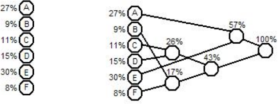

1. Bezzudumu saspiešana: Hafmana kods
========================================

Kursa tvērums un metodes
------------------------------

Kursā aplūkotas vairākas algoritmu tēmas, kas noderīgas sakaru tehnoloģijās un citur: 
(1) Bezzudumu saspiešana (*lossless compression*), (2) Zudumradošā saspiešana 
(*lossy compression*); attēlu un video saspiešana,
(3) Kļūdu labošanas kodi (*error correction codes*), (4) Lineārā programmēšana
(*linear programming*); optimizācija ar lineāriem ierobežojumiem; 
(5) Stringu meklēšanas algoritmi. 

**Teorija:**
  Katrai algoritmu tēmai apskatām matemātikas pamatus. Piemēram, informācijas 
  entropiju, nepārtraukta signāla paraugu biežumu, galīgus laukus, 
  ekstrapolāciju ar polinomiem, lineārās optimizācijas uzdevumus un to dualitāti, 
  hešfunkciju un sufiksu koku izmantošanu stringu meklēšanā.

**Uz papīra pildāmi algoritmi:** 
  Algoritmiem pieejams pseidokods un paraugi, lai pašus algoritmus un izmantotās 
  datu struktūras varētu zīmēt uz papīra, analizēt un mainīt.

**Standarti un rīki:** 
  Aplūkojam kursa algoritmu klātbūtni populāros rīkos, standartos un bibliotēkās.

**Eksperimenti:** 
  Algoritmus vizualizējam un darbinām interaktīvās vidēs, arī uz 
  lielākām datu kopām, nekā būtu iespējams uzzīmēt uz papīra.

Kā analizēt algoritmus
~~~~~~~~~~~~~~~~~~~~~~~

**Iedalījums pēc paradigmas:**
  Pārlases, rupjā spēka tehnika (*exhaustive search*, *brute force*),
  Pakāpeniska vienkāršošana (*decrease-and-conquer*),
  Skaldi-valdi (*divide-and-conquer*),
  Ievades datu pārveidojumi (*transform-and-conquer*),
  Dinamiskā programmēšana (*dynamic programming*),
  Rijīgā tehnika (*greedy technique*),
  Iteratīvā uzlabošana (*iterative improvement*).
  Algoritmu *izstrādes paradigmas* (*design techniques*) sk. 
  :ref:`[Lev12] <Lev12>`.

**Iedalījums pēc skaitļošanas modeļa:**
  Deterministiski, nedeterministiski, varbūtiski algoritmi. 
  Klasiski un kvantu algoritmi. 

**Iedalījums pēc sarežģītības:**
  Sliktākā gadījuma sarežģītība :math:`O(f(n))`, caurmēra sarežģītība
  (varbūtiski izvēlētai ievadei), vidējā sagaidāmā sarežģītība (varbūtiskam algoritmam). 

Kurss ilustrē dažādas algoritmu izstrādes paradigmas. Skaitļošanas modelis parasti ir 
deterministisks un klasisks (ne-kvantu). 
Atsevišķi pieminēti arī daži varbūtiski algoritmi. 

Kursa prasības
~~~~~~~~~~~~~~~

.. list-table:: 
    :header-rows: 1 

    * - :math:`a \in S`
      - :math:`w(a)`
      - :math:`\ell_a`
      - :math:`p(a)`
    * - I 
      - 0
      - 1
      - :math:`4/11`

1. 4 mājasdarbi (kopā :math:`40\%`) - teorijas jautājumi un algoritmu 
   pildīšana vienkāršiem datiem uz papīra. 
2. 10 minūšu uzstāšanās par sagatavotu tēmu (:math:`10\%`);
   eksperimentēšana ar kursa tēmām radniecīgu algoritmu (:math:`20\%`). 
3. Gala eksāmens (:math:`30\%`). 

Bezzudumu saspiešana: Ievads
----------------------------------

1. Saspiešanas jēdzieni, universālas saspiešanas neiespējamība.
2. Informācijas saturs un varbūtību sadalījuma entropija.
   Entropija teksta uzdevumos.
3. Prefiksu kodējumi, teorēmas par optimālu prefiksu kodējumu.
4. Hafmana algoritms; iegūtā kodējuma optimalitāte.
   Paša prefiksu koka kodēšana. 

**Definīcija:** 
  Par *alfabētu* (*alphabet*) sauc galīgu kopu ar simboliem.

**Definīcija:** 
  Par *ziņojumu alfabētu* (*message alphabet*) sauc galīgu kopu 
  ar :math:`n` iespējamiem ziņojumiem: :math:`S = \{ x_1, x_2, \ldots, x_n \}`. 

  Ziņojumu alfabēts var sastāvēt no burtiem tradicionālā nozīmē, 
  bet ziņojums var būt arī vairāki burti, vārds, vai jebkāds cits objekts. 
  Ziņojumu alfabētam raksturīgs varbūtību sadalījums: Katram :math:`x_i` 
  ir varbūtība :math:`p(x_i)`, ar kuru tas parādās ievadē. 

  *  Latīņu/angļu alfabēts: 26 simboli; latviešu alfabēts: 33 simboli; 
  * `ASCII alfabēts <http://www.asciitable.com/>`_: :math:`128` simboli; 
  * Unikoda alfabēts (UCS-2, *Basic Multilingual Plane*): 65536 simboli. 
  * Visu ar AES-128 vai AES-256 iekodējamo bloku alfabēts: 
    (viens bloks ir :math:`16` baiti jeb alfabēta izmērs ir :math:`2^{128}`).
  * 1 ziņojums var būt arī vesels fails vai saspiežama 
    faila gabals daudzu kilobaitu garumā.

**Definīcija:**
  Par *kodējumu* (*encoding*) 
  ziņojumu kopai :math:`S` sauc funkciju :math:`C`, kas
  katru ziņojumu pārvērš par bitu virkni. 

  Ziņojumam :math:`x_i` atbilstošo bitu virkni sauc par 
  *kodavārdu* (*codeword*) :math:`w_i` un 
  kodējumu var aprakstīt ar vārdnīcu (jeb funkcijas argumentu-vērtību pārīšiem): 

  .. math::
    
    C = \{ (x_1,w_1),(x_2,w_2),\ldots,(x_m,w_m)\}.

  

**Definīcija:** 
  Ja pats ziņojums :math:`x_i \in S` arī pierakstīts ar bitiem, var  
  definēt *saspiešanas attiecību* (*compression ratio*) - cik reizes 
  samazinās bitu virknes garums pēc iekodēšanas:

  .. math::

    r = \frac{\text{Uncompressed size}}{\text{Compressed size}} = 
    \frac{|x_i|}{|w_i|}.

  Līdzīgi definējam saspiešanas attiecību arī garākām ziņojumu virknēm
  (cik reizes īsāka ir ziņojumu virkne pēc saspiešanas, salīdzinot ar 
  ziņojumu virknes garumu pirms saspiešanas.)
  Parasti vēlamies, lai saspiešanas attiecība :math:`r` būtu iespējami liela, 
  bet mēdz būt arī, ka :math:`r < 1` (t.i. neiekodēta bitu virkne ir īsāka). 

Saspiešana un atspiešana
~~~~~~~~~~~~~~~~~~~~~~~~~~~

.. figure:: figs/compression-decompression.png
   :width: 4in
   :alt: Compression, decompression

**Bezzudumu saspiešana:**  
  Atspiestais ziņojums
  precīzi sakrīt ar sākotnējo.  
  Iecienīts teksta dokumentiem, izpildāmam kodam.
**Zudumradošā saspiešana:**   
  Atspiestais ziņojums tikai aptuveni vienāds ar sākotnējo.  
  Piemēri ir attēlu, skaņas, video glabāšana un pārraide.

**Piemērs:** 
  Bezzudumu saspiešanas algoritms:
  `Run length encodings <https://commons.wikimedia.org/wiki/File:Run-lengthEncoding1.png>`_.
  Ļoti efektīvs tad, ja tas pats burts atkārtojas daudzas reizes. 
  Tad `n` identisku burtu vietā nosūta vienu burtu un vienu skaitli garumā 
  `\log_2 n`. Tipiskā tekstā vienādi burti atkārtojas reti un šāds 
  kodējums padara nosūtāmo tekstu garāku.

**Definīcija:** 
  Funkciju :math:`f\,:\;X \rightarrow Y` 
  sauc par *injektīvu* (*injective*), 
  ja katriem diviem argumentiem :math:`x_1,x_2 \in X` izpildās:
  
  .. math::

    \forall x_1, x_2 \in X \left(x_1 \neq x_2\;\;\Rightarrow\;\;f(x_1) \neq f(x_2)\right).

  *Piezīme:* Bezzudumu saspiešanas funkcijai  jābūt injektīvai, tajā nedrīkst
  būt "kolīzijas" (vērtību "saskriešanās"), jo citādi nevar viennozīmīgi atkodēt. 

**Apgalvojums:** 
  Neeksistē tāds algoritms, kas **katru** :math:`n` bitu virkni
  bezzudumu saspiešanā pārveido par īsāku virkni -- t.i. 
  tādu :math:`k` bitu virkni, kur :math:`k < n`.

**Pierādījums:** 
  Ar skaitīšanu. Bitam ir :math:`2` vērtības (:math:`0` vai :math:`1`). 

  * :math:`m` bitu virknei ir :math:`2^m` vērtības,
  * :math:`k` bitu virknei ir :math:`2^k` vērtības. 

  No *Dirihlē principa* (*Pigeonhole principle*) 
  seko, ka injektīva funkcija no kopas ar :math:`2^m` elementiem
  uz :math:`2^k` elementiem (ja :math:`k < m`) neeksistē. 
  :math:`\blacksquare`

Informācijas saturs un entropija
~~~~~~~~~~~~~~~~~~~~~~~~~~~~~~~~~~

**Piemērs:** 
  Ir divu veidu ziņojumi -- sarkanie un zaļie. 
  Zaļā ziņojuma varbūtība ir :math:`0.25`, bet sarkanā ziņojuma varbūtība ir :math:`0.75`. 
  Kā optimāli kodēt nejaušu virkni ar :math:`n` ziņojumiem, kas pakļaujas 
  šādam varbūtību sadalījumam? 

  .. figure:: figs/red-green-balls.png
     :width: 3.5in

Ja dotas divas ziņojumu kopas jeb alfabēti, tad, ziņojumus pierakstot vienu 
otram galā, konkatenēto ziņojumu skaits ir abu kopu skaita reizinājums. 
Bet "informācijas daudzums" (intuitīvi - kodējuma garums) saskaitās.

1. Logaritms no reizinājuma: :math:`\log_2 ab = \log_2 a + \log_2 b`
2. Logaritma bāzes maiņas formula: :math:`\log_a b = \frac{\log_m b}{\log_m a}`. 
   (Pārkodējot to pašu informāciju no alfabēta ar :math:`m` simboliem alfabētā 
   ar :math:`a` simboliem, kodējuma garums samazinās :math:`\log_m a` reizes.)

**Definīcija:**
  Par ziņojuma :math:`x_i \in S` 
  *informācijas saturu* (*information content*) sauc lielumu: 

  .. math::

    h(x_i) = \log_2 \frac{1}{p(x_i)} = -\log_2 p(x_i).

  *Piezīme:* Informācijas saturs izrādīsies vienāds ar bitu skaitu, kas
  izmantojami, lai pārraidītu ziņojumu :math:`x_i` kaut kādā optimālā kodējumā.)

Šo ieviesa *Klods Šenons* (*Claude Shannon*). Pastāv sakarība starp 
informācijas teorijas entropiju un termodinamikas entropiju, bet tā nav vienkārša.  
Par to ir MIT studiju kurss :ref:`[Mil11] <Mil11>`.  

**Piemēri:** 

  1. Godīgai monētai ir divi stāvokļi: :math:`S=\{ \mathtt{heads}, \mathtt{tails} \}`, 
     abu ziņojumu varbūtības ir :math:`p=\frac{1}{2}`. Informācijas saturs katram no tiem: 

     .. math:: 
  
        h(\mathtt{heads}) = h(\mathtt{tails}) = - \log_2 (1/2) = 1.

  2. Metamajam kauliņam ir seši stāvokļi, katram no tiem varbūtība
     ir :math:`1/6`. Informācijas saturs katram no tiem:

     .. math::

        h(x_i) = - \log_2 (1/6) \approx 2.585.

**Divu informācijas saturu summa:** 

Pieņemsim, ka :math:`a,b \in S` ir divi neatkarīgi varbūtiski notikumi jeb ziņojumi. 
Tad varbūtība saņemt tos vienu aiz otra ir
:math:`p(ab) = p(a) \cdot p(b)` un informācijas daudzums:

.. math::

  h(ab) = -\log_2 (p(a) \cdot p(b)) = -\log_2(p(a)) - \log_2(p(b)) = h(a) + h(b).

**Definīcija:** 
  Ja diskrētam *gadījuma lielumam*
  (*random variable*) ir zināma iespējamo stāvokļu kopa :math:`S` un 
  katram :math:`x_i \in S` zināma varbūtība, tad 
  par gadījuma lieluma *entropiju* sauc vērtību: 

  .. math:: 

    H(S) = - \sum\limits_{x_i \in S} p(x_i)) \log_2 p(x_i),

  kur :math:`p(x_i)` ir ziņojumam :math:`x_i` atbilstošā varbūtība.

**Piemērs (Entropija nejaušu bitu virknei):**
  Aplūkosim entropiju bitu virknītei garumā :math:`L`.  
  Ja ir :math:`n = 2^L` ziņojumi ar vienādām varbūtībām :math:`1/n`, 
  tad katru no tiem var iekodēt ar :math:`\log_2 n = L` bitiem. 

  Katra ziņojuma informācijas saturs :math:`h(x_i) = -\log_2 (1/n) = \log_2 n = L`. 
  Tātad arī entropija (visu šo informācijas saturu vidējā vērtība) ir :math:`L`.  
  Šajā ekstrēmajā gadījumā entropija precīzi sakrīt ar kodēšanai 
  nepieciešamajiem baitiem. 

**Piemērs (Entropija negodīgai monētai):**
  Ja, metot monētu, cipars (:math:`\mathtt{heads}`) uzkrīt ar varbūtību 
  :math:`0.9`, bet ģerbonis (:math:`\mathtt{tails}`) -- ar varbūtību :math:`0.1`, tad 
  ciparam informācijas saturs ir :math:`h(\mathtt{heads}) = -\log_2 0.9 \approx 0.152`, 
  bet ģerbonim informācijas saturs ir :math:`h(\mathtt{tails}) = -\log_2 0.1 \approx 3.32`. 
  Savukārt entropija pašam monētas mešanas procesam ir abu šo lielumu *svērts vidējais* 
  :math:`H(\{\mathtt{heads}, \mathtt{tails} \}) = -0.9 \log_2 0.9 - 0.1 \log_2 0.1 \approx 0.469`. 
  
  *Piezīme:* Informācijas saturu un entropiju
  mēra "bitos". Datoru arhitektūrā ir reāli biti, 
  bet entropijā ir informācijas daudzuma biti - var būt 
  arī daļskaitļi.

  
  .. plot:: figs/entropy.py
       :include-source: false
       :width: 5.5in
   
       Informācijas saturs un entropija divu ziņojumu alfabētam :math:`S = \{\mathtt{heads}, \mathtt{tails} \}`.

  Vislielākā entropija divu ziņojumu gadījumlielumam ir tad, ja 
  abi ziņojumi rodas ar vienādām varbūtībām. Tad :math:`H(S) = 1`. 
  Visos citos gadījumos :math:`H(S) < 1`. 

  Ievērojam, ka entropija ir definēta arī tad, ja 
  kāda no varbūtībām ir :math:`0` (abi atzīmētie punkti entropijas grafikā pa labi). 
  Ziņojumam ar nulles varbūtību 
  ir "bezgalīgs" logaritms un tātad arī informācijas saturs, bet, pareizinot ar svaru :math:`0`, 
  šāda ziņojuma ieguldījums kopējā entropijā ir :math:`0`, jo 
  :math:`{\displaystyle \lim\limits_{p \rightarrow 0} - p \cdot \log_2 p = 0}`. 

Entropijas īpašības
~~~~~~~~~~~~~~~~~~~~~~

Aplūkojam diskrētu gadījumlielumu :math:`X`, kuram 
ir :math:`m` dažādas vērtības (ziņojumi, burti, metamā kauliņa iznākumi, 
cipars/ģerbonis utt.) ar attiecīgajām varbūtībām 
:math:`\{ p_1, p_2, \ldots, p_m \}`. 
Un otru diskrētu gadījumlielumu :math:`Y = \{ y_1, y_2, \ldots, y_n \}` 
ar tiem piesaistītajām varbūtībām :math:`p(x_i) = p_i` un :math:`p(y_j) = q_j`. 
Entropijai izpildās šādas īpašības: 

**Entropija ir nenegatīva:**
  :math:`H(X) \geq 0`. Vienādība :math:`H(X) = 0` izpildās tikai tad, ja 
  varbūtību sadalījums :math:`(x_1,x_2,\ldots,x_m) = (0,\ldots,0,1,0,\ldots,0)`. 

**Entropija ir simetriska**
  :math:`H(\{ x_1,\ldots, x_m \}) = H(\{ x_{\tau(1)},\ldots, x_{\tau(m)} \})`, 
  kur `\tau(i)` ir indeksu :math:`j` permutācija. 

Prefiksu kodējumi
-------------------

Mainīga garuma kodi var palīdzēt ietaupīt vietu. 
Ja visus ziņojumus kodē vienādi gari, tad 
katrs simbols aizņem 
:math:`\left\lceil \log_2 |S| \right\rceil` - tas parasti
ir ļoti neoptimāli.

Ar dažāda garuma kodavārdiem rasties *neviennozīmības* (*ambiguities*). 
Piemēram, ja kodējums ir 

.. math::

    \{(a, \mathtt{1}), (b, \mathtt{01}), (c, \mathtt{101}), (d, \mathtt{011})\},

tad :math:`\mathtt{1011}` var saprast trīs dažādos veidos:

.. math::

    \mathtt{1.01.1},\;\;\mathtt{1.011},\;\;\mathtt{101.1}.

**Definīcija:** Par *prefiksu kodējumu* (*prefix code*) 
sauc tādu ziņojumu alfabēta attēlojumu par kodavārdiem, ka 
neviens kodavārds nav cita kodavārda prefikss.  
(Faktiski tas ir "bezprefiksu" kodējums.)

.. figure:: figs/prefix-tree.png
   :width: 2.5in

.. math::

    C=\{ (S, \mathtt{00}), (I, \mathtt{01}),
         (E, \mathtt{100}), (N, \mathtt{101}),
         (T, \mathtt{110}), (A, \mathtt{111})\}.

**Piemērs:**
  Izmantojot augstākminēto prefiksu koku:

  * Atkodēt virkni :math:`\mathtt{11100110100}`,
  * Atkodēt virkni :math:`\mathtt{0001100101111}`.
 

Vidējais kodējuma garums
~~~~~~~~~~~~~~~~~~~~~~~~~~~~

Pieņemsim, ka ir zināms varbūtību sadalījums ziņojumu telpā :math:`S`:   
Katram :math:`x_i \in S` ir piekārtota 
varbūtība :math:`p(x_i)` un :math:`p(x_1)+\ldots+p(x_n)=1`.

**Definīcija:** 
  Par kodējuma :math:`C = \{(x_1,w_1),\ldots,(x_n,w_n)\}` 
  *vidējo garumu* (*average length*) sauksim summu:

  .. math::

      \ell_a(C) = \sum\limits_{(x_i,w_i) \in C} p(x_i)\ell(w_i),
   
  kur :math:`\ell(w_i)` apzīmē kodavārda :math:`w_i` garumu bitos. 

**Definīcija:** 
  Teiksim, ka :math:`C` ir *optimāls kodējums*, 
  ja tas ir viennozīmīgi atkodējams un tā :math:`\ell_a(C)` ir minimāls. 
  Citiem vārdiem, ja 
  dotajam ziņojumu varbūtību sadalījumam neeksistē cits kodējums, 
  kam vidējais garums ir vēl mazāks.

    
**Teorēma (Krafta-Makmilana nevienādība):** 
  (:ref:`[Ble13, Lemma 3.1.1] <Ble13>`) 
  Ja :math:`C` ir *viennozīmīgi atkodējams kods* 
  (*uniquely decodable code*) :math:`C = \{ (x_1,w_1),\ldots,(x_n,w_n)\}`, tad

  .. math::

    \sum\limits_{(x_i,w_i) \in C} 2^{-\ell(w_i)} \leq 1.

  Un apgrieztais apgalvojums: Ja ir doti vairāki kodējumu garumi :math:`l_i`, kas
  apmierina :math:`\sum 2^{-l_i} \leq 1`, tad no tiem var uzbūvēt
  prefiksu koku, kur katram garumam :math:`l_i` atbilst lapa šajā kokā, kuras
  dziļums ir tieši :math:`l_i`.

**Pierādījums:** 
  Vispārīgiem viennozīmīgi atkodējamiem kodiem to pierādīt ir piņķerīgi.

  *Prefiksu kodiem* (*prefix-free codes*) ievērojam, ka ikviens
  :math:`k_i`-bitu kods aizpilda prefiksu kokā (sauktā arī par "kodu telpu") 
  tieši :math:`\frac{1}{2^{k_i}}` daļu no tilpuma. 

  Dažādu kodu veidotie "tilpumi" nevar daļēji šķelties. Un tā kā 
  neviens nav prefikss otram, neviens nevar būt pilnīgi otra iekšpusē.
  Pilnās kodu telpas tilpums ir :math:`1`, tādēļ summa 
  visiem :math:`2^{-k_i}`, kur :math:`k_i = \ell(w_i)` nepārsniedz 1.  
  :math:`\blacksquare`

**Teorēma:** 
  Katrai ziņojumu kopai :math:`S` ar zināmu varbūtību sadalījumu 
  un optimālu prefiksu kodējumu :math:`C`:

  .. math:: 

    \ell_a(C) \leq H(S) + 1.

**Pierādījums:** 
  Katram ievades ziņojumam/simbolam :math:`x_i \in S` izvēlamies 

  .. math::
    \ell(x_i) = \left\lceil \log_2 \frac{1}{p(x_i)} \right\rceil. 

  Tādā gadījumā:

  .. math::
    \sum\limits_{x_i \in S} 2^{-\ell(x_i)} = \sum\limits_{x_i \in S} 
    2^{-\left\lceil \log_2 \frac{1}{p(x_i)} \right\rceil} \leq 
    \sum\limits_{x_i \in S} 2^{- \log_2 \frac{1}{p(x_i)}} = \sum\limits_{x_i \in S} p(x_i) = 1.

  Pēc Krafta-Makmilana teorēmas (pretējā virziena) varam 
  atrast tādu prefiksu kodu :math:`C'`, kam ir tieši šādi kodavārdu garumi. 
  Vidējā garuma :math:`\ell_{avg}(C')` novērtējums:

  .. math::

      \ell_{avg}(C') = \sum\limits_{x_i \in S} p(x_i) \cdot \left\lceil \log_2 \frac{1}{p(x_i)} 
      \right\rceil \leq 
      \sum\limits_{x_i \in S} p(s)\left( 1 + \log_2 \frac{1}{p(x_i)} \right) = 1 + H(S).

  Optimālajam prefiksu kodam :math:`C` jābūt vismaz tikpat labam kā nupat piedāvātais :math:`C'`. 
  Tādēļ arī tam būs novērtējums:

  .. math::

    \ell_{avg}(C) \leq \ell_{avg}(C') \leq 1 + H(S).

Kodējuma vidējais garums
--------------------------

**T1: Kodējuma garuma novērtējums**

**Teorēma 1:**  
  Katrai ziņojumu kopai :math:`S` ar zināmu varbūtību sadalījumu un 
  viennozīmīgi atkodējamu kodējumu :math:`C` ir spēkā nevienādība:

  .. math:: 

    H(S) \leq l_a(C).

**Intuīcija par Šenona apgalvojumu**
  Sūtot ziņojumu :math:`x` no 
  alfabēta :math:`S`, *informācijas saturs* (*information content*) 
  :math:`h(x)` ir ieteicamais bitu skaits.
  Ja ziņojumiem :math:`x_i` atbilst varbūtības
  :math:`p_i`, tad katrs no tiem aizņem kaut gabalu no 
  "kodu telpas". Piemēram, izmantojot kodēšanai 4 bitus, esam aizņēmuši
  1/16 no kodu telpas.

**Pierādījums:** 
  Rakstām nevienādību ķēdīti:

  .. math::

    \begin{array}{rl}
      H(S) - \ell_a(C) &= \sum\limits_{x_i \in S} p(x_i)  \log_2 \frac{1}{p(x_i)} - 
      \sum\limits_{x_i \in S} p(x_i)\ell(x_i) =\\
      &= \sum\limits_{x_i \in S} p(x_i) \left( \log_2 \frac{1}{p(x_i)} - 
      \log_2 2^{\ell(x_i)} \right) = \\
      &= \sum\limits_{x_i \in S} p(x_i) \log_2 \frac{ 2^{-\ell(x_i)}}{p(x_i)} \leq 
      \log_2 \sum_{x_i \in S} 2^{-\ell(x_i)} \leq 0.\\
    \end{array}

  :math:`\blacksquare`

**Pēdējais pārveidojums ķēdītē**

Atgādinām :math:`\ell` definīciju:
Katram ziņojumam :math:`s_i \in S` ar :math:`\ell(s_i)` 
apzīmējam :math:`s_i` kodavārda :math:`w_i` garumu 
kodējumā :math:`C`, t.i. :math:`(s_i,w_i) \in C`. 
Kādēļ ir spēkā nevienādība?

.. math:: 

    \sum\limits_{x_i \in S} p(x_i) \log_2 \frac{ 2^{-\ell(x_i)}}{p(x_i)} \leq 
    \log_2 \sum_{x_i \in S} 2^{-\ell(x_i)}

**Jensena nevienādība:** 
  Dota :math:`f(x)` divreiz nepārtraukti diferencējama
  funkcija intervālā :math:`[a;b]` un šajā intervālā :math:`f''(x) \leq 0`, t.i. 
  :math:`f(x)` grafiks ir izliekts uz augšu. 
  Doti arī :math:`n` skaitļi :math:`x_1,x_2,\ldots,x_n \in [a;b]` un 
  svari :math:`p_1,p_2,\ldots,p_n`, kuru summa ir 1. Tad ir spēkā nevienādība:

  .. math:: 

    p_1f(x_1) + p_2f(x_2) + \ldots + p_nf(x_n) \leq f \left( p_1x_1 + \ldots p_nx_n \right).

Hafmana algoritms
------------------

**Ievade:** 
  Burti (ziņojumi) ar dotām varbūtībām.  

**Izvade:** 
  Prefiksu koks šo burtu/ziņojumu attēlošanai ar prefiksu kodējumu.

   Hafmana algoritms. 

Hafmana algoritms atbilst *rijīgo* (*greedy*) algoritmu 
paradigmai - "lokāla" optimizēšana šoreiz noved pie globāli optimāla
risinājuma.

**Hafmana algoritma pseidokods:**
  *Ievade:* Ziņojumu alfabēts :math:`S` ar varbūtību :math:`x.\mathit{freq}` 
  katram ziņojumam :math:`x \in S`.  
  *Izvade:* Prefiksu koks, kas katram ziņojumam piekārto kodējumu. 

  | :math:`\text{\sc Huffman}(S)`
  | 1. :math:`\quad` :math:`n = |S|` :math:`\quad` *// elementu skaits*
  | 2. :math:`\quad` :math:`Q = \text{\sc MinimumPriorityQueue}(S)`
  | 3. :math:`\quad` **for** :math:`i = 1` **to** :math:`n-1`: 
  | 4. :math:`\quad\quad` :math:`\text{\sc CreateNode}(z)`
  | 5. :math:`\quad\quad` :math:`z.\mathit{left} = x = Q.\text{\sc ExtractMin}()`
  | 6. :math:`\quad\quad` :math:`z.\mathit{right} = Y = Q.\text{\sc ExtractMin}()`
  | 7. :math:`\quad\quad` :math:`z.\mathit{freq} = x.\mathit{freq} + y.\mathit{freq}`
  | 8. :math:`\quad\quad` :math:`Q.\text{\sc insert}(z)`
  | 9. :math:`\quad` **return** :math:`Q.\text{\sc ExtractMin}()`

  Pseidokods aizgūts no :ref:`[CLR22, p.431] <CLR22>`.

**Hafmana algoritma laika sarežģītība:**  
  Laika sarežģītība gadījumā, ja prioritāšu rindu implementē kā kaudzi (*heap*): 

  * :math:`\text{\sc ExtractMin}(Q)` (minimuma atrašanai) prioritāšu rindā vajag :math:`O(\log n)` laiku.
  * :math:`\text{\sc Insert}(Q,z)` arī vajag :math:`O(\log n)` laiku.
  * Pilns laiks :math:`\text{\sc Huffman}(S)` izsaukumam ir :math:`O(n \log n)`, kur :math:`n = |S|`. 

**Teorēma (Hafmana koka optimalitāte):** 
  Hafmana algoritms ģenerē optimālu bināro prefiksu koku ziņojumu kopai :math:`S`` 
  pie dotā varbūtību sadalījuma.

  Starp visiem kodējumiem :math:`C`, kur ziņojumiem :math:`x_i \in S` 
  kaut kā piešķir bezprefiksu kodus :math:`w_i`, vidējais garums

  .. math:: 

     \ell_a(C) = \sum\limits_{(x_i,w_i) \in C} p(x_i)\ell(w_i)

  Hafmana koka aprakstītajā kodējumā :math:`C^{\ast}` būs vismazākais 
  (vai viens no vismazākajiem).

**Pierādījums:** 

  **Bāze:** 
    Ja ziņojumu alfabētā :math:`S` ir :math:`1` burts. 
    Tad ir tikai viens koks, kas ir gan optimālais, gan Hafmana koks.

  **Indukcijas pāreja:** 
    Ja ir vismaz divi burti. Pieņemam, ka Hafmana algoritms vienmēr dod optimālu koku pie :math:`k-1` burtiem. 
    Tagad dots alfabēts :math:`S` ar :math:`k` burtiem, kur :math:`x` 
    un :math:`y` ir divi visretāk sastopamie burti.

    Pirmajā solī Hafmana algoritms apvieno virsotnes :math:`x` un :math:`y`. 
    Izveidojas jauna virsotne, kuras biežums ir :math:`p(x) + p(y)`. 
    Tālāk ir jāpielieto Hafmana algoritms :math:`k-1` burtam.

    Pēc indukcijas pieņēmuma Hafmana algoritms :math:`k-1` burtam dod optimālo koku. 
    Tas nozīmē, ka Hafmana algoritms dod optimālo koku starp tiem kokiem, 
    kuros :math:`x` un :math:`y` atrodas blakus.

    Varbūt ir vēl optimālāks koks, kur :math:`x` un :math:`y` neatrodas blakus?

    Pamatosim, ka citus kokus var pārveidot par kokiem, 
    kuri ir vismaz tikpat optimāli, turklāt :math:`x` un :math:`y` ir blakus.

    Optimālā kokā izpildās 2 apgalvojumi:

    1. Ja :math:`p(x) < p(y)`, tad :math:`\ell_x \geq \ell_y` 
       (citādi varētu apmainīt :math:`x` un :math:`y` vietām kokā un kodējuma garums no tā samazinātos.)
    2. Apskatīsim maksimālo kodavārda garumu jeb prefiksu koka dziļumu ar :math:`\ell_{\max}`. 
       Tad ir divi tādi burti :math:`u`, :math:`v`, kuriem :math:`\ell_u = \ell_v = \ell_{\max}`. 
       (Vispirms atrodam maksimāli dziļu :math:`u`. 
       Ja blakus nebūtu šķautnes uz :math:`v`, tad varētu saīsināt :math:`u` kodējumu par vienu šķautni.)

    Doti :math:`x,y` -- 2 visretāk sastopamie burti,
    bet :math:`u,v` - visdziļāk prefiksu kokā esošie kaimiņi.

    * Abi :math:`x,y` ir tikpat dziļi kokā kā maksimāli dziļās 
      virsotnes :math:`u` un :math:`v`. (citādi koku varētu uzlabot).
    * Apmainot :math:`x` ar :math:`u`, bet :math:`y` ar :math:`v`, 
      no jebkura optimāla koka var iegūt citu optimālu koku, kuram :math:`x` un :math:`y` ir blakus.

    .. figure:: figs/switching-x-y.png
       :width: 0.8in

       Maina vietām :math:`x` un :math:`y`.

Agrāk pamatojām rezultātu: 
Katrai ziņojumu kopai :math:`S` ar zināmu varbūtību sadalījumu 
un optimālu prefiksu kodējumu :math:`C`:

.. math::

   \ell_a(C) \leq H(S) + 1.

**Sekas:** 
  Tā kā Hafmana algoritms rada optimālo prefiksu kodējumu
  (faktiski: vienu no optimālajiem), tad 
  Hafmana kodējumam :math:`C^{\ast}` ir spēkā: 

  .. math::

    \ell_a(C^{\ast}) \leq H(S) + 1.

Prefiksu koku kodējumu varianti
~~~~~~~~~~~~~~~~~~~~~~~~~~~~~~~~~~~~

**Simbolu grupēšana**

Piemērs: Negodīgās monētas alfabēts :math:`S = \{ A,B \}` ar varbūtībām
:math:`p(A) = 0.9` un :math:`p(B) = 0.1`.

* Kodējot pa vienam simbolam, iegūstam vidējo koda garumu :math:`\ell_a(C) = 1`,
  kaut arī entropija :math:`H(S) = 0.4689956`.
* Kodējot pa diviem simboliem: :math:`T = \{ AA,AB,BA,BB \}` ar
  varbūtībām :math:`\{ 0.81, 0.09, 0.09,0.01 \}`, vidējais koda garums Hafmana
  kodam ir :math:`\ell_a(C_2) = 1 \cdot 0.81 + 2\cdot 0.09 + 3\cdot 0.09 + 3 \cdot 0.01 = 1.29/2 = 0.645.`

**Prediktīva kodēšana**

* Parasti nevajag aplūkot pilnu Dekarta reizinājumu :math:`S \times S`, ko
  veido **visi** iespējamie simbolu pārīši :math:`(x_i,x_j)`, jo ne katri
  divi (vai trīs, četri, utt.) simboli mēdz atrasties blakus.
* Visu simbolu pāru kodēšana ir laba blēdīgajām monētām 
  (un to radītajai Bernulli eksperimentu virknei, kur 1 eksperimenta
  sadalījums ir :math:`\{ p, 1-p \}`).
* Pirmais tuvinājums reāliem tekstiem ir 
  Markova ķēdes (nākamā simbola varbūtības sadalījumu nosaka 
  iepriekšējais simbols).

**Hafmana algoritma lietojumi**

* PKZIP (Phil Katz) arhivators - PKZIP 2.04g un jaunāki standarti, 
  kuri lieto DEFLATE saspiešanas standartu (tas pats, 
  kas populārie Zip failu formāti mūsdienās).
* `RFC 7541 - HPACK: Header Compression for HTTP/2 <https://tools.ietf.org/html/rfc7541>`_ 
  Hederu saspiešana HTTP/2 protokolam (RFC 7540), ko lieto kopš 2015.g.

Kodu tabulas nosūtīšana 
----------------------------

Saspiešanas algoritmi izmanto *kodējumu tabulu* (*codebook*); 
prefiksu kodiem to var iztēloties kā koku.
Ja ziņojumu biežumi ir zināmi, koku sūtītājs un saņēmējs var izrēķināt paši. 
Parasti šie biežumi atklājas sūtītājam. Tad kodējumu koks vai tabula ir jāsūta 
kopā ar iekodētajiem datiem. 

Lielā alfabētā kodējuma tabula var aizņemt ievērojamu vietu, tāpēc 
ir īpaši taupīgs Hafmana koka nosūtīšanas veids: 
`Kanoniskais Hafmana kods <https://en.wikipedia.org/wiki/Canonical_Huffman_code>`_. 

**Kā efektīvi iekodēt pašu Hafmana koku:**

Var sūtīt pilnu kodējumu tabulu (katram simbolam/ziņojumam pieraksta 
to bitu virknīti, ar kuru tas kodējams). 
Šāds pieraksta veids satur daudz liekas informācijas. 

**Kanonisks Hafmana kodējums:** 
  `Kanoniskais Hafmana kodējums <https://en.wikipedia.org/wiki/Canonical_Huffman_code>`_ ir 
  veids, kā (nemainot kodējumu garumus nevienam burtam), 
  tos var piešķirt, ievērojot alfabētisku secību. Tādā gadījumā (zināmam ziņojumu alfabētam)
  pietiek nosūtīt tikai to kodējumu garumus -- visu 
  kodējumu tabulu no tā var atjaunot. 
  Vienkārši sakot, kanoniskā Hafmana kokā 
  simbolus (koka lapas) vispirms sakārto pēc kodējuma garuma; ja vienādi 
  garumi, tad pēc alfabēta. Formāli to var uzrakstīt šādi: 

  * Apstaigājot koka lapas jeb iekodētos simbolus 
    "in-order" secībā (vispirms zaru ar "0", tad zaru ar "1), kodējumu garumi veido nedilstošu virkni. 
  * Vienādiem kodējumu garumiem simbols, kurš ir alfabētiski pirms cita simbola, 
    atrodas kokā pa kreisi (t.i. agrākam burtam arī tā kodējums ir 
    leksikogrāfiski agrāk).  
  * Īsākais kodējums (vai viens no īsākajiem, ja tādu ir vairāki) 
    sastāv no visām nullēm. Turpmākos kodējumus piešķir pēc kārtas, neko neizlaižot; 
    ja kodējuma garums kādā solī palielinās, tad ne tikai pieskaita binārajam skaitlim "1", 
    bet arī pieraksta tam galā vajadzīgo skaitu nuļļu.

**Kanoniska koka piemērs:**
  Uzbūvēt kanonisku Hafmana kodējumu koku alfabētam :math:`\left\{ \mathtt{A}, \mathtt{B}, 
  \mathtt{C}, \mathtt{D} \right\}`, kam atbilstošie kodējumu garumi ir :math:`(2,1,3,3)`. 

**Atrisinājums:** 
  Īsākais kodējums ir simbolam `B` - šis kodējums satur tikai nulles (tātad ir `0`). 
  Nākamais ir simbola `A` kodējums, kas ir `10`. 
  Visbeidzot ir abi garākie kodējumi, kurus piešķiram alfabētiskā secībā. 
  Tātad simbola `C` kodējums ir `110`, bet simbola `D` kodējums ir `111`. 
  
  .. code-block:: text

    B = 0     (1 bits)
    A = 10    (2 biti)
    C = 110   (3 biti)
    D = 111   (3 biti)

  Ja lietots kanonisks Hafmana koks un ir zināms simbolu alfabēts  
  (piemēram, :math:`S=\{ A,B,C,D \}`), tad 
  pietiek paziņot attiecīgo burtu kodavārdu garumus: :math:`(2, 1, 3, 3)`.

**Par nekanoniskiem Hafmana kokiem:**
  Protams, Hafmana algoritma darbināšanas laikā var rasties 
  arī nekanonisks koks (un tātad arī kodējumu tabula). 
  Piemēram, 

  .. code-block:: text

    A = 11
    B = 0
    C = 101
    D = 100

  Šādam kokam ir kodējuma īsums ir tāds pats kā kanoniskajam, jo kodējuma
  garumi ir tādi paši. 
  Toties šoreiz kodējumi neseko viens otram leksikogrāfiskā/sakārtotā secībā.

Uzdevumi
----------

**1.1. uzdevums:**
  Uz godīga metamā kauliņa uzmeta kādu skaitli 
  no kopas :math:`\{1,2,3,4,5,6\}`. Uzrakstīt izteiksmi, kura izteiksme izsaka 
  šī notikuma informācijas saturu?

**(A)** 
  :math:`(\ln 2) \cdot (\ln 6)`

**(B)** 
  :math:`{\displaystyle (\ln 2)/(\ln 6)}` 

**(C)** 
  :math:`{\displaystyle (\ln 6)/(\ln 2)}`  

**(D)** 
  :math:`\ln (2\ln 6)`

**(E)** 
  Kāda cita (ierakstīt savu)

.. only:: Internal 

  **Atbilde:**

    Logaritma bāzes maiņas formula: 

    .. math::

      \log_a b = \frac{\log_m b}{\log_m a}.

    Mūsu gadījumā :math:`{\displaystyle  \log_2 6 = (\ln 6)/(\ln 2) \approx 2.584963}`.

  :math:`\square`

**1.2. uzdevums:**
  Atrast entropiju gadījumlielumam :math:`S = \{A,B,C\}`, 
  kam :math:`p(A)=1/2`, :math:`p(B)=p(C)=1/4`. Atbildi noapaļot
  līdz diviem cipariem aiz komata. 

.. only:: Internal 

  **Atbilde:** 

    Katram no simboliem :math:`A,B,C` aprēķinām informācijas saturu:  
    :math:`h(A) = \log_2 \frac{1}{1/2} = \log_2 2 = 1.`

    .. math::

      h(B)=h(C)= \log_2 \frac{1}{1/4} = \log_2 4 = 2.

    Entropija ir svērts vidējais :math:`(1/2)p(A) + (1/4)p(B) + (1/4)p(C)`: 

    .. math::
    
      (1/2)\cdot 1 + (1/4) \cdot 2 + (1/4) \cdot 2 = 1.5.

  :math:`\square`

**1.3. uzdevums**
  Kāds ir Hafmana kodējuma vidējais garums, ja ar to 
  kodē burtu virknīti :math:`MISSISSIPPI`.
  Atbildi noapaļot līdz diviem cipariem aiz komata. 

.. only:: Internal  

  **Atbilde:** 

    .. figure:: figs/mississippi.png  
       :width: 2in

       Prefiksu koks

    .. list-table:: 
       :header-rows: 1 

       * - :math:`a \in S`
         - :math:`w(a)`
         - :math:`\ell_a`
         - :math:`p(a)`
       * - I 
         - 0
         - 1
         - :math:`4/11`
       * - S 
         - 10
         - 2
         - :math:`4/11`
       * - M 
         - 110
         - 3
         - :math:`1/11`
       * - P
         - 111
         - 3
         - :math:`2/11`

    Burtu :math:`I,S,M,P` kodējumu garumi ir attiecīgi :math:`1,2,3,3` biti. 
    Piereizinām ar attiecīgo burtu varbūtībām 
    (to relatīvajiem biežumiem vārdā :math:`MISSISSIPPI`).

    .. math::

       1\frac{4}{11} + 2\frac{4}{11} + 3\frac{2}{11} +
       3\frac{1}{11} = \frac{21}{11} \approx 1.91.

  :math:`\square`

**1.4. uzdevums**
  Kāds būtu kodējuma vidējais garums, ja vārdā :math:`\mathtt{MISSISSIPPI}`
  katru no četriem burtiem kodētu šādi:

  .. math::

     C = \{(I,\mathtt{00}),(M,\mathtt{01}),
     (P,\mathtt{10}),(S,\mathtt{11})\}.
   
  Atbildi noapaļot līdz diviem cipariem aiz komata. 

.. only:: Internal  

  **Atbilde:** 

    Pat neko nerēķinot, redzams, ka ikviena simbola kodējuma
    garums ir $2$, tātad arī vidējais kodējuma garums būs 
    svērts vidējais starp visiem šiem divniekiem:

    .. math::

       p(M)\cdot 2 + p(I)\cdot 2 + p(S)\cdot 2 + p(P)\cdot 2 =
       (1/11)\cdot 2 + (4/11)\cdot 2 + (4/11)\cdot 2 + (2/11)\cdot 2 = 2.

  :math:`\square`

**1.5. uzdevums** 
  Ēdnīcā ir pieejamas trīs dažādas zupas, kuras maksā attiecīgi 1, 2, vai 3 eiro. 
  Ir arī trīs otrie ēdieni, kuri maksā attiecīgi 2, 4, un 6 eiro. 
  Katrs apmeklētājs nejauši izvēlas vienu no zupām un vienu no otrajiem ēdieniem. 

  * Kāda ir entropija gadījumlielumam, kas apraksta 1 izvēlēto zupu?
  * Kāda ir entropija gadījumlielumam, kas apraksta 1 izvēlēto otro ēdienu?
  * Kāda ir pusdienu komplekta entropija, ja zupu un otro ēdienu izvēlas 
    neatkarīgi? 
  * Kāda ir entropija gadījumlielumam, kas apraksta par abiem ēdieniem samaksāto cenu? 

**1.6. uzdevums** 
  Uz :math:`11` klucīšiem uzrakstīti burti: "MISSISSIPPI". 
  Tie visi sabērti tumšā maisā. 
  Vienā gājienā no maisa izvelk vienu klucīti, noraksta uz tā esošo 
  burtu un atliek klucīti atpakaļ maisā. 

  Ja pēc :math:`11` šādiem gājieniem ir izrakstīti burti "MISSISSIPPI" tieši 
  šādā secībā, tad spēlētājs saņem lielu naudas prēmiju. 
  Apzīmēsim prēmijas saņemšanas varbūtību ar :math:`P`. 
  Izteikt :math:`\log_2(P)` ar :math:`H(X)` -- ar viena klucīša 
  izvilkšanas gadījumlieluma entropiju. 

**1.7. uzdevums** 
  Dotas :math:`12` monētas, no kurām visām ir vienādas masas, 
  izņemot vienu, kura ir vai nu vieglāka, vai nu smagāka nekā citas.   
  Ar kādu mazāko svēršanu skaitu var noskaidrot, vai tā ir vieglāka
  vai smagāka kā arī atrast šo monētu?

.. only:: Internal

  **Atbilde:** 

    Daži vienkārši jautājumi: 

    * Cik svēršanas būtu nepieciešamas, ja jau zinām atbildi un mums tā 
      jāpierāda, piemēram, tiesas ekspertīzē?  
      *Nedeterministiskie algoritmi* (*non-deterministic algorithms*). 
    * Cik svēršanas nepieciešamas deterministiskam algoritmam? 
      Pamatojums ar variantu saskaitīšanu un Dirihlē principu?

    **Pirmais solis** 
      Cik pret cik svērt vispirms? Rēķinām entropiju (vidējo 
      sagaidāmo Šenona informācijas saturu no 1.svēršanas):

      ==========  =============================================================  ====================  
      Svēršana    Rezultātu varbūtība                                            Entropija (biti)
      ==========  =============================================================  ====================
      6 pret 6    :math:`p(\text{L},\text{Eq},\text{R})=(1/2,0,1/2)`             :math:`1`
      5 pret 5    :math:`p(\text{L},\text{Eq},\text{R})=(5/12,1/6,5/12)`         :math:`1.483356`
      4 pret 4    :math:`p(\text{L},\text{Eq},\text{R})=(1/3,1/3,1/3)`           :math:`1.584963`
      3 pret 3    :math:`p(\text{L},\text{Eq},\text{R})=(1/4,1/2,1/4)`           :math:`1.5`
      2 pret 2    :math:`p(\text{L},\text{Eq},\text{R})=(1/6,2/3,1/6)`           :math:`1.251629`
      1 pret 1    :math:`p(\text{L},\text{Eq},\text{R})=(1/12,5/6,1/12)`         :math:`0.816689`
      ==========  =============================================================  ====================

      .. note:: 
        Ja jāsaspiež dati, tad ir izdevīgi, ja ieejas datu 
        entropija ir minimāla. 
        Savukārt, ja kaut kas jāuzzina ar mazāko iespējamo jautājumu 
        (svēršanu utml.) skaitu, tad parasti cenšas panākt, lai informācijas saturs 
        un arī saņemtā entropija būtu iespējami liela. 

  :math:`\square`

**1.8. uzdevums:** 
  Vienā varbūtiskā eksperimentā met godīgu monētu kamēr uzkrīt pirmais ģerbonis. 
  Iespējamie šī eksperimenta iznākumi un varbūtības: 

  .. math:: 

    (\mathtt{T}, 1/2), (\mathtt{HT}, 1/4), (\mathtt{HHT}, 1/8), (\mathtt{HHHT}, 1/16), \ldots,   

  Bez tam ir arī notikums, kurā ģerbonis neuzkrīt vispār: :math:`\mathtt{HHHH}\ldots`. 
  Tā varbūtība ir :math:`0` (tāpēc šis noteikums entropiju neiespaido). 

  Atrast entropiju diskrētam gadījumlielumam :math:`X`, kuram ir šie bezgalīgi daudzie 
  iznākumi. Citiem vārdiem, atrast summu: 

  .. math:: 

    H(X) = \sum_{i = 1}^{\infty} \frac{1}{2^i}\left( - \log_2 \frac{1}{2^i} \right) = 
    \sum_{i=1}^{\infty} \frac{1}{2^i} \cdot i. 

**1.9. uzdevums** 
  Morzes kodu definē šādi: 

  * Kodējamais alfabēts sastāv no :math:`27` simboliem -- 
    26 angļu alfabēta burtiem un vārdu atstarpēm. 
  * Katram no 26 burtiem kodējums ir kāda unikāla īso un garo svītriņu 
    kombinācija. Garā svītriņa (piemēram, pīkstiens radio sakaros) ir 
    tieši trīs reizes garāks nekā īsā svītriņa. 
  * Starp svītriņām viena burta ietvaros atstājamas pauzes īsā pīkstiena garumā. 
  * Starp diviem burtiem vienā vārdā atstājama pauze trīs īso pīkstienu garumā. 
  * Atstarpe starp vārdiem ir pauze septiņu īso pīkstienu garumā.  

  .. figure:: figs/morse-sample.png
     :width: 4in

     :math:`\mathtt{"PARIS_"}` Morzes kods (vārdam seko vārdu atsarpe).

  Vārda :math:`\mathtt{"PARIS_"}` kodējums ir 
  :math:`\mathtt{10111011101000101110001011101000101000101010000000}`
  Sk. `Morse structure and timing 
  <http://www.nu-ware.com/NuCode%20Help/index.html?morse_code_structure_and_timing_.htm>`_.

  .. figure:: figs/morse-decoder-chart.png
     :width: 4in

     Burtu kodējumi (Dave Nathanson, KG6ZJO, 2010.)

  Jautājumi par Morzes kodu:
    * Vai tas ir viennozīmīgi atkodējams?
    * Vai tas ir prefiksu kods (ja uzskatām, ka ikviena burta kodējumam seko "000" 
      jeb pauze trīs īso pīkstienu garumā)? 
    * Kāds ir Morzes koda vidējais garums :math:`\ell_a(C)`?

Izmantotā literatūra
---------------------

.. _Ble13:

**[Ble13]**
  G. Blelloch, *Introduction to Data Compression*, 
  Computer Science Department, Carnegie Mellon University, 2013. 
  Available at `<https://bit.ly/3Bp1mj2>`_, 
  `Archived <https://web.archive.org/web/20191115000000*/https://www.cs.cmu.edu/~guyb/realworld/compression.pdf>`__.

.. _CLR22:

**[CLRS22]**
  T. Cormen, C. Leiserson, R. Rivest, and C. Stein, *Introduction to Algorithms*, 
  4th ed., The MIT Press, Cambridge, MA, 2022.
  Available at `<https://bit.ly/3XwfYVr>`_. 

.. _Lev12:

**[Lev12]**
  A. Levitin, *Introduction to The Design and Analysis of Algorithms*, 3rd ed.,
  Addison-Wesley, 2012. 

.. _Mil11:

**[Mil11]** 
  Jeffrey W. Miller, *Information Theory*, YouTube playlist, 2011. 
  Available at `<https://www.youtube.com/playlist?list=PLE125425EC837021F>`_.

.. _P-L2008:

**[P-L2008]**
  P. Penfield and S. Lloyd, *Information and Entropy*, MIT OpenCourseWare, 
  Massachusetts Institute of Technology, Spring 2008. 
  Available at `<https://bit.ly/3ZBmaxZ>`_, 
  `Archived <https://web.archive.org/web/20240000000000*/https://ocw.mit.edu/courses/6-050j-information-and-entropy-spring-2008/>`__.

