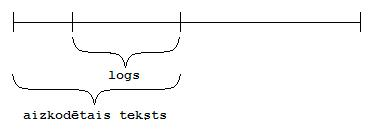
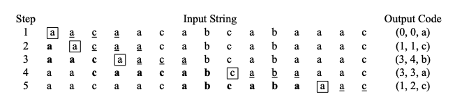

# 3. Bezzudumu saspiešana: Lempela-Ziva algoritmi

A.Lempels (*Abraham Lempel*), J.Zivs (*Jacob Ziv*) un T.Velčs (*Terry Welch*) izveidoja dažus radniecīgus saspiešanas algoritmus, kas izmanto adaptīvu vārdnīcu, kurā glabājas biežāk atkārtojamās apakšvirknes. Šos sauc par Lempela-Ziva algoritmiem. Tie ir [LZ77 un LZ78](https://en.wikipedia.org/wiki/LZ77_and_LZ78), [Lempel–Ziv–Welch (LZW)](https://en.wikipedia.org/wiki/Lempel%E2%80%93Ziv%E2%80%93Welch), [LZMA](https://en.wikipedia.org/wiki/Lempel%E2%80%93Ziv%E2%80%93Markov_chain_algorithm) un daži citi.

Kursā aplūkosim LZ77 un LZW (kas ir uzlabots LZ78 variants). Saspiešana ar vārdnīcu (LZ77 vai LZW) var sasniegt lielāku saspiešanas attiecību nekā entropijas kodi (Hafmana vai aritmētiskais), jo izmanto to, ka ievades datos nākošie simboli ir atkarīgi no iepriekšējiem.

## Markova ķēdes

Entropijas kodu ievadei bija teorētisks modelis - neatkarīgi vienādi sadalīti gadījuma lielumi. Ir vienkāršs matemātisks modelis -- Markova ķēde (*Markov chain*), kurā ziņojumu (burtu vai vārdu) virknīte ir nejauša, tomēr ziņojumu varbūtības ir atkarīgas no konteksta -- tie vairs nav savstarpēji neatkarīgi. Markova procesos

**Definīcija:** Par *Markova ķēdi* (*Markov chain*) diskrētā laikā ar galīgu stāvokļu alfabētu sauc varbūtisku procesu, kurš pārvietojas galīgā stāvokļu/ziņojumu kopā $S = \lbrace x_1, x_2, \ldots, x_n \rbrace$ un uzvedas sekojoši:

* Pašā sākumā tas nostājas vienā no stāvokļiem atbilstoši noteiktam sākuma sadalījumam; tā ir pirmā Markova ķēdes izvade.
* Katrā laika solī Markova ķēdes izvade ir šobrīd sasniegtais stāvoklis.
* Pāreja no viena stāvokļa uz citu ir izsakāma ar varbūtību (no dotā stāvokļa visu izejošo varbūtību summa ir $1$). Šo varbūtību nosaka tikai pašreizējais stāvoklis.

Markova ķēdē stāvokļi nav neatkarīgi un var nebūt identiski sadalīti (*independent and identically distributed*). Markova ķēdei nav atmiņas -- visa uzkrātā informācija ir ietverta tekošajā stāvoklī.

**Piemērs:** Šāds orientēts grafs ar $3$ stāvokļiem apraksta Markova ķēdi:

$18$ burtu virknīte iegūta nejauši staigājot pa šo grafu, sākot ar $A$: `ABCABCBCAAABCABBAB`.

## Lempela-Ziva algoritmi

### LZ77 algoritms

Algoritms izmanto logu (*view*) -- buferi ar fiksētu garumu (piemēram, 32 KiB jeb 32768 baiti). Tuvu loga beigām atrodas kursors, kas rāda uz kādu burtu.

* Pirms kursora ir atpakaļskata buferis (gandrīz viss 32 KiB logs)
* Pēc kursora ir priekšskata buferis -- piemēram, $32$ baiti. (Izvēlēties garāku priekšskata buferi apgrūtina prefiksu meklēšanu; bet $32$ burtu virknītes ir tādas, ko varam cerēt atrast iepriekšējos datos.)

$\textsf{LZ77Encode}(\textit{input})$
1. $\quad \textit{input}$ burtus ielādē logā.
2. $\quad$ **while** (kursors nav sasniedzis $\textit{input}$ beigas) **do**
3. $\quad\quad$ Atrod $p$ -- garāko ievades gabalu jau iekodētajā daļā
4. $\quad\quad i$ ir $p$ relatīvā pozīcija pret kursoru
5. $\quad\quad j = |p|$
6. $\quad\quad X$ ir pirmais simbols, kas ir logā pēc $p$
7. $\quad\quad \textsf{output}(i, j, X)$
8. $\quad\quad$ Pabīda logu uz priekšu par $j+1$ simboliem.

Šajā gadījumā vārdnīca ir gabals no jau iekodētās virknes. Iekodētājs redz beigu gabalu no iekodētās virknes kā slīdošo logu:

Logs ir kā atmiņas buferis, kurā var atrast nesen iekodētas virknes un izmantot tās, lai īsāk pierakstītu to virknes gabaliņu, kurš sekos.

**Piemērs:**

**Piemērs:** Aizkodēt virkni `abcabcabcdabc`, ja loga garums $k = 6$.

Vajadzētu sanākt `(1,a),(1,b),(1,c),(0,1,6),(1,d),(0,3,3)`.

Dažas LZ77 izmaiņas, ko lieto "gzip".

**Divi izvades formāti:** Algoritms vai nu cenšas atrast prefiksu vismaz garumā trīs (un tad to izvada kā LZ77 trijnieku), vai arī izvada burtus pa vienam. (Izmanto vienu papildus bitu, lai atšķirtu abus izvades formātus). Šāda izmaiņa ļauj ietaupīt daudz vietas tādiem failiem, kurus nevar labi saspiest, jo tad nav jāizvada pilnvērtīgs trijnieks (ar pozīcijas un garuma laukiem).

**Hafmana kodi:** `gzip` izmanto atsevišķi uzbūvētus Hafmana kokus, lai kodētu nobīdes, garumu un simbolu.

**Nerijīgais variants:** LZ77 algoritms ir rijīgs -- tas vienmēr mēģina atrast garāko prefiksu, sākot ar priekšskata bufera pirmo simbolu. (Neatkarīgi no tā, kā tas iespaidos tālākos prefiksus.) Dažreiz ir izdevīgi izvadīt vienu simbolu pašreizējā pozīcijā, cerot atrast garāku prefiksu vēlāk.

**Heštabulas ar prefiksiem:** `gzip` būvē heštabulu, kurā salikti visi sastaptie stringi garumā 3 kā atslēgas. (Ja tiem ir vairāki turpinājumi, tos saliek heštabulas spainītī atpakaļejošā secībā). Ja ir vairāki prefiksi, tad LZ77 ir izdevīgāk izvēlēties pašu nesenāko (ar vismazāko nobīdi jeb *offset*), jo tas rada visnevienmērīgāko sadalījumu, ko labi saspiest ar Hafmana kodu.

### LZ78 algoritms

**LZ78 saspiešanas algoritms**

**Ievade:** $F$ -- plūsma simbolu nolasīšanai.
**Izvade:** Simboli un cipari (adreses vārdnīcā).

$\textsf{LZ78encode}(F)$:
1. $\quad D = \textsf{Dictionary}(S) \quad\quad \textcolor{teal}{\textit{saliek vārdnīcā visus burtus}}$
2. $\quad w = \varepsilon \quad\quad\quad\quad\quad\quad \textcolor{teal}{\textit{tukšais strings}}$
3. $\quad k = \textsf{readSymbol}(F)$
4. $\quad$ **while** $k \neq \textsf{eof}$
5. $\quad\quad$ **if** $wk \in D.\textsf{keys}()$:
6. $\quad\quad\quad w = wk$
7. $\quad\quad$ **else:**
8. $\quad\quad\quad \textsf{output}(D[w])$
9. $\quad\quad\quad \textsf{insert}(D,w) \quad\quad \textcolor{teal}{\textit{pievieno vārdnīcai ar jaunu kārtas numuru}}$
10. $\quad\quad\quad w=k$
11. $\quad\quad\quad k = \textsf{readSymbol}(F)$
12. $\quad\quad\quad \textsf{output}(D[w])$

**LZ78 atspiešanas algoritms**

**Ievade:** $F$ -- saspiesto datu plūsma
**Izvade:** Atspiestais teksts

$\textsf{LZ78decode}(F)$:
1. $\quad w = \textsf{lookup}(\textsf{readCode}())$
2. $\quad \textsf{output}(w)$
3. $\quad c = \textsf{readCode}()$
4. $\quad$ **while** $c \neq \textsf{eof}$:
5. $\quad\quad$ **if** $c \in D$: $\quad\quad \textcolor{teal}{\textit{if c is in the dictionary}}$
6. $\quad\quad\quad wn = \textsf{lookup}(c)$
7. $\quad\quad$ **else**:
8. $\quad\quad\quad wn = \textsf{stringcat}(w, w[0])$
9. $\quad\quad\quad \textsf{output}(wn)$
10. $\quad\quad\quad k = wn[0]$
11. $\quad\quad\quad D.\textsf{add}(wk) \quad\quad \textcolor{teal}{\textit{add wk to dictionary}}$
12. $\quad\quad\quad w = wn$

**Piemērs:** Dota virkne `abcabcabcdabcaba`, kura jānokodē, izmantojot LZ78 algoritmu.

| Solis | Garākais w vārdnīcā | k | Izvade | Pievieno vārdnīcai |
| --- | --- | --- | --- | --- |
| 1. | a | b | a | ab |
| 2. | b | c | b | bc |
| 3. | c | a | c | ca |
| 4. | ab | c | ab | abc |
| 5. | ca | b | ca | cab |
| 6. | bc | d | bc | dbc |
| 7. | d | a | d | da |
| 8. | abc | a | abc | abca |
| 9. | ab | a | ab | aba |
| 10. |  |  | a |  |

Parasti kodē burtus par burtiem, bet garākas virknes aizstāj ar tā soļa numuru, kurā šī virkne ir ievietota vārdnīcā. Tas nozīmē, ka 1. piemērā virkne `ab` tiktu kodēta kā 1, `bc` kā 2, `ca` kā 3, utt. Beigās iegūta virkne `a,b,c,1,3,2,d,4,1,a`

**2. piemērs:** Izmantot LZ78, lai atkodētu virknīti: `A.B.C.1.3.2.D.4.1.A`

Ja atkodēšana veikta pareizi, vajadzētu sanākt `A.B.C.AB.CA.BC.D.ABC.AB.A`.

**3. piemērs:** Atkodēt `a,a,b,1,2,4,2` par `aabaaabaaaab`

**4. piemērs:** Atkodēt `a,b,a,3,4` par `abaaaaaa`

### LZW algoritms

**Saspiešanas algoritms:** Ievade: $F$ -- plūsma (sākotnējais teksts). Izvade: saarhivēts teksts.

$\textsf{LZWencode}(F)$
1. $\quad C = \textsf{ReadSymbol}(F)$
2. $\quad$ **while** $C \neq \textsf{eof}$
3. $\quad\quad x = \textsf{ReadSymbol}(F)$
4. $\quad\quad C' = \textsf{getIndex}$
5. $\quad\quad$ **while** $C' \neq -1$:
6. $\quad\quad\quad C = C'$
7. $\quad\quad\quad C' = \textsf{getIndex}(C,x)$
8. $\quad\quad \textsf{output}(C)$
9. $\quad\quad \textsf{addDict}(C,x)$
10. $\quad\quad C = x$

**Atspiešanas algoritms:** Ievade: $F$ -- plūsma (saspiests teksts). Izvade: atarhivēts teksts.

$\textsf{LZWdecode}(F)$
1. $\quad C = \textsf{readIndex}(F)$
2. $\quad W = \textsf{getString}(C)$
3. $\quad \textsf{output}(W)$
4. $\quad$ **while** $C \neq \textsf{eof}$:
5. $\quad\quad C' = \textsf{readIndex}(F)$
6. $\quad\quad$ **if** $\textsf{indexInDict}(C')$:
7. $\quad\quad\quad W = \textsf{getString}(C')$
8. $\quad\quad\quad \textsf{addDict}(C,W[0])$
9. $\quad\quad$ **else**:
10. $\quad\quad\quad C' = \textsf{addDict}(C, W[0])$
11. $\quad\quad\quad W = \textsf{getString}(C')$
12. $\quad\quad \textsf{output}(W)$
13. $\quad\quad C = C'$

### Saistība ar entropiju

**Definīcija:** Aplūkojam $X_1 X_2 X_3\ldots$ - ziņojumu virkni, kas ģenerēta ar varbūtisku procesu (neatkarīgi gadījumlielumi, Markova ķēde, slēpta Markova ķēde, neironu tīkls u.c.). Par par šīs virknes *vidējo entropiju* (*entropy rate*) sauc robežu:

$$
H(X) = \lim_{n \to \infty} \frac{1}{n} H\left( X_1, X_2, \ldots X_n \right).
$$

Šajā formulā $H\left( X_1, X_2, \ldots X_n \right)$ apzīmē entropiju saliktam ziņojumam, kurā $X_1,X_2,\ldots,X_n$ seko pēc kārtas.

Otrs veids ir rēķināt entropiju, izejot no izrēķināta no nosacītajām varbūtībām (t.i. pieņemam, ka pirmos $n-1$ stāvokļus jau esam redzējuši, atrodam kārtējā $n$-tā simbola nosacīto varbūtību sadalījumu un tā entropiju):

$$
H'(X) = \lim_{n \to \infty} H\left( X_n \,\mid\, X_{n-1}, X_{n-2}, \ldots X_1 \right).
$$

Visās mūsu kursa situācijās abi vidējās entropijas jēdzieni sakrīt $H(X) = H'(X)$.

Varbūtiski procesi var apmierināt šādas īpašības:

**Ergodiski procesi:** Ziņojumu ģenerēšanas process ir ergodisks, ja darbinot vairākus identiskus procesus, iegūstam tādu pašu varbūtisko sadalījumu kā darbinot to pašu procesu ilgu laiku (*ensemble average* sakrīt ar *time average*).

**Piemēri:** Markova ķēdes, ja no katra stāvokļa var nonākt katrā citā, ir ergodiskas; rodas stabils stā Bet ir Iespējamas jocīgas Markova ķēdes, kurās process var aiziet pa vienu vai otru zaru un veidot divus pilnīgi dažādus sadalījumus.

**Stacionāri procesi:** Process ir *stacionārs*, ja tā vidējā vērtība, dispersija un citas statistiskās īpašības nemainās, pabīdot novērojumu par laiku $T$ uz priekšu. Piemēram, $E(X_i) = E(X_{i + T})$. Var gadīties, ka varbūtisks process sākumā ģenerē ziņojumus atbilstoši kādam citam sadalījumam, bet kļūst *asimptotiski stacionārs*.

**Piemēri:** Markova ķēdes var veidot periodiskas virknes. Periodiskas virknes (ar periodu $T>1$) nevar būt stacionāras -- visi varbūtību sadalījumi atkarīgi no tā, kurā perioda fāzē mēs esam.

**Teorēma:** Ja $X$ ir bināru ziņojumu avots (alfabēts ir $\lbrace 0,1 \rbrace$), kas ir stacionārs un ergodisks, tad

$$
\limsup_n \frac{1}{n} \ell_{\text{LZW}}(X_{1:n}) \leq H(X).
$$

Šī nevienādība izpildās ar varbūtību $1$. Šeit $H(X)$ apzīmē ziņojumu avota vidējo entropiju. Un $\ell_{\text{LZW}}(X_{1:n})$ ir garums, kas rodas, saspiežot pirmos $n$ bitus no ziņojumu avota.

Līdzīga teorēma ir spēkā arī LZ77 saspiešanai. Praksē to ne vienmēr var izmantot, jo LZW vārdnīcas un LZ77 atpakaļskata loga izmērs nav neierobežots.

## LZ77 un LZW lietojumi

**Par LZ77 algoritmu:** LZ77 (publicēts 1977.gadā) izmanto pašu tekstu kā vārdnīcu; slīdošo logu un atpakaļejošās references. Saspiešanas formāti kā DEFLATE, ko izmanto ZIP un gzip failos un PNG attēlos.

**Par LZW algoritmu:** LZW (publicēts 1984.gadā) ievieš dinamisku vārdnīcas veidošanu, neprasot iepriekšdefinētu simbolu tabulu (ir adaptīva saspiešanas metode). Tas ir uzlabojums, salīdzinot ar līdzīgu un nedaudz agrāku metodi LZ78 (Lempela-Ziva 1978.gada algoritms). Sastopams GIF attēlu saspiešanas formātā un UNIX "compress" lietojumprogrammā.

* LZ77 bieži panāk labāku saspiešanas attiecību nekā LZW (sākotnējo baitu skaita attiecība pret saspiestajiem baitiem). Eksistē izņēmumi - teksti, kuri ir piemērotākie tieši LZW (saspiešana "ar vārdnīcu").
* LZW ātrdarbība mēdz būt labāka, jo ar vārdnīcu (heštabulu) var strādāt efektīvāk nekā pārskatīt visu tekstu.
* LZ77 ļauj kontrolēt izmantoto atmiņu - ierobežojot bufera izmēru. LZW algoritmam var vajadzēt daudz atmiņas, ja saspiežamie bloki ir gari.
* GIF un PNG abi ir bezzudumu saspiešanas formāti. GIF (LZW algoritms) piemērots primitīvākiem attēliem, kuros daudz vienkrāsainu laukumu. GIF krāsu palete satur 256 krāsas (nevis pilnu $256^3$ RGB paleti). GIF saspiešana/atspiešana parasti notiek ātrāk; savukārt PNG panāk labāku saspiešanas attiecību sarežģītiem attēliem.
* SVG ir XMLisks vektorgrafikas formāts, bet šādu attēlu apmaiņai un iekļaušanai citos dokumentos bieži izmanto LZ77 un Hafmana saspiešanas algoritmus (gzip jeb DEFLATE).
* LZ77 uzvedas robustāk gadījumos, ja datus izdodas nosūtīt tikai daļēji; tas arī nodrošina vienkāršāku un ātrāku atspiešanu. Savukārt LZW labi darbojas tad, ja arhīvs nosūtīts pilnībā (var atjaunot pilnu vārdnīcu); tas toties nodrošina labāku saspiešanas attiecību.

### Arhīvi un DLP produkti

DLP (Data Leak Prevention) rīki var novērst konfidenciālu datu nekontrolētu noplūdi uzņēmumā, piemēram, ja darbinieks pārsūta jūtīgus failus vai teksta fragmentus nepiemērotam adresātam.

* Datu *klasifikatori* (*classifiers*) nosaka konfidenciālu datu tipus. Adreses, telefonu numuri, epasti, personas kodi, IBAN kontu numuri, kredītkaršu numuri tiek aizsargāti pateicoties īpašam formātam, atbilstībai regulārai izteiksmei (vai kredītkaršu numuru gadījumā - *Luhn check* kontrolsummai). Lai samazinātu viltus pozitīvos rezultātus, var arī apstaigāt lokālas datubāzes, izveidot no tām klasifikatorus (piemēram, aizsargāt tikai pazīstamu klientu kredītkartes). Datu klasifikatori var būt arī burtiski citēti gabali no aizsargātiem dokumentiem vai iegūstami ar mašīnmācīšanos.
* Datu *kanāli* (*channels*) ir novērojamas datu plūsmas. Piemēram, HTTP augšupielādes, izejošie epasti, "clipboard" jeb kopēšanas darbības, ekrānuzņēmumi.
* Aizsardzības politikas (*policies*) nosaka, ko pa kuru kanālu kuriem adresātiem drīkst vai nedrīkst sūtīt. Politikai (bez kanāla un klasifikatora) ir arī darbība -- piemēram "Monitor" un "Block" (neļauj sūtīt).

Daži populāri DLP produkti:

* [Symantec DLP risinājumi](https://www.symantec.com/products/dlp)
* [Forcepoint DLP risinājumi](https://www.forcepoint.com/product/dlp-data-loss-prevention)
* [Digital Guardian DLP aģents](https://digitalguardian.com/products/endpoint-dlp)

Arhīvu atspiešana, saspiešana (reizēm arī TLS atšifrēšana/aizšifrēšana) ir laikietilpīga. DLP notiek kanālos, kuri ir jūtīgi pret novēlošanos (Web, Email); ir failu izmēru limiti.

* Kas notiek, ja atarhivējot failu, rodas ļoti daudz failu?
* Kas notiek, ja atarhivējot failu, rodas ļoti garš fails?
* Vai saspiešanas algoritms ļauj sākt arhivēt un sūtīt prom datus pirms saņemts viss nosūtāmais fails vai faili? Starpniekserveris (*proxy server*) nevar analizēt lietotāju Web transakcijas ilgāk kā aptuveni 10 sekundes, jo pārlūkprogrammu lietotāji nav pieraduši ilgi gaidīt.
* Kas notiek, ja datus sāk sūtīt adresātam un pēkšņi pamana privātu datu noplūdi? Vai uzbrucējs arhīvu var saprast arī tad, ja saņemta daļa no tā?

Iespējamie risinājumi:

* DLP analīzi censties biežāk veikt lokāli uz lietotāja datora (*endpoint* jeb *agent* programmatūra, kas var veltīt vairāk CPU resursu konkrētā lietotāja failu analīzei).
* Konfigurēt DLP produktus novērošanas (*monitoring*) režīmā - tad ir vairāk laika analīzei, jo transakcijas var uzreiz atļaut neatkarīgi no to satura.
* Dažus grūti analizējamus failus (dīvaini saspiestus, ar parolēm aizsargātus biroja programmu dokumentus, šifrētus datus) var nelaist cauri vārtejām, piespiest lietotājus sūtīt DLP rīkam saprotami vai šifrēt tikai uz organizācijas drošības perimetra.

## Bibliogrāfija

* [LZW algoritma piemērs](http://web.mit.edu/6.02/www/f2010/handouts/recitations/Recitation21VergheseFall2010.pdf).
* Praktiski LZW algoritma apsvērumi: [What if dictionary is full](https://stackoverflow.com/questions/40054218/what-if-dictionary-size-in-lzw-algorithm-is-full).
* [LZ78 sliktākā gadījuma teorija](http://www-math.mit.edu/~shor/PAM/lempel_ziv_notes.pdf).
* [PPM algoritms](https://en.wikipedia.org/wiki/Prediction_by_partial_matching).
* [https://stackabuse.com/python-zlib-library-tutorial/](https://stackabuse.com/python-zlib-library-tutorial/)
* [Python zlib tutorial](https://stackabuse.com/python-zlib-library-tutorial/)
* IBM patenti algoritmiem LZ78 un LZW iesniegti 1981 un 1983.g. (sk. [LZW Patents](https://en.wikipedia.org/wiki/Lempel%E2%80%93Ziv%E2%80%93Welch#Patents))
* [https://linuxhint.com/install-7zip-compression-tool-on-ubuntu/](https://linuxhint.com/install-7zip-compression-tool-on-ubuntu/).
* [Kalgari korpuss](http://corpus.canterbury.ac.nz/descriptions/#calgary) - dažādi failu tipi (ieskaitot melnbaltus attēlus, faksus, veclaicīgu mašīnkodu); [dažu algoritmu salīdzinājums](https://en.wikipedia.org/wiki/Calgary_corpus#Benchmarks). Kalgari korpusu arvien lieto metožu salīdzināšanai un pat saspiešanas sacensībām.
* [Kenterberijas korpuss](http://corpus.canterbury.ac.nz/) - mūsdienīgāks korpuss.
