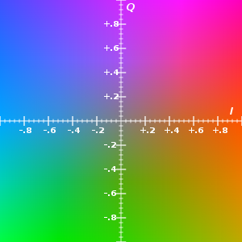

1. Zudumradošā saspiešana: JPEG formāts
==========================================

Apskatām sekojošas sadaļas: 

* Krāsu pārveidojumi
* Diskrētā kosinusu transformācija
* Nobeiguma soļi

Krāsas un kvantizācija (1.-3.solis)
-------------------------------------

Piemērs: melnbalti attēli.

* Attēlā skaitlis :math:`0-255` apzīmē krāsu (no melnas līdz baltai).
* Visus :math:`256` toņus acs neatšķir, tāpēc var attēlot :math:`256` krāsas uz mazāku skaitu.
* Vienkāršākais attēlojums, piemēram
  :math:`f(x) = \left\lfloor\frac{x}{4} \right\rfloor`. 
  Tad :math:`f\,:\,\{0,\ldots,255\} \rightarrow \{0,\ldots,63\}`.
* Praksē lieto sarežģītāku funkciju, kas kopā sagrupē krāsas, kuras acs sliktāk atšķir.

**Vektoru kvantizācija (melnbalti attēli)**

* Krāsainu punktu nosaka :math:`3` vērtības (:math:`\text{Red}, \text{Green}, \text{Blue}`). 
  Telpa :math:`\{ 0,\ldots,255\}^3`.
* :math:`f(x_1, x_2, x_3 ) = (y_1,y_2,y_3)`, tā, lai dažādi trijnieki 
  :math:`(x_1, x_2, x_3)`, kas attēlojas par vienu :math:`(y_1,y_2,y_3)`, būtu grūti atšķirami.

Atkārtojums -- matricas reizināšana ar vektoru ir lineārs pārveidojums jeb funkcija:
:math:`\mathbf{R}^n \rightarrow \mathbf{R}^n`. To pieraksta šādi:

.. math::

   \left( \begin{array}{c} x'_1 \\ x'_2 \\ \cdots \\ x'_n \end{array} \right)
   \approx
   \left( \begin{array}{cccc}
   a_{11} &  a_{12} & \cdots & a_{1n} \\
   a_{21} & a_{22} & \cdots & a_{2n} \\
   \vdots & \vdots & \vdots & \vdots \\
   a_{n1} & a_{n2} & \cdots & a_{nn} 
   \end{array} \right)
   \left( \begin{array}{c} x_1 \\ x_2 \\ \cdots \\ x_n \end{array} \right)

JPEG algoritma apraksts
------------------------------

JPEG ir algoritms attēlu saspiešanai un arī formāts attēlu glabāšanai.
Tā mērķis ir iegūt saspiestu failu, no kura var atjaunot attēlu, 
kas ir līdzīgs sākotnējam. Saspiešana notiek ar zudumiem.
Algoritma soļi ir saistīti ar to, kā cilvēks uztver krāsu.

* Ievade:  punktu attēls, katra punkta krāsu apraksta 
  trīs :math:`8` bitu skaitļi (robežās no :math:`0` līdz :math:`255`) -- 
  R, G, B (red, green, blue). 
* Izvade: bitu virkne. 

Pārveido krāsu telpu no RGB par YIQ
~~~~~~~~~~~~~~~~~~~~~~~~~~~~~~~~~~~~~~~~~~~~~~~~~~~

Y,I,Q vērtības iegūst no R,G,B vērtībām, pareizinot tās ar koeficientu matricu. 
Šis pārveidojums ir atgriezenisks (bezzudumu), t.i., zinot YIQ 
vērtības, var atjaunot RGB vērtības.

+-------------------------------------+-------------------------------------+
| .. image:: figs/kuldiga.png         | .. image:: figs/kuldiga1.png        |
|    :width: 100%                     |    :width: 100%                     |
+-------------------------------------+-------------------------------------+
| .. image:: figs/kuldiga2.png        | .. image:: figs/kuldiga3.png        |
|    :width: 100%                     |    :width: 100%                     |
+-------------------------------------+-------------------------------------+

**Kas ir YIQ?**

   IQ plakne, ja :math:`Y=0.5`

* "Y" - Luma informācija (melnbaltās televīzijas attēliem)
* "I" - *in-phase*, "Q" - *quadrature* (NTSC - analogās krāsu televīzijas žargons)

Redze precīzāk uztver "I" (pāreju no oranžā uz zilo) nevis
"Q" (pāreju no zaļā uz violeto) - tāpēc Q var vairāk saspiest.

**JPEG 1.solis: Pārveidojums no RGB uz YIQ**
  Šeit :math:`R,G,B` ir veseli skaitļi no intervāla :math:`[0;255]`. 
  
  * Vispirms intervālu :math:`[0;255]` vienmērīgi saspiež līdz :math:`[0;1]`, 
    izdalot visus skaitļus ar :math:`255`. 
  * Pēc tam reizina ar lineāra pārveidojuma matricu:  

    .. math::

       \left( \begin{array}{c} 
       Y \\ 
       I \\ 
       Q 
       \end{array} \right)
       \approx
       \left( \begin{array}{ccc}
       0.299 &  0.587 &  0.114 \\
       0.5959 & -0.2746 & -0.3213 \\
       0.2115 & -0.5227 &  0.3112
       \end{array} \right)
       \left( \begin{array}{c} 
       R \\ 
       G \\ 
       B 
       \end{array} \right)

  * Visbeidzot panāk, ka jaunizveidotie parametri: :math:`Y \in [0;1]`, 
    :math:`I \in [-0.5957; 0.5957]`, un :math:`Q \in [-0.5226; 0.5226]`. 
    Lai tas notiktu, pēc lineārā pārveidojuma veic vēl 
    vērtību apgriešanu pret gada maksimālo vai vidējo ar šādām formulām: 

    .. math:: 

      \left\{ \begin{array}{l}
      Y' := Y, \\
      I' := \max(\min(I, 0.5957), -0.5957), \\
      Q' := \max(\min(q, 0.5226), -0.5226). \\
      \end{array} \right.

Šis pārveidojums saglabā informāciju, jo var 
pārveidot atpakaļ uz RGB: 

.. math::

  \left( \begin{array}{c} 
  R \\ 
  G \\ 
  B 
  \end{array} \right)
  \approx
  \left( \begin{array}{ccc}
  1 &  0.956 &  0.619 \\
  1 & -0.272 & -0.647 \\
  1 & -1.106 &  1.703
  \end{array} \right)
  \left( \begin{array}{c} 
  Y \\ 
  I \\ 
  Q \end{array} \right)

Izretina režģi un sagriež blokos
~~~~~~~~~~~~~~~~~~~~~~~~~~~~~~~~~~~~~~~~~~~~~~~~~~~~~~~

.. figure:: figs/sparser-grid.png
   :width: 1.5in

   Režģa izretināšana (*Skipping grid*)

**JPEG 2.solis: 4:2:0 subsampling:** 
  Patur visas "Y" vērtības (melnbalto/gaišuma komponenti) - *full luminiscence*, 
  bet "I" un "Q" vērtībām izrēķina aritmētisko vidējo katrā :math:`2 \times 2`
  kvadrātiņā -- *half chrominance*. 
  Tāpēc krāsu datiem informācijas apjoms samazinās :math:`4` reizes. 
  Redze pārmaiņas gaišumā uztver daudz labāk nekā pārmaiņas nokrāsā.

**JPEG 3.solis: Sadalīšana blokos**
  YIQ vērtības sadala :math:`8 \times 8` blokos. Tā kā tika atstāta tikai katra 
  otrā "I" un "Q" vērtība, tad šo bloku izmērs sākotnējā attēlā ir 
  :math:`16 \times 16`. Katru bloku turpmāk apstrādā atsevišķi.
  
  No :math:`16 \times 16` pikseļu kvadrātiņa rodas četri "Y" (melnbaltie) bloki, 
  viens "I" bloks un viens "Q" bloks. 

Diskrētā Kosinusu transformācija
~~~~~~~~~~~~~~~~~~~~~~~~~~~~~~~~~~~~~~~~~~~~

**4.solis: DCT-II** 
  Katram :math:`8 \times 8` blokam lieto otrā tipa DCT gan horizontāli, gan vertikāli.

  .. math::

     \begin{array}{ll}
     x'_0 = \frac{1}{\sqrt{8}} \sum\limits_{k=0}^7 x_k \\
     x'_j = \frac{2}{\sqrt{8}} \sum\limits_{k=0}^7 \cos \frac{j(2k+1)\pi}{8}x_k,\;\;\mbox{ja $1 \leq j \leq 7$}\\
     \end{array}

  Vispirms diskrēto kosinusu transformāciju pielieto katrai matricas kolonnai,
  pēc tam to pašu izdara katrai iegūtās matricas rindai.

  .. code-block:: python 

    import numpy as np
    from scipy.fftpack import dct, idct

    def dct2(arr):
        return dct(dct(arr.T, norm='ortho').T, norm='ortho')

    def idct2(arr):
        return idct(idct(arr.T, norm='ortho').T, norm='ortho')

    # Create an 8x8 matrix with random values between 0 and 1
    matrix = np.random.rand(8, 8)
    print(matrix)
    dct_coefficients = dct2(matrix)
    print(dct_coefficients)
    inverse_dct = idct2(dct_coefficients)
    print(inverse_dct)

**JPEG 5.solis**
  Elementu :math:`x''_{ij}` noapaļojam līdz precizitātei :math:`a_{ij}` (dala 
  ar :math:`a_{ij}` un apaļo uz leju ar :math:`\lfloor x \rfloor`). 
  Elementu atšķirības, kas ir mazākas par :math:`a_{ij}` ir nebūtiskas. 
  Galvenā viltība ir tā, ka skaitļi  atšķiras dažādiem matricas elementiem. 
  Tās komponentes, kuras acs uztver vājāk, tiek noapaļotas ar 
  zemāku precizitāti. Mazākā vērtība :math:`a_{13} = 10`, lielākā -- :math:`a_{65} = 121`.

**JPEG 6.solis**
  * Visu :math:`8 \times 8` matricu kreisos augšējos elementus saliek 
    kopīgā virknē. Šādi tiks iegūtas trīs virknes -- 
    katrai no trim krāsu telpas YIQ komponentēm. 
  * Kodē nevis pašas noapaļotās frekvences, bet to starpības 
    :math:`a_1, a_2-a_1, a_3 - a_2,\ldots`.

**JPEG 7.solis**
  Iegūtajai starpību virknei lieto Hafmana vai aritmētisko kodēšanu.

Diskrēto kosinusu transformācijas
----------------------------------

Nasirs Ahmeds 1972.gadā piedāvāja šo algoritmu signālu saspiešanai:

.. math::

  y_k = \alpha_k \sum_{n=0}^{N-1} x_n \cos \left[ \frac{\pi (2n + 1) k}{2N} \right]

kur :math:`k \in \{ 0, \ldots, N-1 \}` un normalizācijas reizinātājs 
ir :math:`\alpha_k`, kur 

.. math::

  \alpha_k = \begin{cases}
  \sqrt{\frac{1}{N}} & \text{if } k = 0 \\
  \sqrt{\frac{2}{N}} & \text{if } k \neq 0
  \end{cases}

Divu dimensiju gadījums parādījās drīz pēc tam un ir dabisks vispārinājums. 
To var pierakstīt matricu formā šādi: 

Katrai :math:`8 \times 8` krāsu intensitāšu matricai (*spatial domain*)
izveidojam matricu :math:`A`.  
DCT transformācijas rezultāts ir tāda paša izmēra matrica :math:`B` (*frequence domain*), ko 
var iegūt šādi: 

.. math:: 

  B = C A C^T,

kur :math:`C` ir :math:`8 \times 8` koeficientu matrica, ko definē šādi: 

.. math:: 

  C_{k, n} = \alpha_k \cos\left(\frac{(2n + 1)k\pi}{16}\right),

kur :math:`k, n = 0, 1, \ldots, 7`, un normalizācijas reizinātāji :math:`\alpha_k` ir šādi:

.. math::

  \alpha_k = \begin{cases}
  \sqrt{\frac{1}{8}} & \text{if } k = 0 \\
  \sqrt{\frac{2}{8}} & \text{if } k \neq 0
  \end{cases}

Vienu elementu :math:`B_{u,v}` matricā :math:`B` var pierakstīt šādi:

.. math:: 
  
  B_{u, v} = \sum_{x=0}^{7} \sum_{y=0}^{7} A_{x, y} \cos\left(\frac{(2x + 1)u\pi}{16}\right) \cos\left(\frac{(2y + 1)v\pi}{16}\right) \alpha_u \alpha_v

kur :math:`u, v, x, y \in \{0, 1, ..., 7\}`.

AVIF attēlu formāts
---------------------

* Izņemot JPEG, ir populārs Google izveidotais formāts WebP, kas labi saspiežams un 
  ir populārs pārlūkprogrammās. 
* HEIF/HEIC (High Efficiency Image Format) ir radniecīgs video kodekam H.265; 
  to veicina Apple. 
* AVIF ir radniecīgs pazīstamajam atvērtajam video kodekam AV1. 
* JPEG XL ir vēl visai jauns formāts (nav sevišķi plaši atbalstīts), bet ar 
  vairākām jaunām iespējām, labu saspiešanu dažādos robežgadījumos un 
  arī pilnu savietojamību ar JPEG. 

AVIF idejas mazliet apskatām šajā kursā. 

Python piemērs
~~~~~~~~~~~~~~~~

.. code-block:: bash 

  pip install pillow imageio pillow-avif-plugin

.. code-block:: python 

  from PIL import Image, ImageDraw
  import imageio

  # Create a white square image
  image_size = 256
  white_image = Image.new("RGB", (image_size, image_size), "white")

  # Draw a red circle in the middle
  draw = ImageDraw.Draw(white_image)
  circle_radius = 50
  circle_center = (image_size // 2, image_size // 2)
  draw.ellipse(
      [
          (circle_center[0] - circle_radius, circle_center[1] - circle_radius), 
          (circle_center[0] + circle_radius, circle_center[1] + circle_radius)
      ], 
      fill="red"
  )

  import pillow_avif
  white_image.save("output.avif", format="AVIF")
  print("Image saved as output.avif")

Kvantizācija citās jomās
-------------------------------

**Definīcija:**
  Dotai punktu kopai :math:`S` par *Voronoja diagrammu* (*Voronoi diagram*) sauc plaknes apgabala 
  punktu sadalījumu klasēs atkarībā no tā, kurš punkts no :math:`S` ir tuvākais. 
  
Voronoja diagrammas klašu skaits sakrīt ar kopas :math:`S` elementu skaitu. 
Voronoja diagramma sastāv no daudzstūrveida šūnām, kur katras šūnas iekšpusē ir :math:`S` punkts. 

.. figure:: figs/quantization-illustration.png
   :width: 3in

   Kvantizācijas piemērs

Proporcionālās vēlēšanu sistēmas
~~~~~~~~~~~~~~~~~~~~~~~~~~~~~~~~~~~

**Definīcija:** 
  Baricentriskās koordinātes 3 dimensijās piekārto katram punktam regulārā trijstūrī
  :math:`ABC` nenegatīvu skaitļu trijnieku :math:`(x,y,z)`, kas apmierina sakarību 
  :math:`x+y+z = 1`. 

  .. figure:: figs/surface-xyz.png
     :width: 3in

Baricentriskās koordinātes ļauj attēlot proporcijas 
starp trim pozitīviem (vai nenegatīviem) skaitļiem. 
(Ja atļauj arī negatīvas baricentriskās koordinātes, tad tās piekārto skaitļu 
trijnieku :math:`x + y + z = 1` katram plaknes punktam, bet tādas šajā kursā 
neizmantosim.)

**Donta (D'Hondt) sistēma**

  .. figure:: figs/hondt.png
     :width: 3in

     Donta (*D'Hondt*) metode 4 deputātu krēsliem un 3 partijām. 

**Senlaga (Sainte-Laguë) sistēma**

  .. figure:: figs/sainte-lague.png
     :width: 3in

     Senlaga (*Sainte-Laguë*) metode 5 deputātu krēsliem un 3 partijām

Uzdevumi
----------

**5.1. uzdevums:**
  Izmantojam krāsu saspiešanai kvantizācijas algoritmu, kas lieto tikai 
  pārlūkprogrammām draudzīgās krāsas: 
  `Browser-safe color palette <https://whatis.techtarget.com/definition/216-color-browser-safe-palette>`_

  * Pārlūkprogrammām draudzīgas ir tās krāsu koordinātes, kam abi hex cipariņi ir vienādi un dalās ar :math:`3` 
    (:math:`00,33,66,99,\text{CC},\text{FF}`). Ja krāsai visas 3 koordinātes ir draudzīgas, 
    tad arī pati krāsa ir draudzīga. Teiksim, `00FF99` ir draudzīga krāsa, bet `22BB99` nav, jo 
    "22" un "BB" koordinātes nav atļautas.
  * Katru attēlā esošo pikseli (katru no RGB koordinātēm) noapaļo līdz tuvākajai draudzīgajai
    no kopas (:math:`00,33,66,99,\text{CC},\text{FF}`), lai iegūtu pārlūkprogrammai draudzīgu krāsu. 

  Kāds ir saspiešanas koeficients šādam pārveidojumam (jaunais izmērs pret veco izmēru). 

Izmantotā literatūra
-----------------------

1. `The MP3 is dead, say creators after terminating licensing 
   <https://www.cnbc.com/2017/05/15/mp3-dead-say-creators-after-terminating-licensing.html>`_ -- 
   par audioformātu attīstību.
2. `Ungārijas 2018.g. vēlēšanas <https://en.wikipedia.org/wiki/2018_Hungarian_parliamentary_election>`_ -- 
   kā Donta metode palīdz noapaļot rezultātus par labu lielākajai partijai.
3. `The Theory Behind Mp3 <http://www.mp3-tech.org/programmer/docs/mp3_theory.pdf>`_ -- 
   galvenās idejas audiofailu saspiešanai. 