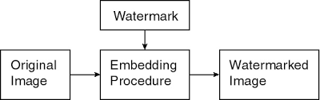

Video saspiešana
======================

Video satura saspiešanai nepieciešami divi kodeki -- audio un video. 
Daži kodeki ir pietiekami plaši sastopami kā standarti, 
ietver mūsdienīgas idejas (labu līdzsvaru starp saspiešanas ātrumu, faila izmēru un kvalitāti), 
ir atskaņojami Web pārlūkos un dažādās citās vidēs un arī rediģējami ar Open Source programmatūru. 

Mūsu kursā tie būs **AV1** video saturam un **Opus** audio saturam. 
Agrākajās desmitgadēs bija citi populāri standarti - H.264 (video) un MP3 (audio); 
jau tajos parādījās visas svarīgākās saspiešanas idejas un tie izplatījās pateicoties
Napster un BitTorrent failu apmaiņas kustībām. 

Filmas parasti atskaņo no viena konteinera faila, kurā 
audio un video plūsmas tiek *multipleksētas*. 
Tipiski konteineru standarti, kurus apskatīsim ir 
**MKV (Matroska)** atskaņošanai, piemēram, ar VLC. 
Un arī **WebM** -- atskaņošanai pārlūkprogrammās. 

Redzes sajūta, HVS modelis
------------------------------

*Human Visual System* (HVS) Model - attēlu un audio apstrādei izveidots 
vidējots cilvēka redzes modelis.

Redzes uztveri veido nūjiņas un konusiņi; modelis pieņem, 
ka nūjiņu izšķirtspēja ir divreiz labāka. Tāpēc melnbaltajai attēla komponentei
(gaismas intensitātei, neatkarīgi no krāsas) jādod precīzs attēls; 
krāsas toties drīkst būt ar zemāku izšķirtspēju. 

Krāsu televīzijas rītausmā bija teiciens: 
"Chrominance is at half resolution of luminance".

Mirgošanas frekvence
~~~~~~~~~~~~~~~~~~~~~~~ 

Mirgošana (*flicker*) ir efekts, ko rada kadru pārslēgšana. 
Filmu ieraksts: 24 kadri sekundē (un leģendas par 25.kadru). 
Lai mazinātu mirgošanas sajūtu, kadrus atkārto 
(parasti bez izmaiņām), lai mirgotu 48 vai 72 reizes sekundē.

Televīzijas ierakstos ir 25 vai 30 kadri sekundē; mirgošana mēdz 
būt divreiz biežāk (50 Hz vai 60 Hz), kas izmanto "interlacing" -- 
pārzīmē tikai daļu no pikseļu rindām. 
Katodstaru lampas mirgo
ar 50 Hz vai 60 Hz frekvenci (regulāri maina gaismas intensitāti); 
šādu mirgošanu cilvēks var pamanīt.

Konteineri un kodeki 
------------------------

Filma pie patērētāja nonāk kā fails vai kā straumējams video. 
Šie ir konteineru formāti, ko atbalsta YouTube:

* MP4 (daļa no MPEG-4 standarta); paplašinājums `*.mp4`
* AVI (Audio Video Interleaved/Microsoft); paplašinājums `*.avi`
* WMV (Windows Media Video priekš WM Player); paplašinājums `*.wmv`
* WebM (BSD licencēts konteiners/Google)
* MOV (QuickTime/Apple); paplašinājums `*.qt`
* FLV (Flash Video)
* 3GP (3G mobilo sakaru video)

Google piedāvā vienkāršus konteinerus 
**WebP** (attēliem) un **WebM** (filmām). 
Nopietnai videomateriāla pasniegšanai (daudzi kanāli, 
subtitri vairākās valodās, navigācija pa filmu utt.) ir piemērotāks 
**MKV** jeb Matrjoškas konteiners.

**WebP** 
  WebP nodrošina nedaudz labāku saspiešanu kā JPEG vai MPEG-4. 
  **WebP**, kam ir gan bezzudumu, gan zudumradošās saspiešanas funkcijas,
  panāk mazākus attēlu izmērus, salīdzinot attiecīgi ar PNG un JPEG (gan
  tipiskiem failiem Internetā, gan ļoti optimāli saspiestiem ar `pngcrush` u.c.)

**WebM** 
  Video formāts **WebM** ir draudzīgi licencēts, patīk Vikipēdijai. Lietojams
  ar pārlūkprogrammās iebūvēto HTML5 video atskaņotāju kā arī ar daudziem citiem. 

Kodeki
~~~~~~~~~

Codec (*coder-decoder*) ir konkrētais audio un video kanāla saspiešanas standarts. 
Katram konteineru formātam lietojami daži populāri kodeki:

* DivX, Xvid (AVI konteinerā)
* MPEG (MP4 konteinerā) izmanto dažādās aplikācijās un arī dzelžos. 
  Tas ilgstoši bijis industrijas standarts. 

Vairums CD/DVD atskaņotāju, telefoni, viedie TV un mediju 
atskaņotāji atbalsta Xvid kodeku. 
Tas būs ērts vairumam lietotāju. 
Xvid kodeks ir ātrāks par MPEG-1 un arī mazāk noslogo procesoru. 

Video saspiešana
~~~~~~~~~~~~~~~~~~~~~~

Video visvienkāršākajā izpratnē ir daudzu rastra attēlu secība. 
Pat iekodējot ar JPEG (katru attēlu atsevišķi) radīsies milzīgi 
lieli faili. 
Secīgi attēli stipri korelē (ja vien tieši attiecīgajā vietā 
netika samontēti divi gabali vai krasi mainīts kameras stāvoklis). 

**MPEG freimu tipi**
  MPEG piemērots gan statiski saspiestiem, gan straumētiem datiem; 
  katru attēlu iekodē vienā no šiem 3 veidiem:

  * I-frame (*intra-frame*) - bilde, kuru kodē kā pilnu attēlu.
  * P-frame (*predictive coded frame*) balstās uz iepriekšējo I-freimu vai P-freimu
  * B-frame (*bidirectionally predictive coded frame*) izmanto gan iepriekšējo, 
    gan nākamo freimu, kas var būt gan I-, gan P-freims.

**I-freimu kodēšana**
  Līdzīgi kā JPEG (8x8 bloki), arī MPEG kodē vienādus blokus: 16x16 pikseļi. 
  I-freimiem algoritms līdzīgs kā JPEG. I-freimi ir "pieturas punkti", uz kuriem būvē citus. 
  `YCbCr krāsu plakne <https://en.wikipedia.org/wiki/YCbCr>` - nav tas pats kas YIQ.

**P-freimu kodēšana**
  **Kustības vektors:** P-freima 16x16 pikseļu blokam meklē līdzīgāko iepriekšējā I-freimā vai 
  P-freimā. Dažreiz tas var būt nobīdīts - ja video attēlota kustība vai 
  kameras slīdēšana - *panning*. 

  .. figure:: figs/p-frame-encoding.png
     :width: 4in

**B-freimus atliek nosūtītajos datos**

  =================  ====  ====  ====  ====  ====  ====  ====  ====  ====  ====
  Playback order     0     1     2     3     4     5     6     7     8     9
  =================  ====  ====  ====  ====  ====  ====  ====  ====  ====  ====
  Frame type         I     B     B     P     B     B     P     B     B     I
  Data stream order  0     2     3     1     5     6     4     8     9     7
  =================  ====  ====  ====  ====  ====  ====  ====  ====  ====  ====
  

  Ja filmas scēna strauji mainās, ir izdevīgi biežāk lietot I-freimus, ja tā ir relatīvi
  statiska, tad - sajauktus P-freimus un B-freimus. Kodeki parasti 
  ir optimizēti kaut kādam "caurmēra" ritmam. 

Saspiešanas datu piemēri
~~~~~~~~~~~~~~~~~~~~~~~~~~~

Ja video ir :math:`356 \times 260` pikseļi, tad freimu izmēri 
un saspiešanas attiecības ir sekojošas: 

===========  =============  ================
Freims       Izmērs         Saspiešana
===========  =============  ================
I-Freims     18 KiB         7:1
P-Freims     6 KiB          20:1
B-Freims     2.5 KiB        50:1
Vidēji       4.8 KiB        27:1
===========  =============  ================

Šādu attēlu pārraidīšanai vajadzīgais tīkla
savienojums: 

.. math::
  
    30\,\text{frame/s}\cdot 4.8\,\text{Kb/frame}\,\cdot 8 = 1.2\,\text{Mbit/s}.

Kopā ar audio tas var būt 1.45 megabiti sekundē, kas aizņem T1 Interneta
savienojumu (viens vītais pāris; 1.544 Mbps).

MPEG lietojumi
~~~~~~~~~~~~~~~~~~~

* Satelīttelevīzijas pārraides, kas digitālu signālu no 
  satelīta pārtaisa krāsainā TV signālā (kas var joprojām 
  būt analogs). 
* Kabeļtelevīzija. 
* On-demand televīzija ar desmitiem tūkstošu lejupielādējamu 
  vai straumējamu filmu. 

MP3 Saspiešana
-------------------

MP3 mērķis ir saspiest mūziku u.c. audiofailus, lai tos varētu pārraidīt 
datortīklos un glabāt mūzikas atskaņotājos. 
MP3 atskaņošanai publiska programmatūra parādījās ap 1994.g. 
Napster parādījās 1999.gadā; agrīns failu apmaiņas serviss, bet 
failu direktoriju glabāja centralizēti, tāpēc pret to vērsās 
tiesā un servisu 2001.gadā nācās slēgt.

Līdz pat 2017.g. Fraunhofer Institute for Integrated Circuits (svarīgāko patentu turētāji) 
uzlika tam ierobežojošas licences; ievāca maksu no softa ražotājiem. 

Mūsdienās MP3 ir "mantots" (*legacy*) jeb "miris" formāts, bet 
tam joprojām plašs rīku atbalsts.

Parauga ātrums (sample rate)
~~~~~~~~~~~~~~~~~~~~~~~~~~~~~~~~~

*Sample rate* mēra hercos (1 Hz = :math:`1\ \mathrm{s}^{-1}`) - cik reizes
sekundē kaut kas notiek (piemēram, cik bieži nomēra skaņu kā membrānas stāvokli). 
CD-ROM kvalitātes ierakstam parasti vajag ap 44.1 kHz (CD). (Ir arī 
standarti, kas izmanto 48 kHz, 88.2 kHz, vai 96 kHz.)

**Naikvista-Šenona teorēma:** 
  Ja funkcijai :math:`x(t)` (pēc Furjē transformācijas pielietošanas)
  nav frekvenču, kas pārsniegtu :math:`B` hercus, tad to 
  var pilnībā atjaunot, ja zināmas tās 
  vērtības ik pēc laika intervāliem :math:`{\displaystyle \Delta t = \frac{1}{2B}}`.
  (*Nyquist-Shannon Sampling theorem*)

Šie divi apgalvojumi ir ekvivalenti

**Nyquist-Shannon 1:** 
  Funkciju :math:f(t)$, kuras vērtības zināmas pēc vienādiem laika intervāliem 
  :math:`\Delta T` var viennozīmīgi atjaunot no šīm vērtībām :math:`\{ f_n \}` 
  tad un tikai tad, ja $f(t)$ enerģijas spektrs nesatur frekvences virs 
  :math:`\frac{\pi}{\Delta T}\ \mathrm{rad/s}`. 

**Nyquist-Shannon 3:** 
  Ir tikai viena funkcija :math:`f(t)`, kuras frekvenču spektrs viss atrodas 
  zem :math:`\frac{\pi}{\Delta T}`, ko apmierina dotās vērtības :math:`\{ f_n \}`.

`Lecture10 in 2.161 <https://ocw.mit.edu/courses/mechanical-engineering/2-161-signal-processing-continuous-and-discrete-fall-2008/lecture-notes/lecture_10.pdf>`_.

Pretpiemērs augstām frekvencēm (divu sinusu starpība):

.. figure:: figs/sinus-functions.png
   :width: 300px

Bitrate (Bitu pārraides ātrums)
~~~~~~~~~~~~~~~~~~~~~~~~~~~~~~~~~~~

Svarīgākais saspiešanas parametrs. 

* MP3 (MPEG layer 3 standarts) atļauj bitu ātrumus no 8 kbit/s līdz 320 kbit/s. 
  Noklusējums ir 128 kbit/s.
* Salīdzinājumam, `audio CD-ROM <https://en.wikipedia.org/wiki/Compact_Disc_Digital_Audio#Bit_rate>`_ satur 2048 baitus sektorā 
  (un atskaņo 75 sektorus sekundē). Tātad  = 153,600 baiti sekundē jeb 1200 kbit/s. 

Tipiski MP3 faili ir :math:`10 \times` mazāki par audio kompaktdiska failiem. 

*Constant bitrate* (CBR) un  *Variable bitrate* (VBR) 
~~~~~~~~~~~~~~~~~~~~~~~~~~~~~~~~~~~~~~~~~~~~~~~~~~~~~~~~~

* Mūzikas sarežģītība var būt atkarīga no tā, cik daudzi instrumenti spēlē. 
  VBR to risina, ļaujot bitu ātrumam mainīties atkarībā no signāla. 
  Mūzikas gabalu sadala vairākos *freimos* (*frames*) un iekodē ar atšķirīgiem 
  bitu ātrumiem. 
* Ieraksta kvalitāti VBR gadījumā nosaka lietotāja izraudzīts parametrs (maksimāli 
  atļautais bitu ātrums). 
* VBR var radīt dažiem atskaņotājiem (dekoderiem) grūtības pateikt, cik ilgi gabals skanēs. 
* VBR nav piemērots straumēšanai. 

Dzirdamās skaņas frekvences 
~~~~~~~~~~~~~~~~~~~~~~~~~~~~~~~~~~

* Cilvēka ausis var uztvert no $20$ līdz $20\,000$ hercu 
  skaņas frekvenci. Pusmūža cilvēki - no $16\,000$ herciem 
  (*dog whistle* uz dzirdamības diapazona robežas). 
* Pirmās oktāvas "la" (jeb **A4**) izmanto toņdakšu, 
  ko sauc **Stuttgart pitch**, kam
  ir 440 Hz (nosvārsta gaisu 440 reizes sekundē). 
  Ja frekvence palielinās divkārt, skaņa par oktāvu augstāka. 
* "Labi temperēta" skaņu skala saliek $12$ pustoņus 
  ar vienādām blakusesošo pustoņu frekvenču attiecībām. 
* Piemēram, "do" (C) un "do diēzs" (Cis) frekvenču
  attiecība ir $1$ pret $\sqrt[12]{2}$. 

**Analizējošās filtrubankas (filterbanks)**
  Atdarina cilvēka ausī esošās struktūras, no kurām katra uztver 
  skaņas kaut kādā šaurā frekvenču diapazonā. 
  Šo diapazonu ir ap :math:`24`.

  .. figure:: figs/filter-banks.png
     :width: 350px

  Skaņu plūsmā ir dažas situācijas, kad viens tonis
  nomaskē otru (MP3 paredz, ka otru toni nevarēs dzirdēt; 
  tāpēc tas tiek nomaskēts). Divi gadījumi - 
  tuva frekvence, laika sakritība.

**Skaņas maskēšana**
  Tuvo frekvenču maskēšana (*frequency masking*): 

  .. figure:: figs/frequency-masking.png
     :width: 300px

  Temporālā maskēšana (*temporal masking*): 

  .. figure:: figs/temporal-masking.png 
     :width: 300px

  ..  https://www.soundonsound.com/sound-advice/q-can-you-help-me-mp3-file-conversion

Stereo skaņa 
~~~~~~~~~~~~~~~~~

* *Joint Stereo* pārraida kreisās un labās auss skaņu 
  divos kanālos: Vienā kanālā summu, otrā kanālā - starpību. 
* Tā kā abām ausīm ir ļoti līdzīga skaņa, tad summa ir 
  vidējota skaņa, bet starpība ir neliela un to var labi saspiest. 
* Cilvēka telpiskā skaņas uztvere (*immersive sound*) ir ļoti niansēta: 
  skaņas virzienu/azimutu var sadzirdēt ar 1 grāda precizitāti; 
  augstumu virs horizonta - ar apmēram 10 grādu precizitāti.
* Joprojām grūti risināms jautājums, kā novietot skaļruņus un mainīt
  austiņās dzirdamās lietas, ja cilvēks pārvietojas telpā. 
  Bet MP3 šo nerisina.

Opus kodeks 
-------------

Failu nosaukumos var parādīties, bet to bieži aizstāj konteinera faila paplašinājums. 

* `audiofile.opus` (noteikti iekodēts ar Opus), 
* `audiofile.ogg` (Ogg konteiners, ja tas nelieto citu kodeku, piemēram, Vorbis; 
  reāli izmantoto kodeku var redzēt Ogg metadatos), 
* `audiofile.webm` (WebM konteiners straumēšanai vai Web lietojumiem)
* `audiofile.mka` (Matreska vai MKV konteiners; paplašinājums ``*.mka`` nozīmē tikai audio)

Opus māk pārslēgties starp divām modēm, kas optimizē dažādas lietas -- 
vai nu augsta skaņas kvalitāte vai arī spēja pielāgoties dažādas caurlaidības 
transporta kanāliem un zema aizture (*latency*).

**CELT Mode:** 
  Parasti izmanto mūzikas saspiešanai. 
  Tas nozīmē CELT (Constrained Energy Lapped Transform). 
  Tas izmanto Izmainīto Diskrēto Kosinusu pārveidojumu (*Modified Discrete 
  Cosine Transform*, MDCT).  

**SILK Mode:**
  SILK mode ir piemērotāka runas saspiešanai. SILK izmanto lineāru paredzošo kodējumu 
  (*Linear Predictive Coding*, LPC) nevis MDCT. 

Kodeku lietojumi 
--------------------

Steganogrāfija
~~~~~~~~~~~~~~~~~~

Steganogrāfija nodarbojas ar datu noslēpšanu cita veida failos -- 
piemēram, teksta failos, audio vai video failos kā arī attēlos. 
Var izmantot gan mediju faila saturisko daļu (redzamie pikseļi, skaņas u.c.), 
gan hederus (*metadatus*).

Ekstrēms piemērs - informācijas slēpšana DNS protokolā: 
`Michal Drzymala, et al. Network Steganography in the DNS Protocol
<http://www.czasopisma.pan.pl/Content/101654/PDF/47.pdf?handler=pdf>`

Aizsardzība pret steganogrāfiju var būt divējāda:

* Steganalīze (*steganalysis*) reizēm var atrast 
  modificētā materiāla oriģinālu (kurā vēl nav slepenā ziņojuma) 
  un salīdzināt ar pārsūtīto ziņojumu. Vai arī meklēt citas neraksturīgas 
  izmaiņas mediju failos, sabojātas ūdenszīmes u.c. 
* Steganogrāfija mēdz nebūt noturīga pret nelielām faila
  izmaiņām, ko tipisks lietotājs (filmas vai attēla skatītājs nepamanītu). 
  Zudumradošie kodeki var netīšām steganogrāfisko ziņojumu sabojāt pat 
  nepamanot tā klātbūtni. 

Ūdenszīmju tehnoloģijas
~~~~~~~~~~~~~~~~~~~~~~~~~~~~

*Ūdenszīmju tehnoloģijas* (*Watermark techniques*) pievieno 
failam kādu papildu informāciju. 
Tās var izmantot autortiesību aizsardzībai, 
individuālu kopiju marķēšanai, sekojot medija vai tā fragmentu 
izplatīšanai vai mediju satura aizsardzībai pret izmainīšanu. 

Informatīvākās ūdenszīmes var noskaidrot, kurš aizsargātā medija eksemplārs nopludināts.
Ūdenszīmju ievietošana ir radniecīgs uzdevums steganogrāfijai.

Ūdenszīmes ievieto jau gatavā mediju failā vai nu radīšanas brīdī, vai 
vēlāk - izveidojot speciālu kopiju lietotājam. Tās var pievienot arī, 
mediju failam šķērsojot organizācijas drošības perimetru. 

* Izšķir *redzamas ūdenszīmes* (*visible watermarks*) --  
  Visām PDF faila lappusēm uzkrāsot kādu attēlu vai  
  visu bibliotēkai piederošu grāmatu 17.lpp. iespiest zīmogu.
* Ir arī *neredzamas ūdenszīmes* (*invisible watermarks*).
  Tās palīdz atzīmēt faila izcelsmi, 
  saņēmēju. Reizēm arī šīs informācijas 
  *nenoliedzamību* (*nonrepudiation*).

* Izšķir *trauslas ūdenszīmes* (*fragile*), ko viegli sabojāt pat nelieliem 
  medija pārveidojumiem - var palīdzēt atklāt, ja fails ticis mainīts.
* Un *noturīgas ūdenszīmes* (*robust*), kas labi saglabājas arī pēc 
  mediju faila manipulēšanas vai pat apzināta mēģinājuma no tā izdzēst 
  ūdenszīmi. 

Bieži vajag gan trauslas, gan noturīgas - lai noskaidrotu faila patieso 
izcelsmi un vēl arī - vai tas nav ticis mainīts pa ceļam līdz saņēmējam. 

* Izšķir *telpiskas ūdenszīmes* (*spatial*), kas parādās noteiktā medija vietā. 
  Noteiktos pikseļos var kvalitatīvi noglabāt datus, bet tie parasti 
  nav noturīgi. 
* Un *spektrālas ūdenszīmes* (*spectral*) kas izmaina 
  mediju faila spektrālā pārveidojumā (DCT, DFT vai DWT - t.i. kosinusu, 
  Furjē vai vilnīšu/wavelet pārveidojumā) esošos koeficientus - piemēram, 
  tos, kas atbilst augstākajām frekvencēm, jo cilvēki šīs frekvences
  grūtāk atšķir.

Spektrālas ūdenszīmes mēdz būt noturīgākas.
Ūdenszīmēm vēl arī būtiska ietilpība (*capacity*) - cik daudz datu ūdenszīmē var ievietot.
Un zema sarežģītība (*low complexity*), ja digitāla satura izmantošanas pārkāpumu 
jāvar pamatot vispārsaprotamā veidā.

Lai uzbruktu ūdenszīmēm, attēlus (piemēram JPEG vai citu zudumradošu formātu attēlus)
var saspiest vai pārveidot -- permutēt pikseļus, apgriezt, mērogot, 
ģeometriski deformēt. 

Izmantotā literatūra
----------------------

**[Guru14]**
  Guru, J. and Damecha, H. (2014). 
  A review of watermarking algorithms for digital image. *Int. J. Innov. Res. Comput. Commun. Eng.*, 2, 
  5701--5708. Available at `<https://api.semanticscholar.org/CorpusID:44191784>`_.

**[Pol16]**
  Yury Polyanskiy, *Information Theory*, MIT OpenCourseWare, 
  Massachusetts Institute of Technology, Spring 2016. 
  Available at `<https://bit.ly/47EfIZ8>`_,
  `Archived <https://web.archive.org/web/20240000000000*/https://ocw.mit.edu/courses/6-441-information-theory-spring-2016/>`_.

