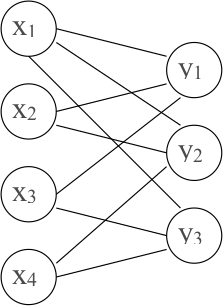

Kļūdu korekcija: Solomona-Rīda kodi
======================================

* Kāpēc jālabo vairāk par vienu kļūdu? 
* Ļauj labot lielu daudzumu kļūdu.
* Ziņojums pirms un pēc kodēšanas būs skaitļu virkne. 

Rīda-Solomona metodes ievads
------------------------------

**Metodes apraksts:** 
  Sadala datus grupās pa :math:`k` skaitļiem.  
  :math:`a_1,a_2,\ldots,a_k` - viena grupa. Definē polinomu: 

  .. math:: 

     f(x) = a_1x^{k-1} + a_2x^{k-2}+\ldots + a_{k-1}x + a_k.

  Skaitļu :math:`a_1,\ldots,a_k` vietā nosūta polinoma vērtības:

  .. math:: 

     f(0),f(1),\ldots,f(s-1)

  atbilstoši izraudzītam :math:`s>k`.

**Rīda-Solomona kodu lietojumi**
  Patērētāju tehnoloģijas, kur nolasīšanā var rasties kļūdas. 
  Sk. `Reed-Solomon error correction <https://en.wikipedia.org/wiki/Reed%E2%80%93Solomon_error_correction>`_.

  * Audio CD, DVD, Blu-ray diski, 
  * QR codes, 
  * Datu pārraide ar DSL un WiMAX, 
  * Satelītu sakari, DVB un ATSC, 
  * RAID 6.

**Algebras pamatteorēma:** 
  Polinomu :math:`P(x)` ar pakāpi :math:`n>0` var vienā vienīgā veidā izteikt 
  sekojošā veidā:

  .. math:: 

     P(x)=c(x-x_1)(x-x_2)\cdots(x-x_n),

  kur :math:`x_i` ir polinoma :math:`P(x)` (kompleksas) saknes.  
  Izteikšanas veidus, kas atšķiras tikai ar reizinātāju secību 
  uzskatām par vienādiem. Šeit 
  :math:`c \neq 0` un kompleksie skaitļi :math:`x_1,\ldots,x_n`
  ne obligāti ir visi dažādi. 

**Sekas #1 no pamatteorēmas:** 
  Ja ir polinoms :math:`h(x)` ar 
  pakāpi ne lielāku par :math:`k` un :math:`h(x) \neq 0` 
  (nav identiski vienāds ar :math:`0`), 
  tad ir ne vairāk kā :math:`k` tādi :math:`x`, kam 
  :math:`h(x) = 0`.  
  Citiem vārdiem: :math:`h(x)` ir ne vairāk 
  kā :math:`k` saknes.

**Pierādījums:** 
  Izriet no algebras pamatteorēmas: ja sakņu :math:`x_i`
  būtu vairāk, :math:`h(x)` varētu izteikt kā visu :math:`(x-x_i)` 
  reizinājumu. Atverot iekavas izrādītos, ka :math:`h(x)` 
  pakāpe pārsniedz :math:`k`. Pretruna.

**Sekas #2 no pamatteorēmas:** 
  Ja diviem polinomiem :math:`f(x)` un :math:`g(x)` pakāpes
  nepārsniedz :math:`k-1` un to vērtības sakrīt :math:`k` dažādos punktos, 
  tad tie ir identiski vienādi.

**Pierādījums:** 
  Atņemam abus polinomus un apzīmējam:

  .. math:: 

     h(x) = f(x)-g(x).

  Katrs punkts :math:`x_i`, kur :math:`f(x)=g(x)` ir sakne polinomam 
  :math:`h(x)`. Arī polinoma :math:`h(x)` pakāpe nepārsniedz :math:`k-1`. 
  Ja sakņu būtu vairāk par :math:`k`, tad :math:`h(x)` būtu identiska nulle. 

  *Piemēri:* Caur diviem punktiem var novilkt tikai vienu 
  taisni (1.pakāpes polinomu) :math:`P(x)=a_1x+a_2`.  
  Caur trim punktiem :math:`(a_1,b_1)`, :math:`(a_2,b_2)`, :math:`(a_3,b_3)`, 
  kur :math:`a_1,a_2,a_3` ir pa pāriem dažādi,
  var novilkt tikai vienu parabolu vai taisni 
  (otrās vai pirmās pakāpes polinomu, utt.).

**Rīda-Solomona nosūtāmo vērtību skaits**

**Apgalvojums:**
  Ja ir :math:`2` ziņojumi: :math:`a_1,\ldots,a_k` un 
  :math:`b_1, \ldots, b_k`, tad 

  .. math:: 

     f(x) = a_1x^{k-1} + a_2x^{k-2}+\ldots+a_{k-1}x + a_k,

  .. math::

     g(x) = b_1x^{k-1} + b_2x^{k-2}+\ldots+b_{k-1}x + b_k.

  * Tā kā katram no šiem polinomiem pakāpe nepārsniedz :math:`k-1`, 
    tad :math:`f(x)` un :math:`g(x)` sakrīt ne vairāk kā :math:`k-1` vietās. (Tās
    ir otrās sekas no algebras pamatteorēmas.)
  * Ja nosūta :math:`s` polinoma vērtības, tad 
    viņi atšķiras pārējās :math:`s - (k-1)` vietās. 

**Cik no pārraidītajām drīkst būt kļūdas?**
  Augstāk redzējām, ka ja divi kodētie ziņojumi atšķiras vismaz 
  :math:`2c+1` vietās, tad kods spēj labot jebkuras :math:`c` kļūdas. 

  .. math::

    s-(k-1) \geq 2c+1 \;\;\Rightarrow\;\; s - k \geq 2c \;\;\Rightarrow c \leq (s-k)/2

  * Rīda-Solomona kods spēj labot līdz :math:`(s-k)/2` kļūdām. 
  * Ja :math:`s=2k`, tad var labot :math:`c \leq (2k-k)/2 = k/2` kļūdas.
  * Ja :math:`\leq 1/4` no ziņojuma garumā :math:`2k` saņem nepareizi, tad 
    iespējams atgūt sākotnējo tekstu.

**Piemērs**
  
  * Cik kļūdas var labot, ja :math:`k=4`, :math:`s=9`, tad 
    :math:`c \leq (s-k)/2 = 2.5`. **Tātad varēs labot 2 kļūdas.**
  * Kāpēc nevaram labot :math:`3` kļūdas. Lai tās labotu, 
    katriem diviem pārraidītajiem ziņojumiem jāatšķiras :math:`2c+1` 
    vietās (:math:`2\cdot 3 + 1 = 7` vietās). 
  * No algebras pamatteorēmas seko, ka :math:`f(x)` un :math:`g(x)` 
    sakrīt ne vairāk kā :math:`k-1` vietās un atšķiras vismaz
    :math:`s - (k-1)` vietās. 
  * Tātad tieši :math:`s-(k-1)=6` vietās var atšķirties. Tā ir pretruna: 
    Ja mēģinātu labot :math:`3` kļūdas, tad :math:`2` kodus, kas atšķiras
    :math:`6` vietās, nevarētu atšķirt. 

**Piemērs ar polinomiem.** 
  Apskatām šādus divus atšķirīgus polinomus (ar vairākām kopīgām saknēm). 

  .. math:: 

     f(x) = x(x-1)(x-2) = x^3 - 3x^2 + 2x + 0.

  .. math::

     g(x) = 2x(x-1)(x-2) = 2x^3 - 6x^2 + 4x + 0.

  Ja sākotnējās virknes ir :math:`(1;-3;2;0)` un :math:`(2;-6;4;0)`, 
  tad pārraida ziņojumu argumentu vērtībām :math:`(0,1,2,3,4,5,6,7,8)`: 

  .. math:: 

     0,0,0,f(3),f(4),f(5),g(6),g(7),g(8).

  Tas var rasties gan pārraidot :math:`f` (ar kļūdām pēdējās :math:`3` vietās), 
  gan arī pārraidot :math:`g` (ar kļūdām ziņojumos :math:`f(3),f(4),f(5)`). 

Galuā lauki
-------------

**Galuā lauki un Rīds-Solomons**
  
  * Ja polinomus rēķina parastiem veseliem skaitļiem, tad to 
    vērtības ātri kļūst lielas. 
  * Rīda-Solomona kodiem veselo skaitļu vietā izmanto 
    polinomu koeficientus un vērtības no galīga lauka,
    piemēram :math:`\text{GF}\!\left(2^{8}\right)`.  (Galuā lauks 
    ar :math:`2^{8} = 256` elementiem).

  `Sk. primitīvo polinomu sarakstu <https://www.partow.net/programming/polynomials/index.html>`_, 
  lai konstruētu :math:`\text{GF}\!\left(2^n\right)` pakāpēm līdz :math:`2^{32}`.

**Definīcija:** 
  Par *lauku* (*field*) sauc kopu :math:`L`, 
  kurā definētas operācijas :math:`+` un :math:`\ast` ar šādām īpašībām:

  * Visurdefinētība: jebkuriem :math:`a` un :math:`b` ir definēts gan :math:`a+b`, gan :math:`a \ast b`.
  * Komutativitāte: :math:`a + b = b + a`, :math:`a \ast b = b \ast a`
  * Asociativitāte: :math:`(a + b) + c = a + (b + c)`, :math:`(a \ast b) \ast c = a \ast (b \ast c)`.
  * Distributivitāte: :math:`a \ast (b + c) = a \ast b + a \ast c`.
  * :math:`0` elements: Eksistē elements :math:`0` ar īpašību, ka :math:`0 + a = a` jebkuram :math:`a`.
  * :math:`1` elements: Eksistē elements :math:`1` ar īpašību, ka :math:`1 \ast a = a` jebkuram :math:`a`.
  * Pretējais elements: Katram :math:`a` eksistē :math:`-a`, ka :math:`a + (-a) = 0`,
  * Multiplikatīvi inversais: Ja :math:`a \neq 0`, tad eksistē :math:`a^{-1}`, kuram :math:`a \ast a^{-1} = 1`.

**Bezgalīgi lauki**

Lauks ir jebkura skaitļu vai citu objektu kopa, kurā var izpildīt visas četras aritmētiskās darbības
pēc parastajiem likumiem. 

* Racionālo skaitļu kopa :math:`\mathbb{Q}` ir lauks (katrai racionālai daļai 
  :math:`a/b` eksistē pretējā: :math:`-a/b` un apgrieztā: :math:`b/a`). 
* Reālo skaitļu kopa :math:`\mathbb{R}` ir lauks
* Komplekso skaitļu kopa :math:`\mathbb{C}` (vai arī tikai 
  to komplekso skaitļu kopa :math:`a+bi`, kur :math:`a,b \in \mathbb{Q}`) ir lauks. 
* Visu to nogriežņu garumu attiecību kopa, ko var uzkonstruēt ar cirkuli un lineālu (pievienojas 
  kvadrātsaknes operācija, bet ne augstāku pakāpju saknes). 
* Visu racionālu daļu :math:`\frac{P(x)}{Q(x)}` kopa ir lauks.

**Apgalvojums:** 
  
  1. Galīgs lauks ar elementu skaitu :math:`q` eksistē
     tad un tikai tad, ja :math:`q` ir izsakāms kā pakāpe :math:`p^k`, kur p ir pirmskaitlis, bet :math:`k=1,2,3,\ldots`.  
     Šo skaitu sauc arī par *kārtu* (*order*).  
  2. Ja :math:`{\displaystyle q=p^{k}}`, tad visi lauki ar kārtu q ir *izomorfi* (*isomorphic*) - 
     to struktūra attiecībā pret saskaitīšanas un reizināšanas 
     operācijām ir vienāda, atšķiras tikai elementu apzīmējumi. 

  **Definīcija:** 
    Galīgu lauku ar :math:`q = p^k` elementiem sauc par *Galuā lauku* (*Galois field*); 
    apzīmē :math:`\text{GF}(q)` jeb :math:`\text{GF}(p^k)`.

**GF pirmskaitļiem**

=================  =  =
:math:`a+b`        0  1
=================  =  =
0                  0  1
1                  1  0
=================  =  =

=================  =  =
:math:`a \ast b`   0  1
=================  =  =
0                  0  0
1                  0  1
=================  =  =

=================  =  =  =
:math:`a+b`        0  1  2
=================  =  =  =
0                  0  1  1
1                  1  2  0
2                  2  0  1
=================  =  =  = 

=================  =  =  =
:math:`a \ast b`   0  1  2
=================  =  =  =
0                  0  0  0
1                  0  1  2
2                  0  2  1
=================  =  =  =

**Ja q nav pirmskaitlis**

  * Aplūkojam :math:`\text{GF}(8)`. Nevar
    izmantot saskaitīšanu un reizināšanu pēc :math:`8` moduļa, jo 
    :math:`2 \cdot 0 = 2 \cdot 4 = 0`  un :math:`2 \cdot 1 = 2 \cdot 5 = 2`.
  * Neeksistēs :math:`2^{-1}`, jo skaitlis :math:`2 \neq 0` reizināšanā :math:`(\text{mod} 8)` salipina rezultātus: 
    Var gadīties, ka :math:`a \neq b`, bet :math:`2a = 2b`. 
  * Atlikumus pēc moduļiem :math:`q`, kas **nav** pirmskaitļi var aplūkot
    (piemēram, paturot tikai tos, kas ir savstarpēji pirmskaitļi ar :math:`q`), bet
    tie veido tikai multiplikatīvu grupu, nevis lauku. 

  *Svarīga piezīme:* Modulārā aritmētika :math:`(\text{mod}\,q)` veido 
  laukus tad un tikai tad, ja :math:`q` ir pirmskaitlis. Ja :math:`q = p^k` :math:`(k > 1)`, 
  :math:`\text{GF}(q)` jākonstruē ar citu metodi. 

  * `Multiplikatīvas grupas pēc jebkura moduļa <https://en.wikipedia.org/wiki/Multiplicative_group_of_integers_modulo_n>`_
  * `Galīgi lauki <https://en.wikipedia.org/wiki/Finite_field>`_

**Piemērs: GF(8)**

  * :math:`p(x) = x^3 + x + 1` ir *nereducējams* (*irreducible*) 
    polinoms; citiem vārdiem - to nevar sadalīt reizinātājos tā, lai 
    reizinātāju koeficienti būtu veseli skaitļi.
  * Veidojam visus iespējamos "atlikumus", dalot ar polinomu :math:`p(x)`, 
    turklāt šo polinomu koeficientus visur saskaitām un reizinām pēc moduļa :math:`2`. 
  * Tad visi :math:`8` iespējamie atlikumi veido Galuā lauku :math:`\text{GF}\!\left(2^3\right)`: 
    :math:`0,\;1,\;x,\;x+1,\;x^2,\;x^2+1,\;x^2+x,\;x^2+x+1.`

**Saskaitīšana un reizināšana GF(8)**

=================  =================  =================  =================  =================  =================  =================  =================  =================
:math:`P(x)+Q(x)`  0                  1                  :math:`x`          :math:`x+1`        :math:`x^2`        :math:`x^2+1`      :math:`x^2+x`      :math:`x^2+x+1`
=================  =================  =================  =================  =================  =================  =================  =================  =================
:math:`0`          0                  1                  :math:`x`          :math:`x+1`        :math:`x^2`        :math:`x^2+1`      :math:`x^2+x`      :math:`x^2+x+1`
:math:`1`          1                  0                  :math:`x+1`        :math:`x`          :math:`x^2+1`      :math:`x^2`        :math:`x^2+x+1`    :math:`x^2+x`
:math:`x`          :math:`x`          :math:`x+1`        0                  1                  :math:`x^2+x`      :math:`x^2+x+1`    :math:`x^2`        :math:`x^2+1`
:math:`x+1`        :math:`x+1`        :math:`x`          1                  0                  :math:`x^2+x+1`    :math:`x^2+x`      :math:`x^2+1`      :math:`x^2`
:math:`x^2`        :math:`x^2`        :math:`x^2+1`      :math:`x^2+x`      :math:`x^2+x+1`    0                  1                  :math:`x`          :math:`x+1`
:math:`x^2+1`      :math:`x^2+1`      :math:`x^2`        :math:`x^2+x+1`    :math:`x^2+x`      1                  0                  :math:`x+1`        :math:`x`
:math:`x^2+x`      :math:`x^2+x`      :math:`x^2+x+1`    :math:`x^2`        :math:`x^2+1`      :math:`x`          :math:`x+1`        0                  1
:math:`x^2+x+1`    :math:`x^2+x+1`    :math:`x^2+x`      :math:`x^2+1`      :math:`x^2`        :math:`x+1`        :math:`x`          1                  0
=================  =================  =================  =================  =================  =================  =================  =================  =================

.. list-table:: 
   :widths: 11 11 11 11 11 11 11 11 11
   :header-rows: 1

   * - :math:`P(x) \ast Q(x)`
     - 0
     - 1
     - :math:`x`
     - :math:`x + 1`
     - :math:`x^2`
     - :math:`x^2 + 1`
     - :math:`x^2 + x`
     - :math:`x^2 + x + 1`
   * - 0
     - 0
     - 0
     - 0
     - 0
     - 0
     - 0
     - 0
     - 0
   * - 1
     - 0
     - 1
     - :math:`x`
     - :math:`x + 1`
     - :math:`x^2`
     - :math:`x^2 + 1`
     - :math:`x^2 + x`
     - :math:`x^2 + x + 1`
   * - :math:`x`
     - 0
     - :math:`x`
     - :math:`x^2`
     - :math:`x^2 + x`
     - :math:`x + 1`
     - 1
     - :math:`x^2 + x + 1`
     - :math:`x^2 + 1`
   * - :math:`x + 1`
     - 0
     - :math:`x + 1`
     - :math:`x^2 + x`
     - :math:`x^2 + 1`
     - :math:`x^2 + x + 1`
     - :math:`x^2`
     - 1
     - :math:`x`
   * - :math:`x^2`
     - 0
     - :math:`x^2`
     - :math:`x + 1`
     - :math:`x^2 + x + 1`
     - :math:`x^2 + x`
     - :math:`x`
     - :math:`x^2 + 1`
     - 1
   * - :math:`x^2 + 1`
     - 0
     - :math:`x^2 + 1`
     - 1
     - :math:`x^2`
     - :math:`x`
     - :math:`x^2 + x + 1`
     - :math:`x + 1`
     - :math:`x^2 + x`
   * - :math:`x^2 + x`
     - 0
     - :math:`x^2 + x`
     - :math:`x^2 + x + 1`
     - 1
     - :math:`x^2 + 1`
     - :math:`x + 1`
     - :math:`x`
     - :math:`x^2`
   * - :math:`x^2 + x + 1`
     - 0
     - :math:`x^2 + x + 1`
     - :math:`x^2 + 1`
     - :math:`x`
     - 1
     - :math:`x^2 + x`
     - :math:`x^2`
     - :math:`x + 1`

Rīda-Solomona kodu atkodēšana
-------------------------------------

**Galīgie lauki R-S kodos**

Galīgā lauka :math:`\text{GF}(p^k)` elementus, kas paši bieži izskatās kā polinomi, tiek izmantoti kā
koeficienti Solomona-Rīda algoritmā esošajos polinomos - tie šeit ir gan argumenti, gan 
vērtības. Izvēlamies galīgo lauku :math:`\text{GF}(q)`.
Datus pārveidojam par šī lauka elementu virkni.
Virknes elementus sadalām blokos garumā :math:`k`: :math:`a_0, a_1, \ldots, a_{k-1}` 
(kur :math:`k < q`). Definējam polinomu

.. math::
   
   f(x) = a_{k-1} x^{k-1} + \ldots + a_1 x + a_0.

Izrēķinām vērtības :math:`f(a_0), f(a_1), \ldots, f(a_{s-1})` galīgā lauka 
elementiem :math:`a_0, a_1, \ldots, a_{s-1} \in \text{GF}(q)`,
par darbībām izmantojot :math:`+` un :math:`\ast`, kas definētas šajā galīgajā laukā.

**R-S kodēšana un atkodēšana**

Atkodēšanas algoritms un izlabojamo kļūdu skaits nemainās, jo pierādījumā par 
kļūdu korekcijas spējām netiek izmantots nekas, kas neizpildās patvaļīgā laukā. 
Galīgie lauki tomēr ļauj izvairīties no darbībām ar lieliem skaitļiem.

**Piemēri ar GF(5):** 

Turpmākajos trijos piemēros izmantojam galīgo lauku 

.. math:: 

   \text{GF}(5) = \{0, 1, 2, 3, 4\},

kur aritmētiskās darbības notiek pēc moduļa :math:`5`.   
Informāciju kodē ar :math:`2` pakāpes polinomu
:math:`f(x) = a \cdot x^2 + b \cdot x + c`,
ņemot 5 polinoma vērtības: 
:math:`f(0)`, :math:`f(1)`, :math:`f(2)`, :math:`f(3)` un :math:`f(4)`.

**Lagranža interpolācija**

  Vēl viens veids, kā veikt atkodēšanu ir interpolācija 
  (labi strādā pie neliela polinomu skaita un pakāpēm). 

  Ja zinām, ka

  .. math:: 

    f(x_1)=r_1;\;\;f(x_2)=r_2;\;\;\ldots,\;\;f(x_k)=r_k,

  tad definējam polinomus:

  .. math:: 

    f_i (x) = \frac{(x-r_1)\cdot\ldots\cdot(x-r_{i-1})\cdot(x-r_{i+1})\cdot\ldots\cdot(x-r_k)}
    {(r_i-r_1)\cdot\ldots\cdot(r_i-r_{i-1})\cdot(r_i-r_{i+1})\cdot\ldots\cdot(r_i-r_k)}.

  Šiem polinomiem :math:`f_i(x)` ir šādas īpašības:  
  (1) Ja :math:`x=r_i`, tad :math:`f_i(x) = 1`, 
  (2) Ja :math:`x=r_j`, (:math:`i \neq j`), tad :math:`f_i(x)=0`, jo kaut kur polinomā ir reizinātājs 
  :math:`(x-r_j)=0`, kas visu reizinājumu padara par :math:`0`.

**Interpolāciju lietošana atkodēšanai**

Meklētais polinoms ir:

.. math:: 

  f(x) = r_1 \cdot f_1(x) + r_2 \cdot f_2 (x) + \ldots + r_k \cdot f_k (x).

Kāpēc šis polinoms dod pareizu rezultātu?
Ja :math:`x = r_i`, tad visi :math:`f_j(x)` (:math:`i \neq j`) vienādi ar :math:`0`, 
un vienīgi :math:`f_i (r_i) = 1`. 

Tātad :math:`f(r_i) = r_i  \cdot f_i(r_i) = r_i`.   
Ja vienīgais kļūdu veids ir dažu vērtību pazušana, tad pietiek ar šo pieeju.

**Interpolācija, ja var būt citas kļūdas**

Ja ir kļūdas, kurās vienas vērtības vietā ir saņemta cita, tad ir grūtāk:  
:math:`k`: sākotnējie skaitļi;   
:math:`s` pārraidītās vērtības: :math:`(f(0), f(1), \ldots, f(s-1))`.

* :math:`c \leq (s-k)/2`: maksimālais pieļaujamais kļūdu skaits, 
* Vismaz :math:`s-c` vērtības ir pareizas.

Rezultātā ir pietiekami daudz pareizo vērtību, lai atrastu kļūdas, taču nezinām
tieši kuras ir pareizas, lai tās varētu izmantot kļūdu meklēšanā.

Berlekampa-Velča atkodēšana
-----------------------------

**Polinoms Y(x) - kļūdu lokators**

Berlekampa-Velča algoritms ir Rīda-Solomona atkodēšanas metode, ko lieto tad, 
ja iespējama ne tikai datu pazušana, bet arī nepareizu datu saņemšana pareizo datu vietā.
Ieviešam apzīmējumus:

* Kļūdas ir :math:`x_1, x_2, \ldots, x_c` (pagaidām nezināmās vietās)
* Pārraidītais polinoms bija :math:`k-1` pakāpes polinoms :math:`p(x)`
* Vērtību :math:`p(x_i)` vietā saņemtās vērtības apzīmējam ar :math:`r_i`.
* Atskaitot :math:`c` vērtības (punktos :math:`x_1,\ldots,x_c`), citas vērtības ir pareizas.

Definējam kļūdu lokatoru:

.. math::

  Y(x) = (x-x_1)(x-x_2) \ldots (x-x_c).

Polinoma pakāpe :math:`\text{deg}\,Y(x) \leq c`. 
Šis polinoms ir :math:`0` visām tām argumenta vērtībām :math:`x_i`, 
kurām saņemta nepareiza :math:`p(x)` vērtība.

**Polinoms Z(x): Y(x) un p(x) reizinājums**

Definējam polinomu :math:`Z(x)`, kas ir kļūdu lokatora un sākotnējā polinoma reizinājums:

.. math:: 
  
  Z(x) = Y(x) \cdot p(x).

Pakāpe :math:`\text{deg}\,Z(x) = \text{deg}\,Y(x) + \text{deg}\,p(x) \leq c+(k-1) = k + c - 1`.

Iedomājamies, ka protam atrast :math:`Y` un :math:`Z`. 
Tad, izdalot abas vienādības puses ar :math:`Y`, iegūstam
:math:`p(x) = Z(x) / Y(x)`.

Tātad, lai atrastu :math:`p(x)`, pietiek izrēķināt :math:`Z(x)` un :math:`Y(x)`.
Ja :math:`r` ir vērtība, kas saņemta kā :math:`p(x)`, tad

.. math::

  Z(x) = Y(x) \cdot r.

Šāda vienādība ir spēkā, jo  

1. Ja :math:`r = p(x)`, tad :math:`Z(x) = Y(x) \cdot p(x)` - ir saņemta pareiza vērtība  
2. Ja :math:`r \neq p(x)`, tad :math:`Y(x) = 0` un :math:`Z(x) = 0`.

Tātad :math:`Z(x) = Y(x) \cdot r` ir spēkā visos :math:`s` pārraidītajos punktos.

**Y, Z atrašana**

Pieņemsim, ka

.. math::

  Y(x) = b_c x^c + b_{c-1} x^{c-1} + \ldots + b_0.

Tā kā :math:`p(x)` – polinoms ar pakāpi :math:`k-1`, tad

.. math::

  Z(x) = a_{k+c-1} x^{k+c-1} + a_{k+c-2} x^{k+c-2} + \ldots + a_0.

* polinoms ar pakāpi :math:`c`
* polinoms ar pakāpi :math:`k+c-1`

Katra saņemtā vērtība dod pa vienam nosacījumam:

.. math:: 

  \left\{ \begin{array}{l}
  Z(0) = Y(0) \cdot r_0\\
  Z(1) = Y(1) \cdot r_1\\
  \ldots\\
  Z(s-1) = Y(s-1) \cdot r_{s-1}
  \end{array} \right.

**Y, Z atrašana (turpinājums)**

.. math:: 

  \left\{ \begin{array}{l}
  Z(0) = Y(0) \cdot r_0\\
  Z(1) = Y(1) \cdot r_1\\
  \ldots\\
  Z(s-1) = Y(s-1) \cdot r_{s-1}
  \end{array} \right.

Katrā nosacījumā ievietojot :math:`i` un :math:`r_i`, iegūst vienādojumu, 
kura nezināmie ir :math:`a_0, \ldots, a_{k+c-1}, b_0, \ldots b_c`. 

:math:`Z(i) = Y(i) \cdot r_i` - :math:`s` vienādojumu sistēma ar :math:`k+2 \cdot c +1` nezināmajiem.
Atrisinām šo vienādojumu sistēmu un no nezināmajiem iegūstam :math:`Z(x)` un :math:`Y(x)`. Tad
izmantojot :math:`p(x) = Z(x)/Y(x)` aprēķinām :math:`p(x)`.

**Jautājumi par Berlekampu-Velču**

**Jautājumi:**

1. Vai vienādojumu sistēmai ir atrisinājums?
2. Vai vienādojumu sistēmai nav vairāki atrisinājumi?
3. Vai varam atrast algoritmisku metodi, kā atrisināt vienādojumu systēmu?

**Atbildes:**

1. Jā, atrisinājums vienmēr būs pareizais (meklējamais) :math:`Y(x)` un :math:`Z(x)` polinomu
   pāris, jo tas apmierina visus nosacījumus.
2. Principā varētu būt vairāki atrisinājumi :math:`(Y(x), Z(x))` un :math:`(Y'(x), Z'(x))` un
   :math:`Z(x)/Y(x) \neq Z'(x)/Y'(x)`.  Vai tā var būt?  
   Ja tiek pārraidītas pietiekami daudzas vērtības, tad atrisinājums izrādīsies viennozīmīgi
   noteikts :math:`(Y(x), Z(x))`.
3. Jā; tālākos slaidos piedāvāsim pakāpeniskas izslēgšanas metodi.

**Berlekampa-Velča atrisināmība**

**Apgalvojums:** 
  Doti polinomi :math:`Y` un :math:`Z`, kuriem:  

  1. :math:`\text{deg}\,Y \leq c`,  
  2. :math:`\text{deg}\,Z \leq k + c - 1`  
  3. :math:`Y \neq 0` un visiem :math:`i`: :math:`Z(i) = Y(i) \cdot r_i`. 
     Pieņemsim, ka :math:`Y', Z'` vēl divi polinomi ar tādām pašām īpašībām.   
     Tad :math:`Z(x)/Y(x) = Z'(x)/Y'(x)`.

**Pierādījums:**  
  :math:`Z(i) = Y(i) \cdot r_i`, kur :math:`r_i` -- saņemtā vērtība priekš :math:`p(i)`.  
  :math:`Z'(i) = Y'(i) \cdot r_i`. 

  Sareizinām krustiski un iegūstam

  .. math:

    Z(i) \cdot Y'(i) \cdot r_i = Z'(i) * Y(i) * r_i.

  Noīsinām :math:`r_i` un iegūstam

  .. math::

    Z(i) \cdot Y'(i) = Z'(i) * Y(i)

  :math:`Z'(i) \cdot Y(i)` pakāpe ir :math:`k + 2c + 1`. 

  Mainīgais :math:`i` pieņem vērtības :math:`0, 1, \ldots, s-1`.  
  :math:`Z(i) \cdot Y'(i)` un :math:`Z'(i) \cdot Y(i)` 
  sakrīt pie :math:`s` dažādiem :math:`x`.

  .. note::
    (*Algebras pamatteorēmas sekas:*) 
    Ja divi polinomi ir dažādi, tad maksimālais 
    argumentu skaits, pie kuriem tie sakrīt, ir šo polinomu pakāpju maksimums.

  Tas nozīmē, ka, ja :math:`k+c-1<s`, tad :math:`Z(i) \cdot Y'(i) = Z'(i) \cdot Y(i)`.  
  Izdalām abas puses ar :math:`Y(x)` un :math:`Y'(x)` un iegūstam

.. math::

  Z(x) / Y(x) = Z'(x) / Y'(x)

**Algoritmiska Berlekampa-Velča atrasināšana**

Nosacījumos :math:`Z(i) = Y(i) \cdot r_i` ievietojot :math:`i` un :math:`r_i`, 
iegūst lineārus vienādojumus ar nezināmajiem :math:`a_i`, :math:`b_i`, 
kuriem ir koeficienti :math:`y_i` un :math:`z_i`:

.. math::

  y_{1,1} a_{k+c-1} + \ldots + y_{1,k+c} a_0 = z_{1,1} b_c + \ldots + z_{1,c+1}b_0.

Ja lineārai vienādojumu sistēmai ir atrisinājums, tad izslēdzot pa vienam
mainīgajam (ar apzīmēšanas palīdzību) var atrast atrisinājumu.

Tornado kodi
----------------

**Tornado kodu ievads**

* Tornado kodi izstrādāti 1990-to gadu beigās. 
* Datu pārraide, ja liela datu daļa var tikt pazaudēta, 
  bet saņemtie dati ir pareizi. (Piemēram, ja 
  datu pakete tiek saņemta, tad tās dati ir pareizi, bet
  pakešu pazušana ir bieža.) 
* Var lietot arī Rīda-Solomona kodus. Taču to atkodēšanai jārisina 
  vai nu lineāras vienādojumu sistēmas vai arī interpolācija. 
  Abi aprēķini ir diezgan darbietilpīgi. 
* Tornado kodi ļauj koriģēt (datu pazušanas) kļūdu apjomu līdzīgu 
  Rīda-Solomona kodiem, izmantojot tikai XOR operāciju.

**Tornado kodi un XOR**

Vienkāršākais Tornado kodu speciālgadījums ir šāds. 
Kods sastāv no ziņojuma bitiem :math:`x_1, x_2, \ldots` un 
kontrolbitiem :math:`y_1, y_2, \ldots`. Katrs kontrolbits ir vairāku ziņojuma bitu XOR 
(summa pēc moduļa :math:`2`). 

Šādu kodu var attēlot ar divdaļīgu grafu, kur virsotnes kreisajā pusē 
atbilst ziņojuma bitiem :math:`x_1, x_2, \ldots`, bet virsotnes labajā pusē - 
kontrolbitiem :math:`y_1, y_2, \ldots`. Ja kontrolbits 
:math:`y_i` ir kaut kādu ziņojuma bitu :math:`x_j` XOR, tad :math:`y_i` atbilstošā virsotne 
tiek savienota ar katram :math:`x_j` atbilstošo virsotni. 

**Hemings kā atsevišķs gadījums**

Piemēram, Heminga kodam :math:`[7,4,1]`, 
kur kontrolbiti definēti kā :

.. math::

   \left\{
   \begin{array}{l}
   y_1 = x_1 \oplus x_2 \oplus x_3\\
   y_2 = x_1 \oplus x_2 \oplus x_4\\
   y_3 = x_1 \oplus x_3 \oplus x_4\\
   \end{array} \right.

atbilst šāds grafs:

**Tornado atkodēšana**

Pieņemsim, ka mums ir situācija, kad visi kontrolbiti :math:`y_i` saņemti, 
bet trūkst dažu ziņojuma bitu. Tad atkodēšanu var veikt šādi:

1. Atrodam kontrolbitu :math:`y_i`, kuram ir zināmi visi :math:`x_j`, 
   kas izmantoti tā aprēķinā, atskaitot vienu.
2. Izmantojot zināmās vērtības, aprēķinam trūkstošo :math:`x_j`.
3. Ja vēl nav atrasti visi :math:`x_j`, atgriežamies pie 1.soļa un meklējam nākošo :math:`y_i`,
   kuram ir zināmi visi tajā ietilpstošie :math:`x_j`, atskaitot vienu.

Uzdevumi
----------

**8.1. uzdevums:**
  Nokodēt :math:`3, 2, 1`.  
  Izmantot polinomus ar koeficientiem, argumentiem un vērtībām no :math:`\text{GF}(5)`. 

.. only:: Internal 

  **Atbilde:** 

    Ņemam polinomu :math:`f(x) = 3\cdot{}x^2 + 2\cdot{}x + 1`.
    Izrēķinām vērtības

    .. math:: 

      \begin{array}{rl}
      f(0) & = 3\cdot{}0^2 + 2\cdot{}0 + 1 = 1,\\
      f(1) & = (3\cdot{}1^2 + 2\cdot{}1 + 1)\;\text{mod}\;5 = 6\;\text{mod}\;5 = 1,\\
      f(2) & = (3\cdot{}2^2 + 2\cdot{}2 + 1)\;\text{mod}\;5 = 17\;\text{mod}\;5 = 2,\\
      f(3) & = (3\cdot{}3^2 + 2\cdot{}3 + 1)\;\text{mod}\;5 = 34\;\text{mod}\;5 = 4,\\
      f(4) & = (3\cdot{}4^2 + 2\cdot{}4 + 1)\;\text{mod}\;5 = 57\;\text{mod}\;5 = 2.
      \end{array}

    Tātad, tiek pārraidītas vērtības :math:`1, 1, 2, 4, 2`.

  :math:`\square`

**8.2. uzdevums:**
  Atkodēt :math:`1, 1, \ast, 4, \ast`, kur :math:`\ast` ir pazaudēta vērtība 
  (saņemtās vērtības visas ir pareizas).  
  Izmantot polinomus ar koeficientiem, argumentiem un vērtībām no :math:`\text{GF}(5)`. 

.. only:: Internal 

  **Atbilde:** 

    Sastādām vienādojumu sistēmu (pēc mod 5):

      .. math::

         \begin{array}{rl}
         0^2\cdot{}a + 0\cdot{}b + c & \equiv 1\;(\text{mod}\,5),\\
         1^2\cdot{}a + 1\cdot{}b + c & \equiv 1\;(\text{mod}\,5),\\
         3^2\cdot{}a + 3\cdot{}b + c & \equiv 4\;(\text{mod}\,5).
         \end{array}

    Tā kā :math:`3^2 = 9 \equiv 4\;(\text{mod}\,5)`: 

    .. math::

      \begin{array}{rl}
      c & \equiv 1\;(\text{mod}\,5),\\
      a + b + c & \equiv 1\;(\text{mod}\,5),\\
      4 a + 3 b + c & \equiv 4\;(\text{mod}\,5).
      \end{array}

    **Cits risinājums:**

    .. math::

       \begin{array}{rl}
       \mbox{}a + b &= 1 - 1 = 0\;(\text{mod}\,5),\\
       4 a + 3 b &= 4 - 1 = 3\;(\text{mod}\,5).
       \end{array}

    Atrisinām šo divu vienādojumu sistēmu ar izslēgšanas metodi. Pareizinot pirmo
    vienādojumu ar :math:`3` un atņemot no otrā vienādojuma iegūst

    .. math::

       (4a+3b) - 3(a+b) = a = 3 - 3\cdot{}0 \equiv 3\;(\text{mod}\,5).

    No vienādojuma :math:`a + b \equiv 0\;(\text{mod}\,5)` iegūstam, ka
    :math:`b = 0 - 3 = -3 = 2\;(\text{mod}\,5)`. Tātad polinoms bija

    .. math::
   
       f(x)=3x^2 + 2x + 1.

  :math:`\square`

**8.3. uzdevums:**
  Atkodēt :math:`2, 3, \ast, \ast, 2`, kur :math:`\ast` ir pazaudēta vērtība (saņemtās vērtības visas ir pareizas).
  Izmantot polinomus ar koeficientiem, argumentiem un vērtībām no :math:`\text{GF}(5)`. 

.. only:: Internal 

  **Atbilde:**

    Sastādām vienādojumu sistēmu (pēc mod 5):

    .. math:: 

      \left\{ \begin{array}{l}
      0^2 \cdot a + 0 \cdot b + c \equiv 2\;(\text{mod}\,5),\\
      1^2 \cdot a + 1 \cdot b + c \equiv 3\;(\text{mod}\,5),\\
      4^2 \cdot a + 4 \cdot b + c \equiv 2\;(\text{mod}\,5).
      \end{array} \right.

    Tā kā :math:`4^2 = 16 \equiv 1\;(\text{mod}\,5)`, tad šo sistēmu var pārrakstīt:

    .. math:: 

      \left\{ \begin{array}{l}
      c \equiv 2\;(\text{mod}\,5),\\
      a + b + c \equiv 3\;(\text{mod}\,5),\\
      a + 4 \cdot{} b + c \equiv 2\;(\text{mod}\,5).
      \end{array} \right.

    Ievietojot :math:`c=2` otrajā un trešajā vienādojumā, iegūstam

    .. math:: 

      \left\{ \begin{array}{l}
      a + b = 3 - 2 \equiv 1\;(\text{mod}\,5),\\
      a + 4 b = 2 - 2 \equiv 0\;(\text{mod}\,5).
      \end{array} \right.

    **Cits risinājums:**

    .. math:: 

      \left\{ \begin{array}{l}
      a + b = 3 - 2 \equiv 1\;(\text{mod}\,5),\\
      a + 4 b = 2 - 2 \equiv 0\;(\text{mod}\,5).
      \end{array} \right.

    Atrisinām šo sistēmu ar izslēgšanas metodi. Atņemot pirmo
    vienādojumu no otrā:

    .. math:: 

      (a+4b)-(a+b) = 3b = 0 - 1 \equiv 4\;(\text{mod}\,5)

    Jāatrisina :math:`3b \equiv 4\;(\text{mod}\,5)`.

    .. note::
      Atrisinājums nebūs daļskaitlis 4/3, jo tas nav lauka elements!
      Pārbaudot :math:`b = 0, 1, 2, 3, 4`, secinām, 
      ka :math:`3 \cdot 3 = 9 \equiv 4\;(\text{mod}\,5)`.   
      Tātad :math:`b \equiv 3\;(\text{mod}\,5)`.  
  
      Ir algoritmi, kā atrast :math:`b`, neizmantojot pilno pārlasi. Bet priekš :math:`(\text{mod}\,5)`, 
      iespējamo :math:`b` ir tik maz, ka pārlase ir ātrāka.

    No vienādojuma :math:`a + b \equiv 1\;(\text{mod}\,5)` iegūstam, ka
    :math:`a = 1 - 3 = -2 \equiv 3\;(\text{mod}\,5)`. Tātad polinoms bija

    .. math:: 

      f(x) = 3 x^2 + 3x + 2.

  :math:`\square`

**8.4. uzdevums:**

  .. image:: figs/tornado-problem.png
     :width: 120px

  Kļūdas koriģējošs kods uzdots ar 
  zīmējumā redzamo grafu.  
  Zināms, ka :math:`x_1 = 1`, :math:`x_2 = 0`, 
  :math:`x_5 = 1`, :math:`y_1 = 0`, :math:`y_2 = 1`, :math:`y_3 = 1`, :math:`y_4 = 0`. 
  Noteikt pazaudētos ziņojuma bitus.

.. only:: Internal

  **Atbilde:**

    :math:`(x_1,x_2,x_3,x_4,x_5,x_6) = (1,0,\textcolor{red}{x_3},\textcolor{red}{x_4},1,x_6)`,  
    
    :math:`(y_1,y_2,y_3,y_4) = (0,1,1,0)`.

    * Pēc :math:`y_1 = x_1 \oplus x_2 \oplus x_3` nosakām, ka :math:`0 = 1 \oplus 0 \oplus x_3`, kas nozīmē, ka :math:`x_3 = 1`.
    * Pēc :math:`y_3 = x_1 \oplus x_4 \oplus x_5` nosakām, ka :math:`1 = 1 \oplus x_4 \oplus 1`, kas nozīmē, ka :math:`x_4 = 1`.
    * Pēc :math:`y_4 = x_3 \oplus x_5 \oplus x_6` nosakām, ka :math:`0 = 1 \oplus 1 \oplus x_6`, kas nozīmē, ka :math:`x_6 = 0`.

  :math:`\square`

Kopsavilkums
----------------

* Nokodējām un atkodējām Heminga kodus
* Definējām Rīda-Solomona kodus
* Saskaitījām un reizinājām galīgu lauku elementus
* Aplūkojām dažas Rīda-Solomona kodu atkodēšanas metodes, t.sk. Berlekampa-Velča algoritmu.
* Aplūkojām dažus vienkāršus Tornado kodu piemērus.

**Bibliogrāfija:**

1. `Tanner graphs <https://en.wikipedia.org/wiki/Tanner_graph>`_.