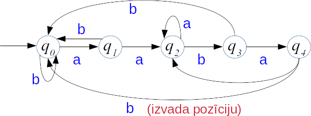
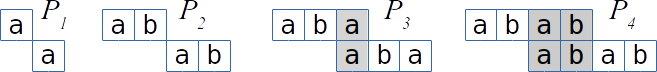
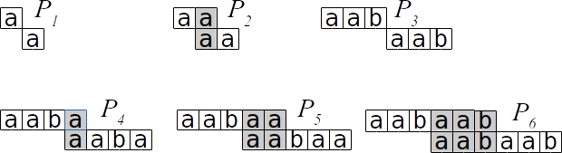
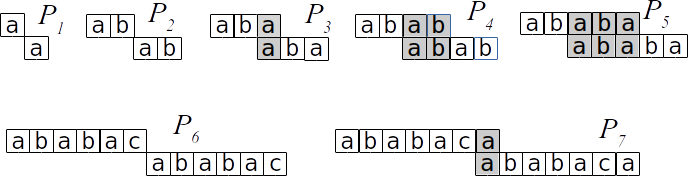

14. Knuta-Morisa-Prata un Bojera-Mūra algoritmi
=================================================

Ja nav veikta teksta :math:`T` priekšapstrāde un tajā jāatrod tikai
viens paraugs :math:`P`, tad parasti efektīvākā pieeja ir 
apstrādāt meklējamo paraugu :math:`P`, izveidot tā meklēšanai 
piemērotas datu struktūras un pēc tam lasīt tekstu :math:`T`. 
Viens datu struktūras veids ir *galīgs automāts-akceptors*
(*finite automaton (acceptor)*), kas, nolasot kārtējo teksta 
:math:`T` simbolu, maina stāvokli. Un tiklīdz kā 
ievadītajā tekstā ir pilnībā nolasījis 
meklējamo paraugu, tad nonāk akceptējošā stāvoklī. 

Regulāru izteiksmju meklēšanai vispārīgajā gadījumā 
galīgs automāts ir ļoti piemērots, bet apakšstringa meklēšanai 
automāta stāvokļu diagrammas vietā pietiek ar dažām mazām tabuliņām. 
Šajā nodaļā aplūkosim KMP jeb Knuta-Morisa-Prata
(*Knuth-Morris-Pratt*) algoritmu un BM jeb Bojera-Mūra (*Boyer-Moore*) algoritmu. 
Nobeigumā pieskarsimies arī vispārīgai regulāru izteiksmju meklēšanai 
ievades tekstā. 

Paraugu meklēšanai tekstā ir vairāki apakšgadījumi:

1. Ja tekstā :math:`T` jāmeklē viens paraugs (**Ctrl-F** teksta redaktorā), 
   tad tekstu parasti lasa pa burtiem kā galīgā automātā (KMP un BM algoritmi). 
2. Ja tekstā :math:`T` jāmeklē vienlaikus daudzi 
   vienāda garuma paraugi (intelektuālā īpašuma aizsardzība, plaģiāta atrašana), 
   tad tekstam parasti lieto ripojošo hešfunkciju kā iepriekšējā lekcijā - 
   lai hešfunkcijas vērtību var salīdzināt ar visiem paraugiem (Rabina-Karpa algoritms). 
3. Ja tekstā :math:`T` bieži jāmeklē dažāda garuma paraugi (Interneta meklētāji), tad 
   tekstu parasti *indeksē* - izveido sufiksu koku, sufiksu masīvu vai līdzīgu 
   datu struktūru (Ukonena algoritms nākamajās lekcijās). 

Meklēšana ar automātu 
------------------------

Pieņemsim, ka lietojam naivo meklēšanas algoritmu un nobīdes (shift) 
pašreizējā vērtība ir :math:`i`, bet salīdzināšanu esam veikuši līdz 
pozīcijai :math:`j`.

Ja izrādās, ka 

.. math::

   T[i] = P[0], \ldots, T[i + j - 1] = P[j - 1],

bet :math:`T[i + j] \neq P[j]`, tad to izmanto, lai izvēlētos nākamo pāri 
:math:`(i^{\ast},j^{\ast})`. 
Nav obligāti izvēlēties :math:`(i^{\ast},j^{\ast}) = (i+1,0)`  kā naivajā algoritmā.

**Automāta pamatideja:**
  Apakšstringa meklēšana ar galīgu automātu:  
  Automāta stāvokļi :math:`q_0, q_1, \ldots, q_{m-1}`. 

**Prefiksu īpašība:** 
  Stāvoklī :math:`q_i` atrodamies tad un tikai tad, ja 
  "pēdējie :math:`i` simboli no :math:`T` sakrīt ar pirmajiem :math:`i` 
  simboliem no :math:`P`". 

**Piemērs:** 
  Parauga :math:`P = \mathtt{abab}` meklēšanas automāts:

  .. figure:: figs/abab-automaton.png
     :width: 3in

*Piezīme.* Pēc :math:`P = \mathtt{abab}` atrašanas pārejam 
uz :math:`q_2` (nevis :math:`q_0`), jo paraugi var pārklāties.

.. math::

   \mathtt{...ababab...}

**Automāta piemērs:**
  Uzzīmēt galīgu automātu, kas meklē `aabab` kā apakšvirkni 
  ievadāmajā tekstā.

**Atrisinājums:**

Laiks meklēšanai ar automātu

1. Teksta lasīšanas laiks: 
   Gatava automāta darbināšanai vajag :math:`O(n)` laiku: 
   katram teksta burtam viena operācija.

2. Parauga priekšapstrādes laiks:
   Lai izveidotu automātu, 
   jānosaka nākošais stāvoklis :math:`q'` jebkurai pašreizējā stāvokļa 
   :math:`q` un pašreizējā burta kombinācijai.
   Pavisam ir :math:`m` stāvokļi. Ar :math:`|\mathcal{A}|` apzīmējam alfabēta 
   :math:`\mathcal{A}` burtu skaitu. 
   Veidojas tabula ar :math:`m \cdot |\mathcal{A}|` elementiem. 
   Tam vajadzīgas vismaz :math:`O(m \cdot |\mathcal{A}|)` operācijas.  

3. Pilnais laiks ir :math:`O(n + m \cdot |\mathcal{A}|)`.

*Piezīme:* Priekšapstrādes laiks ir pārāk liels; praksē tā cenšas nedarīt - 
par to ir KMP algoritms. 
Pat pieņemot, ka :math:`n >> m`, arī :math:`m \cdot |\mathcal{A}|` var būt liels.

Knuta-Morisa-Prata (KMP) Algoritms
-------------------------------------

**KMP algoritma pamatideja:** 
  Izveidojam tabuliņu ar *<emblue>prefiksu funkciju</emblue>* (*prefix function*) :math:`\pi`. 
  Funkcija :math:`\pi` veidojama meklējamam *<emblue>paraugam</emblue>* (*pattern*). 
  Šī funkcija ietver zināšanas par to, kā paraugs :math:`P` sakrīt pats ar savām nobīdēm.
  Tā var izvairīties no nevajadzīgām nobīdēm naivajā meklēšanas algoritmā un nav 
  jāveido atsevišķa stāvokļu pāreja katram ievades simbolam :math:`s \in S`. 

  1. Ievades tekstu lasa tikai vienreiz: :math:`O(n)`, 
     nevis :math:`O(n \cdot m)`, kā naivajam algoritmam.
  2. Parauga :math:`P` priekšapstrāde notiks laikā :math:`O(m)`, 
     nevis :math:`O(m\cdot|S|)`, kā pilnīgi izveidotam automātam.

Prefiksu funkcija 
~~~~~~~~~~~~~~~~~~~~~

Prefiksu funkcija atkarīga no meklējamā parauga :math:`P=P[0]\ldots{}P[m-1]`.

**Definīcija:** 
  Katram :math:`j = 1,\ldots,m` atrod maksimālo :math:`k` (:math:`k<j`), kam izpildās:

  .. math::

    \left\{ 
      \begin{array}{l}
        P[0] = P[j - k]\\
        P[1] = P[j - k + 1]\\
        \ldots\\
        P[k - 1] = P[j - 1]
      \end{array} 
    \right.

Prefiksu funkcijas vērtība: :math:`\pi[j]=k`. Ja tāda :math:`k` (:math:`k<j`) nav, 
tad :math:`\pi[j]=0`.

**Cita definīcija:**
  Ar :math:`P_k` apzīmē virknes :math:`P` prefiksu garumā :math:`k`. 
  Tad :math:`\pi(j)=k` ir :math:`P` :math:`j`-tā 
  prefiksa (:math:`P_j`) visgarākā sufiksa garums, kas īsāks par pašu :math:`j`:

.. math::

   \pi(j) = \max \left\{ k\,:\,k<j\;\text{un}\;P_k\;\text{ir virknes}\;P_j\;\text{sufikss} \right\}

**Uzdevums:** 
  Atrast prefiksu funkciju, kas atbilst 
  meklējamajam paraugam :math:`P = \mathtt{abab}`. 

**Atrisinājums:** 

Risinājumu var iztēloties kā "maksimālu teleskopisku sabīdīšanu": 

.. list-table::
   :header-rows: 1

   * - :math:`j`
     - :math:`1`
     - :math:`2`
     - :math:`3`
     - :math:`4`
   * - :math:`\pi(j)`
     - :math:`0`
     - :math:`0`
     - :math:`1`
     - :math:`2`

**Uzdevums:** 
  Atrast prefiksu funkciju, kas atbilst 
  meklējamajam paraugam :math:`P = \mathtt{aabaab}`. 

**Atrisinājums:** 

.. list-table::
   :header-rows: 1

   * - :math:`j`
     - :math:`1`
     - :math:`2`
     - :math:`3`
     - :math:`4`
     - :math:`5`
     - :math:`6`
   * - :math:`\pi(j)`
     - :math:`0`
     - :math:`1`
     - :math:`0`
     - :math:`1`
     - :math:`2`
     - :math:`3`

**KMP algoritma pseidokods:**
  *Ievade:* Teksts :math:`T` un meklējamais paraugs :math:`P`.  
  *Izvade:* Visas nobīdes, ar kādām tekstā parādās paraugs. 

  | :math:`\text{\sc KMPmatcher}(T, P)`
  | 1. :math:`\quad` :math:`n = T.\mathit{length}`
  | 2. :math:`\quad` :math:`m = P.\mathit{length}`
  | 3. :math:`\quad` :math:`\pi = \text{\sc Compute\_Prefix\_Function}(P)`
  | 4. :math:`\quad` :math:`k = 0`
  | 5. :math:`\quad` **for** :math:`i = 0` **to** :math:`n-1` :math:`\quad`  *// lasa T no kreisās uz labo*
  | 6. :math:`\quad\quad` **while** :math:`k > 0` **and** :math:`P[k] \neq T[i]` 
  | 7. :math:`\quad\quad\quad` :math:`k = \pi(k)` :math:`\quad` *// hipotēze bija aplama, paraugu pārceļ uz priekšu* 
  | 8. :math:`\quad\quad` **if** :math:`P[k] == T[i]` 
  | 9. :math:`\quad\quad\quad` :math:`k = k + 1` :math:`\quad` *// hipotēze pagaidām apstiprinās, salīdzina tālāk*
  | 10. :math:`\quad\quad` **if** :math:`k == m` :math:`\quad` *// vai viss paraugs P jau nolasīts?*
  | 11. :math:`\quad\quad\quad` print ``"Paraugs parādās ar nobīdi"`` :math:`i-m` 
  | 12. :math:`\quad\quad\quad` :math:`k = \pi(k)` :math:`\quad` *// nākamā vieta, uz kuru pārcelt paraugu*

**Kāpēc KMP strādā pareizi?**
  Pieņemsim, ka tekošā nobīde (*shift*) ir :math:`i \in \{ 0,\ldots,n-m\}`: 
  Ceram, ka paraugs :math:`P` atradīsies tekstā :math:`T`, sākot ar :math:`i`-to pozīciju.

  Bet izrādās, ka kārtējais :math:`T` simbols (:math:`T[i+j]`) nesakrīt ar :math:`P[j]` 
  (kur :math:`j \in \{ 0,\ldots,m-1\}`). Tad ir spēkā vienādības:

  .. math::

     \left\{ \begin{array}{lll}
     T[i] & =P[j-k] & =P[0]\\
     T[i+1] & =P[j-k+1] & =P[1]\\
     \ldots & \ldots & \ldots\\
     T[i+k+1] & =P[j-1] & =P[k-1]
     \end{array} \right.

  Nākamā pozīcija tekstā :math:`T`, no kuras var sākties apakšstrings :math:`P`, ir, 
  sākot ar pēdējiem :math:`k` burtiem no jau nolasītā :math:`T` gabala.

**Piemērs:** 
  Meklējam paraugu :math:`P=\mathtt{ababaca}` tekstā :math:`T = \mathtt{ababaababaca}`. 

.. list-table::
    :header-rows: 1

    * - :math:`i`
      - 0
      - 1
      - 2
      - 3
      - 4
      - 5
      - 6
      - 7
      - 8
      - 9
      - 10
      - 11
      - 
    * - 
      - :math:`\mathtt{a}`
      - :math:`\mathtt{b}`
      - :math:`\mathtt{a}`
      - :math:`\mathtt{b}`
      - :math:`\mathtt{a}`
      - :math:`\mathtt{a}`
      - :math:`\mathtt{b}`
      - :math:`\mathtt{a}`
      - :math:`\mathtt{b}`
      - :math:`\mathtt{a}`
      - :math:`\mathtt{c}`
      - :math:`\mathtt{a}`
      - :math:`k=0`
    * - 
      - :math:`\mathtt{a}`
      - :math:`\mathtt{b}`
      - :math:`\mathtt{a}`
      - :math:`\mathtt{b}`
      - :math:`\mathtt{a}`
      - :math:`\textcolor{gray}{\mathtt{c}}`
      - :math:`\textcolor{gray}{\mathtt{a}}`
      - 
      - 
      - 
      - 
      - 
      - :math:`k=1,2,3,4,5`
    * - 
      - :math:`\mathtt{a}`
      - :math:`\mathtt{b}`
      - :math:`\mathtt{a}`
      - :math:`\mathtt{b}`
      - :math:`\mathtt{a}`
      - :math:`\textcolor{red}{\mathtt{c}}`
      - :math:`\textcolor{gray}{\mathtt{a}}`
      - 
      - 
      - 
      - 
      - 
      - :math:`k=\pi(5)=3`
    * - 
      - 
      - 
      - :math:`\mathtt{a}`
      - :math:`\mathtt{b}`
      - :math:`\mathtt{a}`
      - :math:`\textcolor{red}{\mathtt{b}}`
      - :math:`\textcolor{gray}{\mathtt{a}}`
      - :math:`\textcolor{gray}{\mathtt{c}}`
      - :math:`\textcolor{gray}{\mathtt{a}}`
      - 
      - 
      - 
      - :math:`k=\pi(3)=1`
    * - 
      - 
      - 
      - 
      - 
      - :math:`\mathtt{a}`
      - :math:`\textcolor{red}{\mathtt{b}}`
      - :math:`\textcolor{gray}{\mathtt{a}}`
      - :math:`\textcolor{gray}{\mathtt{b}}`
      - :math:`\textcolor{gray}{\mathtt{a}}`
      - :math:`\textcolor{gray}{\mathtt{c}}`
      - :math:`\textcolor{gray}{\mathtt{a}}`
      - 
      - :math:`k=\pi(1)=0`
    * - 
      - 
      - 
      - 
      - 
      - 
      - :math:`\mathtt{a}`
      - :math:`\mathtt{b}`
      - :math:`\mathtt{a}`
      - :math:`\mathtt{b}`
      - :math:`\mathtt{a}`
      - :math:`\mathtt{c}`
      - :math:`\mathtt{a}`
      - :math:`k=1,2,3,4,5,6,7`

Prefiksu funkcija paraugam :math:`P=\mathtt{ababaca}`:

.. list-table::
   :header-rows: 1

   * - :math:`j`
     - :math:`1`
     - :math:`2`
     - :math:`3`
     - :math:`4`
     - :math:`5`
     - :math:`6`
     - :math:`7`
   * - :math:`\pi(j)`
     - :math:`0`
     - :math:`0`
     - :math:`1`
     - :math:`2`
     - :math:`3`
     - :math:`0`
     - :math:`1`

**KMPmatcher ātrdarbības novērtējums:** 
  Pieņemsim, ka :math:`\pi(j)` jau izrēķināta.   
  Ievērojam, ka jebkurā parauga :math:`P` un teksta :math:`T` 
  salīdzināšanā izpildās viena no divām lietām:

  * ja :math:`P[k] = T[i]`, tad palielinās :math:`i`, bet :math:`i-k` nemainās.
  * ja :math:`P[k] \neq T[i]`, tad palielinās :math:`i-k`, bet :math:`i` nemainās. 

  Tā kā :math:`i` un :math:`i-k` ir veseli skaitļi, kas sākumā ir :math:`0` un 
  nevar pārsniegt :math:`n`, tad algoritmā ir ne vairāk kā :math:`2n` salīdzināšanas.
  Tātad KMP ātrdarbība ir :math:`O(n)`.

Prefiksu funkcijas pseidokods
~~~~~~~~~~~~~~~~~~~~~~~~~~~~~~~

  | :math:`\text{\sc ComputePrefixFunction}(P)`
  | 1. :math:`\quad` :math:`m = P.\mathit{length}`
  | 2. :math:`\quad` Rezervē tabulu :math:`\pi(1)\ldots{}\pi(m)`
  | 3. :math:`\quad` :math:`\pi(1)=0`
  | 4. :math:`\quad` :math:`k=0`
  | 5. :math:`\quad` **for** :math:`q=2` **to** :math:`m`
  | 6. :math:`\quad\quad` **while** :math:`k>0` **and** :math:`P[k]\neq P[q-1]`
  | 7. :math:`\quad\quad\quad` :math:`k=\pi(k)`
  | 8. :math:`\quad\quad` **if** :math:`P[k]==P[q-1]`
  | 9. :math:`\quad\quad\quad` :math:`k=k+1`
  | 10. :math:`\quad\quad` :math:`\pi(q)=k`
  | 11. :math:`\quad` **return** :math:`\pi`

**Piemērs:** 
  Atrast prefiksu funkciju, kas atbilst
  meklējamajam paraugam :math:`P = \mathtt{ababaca}`.

.. list-table::
   :header-rows: 1

   * - :math:`j`
     - :math:`1`
     - :math:`2`
     - :math:`3`
     - :math:`4`
     - :math:`5`
     - :math:`6`
     - :math:`7`
   * - :math:`\pi(j)`
     - :math:`0`
     - :math:`0`
     - :math:`1`
     - :math:`2`
     - :math:`3`
     - :math:`0`
     - :math:`1`
   * - 
     - :math:`\mathtt{a}`
     - :math:`\mathtt{b}`
     - :math:`\mathtt{a}`
     - :math:`\mathtt{b}`
     - :math:`\mathtt{a}`
     - :math:`\mathtt{c}`
     - :math:`\mathtt{a}`
   * - :math:`i`
     - 1
     - 2
     - 3
     - 4
     - 5
     - 6
     - 7
   * - :math:`q=1`
     - :math:`\textcolor{blue}{0}`
     - 
     - 
     - 
     - 
     - 
     - 
   * - :math:`q=2`
     - 0
     - :math:`\textcolor{blue}{0}`
     - 
     - 
     - 
     - 
     - 
   * - :math:`q=3`
     - 0
     - 0
     - :math:`\textcolor{blue}{1}`
     - 
     - 
     - 
     - 
   * - :math:`q=4`
     - 0
     - 0
     - 1
     - :math:`\textcolor{blue}{2}`
     -
     - 
     - 
   * - :math:`q=5`
     - 0
     - 0
     - 1
     - 2
     - :math:`\textcolor{blue}{3}`
     - 
     - 
   * - :math:`q=6`
     - 0
     - 0
     - 1
     - 2
     - 3
     - :math:`\textcolor{red}{3\downarrow}` 1
     - 
   * - :math:`q=6`
     - 0
     - 0
     - 1
     - 2
     - 3
     - :math:`\textcolor{red}{1\downarrow}` 0
     - 
   * - :math:`q=6`
     - 0
     - 0
     - 1
     - 2
     - 3
     - :math:`\textcolor{blue}{0}`
     - 
   * - :math:`q=7`
     - 0
     - 0
     - 1
     - 2
     - 3
     - 0
     - :math:`\textcolor{blue}{1}`

**Prefiksu funkcijas laika sarežģītība:**
  Prefiksu funkcijas veidošanas laiks ir :math:`O(m)`.

  1. Ārējais cikls izpildās :math:`m-1` reizes. 
  2. Katrā iekšējā cikla iterācijā :math:`\pi[i+1]` vērtība tiek samazināta. 
  3. Tā kā šī vērtība tiek palielināta tikai katrā ārējā cikla iterācijā par :math:`1`, 
     tad tā var sasniegt ne vairāk kā :math:`m`. Tā kā tā nevar būt negatīva, tad samazināties
     var ne vairāk kā :math:`m` reizes, tātad iekšējais cikls kopumā izpildās ne vairāk kā :math:`m` reizes.

Bojera-Mūra algoritms
-----------------------

**Pamatideja:** 
  Bojera-Mūra algoritms sāk salīdzināšanu no pēdējā simbola (:math:`P[m-1]` un :math:`T[i+m-1]`). 
  Nesakritības gadījumā salīdzināmo virkni var būt iespējams pabīdīt uz priekšu 
  vairāk nekā par :math:`1` simbolu.  
  Piemēram, ja :math:`T[i+m-1]` ir simbols, kas nesakrīt ne ar vienu 
  no :math:`P[0],\ldots,P[m-1]`, 
  tad varam pārbīdīt virkni par :math:`m` simboliem uz priekšu.

  Tāpēc naivajam algoritmam un KMP nepieciešamas vismaz :math:`O(n)` darbības, 
  bet Bojera-Mūra algoritmam dažreiz pietiek ar :math:`O(n/m)` darbībām. 
  (Sliktākajos gadījumos gan Bojera-Mūra algoritms nav labāks par KMP.)

Bojera-Mūra pseidokods
~~~~~~~~~~~~~~~~~~~~~~~~

  | :math:`\text{\sc BMmatcher}(T,P)`
  | 1. :math:`\quad` :math:`n = T.\mathit{length}`
  | 2. :math:`\quad` :math:`m = P.\mathit{length}`
  | 3. :math:`\quad` :math:`s = 0`
  | 4. :math:`\quad` **while** :math:`s \leq n-m`
  | 5. :math:`\quad\quad` :math:`j=m`
  | 6. :math:`\quad\quad` **while** :math:`j>0` **and** :math:`P[j-1] = T[s+j-1]`:
  | 7. :math:`\quad\quad\quad` :math:`j=j-1` 
  | 8. :math:`\quad\quad` **if** :math:`j=0` **then** 
  | 9. :math:`\quad\quad\quad` print ``"Paraugs parādās ar nobīdi"`` :math:`s` 
  | 10. :math:`\quad\quad\quad` :math:`s = s + \gamma[0]` 
  | 11. :math:`\quad\quad` **else** :math:`s = s + \max(\gamma[j], j-1-\lambda[T[s+j-1]])` 

Pārbīdes nosaka tabulas (:math:`\gamma` un :math:`\lambda`) - 
no abām pārbīdēm izvēlamies maksimālo. Šo tabulu konstruēšanu tūlīt aplūkosim.

Sliktā simbola tabula
~~~~~~~~~~~~~~~~~~~~~~~~~

BM algoritms paraugam :math:`P` izveido divus pārbīžu masīvus:  
sliktā simbola tabulu :math:`\lambda` un labā sufiksa tabulu :math:`\gamma`.

Sliktā simbola tabulu indeksē ar simboliem, kas var būt sastopami :math:`P`. 
Katram simbolam :math:`x` tajā ieraksta lielāko :math:`i`, kur :math:`P[i]=x`. 
Ja :math:`x` nav sastopams vārdā, tad :math:`\lambda[x]=-1`. 
Piemēram, ja :math:`P=\mathtt{abcab}`, tad tabula izskatās šādi:

.. list-table::
   :header-rows: 1

   * - :math:`x`
     - :math:`\mathtt{a}`
     - :math:`\mathtt{b}`
     - :math:`\mathtt{c}`
     - :math:`\mathtt{*}`
   * - :math:`\lambda(x)`
     - :math:`3`
     - :math:`4`
     - :math:`2`
     - :math:`-1`

Ar :math:`\mathtt{*}` apzīmēts jebkurš simbols, kas nav :math:`\mathtt{a,b,c}`.

**Sliktā simbola pseidokods** 

  | :math:`\text{\sc BadCharacterTable}(P)`
  | 1. :math:`\quad` **for** :math:`a \in S`: :math:`\quad` *// katram alfabēta simbolam*
  | 2. :math:`\quad\quad` :math:`\lambda[a] = -1`
  | 3. :math:`\quad` **for** :math:`j=0` **to** :math:`m-1`:
  | 4. :math:`\quad\quad` :math:`\lambda[P[j]] = j`
  | 5. :math:`\quad` **return** :math:`\lambda`

Labā sufiksa tabula
~~~~~~~~~~~~~~~~~~~~~

Labā prefiksa tabulu :math:`\gamma[i]` indeksē ar skaitļiem 
:math:`i` no :math:`0` līdz :math:`m`. Šīs tabulas semantika ir šāda: 
ja :math:`P[i]\ldots{}P[m-1]` sakrīt ar :math:`T[k+i]\ldots{}T[k+m-1]`, 
bet :math:`P[i-1] \neq T[k+i-1]`, tad :math:`\gamma[i]` ir mazākā 
pārbīde :math:`j`, kuru ir vērts mēģināt.

- Ja :math:`i=m`, tad :math:`\gamma[i]=1`. 
- Ja :math:`i \leq m`, tad :math:`\gamma[i]` ir vienāds ar mazāko :math:`j>0`, 
  kam piemīt viena no šīm divām īpašībām:

  - :math:`i \geq j` un :math:`P[i]\ldots{}P[m-1]` sakrīt ar :math:`P[i-j]\ldots{}P[m-j-1]`;
  - :math:`i \leq j` un :math:`P[j]\ldots{}P[m-1]` sakrīt ar :math:`P[0]\ldots{}P[m-j-1]`.
    Ja tāds :math:`j` neeksistē, tad :math:`\gamma[i] = m`;

**Piemērs:** 
  Meklējamam paraugam :math:`P = \mathtt{abcab}` 
  labā sufiksa tabula izskatīsies šādi:

.. list-table::
   :header-rows: 1

   * - :math:`j`
     - :math:`0`
     - :math:`1`
     - :math:`2`
     - :math:`3`
     - :math:`4`
     - :math:`5`
   * - :math:`\gamma[j]`
     - :math:`3`
     - :math:`3`
     - :math:`3`
     - :math:`3`
     - :math:`5`
     - :math:`1`

Saturiski, tas nozīmē, ka ja nav sakritis pēdējais simbols, 
tad nākošā iespēja, kas jāmēģina ir :math:`T[i+1]\ldots{}T[i+5]`, 
bet, ja nav sakritis kāds no iepriekšējiem simboliem, tad varam 
uzreiz pāriet uz :math:`T[i+3]\ldots{}T[i+7]`.

(Šajā gadījumā to mums garantē simbols 
:math:`P[4]=T[i+4]=\mathtt{b}`, jo :math:`\mathtt{b}` vārdā :math:`P` 
ir tikai :math:`P[4]` un :math:`P[1]`.)

**Labā sufiksa tabulas pseidokods**

  | :math:`\text{\sc GoodSuffixTable}(P)`
  | 1. :math:`\quad` :math:`\pi = \textrm{ComputePrefixFunction}(P)`
  | 2. :math:`\quad` :math:`P' = \text{\sc Reverse}(P)`
  | 3. :math:`\quad` :math:`\pi' = \textrm{ComputePrefixFunction}(P')`
  | 4. :math:`\quad` **for** :math:`j=0` **to** :math:`m`:
  | 5. :math:`\quad\quad` :math:`\gamma[j] = m - \pi[m]`
  | 6. :math:`\quad` **for** :math:`\ell=1` **to** :math:`m`:
  | 7. :math:`\quad\quad` :math:`j = m - \pi'[\ell]`
  | 8. :math:`\quad\quad` :math:`\gamma[j] = \min(\gamma[j], l - \pi'[l])`
  | 9. :math:`\quad` **return** :math:`\gamma`

Šajā algoritmā :math:`\text{\sc ComputePrefixFunction}(P)`
ir funkcija, kas saņem virkni :math:`P`, izrēķina šai virknei atbilstošo 
Knuta-Morisa Prata algoritma prefiksu funkciju :math:`\pi[j]` un atgriež šo masīvu.

**BM algoritma piemērs:** 

.. list-table:: 
   :header-rows: 1

   * - :math:`\mathtt{a}`
     - :math:`\mathtt{d}`
     - :math:`\mathtt{a}`
     - :math:`\mathtt{a}`
     - :math:`\mathtt{b}`
     - :math:`\mathtt{a}`
     - :math:`\mathtt{b}`
     - :math:`\mathtt{c}`
     - :math:`\mathtt{a}`
     - :math:`\mathtt{b}`
     - :math:`\mathtt{a}`
     - :math:`\mathtt{a}`
     - :math:`\mathtt{b}`
   * - :math:`\textcolor{gray}{\mathtt{a}}`
     - :math:`\textcolor{gray}{\mathtt{b}}`
     - :math:`\textcolor{red}{\mathtt{c}}`
     - :math:`\mathtt{a}`
     - :math:`\mathtt{b}`
     - 
     - 
     - 
     - 
     - 
     - 
     - 
     - 
   * - 
     - 
     - 
     - :math:`\textcolor{gray}{\mathtt{a}}`
     - :math:`\textcolor{gray}{\mathtt{b}}`
     - :math:`\textcolor{gray}{\mathtt{c}}`
     - :math:`\textcolor{gray}{\mathtt{a}}`
     - :math:`\textcolor{red}{\mathtt{b}}`
     - 
     - 
     - 
     - 
     - 
   * - 
     - 
     - 
     - 
     - 
     - :math:`\textcolor{green}{\mathtt{a}}`
     - :math:`\textcolor{green}{\mathtt{b}}`
     - :math:`\textcolor{green}{\mathtt{c}}`
     - :math:`\textcolor{green}{\mathtt{a}}`
     - :math:`\textcolor{green}{\mathtt{b}}`
     - 
     - 
     - 
   * - 
     - 
     - 
     - 
     - 
     - 
     - 
     - 
     - :math:`\textcolor{gray}{\mathtt{a}}`
     - :math:`\textcolor{gray}{\mathtt{b}}`
     - :math:`\textcolor{red}{\mathtt{c}}`
     - :math:`\mathtt{a}`
     - :math:`\mathtt{b}`

Apskatīsim :math:`T = \mathtt{daababcabaab}` un :math:`P = \mathtt{abcab}`.   
Meklējam no labās puses uz kreiso: 
Katra rindiņa attēlo vienu mēģinājumu atrast apakšstringu. 
Ar **sarkanu** apzīmē burtu, kurā simbols no :math:`P` nav sakritis ar 
atbilstošo simbolu no :math:`T`. 

1. Pirmajā mēģinājumā sakrita :math:`P[4]` un :math:`P[3]`, bet ne :math:`P[2]`. 
   Tad pavirzāmies :math:`3` simbolus uz priekšu (saskaņā ar „labā sufiksa tabulu”). 
2. Skatāmies vai :math:`P[0]\ldots{}P[4]` sakrīt ar :math:`T[3]\ldots{}[7]`. 
   Nesakritība ir jau :math:`P[4]` un tad saskaņā ar „sliktā simbola tabulu” pavirzāmies pa :math:`2` simboliem, 
   lai atrastais "c" sakristu ar pirmo iespējamo "c", kas ir apakšvirknē :math:`P` (pirmo - no beigām).
3. Trešajā mēģinājumā sakrīt viss apakšstrings. Ja nepieciešams atrast visas 
   vietas tekstā :math:`T`, kur ir apakšvirkne :math:`P`, tad saskaņā ar :math:`\gamma[0]` 
   pārvietojamies :math:`3` simbolus uz priekšu un mēģinām vēl. 
4. Pēdējais mēģinājums ir neveiksmīgs, un tad esam sasnieguši teksta beigas.

**Varbūt var būt tikai sliktā simbola tabula?**
  Praktiskai apakšvirkņu meklēšanai lielajā vairumā gadījumu pietiktu 
  ar sliktā simbola tabulu vienu pašu. Varētu rakstīt šādu pseidokodu:

  | :math:`\quad` **if** :math:`j=0` **then**
  | :math:`\quad\quad` print "Paraugs parādās ar nobīdi" :math:`s`
  | :math:`\quad\quad` :math:`s = s+ \gamma[0]`
  | :math:`\quad` **else** :math:`s = s + \max(\textcolor{red}{1}, j-1-\lambda[T[s+j-1]])`

Tā vietā, lai rakstītu "labā sufiksa likumu" :math:`\gamma[j]`, ievietojam vērtību :math:`1`. 
Ja :math:`T = \mathtt{BBBBBBBBBB...BBB}` un 
paraugs ir :math:`T = \mathtt{ABBBB}`, kļūst par "naivo" algoritmu.

**Labā sufiksa tabulas piemērs:**
  Aplūkosim paraugu :math:`P = \mathtt{CTTACTTAC}`. 
  Pamatosim, ka labā sufiksa tabula ir šāda:

  .. list-table::
     :header-rows: 1

     * - :math:`j`
       - 0
       - 0
       - 0
       - 0
       - 0
       - 0
       - 0
       - 0
       - 0
       - 1
     * - :math:`\gamma(j)`
       - 4
       - 4
       - 4
       - 4
       - 4
       - 8
       - 8
       - 8
       - 8
       - 1

Atsauces
--------------

BM algoritma aprēķinu piemērs. 

* `Good Suffix Heuristic <https://www.geeksforgeeks.org/boyer-moore-algorithm-good-suffix-heuristic/>`_
* `Visualizing String Matching <http://whocouldthat.be/visualizing-string-matching/>`_

