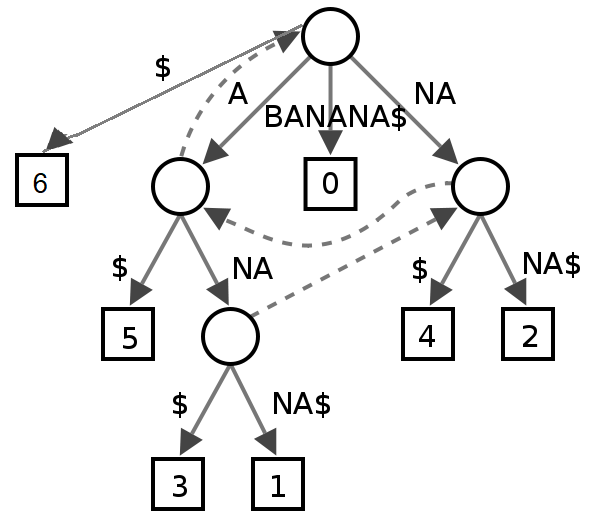
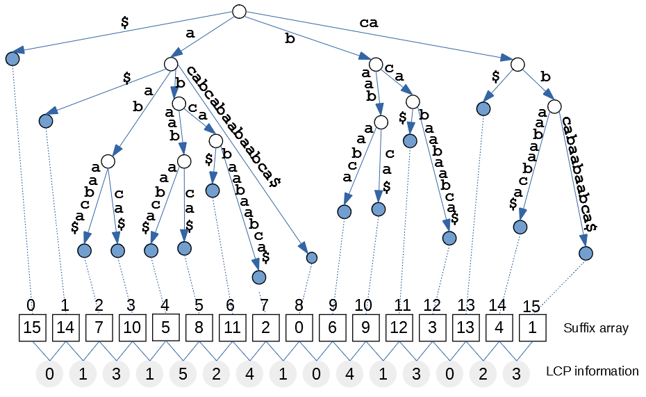

15. Sufiksu koki
========================================

1. Kas ir "Trie" jeb burtu koki. Saspiestie Trie 
2. Sufiksu  koki un masīvi
3. Dokumentu meklēšana
4. Sufiksu koku iegūšana lineārā laikā

**Stringu meklēšanas problēma:** 
Dotas divas virknes (teksts :math:`T` un paraugs :math:`P`)
kādā alfabētā :math:`\Sigma`. 
(Atrast dažus vai visus atkārtojumus, saskaitīt tos visus.)
Mēs vēlamies atrast visus pārvietojumus :math:`P`, kur 
tas sakrīt ar :math:`T`. Mēs vēlamies arī pārklājošas rakstu. 

(Varianti - regex vai citi raksti, aptuveni sakritība). 

**Atkārtotā meklēšana:** 
  Vēlamies datu-struktūras variantu - apstrādāt iepriekš :math:`T`, 
  pēc tam vaicāt visādus paraugus :math:`P`. 
  Vienai meklēšanai gribam tērēt :math:`O(|P|)` laiku (lasīt paraugu vienreiz). 
  Vēlamies izmantot kādu :math:`O(|T|)` vietu. 

**Alfabētiskā priekšgājēja meklēšanas uzdevums:** 
  Priekšgājējs starp virknes. 
  Doti teksta virknes :math:`T_1,T_2,\ldots,T_k` 
  un raksts :math:`P`, atrast, kur virknes 
  :math:`P` piemērojas leksikogrāfiski. 

  Var sakārtot vai uzbūvēt bināro koku... 
  Bet tas ir neefektīvi, jo divu virkņu salīdzināšana var aizņemt ilgu laiku.
  Trie ir sakņots koks ar zariem, kas tiek marķēti ar burtiem 
  alfabētā :math:`\Sigma`. 

Priekšgājēja meklēšanas uzdevums ir praktiski noderīgs - 
mēs vēlamies ievadīt kādu virknes prefiksu un
redzēt grāmatas nosaukumu, kas tūlīt priekšā vai aiz tās. 

Vaicēlamies attēlot :math:`T_i` virknes kā ceļus
no saknes līdz lapai. 
Un ieviest jaunu simbolu (dolāru) norādot 
piemēra beigas. 

**Piemērs:** Zīmēt trie attēlojumu 
virknēm :math:`\{ ana, ann, anna, anne \}`. 

Var atrast maksimālu vienā apakškokā un minimālu otrā 
apakškokā. 
Var uzglabāt min/maksimumu katrā mezglā. 

Ja alfabēts ir kāds parametrs - var kļūt sarežģīti: 

**Jautājums:** 
  Kā attēlot vienu "trie" (burtu koka) mezglu?
  Tipiskie risinājumi ir masīvs, koks un heštabula. 

Aizpildām tabuliņu - meklēšanas laiks atkarībā 
no teksta garuma, parauga garuma un alfabēta izmēra. 
Un arī paša koka uzglabāšanas vieta. 

1. Masīvs ir :math:`O(T \Sigma)` vieta, bet 
   vaicājuma laiks ir :math:`O(P)`. 
2. Kokiem tas ir :math:`O(P \log \Sigma)`. 
   Un pietiek ar :math:`O(T)` vietu. 
3. Heštabula ir labākā no abām pasaulēm: 
   Vaicājums ir :math:`O(P)` un vieta ir 
   :math:`O(T)`. 

Hešings tomēr neatrisina priekšteča sameklēšanas problēmu, jo 
sajauc kārtību. 

Martin Farach-Colton izmantoja LCA (mazākais 
kopējais priekšgājējs) un svara līdzsvaroto BST. 

Tas sasniedz :math:`O(P + \log_2 k)` laiku, 
kur :math:`k` ir tekstu skaits. 
Definējam katra mezgla svaru kā
visu pēcnācēju lapu svaru.

**Saspiestais trie:** 
Ja uz malas nav visas virknes - var 
"nokrist no koka". 
Saņemat :math:`O(k)` mezglus (visi mezgli, izņemot sakni
ir mezgli, kur notiek sazarošanās). 
Saspiestajā trie joprojām var veikt visas tās pašas meklēšanas.

**Sufiksu koki:** 
  Tie ir saspiesti "trie" jeb burtu koki.  
  Aplūkojam vienu tekstu :math:`T`. 
  Aplūkojam visus tā sufiksus :math:`T[i:]`. 

Pievienojam dolāra zīmi vienreiz -- :math:`T` beigās. 
Tad tas parādīsies visos sufiksos

.. code-block:: text

  banana$
  0123456

Nav jāuzglabā tukša virkne (tikai dolāra zīme). 

Meklēt "nan", "an" vai pat "ana"  (divi pārklājoši
atkārtošanās). 
Šī datu struktūra var meklēt lineārā laikā (pēc modeļa lieluma).

**Sufiksu koku lietojumi:**

* Meklēt P dod apakškoku, kura lapas atbilst 
  visiem P parādījumiem T. 
  Var saskaitīt, sekot saistītajam sarakstam, var atrast 
  pirmos 10 parādījumus. Var teleportēties no vidus 
  uz apakšu. 
  
Cik liela ir struktūra? 
Lapu skaits ir :math:`|T|`, jo 
visi mezgli ir zarojošie mezgli, kopējais mezglu skaits
ir arī :math:`O(|T|)`. 

Jūs varat izmantot "plauktus" -- :math:`O(P + \log_2 \Sigma)`. 

  
**Definīcija:** 
  Zemākais kopējais priekštecis 
  binārā kokos -- jūs varat izvēlēties divus iekšējos mezglus (vai lapas)
  un noskaidrot, kas ir kopējais senčis, kur tie atzarojas. 

* Problēma atrast pirmos :math:`k` modeļa parādījumus.
* Pārskaitīt, cik daudzās T :math:`P` parādās 
  tekstā :math:`T`
* Ja T ir ļoti ilgs dokuments (Merriam Webster vārdnīca). 
  Garākā apakšvirknes divas reizes parādās. 
  (Atrast mezgla "burta dziļumu"; un mezglu ar diviem apakškokiem
  zem tā.)
* Pieņemiet, ka jums ir divas pozīcijas kokos
  (pozīcija "i" un pozīcija "j" -- un jūs vēlaties 
  noskaidrot, cik ilgi tās saskan. 
  To var noteikt konstantā laikā -- 
  tikai atrast LCA. Garākais kopējais prefikss:
  
  .. math::
  
    lcp(\mathtt{T[i:]}, \mathtt{T[j:]}) = LCA.
    
* Visu T[i:j] parādījumu atrašana. Vai es to varu izdarīt gandrīz
  konstantā laikā.
  LA (Līmeņa senča vaicājums).
  Vispirms doties uz labo lapu. Tad jālec uz augšu 
  līdz noteiktam līmeņa senčam. (To var pielāgot svarīgām 
  malām.) Var izmantot *lēkšanas rādītājus* vai *kāpņu dekonstrukcija*. 
  
  Ko darīt, ja es iepriekš zinu vaicājumus? Var iepriekš apstrādāt tos 
  pievienojot tekstam. 
  

Reprezentē vairākus dokumentus
------------------------------

Paņemiet pirmo virkni, ielieciet specailo dolāra zīmi, utt. 

.. math::

  T = T_1\mathtt{\$}_1T_2\mathtt{\$}_2\cdots{}T_k\mathtt{\$}_k. 

Kāpēc izmantot :math:`k` dažādus dolārus? 

Kā atrast visus dokumentus, kas satur vienu vārdu? Jūs varētu izmantot
suffix tree kā iepriekš -- un veiciet ātras meklēšanas.
Kas notiek, ja ir divi dokumenti, kas atbilst kādam modelim: 
Vienā dokumentā tas parādās vienu miljardu reižu, taču otrajā - 
tikai vienu reizi?

**Dokumentu izgūšanas problēma:**
Uzskaitīt visus dokumentus, kas atbilst kādam modelim :math:`P` 
:math:`O(P + k')` laikā, kur :math:`k' \leq k` norāda dokumentu skaitu, kas satur modeli.

**Pielāgojums 1:** Vairāki dokumenti tiek glabāti
suffix tree tā, lai mēs nepievienotu neko
pēc jebkura dolāra zīmes :math:`\mathtt{\$}_i`. 
Katra dolāra zīme ir suffix tree lapas mezgls.

**Pielāgojums 2:** Lapas, kas marķētas ar vienu un to pašu dolāra zīmi :math:`\mathtt{\$}_i` norāda viena uz otru - 
tās veido saistīto sarakstu. 

**Dokumentu izgūšanas algoritma pārskats:**

1. Atrodiet paraugu :math:`P` lielajā suffix tree. 
   Tā ir kāds iekšējs mezgls. 
   Pieņemsim, ka visas lapas zem tā ir numurētas; 
   to numuri ir intervālā :math:`[\ell, n]`. 
2. Mūsu mērķis ir atrast pirmo parādījumu 
   :math:`\mathtt{\$}_i` katram :math:`i`. 
   Mēs vēlamies maksāt tikai par dažādu dokumentu skaitu. 
   Šajā intervālā :math:`[\ell, n]` var būt ļoti daudz :math:`\mathtt{\$}_i` lapu.
3. Risinājums ir katrai lapai
   saglabāt numuru, kas ved uz iepriekšējo lapu (kā "Pielāgojumā 2").

   

Sufiksu masīvi
----------------

.. Skatīt `<https://arxiv.org/pdf/1311.1762.pdf>`_ papildu paskaidrojumiem.

Lapu ierakstīšana sufiksu alfabētiskā secībā ir *sufiksu masīvi*. 

**Definīcija:** Sakārtojiet visus :math:`T` sufiksus. 
Tos nav jāizraksta (jo tas aizņemtu 
:math:`O(|T|^2)` vietu). Pietiek uzrakstīt indeksus. 

**Piemērs:** 

.. code-block::

  6: $
  5: a$
  3: ana$
  1: anana$
  0: banana$
  4: na$
  2: nana$

Var pievienot arī LCP informāciju. 
LCP (Garākais kopējais prefikss) divām blakusesošajām (alfabētiskajā kārtībā) beigu: 

.. code-block::

    6: $
  0  
    5: a$
  1
    3: ana$
  3    
    1: anana$
  0
    0: banana$
  0
    4: na$
  2
    2: nana$

**Apgalvojums:** Ja jums ir sufiksu masīvs un LCP informācija.

Mēs varam izmantot **Kartēziešu koku**, lai izmantotu zemāko kopīgo 
priekšteci (Least Common Ancestor).

.. https://dspace.mit.edu/bitstream/handle/1721.1/36897/6-854JFall-1999/OcwWeb/Electrical-Engineering-and-Computer-Science/6-854JAdvanced-AlgorithmsFall1999/CourseHome/index.htm

Uzdevumi
-----------

Sk. `<https://www.litscape.com/word_tools/pattern_match.php>`_ 

**1.uzdevums: Garākie kopīgie apakšstringi:**

  Garākais kopīgais apakšstrings tekstiem :math:`T_1` un
  :math:`T_2` ir garākais 
  strings, kas ietilpst abos tekstos.
  Dinamiskā programmēšana dod :math:`O(n_1 \cdot n_2)` laika algoritmu, 
  kur :math:`|T_1| = n_1` un :math:`|T_2| = n_2`. 
  (Sk. `<https://bit.ly/3rcGUev>`_ , kas uzbūvē tabulu.)
  
  Aplūkot virknes: :math:`T_1 = \mathtt{banana\$}_1` un 
  :math:`T_2 = \mathtt{guanabana\$}_2`. Tās ir uzrakstītas šādā alfabētā:
    
  .. math:: 
    
    \Sigma = \{ \mathtt{\$}_1, \mathtt{\$}_2, \mathtt{a}, \mathtt{b}, \mathtt{g}, \mathtt{n}, \mathtt{u} \}. 
  
  Algoritms ar laiku :math:`O(n_1+n_2)` var noteikt garāko apakšstringu
  

  **(A)**
    Uzzīmēt sufiksu koku tekstam :math:`\mathtt{banana\$}_1`.     
  
  **(B)**
    Pievienot esošajam kokam sufiksus arī no teksta :math:`\mathtt{guanabana\$}_2`
    (Var arī izveidot sufiksu koku uzreiz :math:`\mathtt{banana\$}_1\mathtt{guanabana\$}_2`.)
    
  **(C)**
    Vizuāli noteikt garāko kopīgo apakšvirkni 
    :math:`\mathtt{banana}` un :math:`\mathtt{guanabana}`. 
    Atzīmējiet atbilstošos mezglus sufiksu kokā. Kāda ir 
    apakškoka saknes īpašība? 
  
  **(D)**
    Atrast :math:`O(n_1+n_2)` algoritmu, lai noteiktu garāko kopīgo 
    apakšstringu tekstiem attiecīgi garumā :math:`n_1` un :math:`n_2`.

  
  *Piezīme:*  Attēlot sufiksu kokus saspiestā formā. 
    

**2.uzdevums: Sufiksu masīva izveidošana**

  Aplūkot šādu tekstu :math:`\mathtt{acabcabaabaabca\$}`. 
  Tas pierakstīts 4 burtu alfabētā ar šādu secību:
  :math:`\Sigma = \{ \mathtt{\$}, \mathtt{a}, \mathtt{b}, \mathtt{c} \}`.

  **(A)**
    Izveidot sufiksu masīvu šim tekstam.

  **(B)**
    Pievienot LCP (Garākā kopējā prefiksa) informāciju sufiksu masīvam - 
    atrast garākos kopīgos prefiksus jebkuriem diviem alfabētiski 
    blakus esošiem sufiksiem.

  **(C)**
    Izmantot sufiksu masīvu un tā LCP informāciju, lai izveidotu 
    (saspiestu) sufiksu koku šim vārdam.

**Risinājums:**

.. code-block:: python

    T = 'acabcabaabaabca$'
    sorted_suffixes = sorted([T[x:] for x in range(0,len(T))])
    suf_array = list(map(lambda w: len(T) - len(w), sorted_suffixes))
    print(sorted_suffixes)
    print(suf_array)

    ['$', 'a$', 'aabaabca$', 'aabca$', 'abaabaabca$', 'abaabca$', 'abca$',
     'abcabaabaabca$', 'acabcabaabaabca$', 'baabaabca$', 'baabca$', 'bca$',
     'bcabaabaabca$', 'ca$', 'cabaabaabca$', 'cabcabaabaabca$']
    [15, 14, 7, 10, 5, 8, 11, 2, 0, 6, 9, 12, 3, 13, 4, 1]

