# Matemātikas olimpiāžu programma (2022)

## Ievads

Matemātikas olimpiāžu uzdevumu sastādīšanā tiks izmantoti VISC mājas lapā publicētie mācību priekšmetu programmu paraugi ([https://www.visc.gov.lv/lv/programmu-paraugi-vispareja-izglitiba](https://www.visc.gov.lv/lv/programmu-paraugi-vispareja-izglitiba)) un tur piedāvātā tematu secība.

Ņemot vērā matemātikas stundu skaitu nedēļā, 5.-9. klasei 2. posma olimpiādē tiks iekļauti jēdzieni un fakti, kas saistās ar zilā krāsā iekrāsotajiem tematiem (skat. Tematu secību 2. lpp.). *Papildus 7. klasē uz 2. posma olimpiādi skolēniem jāzina trijstūra iekšējo leņķu summa (fakts no 7.6. temata).* Olimpiādē netiek plānots iekļaut pamatskolas tēmas par varbūtību un statistiku.

Vidusskolai 10.-12. klasei olimpiādē tiks ievērota Matemātika I un Matemātika II tematu secība. *Papildus 10. klasē uz 2. posma olimpiādi nepieciešams apgūt svarīgākos jēdzienus un sakarības no ģeometrijas (skat. 7.-11. lpp.) un uz 3. posma olimpiādi nepieciešams apgūt matemātiskās indukcijas metodi.* Olimpiādē netiek plānots iekļaut šādas vidusskolas tēmas – robežas, atvasinājums, integrāļi, statistika, varbūtību teorija, kompleksie skaitļi.

Lai veiksmīgi piedalītos un sagatavotos matemātikas olimpiādēm un konkursiem, papildus skolas tēmām ieteicams apgūt olimpiādēs biežāk lietotās metodes un tēmas (skat. sarakstu 3.-4. lpp. un tēmu nelielu apskatu, sākot no 5. lpp.) atbilstoši skolēnu vecumposmam.

## Tematu secība

**5. klase**

|  |  |  |  |  |  |  |  |
|---|---|---|---|---|---|---|---|
| **5.1.** Kā dažādi pieraksta naturālos skaitļus? <em>20-24 stundas</em> | **5.2.** Kā lieto skaitļa sadalījumu reizinātājos? <em>22-26 stundas</em> | **5.3.** Kā skaidro un lieto daļas pamatīpašību? <em>20-24 stundas</em> | **5.4.** Kā vienu skaitli izsaka kā otra skaitļa daļu? <em>16-20 stundas</em> | **5.5.** Kā saskaita un atņem jauktus skaitļus? <em>14-18 stundas</em> | **5.6.** Kā nosaka figūru nezināmos lielumus? <em>20-24 stundas</em> | **5.7.** Kā lieto decimāldaļas un procentus? <em>22-26 stundas</em> | **5.8.** Kā vizuāli attēlo sakarību starp lielumiem? <em>11-13 stundas</em> |

**6. klase**

|  |  |  |  |  |  |  |  |
|---|---|---|---|---|---|---|---|
| **6.1.** Kā kopumu sadala noteiktā attiecībā? <em>18-22 stundas</em> | **6.2.** Kā reizina un dala parastās daļas? <em>22-26 stundas</em> | **6.3.** Kā izpratne par komata lietojumu palīdz, ja reizina un dala decimāldaļas? <em>22-26 stundas</em> | **6.4.** Kā attēlo un raksturo telpiskus ķermeņus? <em>22-26 stundas</em> | **6.5.** Kā sadzīves situācijās izmanto procentus? <em>18-22 stundas</em> | **6.6.** Kāpēc nepieciešami skaitļi, kuri ir mazāki nekā nulle? <em>28-32 stundas</em> | **6.7.** Ko nozīmē skaitlim pieskaitīt negatīvu skaitli, no skaitļa atņemt negatīvu skaitli? <em>24-28 stundas</em> | **6.8.** Kā plāno darbību izpildi ar visu veidu skaitļiem? <em>24-28 stundas</em> |

**7. klase**

|  |  |  |  |  |  |  |  |  |
|---|---|---|---|---|---|---|---|---|
| **7.1.** Kā nosaka kopas visus elementus, aprēķina notikuma varbūtību? <em>15-19 stundas</em> | **7.2.** Kā definē ģeometriskas figūras? <em>18-22 stundas</em> | **7.3.** Kā raksturo sakarību starp mainīgiem lielumiem? <em>10-12 stundas</em> | **7.4.** Kā pieraksta un pēta funkcijas, kuru grafiks ir taisne? <em>16-20 stundas</em> | **7.5.** Kā raksturo trijstūri, izmantojot tā elementus? <em>18-22 stundas</em> | **7.6.** Kādas ir sakarības starp lielumiem trijstūrī? <em>18-22 stundas</em> | **7.7.** Ko nozīmē pārveidot izteiksmi ar mainīgo lielumu? <em>14-18 stundas</em> | **7.8.** Kādi ir paņēmieni nezināmā noteikšanai? <em>18-22 stundas</em> | **7.9.** Kā salīdzina izteiksmes, kurās ir mainīgais lielums? <em>14-18 stundas</em> |

*7. klasē uz 2. posma olimpiādi jāzina trijstūra iekšējo leņķu summa.*

**8. klase**

|  |  |  |  |  |  |  |  |
|---|---|---|---|---|---|---|---|
| **8.1.** Kā matemātiski raksturo un analizē datus? <em>12-16 stundas</em> | **8.2.** Kā skaidro un lieto pakāpi ar veselu kāpinātāju? <em>18-22 stundas</em> | **8.3.** Kā rīkojas, ja skaitli nevar pierakstīt kā daļu? <em>24-28 stundas</em> | **8.4.** Kā aprēķina laukumu jebkuram trijstūrim, riņķim? <em>18-22 stundas</em> | **8.5.** Kas kopīgs četrstūriem, kuru pretējās malas ir pa pāriem paralēlas? <em>20-24 stundas</em> | **8.6.** Kā skaidro un izpilda darbības ar izteiksmēm? <em>18-22 stundas</em> | **8.7.** Kā dažādas funkcijas izmanto matemātiskai modelēšanai? <em>19-23 stundas</em> | **8.8.** Kā nosaka taisnleņķa trijstūra nezināmās malas garumu? <em>14-18 stundas</em> |

**9. klase**

|  |  |  |  |  |  |  |  |
|---|---|---|---|---|---|---|---|
| **9.1.** Kā definē un raksturo līdzīgus trijstūrus? <em>16-20 stundas</em> | **9.2.** Kas kopīgs četrstūriem, kuriem tieši divas malas ir paralēlas? <em>18-22 stundas</em> | **9.3.** Kā aprēķinos izmanto taisnleņķa trijstūra divu malu attiecību? <em>16-20 stundas</em> | **9.4.** Kā izmanto izteiksmju sadalīšanu reizinātājos? <em>20-24 stundas</em> | **9.5.** Kā skaidro un izmanto formulas darbā ar kvadrātvienādojumu, kvadrātfunkciju? <em>20-24 stundas</em> | **9.6.** Kā apraksta situācijas ar diviem nezināmiem lielumiem? <em>18-22 stundas</em> | **9.7.** Kā skaitļu virkni pieraksta ar formulu? <em>17-21 stundas</em> | **9.8.** Kā raksturo riņķa līnijas un daudzstūra savstarpējo novietojumu? <em>18-22 stundas</em> |

## Matemātikas olimpiādēs biežāk izmantoto tēmu saraksts

Zemāk dots matemātikas olimpiādēs biežāk izmantoto tēmu saraksts. Daļai no tām skolas matemātikas kursā tiek veltīts maz uzmanības, daļa no tēmām skolas matemātikas kursā vispār nav iekļauta. Sarakstā uzskaitītas tēmas gan pamatskolas, gan vidusskolas līmeņa matemātikas olimpiādēm. Skolotājam, izmantojot šo doto sarakstu jāņem vērā, ka matemātikas olimpiāžu uzdevumos tiks iekļautas tēmas atbilstoši skolēnu zināšanām, balstoties uz skolas matemātikas programmu paraugiem, piemēram, 5. klases skolēnam noteikti netiks prasīts pierādīt nevienādību, izmantojot pilno kvadrātu atdalīšanu. Bet skolotājam jāņem vērā, ka 5. klases skolēnam olimpiādē var tik iekļauta, piemēram, tāda tēma kā invariantu metode, jo tas neprasa specifiskas zināšanas no skolas matemātikas kursa, bet drīzāk ir domāšanas paņēmiens – risināšanas metode.

Uzdevumus parasti klasificē pēc diviem parametriem: matemātiskais objekts, par kuru tiek runāts uzdevumā, un risināšanas metode. Katrs uzdevums var nonākt vairākās sadaļās gan pēc viena, gan pēc otra parametra. Olimpiāžu uzdevumus var iedalīt grupās atkarībā no tā, kādai matemātikas apakšnozarei šie uzdevumi veltīti: algebrai, ģeometrijai, kombinatorikai, skaitļu teorijai.

Tām tēmām, kurām dota īsa teorija šī materiāla nākamajās nodaļās, kā arī norādes uz citiem materiāliem vai piemēri, iekavās norādīta lappuse, kurā šie materiāli ir iekļauti.  
Dažādu tēmu uzdevumi un to atrisinājumi pieejami arī LU A. Liepas NMS mājas lapas sadaļā 
[Grāmatas](https://www.nms.lu.lv/arhivs-un-materali/gramatas/)
(1) esošajās grāmatās, piemēram, mācību gada olimpiāžu un konkursu uzdevumu krājumos, kur grāmatas beigās dots uzdevumu sadalījums pa tēmām.

### Algebra

* Algebriski pārveidojumi
* Vienādojumi (5. lpp.)

  * Vienādojumu risināšanas paņēmieni
  * Vienādojumu pētīšana, tos nerisinot (tajā skaitā Vieta teorēma)
  
* Vienādojumu sistēmas
* Nevienādības, nevienādību sistēmas
* Nevienādību pierādīšana

  * Ekvivalentie pārveidojumi (tajā skaitā pilno kvadrātu atdalīšana) (5. lpp.)
  * Nevienādība starp vidējo aritmētisko un vidējo ģeometrisko (6. lpp.)
  * Nevienādības pastiprināšanas metode
  
* Skaitļu virknes

  * Aritmētiskā un ģeometriskā progresija
  * Skaitlisku virkņu īpašības (periodiskums, monotonitāte) (7. lpp.)
  
* Funkcijas un to pētīšana
* Polinomi (tajā skaitā polinoma racionālās saknes)

### Ģeometrija

* Ģeometrijas pamatjēdzieni
* Daudzstūri, to īpašības, pazīmes (7. lpp.)
* Riņķa līnija un riņķis (9., 9. lpp.)

  * ar riņķa līniju saistītie leņķi
  * ar riņķa līniju saistītās taisnes un nogriežņi
  * riņķa sektors, segments
  
* Ievilkti un apvilkti daudzstūri (10. lpp.)
* Ģeometriskie pārveidojumi (simetrija, paralēlā pārnese, pagrieziens, homotētija)
* Analītiskā ģeometrija
* Figūru sagriešana un salikšana
* Invariantu metode, krāsošana (19. lpp.)

### Kombinatorika

* Objektu skaitīšana

  * kombinatorikas reizinājuma likums un saskaitīšanas likums
  * kombinācijas, variācijas, permutācijas
  * Ņūtona binoms un binomiālie koeficienti
  * rekurentas sakarības, virknes (13. lpp.)
  
* Grafi

  * interpretācijas ar grafu palīdzību
  * grafa virsotņu pakāpe
  * grafi ar krāsainām šķautnēm, virsotnēm
  
* Kombinatoriskās struktūras

  * apakškopu sistēmas (visu apakškopu skaits, Eilera-Venna diagrammas)
  * maģiskie skaitļu kvadrāti vai citas konfigurācijas (13. lpp.)
  
* Invariantu metode (18. lpp.)
* Dirihlē princips (17. lpp.)
* Matemātiskās spēles

  * spēles ar simetrijas stratēģiju (11. lpp.)
  * prom ņemšanas spēles
  * spēles modeļa veidošana (rūtiņu režģī, grafā)
  
* Meklēšanas un kārtošanas algoritmi (svēršanas uzdevumi, turnīri) (11. lpp.)
* Uzdevumi, par izteikumu patiesumu | 

### Skaitļu teorija

* Skaitļu rēbusi
* Skaitļu dalāmība (atlikumi, dalāmības pazīmes un īpašības) (14)
* Pirmskaitļi, skaitļa sadalījums pirmreizinātājos (14)
* Kongruences (16)

  * kongruence pēc moduļa $n$
  * periodiskas atlikumu virknes

* Vienādojumi veselos skaitļos (15)

  * sadalīšana reizinātājos
  * vienādojuma abu pušu salīdzināšana
  
* Skaitļa decimālais pieraksts (16)
* Dirihlē princips (atlikumi) (17)
* Invariantu metode (invariants – dalāmība, summa, reizinājums) (18)
* Matemātiskās indukcijas metode

# Īsa teorija, piemēri, uzdevumi

Matemātikas olimpiāžu un konkursu uzdevumi lielākoties būtiski atšķiras no matemātikas stundās risinātajiem uzdevumiem.  
Lai gan uzdevumu risināšanai nepieciešamās matemātisko faktu zināšanas pārsvarā nepārsniedz skolas kursā apgūstamās, īpaši jau jaunāko klašu skolēniem, tomēr šo uzdevumu risināšanā bieži vien jālieto tādi spriešanas paņēmieni, kas mācību stundās netiek apskatīti. Līdzīgi, kā mācību stundās piedāvātajiem uzdevumiem, arī olimpiāžu uzdevumu risināšanai ir dažādas metodes. Vienīgā atšķirība, ka reizēm, pat zinot, ar kādu metodi konkrētais uzdevums ir risināms, ir grūti saskatīt, tieši kādā veidā šo metodi lietot. Kaut arī šādu uzdevumu risināšanai biežāk izmantotās metodes vairāk ir pašsaprotami domāšanas paņēmieni, nenoliedzami, ka skolēni, kas pārzina šīs risināšanas metodes, ir ieguvēji salīdzinājumā ar tiem, kas par šādu metožu pastāvēšanu vispār nav pat iedomājušies.  
Atšķiras ne tikai risināšanas paņēmieni, bet arī tas, kā jānoformē uzdevuma atrisinājums. Tieši nezinot vai nejūtot nepieciešamo uzdevuma risinājuma struktūru, neprotot korekti pierakstīt uzdevuma atrisinājumu, skolēni par risinājumu neiegūst maksimālo punktu skaitu, bet iespējams, ka būtu spējuši to iegūt, ja būtu zinājuši, kas vēl ir nepieciešams.  
Šajā nodaļā katram tematam uzreiz aiz virsraksta uzskaitīta literatūra, kur par attiecīgo tēmu uzzināt vairāk, dota īsa teorija vai piemēri ar atrisinājumiem. Daļu no norādītajiem literatūras avotiem var atrast arī elektroniska formā 
[NMS mājas lapā](https://www.nms.lu.lv/).

## Algebra

### Vienādojumi

*Skat. (2), (3), (4), (5).*

### Nevienādību pierādīšana – ekvivalenti pārveidojumi, pilno kvadrātu atdalīšana

*Skat. (6), (7), (2), (4), (3), (5).*

**Pierādīt nevienādību** ar vienu vai vairākiem mainīgajiem nozīmē pamatot, ka nevienādība ir patiesa pie *jebkurām* pieļaujamajām mainīgo vērtībām.

Divas nevienādības sauc par **ekvivalentām**, ja tām ir viena un tā pati atrisinājumu kopa.

Bieži vien nevienādības pierāda, izmantojot ekvivalentus pārveidojumus. Tādējādi iegūst nevienādību, kuras patiesums ir acīmredzams vai viegli noskaidrojams ar elementāru spriedumu palīdzību.

**Nevienādību ekvivalenti pārveidojumi**

- Nevienādības kādu pusi aizstāj ar tai identisku izteiksmi.
- Nevienādības abām pusēm pieskaita vienu un to pašu skaitli vai izteiksmi, kas nemaina nevienādības definīcijas apgabalu.
- Nevienādības abas puses reizina vai dala ar vienu un to pašu pozitīvu skaitli (vai izteiksmi, kas ir pozitīva visām mainīgo vērtībām).
- Nevienādības abas puses reizina vai dala ar vienu un to pašu negatīvu skaitli (vai izteiksmi, kas ir negatīva visām mainīgo vērtībām).
- Nevienādības abas puses kāpina kvadrātā vai velk kvadrātsakni, ja definīcijas apgabalā dotās nevienādības abas puses ir negatīvas.
- Nevienādības abas puses kāpina $m$-tajā pakāpē vai velk $m$-tās pakāpes sakni, kur $m$ ir naturāls nepāra skaitlis.
- Nevienādības abas puses kāpina $m$-tajā pakāpē vai velk $m$-tās pakāpes sakni, kur $m$ ir naturāls pāra skaitlis un definīcijas kopā dotās nevienādības abas puses ir nenegatīvas.

**Pilno kvadrātu atdalīšana**

Viens no ekvivalento pārveidojumu veidiem ir pilno kvadrātu atdalīšana. Lai atdalītu pilno kvadrātu, izmanto saīsinātās reizināšanas formulas:

- $(a + b)^2 = a^2 + 2ab + b^2;$
- $(a - b)^2 = a^2 - 2ab + b^2;$
- $(a + b + c)^2 = a^2 + b^2 + c^2 + 2ab + 2ac + 2bc.$

Bieži vien tikai ar formulu izmantošanu nepietiek, tāpēc jāizmanto arī spriedumi. Visbiežāk izmantotie ir šādi:

- ja $A$ ir algebriska izteiksme, tad $A^2 \ge 0$;
- ja $A_1,\ A_2,\ \ldots,\ A_n$ ir algebriskas izteiksmes, tad $A_1^2 + A_2^2 + \cdots + A_n^2 \ge 0$;
- ja $A_1,\ A_2,\ \ldots,\ A_n$ ir algebriskas izteiksmes un $c_1,\ c_2,\ \ldots,\ c_n$ ir nenegatīvas izteiksmes, tad $c_1A_1^2 + c_2A_2^2 + \cdots + c_nA_n^2 \ge 0$.

*Piezīme.* $A_1^2 + A_2^2 + \cdots + A_n^2 = 0$ tad un tikai tad, ja $A_1 = A_2 = \cdots = A_n = 0$.

**Piemēri**

**1.** Pierādīt nevienādību $x^2 + 8x + y^2 - 2y + 17 \ge 0$.

**Atrisinājums.** Veicam ekvivalentus pārveidojumus:  
$\color{blue}{x^2 + 8x + 16 + y^2 - 2y + 1 \ge 0;}$  
$\color{blue}{(x^2 + 2 \cdot 4x + 4^2) + (y^2 - 2y \cdot 1 + 1^2) \ge 0;}$  
$\color{blue}{(x + 4)^2 + (y - 1)^2 \ge 0.}$  
Tā kā skaitļa kvadrāts ir nenegatīvs, tad pēdējās nevienādības kreisajā pusē ir divu nenegatīvu skaitļu summa, kas arī ir nenegatīvs skaitlis. Tātad pēdējā nevienādība ir patiesa. Tā kā tika veikti ekvivalenti pārveidojumi, tad arī dotā nevienādība ir patiesa visiem reāliem skaitļiem $x$ un $y$.

**2.** Pierādīt, ka pozitīviem skaitļiem $a,\ b$ un $c$ izpildās nevienādība $a + \frac{bc}{a} \ge \frac{4bc}{b + c}$.

**Atrisinājums.** Abas nevienādības puses reizinām ar pozitīvu izteiksmi $a(b + c)$:  

$$\color{blue}{a^2(b + c) + bc(b + c) \ge 4abc;}$$  
$$\color{blue}{a^2b + a^2c + b^2c + bc^2 - 4abc \ge 0;}$$  
$$\color{blue}{a^2b - 2abc + bc^2 + a^2c - 2abc + b^2c \ge 0;}$$  
$$\color{blue}{b(a^2 - 2ac + c^2) + c(a^2 - 2ab + b^2) \ge 0;}$$  
$$\color{blue}{b(a - c)^2 + c(a - b)^2 \ge 0.}$$

Tā kā skaitļa kvadrāts ir nenegatīvs un $b > 0,\ c > 0$, tad $b(a - c)^2 \ge 0$ un $c(a - b)^2 \ge 0$. Divu nenegatīvu skaitļu summa ir nenegatīva, tāpēc pēdējā iegūtā nevienādība ir patiesa. Tā kā tika veikti ekvivalenti pārveidojumi, tad arī dotā nevienādība ir patiesa visiem pozitīviem skaitļiem $a,\ b$ un $c$.

### Nevienādība starp vidējo aritmētisko un vidējo ģeometrisko

*Skat. (6), (2), (7), (3), (5).*

Iespējams, pati pazīstamākā un biežāk lietotā ir nevienādība starp vidējo aritmētisko un vidējo ģeometrisko. Bieži to saīsināti apzīmē kā $A \ge G$ (angliski: *AM-GM*, arithmetic mean - geometric mean).

Par $n$ skaitļu $a_1, a_2, \ldots, a_n$ vidējo aritmētisko sauc lielumu $\frac{a_1+a_2+\cdots+a_{n-1}+a_n}{n}$.

Par $n$ nenegatīvu skaitļu $a_1, a_2, \ldots, a_n$ vidējo ģeometrisko sauc lielumu $\sqrt[n]{a_1 \cdot a_2 \cdot \ldots \cdot a_n}$.

**Nevienādība starp vidējo aritmētisko un vidējo ģeometrisko**  
Ja $a_1, a_2, \ldots, a_n$ ir nenegatīvi skaitļi, tad

$\frac{a_1+a_2+\cdots+a_n}{n} \ge \sqrt[n]{a_1 \cdot a_2 \cdot \ldots \cdot a_n},$

tas ir, skaitļu vidējais aritmētiskais ir lielāks vai vienāds ar šo skaitļu vidējo ģeometrisko, turklāt vienādība ir tad un tikai tad, ja visi skaitļi ir vienādi.

**Secinājumi**

- Ja $n = 2$, tad nevienādība apgalvo, ka $\frac{x+y}{2} \ge \sqrt{xy}$ nenegatīviem skaitļiem $x$ un $y$.
- Ja $n = 3$, tad nevienādība apgalvo, ka $\frac{x+y+z}{3} \ge \sqrt[3]{xyz}$ nenegatīviem skaitļiem $x$, $y$ un $z$.
- Dažreiz novērtējumu ir ērti lietot formā $a_1 + a_2 + \cdots + a_n \ge n \cdot \sqrt[n]{a_1 \cdot a_2 \cdot \ldots \cdot a_n}$.
- Pozitīviem skaitļiem $x$ un $y$ izpildās nevienādība $\frac{x}{y}+\frac{y}{x}\ge 2$, tas ir, skaitļa un tam apgrieztā skaitļa summa ir vismaz 2.
- Ja $x$ ir pozitīvs skaitlis, tad $x+\frac{1}{x}\ge 2$.

**Piemēri**

**1.** Pierādīt, ka $3a^8 + 5b^8 \ge 8a^3b^5$, ja $a$ un $b$ – pozitīvi skaitļi!

**Atrisinājums.** Izmantojot nevienādību starp vidējo aritmētisko un vidējo ģeometrisko, iegūstam

$$\color{blue}{3a^8 + 5b^8 = a^8 + a^8 + a^8 + b^8 + b^8 + b^8 + b^8 + b^8 \ge}$$

$$\color{blue}{\ge 8 \cdot \sqrt[8]{a^8 \cdot a^8 \cdot a^8 \cdot b^8 \cdot b^8 \cdot b^8 \cdot b^8 \cdot b^8} =}$$

$$\color{blue}{= 8a^3b^5.}$$

**2.** Pierādīt, ka $a^{11} - 3a^5 + a^4 + 1 \ge 0$, ja $a$ ir nenegatīvs skaitlis!

**Atrisinājums.** Pietiek pierādīt dotajai nevienādībai ekvivalentu nevienādību $a^{11} + a^4 + 1 \ge 3a^5$. No nevienādības starp vidējo aritmētisko un vidējo ģeometrisko izriet vajadzīgais:

$$\color{blue}{a^{11} + a^4 + 1 \ge 3 \cdot \sqrt[3]{a^{11} \cdot a^4 \cdot 1} = 3 \cdot \sqrt[3]{a^{15}} = 3a^5.}$$

### Periodiskas virknes

*Skat. (6), arī (8)*

Skaitļus, kas veido virkni, sauc par **virknes locekļiem**. Piemēram, virknes 5; 10; 15; 20; 25; ... ceturtais loceklis ir 20. Virknes locekļu grupu, kas no kādas vietas virknē sāk visu laiku atkārtoties, sauc par **periodu**. Piemēram, virknē 1; 2; 3; 1; 2; 3; 1; 2; 3; ... periods ir (1; 2; 3) un šī ir **periodiska virkne**.

**Piemērs**

Skaitļu virknes pirmais loceklis ir 11, bet katrs nākamais ir vienāds ar iepriekšēja skaitļa kvadrāta ciparu summu. Kāds skaitlis šajā virknē ir 2018. vietā?

**Atrisinājums.** Pamatosim, ka virknes 2018. vietā ir skaitlis 13. Aprēķinām dažus nākamos virknes locekļus:

- virknes 2. loceklis ir 4, jo $11^2 = 121$ un $1 + 2 + 1 = 4$;
- virknes 3. loceklis ir 7, jo $4^2 = 16$ un $1 + 6 = 7$;
- virknes 4. loceklis ir 13, jo $7^2 = 49$ un $4 + 9 = 13$;
- virknes 5. loceklis ir 16, jo $13^2 = 169$ un $1 + 6 + 9 = 16$;
- virknes 6. loceklis ir 13, jo $16^2 = 256$ un $2 + 5 + 6 = 13$.

Līdz ar to virknes sākums ir 11; 4; 7; **13; 16; 13; 16;** ... Tā kā katrs nākamais virknes loceklis ir atkarīgs tikai no viena iepriekšējā, tad, līdzko parādās kāds šajā virknē jau iepriekš bijis skaitlis, izveidojas periods. Redzam, ka, sākot ar ceturto locekli, virkne ir periodiska: pāra vietās visi locekļi ir 13, bet nepāra – 16. Tā kā 2018 ir pāra skaitlis, tad šajā vietā virknē ir skaitlis 13.

### Polinomi

*Skat. (2)*

## Ģeometrija

Šajā nodaļā uzskaitītas 10.-12. klasei Valsts matemātikas olimpiādes 2. un 3. posmam nepieciešamās ģeometrijas zināšanas, ko apgūst vidusskolā.

### Trijstūri

Par **trijstūra ārējo leņķi** sauc trijstūra iekšējā leņķa blakusleņķi.  
Trijstūra ārējais leņķis ir vienāds ar to divu iekšējo leņķu summu, kas nav tā blakusleņķis, tas ir, $\angle BAD = \angle ABC + \angle BCA$ (skat. 1. att.).

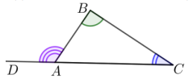

**Trijstūra laukuma aprēķināšanas formulas:**

$S_\Delta = \frac{ah_a}{2} = pr = \frac{abc}{4R} = \frac{1}{2}ab\sin\gamma = \sqrt{p(p-a)(p-b)(p-c)},$

kur $a,\ b,\ c$ – trijstūra malas, $\gamma$ – leņķis starp malām $a$ un $b$, $h_a$ – augstums, kas vilkts pret malu $a$, $p$ – trijstūra pusperimetrs, $r$ – ievilktās riņķa līnijas rādiuss, $R$ – apvilktās riņķa līnijas rādiuss.

**Regulārs trijstūris.** Ja regulāra trijstūra malas garums ir $a$, tad tā laukums $S_\Delta = \frac{a^2\sqrt{3}}{4}$, augstums $h = \frac{a\sqrt{3}}{2}$, ievilktās riņķa līnijas rādiuss $r = \frac{1}{3}h = \frac{a\sqrt{3}}{6}$, apvilktās riņķa līnijas rādiuss $R = \frac{2}{3}h = \frac{a\sqrt{3}}{3}$.

No taisnleņķa trijstūra taisnā leņķa virsotnes novilktais augstums $h_c$ sadala trijstūri divos taisnleņķa trijstūros, kas ir līdzīgi savā starpā un ir līdzīgi dotajam trijstūrim, (skat. 2. att.).

**Eiklīda teorēma.** Taisnleņķa trijstūra katete ir vidējais proporcionālais starp hipotenūzu un šīs katetes projekciju uz hipotenūzas. Taisnleņķa trijstūra augstums, kas novilkts no taisnā leņķa virsotnes, ir vidējais proporcionālais starp katešu projekcijām uz hipotenūzas. Ir spēkā šādas sakarības (skat. 2. att.):

$$h_c^2 = a_c \cdot b_c$$

$$a^2 = a_c \cdot c$$

$$b^2 = b_c \cdot c$$

$$\frac{a^2}{b^2} = \frac{a_c}{b_c}$$

**Sinusu teorēma.** Trijstūra malas ir proporcionālas to pretleņķu sinusiem (3. att.): $\frac{a}{\sin\alpha} = \frac{b}{\sin\beta} = \frac{c}{\sin\gamma} = 2R$.

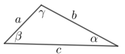

**Kosinusu teorēma.** Trijstūra jebkuras malas kvadrāts ir vienāds ar abu pārējo malu kvadrātu summu, no kuras atņemts divkāršots šo malu reizinājums ar ietvertā leņķa kosinusu:

$a^2 = b^2 + c^2 - 2bc\cos\alpha$

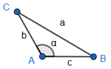

**Trijstūra mediānu īpašība.** Trijstūra mediānas krustojas vienā punktā, un krustpunkts katru mediānu dala attiecībā $2 : 1$, skaitot no trijstūra virsotnes, tas ir, $\frac{AM}{MD} = \frac{BM}{ME} = \frac{CM}{MF} = \frac{2}{1}$, kur $M$ ir mediānu krustpunkts (skat. 4. att.).

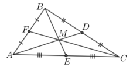

Mediānas, kas vilkta pret malu $b$, garuma aprēķināšana:

$m_b = \frac{1}{2}\sqrt{2a^2 + 2c^2 - b^2}$

Mediānas garuma aprēķināšanas formulu iegūst no sakarības starp paralelograma diagonālēm un malām $d_1^2 + d_2^2 = 2(a^2 + b^2)$.

**Trijstūra bisektrises īpašība.** Trijstūra leņķa bisektrise sadala pretējo malu nogriežņos, kuru attiecība ir vienāda ar šim leņķim atbilstošo piemalu attiecību, tas ir, $\frac{BD}{DC} = \frac{AB}{AC}$ (skat. 5. att.).

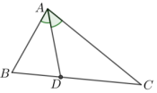

**Bisektrises garuma aprēķināšana.** Trijstūra bisektrises garuma kvadrāts ir vienāds ar divu malu garumu reizinājumu, no kura atņemts to trešās malas nogriežņu reizinājums, kuros dotā bisektrise sadala trešo malu:

$AD^2 = AB \cdot AC - BD \cdot DC$

### Metriskās sakarības riņķa līnijā

Caur jebkuru punktu $A$, kas atrodas ārpus riņķa līnijas, var novilkt tieši divas pieskares. Ja punkti $B$ un $C$ ir šo pieskaru pieskaršanās punkti un $O$ – attiecīgās riņķa līnijas centrs (skat. 6. att.), tad

- $AB = AC$ (pieskaru nogriežņi, kas novilkti no viena punkta, ir vienādi);
- $\angle BAO = \angle CAO$;
- $OB \perp AB$ un $OC \perp AC$.

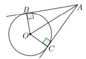

*Definīcija.* Par **hordu** sauc nogriezni, kas savieno divus riņķa līnijas punktus.

**Īpašības**

- Vienā riņķī hordas, kas savelk vienādus lokus, ir vienādas, un otrādi.
- Loki starp vienas riņķa līnijas divām paralēlām hordām ir vienādi.

**Teorēma par krustiskām hordām.** Ja divas hordas $AB$ un $CD$ krustojas punktā $M$, tad vienas hordas nogriežņu reizinājums ir vienāds ar otras hordas nogriežņu reizinājumu, tas ir, $AM \cdot MB = CM \cdot MD$ (skat. 7. att.).

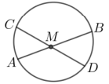

*Definīcija.* Par **sekanti** sauc taisni, kas krusto riņķa līniju divos dažādos punktos.

**Teorēma par pieskari un sekanti.** Ja pieskare un sekante ir novilktas no viena punkta, tad pieskares nogriežņa garuma kvadrāts ir vienāds ar visa sekantes nogriežņa garuma un sekantes ārējās daļas nogriežņa garuma reizinājumu, tas ir, $AB^2 = AC \cdot AD$ (skat. 8. att.).

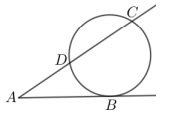

**Secinājums (sekanšu īpašība).** No punkta $A$ var novilkt bezgalīgi daudz sekanšu, un katras sekantes ārējās daļas garuma reizinājums ar visa sekantes nogriežņa garumu ir vienāds ar pieskares nogriežņa garuma kvadrātu, tātad $AC \cdot AD = AE \cdot AF$ (skat. 9. att.).

### Leņķi riņķa līnijā

*Definīcija.* Par **centra leņķi** sauc leņķi, kura virsotne atrodas riņķa līnijas centrā, bet malas krusto riņķa līniju.

Centra leņķa lielums ir vienāds ar tā loka leņķisko lielumu, uz kuru tas balstās, tas ir, $\angle AOB = \overset{\frown}{AmB}$ (skat. 10. att.).

*Definīcija.* Par riņķa līnijā **ievilktu leņķi** sauc leņķi, kura virsotne atrodas uz riņķa līnijas, bet malas krusto riņķa līniju.

**Teorēma.** Ievilkta leņķa lielums ir vienāds ar pusi no tā loka leņķiskā lieluma, uz kuru tas balstās, tas ir, $\angle ACB = \frac{1}{2}\overset{\frown}{AmB}$ (skat. 10. att.).

**Secinājumi**

- Visi ievilktie leņķi, kas balstās uz vienu un to pašu loku, ir vienādi, piemēram, $\angle ACB = \angle ADB$ (skat. 10. att.).
- Leņķi, kas balstās uz vienas riņķa līnijas vienāda garuma hordām, ir vienādi, un otrādi.
- Ievilkts leņķis, kas balstās uz diametru, ir $90^\circ$, un otrādi – ja ievilkts leņķis ir taisns, tad tas balstās uz diametru.

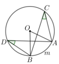

*Definīcija.* Leņķi, kura virsotne atrodas uz riņķa līnijas, viena mala satur hordu, bet otra mala atrodas uz pieskares, sauc par **hordas-pieskares leņķi**.

**Teorēma.** Hordas-pieskares leņķa lielums ir vienāds ar pusi no tā loka leņķiskā lieluma, kuru ietver leņķa malas, tas ir, $\angle ABC = \frac{1}{2}\overset{\frown}{BmC}$ (skat. 11. att.).

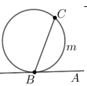

### Ievilkti un apvilkti trijstūri un četrstūri

Trijstūra malu vidusperpendikulu krustpunkts ir trijstūrim apvilktās riņķa līnijas centrs (skat. 12. att.), bet trijstūra bisektrišu krustpunkts ir trijstūrī ievilktās riņķa līnijas centrs (skat. 13. att.).

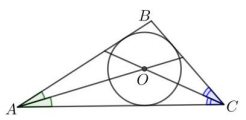

Taisnleņķa trijstūrī ievilktās riņķa līnijas rādiusu $r$ aprēķina pēc formulas $r = \frac{a+b-c}{2}$, kur $a$ un $b$ ir katetes un $c$ ir hipotenūza.

*Definīcija.* Par riņķa līnijai **apvilktu četrstūri** sauc četrstūri, kura visas malas pieskaras riņķa līnijai.  
Attiecīgi riņķa līniju sauc par četrstūrī ievilktu riņķa līniju. Ievilktās riņķa līnijas centrs atrodas četrstūra leņķu bisektrišu krustpunktā (skat. 14. att.).

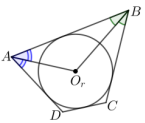

**Teorēma.** Izliektu četrstūri $ABCD$ var apvilkt ap riņķa līniju tad un tikai tad, ja tā pretējo malu garumu summas ir vienādas $AB + CD = BC + AD$.

*Definīcija.* Par riņķa līnijā **ievilktu četrstūri** sauc četrstūri, kura visas virsotnes atrodas uz riņķa līnijas.  
Attiecīgi riņķa līniju sauc par četrstūrim apvilktu riņķa līniju. Apvilktās riņķa līnijas centrs atrodas četrstūra malu vidusperpendikulu krustpunktā (skat. 15. att.).

Visbiežāk tiek lietota šāda teorēma par ievilktu četrstūri.  
**Teorēma.** Ap četrstūri var apvilkt riņķa līniju tad un tikai tad, ja četrstūra pretējo leņķu lielumu summa ir $180^\circ$.

Izmanto arī citas teorēmas, lai pamatotu, ka ap četrstūri var apvilkt riņķa līniju.

**Teorēma.** Ap četrstūri $ABCD$ var apvilkt riņķa līniju tad un tikai tad, ja $\angle ACB = \angle BDA$ (skat. 16. att.).

**Teorēma.** Ap četrstūri var apvilkt riņķa līniju tad un tikai tad, ja ir spēkā vienādība $AM \cdot MC = BM \cdot MD$, kur $M$ ir nogriežņu $AC$ un $BD$ krustpunkts (skat. 17. att.).

## Kombinatorika

### Saskaitīšanas, reizināšanas likums

*Tiks papildināts.*

### Svēršanas uzdevumi, turnīri

*Skat. (6), (9), uzdevumi arī (10).*

Svēršanas uzdevumos galvenokārt izmantosim sviras svarus. Svariem ir divi svaru kausi. Svēršanā **neizmantosim** atsvarus. Svari **neparādīs** ķermeņu masu. Mēs varēsim tikai redzēt, vai abi svaru kausi ir līdzsvarā.  
Aplūkosim uzdevumus, kuros, izmantojot doto informāciju, galvenokārt tiks prasīts atrast vienu (vai vairākus) no pārējiem objektiem atšķirīgu objektu. Šo uzdevumu atrisinājumi lielākoties balstās uz loģisku spriedumu ceļā izveidotām objektu grupēšanas metodēm.

**Piemēri**

**1.** Dotas 9 pēc ārējā izskata vienādas monētas, no kurām viena ir viltota – tā ir vieglāka nekā citas. Kā ar divām svēršanām uz sviras svariem bez atsvariem atrast viltoto monētu, ja zināms, ka visu īsto monētu masas ir vienādas?

**Atrisinājums.** Sadalām šīs monētas trīs kaudzītēs pa 3 monētām katrā. Skaidrs, ka viltotā monēta atrodas vienā no šīm kaudzītēm. Pirmajā svēršanā salīdzinām divas no šīm kaudzītēm.

**(A)** Ja viena kaudzīte ir vieglāka nekā otra, tad viltotā (vieglākā) monēta ir šajā kaudzītē (skat. 18. att. (A)).

**(B)** Ja abām kaudzītēm ir vienāda masa, tad viltotā monēta ir trešajā, nesvērtajā kaudzītē (skat. 18. att. (B)).

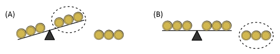

Tālāk apskatīsim tikai to kaudzīti, kurā ir viltotā monēta, pārējās kaudzītes vairs nav nepieciešamas. Otrajā svēršanas reizē uz svaru kausiem liekam pa vienai monētai no šīs kaudzītes.

**(A)** Ja viens svaru kauss ir vieglāks nekā otrs, tad uz tā atrodas viltotā monēta (skat. 19. att. (A)).

**(B)** Ja abi svaru kausi ir līdzsvarā, tad viltotā monēta ir tā, kas šajā svēršanas reizē netika svērta (skat. 19. att. (B)).

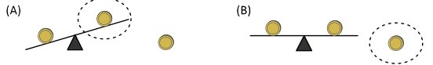

**2.** Šaha klubā ir 13 šahisti. Visu viņu spēles prasme ir atšķirīga un partijā vienmēr uzvar spēcīgākais. Kā, izspēlējot 15 partijas, noskaidrot gan pašu labāko, gan otru labāko šahistu šajā klubā?

**Atrisinājums.** Sākumā izveidojam 6 šahistu pārus (skat. 20. att.) un katrā pārī noskaidrojam labāko šahistu (6 partijas). Tad šos sešus labākos šahistus sadalām trīs pāros un katrā no šiem pāriem noskaidrojam labāko šahistu (3 partijas). Pirmos divus no atrastajiem trīs labākajiem šahistiem salīdzinām savā starpā un noskaidrojam labāko (1 partija), bet trešo no tiem salīdzinām ar to šahistu, kas līdz šim nav piedalījies nevienā šaha partijā un noskaidrojam labāko (1 partija). Visbeidzot labākie šahisti no pēdējām divām šaha partijām sacenšas savā starpā (1 partija). Tātad, izspēlējot $6 + 3 + 1 + 1 + 1 = 12$ šaha partijas, ir noskaidrots pats labākais šahists šajā klubā. Iepriekš parādījām, ka, izspēlējot 12 partijas, var noskaidrot uzvarētāju šajā klubā.

Otrs labākais šahists meklējams tikai un vienīgi no tiem 4 šahistiem, kas spēlējuši ar uzvarētāju un tam zaudējuši. Labākais no šiem četriem šahistiem atrodams, izspēlējot vēl 3 partijas, piemēram, salīdzinām divus šahistus (1 partija), labākais no tiem spēlē ar nākamo (1 partija), labākais šahists šajā partijā spēlē ar nākamo šahistu (1 partija). Tas nozīmē, ka ar $12 + 3 = 15$ šaha partijām var atrast pašu labāko un otro labāko šahistu.

*Piezīme.* b) gadījumā aprakstītais plāns reizē ir atrisinājums gan a), gan b) gadījumam. Rīkojoties pēc a) gadījumā aprakstītā plāna, nav iespējams, izspēlējot 15 partijas, atrast arī otru labāko šahistu.

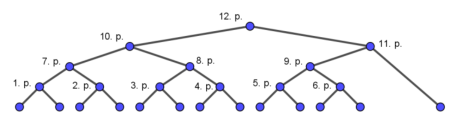

### Simetrijas spēles

*Skat. (6), (11), (12).*

Katrs spēlētājs sāk spēli ar mērķi uzvarēt. Lai uzvarētu, ir labi balstīties uz spēles stratēģiju, tas ir, uz paņēmienu kopumu, kas balstās uz loģiskiem spriedumiem un nosaka katra spēlētāja rīcību spēles laikā.  
Raksturīgākā pieļautā kļūda šādos uzdevumos ir viena vai dažu atsevišķu gadījumu apskatīšana, neņemot vērā visus iespējamos spēlētāju gājienus. Izstrādājot uzvarošo stratēģiju, tajā ir jāiekļauj visas iespējamās situācijas.  
Katru no tālāk dotajām spēlēm spēlēs divi spēlētāji. Gājiens tiek izdarīts pamīšus. Spēlētājs nedrīkst izlaist gājienu. Katrā šajā spēlē ir jānoskaidro, kurš no abiem spēlētājiem – pirmais spēlētājs (tas, kurš izdara pirmo gājienu) vai otrais spēlētājs (tas, kurš izdara otro gājienu) – vienmēr var uzvarēt, neatkarīgi no tā, kādus gājienus veic pretinieks.

**Piemērs**

Vienā horizontālā rindā savilktas **a)** 9 svītriņas (skat. 21. att.); **b)** 10 svītriņas (skat. 22. att.). Divi spēlētāji pamīšus izdara gājienus.  
Vienā gājienā var par krustiņu pārvērst

- vai nu vienu svītriņu,
- vai arī divas blakus esošās svītriņas.

Zaudē tas spēlētājs, kurš nevar izdarīt gājienu, tas ir, nevar atbilstoši noteikumiem, svītriņu pārvērst par krustiņu. Kurš spēlētājs – pirmais vai otrais – vienmēr var uzvarēt?

**Atrisinājums.** Šajā spēlē gan a), gan b) gadījumā vienmēr var uzvarēt pirmais spēlētājs. Aprakstīsim, kā jārīkojas pirmajam spēlētājam, lai noteikti uzvarētu.

**a)** Pirmajam spēlētājam savā pirmajā gājienā par krustiņu jāpārvērš vidējā svītriņa (skat. 23. att.). Nākamos gājienus pirmais spēlētājs izdara simetriski pretinieka tikko izdarītajam gājienam attiecībā pret vidējo krustiņu. Piemēram, ja pretinieks savā gājienā par krustiņu pārvērš vienu svītriņu, pirmais spēlētājs to pašu izdara ar simetrisko svītriņu otrā pusē no vidējā krustiņa (skat. 24. att.). Ja otrais spēlētājs varēs izdarīt gājienu, tad arī pirmais spēlētājs to varēs izdarīt. Līdz ar to gājieni pietrūks otrajam spēlētājam un viņš zaudēs.

**b)** Pirmajam spēlētājam savā pirmajā gājienā par krustiņu jāpārvērš divas vidējās svītriņas (skat. 25. att.). Nākamos gājienus pirmais spēlētājs izdara simetriski pretinieka tikko izdarītajam gājienam attiecībā pret diviem vidējiem krustiņiem. Ja otrais spēlētājs varēs izdarīt gājienu, tad arī pirmais spēlētājs to varēs izdarīt. Līdz ar to gājieni pietrūks otrajam spēlētājam un viņš zaudēs.

### Maģiskās konfigurācijas

*Skat. (6), uzdevumi arī (13).*

Kvadrātu, kuram katrā rindā, katrā kolonnā un katrā diagonālē ierakstīto skaitļu summa ir viena un tā pati (skat., piemēram, 26. att.) sauc par maģisko kvadrātu. Arī citas figūras, kurām uz noteiktām taisnēm uzrakstīto skaitļu summa ir viena un tā pati, mēdz dēvēt par maģiskām. Visas šādas figūras kopā sauc par maģiskām konfigurācijām.

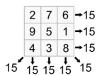

**Piemēri**

**1.** Tabula sastāv no $3 \times 3$ rūtiņām. Katrā rūtiņā ierakstīts kāds skaitlis. Kolonnās ierakstīto skaitļu summas ir $32,\ 34,\ 35$. Divās rindās ierakstīto skaitļu summas ir $42$ un $27$. Kāda ir trešajā rindā ierakstīto skaitļu summa?

**Atrisinājums.** Saskaitot visās kolonnās ierakstīto skaitļu summas, iegūsim visu tabulā ierakstīto skaitļu summu. Arī saskaitot visās rindās ierakstīto skaitļu summas, iegūsim visu tabulā ierakstīto skaitļu summu. Tāpēc trešajā rindiņā ierakstīto skaitļu summa ir $(32 + 34 + 35) - (42 + 27) = 32$.

**2.** Vai katrā aplītī (skat. 27. att.) var ierakstīt naturālu skaitli no 1 līdz 10 (katru tieši vienu reizi) tā, lai visas summas katriem trijiem skaitļiem, kas ierakstīti uz vienas taisnes esošos aplīšos, būtu savā starpā vienādas?

**Atrisinājums.** Uz katras taisnes esošo trīs skaitļu summu apzīmēsim ar $S$, un aplīšos ierakstītos skaitļus apzīmēsim tā, kā parādīts 28. att.

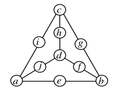

Ievērojam, ka skaitļi $a, b, c, d$ sastopami pavisam uz trīs taisnēm, bet visi pārējie skaitļi – katrs tieši uz vienas taisnes. Tāpēc, saskaitot uz visām sešām taisnēm uzrakstīto skaitļu summas, iegūstam

$\color{blue}{3a + 3b + 3c + 3d + e + f + g + h + i + j = 6S.}$

Tā kā visu desmit skaitļu no 1 līdz 10 summa ir 55, tad iegūstam

$\color{blue}{2a + 2b + 2c + 2d + a + b + c + d + e + f + g + h + i + j = 6S;}$

$\color{blue}{2a + 2b + 2c + 2d + 55 = 6S;}$

$\color{blue}{2(a + b + c + d) + 55 = 6S.}$

Ievērojam, ka skaitlis 55 ir nepāra skaitlis, bet $2(a + b + c + d)$ un $6S$ – pāra skaitļi. Esam ieguvuši pretrunu, tāpēc uzdevumā prasīto izdarīt nav iespējams.

### Grafi

*Skat. (14), (15), (16), (17), (18), (19), (10).*

### Rekurentas virknes, sakarības

*Skat. (6), (4)*

Viens no virkņu uzdošanas veidiem ir definēt to rekurenti, tas ir, norādot virknes pirmo locekli vai dažus pirmos locekļus (sākuma nosacījumus) un formulu, ar kuras palīdzību jebkuru virknes locekli var iegūt no iepriekšējā vai dažiem iepriekšējiem virknes locekļiem. Vienkāršākie šādu rekurentu virkņu piemēri ir aritmētiskā progresija $(a_{n+1} = a_n + d)$ un ģeometriskā progresija $(b_{n+1} = b_n \cdot q)$.

Cits tipisks un labi pazīstams rekurentas virknes piemērs ir Fibonači skaitļu virkne $F_n$, kuru definē ar sakarībām $F_1 = F_2 = 1$ un $F_{n+2} = F_n + F_{n+1}$, tas ir, virknes pirmie divi locekļi ir vienādi ar 1, bet katrs nākamais ir iegūstams kā divu iepriekšējo locekļu summa. Aprēķinot arī nākamos virknes locekļus, iegūstam virkni

$1;\ 1;\ 2;\ 3;\ 5;\ 8;\ 13;\ 21;\ \ldots$

No otras puses, lai aprēķinātu šādā veidā definētas virknes, teiksim, 2018. locekli, būtu vispirms jāaprēķina visi iepriekšējie virknes locekļi. Tādēļ reizēm ir izdevīgi rekurenti definētai virknei atrast vispārīgā locekļa formulu, kas būtu atkarīga tikai no locekļa kārtas numura. Reizēm tas ir vienkārši (piemēram, ja virkne ir rekurenti definēta ar $a_1 = 2$ un $a_n = 2a_{n-1}$, tad virknes vispārīgā locekļa formula ir $a_n = 2^n$), reizēm – kā Fibonači virknes gadījumā – tas ir grūtāk, taču iespējami.

Ir uzdevumi, kurus iespējams atrisināt, ja izdodas parādīt, ka uzdevuma atbilde ir rekurentas virknes loceklis, turklāt šai virknei var atrast gan rekurences sakarību, gan sākuma nosacījumus. Bieži vien tie ir uzdevumi, kuros tiek prasīts noteikt kādu objektu skaitu, kas atkarīgi no parametra $n$, turklāt

- ir iespējams parādīt, kā šos objektus var iegūt no tāda paša veida objektiem, taču ar mazāku parametra $n$ vērtību;
- ja parametra $n$ vērtība ir maza (piemēram, $n = 0$, $n = 1$ vai $n = 2$), tad ir viegli saskaitīt vajadzīgā veida objektus.

**Piemērs**

No mājām līdz ieejai dzīvoklī ir 12 pakāpieni. Ar vienu soli var pārkāpt 1; 2 vai 3 pakāpienus. Cik dienas var kāpt atšķirīgos veidos?  
(Veidus uzskata par atšķirīgiem, ja atšķiras izdarīto soļu secība, piemēram, kāpt 2; 3; 1 pakāpienus un kāpt 1; 2; 3 pakāpienus ir divi atšķirīgi veidi.)

**Atrisinājums.** Ar $a_n$ apzīmējam, cik dažādos veidos var nokļūt uz $n$-tā pakāpiena. Iespējami trīs atšķirīgi gadījumi:

- uz $n$-tā pakāpiena ar vienu soli var nokļūt no $(n - 1)$-ā pakāpiena, uz kura var nokļūt $a_{n-1}$ veidos;
- uz $n$-tā pakāpiena ar vienu soli var nokļūt no $(n - 2)$-ā pakāpiena, uz kura var nokļūt $a_{n-2}$ veidos;
- uz $n$-tā pakāpiena ar vienu soli var nokļūt no $(n - 3)$-ā pakāpiena, uz kura var nokļūt $a_{n-3}$ veidos.

Citu variantu, kā ar vienu soli nokļūt uz $n$-tā pakāpiena, nav. Tātad uz $n$-tā pakāpiena pavisam var nokļūt $a_n = a_{n-1} + a_{n-2} + a_{n-3}$ atšķirīgos veidos. Izmantojot šo sakarību un sākuma vērtības $a_1 = 1$ un $a_2 = 2$, aprēķinām $a_{12}$:

| $n$ | 1 | 2 | 3 | 4 | 5 | 6 | 7 | 8 | 9 | 10 | 11 | 12 |
|---|---:|---:|---:|---:|---:|---:|---:|---:|---:|---:|---:|---:|
| $a_n$ | 1 | 2 | 4 | 7 | 13 | 24 | 44 | 81 | 149 | 274 | 504 | 927 |

Līdz ar to atšķirīgos veidos var kāpt 927 dienas.

## Skaitļu teorija

Matemātikas apakšnozari, kas pēta veselo skaitļu dalāmību, sauc par skaitļu teoriju.

### Skaitļu dalāmība

*Skat. (6), (2), (20), (21), (22).*

Ja $a$ un $b$ ir veseli skaitļi, tad ne vienmēr, dalot $a$ ar $b$, dalījumā iegūst veselu skaitli. Ja dalījums ir vesels skaitlis, tad saka, ka $a$ dalās ar $b$, pretējā gadījumā saka, ka $a$ nedalās ar $b$.

**Definīcija.** Ja $b \ne 0$ un $a : b = k$, kur $a, b, k$ – veseli skaitļi, tad saka, ka $a$ dalās ar $b$. Pretējā gadījumā saka, ka $a$ nedalās ar $b$.

Piemēram, 15 dalās ar 3, bet 15 nedalās ar 2.

**Iegaumē!** Ja tiek runāts par skaitļu dalāmību, tad runa ir tikai par veseliem skaitļiem.

**Dalāmības pazīmes**  
Noskaidrot, vai viens vesels skaitlis dalās ar otru, tikai ar definīcijas palīdzību, tas ir, izdalot skaitļus, bieži vien ir neparocīgi un laikietilpīgi. Šo uzdevumu atvieglo skaitļu dalāmības pazīmes. Tālāk dotas biežāk lietotās dalāmības pazīmes.

| Dalāmības pazīme | Piemēri |
|---|---|
| Skaitlis dalās ar 2, ja tā pēdējais cipars ir pāra, tas ir, tā pēdējais cipars ir 0, 2, 4, 6 vai 8. | 2016 dalās ar 2, jo tā pēdējais cipars ir pāra |
| Skaitlis dalās ar 3, ja tā ciparu summa dalās ar 3. | 2016 dalās ar 3, jo $2 + 0 + 1 + 6 = 9$ dalās ar 3 |
| Skaitlis dalās ar 4, ja tā pēdējo divu ciparu veidotais skaitlis dalās ar 4. | 2016 dalās ar 4, jo 16 dalās ar 4 |
| Skaitlis dalās ar 5, ja tā pēdējais cipars ir 0 vai 5. | 2015 dalās ar 5, jo tā pēdējais cipars ir 5 |
| Skaitlis dalās ar 6, ja tas dalās gan ar 2, gan ar 3. | 2016 dalās ar 6, jo tas dalās ar 2 un 3 |
| Skaitlis dalās ar 8, ja tā pēdējo trīs ciparu veidotais skaitlis dalās ar 8. | 12800 dalās ar 8, jo 800 dalās ar 8 2016 dalās ar 8, jo pēdējo trīs ciparu veidotais skaitlis ir 16, kas dalās ar 8 |
| Skaitlis dalās ar 9, ja tā ciparu summa dalās ar 9. | 2016 dalās ar 9, jo $2 + 0 + 1 + 6 = 9$ dalās ar 9 |
| Skaitlis dalās ar 10, ja tā pēdējais cipars ir 0. | 150 dalās ar 10, jo tā pēdējais cipars ir 0 |
| Skaitlis dalās ar 11, ja tā ciparu summas, kas atrodas nepāra pozīcijās, un ciparu summas, kas atrodas pāra pozīcijās, starpība dalās ar 11. | 108647 dalās ar 11, jo $(1 + 8 + 4) - (0 + 6 + 7) = 0$, kas dalās ar 11 94831 dalās ar 11, jo $(9 + 8 + 1) - (4 + 3) = 11$, kas dalās ar 11 |

Citas dalāmības pazīmes

- Skaitlis dalās ar $10^n$, ja tā pēdējo $n$ ciparu veidotais skaitlis dalās ar $10^n$.
- Skaitlis dalās ar $2^n$, ja tā pēdējo $n$ ciparu veidotais skaitlis dalās ar $2^n$.
- Skaitlis dalās ar $5^n$, ja tā pēdējo $n$ ciparu veidotais skaitlis dalās ar $5^n$.

Kombinējot iepriekš dotās pazīmes, var iegūt arī pazīmes dalāmībai ar citiem skaitļiem. Piemēram, skaitlis dalās ar 12, ja tas dalās ar 3 un 4; skaitlis dalās ar 90, ja tas dalās ar 9 un 10 jeb skaitļa ciparu summa dalās ar 9 un tā pēdējais cipars ir nulle. Šādi pazīmes veido, doto dalītāju sadalot reizinātājos, kas ir savstarpēji pirmskaitļi un pārbaudot dalāmību ar katru no tiem.

**Definīcija.** Par savstarpējiem pirmskaitļiem sauc skaitļus, kam lielākais kopīgais dalītājs ir skaitlis 1.

**Piemērs.** Ja skaitlis dalās ar 2 un 6, mēs nevaram apgalvot, ka tas dalās arī ar $2 \cdot 6 = 12$, piemēram, 18 dalās gan ar 2, gan ar 6, bet 18 nedalās ar 12. Tāpēc ir ļoti svarīgi, lai reizinātāji būtu savstarpēji pirmskaitļi.

**Teorēma.** Ja $b$ un $c$ ir savstarpēji pirmskaitļi un $a$ dalās ar $b$ un $a$ dalās ar $c$, tad $a$ dalās ar $bc$.

**Piemēri**

**1.** Rindā viens aiz otra bez tukšumiem ir uzrakstīti pēc kārtas sekojoši naturāli skaitļi no 1 līdz $N$, tādējādi veidojot vienu lielu skaitli. (Piemēram, ja $N = 12$, tad ir uzrakstīts skaitlis 123456789101112.). Kāds ir mazākais iegūtais skaitlis, kas dalās ar **a)** 8; **b)** 18?

**Atrisinājums.** **a)** Skaitlis dalās ar 8, ja tā pēdējo trīs ciparu veidotais skaitlis dalās ar 8. Pārbaudot trīs ciparu veidotos skaitļus iegūstam, ka mazākais skaitlis, kas dalās ar 8, ir 123456.

**b)** Lai skaitlis dalītos ar 18, tam vienlaicīgi jādalās ar 2 un 9. Pirmais skaitlis, kas dalās ar 9 (pārbaudām pēc ciparu summas), ir 12345678. Tā kā šis ir arī pāra skaitlis, tad tas dalās ar 2 un līdz ar to tas dalās arī ar 18, jo skaitļi 2 un 9 ir savstarpēji pirmskaitļi. Tātad mazākais skaitlis, kas apmierina uzdevuma nosacījumus, ir 12345678.

**2.** Dots naturāls skaitlis, kas dalās ar 99 un kura pēdējais cipars nav 0. Pierādi, ka, uzrakstot šī skaitļa ciparus pretējā secībā, arī iegūst skaitli, kas dalās ar 99.

**Atrisinājums.** Ja skaitlis dalās ar 99, tad tas vienlaicīgi dalās gan ar 9, gan 11. Skaitlis dalās ar 9 tad un tikai tad, ja tā ciparu summa dalās ar 9. Uzrakstot ciparus pretējā secībā, ciparu summa nemainīsies un arī iegūtais skaitlis dalīsies ar 9. Skaitlis dalās ar 11 tad un tikai tad, ja tā pāra un nepāra pozīcijās esošo ciparu summu starpība dalās ar 11. Pārrakstot skaitļa ciparus pretējā secībā, minētā īpašība saglabājas – pāra un nepāra pozīcijās esošo ciparu summu starpība dalīsies ar 11 un, tātad, arī šis skaitlis dalīsies ar 11. Tā kā skaitlis vienlaicīgi dalās gan ar 9, gan 11 un skaitļi 9 un 11 ir savstarpēji pirmskaitļi, tad iegūtais skaitlis dalās arī ar 99.

### Vienādojumi veselos skaitļos

*Skat. (6), (2) – zem virsraksta “Pretrunas modulis”, arī (20).*

Dažreiz, lai pamatotu, ka nav iespējams atrast tādus skaitļus, kam izpildās uzdevumā prasītās īpašības, ir izdevīgi izmantot dalāmības īpašības.

**Dalāmības īpašības** (Visi tālāk minētie skaitļi ir veseli.)

- Ja katrs no vairākiem saskaitāmajiem dalās ar $n$, tad to visu summa dalās ar $n$.  
  Piemēram, $123456 + 7890 + 20152016$ dalās ar $2$, jo katrs saskaitāmais dalās ar $2$.
- Ja divi skaitļi dalās ar $n$, tad arī to starpība dalās ar $n$.  
  Piemēram, tā kā $201420152016$ un $2142020$ dalās ar $4$, tad ar $4$ dalās arī starpība $201420152016 - 2142020$.
- Ja kaut viens no vairākiem naturāliem skaitļiem dalās ar $n$, tad to visu reizinājums dalās ar $n$.  
  Piemēram, $2014 \cdot 2015 \cdot 2016$ dalās ar $5$, jo $2015$ dalās ar $5$.
- Ja vairāku skaitļu summa un visi skaitļi, izņemot vienu, dalās ar $n$, tad arī šis pēdējais skaitlis dalās ar $n$.  
  Piemēram, ja $x + 40 + 50 = 120$, tad, tā kā $40$, $50$ un $120$ dalās ar $10$, arī $x$ dalās ar $10$.

Uzdevumos izmantosim ideju:

**ja vienādības labā puse dalās ar $n$, tad arī vienādības kreisajai pusei jādalās ar $n$ (un otrādi).**

*Atceries!* Naturālie skaitļi: $1, 2, 3, 4, \ldots$; veselie skaitļi: $\ldots, -2, -1, 0, 1, 2, 3, \ldots$

**Piemēri**

**1.** Vai var atrast tādus veselus skaitļus $x$ un $y$, ka $12 \cdot x - 8 \cdot y = 2$?

**Atrisinājums.** Nē, nevar atrast. Gan $12$, gan $8$ dalās ar $4$, tātad arī $12 \cdot x$ un $8 \cdot y$ dalās ar $4$, kā arī to starpība dalās ar $4$. Tā kā vienādības kreisā puse dalās ar $4$, tad ar $4$ ir jādalās arī vienādības labajai pusei, taču skaitlis $2$ ar $4$ nedalās.

**2.** Kādus naturālus skaitļus var ievietot $x$ un $y$ vietā, lai iegūtu patiesu vienādību $5 \cdot x + 2 \cdot y = 30$?

**Atrisinājums.** Doto vienādojumu pārveidojam par $2 \cdot y = 30 - 5 \cdot x$. Tā kā vienādojuma labā puse dalās ar $5$, tad arī vienādojuma kreisajai pusei jādalās ar $5$, tas ir, $2 \cdot y$ jādalās ar $5$. Skaitlis $2$ ar $5$ nedalās, tātad $y$ jādalās ar $5$.

Ja $y = 5$, tad $2 \cdot 5 = 30 - 5 \cdot x$ jeb $x = 4$;  
ja $y = 10$, tad $2 \cdot 10 = 30 - 5 \cdot x$ jeb $x = 2$;  
ja $y \ge 15$, tad $x \le 0$ un tas vairs nav naturāls skaitlis.

Līdz ar to vai nu $x = 4$ un $y = 5$, vai $x = 2$ un $y = 10$.

# Skaitļa pieraksts

*Skat. (6), (10), arī (13)*

Risinot uzdevumus jāzina atšķirība starp skaitli un ciparu, jāzina, kas ir naturāls skaitlis, jāprot salīdzināt divus naturālus skaitļus, novērtēt izteiksmes vērtību.

**Ievēro!** Ja skaitlī nav zināmi kādi cipari, tos var apzīmēt ar burtiem, taču, lai nerastos pārpratumi, tādā gadījumā virs skaitļa tiek vilkta horizontāla svītra, piemēram, trīsciparu skaitlis $\overline{xyz}$, četrciparu skaitlis $\overline{abcd}$.

**Ievēro!** Divciparu skaitli varam izteikt kā $\overline{ab} = 10a + b$, trīsciparu skaitli – kā $\overline{abc} = 100a + 10b + c$ utt.  
Piemēram, $2016 = 1000 \cdot 2 + 100 \cdot 0 + 10 \cdot 1 + 1 \cdot 6$.

**Piemēri**

**1.** Atrodi vislielāko piecciparu skaitli, kuram ceturtais cipars (desmitu cipars) ir lielāks nekā piektais cipars (vienu cipars), trešais cipars lielāks nekā ceturtā un piektā cipara summa, otrais cipars ir lielāks nekā trešā, ceturtā un piektā cipara summa, bet pirmais cipars ir lielāks nekā visu pārējo ciparu summa!

**Atrisinājums.** Meklētais piecciparu skaitlis ir $95210$. Pamatosim, ka vēl lielāku skaitli nevar iegūt. Tā kā jāmeklē vislielākais skaitlis, tad pirmajam ciparam jābūt iespējami lielam, tas ir, $9$. Tātad pārējo četru ciparu summa nedrīkst pārsniegt $8$. Visiem cipariem jābūt dažādiem, jo katrs cipars ir lielāks nekā tam sekojošo ciparu summa. Tūkstošu cipars nevar būt lielāks kā $5$, jo jau $8 - 6 = 2$, ko nevar izteikt kā trīs dažādu ciparu summu. Tātad, lai atrastu lielāko piecciparu skaitli, tūkstošu ciparam jābūt $5$ un tas nozīmē, ka simtu, desmitu un vienu cipars attiecīgi var būt tikai $2$, $1$ un $0$. Līdz ar to lielākais piecciparu skaitlis, kam izpildās prasītās īpašības, ir $95210$.

**2.** Leonards izvēlējās patvaļīgu trīsciparu skaitli, pareizināja to ar $2$ un tam galā pierakstīja sākotnējo skaitli. Vai viņa iegūtais skaitlis noteikti dalās ar $23$?

**Atrisinājums.** Jā, noteikti dalās. Apzīmējam sākotnējo skaitli ar $\overline{abc}$. Skaitlim $2 \cdot \overline{abc}$ pierakstīt galā $\overline{abc}$ ir tas pats, kas skaitli $2 \cdot \overline{abc}$ reizināt ar $1000$ un tad pieskaitīt $\overline{abc}$. Tātad iegūstam skaitli $2 \cdot \overline{abc} \cdot 1000 + \overline{abc} = 2001 \cdot \overline{abc}$. Tā kā reizinātājs $2001$ dalās ar $23$ $(2001 : 23 = 87)$, tātad arī iegūtais skaitlis $2001 \cdot \overline{abc}$ noteikti dalās ar $23$.

### Kongruences

*Skat. (6), (2), (21), (22).*

**Teorēma par dalīšanu ar atlikumu.** Ja $a$ ir vesels skaitlis un $b$ ir naturāls skaitlis, tad noteikti var atrast tādus veselus skaitļus $q$ un $r$, ka $a = b \cdot q + r$, turklāt $0 \le r < b$.

**Iegaumē!** Atlikums nekad nav mazāks kā $0$ un vienmēr ir mazāks nekā skaitlis, ar kuru dala, tas ir, dalot ar $b$, atlikumam var būt vērtības $0, 1, 2, \ldots, b - 1$.

**Definīcija.** Doti veseli skaitļi $a$ un $b$ un naturāls skaitlis $m \ge 2$. Skaitļi $a$ un $b$ ir kongruenti pēc moduļa $m$ un pieraksta $a \equiv b \pmod m$ vai $a \equiv_m b$, ja $a$ un $b$, dalot tos ar $m$, dod vienādu atlikumu.

**Piemēram,** $7 \equiv 3 \pmod 2$, $17 \equiv 73 \pmod {14}$, $-2 \equiv 4 \pmod 3$.  
Bieži vien, lai pārbaudītu, vai skaitļi ir kongruenti pēc kāda moduļa, ir ērti lietot tālāk doto teorēmu.

**Teorēma.** $a \equiv b \pmod m$ tad un tikai tad, ja starpība $(a - b)$ dalās ar $m$.

**Kongruenču īpašības**

1. Ja $a$, dalot ar $m$, dod atlikumu $r$, tad $a \equiv r \pmod m$.
2. Ja $a \equiv b \pmod m$, tad $ka \equiv kb \pmod m$, kur $k$ ir jebkurš vesels skaitlis.
3. Ja $a \equiv b \pmod m$, tad $a^n \equiv b^n \pmod m$, kur $n$ ir jebkurš naturāls skaitlis.
4. Ja $a \equiv b \pmod m$ un $c \equiv d \pmod m$, tad
   - $a + c \equiv b + d \pmod m$,
   - $a - c \equiv b - d \pmod m$,
   - $ac \equiv bd \pmod m$.
5. Visiem veseliem $a$ izpildās kongruence $a \equiv a \pmod m$ (refleksivitāte).
6. Ja $a \equiv b \pmod m$, tad $b \equiv a \pmod m$ (simetrija).
7. Ja $a \equiv b \pmod m$ un $b \equiv c \pmod m$, tad $a \equiv c \pmod m$ (transitivitāte).

Uzdevumos par veselu skaitļu pakāpēm ar mainīgu vai lielu kāpinātāju var noderēt nākamā teorēma.

**Teorēma.** Virkne $x_n = a^n$ pēc moduļa $m$ ir periodiska.

Perioda garumu un tajā ietilpstošos skaitļus var atrast, rakstot pēc kārtas skaitļus $a^n$ pēc moduļa $m$. Tiklīdz virknē $a^n \pmod m$ parādās kāds jau bijis skaitlis, ir atrasts periods. Perioda garums nepārsniedz $m$.  
Tā kā kongruence pēc moduļa $m$ sadala visus veselos skaitļus $m$ klasēs, kur katrā klasē ietilpst skaitļi, kas dod vienādus atlikumus pēc moduļa $m$, tad īpašību, kas jāpierāda visiem veseliem skaitļiem, pietiek pierādīt katras klases skaitļiem atsevišķi.

**Piemēri**

**1.** Kādu atlikumu var iegūt, vesela skaitļa kvadrātu dalot ar $3$?

**Atrisinājums.** Ievērojam, ka veselu skaitli $n$, dalot ar $3$, var iegūt atlikumu $0$, $1$ vai $2$:

- ja $n \equiv 0 \pmod 3$, tad $n^2 \equiv 0^2 \equiv 0 \pmod 3$;  
- ja $n \equiv 1 \pmod 3$, tad $n^2 \equiv 1^2 \equiv 1 \pmod 3$;  
- ja $n \equiv 2 \pmod 3$, tad $n^2 \equiv 2^2 \equiv 4 \equiv 1 \pmod 3$.

Tātad vesela skaitļa kvadrātu, dalot ar $3$, var iegūt atlikumu $0$ vai $1$.

**2.** Kādu atlikumu dod skaitlis $3^{50}$, dalot to ar $7$?

**Atrisinājums.** Virkne $3^n$, $n = 0, 1, 2, \ldots$, ir periodiska pēc moduļa $7$, apskatīsim šīs virknes pirmos locekļus:

- ja $n = 0$, tad $3^0 \equiv 1 \pmod 7$;  
- ja $n = 1$, tad $3^1 \equiv 3 \pmod 7$;  
- ja $n = 2$, tad $3^2 \equiv 9 \equiv 2 \pmod 7$;   
- ja $n = 3$, tad $3^3 = 3^2 \cdot 3 \equiv 2 \cdot 3 \equiv 6 \pmod 7$;  
- ja $n = 4$, tad $3^4 = 3^3 \cdot 3 \equiv 6 \cdot 3 \equiv 18 \equiv 4 \pmod 7$;  
- ja $n = 5$, tad $3^5 = 3^4 \cdot 3 \equiv 4 \cdot 3 \equiv 12 \equiv 5 \pmod 7$;  
- ja $n = 6$, tad $3^6 = 3^5 \cdot 3 \equiv 5 \cdot 3 \equiv 15 \equiv 1 \pmod 7$;  
- ja $n = 7$, tad $3^7 = 3^6 \cdot 3 \equiv 1 \cdot 3 \equiv 3 \pmod 7$;  
- $\ldots$

Šo informāciju ērti apkopot tabulā:

| $n$ | $0$ | $1$ | $2$ | $3$ | $4$ | $5$ | $6$ | $7$ | ... |
|---|---:|---:|---:|---:|---:|---:|---:|---:|---:|
| $3^n \pmod 7$ | $1$ | $3$ | $2$ | $6$ | $4$ | $5$ | $1$ | $3$ | ... |

Redzam, ka virkne $3^n \pmod 7$ ir periodiska ar perioda garumu $6$. Tā kā $3^6 \equiv 1 \pmod 7$, tad secinām, ka $3^{50} = 3^{6 \cdot 8 + 2} \equiv 3^2 \equiv 2 \pmod 7$. Tātad skaitlis $3^{50}$ dod atlikumu $2$, dalot ar $7$.

## Risināšanas metodes

### Dirihlē princips

*Skat. (6), (18), (19), arī (23), (10), (8).*

Šī uzdevumu risināšanas metode jeb domāšanas paņēmiens tiek izmantots dažādās matemātikas apakšnozarēs, piemēram, skaitļu teorijā, ģeometrijā un kombinatorikā dažādu grūtības pakāpju uzdevumu atrisināšanai.

Tālāk doti vairāki **Dirihlē principa** varianti.

1. Ja vairāk nekā $n$ objekti jāsadala $n$ grupās, tad noteikti būs tāda grupa, kurā atradīsies vismaz $2$ objekti.
2. Ja vairāk nekā $m \cdot n$ objekti jāsadala $n$ grupās, tad noteikti būs grupa, kurā atradīsies vismaz $(m + 1)$ objekts.
3. Ja $n$ objekti sadalīti $n$ grupās tā, ka nevienā grupā nav vairāk kā viens objekts, tad katrā grupā ir tieši viens objekts.

*Piezīme.* Diezgan bieži Dirihlē principu formulē tā: „Ja vairāk nekā $n$ truši jāizvieto $n$ būros, tad vismaz vienā būrī nonāks vairāk nekā viens trusis – tātad vismaz 2 truši.”

Lietojot Dirihlē principu uzdevumu risināšanā, galvenais ir izdomāt, kas katrā uzdevumā būs **būri** un kas – **truši**. Katra uzdevuma **truši** un **būri** var būt dažādi lielumi, piemēram, **truši** var būt skaitļi, cilvēki utt., **būri** – īpašības, pēc kurām **truši** sadalās vairākās grupās; īpašībām jābūt tādām, ka katram **trusim** piemīt tieši viena no tām (katrs **trusis** var nonākt tikai vienā **būrī** un neviens **trusis** nedrīkst palikt ārpus **būriem**).

Ja Dirihlē princips tiek lietots skaitļu teorijas uzdevumu atrisināšanai, tad bieži vien tiek izmantota arī nākamā teorēma par starpības dalīšanos.

**Teorēma par starpības dalīšanos.** Dots, ka $a, b$ un $n$ – veseli skaitļi, turklāt $n > 0$. Starpība $(a - b)$ dalās ar $n$ tad un tikai tad, ja $a$ un $b$ dod vienādus atlikumus, dalot ar $n$.

Uzdevumu risinājumā var gan atsaukties uz Dirihlē principu, gan arī atrisinājumu veidot kā pierādījumu no pretējā. Abi šādi risinājumi ir pareizi (skat., piemēram, nākamo uzdevumu).

**Piemēri**

**1.** Pulciņā ir 13 skolēni. Pierādīt, ka no tiem var atrast tādus divus, kas dzimuši vienā un tajā pašā mēnesī!

**1. atrisinājums.** Ja katrā mēnesī būtu dzimis ne vairāk kā viens skolēns, tad visos mēnešos kopā būtu dzimuši ne vairāk kā 12 skolēnu, bet pulciņā ir 13 skolēni. Tātad noteikti ir tāds mēnesis, kurā dzimuši vismaz divi no šī pulciņa skolēniem.

**2. atrisinājums.** Šajā uzdevumā 13 skolēni ir jāsadala 12 grupās (mēnešos). Pēc Dirihlē principa noteikti būs mēnesis, kurā ir dzimuši vismaz divi skolēni, kas arī bija jāpierāda.

**2.** Pierādīt, ka no jebkuriem astoņiem naturāliem skaitļiem var izvēlēties tādus divus, kuru starpība dalās ar 7.

**Atrisinājums.** Naturāls skaitlis, dalot ar 7, var dot septiņus dažādus atlikumus: 0; 1; 2; 3; 4; 5; 6. Dotos astoņus skaitļus uzskatīsim par „trušiem”, savukārt vienā „būrī” ievietosim tos skaitļus, kas dod vienādus atlikumus, dalot ar 7, tātad ir 7 „būri”. Pēc Dirihlē principa vismaz vienā „būrī” nonāks vismaz divi „truši” jeb vismaz divi skaitļi dod vienādus atlikumus, dalot ar 7. Šo skaitļu starpība dalās ar 7 (izmantota teorēma par starpības dalīšanos).

**3.** Rūtiņu virsotnēs atzīmēti 16 balti punkti (skat. 29. att.). Vai tieši septiņus punktus var nokrāsot melnus tā, lai nekādi trīs vienā krāsā nokrāsoti punkti neatrastos uz vienas taisnes?

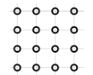

**Atrisinājums.** Nē, to nevar izdarīt. Ja melnā krāsā nokrāsoti tieši septiņi punkti, tad paliek deviņi balti punkti. Tā kā visi punkti izvietoti četrās rindās, tad pēc Dirihlē principa kādā no šīm rindām būs vismaz trīs balti punkti, bet tas ir pretrunā ar uzdevuma nosacījumiem.

# Invariantu metode

*Skat. teoriju un uzdevumus (6), (11), arī (23), (8), (10), tikai uzdevumus (3), (13), (15).*

**Invariants** – tas, kas paliek nemainīgs (kādā norisē, kādos apstākļos). Invariantu metode bieži ir lietojama tādu uzdevumu risināšanā, kuros tiek aplūkots kāds process – noteiktu darbību izpilde ar dotajiem lielumiem, un ir jāpierāda, ka no sākotnējiem datiem norādīto rezultātu **NAV** iespējams iegūt. Tad uzdevuma risinājumā var rīkoties pēc tālāk aprakstītā plāna.

**Invariantu metode**

Atrast piemērotu īpašību, kura

1. piemīt sākumā dotajiem lielumiem;
2. ir invarianta, tas ir, saglabājas, veicot pieļaujamās darbības;
3. nepiemīt tam lielumam, kas būtu jāiegūst galarezultātā.

Invariants atkarībā no uzdevuma var būt, piemēram, elementu skaits, summa, starpība, reizinājums, paritāte (būt pāra vai nepāra skaitlim), dalāmība ar 3, dalāmība ar 4, periodiskums.

**Piemēri**

**1.** Sākumā bija 10 papīra gabali. Dažus no tiem sagrieza vai nu 5, vai 7 daļās. Visus iegūtos gabalus sajauca un dažus no tiem atkal sagrieza vai nu 5, vai 7 daļās. Vai, tādā veidā turpinot, var iegūt tieši 999 papīra gabalus?

**Atrisinājums.** Ievērojam, ka sākumā bija doti 10 papīra gabali – pāra skaitlis. Ja papīra gabalu sagriež

- 5 daļās, tad kopējais gabalu skaits palielinās par 4 (par pāra skaitli), tātad tas bija pāra skaitlis un *paliek pāra skaitlis*, jo, saskaitot divus pāra skaitļus, iegūst pāra skaitli;
- 7 daļās, tad kopējais gabalu skaits palielinās par 6 (par pāra skaitli), tātad tas bija pāra skaitlis un *paliek pāra skaitlis*, jo, saskaitot divus pāra skaitļus, iegūst pāra skaitli.

Tātad kopējais papīra gabalu skaits *vienmēr būs pāra skaitlis*. Tā kā 999 ir *nepāra skaitlis*, tad tieši 999 papīra gabalus iegūt nevarēs.

**2.** Uz tāfeles uzrakstīts skaitlis 18. Ar vienu gājienu tam var vai nu pieskaitīt 6, vai atņemt 12. Vai, vairākas reizes izdarot šādus gājienus, var iegūt skaitli 2?

**Atrisinājums.** Sākumā dotais skaitlis dalās ar 3. Gan 6, gan 12 arī dalās ar 3. Ja skaitlim, kas dalās ar 3, pieskaita, vai no tā atņem skaitli, kas dalās ar 3, tad atkal iegūst skaitli, kas dalās ar 3, jo $3k \pm 3m = 3 \cdot (k \pm m)$. Tātad uz tāfeles visu laiku parādīsies tikai tādi skaitļi, kas dalās ar 3, bet beigās iegūstamais skaitlis 2 ar 3 nedalās. Tātad to nevar iegūt ar norādītajām darbībām.

**3.** Uz tāfeles uzrakstīti skaitļi $1;\ 2;\ 3;\ \ldots;\ 10$. Vienā gājienā var izvēlēties jebkurus divus no tiem un abiem pieskaitīt pa vieniniekam. Vai, atkārtojot šādus gājienus, var panākt, lai visi skaitļi kļūtu vienādi?

**Atrisinājums.** Sākumā doto skaitļu summa ir *nepāra skaitlis*: $1 + 2 + 3 + 4 + 5 + 6 + 7 + 8 + 9 + 10 = 55$. Katrā gājienā, pieskaitot pa vieniniekam diviem skaitļiem, visu skaitļu summa palielinās par 2 (par *pāra skaitli*). Pie nepāra skaitļa pieskaitot pāra skaitli, iegūst *nepāra skaitli*. Tātad visu skaitļu summa pēc katra gājiena paliek *nepāra skaitlis*.

Beigās prasīts iegūt desmit vienādus skaitļus, bet desmit vienādu skaitļu summa $10 \cdot x$ ir *pāra skaitlis*. Tātad nevar panākt, lai visi skaitļi kļūtu vienādi.

**4.** Bezgalīgu skaitļu virkni $1;\ 2;\ 3;\ 5;\ 8;\ 3;\ 1;\ 4;\ 5;\ 9;\ 4;\ 3;\ 7;\ 0;\ 7;\ 7;\ \ldots$ veido pēc šāda likuma: pirmie divi skaitļi ir 1 un 2, bet katrs nākamais skaitlis, sākot ar trešo, ir divu iepriekšējo skaitļu summas pēdējais cipars. Vai šajā skaitļu virknē kaut kur blakus atrodas skaitļi 2 un 4?

**Atrisinājums.** Pāra skaitļus apzīmēsim ar $p$, bet nepāra skaitļus – ar $n$. Ievērojam, ka $n + n = p$; $n + p = n$; $p + n = n$; $p + p = p$. Tā kā virknes locekļus nosaka divu iepriekšējo skaitļu summas pēdējais cipars, tad te veidojas šādi:

$\color{blue}{n;\ p;\ n;\ n;\ p;\ n;\ n;\ p;\ n;\ n;\ p;\ n;\ \ldots}$

Šajā virknē periodiski atkārtojas grupa $(n;\ p;\ n)$. Virknē nekur blakus neatrodas divi pāra skaitļi, tātad šajā virknē nekur blakus neatradīsies skaitļi 2 un 4.

# Invariantu metode – krāsošana

*Skat. (6), (18), (11), (15).*

Invariantu metodi var izmantot arī uzdevumos par figūru sagriešanu vai salikšanu. Šādos gadījumos bieži tiek izmantota iekrāsošana. Pats galvenais šāda tipa uzdevumos ir atrast tādu iekrāsošanas veidu, lai rastos pretruna – iekrāsoto rūtiņu skaits lielajā figūrā atšķirtos no kopējā iekrāsoto rūtiņu skaita mazajās figūrās.  
Rūtiņas var iekrāsot dažādi. Visbiežāk tiek lietota iekrāsošana kā šaha galdiņam, taču rūtiņas pēc nepieciešamības var iekrāsot arī, piemēram, joslās, diagonālēs vai vispār atrast kādu citu iekrāsošanas veidu. Figūras var iekrāsot gan divās, gan vairāk nekā divās krāsās.

**Piemēri**

**1.** Vai taisnstūri ar izmēriem $4 \times 11$ rūtiņas var noklāt ar 30. att. dotajām figūrām? Taisnstūrim jābūt pilnībā noklātam. Figūras nedrīkst iziet ārpus taisnstūra, figūras nedrīkst pārklāties, figūras drīkst pagriezt.

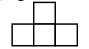

**

**Atrisinājums.** Nē, nevar. Taisnstūrī kopā ir 44 rūtiņas, bet vienā figūrā ir 4 rūtiņas. Tātad, ja uzdevuma prasības varētu izpildīt, taisnstūris būtu noklāts ar tieši 11 figūrām. Izkrāsosim taisnstūri šaha galdiņa veidā (skat. 31. att.); pavisam melnā krāsā ir nokrāsotas 22 (pāra skaits) rūtiņas. Lai kā arī šajā taisnstūrī tiktu novietota dotā figūra, tā noklāj vai nu tieši vienu melnu rūtiņu, vai tieši 3 melnas rūtiņas (skat. 32. att.), tātad nepāra skaita melnas rūtiņas. Tāpēc arī 11 (nepāra skaitlis) šādas figūras kopā var noklāt tikai nepāra skaita melnas rūtiņas. Tā kā nepāra skaitlis nevar būt vienāds ar pāra skaitli – melno rūtiņu skaitu visā taisnstūrī, tad taisnstūri pilnībā pārklāt nevar.

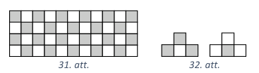

**2.** Vai kvadrātu ar izmēriem $6 \times 6$ rūtiņas var pārklāt ar 18 domino kauliņiem tā, lai 13 kauliņi atrastos horizontāli, bet 5 – vertikāli? Katrs kauliņš pārklāj tieši 2 rūtiņas, kauliņi nedrīkst pārklāties.

**Atrisinājums.** Nē, prasīto nevar izdarīt. Iekrāsosim doto kvadrātu joslās (skat. 33. att.). Tad kvadrātā ir 18 melnas un 18 baltas rūtiņas.

Vispirms izvietosim 5 vertikālos kauliņus. Lai kur katru no tiem novietotu, vienmēr tiks noklātas divas blakus rindu rūtiņas, tātad viena melna, viena balta (skat. 34. att.). Pēc piecu vertikālo kauliņu novietošanas būs noklātas 5 melnas un 5 baltas rūtiņas. Nenoklātas paliek 13 melnas un 13 baltas rūtiņas. Ar vienu horizontālu kauliņu var noklāt vai nu 2 baltas, vai 2 melnas rūtiņas, tas ir, pāra skaita melnas vai pāra skaita baltas (skat. 35. att.). Tātad ar 13 horizontālajiem kauliņiem var noklāt tikai pāra skaita melnas un pāra skaita baltas rūtiņas. Iegūta pretruna, jo pēc vertikālo kauliņu novietošanas vēl ir jānoklāj nepāra skaits melnās un nepāra skaits baltās rūtiņas.

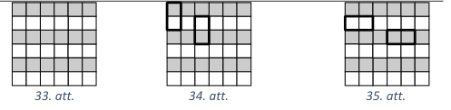

**3.** Vai kvadrātu ar izmēriem $9 \times 9$ rūtiņas var noklāt ar 26 figūrām, kādas dotas 36. att., un vienu 37. att. doto figūru? Kvadrātam jābūt pilnībā noklātam. Figūras nedrīkst pārklāties, figūras drīkst pagriezt.

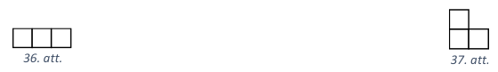

**Atrisinājums.** Nē, prasīto nevar izdarīt. Izkrāsosim kvadrātu trīs krāsās diagonālveidā (skat. 38. att.) tā, lai novietotā 37. att. figūra saturētu tieši divas vienas krāsas rūtiņas. Nezaudējot vispārīgumu, varam pieņemt, ka tā satur divas zilas un vienu sarkanu rūtiņu. Tādā gadījumā nenoklātas paliek 25 zilas, 26 sarkanas un 27 baltas rūtiņas, jo kvadrātā katras krāsas rūtiņu skaits ir 27. Katra 36. att. figūra noklāj vienu sarkanu, vienu zilu un vienu baltu rūtiņu. Tā kā nenoklātajā daļā dažādo krāsu rūtiņu skaits nav vienāds, tad ar 36. att. figūrām to noklāt nav iespējams.

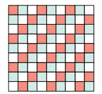

### Matemātiskās indukcijas metode

*Skat. (2), (24), (25)*

## Literatūras saraksts

1. Uzdevumu arhīvs. *LU A.Liepas NMS vietne.* [Tiešsaiste](https://www.nms.lu.lv/arhivs-un-materiali/uzdevumu-arhivs/).
2. *Neklātienes nodarbības vidusskolēniem. 1. daļa.* Kokainis, Mārtiņš, Kalugins, Emīls un Avotiņa, Maruta. Rīga : Latvijas Universitāte, 2020. ISBN 978-9934-18-509-0.
3. Andžāns, A., Boze, I. un Vanderlinds, P. *Matemātikas olimpiāžu minimums.* Cēsis : DA fonds, LU A.Liepas NMS, 1995.
4. Andžāns, A. un Markusa, I. *Vai vari atrisināt? Algebra.* Rīga : Apgāds "Zvaigzne ABC", 1996.
5. Andžāns, A., Ziļicka, T. un Treilībs, O. *Uzdevumi matemātikas olimpiādēs.* Rīga : Izdevniecība "Zvaigzne", 1977.
6. Avotiņa, Maruta un Zīlīte, Agnese. *Tematiskie uzdevumi matemātikas olimpiādēs.* Rīga : Latvijas Universitāte, 2019. ISBN 978-9934-18-432-1.
7. Ločmele, A., u.c. *Nevienādību pierādīšanas metodes.* Aizkraukle : Krauklītis, 1997. Pieejams arī: https://www.nms.lu.lv/arhivs-un-materiali/gramatas/tematiskas-gramatas/.
8. Andžāns, A. un Kreicberga, I. *Vai vari atrisināt?* Rīga : Zvaigzne, 1985.
9. Gailītis, A. un Andžāns, A. *Kārtošanas un meklēšanas uzdevumi.* Aizkraukle : Krauklītis, 1995.
10. Gingulis, E. *Attīstīsim savas matemātiskās spējas.* Rīga : Zvaigzne ABC, 1997.
11. Andžāns, A., u.c. *Invariantu metode. Invarianti procesos.* Rīga : Latvijas Universitāte, 1997. Pieejams arī: [https://www.nms.lu.lv/arhivs-un-materiali/gramatas/tematiskas-gramatas/](https://www.nms.lu.lv/arhivs-un-materiali/gramatas/tematiskas-gramatas/).
12. Kudapa, I. un Andžāns, A. Matemātiskās spēles. *(Pieejams Mykoob).* [Tiešsaiste]
13. Gingulis, E. *489 spici attapības un pacietības uzdevumi matemātikā.* Rīga : Apgāds Zvaigzne ABC.
14. Andžāns, A. un France, I. Grafu teorijas elementi vidusskolā. *(Pieejams Mykoob).* [Tiešsaiste]
15. Ambainis, A., Andžāns, A. un Bērziņš, A. Uzdevumi algoritmikā un algoritmiskajā kombinatorikā. 1.daļa. *(Pieejams Mykoob).* [Tiešsaiste]
16. Daugulis, P. Diskrētā matemātika. [Tiešsaiste] http://de.du.lv/matematika/daugulisdaugulis.html.
17. Ignatjevs, J. *Atjautības brīnumzemē.* Rīga : Avots, 1988.
18. Andžāns, A., u.c. *Dirihlē princips. Teorija, piemēri, uzdevumi.* Rīga : Mācību grāmata, 1994.
19. Andžāns, A., u.c. *Vidējās vērtības metode.* Rīga : Mācību grāmata, 1996.
20. Andžāns, A. *Algebra 10.-12. klasei II daļa.* Rīga : Apgāds Zvaigzne ABC, 1998.
21. Bērziņš, A. *Praktikums elementārajā skaitļu teorijā.* Rīga : Latvijas Universitāte, 1994.
22. Mihelovičs, Š. *Skaitļu teorija.* Daugavpils : DPU izdevniecība "Saule", 1996.
23. Andžāns, A. un Riekstiņš, E. *Atrisini pats!* Rīga : Zvaigzne, 1984.
24. Andžāns, A. un Zariņš, P. *Matemātiskās indukcijas metode un varbūtību teorijas elementi.* Rīga : Zvaigzne, 1983.
25. Andžāns, Agnis un Kanders, Uldis. *Matemātiskās indukcijas metode.* Rīga : Latvijas Universitāte, 1997.

