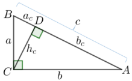
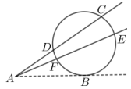
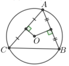
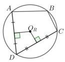
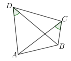
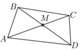

# Matemātikas olimpiāžu programma (2022)

## Ievads

Matemātikas olimpiāžu uzdevumu sastādīšanā tiks izmantoti VISC mājas lapā publicētie mācību priekšmetu programmu paraugi ([https://www.visc.gov.lv/lv/programmu-paraugi-vispareja-izglitiba](https://www.visc.gov.lv/lv/programmu-paraugi-vispareja-izglitiba)) un tur piedāvātā tematu secība.

Ņemot vērā matemātikas stundu skaitu nedēļā, 5.-9. klasei 2. posma olimpiādē tiks iekļauti jēdzieni un fakti, kas saistās ar zilā krāsā iekrāsotajiem tematiem (skat. Tematu secību 2. lpp.). *Papildus 7. klasē uz 2. posma olimpiādi skolēniem jāzina trijstūra iekšējo leņķu summa (fakts no 7.6. temata).* Olimpiādē netiek plānots iekļaut pamatskolas tēmas par varbūtību un statistiku.

Vidusskolai 10.-12. klasei olimpiādē tiks ievērota Matemātika I un Matemātika II tematu secība. *Papildus 10. klasē uz 2. posma olimpiādi nepieciešams apgūt svarīgākos jēdzienus un sakarības no ģeometrijas (skat. 7.-11. lpp.) un uz 3. posma olimpiādi nepieciešams apgūt matemātiskās indukcijas metodi.* Olimpiādē netiek plānots iekļaut šādas vidusskolas tēmas – robežas, atvasinājums, integrāļi, statistika, varbūtību teorija, kompleksie skaitļi.

Lai veiksmīgi piedalītos un sagatavotos matemātikas olimpiādēm un konkursiem, papildus skolas tēmām ieteicams apgūt olimpiādēs biežāk lietotās metodes un tēmas (skat. sarakstu 3.-4. lpp. un tēmu nelielu apskatu, sākot no 5. lpp.) atbilstoši skolēnu vecumposmam.

## Tematu secība

**5. klase**

|  |  |  |  |  |  |  |  |
|---|---|---|---|---|---|---|---|
| **5.1.** Kā dažādi pieraksta naturālos skaitļus? <em>20-24 stundas</em> | **5.2.** Kā lieto skaitļa sadalījumu reizinātājos? <em>22-26 stundas</em> | **5.3.** Kā skaidro un lieto daļas pamatīpašību? <em>20-24 stundas</em> | **5.4.** Kā vienu skaitli izsaka kā otra skaitļa daļu? <em>16-20 stundas</em> | **5.5.** Kā saskaita un atņem jauktus skaitļus? <em>14-18 stundas</em> | **5.6.** Kā nosaka figūru nezināmos lielumus? <em>20-24 stundas</em> | **5.7.** Kā lieto decimāldaļas un procentus? <em>22-26 stundas</em> | **5.8.** Kā vizuāli attēlo sakarību starp lielumiem? <em>11-13 stundas</em> |

**6. klase**

|  |  |  |  |  |  |  |  |
|---|---|---|---|---|---|---|---|
| **6.1.** Kā kopumu sadala noteiktā attiecībā? <em>18-22 stundas</em> | **6.2.** Kā reizina un dala parastās daļas? <em>22-26 stundas</em> | **6.3.** Kā izpratne par komata lietojumu palīdz, ja reizina un dala decimāldaļas? <em>22-26 stundas</em> | **6.4.** Kā attēlo un raksturo telpiskus ķermeņus? <em>22-26 stundas</em> | **6.5.** Kā sadzīves situācijās izmanto procentus? <em>18-22 stundas</em> | **6.6.** Kāpēc nepieciešami skaitļi, kuri ir mazāki nekā nulle? <em>28-32 stundas</em> | **6.7.** Ko nozīmē skaitlim pieskaitīt negatīvu skaitli, no skaitļa atņemt negatīvu skaitli? <em>24-28 stundas</em> | **6.8.** Kā plāno darbību izpildi ar visu veidu skaitļiem? <em>24-28 stundas</em> |

**7. klase**

|  |  |  |  |  |  |  |  |  |
|---|---|---|---|---|---|---|---|---|
| **7.1.** Kā nosaka kopas visus elementus, aprēķina notikuma varbūtību? <em>15-19 stundas</em> | **7.2.** Kā definē ģeometriskas figūras? <em>18-22 stundas</em> | **7.3.** Kā raksturo sakarību starp mainīgiem lielumiem? <em>10-12 stundas</em> | **7.4.** Kā pieraksta un pēta funkcijas, kuru grafiks ir taisne? <em>16-20 stundas</em> | **7.5.** Kā raksturo trijstūri, izmantojot tā elementus? <em>18-22 stundas</em> | **7.6.** Kādas ir sakarības starp lielumiem trijstūrī? <em>18-22 stundas</em> | **7.7.** Ko nozīmē pārveidot izteiksmi ar mainīgo lielumu? <em>14-18 stundas</em> | **7.8.** Kādi ir paņēmieni nezināmā noteikšanai? <em>18-22 stundas</em> | **7.9.** Kā salīdzina izteiksmes, kurās ir mainīgais lielums? <em>14-18 stundas</em> |

*7. klasē uz 2. posma olimpiādi jāzina trijstūra iekšējo leņķu summa.*

**8. klase**

|  |  |  |  |  |  |  |  |
|---|---|---|---|---|---|---|---|
| **8.1.** Kā matemātiski raksturo un analizē datus? <em>12-16 stundas</em> | **8.2.** Kā skaidro un lieto pakāpi ar veselu kāpinātāju? <em>18-22 stundas</em> | **8.3.** Kā rīkojas, ja skaitli nevar pierakstīt kā daļu? <em>24-28 stundas</em> | **8.4.** Kā aprēķina laukumu jebkuram trijstūrim, riņķim? <em>18-22 stundas</em> | **8.5.** Kas kopīgs četrstūriem, kuru pretējās malas ir pa pāriem paralēlas? <em>20-24 stundas</em> | **8.6.** Kā skaidro un izpilda darbības ar izteiksmēm? <em>18-22 stundas</em> | **8.7.** Kā dažādas funkcijas izmanto matemātiskai modelēšanai? <em>19-23 stundas</em> | **8.8.** Kā nosaka taisnleņķa trijstūra nezināmās malas garumu? <em>14-18 stundas</em> |

**9. klase**

|  |  |  |  |  |  |  |  |
|---|---|---|---|---|---|---|---|
| **9.1.** Kā definē un raksturo līdzīgus trijstūrus? <em>16-20 stundas</em> | **9.2.** Kas kopīgs četrstūriem, kuriem tieši divas malas ir paralēlas? <em>18-22 stundas</em> | **9.3.** Kā aprēķinos izmanto taisnleņķa trijstūra divu malu attiecību? <em>16-20 stundas</em> | **9.4.** Kā izmanto izteiksmju sadalīšanu reizinātājos? <em>20-24 stundas</em> | **9.5.** Kā skaidro un izmanto formulas darbā ar kvadrātvienādojumu, kvadrātfunkciju? <em>20-24 stundas</em> | **9.6.** Kā apraksta situācijas ar diviem nezināmiem lielumiem? <em>18-22 stundas</em> | **9.7.** Kā skaitļu virkni pieraksta ar formulu? <em>17-21 stundas</em> | **9.8.** Kā raksturo riņķa līnijas un daudzstūra savstarpējo novietojumu? <em>18-22 stundas</em> |

## Matemātikas olimpiādēs biežāk izmantoto tēmu saraksts

Zemāk dots matemātikas olimpiādēs biežāk izmantoto tēmu saraksts. Daļai no tām skolas matemātikas kursā tiek veltīts maz uzmanības, daļa no tēmām skolas matemātikas kursā vispār nav iekļauta. Sarakstā uzskaitītas tēmas gan pamatskolas, gan vidusskolas līmeņa matemātikas olimpiādēm. Skolotājam, izmantojot šo doto sarakstu jāņem vērā, ka matemātikas olimpiāžu uzdevumos tiks iekļautas tēmas atbilstoši skolēnu zināšanām, balstoties uz skolas matemātikas programmu paraugiem, piemēram, 5. klases skolēnam noteikti netiks prasīts pierādīt nevienādību, izmantojot pilno kvadrātu atdalīšanu. Bet skolotājam jāņem vērā, ka 5. klases skolēnam olimpiādē var tik iekļauta, piemēram, tāda tēma kā invariantu metode, jo tas neprasa specifiskas zināšanas no skolas matemātikas kursa, bet drīzāk ir domāšanas paņēmiens – risināšanas metode.

Uzdevumus parasti klasificē pēc diviem parametriem: matemātiskais objekts, par kuru tiek runāts uzdevumā, un risināšanas metode. Katrs uzdevums var nonākt vairākās sadaļās gan pēc viena, gan pēc otra parametra. Olimpiāžu uzdevumus var iedalīt grupās atkarībā no tā, kādai matemātikas apakšnozarei šie uzdevumi veltīti: algebrai, ģeometrijai, kombinatorikai, skaitļu teorijai.

Tām tēmām, kurām dota īsa teorija šī materiāla nākamajās nodaļās, kā arī norādes uz citiem materiāliem vai piemēri, iekavās norādīta lappuse, kurā šie materiāli ir iekļauti.  
Dažādu tēmu uzdevumi un to atrisinājumi pieejami arī LU A. Liepas NMS mājas lapas sadaļā 
[Grāmatas](https://www.nms.lu.lv/arhivs-un-materali/gramatas/)
(1) esošajās grāmatās, piemēram, mācību gada olimpiāžu un konkursu uzdevumu krājumos, kur grāmatas beigās dots uzdevumu sadalījums pa tēmām.

### Algebra

* Algebriski pārveidojumi
* Vienādojumi (5. lpp.)

  * Vienādojumu risināšanas paņēmieni
  * Vienādojumu pētīšana, tos nerisinot (tajā skaitā Vieta teorēma)
  
* Vienādojumu sistēmas
* Nevienādības, nevienādību sistēmas
* Nevienādību pierādīšana

  * Ekvivalentie pārveidojumi (tajā skaitā pilno kvadrātu atdalīšana) (5. lpp.)
  * Nevienādība starp vidējo aritmētisko un vidējo ģeometrisko (6. lpp.)
  * Nevienādības pastiprināšanas metode
  
* Skaitļu virknes

  * Aritmētiskā un ģeometriskā progresija
  * Skaitlisku virkņu īpašības (periodiskums, monotonitāte) (7. lpp.)
  
* Funkcijas un to pētīšana
* Polinomi (tajā skaitā polinoma racionālās saknes)

### Ģeometrija

* Ģeometrijas pamatjēdzieni
* Daudzstūri, to īpašības, pazīmes (7. lpp.)
* Riņķa līnija un riņķis (9., 9. lpp.)

  * ar riņķa līniju saistītie leņķi
  * ar riņķa līniju saistītās taisnes un nogriežņi
  * riņķa sektors, segments
  
* Ievilkti un apvilkti daudzstūri (10. lpp.)
* Ģeometriskie pārveidojumi (simetrija, paralēlā pārnese, pagrieziens, homotētija)
* Analītiskā ģeometrija
* Figūru sagriešana un salikšana
* Invariantu metode, krāsošana (19. lpp.)

### Kombinatorika

* Objektu skaitīšana

  * kombinatorikas reizinājuma likums un saskaitīšanas likums
  * kombinācijas, variācijas, permutācijas
  * Ņūtona binoms un binomiālie koeficienti
  * rekurentas sakarības, virknes (13. lpp.)
  
* Grafi

  * interpretācijas ar grafu palīdzību
  * grafa virsotņu pakāpe
  * grafi ar krāsainām šķautnēm, virsotnēm
  
* Kombinatoriskās struktūras

  * apakškopu sistēmas (visu apakškopu skaits, Eilera-Venna diagrammas)
  * maģiskie skaitļu kvadrāti vai citas konfigurācijas (13. lpp.)
  
* Invariantu metode (18. lpp.)
* Dirihlē princips (17. lpp.)
* Matemātiskās spēles

  * spēles ar simetrijas stratēģiju (11. lpp.)
  * prom ņemšanas spēles
  * spēles modeļa veidošana (rūtiņu režģī, grafā)
  
* Meklēšanas un kārtošanas algoritmi (svēršanas uzdevumi, turnīri) (11. lpp.)
* Uzdevumi, par izteikumu patiesumu | 

### Skaitļu teorija

* Skaitļu rēbusi
* Skaitļu dalāmība (atlikumi, dalāmības pazīmes un īpašības) (14)
* Pirmskaitļi, skaitļa sadalījums pirmreizinātājos (14)
* Kongruences (16)

  * kongruence pēc moduļa $n$
  * periodiskas atlikumu virknes

* Vienādojumi veselos skaitļos (15)

  * sadalīšana reizinātājos
  * vienādojuma abu pušu salīdzināšana
  
* Skaitļa decimālais pieraksts (16)
* Dirihlē princips (atlikumi) (17)
* Invariantu metode (invariants – dalāmība, summa, reizinājums) (18)
* Matemātiskās indukcijas metode

# Īsa teorija, piemēri, uzdevumi

Matemātikas olimpiāžu un konkursu uzdevumi lielākoties būtiski atšķiras no matemātikas stundās risinātajiem uzdevumiem.  
Lai gan uzdevumu risināšanai nepieciešamās matemātisko faktu zināšanas pārsvarā nepārsniedz skolas kursā apgūstamās, īpaši jau jaunāko klašu skolēniem, tomēr šo uzdevumu risināšanā bieži vien jālieto tādi spriešanas paņēmieni, kas mācību stundās netiek apskatīti. Līdzīgi, kā mācību stundās piedāvātajiem uzdevumiem, arī olimpiāžu uzdevumu risināšanai ir dažādas metodes. Vienīgā atšķirība, ka reizēm, pat zinot, ar kādu metodi konkrētais uzdevums ir risināms, ir grūti saskatīt, tieši kādā veidā šo metodi lietot. Kaut arī šādu uzdevumu risināšanai biežāk izmantotās metodes vairāk ir pašsaprotami domāšanas paņēmieni, nenoliedzami, ka skolēni, kas pārzina šīs risināšanas metodes, ir ieguvēji salīdzinājumā ar tiem, kas par šādu metožu pastāvēšanu vispār nav pat iedomājušies.  
Atšķiras ne tikai risināšanas paņēmieni, bet arī tas, kā jānoformē uzdevuma atrisinājums. Tieši nezinot vai nejūtot nepieciešamo uzdevuma risinājuma struktūru, neprotot korekti pierakstīt uzdevuma atrisinājumu, skolēni par risinājumu neiegūst maksimālo punktu skaitu, bet iespējams, ka būtu spējuši to iegūt, ja būtu zinājuši, kas vēl ir nepieciešams.  
Šajā nodaļā katram tematam uzreiz aiz virsraksta uzskaitīta literatūra, kur par attiecīgo tēmu uzzināt vairāk, dota īsa teorija vai piemēri ar atrisinājumiem. Daļu no norādītajiem literatūras avotiem var atrast arī elektroniska formā 
[NMS mājas lapā](https://www.nms.lu.lv/).

## Algebra

### Vienādojumi

*Skat. (2), (3), (4), (5).*

### Nevienādību pierādīšana – ekvivalenti pārveidojumi, pilno kvadrātu atdalīšana

*Skat. (6), (7), (2), (4), (3), (5).*

**Pierādīt nevienādību** ar vienu vai vairākiem mainīgajiem nozīmē pamatot, ka nevienādība ir patiesa pie *jebkurām* pieļaujamajām mainīgo vērtībām.

Divas nevienādības sauc par **ekvivalentām**, ja tām ir viena un tā pati atrisinājumu kopa.

Bieži vien nevienādības pierāda, izmantojot ekvivalentus pārveidojumus. Tādējādi iegūst nevienādību, kuras patiesums ir acīmredzams vai viegli noskaidrojams ar elementāru spriedumu palīdzību.

**Nevienādību ekvivalenti pārveidojumi**

- Nevienādības kādu pusi aizstāj ar tai identisku izteiksmi.
- Nevienādības abām pusēm pieskaita vienu un to pašu skaitli vai izteiksmi, kas nemaina nevienādības definīcijas apgabalu.
- Nevienādības abas puses reizina vai dala ar vienu un to pašu pozitīvu skaitli (vai izteiksmi, kas ir pozitīva visām mainīgo vērtībām).
- Nevienādības abas puses reizina vai dala ar vienu un to pašu negatīvu skaitli (vai izteiksmi, kas ir negatīva visām mainīgo vērtībām).
- Nevienādības abas puses kāpina kvadrātā vai velk kvadrātsakni, ja definīcijas apgabalā dotās nevienādības abas puses ir negatīvas.
- Nevienādības abas puses kāpina $m$-tajā pakāpē vai velk $m$-tās pakāpes sakni, kur $m$ ir naturāls nepāra skaitlis.
- Nevienādības abas puses kāpina $m$-tajā pakāpē vai velk $m$-tās pakāpes sakni, kur $m$ ir naturāls pāra skaitlis un definīcijas kopā dotās nevienādības abas puses ir nenegatīvas.

**Pilno kvadrātu atdalīšana**

Viens no ekvivalento pārveidojumu veidiem ir pilno kvadrātu atdalīšana. Lai atdalītu pilno kvadrātu, izmanto saīsinātās reizināšanas formulas:

- $(a + b)^2 = a^2 + 2ab + b^2;$
- $(a - b)^2 = a^2 - 2ab + b^2;$
- $(a + b + c)^2 = a^2 + b^2 + c^2 + 2ab + 2ac + 2bc.$

Bieži vien tikai ar formulu izmantošanu nepietiek, tāpēc jāizmanto arī spriedumi. Visbiežāk izmantotie ir šādi:

- ja $A$ ir algebriska izteiksme, tad $A^2 \ge 0$;
- ja $A_1,\ A_2,\ \ldots,\ A_n$ ir algebriskas izteiksmes, tad $A_1^2 + A_2^2 + \cdots + A_n^2 \ge 0$;
- ja $A_1,\ A_2,\ \ldots,\ A_n$ ir algebriskas izteiksmes un $c_1,\ c_2,\ \ldots,\ c_n$ ir nenegatīvas izteiksmes, tad $c_1A_1^2 + c_2A_2^2 + \cdots + c_nA_n^2 \ge 0$.

*Piezīme.* $A_1^2 + A_2^2 + \cdots + A_n^2 = 0$ tad un tikai tad, ja $A_1 = A_2 = \cdots = A_n = 0$.

**Piemēri**

**1.** Pierādīt nevienādību $x^2 + 8x + y^2 - 2y + 17 \ge 0$.

**Atrisinājums.** Veicam ekvivalentus pārveidojumus:  
$\color{blue}{x^2 + 8x + 16 + y^2 - 2y + 1 \ge 0;}$  
$\color{blue}{(x^2 + 2 \cdot 4x + 4^2) + (y^2 - 2y \cdot 1 + 1^2) \ge 0;}$  
$\color{blue}{(x + 4)^2 + (y - 1)^2 \ge 0.}$  
Tā kā skaitļa kvadrāts ir nenegatīvs, tad pēdējās nevienādības kreisajā pusē ir divu nenegatīvu skaitļu summa, kas arī ir nenegatīvs skaitlis. Tātad pēdējā nevienādība ir patiesa. Tā kā tika veikti ekvivalenti pārveidojumi, tad arī dotā nevienādība ir patiesa visiem reāliem skaitļiem $x$ un $y$.

**2.** Pierādīt, ka pozitīviem skaitļiem $a,\ b$ un $c$ izpildās nevienādība $a + \frac{bc}{a} \ge \frac{4bc}{b + c}$.

**Atrisinājums.** Abas nevienādības puses reizinām ar pozitīvu izteiksmi $a(b + c)$:  

$$\color{blue}{a^2(b + c) + bc(b + c) \ge 4abc;}$$  
$$\color{blue}{a^2b + a^2c + b^2c + bc^2 - 4abc \ge 0;}$$  
$$\color{blue}{a^2b - 2abc + bc^2 + a^2c - 2abc + b^2c \ge 0;}$$  
$$\color{blue}{b(a^2 - 2ac + c^2) + c(a^2 - 2ab + b^2) \ge 0;}$$  
$$\color{blue}{b(a - c)^2 + c(a - b)^2 \ge 0.}$$

Tā kā skaitļa kvadrāts ir nenegatīvs un $b > 0,\ c > 0$, tad $b(a - c)^2 \ge 0$ un $c(a - b)^2 \ge 0$. Divu nenegatīvu skaitļu summa ir nenegatīva, tāpēc pēdējā iegūtā nevienādība ir patiesa. Tā kā tika veikti ekvivalenti pārveidojumi, tad arī dotā nevienādība ir patiesa visiem pozitīviem skaitļiem $a,\ b$ un $c$.

### Nevienādība starp vidējo aritmētisko un vidējo ģeometrisko

*Skat. (6), (2), (7), (3), (5).*

Iespējams, pati pazīstamākā un biežāk lietotā ir nevienādība starp vidējo aritmētisko un vidējo ģeometrisko. Bieži to saīsināti apzīmē kā $A \ge G$ (angliski: *AM-GM*, arithmetic mean - geometric mean).

Par $n$ skaitļu $a_1, a_2, \ldots, a_n$ vidējo aritmētisko sauc lielumu $\frac{a_1+a_2+\cdots+a_{n-1}+a_n}{n}$.

Par $n$ nenegatīvu skaitļu $a_1, a_2, \ldots, a_n$ vidējo ģeometrisko sauc lielumu $\sqrt[n]{a_1 \cdot a_2 \cdot \ldots \cdot a_n}$.

**Nevienādība starp vidējo aritmētisko un vidējo ģeometrisko**  
Ja $a_1, a_2, \ldots, a_n$ ir nenegatīvi skaitļi, tad

$\frac{a_1+a_2+\cdots+a_n}{n} \ge \sqrt[n]{a_1 \cdot a_2 \cdot \ldots \cdot a_n},$

tas ir, skaitļu vidējais aritmētiskais ir lielāks vai vienāds ar šo skaitļu vidējo ģeometrisko, turklāt vienādība ir tad un tikai tad, ja visi skaitļi ir vienādi.

**Secinājumi**

- Ja $n = 2$, tad nevienādība apgalvo, ka $\frac{x+y}{2} \ge \sqrt{xy}$ nenegatīviem skaitļiem $x$ un $y$.
- Ja $n = 3$, tad nevienādība apgalvo, ka $\frac{x+y+z}{3} \ge \sqrt[3]{xyz}$ nenegatīviem skaitļiem $x$, $y$ un $z$.
- Dažreiz novērtējumu ir ērti lietot formā $a_1 + a_2 + \cdots + a_n \ge n \cdot \sqrt[n]{a_1 \cdot a_2 \cdot \ldots \cdot a_n}$.
- Pozitīviem skaitļiem $x$ un $y$ izpildās nevienādība $\frac{x}{y}+\frac{y}{x}\ge 2$, tas ir, skaitļa un tam apgrieztā skaitļa summa ir vismaz 2.
- Ja $x$ ir pozitīvs skaitlis, tad $x+\frac{1}{x}\ge 2$.

**Piemēri**

**1.** Pierādīt, ka $3a^8 + 5b^8 \ge 8a^3b^5$, ja $a$ un $b$ – pozitīvi skaitļi!

**Atrisinājums.** Izmantojot nevienādību starp vidējo aritmētisko un vidējo ģeometrisko, iegūstam

$$\color{blue}{3a^8 + 5b^8 = a^8 + a^8 + a^8 + b^8 + b^8 + b^8 + b^8 + b^8 \ge}$$

$$\color{blue}{\ge 8 \cdot \sqrt[8]{a^8 \cdot a^8 \cdot a^8 \cdot b^8 \cdot b^8 \cdot b^8 \cdot b^8 \cdot b^8} =}$$

$$\color{blue}{= 8a^3b^5.}$$

**2.** Pierādīt, ka $a^{11} - 3a^5 + a^4 + 1 \ge 0$, ja $a$ ir nenegatīvs skaitlis!

**Atrisinājums.** Pietiek pierādīt dotajai nevienādībai ekvivalentu nevienādību $a^{11} + a^4 + 1 \ge 3a^5$. No nevienādības starp vidējo aritmētisko un vidējo ģeometrisko izriet vajadzīgais:

$$\color{blue}{a^{11} + a^4 + 1 \ge 3 \cdot \sqrt[3]{a^{11} \cdot a^4 \cdot 1} = 3 \cdot \sqrt[3]{a^{15}} = 3a^5.}$$

### Periodiskas virknes

*Skat. (6), arī (8)*

Skaitļus, kas veido virkni, sauc par **virknes locekļiem**. Piemēram, virknes 5; 10; 15; 20; 25; ... ceturtais loceklis ir 20. Virknes locekļu grupu, kas no kādas vietas virknē sāk visu laiku atkārtoties, sauc par **periodu**. Piemēram, virknē 1; 2; 3; 1; 2; 3; 1; 2; 3; ... periods ir (1; 2; 3) un šī ir **periodiska virkne**.

**Piemērs**

Skaitļu virknes pirmais loceklis ir 11, bet katrs nākamais ir vienāds ar iepriekšēja skaitļa kvadrāta ciparu summu. Kāds skaitlis šajā virknē ir 2018. vietā?

**Atrisinājums.** Pamatosim, ka virknes 2018. vietā ir skaitlis 13. Aprēķinām dažus nākamos virknes locekļus:

- virknes 2. loceklis ir 4, jo $11^2 = 121$ un $1 + 2 + 1 = 4$;
- virknes 3. loceklis ir 7, jo $4^2 = 16$ un $1 + 6 = 7$;
- virknes 4. loceklis ir 13, jo $7^2 = 49$ un $4 + 9 = 13$;
- virknes 5. loceklis ir 16, jo $13^2 = 169$ un $1 + 6 + 9 = 16$;
- virknes 6. loceklis ir 13, jo $16^2 = 256$ un $2 + 5 + 6 = 13$.

Līdz ar to virknes sākums ir 11; 4; 7; **13; 16; 13; 16;** ... Tā kā katrs nākamais virknes loceklis ir atkarīgs tikai no viena iepriekšējā, tad, līdzko parādās kāds šajā virknē jau iepriekš bijis skaitlis, izveidojas periods. Redzam, ka, sākot ar ceturto locekli, virkne ir periodiska: pāra vietās visi locekļi ir 13, bet nepāra – 16. Tā kā 2018 ir pāra skaitlis, tad šajā vietā virknē ir skaitlis 13.

### Polinomi

*Skat. (2)*

## Ģeometrija

Šajā nodaļā uzskaitītas 10.-12. klasei Valsts matemātikas olimpiādes 2. un 3. posmam nepieciešamās ģeometrijas zināšanas, ko apgūst vidusskolā.

### Trijstūri

Par **trijstūra ārējo leņķi** sauc trijstūra iekšējā leņķa blakusleņķi.  
Trijstūra ārējais leņķis ir vienāds ar to divu iekšējo leņķu summu, kas nav tā blakusleņķis, tas ir, $\angle BAD = \angle ABC + \angle BCA$ (skat. 1. att.).

**Trijstūra laukuma aprēķināšanas formulas:**

$S_\Delta = \frac{ah_a}{2} = pr = \frac{abc}{4R} = \frac{1}{2}ab\sin\gamma = \sqrt{p(p-a)(p-b)(p-c)},$

kur $a,\ b,\ c$ – trijstūra malas, $\gamma$ – leņķis starp malām $a$ un $b$, $h_a$ – augstums, kas vilkts pret malu $a$, $p$ – trijstūra pusperimetrs, $r$ – ievilktās riņķa līnijas rādiuss, $R$ – apvilktās riņķa līnijas rādiuss.

**Regulārs trijstūris.** Ja regulāra trijstūra malas garums ir $a$, tad tā laukums $S_\Delta = \frac{a^2\sqrt{3}}{4}$, augstums $h = \frac{a\sqrt{3}}{2}$, ievilktās riņķa līnijas rādiuss $r = \frac{1}{3}h = \frac{a\sqrt{3}}{6}$, apvilktās riņķa līnijas rādiuss $R = \frac{2}{3}h = \frac{a\sqrt{3}}{3}$.

No taisnleņķa trijstūra taisnā leņķa virsotnes novilktais augstums $h_c$ sadala trijstūri divos taisnleņķa trijstūros, kas ir līdzīgi savā starpā un ir līdzīgi dotajam trijstūrim, (skat. 2. att.).

**Eiklīda teorēma.** Taisnleņķa trijstūra katete ir vidējais proporcionālais starp hipotenūzu un šīs katetes projekciju uz hipotenūzas. Taisnleņķa trijstūra augstums, kas novilkts no taisnā leņķa virsotnes, ir vidējais proporcionālais starp katešu projekcijām uz hipotenūzas. Ir spēkā šādas sakarības (skat. 2. att.):

$$h_c^2 = a_c \cdot b_c$$

$$a^2 = a_c \cdot c$$

$$b^2 = b_c \cdot c$$

$$\frac{a^2}{b^2} = \frac{a_c}{b_c}$$

**Sinusu teorēma.** Trijstūra malas ir proporcionālas to pretleņķu sinusiem (3. att.): $\frac{a}{\sin\alpha} = \frac{b}{\sin\beta} = \frac{c}{\sin\gamma} = 2R$.

**Kosinusu teorēma.** Trijstūra jebkuras malas kvadrāts ir vienāds ar abu pārējo malu kvadrātu summu, no kuras atņemts divkāršots šo malu reizinājums ar ietvertā leņķa kosinusu:

$a^2 = b^2 + c^2 - 2bc\cos\alpha$

**Trijstūra mediānu īpašība.** Trijstūra mediānas krustojas vienā punktā, un krustpunkts katru mediānu dala attiecībā $2 : 1$, skaitot no trijstūra virsotnes, tas ir, $\frac{AM}{MD} = \frac{BM}{ME} = \frac{CM}{MF} = \frac{2}{1}$, kur $M$ ir mediānu krustpunkts (skat. 4. att.).

Mediānas, kas vilkta pret malu $b$, garuma aprēķināšana:

$m_b = \frac{1}{2}\sqrt{2a^2 + 2c^2 - b^2}$

Mediānas garuma aprēķināšanas formulu iegūst no sakarības starp paralelograma diagonālēm un malām $d_1^2 + d_2^2 = 2(a^2 + b^2)$.

**Trijstūra bisektrises īpašība.** Trijstūra leņķa bisektrise sadala pretējo malu nogriežņos, kuru attiecība ir vienāda ar šim leņķim atbilstošo piemalu attiecību, tas ir, $\frac{BD}{DC} = \frac{AB}{AC}$ (skat. 5. att.).

**Bisektrises garuma aprēķināšana.** Trijstūra bisektrises garuma kvadrāts ir vienāds ar divu malu garumu reizinājumu, no kura atņemts to trešās malas nogriežņu reizinājums, kuros dotā bisektrise sadala trešo malu:

$AD^2 = AB \cdot AC - BD \cdot DC$

### Metriskās sakarības riņķa līnijā

Caur jebkuru punktu $A$, kas atrodas ārpus riņķa līnijas, var novilkt tieši divas pieskares. Ja punkti $B$ un $C$ ir šo pieskaru pieskaršanās punkti un $O$ – attiecīgās riņķa līnijas centrs (skat. 6. att.), tad

- $AB = AC$ (pieskaru nogriežņi, kas novilkti no viena punkta, ir vienādi);
- $\angle BAO = \angle CAO$;
- $OB \perp AB$ un $OC \perp AC$.

*Definīcija.* Par **hordu** sauc nogriezni, kas savieno divus riņķa līnijas punktus.

**Īpašības**

- Vienā riņķī hordas, kas savelk vienādus lokus, ir vienādas, un otrādi.
- Loki starp vienas riņķa līnijas divām paralēlām hordām ir vienādi.

**Teorēma par krustiskām hordām.** Ja divas hordas $AB$ un $CD$ krustojas punktā $M$, tad vienas hordas nogriežņu reizinājums ir vienāds ar otras hordas nogriežņu reizinājumu, tas ir, $AM \cdot MB = CM \cdot MD$ (skat. 7. att.).

*Definīcija.* Par **sekanti** sauc taisni, kas krusto riņķa līniju divos dažādos punktos.

**Teorēma par pieskari un sekanti.** Ja pieskare un sekante ir novilktas no viena punkta, tad pieskares nogriežņa garuma kvadrāts ir vienāds ar visa sekantes nogriežņa garuma un sekantes ārējās daļas nogriežņa garuma reizinājumu, tas ir, $AB^2 = AC \cdot AD$ (skat. 8. att.).

**Secinājums (sekanšu īpašība).** No punkta $A$ var novilkt bezgalīgi daudz sekanšu, un katras sekantes ārējās daļas garuma reizinājums ar visa sekantes nogriežņa garumu ir vienāds ar pieskares nogriežņa garuma kvadrātu, tātad $AC \cdot AD = AE \cdot AF$ (skat. 9. att.).

### Leņķi riņķa līnijā

*Definīcija.* Par **centra leņķi** sauc leņķi, kura virsotne atrodas riņķa līnijas centrā, bet malas krusto riņķa līniju.

Centra leņķa lielums ir vienāds ar tā loka leņķisko lielumu, uz kuru tas balstās, tas ir, $\angle AOB = \overset{\frown}{AmB}$ (skat. 10. att.).

*Definīcija.* Par riņķa līnijā **ievilktu leņķi** sauc leņķi, kura virsotne atrodas uz riņķa līnijas, bet malas krusto riņķa līniju.

**Teorēma.** Ievilkta leņķa lielums ir vienāds ar pusi no tā loka leņķiskā lieluma, uz kuru tas balstās, tas ir, $\angle ACB = \frac{1}{2}\overset{\frown}{AmB}$ (skat. 10. att.).

**Secinājumi**

- Visi ievilktie leņķi, kas balstās uz vienu un to pašu loku, ir vienādi, piemēram, $\angle ACB = \angle ADB$ (skat. 10. att.).
- Leņķi, kas balstās uz vienas riņķa līnijas vienāda garuma hordām, ir vienādi, un otrādi.
- Ievilkts leņķis, kas balstās uz diametru, ir $90^\circ$, un otrādi – ja ievilkts leņķis ir taisns, tad tas balstās uz diametru.

*Definīcija.* Leņķi, kura virsotne atrodas uz riņķa līnijas, viena mala satur hordu, bet otra mala atrodas uz pieskares, sauc par **hordas-pieskares leņķi**.

**Teorēma.** Hordas-pieskares leņķa lielums ir vienāds ar pusi no tā loka leņķiskā lieluma, kuru ietver leņķa malas, tas ir, $\angle ABC = \frac{1}{2}\overset{\frown}{BmC}$ (skat. 11. att.).

# Ievilkti un apvilkti trijstūri un četrstūri

Trijstūra malu vidusperpendikulu krustpunkts ir trijstūrim apvilktās riņķa līnijas centrs (skat. 12. att.), bet trijstūra bisektrišu krustpunkts ir trijstūrī ievilktās riņķa līnijas centrs (skat. 13. att.).

Taisnleņķa trijstūrī ievilktās riņķa līnijas rādiusu $r$ aprēķina pēc formulas $r = \frac{a+b-c}{2}$, kur $a$ un $b$ ir katetes un $c$ ir hipotenūza.

*Definīcija.* Par riņķa līnijai **apvilktu četrstūri** sauc četrstūri, kura visas malas pieskaras riņķa līnijai.  
Attiecīgi riņķa līniju sauc par četrstūrī ievilktu riņķa līniju. Ievilktās riņķa līnijas centrs atrodas četrstūra leņķu bisektrišu krustpunktā (skat. 14. att.).

**Teorēma.** Izliektu četrstūri $ABCD$ var apvilkt ap riņķa līniju tad un tikai tad, ja tā pretējo malu garumu summas ir vienādas $AB + CD = BC + AD$.

*Definīcija.* Par riņķa līnijā **ievilktu četrstūri** sauc četrstūri, kura visas virsotnes atrodas uz riņķa līnijas.  
Attiecīgi riņķa līniju sauc par četrstūrim apvilktu riņķa līniju. Apvilktās riņķa līnijas centrs atrodas četrstūra malu vidusperpendikulu krustpunktā (skat. 15. att.).

Visbiežāk tiek lietota šāda teorēma par ievilktu četrstūri.  
**Teorēma.** Ap četrstūri var apvilkt riņķa līniju tad un tikai tad, ja četrstūra pretējo leņķu lielumu summa ir $180^\circ$.

Izmanto arī citas teorēmas, lai pamatotu, ka ap četrstūri var apvilkt riņķa līniju.

**Teorēma.** Ap četrstūri $ABCD$ var apvilkt riņķa līniju tad un tikai tad, ja $\angle ACB = \angle BDA$ (skat. 16. att.).

**Teorēma.** Ap četrstūri var apvilkt riņķa līniju tad un tikai tad, ja ir spēkā vienādība $AM \cdot MC = BM \cdot MD$, kur $M$ ir nogriežņu $AC$ un $BD$ krustpunkts (skat. 17. att.).

