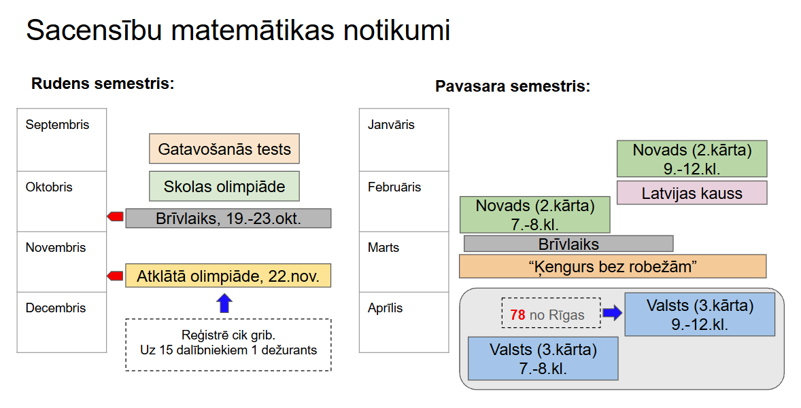

# Mācību programma 9.-10.klasei

## Rīgas Āgenskalna Valsts ģimnāzija

* Matemātikas pulciņš 9.-10.klasēm
* Interešu izglītības programmas joma un apakšprogrammas nosaukums:
  Fakultatīvās nodarbības “padziļināta mācību priekšmeta apguve” (10.sadaļa, kods 1001).
  (saskaņā ar Valsts izglītības informācijas sistēmas klasifikatoru: 2019. gada 10. decembra
  Ministru kabineta noteikumi Nr. 599 “Noteikumi par oficiālās statistikas veidlapu paraugiem
  izglītības jomā”)

Programmas autors: Kalvis Apsītis.  
Programma izstrādāta 2026.g. 7.septembrī.  
Tematu saraksts paliek nemainīgs; uzdevumu bāzi atjauno katru mācību gadu.

## Ievads

Lai ĀVĢ audzēkņi varētu jēgpilni piedalīties matemātikas olimpiādēs,
ir jāapgūst dažādas skolas pamatkursā neiekļautas zināšanas.
Sk. [Matemātikas olimpiāžu programma](https://www.nms.lu.lv/fileadmin/user_upload/lu_portal/projekti/nms.lu.lv/Dazadi/_matematikas_olimpiazu_programma_2022.pdf) - sk. arī norādi
[NMS: Valsts olimpiādes](https://www.nms.lu.lv/olimpiades/valsts-olimpiade/)
Lai precizētu 9.-10.kl. mācīto materiālu, tiek izmantoti VIAA mājas lapā publicētie
matemātikas programmu paraugi (gan Skola2030, gan jaunākā 2026.g. programma) -
sal. [https://mape.gov.lv/page/programms](https://mape.gov.lv/page/programms) - un
šī projekta [Olimpiāžu satura standarts]({{ '/common_olympiad_program/olimpiazu_standarts/' | relative_url }}),
kurā 9.-10. klases prasības aprakstītas atsevišķā slejā.

Fakultatīva nodarbības notiek reizi nedēļā 90 minūtes pēc mācību stundām;
mācību gadā ir 30 nodarbību nedēļas (13 rudens un 17 pavasara semestrī; maijā
nodarbības nenotiek, jo skolēni gatavojas noslēguma pārbaudes darbiem).
Nodarbībās vienlaikus piedalās 9. un 10. klases skolēni - parasti 4-6 dalībnieki,
tātad mazāka grupa nekā 7.-8. klašu pulciņā.

Atšķirībā no 7.-8. klašu pulciņa **šai programmai nav A un B gadu rotācijas.**
Iemesls ir praktisks: starp 9. klasi (pamatskolas beigām) un 10. klasi pulciņa
sastāvs gandrīz pilnībā nomainās - devītie aiziet, bet desmitajā klasē ienāk
audzēkņi no citām skolām. Tāpēc tas pats desmit tematu loks atkārtojas ik gadu,
un mainās tikai uzdevumu bāze. Ja kāds dalībnieks tomēr apmeklē fakultatīvu
divus gadus pēc kārtas, viņš tos pašus tematus redz ar citiem uzdevumiem un
augstākā grūtības pakāpē (9. klases uzdevumu vietā - 10. klases un valsts
olimpiādes uzdevumi).

Gada ritmu iezīmē pieci sacensību punkti: skolas olimpiāde septembra beigās,
atklātā olimpiāde (AMO) novembra vidū, novada olimpiādes 2. kārta 9.-12. klasēm
februārī, "Latvijas kauss" un "Ķengurs bez robežām" ziemas otrajā pusē, un
valsts olimpiādes 3. kārta aprīlī. Sk. arī
[informāciju vecākiem 9.-10.kl.]({{ '/courses_26_27/for_parents_9_10/' | relative_url }}).

### Programmas mērķis

Fakultatīva mērķis ir izkopt pamatošanas pratību (*proof literacy*) -
spēju lasīt, saprast, analizēt un arī pašiem veidot loģiski derīgus spriedumus un
matemātiskus pierādījumus. Šajā vecumposmā mērķi var formulēt konkrētāk:
dalībniekam jāspēj **patstāvīgi uzrakstīt pierādījumu, ko var izlasīt svešs
cilvēks** un kas iztur olimpiādes vērtēšanas kritērijus - bez izlaistiem
gadījumiem, bez nepamatotiem soļiem un bez sajauktiem loģiskā secinājuma
virzieniem.

### Programmas uzdevumi

Mērķa sasniegšanai fakultatīvs risina šādus uzdevumus:

1. Iepazīstināt skolēnus ar 9.-10. klases olimpiāžu galvenajām risināšanas
   metodēm (kongruences, invarianti un monovarianti, Dirihlē princips,
   ekstremālais elements, novērtējums un konstrukcija, pilnā kvadrāta metode,
   līdzība un ievilktie leņķi) un jautājumu tipiem atbilstošām atrisinājumu
   struktūrām.
2. Iemācīt rakstīt pamatojumus, ko var vērtēt pēc olimpiāžu kritērijiem,
   un stāstīt savus risinājumus klausītājiem - arī tad, kad pierādījums
   aizņem vairāk nekā vienu lappusi.
3. Sagatavot skolēnus dalībai skolas, atklātajā, novada un valsts olimpiādē,
   tostarp iemācīt laika un punktu taktiku sacensībās.
4. Nodrošināt apgūtā noturību (*retention*), tematiem regulāri atgriežoties
   atkārtojuma jautājumos un jauktajās uzdevumu lapās.
5. Palīdzēt dalībniekam izlemt, vai viņš vēlas gatavoties augstāka līmeņa
   sacensībām (valsts komandas atlase, *Baltic Way*, *EGMO*, *IMO*) - 9.-10.
   klase ir pēdējais brīdis, kad šo izvēli var izdarīt bez steigas.
6. Veidot cieņpilnu matemātiskās sarunas kultūru - klausīties, jautāt,
   iebilst pēc būtības.

### Programmas struktūra

* Fakultatīva mērķis, uzdevumi un mācību pieeja,
* Mācību saturs (10 temati, vienādi visiem mācību gadiem),
* Sasniegumu mērīšana un vērtēšana,
* Mācību darba organizācija,
* Programmas nodrošinājums un personāls,
* Izmantotā literatūra un mācību līdzekļi.

Sekmīgai šīs programmas uzsākšanai svarīgi, lai dalībniekam pamatskolā
(7.-8. klasē) būtu bijusi iespēja:

* brīvi pārveidot burtu izteiksmes un lietot saīsinātās reizināšanas formulas
  abos virzienos;
* risināt lineārus vienādojumus un to sistēmas, arī ar burtu koeficientiem;
* lietot trijstūra leņķu summu, vienādības pazīmes, vienādsānu trijstūra
  īpašības un paralēlu taišņu leņķus;
* dalīt ar atlikumu, lietot dalāmības pazīmes un skaitļa decimālo pierakstu
  $\overline{ab} = 10a+b$;
* saskatīt paritātes argumentu un veikt sakārtotu gadījumu pārlasi;
* saprast, ar ko atšķiras piemērs no vispārīga pamatojuma.

Tas atbilst [Olimpiāžu satura standarta]({{ '/common_olympiad_program/olimpiazu_standarts/' | relative_url }})
7.-8. klases slejai. Ja kāds no šiem priekšnoteikumiem trūkst, to parasti var
atgūt dažu nedēļu laikā - tāpēc pulciņā uzņemam arī dalībniekus bez iepriekšējas
olimpiāžu pieredzes.

### Vispārīgs prasmju un ieradumu saraksts

Visu kursa tematu apguvei būtiskas šādas caurviju prasmes:

1. Izmanto matemātikas jēdzienus un citus vārdus konsekventi un
   atbilstoši to nozīmei vai definīcijām; ja jēdziens uzdevumā definēts no jauna
   ("skaitli sauksim par *īpašu*, ja ..."), strādā tieši ar doto definīciju.
2. Raksta pamatojumus atbilstoši jautājuma tipam (nezaudē punktus
   optimizācijas uzdevumos, rakstot piemēru bez novērtējuma vai
   novērtējumu bez piemēra, utml.).
3. Atšķir nepieciešamu nosacījumu no pietiekama un zina, kurā virzienā
   apgalvojums ir pierādīts. Pārveidojumu ķēdē seko līdzi tam, vai katrs solis
   ir atgriezenisks; ja nav, pārbauda atrastos kandidātus.
4. Labprāt komunicē par matemātiku. Saprot uzdevumu pamattekstu
   (arī bez skolotāja skaidrojumiem). Var stāstīt savus risinājumus pie tāfeles
   un var atrast nepilnības arī citu stāstītajos (izlaisti gadījumi,
   nepamatoti soļi).
5. Aiz katra apgūtā matemātikas temata saredz tā "nesošo modeli"
   un tipiskos piemērus; cenšas biežāk saprast un retāk iekalt.
6. Apgūst izplatītās matemātisko pamatojumu struktūras (*patterns*)
   jeb pierādīšanas metodes - vidējās vērtības metodi un Dirihlē principu,
   ekstremālo elementu, invarianta un monovarianta metodi, pierādījumus no
   pretējā, matemātisko indukciju, uzdevumu interpretācijas (pārrakstīšanu
   citos jēdzienos), papildkonstrukcijas ģeometrijā vai kombinatorikā.
7. Olimpiādē racionāli sadala laiku starp uzdevumiem; sāk ar pieejamākajiem un
   pagūst atrisināto korekti pierakstīt. Zina, ka daļēji atrisināts uzdevums ar
   godīgi atzīmētu neizskatīto gadījumu mēdz dot vairāk punktu nekā
   nepierakstīta ideja.
8. Precīzi izmanto loģiskās struktūras - saikļus “un”, “vai”, "bet";
   veic loģiskus secinājumus vienā virzienā vai abos virzienos, pamato
   vispārīgus apgalvojumus un arī eksistences apgalvojumus, pareizi lieto
   kvantorus, negācijas un De Morgana likumus.
9. Izmanto matemātisko radošumu un patstāvīgi izraudzītus soļus - prot
   risināt uzdevumus, kuru atrisināšanas algoritms nav zināms -
   (Polya, 1957), (Zeitz, 2006).
10. Mērķtiecīgi izvēlas risināšanas soļus. (Piemēram:
    noskaidro doto un prasīto; izpēte - mazie gadījumi / zīmējums;
    metodes vai "nesošā modeļa" izvēle; pieraksts; atskats / pārbaude, vai tml.)
    Spēj pateikt, kāds ir plāns un kuru no soļiem šobrīd skatās.
11. Izkopj savu intuīciju, iztēli, uzmanību. Dalībnieki attīsta spēju
    nepadoties pārsteidzīgiem secinājumiem vai vienkāršojumiem, neiekrīt
    "lamatās". Dalībnieki māk uz nesagrafētas tāfeles ar brīvu roku zīmēt
    dažādas figūras - gan planimetrijā, gan risinot citu nozaru uzdevumus -
    un zina, ka zīmējums ir hipotēzes avots, nevis pierādījums.

**Matemātiskās izziņas ieradumi:**  
Sekmīga matemātikas apguve neaprobežojas ar tehniskām prasmēm.
Ļoti palīdz cilvēcīgās īpašības, piemēram, savstarpēja cieņa un
patiesības mīlestība. Dalībnieki klausās savus kolēģus -
runātājus pie tāfeles, pieklājīgi uzdod jautājumus vai ceļ iebildumus.
Šajā vecumposmā ar dalībniekiem par matemātiku parasti var runāt tāpat kā ar
pieaugušajiem: nosaukt lietas īstajos vārdos, atzīt, ka kāds risinājums ir
nepilnīgs, un neizlikties, ka atbilde ir zināma, ja tā nav zināma.
Pulciņa dalībnieki cenšas izbrīvēt laiku, lai varētu piedalīties olimpiādēs
vai citos brīvprātīgos STEM pasākumos.

### Mācību pieeja

Fakultatīva mācību pieeju nosaka daži apzināti izraudzīti principi:

* **Viengadu cikls ar atjaunotu uzdevumu bāzi.** Tematu saraksts katru gadu ir
  viens un tas pats, jo grupas sastāvs katru gadu ir jauns. Tas ļauj tematus
  sakārtot vienā loģiskā secībā (nevis divos diverģentos A/B komplektos) un
  katram tematam uzkrāt arvien labāku paraugpiemēru un uzdevumu kāpņu krājumu.
  Uzdevumus atlasa no dažādiem gadiem, tāpēc arī atkārtoti dalībnieki tos pašus
  uzdevumus neredz. Katru gadu noteikti mainās pēdējā gada olimpiāžu komplekti,
  ko analizē uzreiz pēc attiecīgās olimpiādes.
* **Viens temats - divas nodarbības.** Katram tematam atvēlētas divas secīgas
  nodarbības: pirmajā metodi ievieš ar paraugpiemēriem, otrajā seko patstāvīga
  prakse ar dažādotiem un "maskētiem" uzdevumiem. Ilgāku blokveida
  padziļināšanu apzināti nelietojam: noturībai vērtīgāk ir tematam atgriezties
  vēlāk - atkārtojuma jautājumos pēc 2 un 6 nedēļām un pirmsolimpiāžu jauktajās
  lapās (izkliedētā atkārtošana un izvilkšanas prakse).
* **Mazas grupas priekšrocība - semināra formāts.** Ar 4-6 dalībniekiem katrs
  var katrā nodarbībā tikt pie tāfeles. Tāpēc lielāku daļu laika veltām
  risinājumu izklāstam un tā kritikai, nevis skolotāja stāstījumam. Skolotājs
  uzdod "recenzenta" jautājumus ("kurā solī tu izmantoji, ka $n$ ir nepāra?",
  "vai šis gadījums ir vienīgais?"), un pārējie dalībnieki mācās tos uzdot paši.
* **Diferencēšana starp 9. un 10. klasi.** Uzdevumu kāpnēs vienam un tam pašam
  tematam ir gan 9. klases, gan 10. klases, gan valsts olimpiādes uzdevumi.
  Praksē 9. un 10. klases komplekti ir tuvi (bieži tas pats uzdevums ar citiem
  skaitliskiem datiem), tāpēc grupu nav vajadzības dalīt - atšķiras tikai tas,
  cik tālu pa kāpnēm katrs tiek.
* **Kognitīvās slodzes vadība.** Jaunu metodi vienmēr ievada izstrādāts
  paraugpiemērs, un tikai tad seko patstāvīgā risināšana; teorijas stāstījums
  nepārsniedz 10 minūtes; palīdzību dod kā pakāpeniskas uzvednes (no "uzzīmē
  attēlu" līdz metodes norādei), nevis gatavus risinājumus. Uzdevumu kāpnes
  sākas ar iesildīšanās uzdevumiem, kurus var atrisināt arī bez jaunās metodes.
* **Motivācijas ritms ap olimpiādēm.** Nedēļas pirms AMO, novada un valsts
  olimpiādes notiek "sprinta" režīmā - iepriekšējo gadu komplektu izspēles
  laika kontrolē, brīvprātīgi mājas komplekti; uzreiz pēc olimpiādes tiek
  analizēti tās uzdevumi, kamēr interese svaiga.
* **Saskaņošana ar skolas kursu.** Tematu secība ņem vērā to, kas jau ir mācīts
  stundās. Piemēram, kvadrātvienādojumu un Vjeta formulas 9. klasē apgūst
  mācību gada gaitā, tāpēc atbilstošais temats fakultatīvā ir gada beigās;
  savukārt tie temati, kuriem skolas kursā priekšteču nav (invarianti, Dirihlē
  princips, kongruences), var būt jebkurā vietā.
* **Iekļaušana arī tad, ja nodarbība daļēji kavēta.** Nodarbības otrā puse
  (uzdevumu kāpnes) ir pašpietiekama: vēlāk atnācis dalībnieks saņem temata
  atgādni un var pieslēgties darbam. Fakultatīva mājaslapā pēc katras
  nodarbības publicē īsu žurnālu ("ko darījām"), atgādni un uzdevumus ar
  pakāpeniski atveramām uzvednēm, lai kavētāji "neizkristu no konteksta".

## Mācību satura plānojums

Mācību saturā ir 10 temati pa 2 nodarbībām; pārējās nodarbību nedēļas aizņem
sacensības un ar tām saistītie sprinti. Tipisks gada karkass
(R - rudens, P - pavasara semestra nedēļa):

| Nedēļas | Saturs |
|---|---|
| R1-R2 | 1. temats |
| R3 | Skolas olimpiāde |
| R4-R9 | 2.-4. temats |
| R10 | AMO gatavošanās |
| R11-R12 | AMO analīze |
| R13 | Rudens kopsavilkums |
| P1-P2 | 5. temats |
| P3-P4 | NOL sprints (2. kārta 9.-12. klasēm ir jau februārī) |
| P5 | NOL analīze |
| P6-P11 | 6.-8. temats |
| P12 | Valsts olimpiādes iesildīšanās; pārējiem "Latvijas kauss" un "Ķengurs" |
| P13 | Valsts olimpiādes analīze |
| P14-P17 | 9.-10. temats; pavasara kopsavilkums |

Konkrētas nodarbību nedēļas sk. [sākumlapas]({{ '/' | relative_url }}) sadaļā
"9.-10.kl. nodarbību plāns".

Salīdzinājumā ar 7.-8. klašu plānu pavasara puse ir sablīvēta agrāk: novada
olimpiādes 2. kārta 9.-12. klasēm notiek februārī, nevis martā, tāpēc pirms tās
paspējam apgūt tikai vienu jaunu tematu, un NOL sprints iekrīt tūlīt pēc ziemas
brīvdienām. Turpretī aprīlis 9.-10. klasēs ir saturīgāks nekā jaunākajās klasēs,
jo notiek valsts olimpiādes 3. kārta. AMO gatavošanai atvēlēta viena nedēļa, bet
analīzei divas: 9. un 10. klases komplektos kopā ir desmit uzdevumi, un pēc
olimpiādes tos izrunāt ir vērtīgāk nekā pirms tās trenēties "tukšā".

## Mācību saturs

*Tematu saraksts ir vienāds visos mācību gados. Piemēros norādīti uzdevumi no
pēdējo aptuveni desmit gadu olimpiāžu komplektiem; katram tematam sagatavotajā
uzdevumu kāpnē to ir vairāk (10-15).*

Aiz katra temata apraksta norādītas [Olimpiāžu satura standarta]({{ '/common_olympiad_program/olimpiazu_standarts/' | relative_url }})
tematiskās līnijas (A - algebra, Ģ - ģeometrija, K - kombinatorika,
S - skaitļu teorija, M - vispārīgās metodes), ko attiecīgais temats īsteno.
Pilnu pārklājumu sk. [pārklājuma tabulā]({{ '/common_olympiad_program/parklajuma_tabula/' | relative_url }}).

### 1. temats. Atrisinājumu struktūras: Kas ir pilns pierādījums

Jautājumu tipi un tiem atbilstošās atrisinājumu struktūras. Šo tematu māca
katra gada sākumā, jo dalībnieki katru gadu ir jauni; tas ievieš valodu, ko
lieto visos pārējos tematos.
*Standarta līnijas: M1, M2, M3, M4, M5, M6, M8, K7.*

* SR: Atšķir olimpiāžu jautājumu pamattipus - "atrast visus", "vai var?",
  "lielākā/mazākā vērtība", "pierādīt", "konstruēt piemēru", "aprakstīt
  procedūru vai stratēģiju" - un zina katram atbilstošo pilnas atbildes
  struktūru.
* SR: Optimizācijas uzdevumā ("kāds ir lielākais/mazākais ...") uzraksta abas
  daļas - konkrētu konstrukciju ar prasīto vērtību un vispārīgu novērtējumu,
  kāpēc labāk nevar. Zina, ka katra no daļām atsevišķi ir aptuveni puse punktu.
* SR: Atšķir nepieciešamu nosacījumu no pietiekama; pēc pārveidojumu ķēdes
  pārbauda, vai atrastie kandidāti tiešām der (t.i. vai ķēde ir atgriezeniska).
* SR: Sadala risināmo situāciju gadījumos pēc skaidra kritērija un pieraksta
  pārlasi tā, lai lasītājam viegli pārliecināties, ka nekas nav izlaists;
  pārlases apjomu vispirms samazina ar novērtējumu.
* SR: Raksta pierādījumu no pretējā: formulē pieņēmuma noliegumu, iegūst
  pretrunu ar novērtējumu vai dalāmību; pazīst minimālā pretpiemēra shēmu
  ("aplūkosim mazāko skaitli, kuram apgalvojums nav spēkā").
* SR: Konstrukciju apraksta kā bezgalīgu sēriju - dod formulu vai procedūru,
  kas der visiem $n$, nevis vienu izrēķinātu piemēru.
* SR: Pieraksta matemātiskās indukcijas pierādījumu ar soli $1$: bāze,
  induktīvais pieņēmums, pāreja - un saprot, kāpēc bez bāzes pierādījuma nav.
* SR: Izmanto secību *Saprašana → Izpēte → Pārformulēšana → Risināšana →
  Atskats* (*En: Understand → Explore → Attack → Review*) un spēj pateikt,
  kurā solī šobrīd atrodas.

**Piemēri:** [LV.AMO.2025.9.5](https://eliozo.dudajevagatve.lv/problem?problemid=LV.AMO.2025.9.5)
($255$ kg ķirbju - mazākais reižu skaits: konstrukcija plus novērtējums),
[LV.VOL.2024.10.1](https://eliozo.dudajevagatve.lv/problem?problemid=LV.VOL.2024.10.1)
(vai var izvēlēties $50$ vai $51$ skaitli - divas atbildes ar atšķirīgu
pamatojuma tipu), [LV.AMO.2022B.10.2](https://eliozo.dudajevagatve.lv/problem?problemid=LV.AMO.2022B.10.2)
(sadalījums divās grupās ar pirmskaitļu summām - "vai var" ar A un B daļu).

### 2. temats. Izteiksmes un nevienādības: Pilnā kvadrāta metode

Algebriskie pārveidojumi kā pierādīšanas instruments, nevis kā rēķināšana.
Nevienādību pierādīšana bez matemātiskās analīzes.
*Standarta līnijas: A1, A3.*

* SR: Lieto saīsinātās reizināšanas formulas abos virzienos, arī identitātes
  $a^3 \pm b^3 = (a \pm b)(a^2 \mp ab + b^2)$ un
  $(a+b+c)^2 = a^2+b^2+c^2+2(ab+bc+ca)$; saskata izteiksmē atkārtotu fragmentu
  un apzīmē to ar jaunu mainīgo.
* SR: Atdala pilno kvadrātu un lieto pamatnevienādību $t^2 \geq 0$ (arī vairākos
  saskaitāmajos vienlaikus), lai pierādītu, ka izteiksme ir pozitīva, un lai
  noskaidrotu, kad iestājas vienādība.
* SR: Lieto nevienādības $a+\frac{1}{a} \geq 2$ un
  $\frac{a}{b}+\frac{b}{a} \geq 2$ (ar $a,b>0$) un pamato tās, nevis atsaucas uz
  tām kā uz "zināmām formulām".
* SR: Veic darbības ar daļveida izteiksmēm un kvadrātsaknēm; nosaka definīcijas
  apgabalu un pārbauda, vai reizināšana ar saucēju nemaina nevienādības zīmi.

**Piemēri:** [LV.NOL.2025.9.1](https://eliozo.dudajevagatve.lv/problem?problemid=LV.NOL.2025.9.1)
(izteiksme ar $20252024^2$ - apzīmējums $n$ un starpības kvadrāts),
[LV.NOL.2017.9.2](https://eliozo.dudajevagatve.lv/problem?problemid=LV.NOL.2017.9.2)
(pierādīt $9x^6-x^3+1>0$),
[LV.AMO.2023.10.2](https://eliozo.dudajevagatve.lv/problem?problemid=LV.AMO.2023.10.2)
(divu mainīgo izteiksme kā kvadrātu summa),
[LV.NOL.2023.9.4](https://eliozo.dudajevagatve.lv/problem?problemid=LV.NOL.2023.9.4)
($(x^4+1)(y^4+1)=4x^2y^2$ - vienādības gadījums nevienādībā),
[LV.AMO.2025.10.1](https://eliozo.dudajevagatve.lv/problem?problemid=LV.AMO.2025.10.1)
($\frac{a}{b}+\frac{b}{a} \geq 2+\frac{1}{ab}$ dažādiem naturāliem skaitļiem).

### 3. temats. Dalāmība, atlikumi un kongruences: Skaitļi pa atlikumu klasēm

Pāreja no dalāmības pazīmēm uz kongruenču valodu $a \equiv b \pmod m$.
Neiespējamības pierādīšana pēc moduļa ir viena no biežākajām metodēm
9.-10. klases komplektos.
*Standarta līnijas: S1, S4, S6, A5, M4.*

* SR: Sadala veselos skaitļus atlikumu klasēs pēc dotā moduļa, rēķina ar
  atlikumiem (saskaita, reizina, kāpina) un saprot, kāpēc dalīšana ar atlikumu
  klasēm vispārīgi nav atļauta.
* SR: Zina un pierāda kvadrātu un kubu atlikumus pēc mazajiem moduļiem
  (kvadrāts pēc $\bmod 4$ dod $0$ vai $1$; pēc $\bmod 3$ - $0$ vai $1$; kubs pēc
  $\bmod 9$ - $0$ vai $\pm 1$) un lieto tos neiespējamības pamatošanai.
* SR: Aprēķina lielu pakāpju pēdējos ciparus un atlikumus, izmantojot pakāpju
  atlikumu periodiskumu; rekurentām virknēm atrod atlikumu periodu un pamato,
  ka tas tiešām atkārtojas.
* SR: Kombinē dalāmības pazīmes ar sadalīšanu pirmreizinātājos; lieto īpašību
  "ja skaitlis dalās ar savstarpēji pirmskaitļiem $m$ un $n$, tad tas dalās ar
  $mn$" un atšķir to no nepareiziem vispārinājumiem.

**Piemēri:** [LV.AMO.2016.9.2](https://eliozo.dudajevagatve.lv/problem?problemid=LV.AMO.2016.9.2)
($x^3-2016xyz=10$ - pretruna pēc moduļa),
[LV.VOL.2019.10.3](https://eliozo.dudajevagatve.lv/problem?problemid=LV.VOL.2019.10.3)
($13^n+7^n+2019$ nekad nav pilns kvadrāts),
[LV.NOL.2021.10.4](https://eliozo.dudajevagatve.lv/problem?problemid=LV.NOL.2021.10.4)
($n^2-n+36$ nedalās ar $165$ un $169$),
[LV.VOL.2025.9.3](https://eliozo.dudajevagatve.lv/problem?problemid=LV.VOL.2025.9.3)
(virkne ar soļiem $+54$ vai $+77$ - divi vienādi pēdējie cipari),
[LV.NOL.2022.9.4](https://eliozo.dudajevagatve.lv/problem?problemid=LV.NOL.2022.9.4)
(vienpadsmit secīgu skaitļu reizinājums dalās ar $12^4$),
[LV.VOL.2020.10.4](https://eliozo.dudajevagatve.lv/problem?problemid=LV.VOL.2020.10.4)
(virkne $7; 737; 73737; \ldots$ un dalāmība ar $17$).

### 4. temats. Trijstūru līdzība un Pitagora teorēma: Attiecības zīmējumā

Ģeometrijas darbarīks, kas 9.-10. klasē aizstāj lielu daļu no 7.-8. klases
"vienādības pazīmju" spriedumiem. Papildkonstrukcija kā veids, kā līdzību
ieraudzīt.
*Standarta līnijas: Ģ2, Ģ6, Ģ1.*

* SR: Pazīst līdzīgus trijstūrus tipiskajās konfigurācijās (paralēla taisne
  nogriež trijstūri; augstums pret hipotenūzu; kopīgs leņķis) un korekti
  pieraksta virsotņu atbilstību, pirms raksta attiecības.
* SR: No līdzības iegūst nogriežņu attiecības un pretējā virzienā - no dotām
  attiecībām secina paralēlumu; lieto trijstūra viduslīniju un mediānu
  krustpunkta attiecību $2:1$.
* SR: Lieto Pitagora teorēmu un metriskās sakarības taisnleņķa trijstūrī;
  ievieš mainīgo nezināmam garumam un iegūst vienādojumu.
* SR: Izvēlas papildkonstrukciju (paralēla taisne, malas pagarinājums,
  viduspunktu savienojums, simetrisks punkts) un pamato, kāpēc tā ir iespējama.
* SR: Lieto simetriju pret taisni īsākā ceļa uzdevumos ("atspoguļo punktu un
  savieno taisni") un homotētiju - līdzību ar centru - kā veidu, kā vienu
  konfigurāciju pārvērst par otru.

**Piemēri:** [LV.NOL.2023.9.3](https://eliozo.dudajevagatve.lv/problem?problemid=LV.NOL.2023.9.3)
(četrstūris ar $CD \parallel BX$ - atrast $AD$),
[LV.AMO.2025.9.2](https://eliozo.dudajevagatve.lv/problem?problemid=LV.AMO.2025.9.2)
(divu mediānu paralēlums un attiecība $AD:DC$),
[LV.VOL.2025.9.2](https://eliozo.dudajevagatve.lv/problem?problemid=LV.VOL.2025.9.2)
($AD:DB = 2:1$, pierādīt $BF=FE$),
[LV.NOL.2026.9.1](https://eliozo.dudajevagatve.lv/problem?problemid=LV.NOL.2026.9.1)
(paralelograms ar $AE:EB=1:2$ - nogriežņa $AO$ garums),
[LV.NOL.2024.9.3](https://eliozo.dudajevagatve.lv/problem?problemid=LV.NOL.2024.9.3)
($ED \cdot EB + EA \cdot EC = AB^2$ kvadrātā),
[LV.NOL.2021.9.3](https://eliozo.dudajevagatve.lv/problem?problemid=LV.NOL.2021.9.3)
(kvadrāts ar $AB+AE=CE$ - laukums caur Pitagora teorēmu).

### 5. temats. Invarianti, monovarianti un spēles: Kas procesā nemainās

Procesi ar atļautajiem gājieniem: neiespējamības pamatošana ar invariantu,
procesa beigšanās pamatošana ar monovariantu, spēļu stratēģijas.
*Standarta līnijas: K3, K5, M8.*

* SR: Procesam formulē invariantu (paritāte, summa vai reizinājums pēc moduļa,
  krāsojums) un uzraksta neiespējamības pamatojumu: invarianta vērtība sākumā
  atšķiras no vērtības mērķa stāvoklī.
* SR: Pazīst monovariantu - lielumu, kas katrā gājienā tikai aug vai tikai
  dilst - un lieto to, lai pamatotu, ka process apstājas vai ka kādu stāvokli
  nevar sasniegt.
* SR: Analizē spēli, marķējot pozīcijas kā uzvarošas un zaudējošas; hipotēzi
  izvirza no mazo gadījumu tabulas, bet pamato ar abām daļām (no zaudējošas
  pozīcijas visi gājieni ved uz uzvarošu; no uzvarošas eksistē gājiens uz
  zaudējošu).
* SR: Konstruē simetrijas vai pārošanas stratēģiju un pamato, ka atbildes
  gājiens vienmēr ir iespējams; atšķir stratēģiju no vienas izspēles apraksta.

**Piemēri:** [LV.AMO.2024.9.3](https://eliozo.dudajevagatve.lv/problem?problemid=LV.AMO.2024.9.3)
(skaitļi $11, 12, 13$ un atļautais pārveidojums),
[LV.AMO.2023.9.1](https://eliozo.dudajevagatve.lv/problem?problemid=LV.AMO.2023.9.1)
(daļa $\frac{10}{2023}$ - monovariants),
[LV.AMO.2022A.9.2](https://eliozo.dudajevagatve.lv/problem?problemid=LV.AMO.2022A.9.2)
(darbības ar skaitli $2112$ - invariants ciparu summā),
[LV.NOL.2024.9.4](https://eliozo.dudajevagatve.lv/problem?problemid=LV.NOL.2024.9.4)
(kaķi $4 \times 6$ tabulā - krāsojuma invariants),
[LV.VOL.2023.9.3](https://eliozo.dudajevagatve.lv/problem?problemid=LV.VOL.2023.9.3)
(nuļļu un vieninieku aplis),
[LV.NOL.2025.10.4](https://eliozo.dudajevagatve.lv/problem?problemid=LV.NOL.2025.10.4)
(Kima un Māra spēle joslā $1 \times n$),
[LV.VOL.2026.9.2](https://eliozo.dudajevagatve.lv/problem?problemid=LV.VOL.2026.9.2)
(spēle, sākot no skaitļa $2$).

### 6. temats. Novērtējumi kombinatorikā: Dirihlē princips un ekstremālais elements

Metodes, ar kurām pamato "tik daudz noteikti ir" vai "vairāk nevar". Šeit
ietilpst arī divkāršā skaitīšana un grafs kā uzdevuma modelis.
*Standarta līnijas: K2, K4, K6, K1, M5, M7.*

* SR: Lieto vienkāršo un vispārināto Dirihlē principu, patstāvīgi izvēloties
  "trušus" un "kastes" (atlikumu klases, summu vērtības, plaknes apgabalus);
  pamato, ka novērtējums ir precīzs, konstruējot piemēru bez "sadursmes".
* SR: Sāk spriedumu no ekstremālā elementa ("aplūkosim lielāko no tiem ...",
  "izvēlēsimies dalībnieku ar visvairāk paziņām") un iegūst pretrunu vai
  novērtējumu.
* SR: Saskaita vienu lielumu divos veidos (pa rindām un kolonnām; pa
  dalībniekiem un pa pāriem) un no iegūtās vienādības vai nevienādības izdara
  secinājumu; lieto rokasspiedienu lemmu - nepāra pakāpes virsotņu skaits ir
  pāra skaitlis.
* SR: Pāriet no teksta situācijas uz grafa modeli un atpakaļ; lieto jēdzienus
  virsotne, šķautne, pakāpe, sakarīgums, cikls, koks, un zina, ka kokā ar $n$
  virsotnēm ir $n-1$ šķautne.
* SR: Novērtē, cik informācijas dod viens jautājums vai viena svēršana (divi vai
  trīs iznākumi), un ar to pamato apakšējo robežu darbību skaitam - kāpēc ar
  mazāku svēršanu skaitu nepietiek.

**Piemēri:** [LV.AMO.2024.9.2](https://eliozo.dudajevagatve.lv/problem?problemid=LV.AMO.2024.9.2)
($28$ skolēnu atzīmes - vispārinātais Dirihlē princips),
[LV.AMO.2023.9.4](https://eliozo.dudajevagatve.lv/problem?problemid=LV.AMO.2023.9.4)
($36$ kartītes divos dažādos dalījumos),
[LV.NOL.2021.9.5](https://eliozo.dudajevagatve.lv/problem?problemid=LV.NOL.2021.9.5)
($120$ skaitļi pa pāriem - sakārtošana un ekstremālais elements),
[LV.NOL.2017.9.5](https://eliozo.dudajevagatve.lv/problem?problemid=LV.NOL.2017.9.5)
($1010$ skaitļi, no kuriem divu summa ir trešais),
[LV.NOL.2023.9.2](https://eliozo.dudajevagatve.lv/problem?problemid=LV.NOL.2023.9.2)
($73$ rūķi ar tieši $9$ draugiem - rokasspiedienu lemma),
[LV.VOL.2019.10.4](https://eliozo.dudajevagatve.lv/problem?problemid=LV.VOL.2019.10.4)
(mazākais sarokošanos skaits septiņu cilvēku komisijā),
[LV.NOL.2020.9.5](https://eliozo.dudajevagatve.lv/problem?problemid=LV.NOL.2020.9.5)
(diagonāļu numuri tabulā - divkāršā skaitīšana).

### 7. temats. Riņķa līnija: Ievilktie leņķi un ievilkti četrstūri

Riņķa līnija kā leņķu ķēdes "pastiprinātājs". Temats, bez kura daudzus
9.-10. klases ģeometrijas uzdevumus nemaz nevar sākt risināt.
*Standarta līnijas: Ģ4, Ģ1, Ģ3.*

* SR: Lieto ievilktā leņķa teorēmu un tās sekas (leņķi pret vienu hordu; leņķis
  pret diametru ir taisns; centra leņķis ir divreiz lielāks) un korekti tiek
  galā ar diviem lokiem kā diviem gadījumiem.
* SR: Pierāda, ka četri punkti atrodas uz vienas riņķa līnijas (pretējo leņķu
  summa $180^\circ$; vienādi leņķi, no kuriem redzams viens nogrieznis), un
  tālāk izmanto iegūto ievilkto četrstūri.
* SR: Lieto pieskares īpašības - perpendikularitāti pret rādiusu, pieskares un
  hordas leņķi, vienādus pieskaru nogriežņus no viena punkta.
* SR: Lieto trijstūrī ievilkto un tam apvilkto riņķa līniju: bisektrišu un
  vidusperpendikulu krustpunktus, loka viduspunktu kā bisektrises krustpunktu
  ar apvilkto riņķa līniju.

**Piemēri:** [LV.AMO.2018.9.3](https://eliozo.dudajevagatve.lv/problem?problemid=LV.AMO.2018.9.3)
(ap vienādsānu trijstūri apvilkta riņķa līnija un līdzīgi trijstūri),
[LV.NOL.2020.9.3](https://eliozo.dudajevagatve.lv/problem?problemid=LV.NOL.2020.9.3)
(divas iekšēji pieskarošās riņķa līnijas),
[LV.NOL.2022.10.3](https://eliozo.dudajevagatve.lv/problem?problemid=LV.NOL.2022.10.3)
(divas krustojošās riņķa līnijas un divas sekantes),
[LV.NOL.2024.10.1](https://eliozo.dudajevagatve.lv/problem?problemid=LV.NOL.2024.10.1)
(taisnes caur riņķa līniju krustpunktu $X$),
[LV.VOL.2016.10.2](https://eliozo.dudajevagatve.lv/problem?problemid=LV.VOL.2016.10.2)
(bisektrises krusto apvilkto riņķa līniju - pierādīt $PQ \perp BI$),
[LV.VOL.2017.10.3](https://eliozo.dudajevagatve.lv/problem?problemid=LV.VOL.2017.10.3)
(ievilkts četrstūris, kura malu viduspunkti arī ir uz riņķa līnijas).

### 8. temats. Pirmskaitļi, dalītāji un vienādojumi veselos skaitļos

Skaitļa multiplikatīvā uzbūve: sadalījums pirmreizinātājos, dalītāju skaits un
vienādojumu risināšana veselos skaitļos.
*Standarta līnijas: S2, S5, S3, S1, M2.*

* SR: Lieto sadalījuma pirmreizinātājos viennozīmību; no sadalījuma
  $n = p_1^{a_1} \cdots p_k^{a_k}$ aprēķina dalītāju skaitu un atrod mazāko
  skaitli ar prasītām dalītāju īpašībām.
* SR: Risina vienādojumus veselos skaitļos, sadalot reizinātājos un pārlasot
  dalītāju pārus (arī negatīvos), un pamato, ka citu atrisinājumu nav.
* SR: Pirms pārlases sašaurina meklēšanas apgabalu ar novērtējumu vai ar
  pretrunu pēc moduļa; lieto arī spriedumu "skaitlis atrodas stingri starp
  diviem secīgiem kvadrātiem, tātad pats nav kvadrāts".
* SR: Lieto pirmskaitļu īpašības uzdevumos par summām un reizinājumiem
  (piemēram, ka vienīgais pāra pirmskaitlis ir $2$) un veido skaitļus ar
  prasītām ciparu un dalāmības īpašībām.

**Piemēri:** [LV.NOL.2025.9.2](https://eliozo.dudajevagatve.lv/problem?problemid=LV.NOL.2025.9.2)
(mazākais $N$, kuram $N!$ dalās ar $434$ vai $2025$),
[LV.NOL.2025.10.2](https://eliozo.dudajevagatve.lv/problem?problemid=LV.NOL.2025.10.2)
(mazākais skaitlis ar tieši $18$ dalītājiem, kas dalās ar $7$),
[LV.AMO.2024.10.1](https://eliozo.dudajevagatve.lv/problem?problemid=LV.AMO.2024.10.1)
($m^3n+m+n = mn+2mn^2$ naturālos skaitļos),
[LV.NOL.2024.10.4](https://eliozo.dudajevagatve.lv/problem?problemid=LV.NOL.2024.10.4)
($(a+b)^2 = a^3+b^3$ veselos skaitļos),
[LV.NOL.2019.10.5](https://eliozo.dudajevagatve.lv/problem?problemid=LV.NOL.2019.10.5)
(pirmskaitļu pāri ar $20m+18n=2018$),
[LV.AMO.2017.9.5](https://eliozo.dudajevagatve.lv/problem?problemid=LV.AMO.2017.9.5)
($x^3+(x+1)^3=(x+3)^3+1$ - novērtējums pirms pārlases),
[LV.NOL.2023.9.1](https://eliozo.dudajevagatve.lv/problem?problemid=LV.NOL.2023.9.1)
(cik daudz no skaitļiem $x, x+2, \ldots, x+8$ var būt pirmskaitļi).

### 9. temats. Laukumi un laukumu attiecības; rūtiņu plakne

Laukums kā spriešanas instruments: vienlielas figūras, attiecības caur kopīgu
augstumu, laukuma bilance sagriešanas un noklāšanas uzdevumos.
*Standarta līnijas: Ģ5, Ģ7, Ģ3.*

* SR: Lieto laukumu attiecības trijstūriem ar kopīgu augstumu vai kopīgu pamatu;
  no attiecībām uz malām iegūst attiecības starp laukumiem un otrādi.
* SR: Aprēķina figūras laukumu, to sadalot vai papildinot; lieto Pīka formulu
  rūtiņu plaknē un laukuma aprēķinu koordinātu plaknē.
* SR: Pierāda laukumu vienādību, nerēķinot pašus laukumus (pārbīde, kopīga daļa
  abās pusēs, viena un tā paša laukuma izteikšana divos veidos).
* SR: Sagriešanas un noklāšanas uzdevumos vispirms pārbauda laukuma un
  dalāmības bilanci un tikai tad meklē konstrukciju; optimizācijas uzdevumā
  uzrāda gan konstrukciju, gan novērtējumu.

**Piemēri:** [LV.AMO.2022A.10.3](https://eliozo.dudajevagatve.lv/problem?problemid=LV.AMO.2022A.10.3)
un [LV.VOL.2019.9.2](https://eliozo.dudajevagatve.lv/problem?problemid=LV.VOL.2019.9.2)
(trijstūra laukums, ja zināmi trīs mazāku daļu laukumi),
[LV.NOL.2017.9.3](https://eliozo.dudajevagatve.lv/problem?problemid=LV.NOL.2017.9.3)
(nogrieznis dala trapeces laukumu uz pusēm),
[LV.AMO.2024.9.4](https://eliozo.dudajevagatve.lv/problem?problemid=LV.AMO.2024.9.4)
(laukumu vienādība paralelogramā),
[LV.NOL.2023.10.3](https://eliozo.dudajevagatve.lv/problem?problemid=LV.NOL.2023.10.3)
(četrstūra $ABHC$ laukums ar augstumu krustpunktu),
[LV.NOL.2022.9.2](https://eliozo.dudajevagatve.lv/problem?problemid=LV.NOL.2022.9.2)
(sešstūris rūtiņu lapā ar perimetru un laukumu $60$),
[LV.AMO.2025.9.3](https://eliozo.dudajevagatve.lv/problem?problemid=LV.AMO.2025.9.3)
($p \times p$ kvadrāta sagriešana mazākos kvadrātos).

### 10. temats. Kvadrāttrinoms (visticamāk, nepagūstam)

Algebrisku objektu ar parametriem izpēte. Tematu māca mācību gada beigās, kad
9. klases dalībnieki kvadrātvienādojumu jau ir apguvuši skolas kursā.
*Standarta līnijas: A2, A4, A6.*

* SR: Pēta kvadrātvienādojumu ar parametru: diskriminants, sakņu skaits,
  gadījums $a=0$ (kad vienādojums vairs nav kvadrātvienādojums) - un neaizmirst
  šo gadījumu aplūkot atsevišķi.
* SR: Lieto Vjeta formulas abos virzienos: no sakņu summas un reizinājuma
  aprēķina simetriskas izteiksmes ($x_1^2+x_2^2$, $x_1^3+x_2^3$) un konstruē
  vienādojumu ar dotām saknēm.
* SR: Sadala kvadrāttrinomu reizinātājos un saista trinoma zīmi ar parabolas
  novietojumu; grafisku spriedumu lieto kā hipotēzes avotu, bet pamato
  algebriski.

**Piemēri:** [LV.AMO.2018.9.1](https://eliozo.dudajevagatve.lv/problem?problemid=LV.AMO.2018.9.1)
(kādām $a$ vērtībām $(a-3)x^2+5x-2=0$ ir viena vai divas saknes),
[LV.NOL.2022.9.1](https://eliozo.dudajevagatve.lv/problem?problemid=LV.NOL.2022.9.1)
(kad kvadrātvienādojumam ir vesela sakne),
[LV.VOL.2017.10.1](https://eliozo.dudajevagatve.lv/problem?problemid=LV.VOL.2017.10.1)
($x_1^2+x_2^2+2017$ un $x_1^3+x_2^3$ ir naturāli skaitļi),
[LV.NOL.2021.9.2](https://eliozo.dudajevagatve.lv/problem?problemid=LV.NOL.2021.9.2)
(vai attēlā var būt divu doto kvadrātfunkciju grafiki).

## Sasniegumu mērīšana un vērtēšana

Minimālais nosacījums pulciņa apmeklētībai - izdarīt kaut ko derīgu par
attiecīgās nodarbības tematu. Piemēram, iesniegt iesildīšanās testus
no izdales lapiņas, izrēķināt kādu olimpiādes uzdevumu vai kaut ko
pastāstīt pie tāfeles.

Obligātu eksāmenu un mājasdarbu fakultatīvā nav, bet dalībniekus
var aicināt nodarbības laikā pildīt testus vai rakstīt uzdevumu
pamatojumus. To mēģināsim darīt nodarbībās īsi pirms olimpiādēm
un arī kopsavilkuma nodarbībās katra semestra beigās.

Šajā vecumposmā svarīgākais vērtēšanas objekts ir **pierakstīts pierādījums**,
nevis atbilde. Tāpēc vismaz reizi semestrī katrs dalībnieks uzraksta viena
uzdevuma pilnu risinājumu, ko vērtē pēc olimpiādes kritērijiem (10 punktu
skalā), un saņem komentārus tieši par tām vietām, kur olimpiādē tiktu atvilkti
punkti: izlaists gadījums, "acīmredzami" bez pamatojuma, novērtējums bez
piemēra, sajaukts secinājuma virziens.

Tomēr svarīgāko atgriezenisko saiti fakultatīva dalībnieki iegūst,
piedaloties olimpiādēs (skolas, atklātajā, novada, valsts) un arī
izmantojot fakultatīva zināšanas citos mācību priekšmetos vai dzīvē,
piemēram, loģiski izklāstot savas domas.

Katras nodarbības beigās 1-2 mini-jautājumi. Atkārtojuma testiņu rezultāti rāda
arī noturību (līdzīgs jautājums var atkārtoties pēc 2 vai pēc 6 nedēļām, vai
semestra beigās). Pārskata tabulā var apzīmēt katram dalībniekam tematu apguves
līmeņus (redzējis / mēģinājis / patstāvīgi atrisinājis / spēj izskaidrot
citiem). Pēc olimpiādēm rezultātus pa uzdevumiem salīdzina ar agrāk novērotajiem
apguves līmeņiem. Mazā grupā šādu tabulu var uzturēt pilnībā - par katru
dalībnieku un katru tematu.

## Mācību darba organizācija

Katra nodarbība paredz īsu teorijas
stāstiņu (teoriju nekad nestāsta ilgāk par 10 minūtēm), 1-2 paraugpiemēru analīzi
pie tāfeles (vēl 10 minūtes), iesildīšanās uzdevumus pašiem dalībniekiem (20 minūtes
vai drusku ilgāk), atlikušās 40 minūtes ir uzdevumu kāpnes no tematam
paredzētās darba lapas. Skolēni risina un stāsta skolotājam, blakussēdētājam
un - mazās grupas dēļ pēc iespējas biežāk - arī pie tāfeles.
Atkarībā no temata specifikas var būt arī kādas praktiskas
nodarbes - ģeometrisku attēlu zīmēšana ar brīvu roku vai GeoGebra, spēļu spēlēšana,
aritmētiski piemēri skaitļu teorijā, Desmos vai WolframAlpha algebrā.

Šis plānojums nodarbību dabiski sadala divās aptuveni 45 minūšu daļās: pirmā
daļa (teorija, paraugpiemēri, iesildīšanās) ievieš tematu, bet otrā daļa
(uzdevumu kāpnes) ir pašpietiekama prakse. Ja daļai skolēnu stundu saraksta
dēļ nodarbība jāsāk ar nobīdi, viņi pievienojas otrās daļas sākumā un saņem
temata atgādni; ja kāds nodarbību nokavē pilnībā, palīdz fakultatīva
mājaslapa - tur pēc katras nodarbības publicē īsu žurnālu, atgādni un darba
lapas uzdevumus ar pakāpeniski atveramām uzvednēm, bet pilnus atrisinājumus -
ar aptuveni nedēļas aizturi.

Katram tematam, visticamāk, būs sagatavoti sekojoši mācību materiāli:

* **Temata kartiņa:** 1-2 teikumos temata mērķi, ko atlasīt no uzdevumu krātuves
  (atbilstoši `models`, `topics`, `methods`, `questionTypes`);
  saraksts ar 10-15 pagātnes olimpiāžu uzdevumiem (ar linkiem, ID) par tematu.
  Priekšzināšanas no standartkursa un arī tas, ko 10. klase jau zina, bet
  9. klase vēl nē (piemēram, darbības ar kvadrātsaknēm vai kvadrātfunkcijas
  pētīšana). Uz to links mūsu mājaslapā.
* **Divi vai trīs paraugpiemēri:** - ar pilnu risinājumu un ieteikumiem
  vairākos soļos. Tie domāti skolotājam (var nebūt izdales materiālos);
  vienā nodarbībā izstāsta 1-2 paraugpiemērus.
* **Divas uzdevumu kāpnes - aptuveni 16 uzdevumi augošā grūtībā:** Katrai no temata
  abām nodarbībām ir aptuveni 2 iesildīšanās uzdevumi, aptuveni 4 uzdevumi
  ar temata tiešu lietojumu, aptuveni 2 uzdevumi ar "maskētu" metodi vai
  metožu kombināciju. Kāpņu augšgalā ir vismaz viens valsts olimpiādes līmeņa
  uzdevums. Katram kāpņu uzdevumam ir arī uzvednes un avota ID.
  No kāpnēm iegūstamas abu nodarbību darba lapas.
* **Izdales materiāli:** (A) Atgādne: Teorijas kopsavilkums plus 2 iesildīšanās uzdevumi
  (ap 1 lpp. - katrā nodarbībā cita). (B) Darba lapa: Uzdevumi no
  uzdevumu kāpnēm, kaut kādi citi ieteikumi (ap 2 lpp. - tā pati abās temata nodarbībās).
* **Atkārtojuma jautājumi:** 5-8 īso atbilžu testu jautājumi utml., ko izmanto semestra beigu
  kopsavilkumu nodarbībās, pirms-olimpiāžu iesildīšanās utml.
* **Mājas komplekts:** 5-6 ne-grūti uzdevumi (ar pieejamām atbildēm) saistīti ar
  tematu. Nevienam neliek to mājās pildīt, bet var noderēt, ja kāds kaut ko nokavējis
  vai aktīvi gatavojas pirms olimpiādes.

## Programmas materiālais un finansiālais nodrošinājums

ĀVĢ dibinātājs ir Rīgas pilsētas pašvaldība. Neko atšķirīgu
no parastas skolas infrastruktūras (tāfele, lupata, projektors vai interaktīvā tāfele)
fakultatīvam nevajag.
Nodarbībās izmantojam arī darba lapas; varētu būt arī uzskates līdzekļi,
kurus uz nodarbību atnes skolotājs.

## Programmas īstenošanai nepieciešamā personāla saraksts

Programmas visu darbību īstenošanai (mācību materiālu izveidei, nodarbību vadīšanai un
administratīvajiem pienākumiem) vajadzīgs viens cilvēks ar augstāko izglītību matemātikā, citā
saistītā jomā vai pedagoģijā. Nodarbības var papildināt ar vieslektoriem.

## Izmantotā literatūra un mācību līdzekļi

* [Einberga, 2023](https://www.nms.lu.lv/fileadmin/user_upload/lu_portal/projekti/nms.lu.lv/Gramatas/Tematiskie/GRAMATA_atjaunots_matem_olimp_uzd_macibu_procesa_5-9kl.pdf) Einberga G.B., Avotiņa, M., Zīlīte, A. Matemātikas olimpiāžu
uzdevumu iekļaušana mācību procesā un fakultatīvajās nodarbībās 5.-9. klasei. Latvijas
universitāte, 2023.
* [LU NMS, 2026](https://www.nms.lu.lv/arhivs-un-materali/materiali/teorijas-materiali/) Novada un Atklāto matemātikas olimpiāžu tēmas.
* [Polya, 1957](https://math.hawaii.edu/home/pdf/putnam/PolyaHowToSolveIt.pdf) Polya, G.. How to solve it: A new aspect of mathematical method (2nd ed.).
Princeton University Press, 1957.
* [Prasolov, 2006](http://prasolov.loegria.net/planim5.pdf) Prasolov, V. Planimetrijas uzdevumi (5. izd.). MCNMO, 2006. Ģeometrijas uzdevumu krājums; noderīgs 4. un 7. temata paraugpiemēru atlasei.
* [Rīgas IIMC, 2024](https://www.intereses.lv/ieteikumi-interesu-izglitibas-macibu-programmas-izveidei/). Rīgas Interešu izglītības metodiskais centrs. Ieteikumi interešu izglītības programmas izstrādei un prasības programmas noformēšanai.
* [Zeitz, 2006](https://kheavan.wordpress.com/wp-content/uploads/2010/06/paul-zeitz-author-the-art-and-craft-of-problem-solving-2edwiley20060471789011.pdf) Zeitz, P. The art and craft of problem solving (2nd ed.). John Wiley & Sons Inc. 2006.
