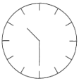
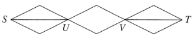
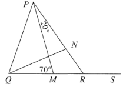
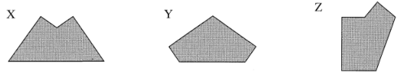
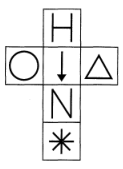
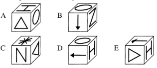
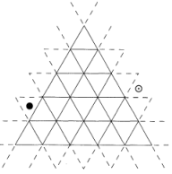
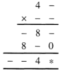

# 1. īso atbilžu tests

1. Kurš ir "divi veseli un trīsdesmit četras simtdaļas" pieraksts kā decimāldaļa?

**(A)** 0,234;  
**(B)** 2,034;  
**(C)** 2,34;  
**(D)** 234,00;  
**(E)** 23400.

2. Apmēram cik daudz ir 200 ml?

**(A)** pilns uzpirkstenis;  
**(B)** pilna karote;  
**(C)** pilna krūze;  
**(D)** pilns katls;  
**(E)** pilns spainis.

3. Sienas pulkstenis (ar stundu iedaļām, bet bez cipariem) rāda pusvienpadsmit. Ja šo pulksteni aplūko vertikāla spoguļa atspulgā, kādu laiku tas rādīs tur?

**(A)** pusdivi;  
**(B)** četri;  
**(C)** 2:30;  
**(D)** astoņi simti stundu;  
**(E)** tikko pāri 7 minūtēm pāri sešiem.

4. Kāds ir atlikums, dalot $7\,000\,010$ ar $7$?

**(A)** 1;  
**(B)** 2;  
**(C)** 3;  
**(D)** 4;  
**(E)** 5.

5. Par £2 pastmarku automāts izsniedz 20 p un 26 p pastmarku maisījumu par kopējo vērtību £2,02. Cik tur ir 20 p pastmarku?

**(A)** 1;  
**(B)** 3;  
**(C)** 5;  
**(D)** 8;  
**(E)** 10.

6. Kāda ir izteiksmes $19 + 99 + 19 \times 99$ vērtība?

**(A)** 236;  
**(B)** 1999;  
**(C)** 11701;  
**(D)** 13563;  
**(E)** neviena no šīm.

7. Marijai ir trīs brāļi un četras māsas. Ja viņi visi, ieskaitot Mariju, viens otram nopērk pa Lieldienu olai, cik olu viņi nopirks pavisam?

**(A)** 14;  
**(B)** 28;  
**(C)** 42;  
**(D)** 56;  
**(E)** 64.

8. Es esmu parādā piecdesmit pieciem cilvēkiem pa £55 katram. Manā krājkasītē ir piecdesmit £50 banknotes un piecas £5 banknotes. Vai ar to pietiek, lai samaksātu visus parādus?

**(A)** Jā, tieši tik, cik vajag;  
**(B)** Jā, un pāri paliks dažas mārciņas;  
**(C)** Jā, un pāri paliks ļoti daudz;  
**(D)** Nē, pietrūkst dažas mārciņas;  
**(E)** Nē, pietrūkst ļoti daudz.

9. "Divstāvu" sviestmaizē ir trīs maizes šķēles un divi pildījuma slāņi (maize/pildījums/maize/pildījums/maize). Katrai maizes šķēlei ar sviestu jāapsmērē katra puse, kas saskaras ar pildījumu. Es pagatavoju pēc iespējas vairāk šādu sviestmaižu no sagriezta klaipa, kurā ir 22 izmantojamas šķēles, neskaitot galiņus, kurus neizmanto. Cik maizes pusēm man jāuzsmērē sviests?

**(A)** 21;  
**(B)** 22;  
**(C)** 28;  
**(D)** 32;  
**(E)** 42.

10. Ceļojumā noteiktu bagāžas svaru pārvadā bez maksas, bet par katru kilogramu, kas šo svaru pārsniedz, jāmaksā £10. Ceļotājai Lālai bagāža kopā sver 50 kg - tā ir par smagu, un viņai par to jāmaksā £150. Ja ceļotājai Pokai bagāža kopā sver 30 kg, cik viņai būs jāmaksā?

**(A)** £0;  
**(B)** £30;  
**(C)** £50;  
**(D)** £90;  
**(E)** £100.

11. Kāda ir visu pirmskaitļu, kas mazāki par 25, summa?

**(A)** 95;  
**(B)** 98;  
**(C)** 100;  
**(D)** 109;  
**(E)** 115.

12. Cik ir dažādu ceļu no $S$ uz $T$, kuros ne punkts $U$, ne punkts $V$ netiek apmeklēts vairāk kā vienu reizi?

**(A)** 3;  
**(B)** 6;  
**(C)** 8;  
**(D)** 12;  
**(E)** 18.

13. Zīmējumā $\sphericalangle RPM = 20^\circ$ un $\angle QMP = 70^\circ$. Cik liels ir $\sphericalangle PRS$?

**(A)** $90^\circ$;  
**(B)** $110^\circ$;  
**(C)** $120^\circ$;  
**(D)** $130^\circ$;  
**(E)** $140^\circ$.

14. Pudelē ir 750 ml minerālūdens. Reičela izdzer par 50% vairāk nekā Ross, un abi draugi kopā izdzer visu pudeli. Cik daudz izdzer Reičela?

**(A)** 250 ml;  
**(B)** 375 ml;  
**(C)** 400 ml;  
**(D)** 450 ml;  
**(E)** 500 ml.

15. Rūtiņu lapa novietota tā, ka tās $x$ ass vērsta tieši uz austrumiem, bet $y$ ass — tieši uz ziemeļiem. Gauss gliemezis sāk ceļu punktā $(0,0)$ un lēni, bet vienmērīgi līen 1 vienību uz ziemeļiem, 2 vienības uz austrumiem, 3 vienības uz dienvidiem, 4 vienības uz rietumiem, 5 vienības uz ziemeļiem, 6 vienības uz austrumiem, 7 vienības uz dienvidiem, 8 vienības uz rietumiem, 9 vienības uz ziemeļiem un (beidzot!) 10 vienības uz austrumiem. Kurā punktā gliemezis beigās nonāk?

**(A)** $(-6,5)$;  
**(B)** $(5,6)$;  
**(C)** $(6,5)$;  
**(D)** $(6,-5)$;  
**(E)** $(-4,5)$.

16. Man ir dīvaini spēļu kauliņi: uz skaldnēm kā parasti ir skaitļi no 1 līdz 6, tikai nepāra skaitļi ir negatīvi (tas ir, $-1$, $-3$, $-5$ skaitļu 1, 3, 5 vietā). Ja es metu divus šādus kauliņus, kuru summu nav iespējams iegūt?

**(A)** 3;  
**(B)** 4;  
**(C)** 5;  
**(D)** 7;  
**(E)** 8.

17. Astoņciparu skaitlis $1234\ast{}678$ dalās ar 11. Kurš cipars ir apzīmēts ar $\ast{}$?

**(A)** 1;  
**(B)** 3;  
**(C)** 5;  
**(D)** 7;  
**(E)** 9.

18. Izmantojot visus ciparus no 1 līdz 9 ieskaitot, Šahabs uzrakstīja daļu, kuras skaitītājā bija četri cipari, bet saucējā — pieci cipari. Pēc tam viņš pamanīja, ka daļu var saīsināt un iegūt tieši vienu pusi. Kurš no šiem skaitļiem varēja būt Šahaba sākotnējās daļas skaitītājs?

**(A)** 5314;  
**(B)** 6729;  
**(C)** 7341;  
**(D)** 7629;  
**(E)** 8359.

19. Zemāk attēlotas trīs figūras $X$, $Y$ un $Z$. A4 formāta papīra lapu (297 mm × 210 mm) vienreiz pārloka un noliek plakaniski uz galda. Kuras no šīm figūrām tādā veidā var iegūt?

**(A)** tikai $Y$ un $Z$;  
**(B)** tikai $Z$ un $X$;  
**(C)** tikai $X$ un $Y$;  
**(D)** nevienu no tām;  
**(E)** visas.

20. Kuru no zemāk attēlotajiem kubiem var iegūt, salokot doto izklājumu?

Atbilžu varianti: 

21. Vecmāmiņa saka: "Man ir 84 gadi — neskaitot manas svētdienas". Cik veca viņa ir patiesībā?

**(A)** 90;  
**(B)** 91;  
**(C)** 96;  
**(D)** 98;  
**(E)** 99.

22. Cik reižu laikā no pusdienlaika līdz pusnaktij pulksteņa stundu rādītājs veido taisnu leņķi ar minūšu rādītāju?

**(A)** 11;  
**(B)** 12;  
**(C)** 20;  
**(D)** 22;  
**(E)** 24.

23. Attēlotajā spēlē melnais kauliņš $\bullet$ jāpārvieto no tā "sākuma pozīcijas" uz tā "mērķa pozīciju" (šeit attēlota kā aplītis $\odot$). Mērķis ir to izdarīt ar pēc iespējas mazāku "gājienu" skaitu. Lai izdarītu "gājienu", par savu "spoguli" jāizvēlas viena no piecpadsmit iezīmētajām taisnēm un jāpārvieto kauliņš $\bullet$ uz to pozīciju, kas ir tā pašreizējās pozīcijas spoguļattēls šajā "spogulī". Kāds mazākais "gājienu" skaits nepieciešams, lai sasniegtu mērķa pozīciju?

**(A)** 2;  
**(B)** 3;  
**(C)** 4;  
**(D)** 5;  
**(E)** Sākot no $\bullet$, nav iespējams sasniegt $\odot$.

24. Boriss, Spaiks un Persivals sacentīsies skriešanā augšup pa 99 pakāpieniem, kas ved no pludmales uz autostāvvietu klints galā. Tikmēr, kamēr Boriss uzskrien piecus pakāpienus, Spaiks uzskrien četrus pakāpienus, un tikpat ilgā laikā Persivals uzskrien trīs pakāpienus. Tiek norunāts, ka Boriss startē no apakšas, Spaiks startē 21 pakāpienu augstāk, bet Persivals — 38 pakāpienus augstāk. Ja viņi visi startē vienlaikus, kādā secībā viņi sasniegs augšu?

**(A)** SBP;  
**(B)** SPB;  
**(C)** PBS;  
**(D)** PSB;  
**(E)** BSP.

25. Pa labi attēlotajā divciparu skaitļa reizināšanā ar divciparu skaitli ir daudz tukšumu, bet lielāko daļu no tiem var aizpildīt ar loģiku (nevis minot). Kuram ciparam jābūt pozīcijā $\ast{}$?

**(A)** 1;  
**(B)** 3;  
**(C)** 5;  
**(D)** 7;  
**(E)** 9.
