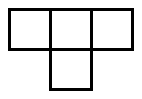
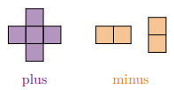

# 7.2.B. Invarianti: Rūtiņu krāsojumi

Dažos uzdevumos nav uzreiz nekā derīga, ko invariants varētu saskaitīt, 
bet to iegūst, piemēram **izvēloties krāsojumu** (šaha, joslu, trīs krāsu) un tad
skaitot noteiktas krāsas rūtiņas. 
Arī apstaigāšanas uzdevumus un spēles var analizēt izvēloties *krāsošanas invariantu*.
Piemēram, šaha laidnis nekad nemaina rūtiņas krāsu, 
šaha zirdziņš katrā gājienā maina rūtiņas krāsu -- var atsevišķi aplūkot 
pāra un nepāra gājienus.  
Arī šeit risinātājs definē invariantu, salīdzina to sākumā un beigās, secina neiespējamību.

**1.piemērs:** 
No $8 \times 8$ kvadrāta izgriež vienu rūtiņu. Vai atlikušās $63$ rūtiņas var
sagriezt $1 \times 3$ taisnstūrīšos? Kur jāizgriež rūtiņa, lai varētu šādi
sagriezt? Vai to var izdarīt kādam no kvadrātiem zīmējumā?

{: width="300"}

* *Saprašana:* $63 = 3 \cdot 21$, tātad laukums vienmēr dalās ar 3. 
* *Izpēte:* Zīmējumos var saskaitīt burtus/krāsas A,B,C. Kādiem skaitiem jābūt, lai varētu sagriezt? 

<!--
Klasiskais piemērs — trīs krāsu krāsojums
-->

**2.piemērs:** 
Vai taisnstūri ar izmēriem $7 \times 6$ rūtiņas var pārklāt ar 4.att.
redzamajām figūrām?

{: width="200"}

* *Saprašana:* Ja sagaidām, ka nevar - vajag spriedumu par visiem
  iespējamiem pārklājumiem uzreiz.
* *Izpēte:* Nokrāso taisnstūri kā šaha galdiņu; saskaiti *katram pagriezienam* melnās rūtiņas.
  sanāk tas pats. Kāpēc šis pats spriedums bez izmaiņām strādā arī
  $10 \times 9$ taisnstūrim (LV.AMO.2015.8.2)?

<!--
LV.AMO.2015.7.2 — figūras un melno rūtiņu paritāte
-->

---

## 1.uzdevums

Vai taisnstūri ar izmēriem **(A)** $5 \times 6$, **(B)** $4 \times 8$, 
**(C)** $4 \times 11$ rūtiņas var noklāt ar attēlā dotajām figūrām? 
Taisnstūrim jābūt pilnībā noklātam. Figūras nedrīkst iziet ārpus 
taisnstūra, figūras nedrīkst pārklāties, figūras drīkst pagriezt.

{: width="50"}

## 2.uzdevums (PL.OMJ.2022.S1.5)

Pieņemsim, ka "pluss" ir diagrammā attēlotā figūra, kas sastāv no 
pieciem kvadrātiem ar malas garumu 1, bet "mīnuss" ir jebkurš 
taisnstūris, kas sastāv no diviem šādiem kvadrātiem. Vai eksistē 
nepāra skaitlis $n$, ka kvadrātu $n \times n$ rūtiņas var sadalīt 
"plusos" un "mīnusos"? Pamatojiet savu atbildi.

{: width="150"}

(*Olimpiada Matematyczna Juniorów*, [https://omj.edu.pl/zadania](https://omj.edu.pl/zadania))