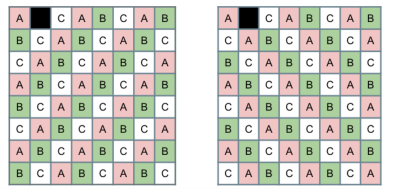
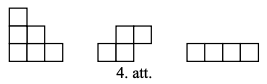
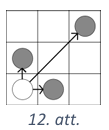

# 7.2.temats: Invarianti: Kas saglabājas, veicot atļautos gājienus

**Mērķis:** Kā lasīt uzdevumu, kā veidot jautājumam 
atbilstošu risinājuma struktūru. Kādus jautājumus sev 
uzdot pirms uzskatīt par atrisinātu. Kā analizēt vienkāršus 
6.-7.kl. olimpiāžu uzdevumus.
Matemātikā var izmantot jau zināmus vai izdomāt jaunus invariantus; 
tie veic līdzīgu lomu kā (enerģijas, masas, u.c.) nezūdamības 
likumi fizikā.

* **Uzdevumu lapa:** 
* **1.nodarbības materiāls:** 
* **2.nodarbības materiāls:** 
{: .small}

* SR: Procesam (gājienu vai pārveidojumu virknei) formulē invariantu un uzraksta neiespējamības pamatojumu ("invarianta vērtība sākumā nevar atšķirties no vērtības beigās").
Invariants var būt, piemēram, nemainīga izteiksme, nemainīgs atlikums vai 
kāds apgalvojums, kurš pārmaiņu gaitā saglabājas patiess.
* SR: Izvēlas piemērotu rūtiņu izkrāsošanu (šaha, joslu, trīs krāsu utml.) veidā, 
lai pamatotu pārklāšanas, figūriņu izgriešanas vai apstaigāšanas neiespējamību; 
formulē invariantu, kurš procesa laikā nemainās.
* SR: Pazīst monovariantu — lielumu, kas katrā gājienā tikai aug vai tikai dilst, lai pamatotu, ka process apstājas vai tā beigās izpildās kāda nevienādība.

## 1.nodarbības saturs

Invariantu risinātājs pats definē kā **skaitli, kas procesa laikā nemainās**.
Dažos gadījumos tas ir viegli atpazīstams lielums — visu monētu
kopsumma vai uzrakstīto skaitļu summa. Citreiz nemainīga
var būt skaitļu summa mīnus izdarīto gājienu skaits (ja katrā solī summa palielinās par $1$). 

Pēc invarianta definēšanas, pieraksta šo 3 soļu shēmu: 

1. nosauc invariantu, 
2. katram atļautā gājiena veidam parāda, ka invariants nemainās, 
3. salīdzina vērtību sākumā un beigās. 

Tālāk seko gadījumi, kad invariants ir nevis izrēķinātā izteiksme (summa vai tml.), 
bet gan **atlikums**, dalot ar kādu (visbiežāk nelielu) skaitli. 
Tie ir "apēd $5$, pieskaiti $9$, sagriez jebkuru gabalu $3$ gabalos" tipa procesi, 
kur gabalu skaits nepaliek nemainīgs, bet mainās prognozējamā veidā.  
Nodarbības beigās - divi uzdevumi, kuros invariants neparādās uzdevuma 
tekstā, tas jāizvēlas pašam (pirmreizinātāju skaits,
vienas krāsas bumbiņu skaits). *Piezīme:* Invariants pierāda **tikai**
neiespējamību. Tas nepalīdz konstruēt sarežģītus piemērus, kuri risinātājam 
jāveido ar citām metodēm. 

Šai nodarbībai specifiski sasniedzamie rezultāti:

* SR: Procesa aprakstā atpazīst "gājienu" un pieraksta, par cik katrs gājiena
  veids maina izvēlēto lielumu; pārbauda **visus** gājienu veidus, nevis vienu.
* SR: Formulē invariantu kā apgalvojumu par atlikumu ("gabalu skaits vienmēr
  dalās ar $3$") un noslēdz spriedumu ar sākuma un beigu vērtības salīdzinājumu.
* SR: Atšķir situācijas, kurās invariants dod pilnu atbildi ("nevar"), no tām,
  kurās papildus jāuzrāda piemērs ("var").
* SR: Ja teksts nedod gatavu lielumu, izvēlas savu skaitāmo lielumu
  (pirmreizinātāju skaitu, vienas krāsas objektu skaitu) un pamato tā izvēli.

### Skaidrojamie piemēri

#### 1.1. LV.NOL.2015.8.2 — invarianta trīs soļu shēma

Autoservisā "Šrotiņš" ir $39$ mašīnas. Naskais Maigonis katra mēneša $20.$
datumā vai nu pārdod $7$ restaurētas mašīnas un to vietā nopērk $16$ vecas
mašīnas, vai arī $19$ mašīnas nodod metāllūžņos un to vietā nopērk $4$ vecas
mašīnas. Vai iespējams, ka "Šrotiņā" kāda mēneša $21.$ datumā būs tieši $2015$
mašīnas?

* *Saprašana:* "Vai iespējams" — ja atbilde ir "nē", vajag vispārīgu spriedumu,
  kas aptver **visas** iespējamās darbību virknes, ne tikai dažas.
* *Izpēte:* Uzraksti abus gājienus kā vienu skaitli: $-7+16 = +9$ un
  $-19+4 = -15$. Kas kopīgs skaitļiem $9$ un $15$?
* *Pārformulēšana:* Invariants: "mašīnu skaits vienmēr dalās ar $3$".
* *Risināšana:* (1) Sākumā $39$ dalās ar $3$. (2) $3k \pm 3m = 3(k \pm m)$,
  tātad pēc katra gājiena dalāmība saglabājas. (3) $2+0+1+5 = 8$ nedalās ar $3$,
  tātad $2015$ nav sasniedzams.
* *Atskats:* Vai spriedumā kaut kur tika izmantota gājienu **secība** vai
  **skaits**? Ja nē — tieši tāpēc arguments der visām virknēm uzreiz.

#### 1.2. LV.NOL.2023.7.5 — kad invarianta vien nepietiek

Kastē atrodas baltas, sarkanas un zaļas lodītes. Ar vienu gājienu var izņemt
divas dažādu krāsu lodītes un ielikt vienu trešās krāsas lodīti. Vai var
panākt, ka paliek tikai viena lodīte, ja sākumā ir **(A)** $10$ baltas, $12$
sarkanas, $16$ zaļas; **(B)** $10$ baltas, $12$ sarkanas, $15$ zaļas?

* *Saprašana:* Divas daļas — atbildes var būt dažādas, un katrai vajag savu
  pamatojuma veidu.
* *Izpēte:* Viens gājiens: divi skaiti $-1$, viens skaits $+1$. Tātad **visas
  trīs** paritātes mainās vienlaikus. Kas tad paliek nemainīgs? Jebkuru divu
  skaitu **starpība** pēc moduļa $2$.
* *Risināšana (A):* Sākumā visi trīs skaiti pāra — visas starpības pāra. Beigu
  stāvoklī $(1,0,0)$ divas starpības ir nepāra. Pretruna, tātad nevar.
* *Risināšana (B):* Paritātes $(\text{p}, \text{p}, \text{n})$ neizslēdz
  rezultātu $(0,0,1)$ — bet tas vēl nenozīmē, ka var! Jāuzrāda gājienu virkne:
  trīs gājieni *bs*, *bz*, *sz* samazina visus trīs skaitus par $1$; ar tiem
  nonāk pie $(1,3,6)$ un tālāk pabeidz ar rokām.
* *Atskats:* Formulē vienā teikumā, kāpēc invariants nekad nevar pierādīt "jā".

#### 1.3. LV.AMO.2024.7.3 — invariants, kas nav pats skaitlis

Skaitļu virknes pirmais loceklis ir $12$. Katru nākamo iegūst iepriekšējo vai
nu reizinot ar $2$ vai $3$, vai arī izdalot ar $2$ vai $3$ (ja dalās bez
atlikuma). Vai virknes $61.$ loceklis var būt $54$?

* *Izpēte:* Uzraksti dažus pirmos locekļus. Vai pats skaitlis aug vai dilst?
  Nē — tātad jāmeklē cits lielums.
* *Pārformulēšana:* Sadali pirmreizinātājos: $12 = 2 \cdot 2 \cdot 3$ (trīs
  reizinātāji), $54 = 2 \cdot 3 \cdot 3 \cdot 3$ (četri). Par cik mainās
  reizinātāju skaits vienā gājienā?
* *Risināšana:* Katrā gājienā $\pm 1$, tātad reizinātāju skaita **paritāte**
  mainās katrā solī. No $1.$ līdz $61.$ loceklim ir $60$ gājieni — pāra skaits,
  tātad $61.$ loceklim reizinātāju skaits ir nepāra, kā $12$. Bet $54$ tas ir
  pāra. Nevar.
* *Atskats:* Šeit invariants nav "lielums, kas nemainās", bet "lielums, kas
  mainās pilnīgi regulāri". Kāds ir vispārīgais secinājums par $n$-to locekli?

## 2.nodarbības saturs

Otrajā nodarbībā invariantu meklē tur, kur nav gatava skaitļa — rūtiņu lapā.
Galvenā ideja: **pats izvēlies krāsojumu** (šaha, joslu, trīs krāsu) un tad
skaiti vienas krāsas rūtiņas. Sākam ar domino un šaha galdiņu, kur katrs
kauliņš noklāj tieši vienu melnu un vienu baltu rūtiņu, un ar figūrām, kuras
neatkarīgi no pagrieziena vienmēr noklāj pāra skaitu melno rūtiņu; tad
parādām, ka tā pati doma der arī apstaigāšanas uzdevumos (varde maina rūtiņas
krāsu katrā lēcienā) un spēlēs, kur laukumu izkrāso uzvarošās un zaudējošās
pozīcijās. Nodarbības beigās ieviešam monovariantu — lielumu, kas tikai aug vai
tikai dilst — un to lieto novērtējumiem "ar mazāk nekā $k$ gājieniem nepietiek".
Visu laiku uzturam $1.$ nodarbībā ieviesto disciplīnu: krāsojums ir tikai
palīglīdzeklis, bet pierakstā joprojām jābūt invarianta formulējumam un sākuma
un beigu vērtības salīdzinājumam.

Šai nodarbībai specifiskie sasniedzamie rezultāti:

* SR: Izvēlas krāsojumu atbilstoši figūras formai (šaha — domino un pāra/nepāra
  uzdevumiem, joslu vai trīs krāsu — figūrām ar garumu $3$) un pamato izvēli.
* SR: Pārbauda figūras noklāto krāsu skaitu **visos** tās pagriezienos un
  spoguļattēlos, nevis vienā uzzīmētā novietojumā.
* SR: Spēles laukumu aizpilda ar uzvarošajām/zaudējošajām rūtiņām, analizējot
  spēli no beigām, un nolasa atbildi no sākumpozīcijas krāsas.
* SR: Atšķir invariantu (nemainās) no monovarianta (tikai aug vai tikai dilst)
  un zina, kādus secinājumus ļauj katrs no tiem.

### Skaidrojamie piemēri

#### 2.1. Klasiskais piemērs — trīs krāsu krāsojums

No $8 \times 8$ kvadrāta izgriež vienu rūtiņu. Vai atlikušās $63$ rūtiņas var
sagriezt $1 \times 3$ taisnstūrīšos? Kur jāizgriež rūtiņa, lai varētu šādi
sagriezt?

* *Saprašana:* $63 = 3 \cdot 21$, tātad laukums netraucē — vajadzīgs cits
  arguments.
* *Izpēte:* Šaha krāsojums nepalīdz, jo $1 \times 3$ figūra noklāj gan $2+1$,
  gan $1+2$ rūtiņas. Kāpēc der krāsojums **trīs** krāsās pa diagonālēm?
* *Pārformulēšana:* Katrs $1 \times 3$ taisnstūrītis noklāj tieši vienu $A$,
  vienu $B$ un vienu $C$ rūtiņu. Tātad invariants: noklāto $A$, $B$ un $C$
  skaitiem jābūt vienādiem.
* *Risināšana:* Saskaiti $A$, $B$, $C$ rūtiņas abos attēlā dotajos krāsojumos.
  Izgrieztajai rūtiņai jābūt tādā krāsā, kuras ir par vienu vairāk — un tas
  jāizpildās abiem krāsojumiem vienlaikus. Kuras rūtiņas tam atbilst?
* *Atskats:* Uzdevumā ir divas daļas: "kur var" (piemērs) un "citur nevar"
  (invariants). Vai atbildē ir abas?

#### 2.2. LV.AMO.2015.7.2 — figūras un melno rūtiņu paritāte

Vai taisnstūri ar izmēriem $7 \times 6$ rūtiņas var pārklāt ar 4.att.
redzamajām figūrām?

* *Saprašana:* "Vai var" ar sagaidāmo atbildi "nē" — vajag spriedumu par visiem
  iespējamiem pārklājumiem uzreiz.
* *Izpēte:* Nokrāso taisnstūri šaha galdiņa veidā un saskaiti melnās rūtiņas:
  $7 \cdot 6 : 2 = 21$ — nepāra skaits.
* *Izpēte:* Katrai figūrai pārbaudi visus pagriezienus un spoguļattēlus: cik
  melnas rūtiņas tā noklāj? Katru reizi sanāk **pāra** skaits.
* *Risināšana:* Vairāku pāra skaitļu summa ir pāra, bet melno rūtiņu kopskaits
  ir $21$ — nepāra. Pretruna.
* *Atskats:* Piezīme risinājumā: der arī krāsojums joslās. Pārbaudi, vai ar to
  sanāk tas pats. Kāpēc šis pats spriedums bez izmaiņām strādā arī
  $10 \times 9$ taisnstūrim (LV.AMO.2015.8.2)?

#### 2.3. LV.AMO.2016.8.5 — krāsojums kā spēles invariants

Divi spēlētāji uz $N \times N$ laukuma pārvieto kauliņu no kreisā apakšējā
stūra: par vienu rūtiņu pa labi, par vienu uz augšu vai par divām pa diagonāli
uz augšu pa labi. Zaudē tas, kurš nevar izdarīt gājienu. Kurš uzvar, ja
**(A)** $N=7$, **(B)** $N=8$?

* *Saprašana:* "Kurš uzvar" = nosaukt spēlētāju **un** aprakstīt stratēģiju,
  kas vienmēr strādā.
* *Izpēte:* Sāc no beigām. Labā augšējā rūtiņa ir zaudējoša ($Z$), jo no tās
  nav gājienu.
* *Pārformulēšana:* Rūtiņa ir uzvaroša ($U$), ja no tās var aiziet uz kādu $Z$;
  citādi tā ir $Z$. Tas ir krāsojums divās krāsās — un tas ir invariants:
  spēlētājs, kurš atstāj pretiniekam $Z$ rūtiņu, to var darīt vienmēr.
* *Risināšana:* Aizpildi $7 \times 7$ un $8 \times 8$ laukumu ar $U$ un $Z$.
  Abos gadījumos kreisā apakšējā rūtiņa iznāk $Z$ — uzvar otrais spēlētājs.
* *Atskats:* Vai stratēģijas aprakstā ir pateikts, ko otrais spēlētājs dara
  **katrā** pirmā spēlētāja gājienā? Vai spēle noteikti beidzas?
