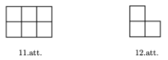
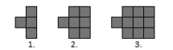

# Kombinatorika: Skaitīšana un invarianti

1. uzdevums: Taisnstūri 7x12 rūtiņas sagriezt 11. un 12. attēlā 
redzamajās figūriņās. Jāizmanto
abu veidu figūriņas; bet “stūrīši” (12.attēla figūriņas) nedrīkst 
savstarpēji saskarties ar malu vai virsotni.

2. uzdevums: Sandis uzzīmējis kvadrātu 6 × 6 rūtiņas un pēc kārtas tajā iekrāso pa vienai
rūtiņai. Pēc kārtējās rūtiņas iekrāsošanas viņš ieraksta tajā skaitli - cik no blakusesošajām
rūtiņām jau ir iekrāsotas (par blakusesošām sauc rūtiņas, kurām ar doto ir kopīga mala). Pēc
visu rūtiņu iekrāsošanas Sandis visus tajās ierakstītos skaitļus saskaita. Pierādīt, ka neatkarīgi
no rūtiņu iekrāsošanas secības, iegūtā summa būs viena un tā pati.​

3. uzdevums: Kaut kādā secībā uzrakstīja 9 burtus, no kuriem tieši divi ir “A”, tieši trīs ir “B”,
tieši četri ir “C”. Zem katra no burtiem uzrakstīja skaitli – cik no šī burta pa labi ir citādi burti
(piemēram, ja pēc dotā “A” ir vēl viens “B” un vēl divi “C”, tad zem šī “A” raksta 1+2=3). Atrast
visu uzrakstīto skaitļu summu un pierādīt, ka tā nav atkarīga no burtu rakstīšanas secības.

4. uzdevums: Kādu mazāko skaitu rūtiņu jānokrāso melnas taisnstūrī 9×15 tā, lai katrā
taisnstūrī ar izmēriem 5×3 rūtiņas atrastos vismaz viena melna rūtiņa?

5. uzdevums:  
No 8x8 kvadrāta izgriež vienu rūtiņu (zīm.). Vai atlikušās 63 rūtiņas var sagriezt
1x3 taisnstūrīšos? Kur jāizgriež rūtiņa, lai varētu šādi sagriezt?

6. uzdevums:  
Spēlē “freestyle gomoku” 2 spēlētāji pēc kārtas liek pa vienam savas krāsas
akmentiņam uz kvadrātiska režģa un uzvar tas, kurš salicis 5 savus akmentiņus rindā (pa
horizontāli, vertikāli vai diagonāli).
Pierādīt, ka šīs spēles izmainīts variants, kur pietiek salikt rindā 4 savus akmentiņus, ir tāds,
kurā vienmēr uzvar 1.spēlētājs. (Var pieņemt ka spēles laukums ir bezgalīga rūtiņu lapa.)

**7.uzdevums:**  
Vilmārs zīmē figūras, pirmās trīs no kurām parādītas attēlā. Pirmā figūra sastāv no četriem
vienādiem kvadrātiem un tās perimetrs ir 5 vienības. Katru nākamo figūru 
Vilmārs iegūst, iepriekšējai figūrai
labajā pusē piezīmējot klāt vēl trīs kvadrātus ar izmēru :math:`1 \times 1`. 

**(A)** Atrast 20.figūras laukumu un perimetru.    
**(B)** Kāds ir kārtas numurs figūrai, kuras perimetrs ir 1000?

**LV.AMO.2014.9.5:**  
Katram marsietim ir trīs rokas un dažas antenas. Visi marsieši sadevās rokās (katrs
marsietis sadevās rokās ar 3 citiem marsiešiem tā, ka visas rokas bija aizņemtas). Izrādījās,
ka katriem diviem marsiešiem, kas bija sadevuši rokas, antenu skaits atšķīrās tieši 6 reizes.
Vai kopējais antenu skaits visiem marsiešiem var būt 2014?

**LV.NOL.2004.8.2**
Ir zināms, ka skaitļa :math:`2^{200}` decimālajā pierakstā ir 
:math:`61` cipars. Cik daudziem no skaitļiem :math:`2^1, 2^2, 2^3,\ldots, 2^{199}, 2^{200}`
decimālais pieraksts sākas ar ciparu :math:`1`? 

**LV.NOL.2006.8.3**
Vai var izrakstīt rindā visus naturālos skaitļus no 
:math:`1` līdz :math:`2006` ieskaitot katru vienu reizi tā, lai katru 
:math:`3` pēc kārtas uzrakstīto skaitļu summa dalītos ar :math:`4`?

**LV.NOL.2009.7.2**
Rindā no sākuma bija uzrakstīti :math:`2009`
vieninieki. Ar vienu gājienu nodzēš divus pirmos rindā esošos 
skaitļus un tās otrā galā pieraksta abu nodzēsto skaitļu summu. 
Šādus gājienus atkārto, līdz rindā paliek tikai viens skaitlis.

**(A)** cik gājienu tiks izdarīti?
**(B)** atrast vienīgo palikušo skaitli.

**LV.AMO.2022.7.2:**
Karlsonam ir :math:`30` milzīgi tortes gabali. Viņš izvēlas trīs gabalus un sagriež 
katru no tiem vai nu :math:`3`, vai :math:`5` mazākos gabalos (visus izvēlētos gabalus sagriež 
vienādā skaitā mazāku gabalu). Tad viņš atkal izvēlas kādus :math:`3` gabalus un
sagriež katru no tiem vai nu :math:`3`, vai :math:`5` mazākos gabalos (visus izvēlētos gabalus 
sagriež vienādā skaitā gabalu). Vai, atkārtoti izpildot šādas darbības, 
Karlsons var iegūt tieši :math:`2000` tortes gabalus?

**Ieteikums:**

* Par cik pieaug tortes gabalu skaits pēc katra 
  Karlsona gājiena? 
* Izveidot invariantu (neizmaināmu īpašību), kas 
  izpildās skaitlim :math:`30`, bet neizpildās skaitlim :math:`2000`.

**LV.AMO.2022.8.2:**
Kādā dienā Karlsons uzlika uz galda :math:`44` kūciņas.  
Karlsons izdomāja, ka vienā piegājienā viņš apēdīs vai nu :math:`5` kūciņas, 
vai arī :math:`10` kūciņas. Ja Karlsons apēda :math:`5` kūciņas, tad Brālītis uzreiz 
uz galda uzlika :math:`9` kūciņas. Ja Karlsons apēda :math:`10` kūciņas, tad Brālītis 
uzreiz uz galda uzlika :math:`2` kūciņas. Vai iespējams, ka uz galda kādā brīdī
bija tieši :math:`2022` kūciņas?

