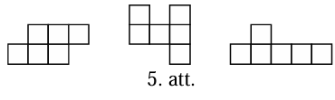
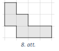

# 2.temats: Invarianti: Kas saglabājas, veicot atļautos gājienus

## 1.daļa. Nemainīga izteiksme, summa un atlikums

| Kāpnes | Uzdevumi |
|---|---|
| Iesildīšanās | LV.NOL.2015.6.2 (summas paritāte), LV.NOL.2010.7.1 (summa nemainās) |
| Viennozīmīga metode | LV.AMO.2022A.7.2 (atlikums, dalot ar $3$), LV.AMO.2022A.8.2 (atlikums, dalot ar $4$), LV.NOL.2013.7.4 (starpību summa pa apli), LV.NOL.2023.7.5 (paritāte katrai krāsai; (B) vajag arī piemēru) |
| Neviennozīmīga metode | LV.AMO.2024.7.3 (pirmreizinātāju skaita paritāte), LV.AMO.2017.7.4 (pats jāatrod, ko skaitīt) |

## LV.NOL.2015.6.2

Bagātajai Austrumu princesei Smuidrai zem gultas ir $6$ lādes. Sākumā lādēs ir
attiecīgi $1,\ 5,\ 0,\ 0,\ 2,\ 3$ zelta monētas. Katru stundu viņa izvēlas $2$
lādes un katrā no tām pieliek klāt $1$ monētu. Vai, atkārtoti izpildot šādas
darbības, var panākt, ka kādā brīdī visās lādēs būs vienāds skaits monētu?

(*Izpēte*): Par cik mainās **visu** monētu kopskaits vienā gājienā? Kāda
paritāte ir sešu vienādu skaitļu summai? `#FixedInvariant`

## LV.NOL.2010.7.1

Rindā no sākuma bija uzrakstīti $2009$ vieninieki. Ar vienu gājienu nodzēš
divus pirmos rindā esošos skaitļus un tās otrā galā pieraksta abu nodzēsto
skaitļu summu. Šādus gājienus atkārto, līdz rindā paliek tikai viens skaitlis.

**(A)** cik gājienu tiks izdarīti?
**(B)** atrast vienīgo palikušo skaitli.

(*Izpēte*): Viens gājiens maina divus lielumus — skaitļu **daudzumu** un to
**summu**. Kurš no tiem katrā gājienā dilst par $1$, un kurš nemainās vispār?
`#FixedInvariant`

## LV.AMO.2022A.7.2

Karlsonam ir $30$ milzīgi tortes gabali. Viņš izvēlas trīs gabalus un sagriež
katru no tiem vai nu $3$, vai $5$ mazākos gabalos (visus izvēlētos gabalus
sagriež vienādā skaitā mazāku gabalu). Tad viņš atkal izvēlas kādus $3$ gabalus
un sagriež katru no tiem vai nu $3$, vai $5$ mazākos gabalos. Vai, atkārtoti
izpildot šādas darbības, Karlsons var iegūt tieši $2000$ tortes gabalus?

(*Izpēte*): Sagriežot vienu gabalu $3$ daļās, gabalu skaits pieaug par $2$; ja
$5$ daļās — par $4$. Cik tas ir par visiem trim gabaliem kopā? Ar kuru skaitli
dalās abi iespējamie pieaugumi? `#ParityAndRemainders`

## LV.AMO.2022A.8.2

Kādā dienā Karlsons uzlika uz galda $44$ kūciņas. Karlsons izdomāja, ka vienā
piegājienā viņš apēdīs vai nu $5$ kūciņas, vai arī $10$ kūciņas. Ja Karlsons
apēda $5$ kūciņas, tad Brālītis uzreiz uz galda uzlika $9$ kūciņas. Ja Karlsons
apēda $10$ kūciņas, tad Brālītis uzreiz uz galda uzlika $2$ kūciņas. Vai
iespējams, ka uz galda kādā brīdī bija tieši $2022$ kūciņas?

(*Izpēte*): Saskaiti abu gājienu **kopējo** iznākumu: $-5+9$ un $-10+2$. Ar
kuru skaitli dalās abas šīs izmaiņas? Vai ar to dalās $44$? Vai $2022$?
`#ParityAndRemainders`

## LV.NOL.2013.7.4

Vai pa riņķi var uzrakstīt $13$ naturālus skaitļus tā, lai jebkuru blakus esošu
skaitļu starpība būtu $6, 10, 14$ vai $18$?

(*Pārformulēšana*): Ejot pa apli vienu pilnu apli, visu starpību (ar zīmēm
$+$ vai $-$) summa ir $0$. Kādu atlikumu, dalot ar $4$, dod katrs no skaitļiem
$6, 10, 14, 18$? Kāds tad ir $13$ šādu saskaitāmo summas atlikums?
`#ParityAndRemainders`

## LV.NOL.2023.7.5

Kastē atrodas baltas, sarkanas un zaļas lodītes. Ar vienu gājienu no kastes var
izņemt divas dažādu krāsu lodītes un ielikt kastē vienu trešās krāsas lodīti
(vienmēr pietiek jebkuras krāsas lodīšu, ko ielikt kastē). Vai var panākt, ka
kastē paliek tikai viena lodīte, ja sākumā kastē atrodas: **(A)** $10$ baltas,
$12$ sarkanas un $16$ zaļas lodītes; **(B)** $10$ baltas, $12$ sarkanas un $15$
zaļas lodītes?

(*Izpēte*): Viens gājiens maina **visu trīs** krāsu lodīšu skaitu par $1$ —
tātad maina visas trīs paritātes uzreiz. Kādas paritātes ir beigu stāvoklī
$(1,0,0)$? Atceries: (A) un (B) atbildes var būt dažādas, un "jā" gadījumā
vajag arī konkrētu gājienu virkni. `#ParityAndRemainders`

## LV.AMO.2024.7.3

Skaitļu virknes pirmais loceklis ir $12$. Katru nākamo iegūst iepriekšējo vai
nu reizinot ar $2$ vai $3$, vai arī izdalot ar $2$ vai $3$ (ja tas dalās bez
atlikuma). Vai šīs skaitļu virknes 61.loceklis var būt skaitlis $54$?

(*Pārformulēšana*): Nevis pats skaitlis, bet tā **pirmreizinātāju skaits**
($12 = 2 \cdot 2 \cdot 3$, tātad trīs) ir tas, kas mainās vienkārši. Par cik
tas mainās vienā gājienā? Cik gājieni vajadzīgi no $1.$ līdz $61.$ loceklim?
`#ParityAndRemainders`

## LV.AMO.2017.7.4

Uz galda stāv divas kastes $A$ un $B$. Sākumā kastē $A$ ir melnas un baltas
bumbiņas, bet kastē $B$ ir tikai melnas bumbiņas. Bumbiņu skaits abās kastēs ir
vienāds. Anna no kastes $A$ uz labu laimi izņem divas bumbiņas:

* ja tās ir vienādā krāsā, tad tās abas ieliek kastē $B$, un vienu melnu
  bumbiņu no kastes $B$ ieliek kastē $A$;
* ja tās ir dažādās krāsās, tad balto bumbiņu ieliek atpakaļ kastē $A$, bet
  melno — kastē $B$.

Tā turpina, kamēr kastē $A$ paliek tieši viena bumbiņa. Kādā krāsā būs pēdējā
bumbiņa, kas palikusi kastē $A$, ja sākumā kastē $A$ ir **(A)** $2017$ baltas
un $2017$ melnas bumbiņas; **(B)** $2016$ baltas un $2018$ melnas bumbiņas?

(*Izpēte*): Nesekojiet visam uzreiz — izvēlieties **vienu** skaitli. Uzzīmējiet
tabulu ar trim gājienu veidiem un ierakstiet, par cik mainās balto bumbiņu
skaits kastē $A$. `#FixedInvariant`

# 2.daļa. Palīgkrāsojums, spēles un monovarianti

| Kāpnes | Uzdevumi |
|---|---|
| Iesildīšanās | LV.AMO.2015.6.2 (šaha krāsojums un domino), LV.NOL.2015.7.3 (krāsojums palīdz uzbūvēt piemēru) |
| Viennozīmīga metode | LV.AMO.2015.7.2 (melno rūtiņu skaita paritāte), LV.AMO.2015.8.2 (tas pats solis lielākā taisnstūrī), LV.AMO.2016.7.5 (varde maina krāsu katrā lēcienā), LV.AMO.2016.8.5 (uzvarošo/zaudējošo rūtiņu krāsojums) |
| Neviennozīmīga metode | LV.AMO.2022A.7.3 (novērtējums + konstrukcija), LV.NOL.2013.8.5 (monovariants un piemērs) |

## LV.AMO.2015.6.2

Vai kvadrātu ar izmēriem $12 \times 12$ rūtiņas, kuram no diviem pretējiem
stūriem izgriezti taisnstūri $3 \times 5$ rūtiņas, var pārklāt ar $57$
taisnstūriem, kuru izmēri ir $1 \times 2$ rūtiņas?

(*Izpēte*): Cik melnas un cik baltas rūtiņas noklāj **viens** domino kauliņš?
Cik melnas rūtiņas ir vienā izgrieztajā $3 \times 5$ taisnstūrī? Pārbaudi abus
izgriešanas variantus (abi vienādi pagriezti / dažādi pagriezti).
`#AuxiliaryColoring`

## LV.NOL.2015.7.3

Tabulā, kuras izmēri ir $3 \times 3$ rūtiņas, katrā rūtiņā ierakstīts viens
naturāls skaitlis, kas nepārsniedz $10$, visi ierakstītie skaitļi ir dažādi.
Katrām divām rūtiņām ar kopīgu malu aprēķina tajos ierakstīto skaitļu summu.
Vai iespējams, ka visas iegūtās summas ir pirmskaitļi?

(*Saprašana*): Divu naturālu skaitļu summa ir vismaz $3$, tātad katrs
pirmskaitlis šeit ir nepāra. Ko tas nosaka par blakus rūtiņu skaitļu paritāti?
Krāso tabulu kā šaha galdiņu — pāra un nepāra skaitļi var stāvēt tikai tā.
`#AuxiliaryColoring`

## LV.AMO.2015.7.2

Vai taisnstūri ar izmēriem $7 \times 6$ rūtiņas var pārklāt ar 4.att.
redzamajām figūrām? Taisnstūrim jābūt pilnībā pārklātam. Figūras nedrīkst iziet
ārpus taisnstūra, figūras nedrīkst pārklāties, tās drīkst būt pagrieztas vai
apgrieztas spoguļattēlā.

(*Izpēte*): Cik melnas rūtiņas ir šaha veidā nokrāsotā $7 \times 6$ taisnstūrī?
Cik melnas rūtiņas noklāj katra no trim figūrām — pārbaudi **visus** to
pagriezienus. `#AuxiliaryColoring`

## LV.AMO.2015.8.2

Vai taisnstūri ar izmēriem $10 \times 9$ rūtiņas var pārklāt ar 5.att.
redzamajām figūrām? Taisnstūrim jābūt pilnībā pārklātam. Figūras nedrīkst iziet
ārpus taisnstūra, figūras nedrīkst pārklāties, tās drīkst būt pagrieztas vai
apgrieztas spoguļattēlā.

(*Atskats*): Tas pats spriedums, kas iepriekšējā uzdevumā, tikai ar citiem
skaitļiem. Vai tavs pamatojums tiešām aptver visus figūru novietojumus, nevis
tikai dažus uzzīmētos? Der arī krāsojums joslās — pamēģini abus.
`#AuxiliaryColoring`

## LV.AMO.2016.7.5

Kvadrāts sadalīts $12 \times 12$ vienādās kvadrātiskās rūtiņās un izkrāsots kā
šaha galdiņš. Četrdesmit trijās baltajās rūtiņās sēž pa vienai mušai. Varde
lēkā pa kvadrātu, katrā lēcienā šķērsojot divu rūtiņu kopējo malu. Tā nelec
caur rūtiņu stūri un nelec rūtiņā, kurā tā jau ir bijusi. Ielecot rūtiņā, kurā
sēž muša, varde to apēd. Zināms, ka varde ir bijusi vismaz $100$ rūtiņās.
Pierādīt, ka varde ir apēdusi vismaz $21$ mušu!

(*Pārformulēšana*): Krāsa mainās katrā lēcienā, tātad apmeklētās rūtiņas iet
pamīšus melna–balta. Cik **baltu** rūtiņu varde ir apmeklējusi vismaz? Cik
baltu rūtiņu ir pavisam un cik tad var palikt neapmeklētas?
`#AuxiliaryColoring`

## LV.AMO.2016.8.5

Divi spēlētāji spēlē spēli uz $N \times N$ rūtiņas liela laukuma. Sākumā
laukuma kreisajā apakšējā rūtiņā atrodas spēļu kauliņš. Katrā gājienā spēļu
kauliņu drīkst pārvietot vai nu vienu lauciņu pa labi, vai vienu lauciņu uz
augšu, vai arī divus lauciņus pa diagonāli uz augšu pa labi (skat. 12.att.).
Kauliņu nedrīkst pārvietot ārpus laukuma robežām. Spēlētāji gājienus izdara pēc
kārtas. Zaudē spēlētājs, kurš nevar izdarīt gājienu. Kurš no spēlētājiem,
pareizi spēlējot, uzvar, ja **(A)** $N=7$, **(B)** $N=8$?

(*Izpēte*): Analizē spēli **no beigām**. Labā augšējā rūtiņa ir zaudējoša.
Rūtiņa ir uzvaroša, ja no tās var aiziet uz kādu zaudējošu. Aizpildi visu
laukumu ar burtiem $U$ un $Z$ — iegūtais krāsojums arī ir invariants.
`#AuxiliaryColoring`

## LV.AMO.2022A.7.3

Vai taisnstūri ar izmēriem $3 \times 3370$ rūtiņas var noklāt ar 8.att.
redzamām figūrām tā, lai paliktu tieši $2022$ nenoklātas rūtiņas? Dotās figūras
malām jāiet pa rūtiņu līnijām, tā var būt pagriezta vai apgriezta spoguļattēlā,
figūras nedrīkst pārklāties vai iziet ārpus taisnstūra.

(*Saprašana*): Šeit atbilde ir "jā", tāpēc invariants viens pats nepietiek —
vajag **konstrukciju**. Sadali garo taisnstūri vienādos gabalos $3 \times 5$ un
saskaiti, cik rūtiņu paliek nenoklātas vienā tādā gabalā. Cik gabalu sanāk?
`#ExampleAndBound`

## LV.NOL.2013.8.5

Rindā kaut kādā secībā stāv $10$ zēni un $10$ meitenes. Divus bērnus var mainīt
vietām, ja starp tiem stāv ne vairāk kā $9$ citi bērni.

**(A)** Pierādi, ka ar $10$ maiņām noteikti pietiek, lai panāktu, ka vispirms
stāv $10$ zēni un pēc tam $10$ meitenes.
**(B)** Pierādi, ka sākuma situācija var būt tāda, ka ar $9$ maiņām nevar
panākt, ka vispirms stāv $10$ zēni un pēc tam $10$ meitenes.

(*Izpēte*): (A) Kārto pozīcijas pēc kārtas: ja $1.$ vietā ir meitene, kur
noteikti atrodas kāds zēns, ar ko to samainīt? (B) Izvēlies vissliktāko sākuma
izkārtojumu. Cik zēnu vietu **vienā** maiņā var izmainīt? `#ExampleAndBound`
