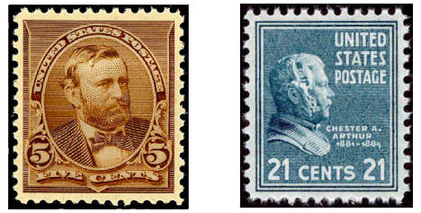

# 7.1.B. Atrisinājumu struktūras: Vispārīgie un atsevišķie apgalvojumi

> Ja kaut ko **var izdarīt** - pamato ar konkrētu piemēru, ja **nevar izdarīt** - ar vispārīgu spriedumu.

Apgalvojumi bieži ir par kādu nezināmu parametru $n$ (vai $a$ vai $b$).  
Ja parametrs $n$ **eksistē** - Jūs (kā risinātājs) pats varat izvēlēties šo parametru.  
Ja parametrs $n$ **neeksistē** - Parametru izvēlas žūrija (Jūs olimpiādes rakstīšanas laikā 
nezināt kādu), un Jūsu spriedumam jāparāda, ka viņiem nekas nesanāks.

**1.piemērs:** Ir divu veidu pastmarkas - ar vērtību $5$ centi un $21$ cents.
**(A)** Vai ar šīm pastmarkām var apmaksāt $79$ centus? 
**(B)** Vai eksistē summa $n>79$, kuru nevar apmaksāt ar šīm pastmarkām?  

**(A)** Pamatosim, ka nevar. JEB neeksistē $a \geq 0$ un $b \geq 0$, kam $5a + 21b = 79$.  
**(B)** Pamatosim, ka šāda summa neeksistē. JEB katram $n>79$ būs tādi 
$a \geq 0$ un $b \geq 0$, ka $5a + 21b = n$.

{: width="200"}

**2.piemērs:** Uz tāfeles uzrakstīts garš skaitlis $n = 12345678910111213$.  
**(A)** Cik dažādos veidos tajā var samainīt vietām divus ciparus tā, lai 
iegūtais skaitlis dalītos ar $4$?
**(B)** Cik dažādos veidos tajā var kādu no cipariem aizstāt ar ciparu "2"
tā, lai iegūtais skaitlis dalītos ar $9$?

**3.piemērs:** Kuram naturālam skaitlim, saskaitot ar savu ciparu summu, iegūst skaitli $328$.

* *Saprašana:* Risinājumā būs divas daļas. (1) parādīt skaitļus, kas der; (2) pierādīt, ka citu nav.
* *Izpēte:* Izmēģini: $300+3 = 303$, $310+4 = 314$, $320+5 = 325$. Cik lieli skaitļi jāmeklē?
3. *Risināšana:* Vai mums der divciparu skaitļi? Četrciparu skaitļi?
4. *Risināšana:* Ciparu summa nepārsniedz $3+9+9 = 21$, tātad skaitlis ir vismaz $328−21 = 307$. 
   Pirmais cipars ir 3, otrais cipars ir 0, 1 vai 2.
5. *Risināšana:* Kas notiek, ja otrais cipars ir 0? Vai 1? Vai 2? 
6. *Atskats:* Pārbaudām atrisinājumu. Vai no mūsu pieraksta redzams, ka nekas nav izlaists?

<!--
Sk. arī LV.AMO.2015.5.4.
-->

---

## 1.uzdevums

Kāda lielākā ciparu summa var būt desmitciparu skaitlim, kas dalās ar $18$?

* *Saprašana:* "Lielākā" prasa divas daļas: piemēru, kurā vērtība sasniegta, un pamatojumu, ka lielāka nav iespējama.
* *Pārformulēšana:* Ar $18$ skaitlis dalās tad, ja tas dalās ar $2$ un ar $9$ (pāra skaitlis, kam ciparu summa dalās ar $9$).

<!--
LV.NOL.2024.7.2 — "Lielākā vērtība"
-->

## 2.uzdevums

Cik dažādus naturālus skaitļus, kam visi cipari ir dažādi, var izveidot no 
cipariem $2,\ 0,\ 1,\ 8$?

* *Saprašana:* Vai jāizmanto visi 4 cipari? Ar kādu ciparu var sākties naturāls skaitlis?
* *Saprašana:* "Cik?" – jāpārliecina lasītājs, ka nekas nav izlaists un nekas nav saskaitīts divreiz.
* *Izpēte:* Izraksti viencipara un divciparu skaitļus augošā secībā.
* *Risināšana:* Cik dažādus ciparus var likt trīsciparu skaitļa 1.pozīcijā? 2.pozīcijā? 3.pozīcijā?

<!--
LV.AMO.2018.7.1 — "Cik?" (sakārtota pilnā pārlase)
-->