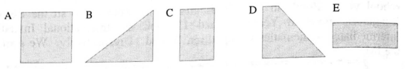
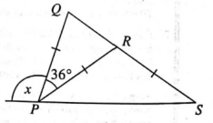
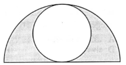
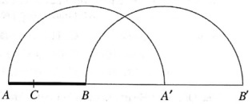
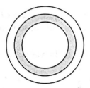
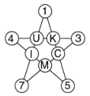
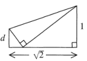

# 1. īso atbilžu tests

1. Kurš no šiem skaitļiem ir vislielākais?

**(A)** $19 \times 99$; 
**(B)** $199 \times 9$; 
**(C)** $199^9$; 
**(D)** $1^9 \times 9^9$; 
**(E)** $1^{999}$.

2. A4 formāta papīra lapu $(297\text{mm} \times 210\text{mm})$ vienreiz pārloka 
pa taisnu līniju un noliek uz galda. Kuru no šīm figūrām tādā veidā nevar iegūt?

   

3. Kāds uzņēmums piedāvā "750 bezmaksas LLM lietošanas stundas jaunajiem abonentiem". 
Rūpīgāk ieskatoties, kļūst skaidrs, ka šis laiks ir jāizlieto abonenta pirmajā 
dalības mēnesī.

   Kāds ir lielākais iespējamais stundu skaits vienā gada mēnesī?

**(A)** 168;
**(B)** 692;
**(C)** 720;
**(D)** 744;
**(E)** 750.

4. Ieva Divija ar kalkulatoru sareizināja skaitli ar $20$, nevis ar $2$. 
Ko viņa tagad var izdarīt, lai iegūtu pareizo atbildi?

**(A)** izdalīt ar 20;
**(B)** izdalīt ar 40;
**(C)** sareizināt ar 10;
**(D)** sareizināt ar 0,5;
**(E)** sareizināt ar 0,1.

5. $30 \div 0{,}2$ ir vienāds ar

**(A)** 1,5;
**(B)** 6;
**(C)** 15;
**(D)** 150;
**(E)** 600.

6. Lielbritānijā viens cilvēks 1996. gadā vidēji apēda $9{,}6~\mathrm{kg}$ banānu
gadā (tas ir, apmēram $60$ banānus). Dažviet Āfrikā banānu patēriņš 
sasniedz $250~\mathrm{kg}$ banānu uz vienu cilvēku gadā. Apmēram cik banānu tas ir?

**(A)** 4 vai 5 dienā;
**(B)** 1 vai 2 dienā;
**(C)** 4 vai 5 nedēļā;
**(D)** 1 vai 2 nedēļā;
**(E)** 4 vai 5 mēnesī.

7. Kurš no šiem skaitļiem ir vismazākais?

**(A)** $\dfrac{(2+3)}{(4+6)}$;
**(B)** $\dfrac{(2 \div 3)}{(4 \div 6)}$;
**(C)** $\dfrac{23}{46}$;
**(D)** $\dfrac{(2-3)}{(4-6)}$;
**(E)** $\dfrac{(2 \times 3)}{(4 \times 6)}$.

8. Zīmējumā $PQ = PR = RS$. Cik liels ir leņķis $x$?

**(A)** $54^\circ$, **(B)** $72^\circ$, **(C)** $90^\circ$, **(D)** $108^\circ$, **(E)** $144^\circ$

9. Ir vakars, un Maija, kuras augums ir $1~\mathrm{m}$, met 
$3~\mathrm{m}$ garu ēnu. Ja Maija uzkāpj sava brāļa plecos, 
kas atrodas $1{,}5~\mathrm{m}$ virs zemes, cik garu ēnu metīs viņa kopā ar brāli?

**(A)** 3 m, **(B)** 4,5 m, **(C)** 5,5 m, **(D)** 6,5 m, **(E)** 7,5 m

10. 1998. gada martā kādā Saseksas bibliotēkā tika atdota atpakaļ grāmata 
*Austrumu ēna*. Tā bija paņemta 1924. gada 3. janvārī! Bibliotēka par 
kavētām grāmatām soda ar 60 pensiem nedēļā. Apmēram cik lielu soda naudu 
vajadzēja samaksāt cilvēkam, kurš atdeva šo grāmatu?

**(A)** £45, **(B)** £180, **(C)** £230, **(D)** £2200, **(E)** £16 000

11. "20% atlaide visam!" — tā bija rakstīts uz izpārdošanas plakātiem. 
Es samaksāju £60. Cik es būtu samaksājis pirms izpārdošanas?

**(A)** £60, **(B)** £66, **(C)** £72, **(D)** £75, **(E)** £80

12. Taisnleņķa trijstūrī abu īsāko malu garumi ir $10~\mathrm{cm}$ 
un $5~\mathrm{cm}$. Kurš no šiem tuvinājumiem ir vistuvākais hipotenūzas garumam?

**(A)** 11 cm, **(B)** 11,5 cm, **(C)** 12 cm, **(D)** 12,5 cm, **(E)** 13 cm

13. Zīmējumā redzams pusaplis, kurā ievilkts riņķis, kas pieskaras 
pusapļa lokam un iet caur tā centru. Kāda daļa no pusapļa ir iekrāsota?

**(A)** $\dfrac{2}{3}$, **(B)** $\dfrac{1}{2}$, **(C)** $\dfrac{1}{\pi}$, **(D)** $\dfrac{2}{\pi}$, **(E)** $\dfrac{3}{\pi}$

14. Kurš no šiem apgalvojumiem ir aplams?

**(A)** astoņstūrim ir divdesmit diagonāles,  
**(B)** sešstūrim ir deviņas diagonāles,  
**(C)** sešstūrim ir par četrām diagonālēm vairāk nekā piecstūrim,  
**(D)** piecstūrim ir tikpat daudz diagonāļu, cik malu,  
**(E)** četrstūrim ir divreiz vairāk diagonāļu nekā malu. 

15. Uz galda guļošu zīmuli $AB$ vispirms pagriež par $180^\circ$ 
ap galu $B$ (tā ka $A$ pārvietojas uz $A'$) un pēc tam pagriež 
par $180^\circ$ ap $A'$ (tā ka $B$ pārvietojas uz $B'$). 
Punkts $C$ uz zīmuļa atrodas vienu trešdaļu ceļa no $A$ uz $B$.

Kāda ir attiecība starp kopējiem attālumiem, ko veic $A$ un ko veic $C$?

**(A)** 3:1, **(B)** 3:2, **(C)** 1:1, **(D)** 2:3, **(E)** 1:3

16. Doti trīs apgalvojumi.

(i) $3^{10}$ ir pāra skaitlis  
(ii) $3^{10}$ ir nepāra skaitlis  
(iii) $3^{10}$ ir kvadrāts

Kuri tieši no tiem ir patiesi?

**(A)** tikai (i), **(B)** tikai (ii), **(C)** tikai (iii), 
**(D)** (i) un (iii), **(E)** (ii) un (iii)

17. Zīmējumā redzamajiem trim riņķiem ir kopīgs centrs, un to rādiusi ir 3 cm, 4 cm un 5 cm. Cik procentu no lielākā riņķa laukuma ir iekrāsoti?

**(A)** 20%, **(B)** 25%, **(C)** 28%, **(D)** 30%, **(E)** $33\frac{1}{3}\%$

18. Septiņdesmit skolēnus (37 zēnus un 33 meitenes) sadala divās grupās: I grupā ir četrdesmit skolēni, bet II grupā — trīsdesmit skolēni. Par cik vairāk zēnu ir I grupā nekā meiteņu II grupā?

**(A)** 4, **(B)** 7, **(C)** 8, **(D)** 9, **(E)** nepieciešama papildu informācija

19. Četri *vigli* ir tas pats, kas trīs *vogli*; divi *vogli* ir tas pats, kas pieci *vagli*; un seši *vagli* ir tas pats, kas viens *vugls*. Kurš no tiem ir vismazākais?

**(A)** 1 *vugls*, **(B)** 2 *vogli*, **(C)** 3 *vagli*, **(D)** 4 *vigli*, **(E)** diviem no tiem ir vienāda vērtība

20. Inspektors Remorss lēš, ka vidēji vienu slepkavību viņš var atrisināt 
$x$ stundās, bankas aplaupīšanu — divreiz ātrāk, bet auto zādzību — 
trīsreiz ātrāk, nekā viņam vajag bankas aplaupīšanas atrisināšanai. 
Cik stundu viņš plāno patērēt divu slepkavību, sešu automašīnu 
zādzību un četru bankas aplaupīšanu atrisināšanai?

**(A)** $3x$, **(B)** $5x$, **(C)** $6x$, **(D)** $7x$, **(E)** $12x$

21. Kad tieši reizinājuma $(1+\frac{1}{2})(1+\frac{1}{3})(1+\frac{1}{4})\ldots(1+\frac{1}{n})$ vērtība ir vesels skaitlis?

**(A)** kad $n$ ir nepāra skaitlis, **(B)** kad $n$ ir pāra skaitlis, **(C)** kad $n$ dalās ar 3, **(D)** vienmēr, **(E)** nekad.

22. Kafejnīcā *Mīkstais laukakmens* katram galdam ir 3 kājas, 
katram krēslam ir 4 kājas, un visiem apmeklētājiem un trim 
darbiniekiem ir pa divām kājām. Pie katra galda ir četri krēsli. 
Kādā brīdī trīs ceturtdaļas krēslu ir aizņēmuši apmeklētāji, 
un kafejnīcā kopā ir 206 kājas. Cik krēslu ir kafejnīcā?

**(A)** 20, **(B)** 24, **(C)** 28, **(D)** 32, **(E)** 36.

23. Attēlotajā zvaigznē četru skaitļu summa uz jebkuras taisnes ir 
viena un tā pati visām piecām novilktajām taisnēm. Piecas trūkstošās 
vērtības ir 9, 10, 11, 12 un 13. Kurš skaitlis ir apzīmēts ar $K$?

**(A)** 9, **(B)** 10, **(C)** 11, **(D)** 12, **(E)** 13.

24. Ercu karalienei tika nozagti mafini. Viņa ir pārliecināta, 
ka bruņinieki, kuri mafinus nav aiztikuši, teiks viņai patiesību, 
bet vainīgie bruņinieki melos. Kad viņiem uzdod jautājumus, pieci 
bruņinieki saka sekojošo:

K1: "Tos apēda viens no mums."  
K2: "Tos apēda divi no mums."  
K3: "Tos apēda trīs no mums."  
K4: "Tos apēda četri no mums."  
K5: "Tos apēda pieci no mums."

Cik bruņinieku bija godīgi?

**(A)** 1, **(B)** 2, **(C)** 3, **(D)** 4, **(E)** 5.

25. Taisnstūrveida papīra lapa ar malām 1 un $\sqrt{2}$ ir vienu 
reizi pārlocīta, kā parādīts attēlā, tā ka viens stūris tieši 
saskaras ar pretējo garo malu. Kāda ir garuma $d$ vērtība?

**(A)** $\frac{1}{2}$, **(B)** $\sqrt{2}-1$, **(C)** $\frac{7}{16}$, **(D)** $\sqrt{3}-\sqrt{2}$, **(E)** $\frac{\sqrt{2}}{3}$.
