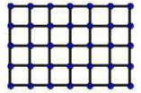

# 9.1. Atrisinājumu struktūras: Uzdevumi

Uzdevumi dažādiem jautājumu tipiem. Katram uzdevumam pārdomā, kāda atbildes struktūra tam atbilst.

| Uzdevumi 1.–12. | Uzdevumi 13.–24. |
|:---|:---|
| **(1)** Kāds cipars var būt \* vietā, lai skaitlis 987\* dalītos ar 5? | **(13)** Skaitļi $a$, $b$ un $c$ ir naturāli skaitļi. Cik no skaitļiem $a + b$, $a + c$, $b + c$, $a \cdot b$, $a \cdot c$, $b \cdot c$ var būt pāra skaitļi? |
| **(2)** Kāds ir mazākais sešciparu skaitlis, kas sastāv tikai no cipariem 2, 0, 1, 3 un dalās ar 9? Cipari drīkst atkārtoties un visi cipari nav jāizmanto. | **(14)** Pirtiņā ir četras lāvas. Pirtī pērties iegāja deviņi cilvēki. Vai noteikti būs tāda lāva, uz kuras sēdēs vismaz trīs cilvēki tad, kad visi būs apsēdušies? |
| **(3)** Vai eksistē tādi naturāli skaitļi $a$ un $b$, ka:   a) $8 \cdot a - 12 \cdot b = 2023$;   b) $12 \cdot a - 8 \cdot b = 2024$? | **(15)** Daina, izmantojot visus ciparus, burtnīcā ierakstīja desmitciparu skaitli. Vai šis skaitlis noteikti dalās ar 3? |
| **(4)** Cik 4-centu pastmarku nepieciešams, lai izveidotu vērtību 35 centi, izmantojot tikai 4-centu un 9-centu pastmarkas? | **(16)** Vai var atrast tādus četrus dažādus naturālus skaitļus $a$, $b$, $c$, $d$, ka $\frac{1}{a} + \frac{1}{b} + \frac{1}{c} + \frac{1}{d} = 1$? |
| **(5)** Kāda ir lielākā iespējamā ciparu summa septiņciparu naturālam skaitlim, kas dalās ar 8? | **(17)** Klasē ir 40 skolēnu. Vai noteikti ir tāds mēnesis, kurā savu dzimšanas dienu atzīmē vismaz četri šīs klases skolēni? |
| **(6)** Vai skaitļa kvadrāts noteikti ir lielāks nekā pats skaitlis? | **(18)** Kurš no divciparu skaitļiem ir lielākais, kas dalās vai nu ar 2, vai 7? |
| **(7)** Vai vienmēr, negatīvam skaitlim pieskaitot tā kvadrātu, iegūst pozitīvu skaitli? | **(19)** Vai ir iespējams uzzīmēt 5 taisnes, kurām ir tieši 11 krustpunkti? |
| **(8)** Kāds mazākais skaits punktu jānodzēš, lai nekādi trīs no atlikušajiem punktiem neatrastos uz vienas taisnes? {: width="70"} | **(20)** Attēlā redzams zvejošanas tīkls. Ar vienu griezienu drīkst pārgriezt vienu auklu, kas savieno divus blakus esošus mezglus. Kāds ir lielākais skaits griezienu, ko var izdarīt, nesadalot tīklu divās atsevišķās daļās? {: width="120"} |
| **(9)** Tabulā ar izmēriem 6x6 rūtiņās ierakstīti skaitļi $-1$, $0$ un $1$, katrā rūtiņā viens skaitlis. Guna aprēķināja katrā rindā, katrā kolonnā un abās galvenajās diagonālēs ierakstīto skaitļu summas. Vai noteikti starp iegūtajām summām ir vismaz divas vienādas? | **(21)** Uz tāfeles uzrakstīti skaitļi $0$; $1$; $0$; $0$. Ar vienu "gājienu" var izvēlēties jebkurus divus no tiem un abiem pieskaitīt vieninieku. Vai, atkārtojot šādus "gājienus", var panākt, lai visi skaitļi kļūtu vienādi? |
| **(10)** Kādus veselus skaitļus var ievietot $x$ un $y$ vietā, lai iegūtu patiesu vienādību $(x - 2) \cdot (y - 2) = 4$? | **(22)** Cik dažādos veidos skaitli 50 var izteikt kā divu pirmskaitļu summu? Piezīme: $x + y$ un $y + x$ nav dažādi veidi. |
| **(11)** Vai ir iespējams uzzīmēt 5 taisnes, kurām ir tieši 5 krustpunkti? | **(23)** Kāds ir lielākais divciparu skaitlis, kas dalās ar 2 vai 5? |
| **(12)** Vai var atrast tādu naturālu skaitli, kuram ir tieši 12 dažādi veselie pozitīvi dalītāji? | **(24)** Kādos divos daudzstūros taisne var sadalīt kvadrātu? |
