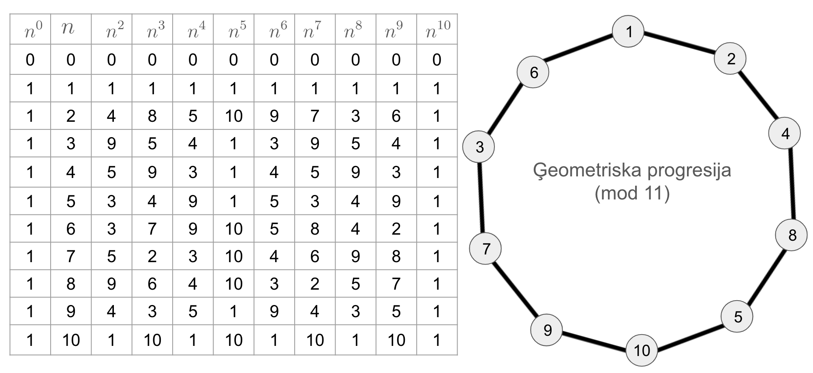
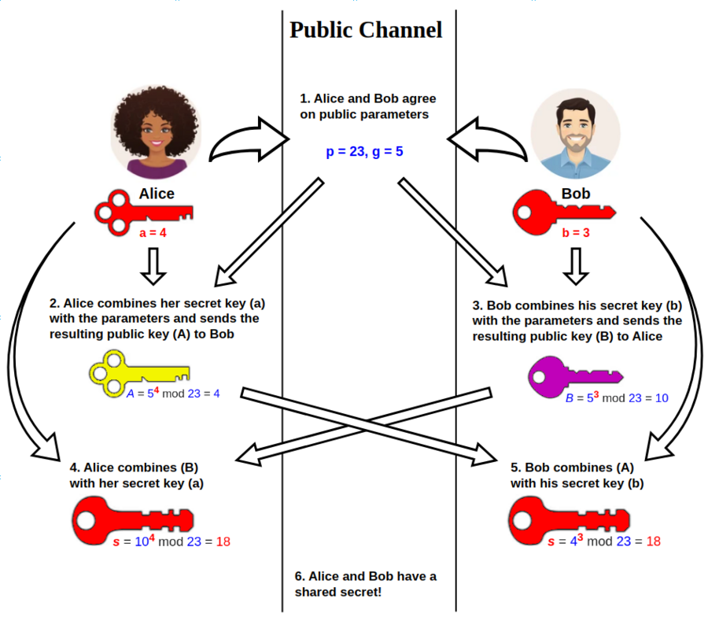

Dirihlē princips un skaitļu teorija
====================================

Atklātajai matemātikas olimpiādei 24.novembrī izziņota viena 
uzdevuma tēma -- Dirihlē princips.
Sk. `<https://www.nms.lu.lv/olimpiades/atklata-olimpiade/>`_. 
Aplūkojam dažus ar to saistītus piemērus.

Funkciju vērtību sadursmes
---------------------------

**Dirihlē princips** 
  Ja vairāk kā :math:`n` objekti salikti :math:`n` kastēs, tad 
  noteikti būs tāda kaste, kurā nonāks vismaz :math:`2` objekti. 

**Definīcija:** 
  Funkciju :math:`f:A \rightarrow B` sauc par *injektīvu*, ja 
  tai nav kolīziju jeb sadursmju: Ja :math:`a_1 \neq a_2`, 
  tad arī :math:`f(a_1) \neq f(a_2)`. 

**Piemēri:** 

  **(A)**
    Funkcija :math:`f(x) = x^2`, kas attēlo nenegatīvos skaitļus 
    :math:`[0; + \infty)` uz nenegatīviem skaitļiem, ir injektīva: 
    Ja :math:`a < b`, tad arī :math:`a^2 < b^2`. 
    (Tāpēc var uztaisīt inverso funkciju: :math:`g(x) = \sqrt{x}`, kas 
    no kvadrātfunkcijas vērtības atrod argumentu.)

  **(B)** 
    Tā pati funkcija :math:`f(x) = x^2`, kas attēlo
    :math:`f:\mathbb{R} \rightarrow \mathbb{R}` NAV injektīva, 
    jo piemēram, :math:`2 \neq -2` bet :math:`f(2) = f(-2)`. 
    Tāpēc vienādojumam :math:`x^2 = 4` ir divas dažādas saknes.

  **(C)**
    Funkcija :math:`f`, kas definēta visiem Latvijas iedzīvotājiem un 
    katram piekārto personas kodu, ir injektīva -- neeksistē  kolīzijas:
    divi dažādi cilvēki ar vienādiem personas kodiem. 

**Uzdevums 1:** 
  Doti naturāli skaitļi no :math:`1` līdz :math:`8`. Pierādīt, ka, izvēloties jebkurus 
  piecus no tiem, varēs atrast tādus divus, kuru summa ir :math:`9`.

**Uzdevums 2:** 
  Pierādīt, ka starp jebkuriem sešiem naturāliem skaitļiem, 
  kas nedalās ar :math:`10`, var atrast divus tādus, kuru summa
  vai starpība dalās ar `10`.

**Uzdevums 3:** 
  Uz tāfeles uzrakstīti četru naturālu skaitļu kubi:  
  :math:`a^3, b^3, c^3, d^3`. 
  Pierādīt, ka no tiem atradīsies divi tādi, kuru summa vai 
  starpība dalās ar :math:`13`. 

.. code-block:: python

  [n**3 % 13 for n in range(0, 13)]

**Uzdevums 4:** 
  Dota funkcija, kas katram cilvēkam atrod dzimšanas datumu neatkarīgi no gada
  (pieņemam, ka ir tieši :math:`365` datumi, 29.februāri neizmantojam). 
  Uzrakstīt izteiksmi varbūtībai, ka starp :math:`n` cilvēkiem 
  būs cilvēki ar vienādām dzimšanas dienām. 

.. plot:: figs/birthdays.py
   :include-source: false
   :width: 5in
   :align: center

Reizināšana pēc pirmskaitļa moduļa 
------------------------------------

**Definīcija:** 
  Divus skaitļus saucam par *kongruentiem* pēc :math:`m` moduļa, 
  ja :math:`a - b` dalās ar :math:`m` (jeb abi skaitļi dod 
  vienādus atlikumus, dalot ar :math:`m`). Pieraksts:

  .. math:: 

    a \equiv b \pmod m. 

Aplūkojam nepāra pirmskaitli, piemēram :math:`p = 11`.
Izveidojam nenulles atlikumu kopu pēc moduļa :math:`11`: 

.. math:: 

  \mathbb{Z}_{11}^\times = \{ 1,2,3,4,5,6,7,8,9,10 \}

Šiem atlikumiem var izveidot reizināšanas tabulu -- katru 
divu atlikumu reizinājums arī ir skaitlis, kas dod noteiktu 
atlikumu, dalot ar :math:`11`: 

.. list-table:: 
   :header-rows: 1
   :align: center

   * - :math:`a \cdot b`
     - :math:`b = 1`
     - :math:`b = 2`
     - :math:`b = 3`
     - :math:`b = 4`
     - :math:`b = 5`
     - :math:`b = 6`
     - :math:`b = 7`
     - :math:`b = 8`
     - :math:`b = 9`
     - :math:`b = 10`
   * - :math:`a=1`
     - :math:`1`
     - :math:`2`
     - :math:`3`
     - :math:`4`
     - :math:`5`
     - :math:`6`
     - :math:`7`
     - :math:`8`
     - :math:`9`
     - :math:`10`
   * - :math:`a=2`
     - :math:`2`
     - :math:`4`
     - :math:`6`
     - :math:`8`
     - :math:`10`
     - :math:`1`
     - :math:`3`
     - :math:`5`
     - :math:`7`
     - :math:`9`
   * - :math:`a=3`
     - :math:`3`
     - :math:`6`
     - :math:`9`
     - :math:`1`
     - :math:`4`
     - :math:`7`
     - :math:`10`
     - :math:`2`
     - :math:`5`
     - :math:`8`
   * - :math:`a=4`
     - :math:`4`
     - :math:`8`
     - :math:`1`
     - :math:`5`
     - :math:`9`
     - :math:`2`
     - :math:`6`
     - :math:`10`
     - :math:`3`
     - :math:`7`
   * - :math:`a=5`
     - :math:`5`
     - :math:`10`
     - :math:`4`
     - :math:`9`
     - :math:`3`
     - :math:`8`
     - :math:`2`
     - :math:`7`
     - :math:`1`
     - :math:`6`
   * - :math:`a=6`
     - :math:`6`
     - :math:`1`
     - :math:`7`
     - :math:`2`
     - :math:`8`
     - :math:`3`
     - :math:`9`
     - :math:`4`
     - :math:`10`
     - :math:`5`
   * - :math:`a=7`
     - :math:`7`
     - :math:`3`
     - :math:`10`
     - :math:`6`
     - :math:`2`
     - :math:`9`
     - :math:`5`
     - :math:`1`
     - :math:`8`
     - :math:`4`
   * - :math:`a=8`
     - :math:`8`
     - :math:`5`
     - :math:`2`
     - :math:`10`
     - :math:`7`
     - :math:`4`
     - :math:`1`
     - :math:`9`
     - :math:`6`
     - :math:`3`
   * - :math:`a=9`
     - :math:`9`
     - :math:`7`
     - :math:`5`
     - :math:`3`
     - :math:`1`
     - :math:`10`
     - :math:`8`
     - :math:`6`
     - :math:`4`
     - :math:`2`
   * - :math:`a=10`
     - :math:`10`
     - :math:`9`
     - :math:`8`
     - :math:`7`
     - :math:`6`
     - :math:`5`
     - :math:`4`
     - :math:`3`
     - :math:`2`
     - :math:`1`

**Definīcija:** 
  Par skaitļa :math:`a` multiplikatīvi inverso pēc moduļa :math:`m`
  sauc tādu skaitli :math:`a^{-1}`, kam izpildās 
  :math:`a^{-1}a \equiv 1 \pmod p`. 

**Apgalvojums:** 
  Katram skaitlim :math:`a`, kas ir savstarpējs pirmskaitlis ar :math:`m`
  eksistē multiplikatīvi inversais. 

**Pierādījums:** 
  Pieņemsim no pretējā, ka neeksistē tāds skaitlis :math:`x`, kuram 
  :math:`ax` dod atlikumu :math:`1` dalot ar :math:`p`. 

  Aplūkosim visus atlikumus :math:`a \cdot 1, \ldots, a \cdot (p-1)`. 
  Ir pavisam :math:`p-1` dažādi atlikumi un neviens no tiem nevar būt 
  :math:`1` (pēc mūsu pieņēmuma). 

  Tāpēc pēc Dirihlē principa, atradīsies divi tādi skaitļi :math:`i > j`, kuriem 
  reizinājumi :math:`a \cdot i` un :math:`a \cdot j` dod vienādus atlikumus:

  .. math:: 

    a \cdot i \equiv a \cdot j \pmod p \quad \text{jeb} \quad 
    a \cdot (i - j) \pmod 0 \pmod p. 

  Bet skaitlis :math:`a \cdot (i-j)` nevar dalīties ar :math:`p`, 
  jo :math:`0 < i - j < p`. :math:`\square`

**Uzdevums 5:** 
  
  **(A)** 
    Atrast skaitļa :math:`20` multiplikatīvi inverso pēc 
    :math:`23` moduļa jeb atrisināt kongruenču vienādojumu: 
    :math:`20x \equiv 1 \pmod 23`. 

  **(B)** 
    Kādā valstī apgrozībā ir :math:`20` centu un :math:`23` centu monētas. 
    Iedomāsimies, ka pircējam ir tikai 20 centu monētas, bet pārdevējs var izdot tikai 
    :math:`23` centu monētas. Kā pircējs var samaksāt tieši 1 centu?

**Uzdevums 6:** 
  Skaitlis :math:`a` nedalās ar :math:`23`. 
  Pierādīt, ka kongruenču vienādojumam

  .. math:: 

    x^2 \equiv a \pmod 23

  ir vai nu divi atrisinājumi, vai arī nav neviena atrisinājuma.     

**Mazā Fermā teorēma:** 
  Ja :math:`p` ir pirmskaitlis, tad katram :math:`a`, 
  kurš nedalās ar :math:`p` ir spēkā sakarība:

  .. math::

    a^{p-1} \equiv 1 \pmod p

**Pierādījums:** 
  Aplūkojam visus skaitļus :math:`\{1,2,\ldots,p-1\}`. 
  Piereizinām tos visus ar :math:`a`. 
  Iegūsim :math:`\{1 \cdot a,2 \cdot a,\ldots,(p-1)\cdot a\}`. 
  
  Nav iespējams, ka diviem dažādiem :math:`i,j \in \{ 1,2,\ldots,p-1 \}`
  izpildās :math:`i \cdot a \equiv j \cdot a \pmod p`. 
  Citādi sanāktu, ka reizinājums :math:`a(i-j)` dalās ar :math:`p`. 
  :math:`\square`

Fermā teorēma parāda, cik ilgi skaitli var reizināt pašu ar sevi 
(veidot ģeometrisku progresiju pēc moduļa :math:`p`), lai 
atlikums kļūtu vienāds ar :math:`1`. 

Ne visiem skaitļiem būs visi :math:`10` nenulles atlikumi pēc moduļa :math:`11`. 
Apskatām modulārās kāpināšanas tabulu: 

**Uzdevums 7:** 
  Pierādīt, ka vienādojumam nav atrisinājuma:
  :math:`x^3 + y^3 + z^3 = 1969^2`. 

**Uzdevums 8:** 
  Doti pieci naturāli skaitļi. Šo skaitļu reizinājums apzīmēts ar :math:`R`, 
  bet to piekto pakāpju summa ar :math:`S`. Zināms, ka :math:`S` dalās ar 
  :math:`1001`. Vai ir iespējams, ka :math:`R` un :math:`S` ir savstarpēji pirmskaitļi?

Sk. 1.piemēru no 8.darba lapas: 
`<https://www.nms.lu.lv/arhivs-un-materali/materiali/nnv-materiali/>`_. 

Ķīniešu atlikumu teorēma
---------------------------

**Ķīniešu atlikumu teorēma:**
  Doti naturāli skaitļi :math:`m_1,m_2,\ldots,m_k` kuri 
  ir pa pāriem savstarpēji pirmskaitļi un 
  arī jebkādi veseli skaitļi :math:`a_1,a_2,\ldots,a_k`, tad 
  sistēmai 
    
  .. math::
          
    \left\{ \begin{array}{l}
    x \equiv a_1 \pmod {m_1}\\
    x \equiv a_2 \pmod {m_2}\\
    \vdots\\
    x \equiv a_k \pmod {m_k}\\
    \end{array} \right.
      
  eksistē atrisinājums un šis atrisinājums ir viens vienīgs 
  pēc moduļa :math:`N = m_1m_2\cdots{}m_k`. 

**Uzdevums 9:** 
  Izveidot tabulu ar :math:`m_1 = 8` rindām un :math:`m_2 = 13` kolonnām. 
  Katram atlikumu pārim :math:`a_1 \in [0; 8)` 
  un :math:`a_2 \in [0;13)` ierakstīt rūtiņā skaitli - Ķīniešu 
  atlikumu teorēmas atrisinājumu pēc moduļa :math:`N = 8 \cdot 13 = 104`. 

**Uzdevums 10:** 
  Atrisināt kongruenču sistēmu:
  
  .. math::
    
    \left\{ \begin{array}{l}
    x \equiv 1 \pmod 3,\\
    x \equiv 4 \pmod 5,\\
    x \equiv 6 \pmod 7.\\
    \end{array} \right.

**Uzdevums 11:**
  Kādi ir pēdējie divi cipari skaitlī :math:`7^{2021}`?

**Uzdevums 12:** 
  Pierādīt, ka eksistē :math:`99` pēc kārtas sekojoši naturāli skaitļi
  :math:`a_1, a_2, \ldots, a_{99}`, kur :math:`a_i` dalās ar kāda naturāla
  skaitļa kubu, kas lielāks par :math:`1`. 

Diskrētie logaritmi un FFDH atslēgu apmaiņa
-----------------------------------------------

Kāpināšana :math:`a^b` ļauj ieviest divu dažādu veidu funkcijas: 

**Pakāpes funkcijas:** 
  :math:`f(x) = x^n`. Šīs funkcijas ir injektīvas, ja :math:`x \geq 0` 
  un :math:`n > 0``. Pakāpes funkcijai inerso funkciju sauc par 
  :math:`n`-tās pakāpes sakni: :math:`g(x) = \sqrt[n]{x}`. 

**Eksponentfunkcijas:** 
  :math:`f(x) = a^x`. Šīs funkcijas ir injektīvas, ja :math:`x > 0` 
  un :math:`a > 0` (turklāt :math:`a \neq 1`). Eksponentfunkcijai 
  inverso funkciju sauc par *logaritmu* ar bāzi :math:`a`. 

**Piemēri:** 
  :math:`\log_{10} 1 = 0`, :math:`\log_{10} 10 = 1`, :math:`\log_{10} 1000000 = 6`, 
  :math:`\log_{10} 0.01 = -2`. 
  
  :math:`\log_4 2 = 0.5`, :math:`\log_4 4 = 1`, :math:`\log_4 8 = 1.5`. 

  Kādiem kāpinātājiem :math:`k` skaitlī :math:`2^k` būs vismaz :math:`30` cipari?
    
  :math:`2^k > 10^{29}` jeb :math:`k > \log_2 {10^{29}} = 29 \log_2 10`

  .. code-block:: python 

     >>> import math
     >>> 29* math.log2(10)
     96.3359147517335
     >>> [2**k for k in [97, 98, 99]]
     [158456325028528675187087900672, 316912650057057350374175801344, ... ]

* Alise un Bobs publiski apsola izmantot moduli :math:`p = 23` un 
  bāzi :math:`g = 5`, kas ir primitīvā sakne mod :math:`23`.
* Alise izvēlas noslēpumu :math:`a = 4`, tad nosūta Bobam 
  :math:`A = g^a \;\text{mod}\; p`.  Šoreiz :math:`A = 5^4 \;\text{mod}\; 23 = 4`. 
* Bobs izvēlas noslēpumu :math:`b = 3`, tad nosūta Alisei 
  :math:`B = g^b \;\text{mod}\; p`. Šoreiz :math:`B = 5^3 \;\text{mod}\; 23 = 10`. 
* Alice aprēķina :math:`s = B^a \;\text{mod}\; p`. 
  Jeb :math:`s = 10^4 \;\text{mod}\; 23 = 18`. 
* Bobs aprēķina :math:`s = A^b \;\text{mod}\; p`.  
  Jeb :math:`s = 4^3 \;\text{mod}\; 23 = 18`. 
* Alises un Boba kopīgais noslēpums ir skaitlis :math:`18`. 

**Definīcija:** 
  Atlikumu :math:`g` sauc par primitīvo sakni pēc :math:`p` moduļa, 
  ja starp pakāpēm :math:`g^0, g^1, g^2, \ldots, g^{p-2}` ir 
  atrodami visi nenulles atlikumi pēc :math:`p` moduļa.

Primitīvās saknes eksistē katram pirmskaitlim :math:`p`. 
Tās var izmantot kā diskrēto logaritmu bāzes.

**Uzdevums 13:** 
  Atrast visas primitīvās saknes pēc :math:`23` moduļa. 
  Citiem vārdiem -- cik ir tādu ģeneratoru elementu (līdzīgi :math:`g = 5` iepriekšējā piemērā), 
  ja izmanto moduli :math:`23`. Atrast visus un atrast to kopskaitu. 

