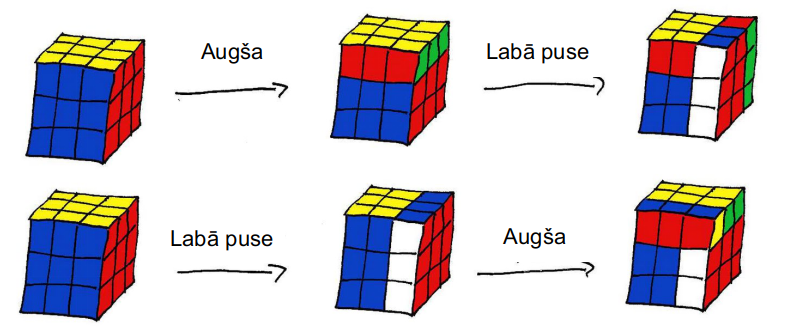

# &nbsp;

<hgroup>

<h1 style="font-size:32pt">Skaitļu reizināšanas struktūras</h1>
</hgroup><hgroup>

**(1) Grupas un to īpašības**  
(2) [Eilera/Fermā teorēmas](#section-1)  
(3) [Primitīvo sakņu teorēma](#section-2)  
(4) [Ķīniešu atlikumu teorēma](#section-3)  
(5) [Valuāciju ievads](#section-4)  
(6) [Valuācijas priekš $x^n \pm y^n$](#section-5)  
(7) [Henzela lemma](#section-6)

</hgroup>

## Grupu motivācija

<hgroup>

Kāpēc jādefinē grupas, gredzeni, lauki u.c. abstraktās algebras struktūras?

</hgroup>

<hgroup>

* Īsi un korekti formulē algebrisku struktūru pamatīpašības.
* Klasificē matemātisko objektu/operāciju zvērudārzu pēc šīm īpašībām. 
* Pārnes izpētītās lietas uz jaunām algebriskām struktūrām.

</hgroup>

## (1) Ceļa karte

<table>
<tr>
<td style="text-align:left">
**Monoīdi:**  
$\mathbb{N}$ ar reizināšanu  
$\mathbb{Z}_{0+}$ ar saskaitīšanu  
Funkcijas ar kompozīciju
</td>
<td style="text-align:left; background-color: lightblue;">
**Grupas:**  
$\mathbb{Z}$ ar saskaitīšanu  
$\mathbb{Q}_{\neq 0}$ ar reizināšanu  
Bijektīvas funkcijas ar kompozīciju 
</td>
</tr>
<tr>
<td style="text-align:left">
**Gredzeni:**  
$\mathbb{Z}$ ar saskaitīšanu, reizināšanu  
Kongruenču klases $\mathbb{Z}_n$  
Viena mainīgā polinomi
</td>
<td style="text-align:left">
**Lauki:**  
$\mathbb{Q}$ ar saskaitīšanu, reizināšanu  
Kongruenču klases $\Phi(p)$ pirmskaitlim $p$  
Viena mainīgā racionālas daļas
</td>
</tr>
</table>

# <lo-summary/> Grupas definīcija

1. **Kompozīcija:** Visiem $a,b \in \mathbb{G}$ definēts
$a \ast b \in \mathbb{G}$.   
2. **Asociativitāte:** Visiem $a,b,c \in \mathbb{G}$: 
$(a \ast b) \ast c = a \ast (b \ast c)$.   
3. **Vienības elements:** Eksistē $e \in \mathbb{G}$, 
ka jebkuram $a \in \mathbb{G}$: $e \ast a = a$.   
4. **Apgrieztais elements:** Katram $a \in \mathbb{G}$ 
eksistē $a^{-1} \in \mathbb{G}$: 
$a^{-1} \ast a = e$ (reizinājums ir vienības elements).

*Piezīme.* Šajās grupas aksiomās gan vienības elementu, 
gan apgriezto elementu piereizina no kreisās puses.

## Komutatīvas un nekomutatīvas grupas

(1) Racionāli skaitļi $q \in \mathbb{Q}$ ($q \neq 0$) veido 
komutatīvu grupu (kompozīcijas operācija - reizināšana).  
(2) Rubika kuba stāvokļi - nekomutatīvu grupu. Kompozīcijas operācija 
$a \ast b$ - vispirms ar perfekti saliktu kubu 
veic pārveidojumu $a$, pēc tam tam pa virsu uzgroza pārveidojumu $b$:

## Inversais ir inverss no abām pusēm

$$a^{-1} \ast a \ast a^{-1} = (a^{-1} \ast a) \ast a^{-1} = a^{-1}.$$

Piereizinām vienādībai no kreisās puses $\left( a^{-1} \right)^{-1}$: 

$$\left( a^{-1} \right)^{-1} \ast a^{-1} \ast a \ast a^{-1} = 
\left( a^{-1} \right)^{-1} \ast a^{-1} \Rightarrow$$
$$a \ast a^{-1} = e.$$

**Secinājums:** $a \ast a^{-1} = e$.  
Tātad katrs kreisais inversais
elements ir arī labais inversais elements.  
Un $\left( a^{-1} \right)^{-1} = a$ ($a$ inversā
inversais ir pats $a$). $\blacksquare$

## Citas grupu īpašības

**Apgalvojums:** (1) Ja $\mathbb{G}$ ir grupa ar (kreiso) vienības elementu $e$, 
tad tas ir arī labais vienības elements:
$$(\forall a \in \mathbb{G})(a \ast e = a).$$
(2) Katrā grupā ir tieši viens vienības elements. 

**Pierādījums:** (1) Pārveidojam izteiksmi $a \ast e = a \ast a^{-1} \ast a$:
$$a \ast (a^{-1} \ast a) = (a \ast a^{-1}) \ast a = e \ast a = a.$$
(2) Ja būtu divi vienības elementi $e_1$ un $e_2$, tad
$$e_1 = e_1 \ast e_2 = e_2.\;\blacksquare$$

# <lo-summary/> Bijektīvi pārveidojumi veido grupu

## Bijektīvās funkcijas

**Definīcija:** Funkciju $f:A \rightarrow B$ sauc par bijektīvu, ja 
katrai tās vērtībai $y \in B$ eksistē precīzi viens arguments $x \in A$, 
ka $f(x) = y$.  (Nav nepārklātu $y \in B$ un nav kolīziju/saskriešanos.)

# <lo-summary/> Iteratīvi cikli galīgā kopā

**Apgalvojums:** Ja $X$ ir galīga kopa un $f:X\rightarrow{}X$ ir 
funkcija, kas kopas $X$ elementus attēlo atkal kopā $X$, tad
jebkuram $a_0 \in X$ virkne:
$$x_{k+1} = f(x_k),\;k\geq 0$$
ir periodiska sākot no kādas vietas.

*Pierādījums.* Ja kopā $X$ ir $M$ elementu, tad vēlākais pēc $M$ gājieniem
kopā $X$ aptrūksies elementu un $x_k$ sakritīs ar kādu jau agrāk 
sastaptu elementu. Tad $x_k$ elementi sāks cikliski atkārtoties.

## Kolīzijas rada priekšperiodus

1. Ikreiz, kad funkcija $f: X \rightarrow X$ nav injektīva (t.i. 
atrodas divi dažādi $a,b \in X$, kuriem $f(a)=f(b)$, 
tad virknei $x_{k+1} = f(x_k)$ var būt priekšperiods.
2. Ja $f$ ir injektīva, tad virkne $x_k$ ir cikliska 
bez priekšperioda.

Tikai situācijās, kur visas $f$ ir injektīvas (un rada ciklus bez 
priekšperiodiem) var cerēt, ka eksistēs inversās funkcijas $f^{-1}$ 
un tās veidos grupu attiecībā pret funkciju kompozīciju. 

# <lo-summary/> Piemērs: Matrača simetriju grupa

## Matrača simetriju reizināšanas tabula

# <lo-summary/> Aditīvā gr. kongruenču klasēm

**Definīcija:** Naturālam $m$ ar $\mathbb{Z}_m$ apzīmējam
visu skaitļa $m$ kongruenču klašu kopu: 
$$\mathbb{Z} = \{ 0,1,2,\ldots,m-1 \}.$$

Šī kopa $\mathbb{Z}_m$ ar saskaitīšanu kā kompozīcijas 
operāciju veido grupu: $(\mathbb{Z}_m)^{+}$. 

## Aditīvā cikla garums 

**Apgalvojums:** Naturāliem skaitļiem $m$ un $d$ apskatām 
"aritmētisku progresiju" ar kongruenču klasēm:
$$a_k = (a_0 + k \cdot d)\,\mbox{mod}\,m.$$ 
Tad šīs progresijas periods jeb cikla garums - mazākais $L$, kuram $a_0=a_L$
(un vispār $a_k \equiv a_{k+L}$ ir 
$$L = \frac{m}{\mbox{LKD}(a,m)}.$$ 

## Piemērs par aditīvo ciklu

<hgroup>

</hgroup>

<hgroup> 

**Piemērs:** Ja pulksteņa stundu rādītājam ir $m=12$ stāvokļi
un to ikreiz pagriež $9$ stundas pret pulksteņa rādītāju virzienam, tad 
pēc $\frac{12}{\mbox{LKD}(9,12)} = \frac{12}{3}=4$ soļiem 
rādītājs atgriezīsies sākumstāvoklī. 

</hgroup>

# <lo-summary/> Z6 un Z7 summas/reizinājumi

<hgroup>

</hgroup>

<hgroup>

$\mathbb{Z}_6 = \{ 0,1,2,3,4,5 \}$   
$\mathbb{Z}_7 = \{ 0,1,2,3,4,5,6 \}$   

* Abām kongruenču klašu kopām var uzzīmēt saskaitīšanas
un reizināšanas tabulas.
* $(\mathbb{Z}_6)^{+}$ un $(\mathbb{Z}_7)^{+}$
ir grupas (operācija - saskaitīšana).
* $(\mathbb{Z}_7)^{\times}$ (bez nulles) arī ir grupa.
 

</hgroup>

## Ar reizināšanu var būt priekšperiodi

<hgroup>

**Ievada piemērs:** Noteikt kongruenču klasi jeb atlikumu
$12^{1000}\;(\mbox{mod}\,20)$. 

</hgroup>

<hgroup>

$12^n\;(\mbox{mod}\,20)$ ir:

$$\left\{
\begin{array}{ll}
1, & \mbox{ja $n=0$} \\
12, & \mbox{ja $n=4k+1$} \\
4, & \mbox{ja $n=4k+2$} \\
8, & \mbox{ja $n=4k+3$} \\
16, & \mbox{ja $n=4k+4$} 
\end{array} \right.$$

</hgroup>

## Ja kāpināmais savst.pirmsk. ar moduli

$12^{n}\;(\mbox{mod}\,20)$ analizējams 
līdzīgi kā $2^{n}\;(\mbox{mod}\,5)$

<table>
<tr>
<th>$n$</th>
<td>0</td><td>1</td><td>2</td><td>3</td><td>4</td><td>5</td>
</tr>
<tr>
<th>$12^{n}\;\mbox{mod}\,20$</th>
<td>1</td><td>12</td><td>4</td><td>8</td><td>16</td><td>12</td>
</tr>
<tr>
<th>$2^{n}\;\mbox{mod}\,5$</th>
<td>1</td><td>2</td><td>4</td><td>3</td><td>1</td><td>2</td>
</tr>
</table>

# <lo-summary/> Multiplikatīvā grupa

**Definīcija:** Ar $\Phi(n)$ apzīmēsim visus tos atlikumus no $\mathbb{Z}$, 
kas ir savstarpēji pirmskaitļi ar $n$. 

* Ja $p$ ir pirmskaitlis: $\Phi(p) = \{ 1, 2, \ldots, p-1 \}$  
(visi atlikumi, izņemot $0$).

* $\Phi(10) = \{ 1,3,7,9 \}$  
(atlikumi, kas nedalās ar $2$ vai $5$). 

## Kongruences klašu mult.grupa

**Apgalvojums:** $\Phi(n)$ ar kompozīcijas operāciju - reizināšanu 
veido grupu. 

*Kas ir jāpierāda:*  
(A) Reizināšana atlikumiem $a,b \in \Phi(n)$ ir definēta un 
arī atlikums $a\cdot{}b$ ir savst.pirmskaitlis ar $n$.  
(B) $1 \in \Phi(n)$ ir vienības elements attiecībā uz reizināšanu.  
(C) Katram atlikumam $a \in \Phi(n)$ eksistē inversais. (Pierādījumu sk. zemāk)

## Lemma par kongruenču klasēm

**Lemma:** Dots naturāls skaitlis $n$ un 
$$\Phi(n) = \{ 1, \ldots, n-1 \}$$
ir atlikumu kopa, kas ir savstarpēji pirmskaitļi ar $n$.  
Izvēlamies $a \in \Phi(n)$ un definējam jaunu atlikumu kopu:
$$a\Phi(n) = \{ ax\;\mid\;x \in \Phi(n) \} = \{ a \cdot 1, \ldots, a \cdot (n-1) \}.$$
Tad $a\Phi(n)=\Phi(n)$: kopa $a\Phi(n)$ sakrīt ar visu atlikumu kopu, kas ir
savstarpēji pirmskaitļi ar $n$. 

## Lemmas ilustrācija

* Attēlā ir funkcijas $f(x) = 1\cdot{}x$ un $g(x)=3\cdot{}x$ no 
kopas $\Phi(10)$ uz $\Phi(10)$. 
* Abas ir bijektīvas funkcijas, abām var atrisināt vienādojumu  
$f(x)=1$.

<red>Reizinot ar konstanti $\Phi(x)$ elementus, nerodas kolīzijas!</red>

## Lemmas pierādījums

*Pierādījums.* (1) Ja $a,x \in \Phi(n)$ (abi skaitļi ir savstarpēji 
pirmskaitļi ar $n$, tad arī to reizinājums $ax \in \Phi(n)$.  
(2) Ja $ax$ un $ay$ pieder tai pašai kongruenču klasei $(\mbox{mod}\,m)$, 
tad $ax - ay=a(x-y)$ dalās ar $m$. 

$a$ un $m$ nav kopīgu dalītāju, tādēļ arī $(x-y)$ dalās ar $m$. 
Tā kā $x$ un $y$ abi ir atlikumi $(\mbox{mod}\,m)$, tad 
$x-y$. Tātad:
$$x \neq y\;\Rightarrow{}\;ax \neq ay.$$
Tātad funkcija, kas $x$ piekārto $ax$ ir *injektīva*.  $\blacksquare$

## Lemma par inverso elementu

**Lemma:** Katram atlikumam $a \in \Phi(n)$ eksistē inversais. 

*Pierādījums.* Iepriekšējā lemma apgalvoja, ka jebkuram $a \in \Phi(n)$ funkcija
$f(x) = a \cdot x$ ir injektīva (nevar būt kolīzija, kur $x_1 \neq x_2$, bet
$f(x_1) = f(x_2)$.  
Tā kā $\Phi(n)$ ir galīga kopa, tad reizināšana ir ne vien injektīva, bet arī 
sirjektīva (un bijektīva).  
Tātad eksistē tāds elements $b$, kuram $a \cdot b = 1$. $\blacksquare$

# <lo-summary/> Φ(8) un matrača simetrija

<hgroup>

</hgroup>
<hgroup>

Abas grupas ir *izomorfas* - matraču $4$ simetrijām
un $\Phi(8) = \{ 1,3,5,7 \}$ ir abpusēji viennozīmīga atbilstība
starp elementiem un to reizinājumiem.

</hgroup>

# <lo-summary/> Vilsona teorēma

**Teorēma:** Katram pirmskaitlim $p$, $(p-1)! \equiv -1\;(\mbox{mod}\,p)$. 

**Pierādījums:** Katram elementam $x \in \{ 1,\ldots,p-1 \}$ eksistē
inversais elements $x^{-1}$.  
**Vai kongruenču klase var būt pati sev inversā?**  
Ja $x = x^{-1}$, tad kongruenču klasi $x$ pareizinot
pašu ar sevi, iegūstam $1$:
$$x^2 \equiv 1\;(\mbox{mod}\,p),$$
jeb $x^2-1=(x-1)(x+1)$ dalās ar $p$. 

## Pierādījuma turpinājums

$x^2-1=(x-1)(x+1) \equiv p\;(\mbox{mod}\,p)$
ir vienīgi tad, ja $x = 1$ vai $x = p-1$. 

Vilsona teorēmā $(p-1)!$ satur visas kongruenču klases 
$x$ un $x^{-1}$ pa pāriem, izņemot $1$ un $(p-1)$.  
Tāpēc $(p-1)!$ kongruents ar $p-1$ jeb $-1$.  
$\blacksquare$

## Vilsona teorēma nepirmskaitļiem?

Aplūkojam $\Phi(n)$ reizinājumu: Reizinām visus 
tos atlikumus no $0$ līdz $n-1$, kuri ir savstarpēji 
pirmskaitļi ar $n$. 

* Ja $n=8$, tad $1 \cdot 3 \cdot 5 \cdot 7 = 105$. 
<red>$105 \equiv 1 \not\equiv -1\;(\mbox{mod}\,8$.</red>
* Ja $n=9$, tad $1 \cdot 2 \cdot 4 \cdot 5 \cdot 7 \cdot 8 = 2240$. 
<blue>$2240 \equiv -1\;(\mbox{mod}\,9)$</blue>

**Jautājums:** Kuros gadījumos reizinājums būs 
kongruents ar $-1$ pēc $n$ moduļa?

# &nbsp;

<hgroup>

<h1 style="font-size:32pt">Skaitļu reizināšanas struktūras</h1>

</hgroup>

<hgroup>

(1) [Grupas un to īpašības](#section)  
**(2) Eilera/Fermā teorēmas**  
(3) [Primitīvo sakņu teorēma](#section-2)  
(4) [Ķīniešu atlikumu teorēma](#section-3)  
(5) [Valuāciju ievads](#section-4)  
(6) [Valuācijas priekš $x^n \pm y^n$](#section-5)  
(7) [Henzela lemma](#section-6)

</hgroup>

## Eilera teorēmas motivācija

<hgroup>

Kādiem mērķiem var izmantot 
Eilera/Fermā teorēmu kongruences?

</hgroup>

<hgroup>

* Efektīvi kāpina lielus skaitļus pēc moduļa  
$a^b \equiv c\;(\mbox{mod}\,m),$  
ko lieto RSA (publiskās atslēgas) kriptogrāfijā.
* Uzzina, cik tālu jāvirzās vienā virzienā, lai atgrieztos sākumpunktā.
* Vizualizē kongruences klašu ciklus un ritmus.
* Uzzina periodisku decimāldaļu ($1/13$ u.c.) periodus.

</hgroup>

# <lo-summary/> Eilera teorēma

**Teorēma:** Ja $a$ un $n$ ir savstarpēji pirmskaitļi, tad  $a^{\varphi(n)} \equiv
1\;(\mbox{mod}\,n)$.  
*Piezīme.* Ar $\varphi(n)$ apzīmējam elementu skaitu kopā $\Phi(n)$ - to atlikumu 
skaitu no $\{ 0, \ldots, n-1 \}$, kas ir savstarpēji pirmskaitļi ar $n$.  
Funkciju $\varphi(n)$ sauc par *Eilera funkciju*. 

## Eilera teorēmas pierādījums (1. no 2)

*Pierādījums.* Aplūkojam visas kongruenču klases, kas ir savst. pirmskaitļi ar $n$: 
$$\Phi(n) = \{ a_1, a_2, \ldots, a_{\varphi(n)} \}.$$
Saskaņā ar lemmu arī reizinājumi ar konstantu $a$ veido šīs pašas kongruenču klases:
$$\Phi(n) = \{ aa_1, aa_2, \ldots, aa_{\varphi(n)} \}.$$

## Eilera teorēmas pierādījums (2. no 2)

Sareizinām visus $\Phi(n)$ elementus abās izteiksmēs:
$$(aa_1)(aa_2)\cdots(aa_{\varphi(n)}) \equiv a_1a_2\cdots{}a_{\varphi(n)}\;(\mbox{mod}\,n).$$

Noīsinām abas puses un iegūstam, ka $a^{\varphi(n)} \equiv 1$. $\blacksquare$  
(Ko Vilsona teorēma saka par visu $\Phi(n)$ reizinājumu, ar kuru noīsinājām?) 

# <lo-summary/> Mazā Fermā teorēma

**Teorēma:** Ja $p$ ir pirmskaitlis un $\mbox{LKD}(a, p) = 1$, 
tad $a^{p−1} \equiv 1\;(\mbox{mod}\,p)$.

*Pierādījums.* Šis ir Eilera teorēmas atsevišķs gadījums pirmskaitļiem, jo 
$\varphi(p) = p-1$. $\blacksquare$

# <lo-sample/> IMO.SHL.2017.N2

Dots pirmskaitlis $p \geq 2$.
Eduardo and Fernando spēlē sekojošu spēli, pārmaiņus
izdarot gājienus: Katrā gājienā spēlētājs izvēlas 
indeksu $i$ no kopas 
$\{0,1,\ldots,p-1\}$, 
kuru neviens no viņiem vēl nav izvēlējies, un 
tad izvēlas elementu $a_i$ no kopas
$\{0, 1, 2, 3, 4, 5, 6, 7, 8, 9\}$. 
Spēli sāk Eduardo. Spēle beidzas tad, kad visi 
indeksi $i \in \{0,1,\ldots,p-1\}$ ir izvēlēti. 
Tad tiek izrēķināts sekojošs skaitlis: 
$$M = a_0 + 10 \cdot a_1 + \cdots + 
10^{p-1} \cdot a_{p-1} =
\sum_{j=0}^{p-1} a_j \cdot 10^j.$$
Eduardo mērķis ir padarīt skaitli $M$ dalāmu ar $p$, 
bet Fernando mērķis ir to nepieļaut.  
Pierādīt, ka Eduardo ir uzvaroša stratēģija - viņš
vienmēr var sasniegt savu mērķi.

<!--
Let $p \geq 2$ be a prime number.
Eduardo and Fernando play the following
game making moves alternately: 
in each move, the current player 
chooses an index $i$ in the set 
$\{0,1,\ldots,p-1\}$ 
that was not 
chosen before by either of the two
players and then 
chooses an element $a_i$ of the
set $\{0, 1, 2, 3, 4, 5, 6, 7, 8, 9\}$. 
Eduardo has the first move. 
The game ends after all the indices
$i \in \{0,1,\ldots,p-1\}$ have been 
hosen. Then the following number is 
computed:
$$M = a_0 + 10 \cdot a_1 + \cdots + 
10^{p-1} \cdot a_{p-1} =
\sum_{j=0}^{p-1} a_j \cdot 10^j.$$
The goal of Eduardo is to make the
number $M$ divisible by $p$, and the
goal of Fernando is to prevent this.\\
Prove that Eduardo has a winning strategy.
-->

# &nbsp;

<hgroup>

<h1 style="font-size:32pt">Skaitļu reizināšanas struktūras</h1>

</hgroup><hgroup>

(1) [Grupas un to īpašības](#section)  
(2) [Eilera/Fermā teorēmas](#section-1)  
**(3) Primitīvo sakņu teorēma**  
(4) [Ķīniešu atlikumu teorēma](#section-3)  
(5) [Valuāciju ievads](#section-4)  
(6) [Valuācijas priekš $x^n \pm y^n$](#section-5)  
(7) [Henzela lemma](#section-6)

</hgroup>

## Primitīvo sakņu motivācija

<hgroup>

<h1 style="font-size:40pt; color: darkgreen">Kāpēc jāzina primitīvās saknes?</h1>

</hgroup>
<hgroup>

* Primitīvā sakne $g$ demonstrē, ka grupa ar $n$ elementiem ir *cikliska* - tās 
elementus var "sarakstīt aplī" $g^0, g^1, \ldots, g^{n-1}$. 
* Primitīvā sakne var kalpot par "logaritma bāzi" - katram 
grupas elementam $x \in \mathbb{G}$ tad eksistē $k$, ka
$g^k \equiv x\;(\mbox{mod}\,m)$. 

</hgroup>

# <lo-summary/> Kas ir primitīvās saknes

**Definīcija:** Skaitli $g$ sauc par primitīvo sakni pēc $(\mbox{mod}\,n)$, 
ja katram skaitlim $a$, kas ir savstarpējs pirmskaitlis, eksistē 
tāds naturāls kāpinātājs $k \in \mathbb{N}$, ka $g^k \equiv a\;(\mbox{mod}\,n)$. 

##  (mod 17) - ne visi moduļi ir prim.saknes

<hgroup>

</hgroup>

<hgroup>

</hgroup>

## (mod 13) - katra atlikuma cikls

[Multiplikatīvas grupas (mod n)](https://en.wikipedia.org/wiki/Multiplicative_group_of_integers_modulo_n#Examples_2)

# <lo-summary/> Primitīvo sakņu teorēma

**Teorēma:** Multiplikatīvā grupa atlikumiem, kas ir savstarpēji 
pirmskaitļi ar $n$: $(\Phi(n))^{\times}$ ir cikliska tad un tikai tad, ja
$n \in \{ 2; 4\}$ vai arī $n \in \{p^k, 2p^k \}$ kādai nepāru pirmskaitļa
$p$ pakāpei $p^k$. 

*Piezīme.* Grupa ir cikliska - tas nozīmē, ka eksistē primitīvā sakne $g$, 
kuras pakāpes $g^0, g^1, g^2, \ldots$ pieņem visas vērtības šajā grupā.

## Teorēmas pierādījums

*Pierādījums:* Pieņemsim, ka $\Phi(p)$ elementu vidū lielākā iespējamā *grupas elementa kārta*
(t.i. mazākais $n$, kuram $a^n = e$) ir $n<p-1$. 
Pierādīt, ka no šejienes seko 
$$x^n \equiv 1\;(\mbox{mod}\,p)$$ 
visiem $x \not\equiv 0$ (tādu pavisam ir $p-1$). 
Tas būtu pretrunā ar 
[Lagranža polinomu kongruences teorēmu](https://en.wikipedia.org/wiki/Lagrange%27s_theorem_%28number_theory%29).  
(Pēc indukcijas: Dalot polinomu ar $(x-x_0)$, kur $x_0$ ir polinoma sakne - un pārtaisot 
visus koeficientus pēc moduļa $p$, iegūstam polinomu, kura pakāpe ir 
vismaz par $1$ mazāka, utt.)

# <lo-summary/> Mult.grupa, kas nav cikliska

<hgroup>

</hgroup>

<hgroup>

$\Phi(21)$ satur $(3-1)(7-1)=12$ elementus. 
Tos nevar apstaigāt ar viena skaitļa (primitīvās 
saknes) pakāpēm.   
Atkārtoti reizinot ar jebkuru skaitli no $\Phi(21)$ rodas 
divi vai vairāki cikli.  
Piemērā reizina ar $a = 5$.

</hgroup>

# <lo-summary/> Karmaikla skaitļi 

**Definīcija:** Karmaikla (Carmichael) skaitlis ir tāds salikts skaitlis $n$, 
kurš katram $a$, kas ir savstarpējs pirmskaitlis ar $n$ izpilda kongruenci:
$$a^{n-1} \equiv 1\;(\mbox{mod} n).$$  
Sk. [Carmichael number](https://en.wikipedia.org/wiki/Carmichael_number)

*Piemērs.* Apskatām $561 = 3 \cdot 11 \cdot 17$. Izpildās dalāmības:
$$(3-1) \mid 560,\;\;(11-1) \mid 560,\;\;(17-1) \mid 560.$$

## Kaut kas līdzīgs Fermā teorēmai

Arī Mazā Fermā teorēma sola to pašu: 
$$a^{n-1} \equiv 1\;(\mbox{mod}\,n),\;\;\mbox{kur}\;\mbox{LKD}(a,n)=1.$$
vai 
$$b^{n} \equiv b\;(\mbox{mod}\,n),\;\;\mbox{katram}\;b\in\mathbb{Z}.$$

<!--
## Principiāla atšķirība

<hgroup>

TODO: Viena ciparnīca

</hgroup>

<hgroup>

TODO: Trīs ciparnīcas

</hgroup>

## Jautājums

**Jautājums:** Vai Karmaikla skaitlis var būt pāru? 

-->

# <lo-sample/> BW.2016.5

**BW.2016.5:** Dots pirmskaitlis $p>3$, kuram $p \equiv 3\;(\mbox{mod}\,4)$. 
Dotam naturālam $n$
skaitlim $a_0$ virkni $a_0, a_1,\ldots$ definē kā 
$a_n = a_{n-1}^{2^n}$ visiem $n = 1, 2,\ldots$. 
Pierādīt, ka $a_0$ var izvēlēties
tā, ka apakšvirkne $a_N, a_{N+1}, a_{N+2},\ldots$ nav konstanta 
pēc moduļa $p$ nevienam naturālam $N$.

# <lo-sample/> IMO.SHL.2014.N4

**IMO.SHL.2014.N4:** 
Ar $n > 1$ apzīmēts kāds naturāls skaitlis. Pierādīt, ka
bezgalīgi daudzi locekļi virknei 
$(a_k)_{k \geq 1}$, kas definēta ar
$$a_k=\left\lfloor\frac{n^k}{k}\right\rfloor,$$ 
ir nepāru skaitļi.  
(Reālam skaitlim $x$, $\lfloor x\rfloor$ apzīmē 
lielāko veselo skaitli, kas nepārsniedz $x$.)

<!--
Let $n > 1$ be a given integer. Prove that 
infinitely many terms of the sequence 
$(a_k )_{k \geq 1}$, defined by 
$$a_k=\left\lfloor\frac{n^k}{k}\right\rfloor,$$ 
are odd.  
(For a real number $x$, $\lfloor x\rfloor$ denotes 
the largest integer not exceeding $x$.)
-->

# &nbsp;

<hgroup>

<h1 style="font-size:32pt">Skaitļu reizināšanas struktūras</h1>

</hgroup><hgroup>

(1) [Grupas un to īpašības](#section)  
(2) [Eilera/Fermā teorēmas](#section-1)  
(3) [Primitīvo sakņu teorēma](#section-2)  
**(4) Ķīniešu atlikumu teorēma**   
(5) [Valuāciju ievads](#section-4)  
(6) [Valuācijas priekš $x^n \pm y^n$](#section-5)  
(7) [Henzela lemma](#section-6)

</hgroup>

## (4) Ķīniešu atlikumu teorēmas motivācija

<hgroup>

Kādēļ jāzina 
ķīniešu atlikumu teorēma
 

</hgroup>

<hgroup>

* Tai vietā, lai risinātu kongruences pēc salikta skaitļa $m$ moduļa, var 
tās risināt pret pirmskaitļiem (vai to pakāpēm) un rezultātus kombinēt. 
* Ķīniešu atlikumu teorēma ļauj konstruēt (parasti milzīgi lielu) 
skaitli ar speciālām īpašībām.

</hgroup>

# <lo-summary/> Ķīniešu atlikumu teorēma

**Teorēma:** Doti $m_1,\ldots,m_k$ ir naturāli skaitļi, kuri ir pa pāriem
savstarpēji pirmskaitļi un $M = m_1 \cdot \ldots \cdot m_k$ ir 
viņu reizinājums. Tad katram veselu skaitļu komplektam 
$(x_1,\ldots,x_k)$ ir tieši viena kongruenču klase
$x^{\ast}\;(\mbox{mod}\,M)$, kurai 

$$\left\{ \begin{array}{ll}
x \equiv x_1 & (\mbox{mod}\,m_1)\\
\ldots & \ldots\\
x \equiv x_k & (\mbox{mod}\,m_k)
\end{array} \right. \Leftrightarrow x \equiv x^{\ast}\,(\mbox{mod}\,M)$$

## Ķīniešu atlikumu teorēmas piemērs

<hgroup>

</hgroup>

<hgroup>

$$\left\{
\begin{array}{ll}
x \equiv 1 & (\mbox{mod}\,3)\\
x \equiv 2 & (\mbox{mod}\,5)\\
x \equiv 3 & (\mbox{mod}\,7)
\end{array} \right.$$
<red>$$\Longleftrightarrow$$</red>
$$x \equiv 52\;(\mbox{mod}\,105)$$

</hgroup>

## Piemērs (mod 35)

Atlikumu pārim $(6;2)$ dalot attiecīgi ar $7$ un $5$ atbilst
atlikums $27$, dalot ar $35$. 

## Piemērs (mod 36)

* Dekarta reizinājums $\mathbb{Z}_9 \times \mathbb{Z}_4$ veido $\mathbb{Z}_{36}$ 
(visu atlikumu kopumu, dalot ar $36$). 
* Dekarta reizinājums $\Phi(9) \times \Phi(4)$ veido $\Phi(36)$ (visu to atlikumu 
kopumu, kas ir savstarpēji pirmskaitļi ar $36$). 

# <lo-sample/> IMO.1989.5

**IMO.1989:** Pierādīt, ka jebkuram naturālam $n$ atradīsies
$n$ pēc kārtas sekojoši naturāli skaitļi, no kuriem neviens
nav pirmskaitļa pakāpe, ieskaitot pirmo. 

# <lo-sample/> IMO.2009.1

Dots naturāls skaitlis $n$ un $a_1, a_2, a_3, \ldots, a_k$ ($k \geq 2$) 
ir dažādi veseli skaitļi no kopas $\{1, 2, \ldots , n\}$ ka $n$ dala $a_i (a_{i+1} - 1)$
pie $i = 1, 2,\ldots,k-1$. Pierādīt, ka $n$ nedala $a_k(a_1-1)$.

# <lo-sample/> IMO.2016.4/IMO.SHL.2016.N3

Par *aromātisku* sauksim tādu naturālu skaitļu kopu, 
kas sastāv no vismaz diviem elementiem un katram no tās
elementiem ir vismaz viens kopīgs pirmreizinātājs ar 
vismaz vienu no pārējiem elementiem. Apzīmēsim 
$P(n)=n^2+n+1$. Kāda ir mazākā iespējamā naturālā skaitļa 
$b$ vērtība, pie nosacījuma, ka eksistē tāds nenegatīvs 
vesels skaitlis $a$, kuram kopa 
$$\{P(a+1),P(a+2),\ldots,P(a+b)\}$$
ir *aromātiska*?

<!--
A set of postive integers is called fragrant 
if it contains at least two elements and each 
of its elements has a prime factor in common 
with at least one of the other elements. 
Let $P(n)=n^2+n+1$. 
What is the least possible positive integer 
value of $b$ such that there exists a non-negative integer 
$a$ for which the set 
$$\{P(a+1),P(a+2),\ldots,P(a+b)\}$$ 
is fragrant?
-->

# &nbsp;

<hgroup>

<h1 style="font-size:32pt">Skaitļu reizināšanas struktūras</h1>

</hgroup><hgroup>

(1) [Grupas un to īpašības](#section)  
(2) [Eilera/Fermā teorēmas](#section-1)  
(3) [Primitīvo sakņu teorēma](#section-2)  
(4) [Ķīniešu atlikumu teorēma](#section-3)  
**(5) Valuāciju ievads**  
(6) [Valuācijas priekš $x^n \pm y^n$](#section-5)  
(7) [Henzela lemma](#section-6)

</hgroup>

## (5) Valuāciju motivācija

<hgroup>

Kādēļ jāizmanto valuācijas?
 

</hgroup>

<hgroup>

* Dažreiz ar atlikumu vienkārši pēc pirmskaitļa moduļa $p$ nepietiek. 
Ir jāpamato skaitļu $a,b$ kongruence pēc $p^k$ <red>$Leftrightarrow$</red> 
$(a-b)$ dalāmība ar $p^k$. 
* Ir "kāpinātāja pacelšanas" rezultāti, kur konstrukcija soli pa solim paceļ $p^k$ 
kāpinātāju $k$. Pēc tam, kad kāpinātāji pacelti, var lietot Ķīniešu atlikumu teorēmu. 

</hgroup>

# <lo-sample/> UK.BMO1.2013.3

**UK.BMO1.2013.3:** Skaitļa decimālpieraksts satur $3^{2013}$ ciparus "3"; 
citu ciparu skaitļa pierakstā nav. Atrast augstāko skaitļa $3$ pakāpi, 
kas ir šī skaitļa dalītājs.

[BMO1 2013/2014 Solutions](https://bmos.ukmt.org.uk/solutions/bmo1-2014/)

## Skaitļa gabalu pavairošana

**Apgalvojums 1:**

1. Lai izveidotu skaitli no trim vienādiem cipariem $a$, jāreizina
$a \cdot 111$. 
2. Lai izveidotu skaitli, kas trīsreiz atkārto trīsciparu 
skaitli $\overline{abc}$, jāreizina $\overline{abc}\cdot 1001001$. 
3. Lai trīsreiz atkārtotu deviņciparu skaitli: 
$$\overline{d_1d_2\ldots{}d_9}\cdot 1000000001000000001.$$

## Indukcija

**Apgalvojums 2:** skaitli, kura pierakstā ir $3^k$ cipari "3" iegūst
reizinot skaitli $3$ ar $111$, $1001001$, $1000000001000000001$, $\ldots$.  
Formāli sakot, skaitlim $3$ piereizina $k$ virknes locekļus 
$a_1,a_2,\ldots,a_k$, kur definējam
$$a_m = 10^{2\cdot 3^m} + 10^{3^m} + 1.$$

Šo var pamatot ar indukciju. 

## Augstākā 3^n dalītāja noteikšana

1. Pirmais reizinātājs $3$ dalās ar $3^1$ (bet nedalās ar $3^2$). 
2. Katrs $a_m$ dalās ar $3^1$, bet nedalās ar $3^2=9$ (dalāmības pazīme:
skaitļa $a_m$ ciparu summa ir $3$). 
3. Piereizinot skaitlim $3$ vēl $k$ reizinātājus, kuri dalās ar $3$, bet
ne ar $9$, iegūstam skaitli, kas dalās ar $3^{2014}$ (bet ne ar
$3^{2015}$). 

# <lo-summary/> Valuācijas definīcija/īpašības

**Definīcija:** Pieņemsim, ka $p$ ir jebkurš pirmskaitlis. 
Par vesela skaitļa $a \neq 0$ $p$-adisko valuāciju sauc 
veselu nenegatīvu $k=\nu_p(a)$, ka $a$ dalās ar $p^k$, bet nedalās ar 
$p^{k+1}$. 

*Piemēri:* 

1. Skaitlim $0$ nekādas valuācijas nav definētas, tas dalās 
ar jebkura pirmskaitļa jebkuru pakāpi.
2. $\nu_3(1)=\nu_3(2)=\nu_3(4)=\ldots=0$. Skaitļi, kuri nedalās ar $p=3$ ir
ar valuāciju $0$ - lielākā pakāpe, ar ko tie dalās ir $3^0=1$. 
3. $\nu_3(3)=\nu_3(6)=1$. Skaitļi, kuri dalās ar $3=3^1$, bet 
nedalās ar $9=3^2$. 

## p-Valuāciju īpašības

* $\nu_p(ab) = \nu_p(a) + \nu_p(b).
* $\nu_p(a+b) \geq \mbox{min}(\nu_p(a),\nu_p(b)).
* $\nu_p(a+b) = \mbox{min}(\nu_p(a),\nu_p(b)), ja $\nu_p(a) \neq \nu_p(b)$. 

# &nbsp;

<hgroup>

<h1 style="font-size:32pt">Skaitļu reizināšanas struktūras</h1>

</hgroup><hgroup>

(1) [Grupas un to īpašības](#section)  
(2) [Eilera/Fermā teorēmas](#section-1)  
(3) [Primitīvo sakņu teorēma](#section-2)  
(4) [Ķīniešu atlikumu teorēma](#section-3)  
(5) [Valuāciju ievads](#section-4)  
**(6) Valuācijas priekš $x^n \pm y^n$**  
(7) [Henzela lemma](#section-6)

</hgroup>

## (6) LTE motivācija

<hgroup>

Kādēļ jāzina LTE lemmas?
 

</hgroup>

<hgroup>

* Kongruencēs $a^n \equiv 1$ nosakot kāpinātāju, kas nodrošina kongruenci
($a^n - 1$ dalāmību ar $p^k$)
var lietot Eilera/Fermā teorēmas novērtējumu, bet tas parasti ir ļoti neprecīzs, 
parasti ar to vien nepietiek.
* Izteiksmes $a^n - b^n$ un $a^n + b^n$ bieži rodas, summējot ģeometriskas progresijas, 
pierakstot skaitļus ar īpatnēju/simetrisku decimālpierakstu. Šo izteiksmju valuācijas
veido raksturīgu "zāģveida funkciju": $a^n \pm b^n$ $p$-valuācija atspoguļo $n$ 
$p$-valuāciju.

</hgroup>

# <lo-summary/> Bibliogrāfija 

1. [Lifting the Exponent (intro)](https://brilliant.org/wiki/lifting-the-exponent/)
2. [Lifting the Exponent by Amir Hossein Parvardi](https://www.academia.edu/4034266/Lifting_The_Exponent_Lemma_LTE_)

Visas šīs lemmas aplūko augstāko pirmskaitļa $p$ pakāpi, ar kuru dalās $a^n - b^n$ vai $a^n + b^n$. 
To jau agrāk saucām par $p$-valuāciju.   
Uz $a$ un $b$ uzlikti daži papildu nosacījumi, bet ja tie neizpildās, tad 
$p$-valuāciju var viegli redzēt.

# <lo-summary/> Lemma, ja n nedalās ar p

**Lemma:** Pieņemsim, ka veselu skaitļu starpība $x - y$ dalās ar $p$, bet paši 
$x$, $y$ nedalās ar $p$. Un arī kāpinātājs $n$ nedalās ar $p$. Tad 
$$\nu_p(x^n - y^n) = \nu(x - y).$$

*Pierādījums:* Algebriska identitāte:  
$x^n - y^n = (x - y)(x^{n-1} + \ldots + y^{n-1})$  
Tā kā $x \equiv y\;(\mbox{mod}\,p)$, tad garās iekavas satur
$n$ saskaitāmos, kas visi kongruenti ar $x^{n-1}$, t.i. visa summa ir $nx^{n-1}$.  
Tā nedalās ar $p$, jo $n$ un $x$ nedalās ar $p$. $\blacksquare$

# <lo-summary/> Pirmā LTE teorēma

**Teorēma:** Pieņemsim, ka veselu skaitļu starpība $x - y$ dalās ar $p$, bet paši 
$x$, $y$ nedalās ar $p$. Tad 
$$\nu_p(x^n - y^n) = \nu(x - y) + \nu(n).$$

*Pierādījuma ideja:* Atkārtoti dala $x^n - y^n$ reizinātājos. Vispirms atdala to reizinātāju, kurš ar 
$p$ nedalās (var izmantot iepriekšējo lemmu).   
Pēc tam iegūst $x^{p^k} - y^{p^k}$, ko var dalīt reizinātājos atkārtoti.

# <lo-sample/> BW.2015.16

**BW.2015.16:** Ar $P(n)$ apzīmējam lielāko pirmskaitli, ar ko dalās $n$. Atrast
visus naturālos skaitļus $n \geq 2$, kam
$$P(n) + \lfloor \sqrt{n} \rfloor = P(n+1) + \lfloor \sqrt{n+1} \rfloor.$$
*Piezīme.* $\lfloor x \rfloor$ apzīmē lielāko veselo skaitli, kas nepārsniedz $x$.

# <lo-sample/> IMO.2000.5

**IMO.2000.5:** Vai eksistē naturāls skaitlis $n$, ka tam ir tieši $2000$ 
dalītāji, kas ir pirmskaitļi, un $2^n + 1$ dalās ar $n$?

# <lo-sample/> IMO.SHL.2007.N5

**IMO.SHL.2007.N5:** Atrast visas sirjektīvās funkcijas 
$f : \mathbb{N} \rightarrow \mathbb{N}$, ka
visiem $m, n \in \mathbb{N}$ un katram pirmskaitlim $p$, skaitlis
$f(m+n)$ dalās ar $p$ tad un tikai tad, ja 
$f(m)+f(n)$ dalās ar $p$.  
*Piezīme.* Funkciju sauc par sirjektīvu, ja tā pieņem visas vērtības no 
sava vērtību apgabala (šajā gadījumā $\mathbb{N}$).

[Lifting the Exponent](https://services.artofproblemsolving.com/download.php?id=YXR0YWNobWVudHMvNS8wLzgyODNhOGNhOWQ4OWM1NDk5NTY1MGQyNWVlYWNlMzE1OGYxMDM0&rn=TGlmdGluZyBUaGUgRXhwb25lbnQgLSBWZXJzaW9uIDYucGRm)

# &nbsp;

<hgroup>

<h1 style="font-size:32pt">Skaitļu reizināšanas struktūras</h1>

</hgroup><hgroup>

(1) [Grupas un to īpašības](#section)  
(2) [Eilera/Fermā teorēmas](#section-1)  
(3) [Primitīvo sakņu teorēma](#section-2)  
(4) [Ķīniešu atlikumu teorēma](#section-3)  
(5) [Valuāciju ievads](#section-4)  
(6) [Valuācijas priekš $x^n \pm y^n$](#section-5)  
**(7) Henzela lemma**

</hgroup>

## (7) Henzela lemmas motivācija

<hgroup>

Kādēļ jāzina Henzela lemma?
 

</hgroup>

<hgroup>

* Polinomi ar veseliem koeficientiem (vai vismaz - veselām vērtībām) ir bieži 
protagonisti skaitļu teorijas uzdevumkos. 
* Dažreiz jāpamato nevis kongruence, kur kongruencē ietilpstošajai izteiksmei 
ir liels kāpinātājs, bet gan kongruence, kuras modulim ir liels kāpinātājs.

</hgroup>

# <lo-sample/> LT.VUMIF.2016.11_12.3

**LT.VUMIF.2016.11_12.3:** 
Noskaidrojiet, vai eksistē tāds naturāls skaitlis $n$, ka 
skaitlis $n \cdot 2^{2016} - 7$ ir
naturāla skaitļa kvadrāts.

[Vilniaus universiteto Matematikos ir informatikos fakulteto olimpiados](http://mif.vu.lt/matematikos-olimpiados/mif/)

## Kā kongruenču vienādojums

Eksistē atrisinājums $x$ kongruenču vienādojumam:
$$x^2 \equiv -7\;(\mbox{mod}\,2^{2016}).$$

Daži ir mācījušies par Ležandra un Jakobi simboliem 
(*kvadrātiskajiem atlikumiem* jeb *quadratic
residues*).

# <lo-summary/> Kāpinātāja iteratīva pacelšana

Pierādījums ar indukciju:  
**Bāze:** Ja $n=4$, tad kongruenci 
$$x^2 \equiv -7\;(\mbox{mod}\,2^{n})$$
var atrisināt. Der, teiksim, $x=\pm 3$. 

# <lo-summary/> Henzela lemma

**Lemma:** Dots, ka $p$ ir pirmskaitlis un polinomam $P(x)$ 
ir *vienkārša sakne* $x_0$ pēc $(\mbox{mod}\,p)$:
$$\left\{ \begin{array}{ll}
P(x_0) \equiv 0 & (\mbox{mod}\,p)\\
P'(x_0) \not\equiv 0 & (\mbox{mod}\,p)
\end{array} \right.$$
Tad $P(x)$ būs vienkārša
sakne arī $(\mbox{mod}\,p^k)$ katra šī pirmskaitļa pakāpei $p^k$.  
[Hensel's lemma](https://en.wikipedia.org/wiki/Hensel%27s_lemma)

## Pierādījums 

Pieņemsim, ka $P(x)$ ir polinoms ar veseliem koeficientiem, 
$m,k$ ir naturāli skaitļi, $m \leq k$. 

Ja vesels skaitlis $x_0$ apmierina 
$$P(x_0) \equiv 0\;(\mbox{mod}\,p^{k})\;\;\mbox{un}\;\; P'(x_0) \not\equiv 0\;(\mbox{mod}\,p)$$
tad eksistē vesels $x_1$, ka 
$$P(x_1) \equiv 0\;(\mbox{mod}\,p^{k+m})\;\;\mbox{un}\;\; x_0 \equiv x_1\;(\mbox{mod}\,p^{k})$$

## Konstrukcija

Šis $x_1$ ir viens vienīgs (pēc $p^{k+m}$ moduļa) un to var izteikt
$$x_1 = x_0 - P(x_0) \cdot a,$$
kur koeficientu $a$ izvēlas tā, ka
$$a \equiv \left( P'(x_0) \right)^{-1}\;(\mbox{mod}\,p^m).$$

# <lo-summary/> Ņūtona pieskaru metode

<hgroup>

</hgroup>

<hgroup>

Vienādojums:
$$f(x)=x^2-a = 0.$$

Pieskaru metode sakni meklē kā virknes robežu:  
$$x_{n+1} = x_n - \frac{f(x_n)}{f'(x_n)} = $$
$$ = x_n - \frac{x_n^2 - a}{2x_n}.$$

</hgroup>

# <lo-sample/> Uzdevums

Dots nekonstants polinoms $P(x)$ ar veseliem koeficientiem. 
Pierādīt, ka neeksistē $m \in \mathbb{N}$, ka $P(n)$ ir *bezkvadrātu* skaitlis katram $n > m$.  
*Piezīme.* Par bezkvadrātu (*square free*) skaitli saucam tādu, kurš nedalās ne ar viena pirmskaitļa
kvadrātu.

[ArtOfProblemSolving](https://artofproblemsolving.com/community/c6t32538f6h1829436_square_free__form)

