NMS Skaitļu teorija #1: Pirmskaitļi un Dalāmība
=================================================

Ievads
--------

Daļa skaitļu teorijas uzdevumu tieši izmanto
dalāmības attiecību -- jautājumi, kas ar ko dalās vai nedalās, uzdevumi par pirmskaitļiem un līdzīgi. 
Dalāmības attiecība ir svarīga arī citos uzdevumos, piemēram, risinot vienādojumus 
veselos skaitļos. 

**Nodaļas mērķi:** 

  1. Formulēt un izmantot dalāmības attiecības īpašības. 
  2. Aprēķināt naturāla skaitļa dalītāju skaitu, dalītāju summu. 
  3. Aprakstīt viena skaitļa dalītāju kopu, tās struktūru.
  4. Veidot intervālā Eratostēna režģi
  5. Pierādīt aritmētikas pamatteorēmu, izmantojot Eiklīda lemmu 
  6. Izmantot skaitļa dalījumu pirmreizinātājos.
  7. Izmantot lielāko kopīgo dalītāju (LKD) un mazāko kopīgo dalāmo (MKD) īpašības. 
  8. Atrast LKD ar Eiklīda algoritmu.

Kāpēc dalāmības attiecību niansēti jāpārzina? 
Dalāmības attiecība un arī citi cikli saistībā ar veseliem skaitļiem
ļauj bezgalīgajā naturālo (vai veselo) skaitļu kopā saskatīt
regularitātes un likumsakarības, ko var izmantot visdažādākajos uzdevumos.

Skaitļu dalāmība
-----------------------

Datorprogrammas darbojas ar veseliem skaitļiem un arī citiem objektiem (reāliem skaitļiem, attēliem, skaņām), 
kuri faktiski ir tuvināti vai iekodēti kā veseli skaitļi. Pārveidošanu ciparu formā reizēm sauc par *digitalizāciju*.
Veselo skaitļu aritmētika ļauj veikt praktiski 
vajadzīgas manipulācijas ar pašiem skaitļiem un to pārstāvētiem objektiem.

Veselus skaitļus vienmēr var saskaitīt, atņemt, reizināt kā arī kāpināt veselās pozitīvās pakāpēs. 
Dalīt arī vienmēr var, ja pieļaujam dalīšanu ar atlikumu. 

**Definīcija:** 
  Vesels skaitlis :math:`m` **dalās ar** (*is divisible by*)
  veselu skaitli :math:`d \neq 0`, ja eksistē tāds vesels :math:`k`, kuram 
  :math:`m = d \cdot k`.

To pieraksta :math:`d \mid m` izrunā šādi: ":math:`d` dala :math:`m`" vai arī ":math:`m` dalās ar :math:`d`".

Skaitli :math:`d`, kuram :math:`d \mid m` sauc par skaitļa :math:`m` **dalītāju** (*divisor*), 
savukārt :math:`m` sauc par skaitļa :math:`d` **daudzkārtni** (*multiple*).

Dalāmības režģis
^^^^^^^^^^^^^^^^^^

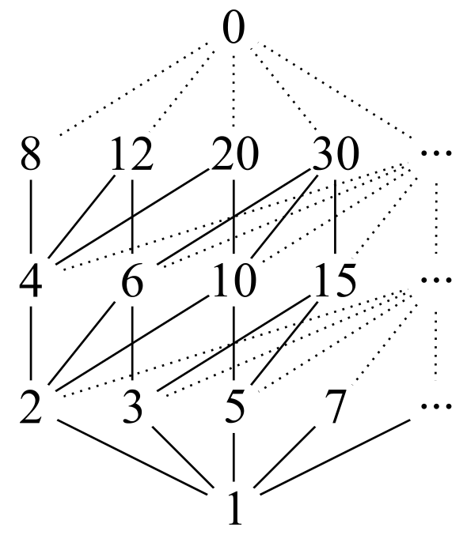

* Ja šajā režģī ir augšupejošs ceļš no virsotnes :math:`a` uz virsotni :math:`b`, 
  tad :math:`b` dalās ar :math:`a`. 
* Dalāmības attiecības "minimālais" elements ir :math:`1`
  (visi skaitļi dalās ar :math:`1`). "Maksimālais" elements
  ir :math:`0` (dalās ar jebkuru citu skaitli).
  Daži skaitļi šajā attiecībā nav salīdzināmi, piemēram, :math:`5` nedalās 
  ar :math:`3` un arī otrādi.

**Apgalvojums:** 
  Dalāmības attiecība ir **transitīva** (*transitive*) 
  ja :math:`a` dala :math:`b` un :math:`b` dala :math:`c`, 
  tad :math:`a` dala :math:`c`. (Piemēram, no :math:`15 \mid 60` un 
  :math:`60 \mid 480` var secināt, ka :math:`15 \mid 480`.) 

"Transitīvais slēgums" - var zīmējumu saraibināt, 
savienojot arī izsecināmās attiecības (:math:`1` ar :math:`4` vai :math:`8` utt.).
Izsecināmās attiecības šādos režģos visbiežāk nezīmē.

Dalāmības attiecība ievieš daļēju sakārtojuma attiecību veselo skaitļu kopā līdzīgi kā :math:`\leq`. 
Pats "mazākais" veselais skaitlis šajā sakārtojumā ir :math:`1`; 
visi pirmskaitļi ir līmeni augstāk, jo tie dalās ar :math:`1`, bet :math:`1` ar tiem nē. 
Vēl līmeni augstāk ir visi iespējamie divu pirmskaitļu reizinājumi, 
ieskaitot pirmskaitļu kvadrātus. Starp šo līmeni un pirmskaitļu līmeni 
visur nepastāv sakārtojuma attiecība. 
Piemēram, :math:`2 \times 3` nav salīdzināms ar :math:`5` 
(tie savstarpēji cits ar citu nedalās). 
Sakārtojuma attiecību var turpināt arī augstākiem slāņiem (trīs, četru, utt. 
pirmskaitļu reizinājumam). Sakārtojuma attiecības 
pašā augšā atrodas skaitlis :math:`0`, jo tas dalās ar jebkuru skaitli. 

Dotajā attēlā :math:`1` ir savienots ar :math:`2` un :math:`2` 
ir savienots ar :math:`4`, bet nav novilkta 
šķautne no :math:`1` uz :math:`4` (kaut arī starp tiem 
pastāv sakārtojuma attiecība). Tas darīts 
vienīgi tādēļ, lai nesaraibinātu zīmējumu, 
jo dalāmības *transitivitātes* dēļ no 
:math:`1 \mid 2` un :math:`2 \mid 4` var secināt, 
ka :math:`1 \mid 4`.

Sal. **Daļēji sakārtotas kopas** (*Partially ordered sets*) `<https://bit.ly/3nMRRR6>`_.

Ar dalāmību saistītie operatori
^^^^^^^^^^^^^^^^^^^^^^^^^^^^^^^^^^

**Definīcija:**
  *Dalīšana* (*division*) ir aritmētiska operācija. Dalot divus 
  veselus skaitļus, rezultāts ir vesels vai racionāls. 

Dalīšana kā aritmētiska operācija un tās rezultāts var parādīties vairākos veidos:

  1. Dalīšana, iegūstot parasto vai jaukto daļskaitli: :math:`17:3 = \frac{17}{3} = 5`
  2. Dalīšana, iegūstot noapaļotu decimāldaļu: :math:`17:3 = 5.6666667`
  3. Dalīšana, iegūstot periodisku decimāldaļu: :math:`17:3 = 5.(6)` (lasa "pieci komats periodā seši")
  4. Dalīšana, iegūstot dalījumu veselos skaitļos un atlikumu:  :math:`17:3 = 5\;\;\mbox{atl.}\;\;2`

**Definīcija:**
  *Dalāmība* (*divisibility*) ir loģiska attiecība - tās rezultāts ir 
  patiesuma vērtība (``True`` vai ``False``).

**Piemērs:**
  Dalīšanas rezultāts :math:`18/6=3`, bet  
  :math:`17/6=2\frac{5}{6}`.

  Savukārt :math:`18 \mid 6` rezultāts ir ``True``. 
  Bet :math:`17 \mid 6` rezultāts ir ``False``. 

**Teorēma:**
  Jebkuriem veseliem skaitļiem :math:`a,b,c` ir spēkā šādas dalāmības īpašības.

  1. Ja :math:`a \mid b` un :math:`a \mid c`, tad :math:`a \mid b+c` un :math:`a \mid b - c`;
  2. Ja :math:`a \mid b`, tad :math:`a \mid b \cdot k`;
  3. Ja :math:`a \mid b_1, a \mid b_2, \ldots, a \mid b_n`, tad :math:`a \mid (b_1k_1 + b_2k_2 + \ldots + b_nk_n)`; 
  4. Ja :math:`a \mid b` un :math:`b \mid c`, tad :math:`a \mid c`;
  5. Ja :math:`a \mid x` un :math:`b \mid y`, tad :math:`ab \mid xy`; 
  6. Ja :math:`a \mid b` un :math:`b \mid a`, tad :math:`a = b`.

**Definīcija:** 
  Dalīt veselu skaitli :math:`m` ar :math:`d` 
  ar atlikumu nozīmē izteikt :math:`m = q\cdot d + r`, kur
  dalījuma veselā daļa :math:`q`
  un atlikums :math:`r` ir veseli skaitļi, turklāt 
  **atlikums** (*remainder*) pieņem kādu no vērtībām:
  :math:`r \in \{ 0, 1, \ldots, n-1 \}`. 

**Piemērs:**
  Dalot ar :math:`3` iespējamie atlikumi 
  ir :math:`\textcolor{red}{\{ 0,1,2 \}}`. Aprēķina paraugs Python. 

.. code-block:: python

  >>> 15 % 3
  0
  >>> 17 % 3
  2
  >>> (-17) % 3
  1
  >>> (-17) // 3
  -6

.. math::

  \left\{
  \begin{array}{l}
  15 = 5 \cdot 3 + \textcolor{red}{0}\\
  17 = 5 \cdot 3 + \textcolor{red}{2}\\
  -17 = (-6) \cdot 3 + \textcolor{red}{1}
  \end{array}
  \right.

.. note::
  Arī negatīviem skaitļiem iespējama dalīšana ar atlikumu. 
  Jāņem vērā, ka atlikumi nemēdz būt negatīvi. 
  Dažās programmēšanas valodās 
  *atlikuma operators*, ja to izmanto negatīviem skaitļiem,
  dod negatīvus atlikumus. 
  Pēc matemātiskās definīcijas, atlikums, dalot ar :math:`n`, vienmēr ir skaitlis 
  starp :math:`0` un :math:`n-1`. 

Jautājumi par dalāmību
^^^^^^^^^^^^^^^^^^^^^^^^^

**1.jautājums**
  Rindā novietoti :math:`30` slēdži ar numuriem no :math:`1` līdz :math:`30`. 
  Katrs slēdzis var būt ieslēgts vai izslēgts; sākumā tie visi ir izslēgti. 
  Pirmajā solī pārslēdz pretējā stāvoklī visus slēdžus, kuru 
  numuri dalās ar :math:`1`. Otrajā solī pārslēdz visus tos, kuru 
  numuri dalās ar :math:`2`. Un tā tālāk - līdz 30.solī pārslēdz pretējā
  stāvoklī slēdžus, kuru numuri dalās ar :math:`30`.  
  Cik daudzi slēdži kļūst ieslēgti pēc visu soļu pabeigšanas?

**Ieteikumi:**
  Ko nozīmē "pārslēgt pretējā stāvoklī"? Cik daudzi soļi pārslēdz slēdzi ar konkrētu numuru :math:`n`?
  Vai mūs interesē, cik reizes tika pārslēgts tas vai cits slēdzis (vai arī tikai slēdža 
  beigu stāvoklis)?

.. only:: Internal

  **Atbilde:**

    **TODO:** Ievietot attēlu, kas parāda dalītāju skaitu dažādiem skaitļiem no :math:`1` līdz :math:`30`. 
    Vizualizācija zīmē ritmu ar skaitļu :math:`1,2,3,4,\ldots` daudzkārtņiem horizontālēs. 
    Dalītāju skaitu var saskaitīt vertikāli.
    Kuriem no skaitļiem ir nepāru skaits dalītāju?

  :math:`\square`

Naturāla skaitļa dalītāju skaits
------------------------------------

Dalītāju izvietojums, skaits, režģis. Fiksēta 
skaitļa dalītāji veido simetrisku režģveida struktūru. 
Šī režģa analīze ļauj ātri noskaidrot 
dalītāju skaitu un citas to kopīgās īpašības. Režģa struktūra noder arī, 
lai ģeometriski iztēlotos, teiksim, lielāko kopīgo dalītāju diviem skaitļiem.

Dalītāju virknes simetrija
^^^^^^^^^^^^^^^^^^^^^^^^^^^^

Dalītāji skaitlim :math:`60`:

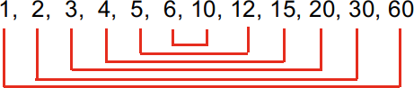

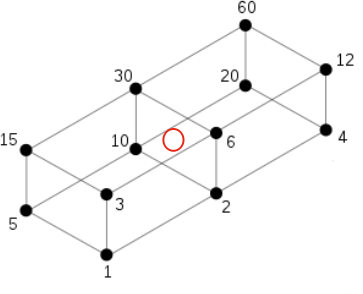

Dalītāji skaitlim :math:`36`:

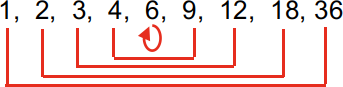

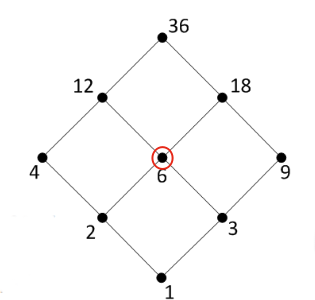

* Dalītāji režģī izvietoti centrālsimetriski attiecībā pret sarkano aplīti.
* Visas dalāmības attiecības nav attēlotas ar svītriņām, 
  (bet gan tikai minimāli nepieciešamās. 
* Pārējās attiecības ir jāsecina ar "transitīvo slēgumu", 
  kad savelk visas citas bultiņas, ko var izsecināt:   
  Ja :math:`a \mid b` un :math:`b \mid c`, tad :math:`a \mid c`.

Pilno kvadrātu starp visiem naturālajiem skaitļiem ir salīdzinoši 
nedaudz. Jebkurā pietiekami garā intervālā to būs krietni 
mazāk nekā, teiksim, pirmskaitļu.  Tādēļ lielajam vairumam 
naturālo skaitļu ir pāru skaits dalītāju.

Hases diagrammas
^^^^^^^^^^^^^^^^^^

H.Hase (*Helmut Hasse*) spriedumos par daļēji sakārtotām 
kopām ieviesa diagrammas, kas attēlo "transitīvo redukciju":

* Vispirms savieno ar svītriņu visus aplīšus, kas atrodas attiecībā "mazāks". 
* Pēc tam izdzēš tās svītriņas, ko var izsecināt no citām, izmantojot transitivitāti. 

Hases diagramma skadalītājiem

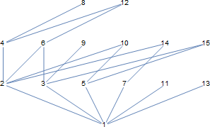
   
   Hases diagramma skaitļiem :math:`[1;15]`

Veidotājelementi: 2,3,5
^^^^^^^^^^^^^^^^^^^^^^^^^^

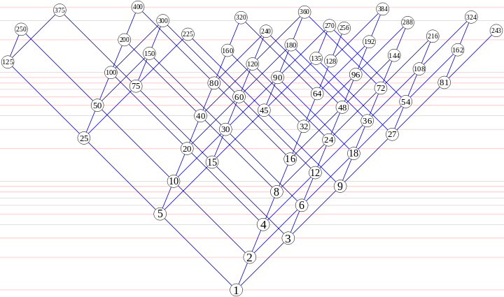

   Hases diagramma skaitļiem līdz :math:`480`, `<https://bit.ly/3qQBntd>`_

Dalītāju summēšanas funkcijas
^^^^^^^^^^^^^^^^^^^^^^^^^^^^^^^

Fiksēta skaitļa dalītājiem var viegli aprēķināt to skaitu, summu (arī augstāku pakāpju summu).

**Definīcija:** 
  Naturālam :math:`n` apzīmējam :math:`\sigma_0(n)`, :math:`\sigma_1(n)` un :math:`\sigma_2(n)` šādi: 

.. math::

  \begin{array}{rcl}
  \sigma_0(n) & = & \sum\limits_{d \mid n} 1 = \sum\limits_{d \mid n} d^0,\\
  \sigma_1(n) & = & \sum\limits_{d \mid n} d,\\
  \sigma_2(n) & = & \sum\limits_{d \mid n} d^2,
  \end{array}

**Piemērs:** 
  :math:`\sigma_0(12) = 6` (skaitlim :math:`12` ir :math:`6` pozitīvi dalītāji).  

  :math:`\sigma_1(12) = 1 + 2 + 3 + 4 + 6 + 12 = 28`
  
  Sk. `<https://bit.ly/3IrWVCn>`_.

Summēšanas izteiksmes
^^^^^^^^^^^^^^^^^^^^^^^

:math:`\sum\limits_{d \mid n} f(d)` summē :math:`f(d)`
visiem :math:`n` dalītājiem :math:`d`.

:math:`\sigma_0(n) = \sum\limits_{d \mid n} d^0 = \sum\limits_{d \mid n} 1` -- skaitļa
:math:`n` dalītāju skaits.

Līdzīgi apzīmējumi, lai nerakstītu daudzpunkti: 

.. math::

  \sum\limits_{k = 0}^n  k^2 = 1^2 + 2^2 + \ldots + n^2.

.. math::

  \prod\limits_{k = 0}^n  k = 1 \cdot 2 \cdot \ldots \cdot n = n!.

Piemēri ar n=60
^^^^^^^^^^^^^^^^

.. math::

  \sigma_0(60) = \left| \{ 1,2,3,4,5,6,10,12,15,20,30,60 \} \right| = 12.

.. math::

  \sigma_1(60) = 1 + 2 + 3 + 4 + 5 + 6 + 10 + 12 + 15 + 20 + 30 + 60 = 168.

.. math::

  \sigma_2(60) = 1^2 + 2^2 + 3^2 + 4^2 + 5^2 + 6^2 + 10^2 + 12^2 + 15^2 + 20^2 + 30^2 + 60^2  = 5460.

Dalītāji skaitlim 60
^^^^^^^^^^^^^^^^^^^^^^

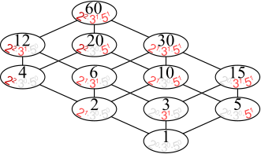

* Dalītāju skaitu var atrast, izmantojot *reizināšanas likumu*. 
* Zināms, ka :math:`60 = 2^23^15^1`.
* Katrs skaitļa :math:`60` dalītājs izsakāms :math:`2^a3^b5^c`, 
  kur :math:`a \in \{ 0,1,2\}`, :math:`b \in \{ 0,1 \}`, :math:`c \in \{ 0,1 \}`. 
* Sareizinām elementu skaitu: :math:`3 \cdot 2 \cdot 2 = 12`.

.. math::

  \sigma_0 \left( 2^{\textcolor{red}{2}}3^{\textcolor{red}{1}}5^{\textcolor{red}{1}} \right) = 

.. math::

   = (\textcolor{red}{2}+1)\cdot (\textcolor{red}{1}+1)(\textcolor{red}{1}+1) = 12.

Dalītāju un to kvadrātu summas
^^^^^^^^^^^^^^^^^^^^^^^^^^^^^^^^^^

:math:`\sigma_1(60)` un :math:`\sigma_2(60)` arī var ātri 
aprēķināt, izmantojot algebriskas identitātes:

.. math::

  \sigma_1(60) = \left( 2^2 + 2^1 + 2^0 \right) \left( 3^1 + 3^0 \right) \left( 5^1 + 5^0 \right) = 

.. math::

   = (4+2+1)(3+1)(5+1) = 7 \cdot 4 \cdot 6 = 168.

.. math::

  \sigma_2(60) = \left( 2^4 + 2^2 + 2^0 \right) \left( 3^2 + 3^0 \right) \left( 5^2 + 5^0 \right) = 

.. math::

   = (16+4+1)(9+1)(25+1) = 5460.

Visu šo var iegūt no sadalījuma pirmreizinātājos:
:math:`60 = 2 \cdot 2 \cdot 3 \cdot 5 = 2^23^15^1`.

**Apgalvojums:** 
  Katram naturālam :math:`n` eksistē 
  bezgalīgi daudzi skaitļi :math:`M`, kuriem ir tieši 
  :math:`n` pozitīvi dalītāji.  

*Pierādījums:* 
  Var izvēlēties :math:`M = p^{n-1}`, kur 
  :math:`p` ir jebkurš pirmskaitlis. :math:`\blacksquare`

Jautājumi dalītāju skaitam un summai
^^^^^^^^^^^^^^^^^^^^^^^^^^^^^^^^^^^^^^^^

**1.jautājums:** 
  Atrast mazāko naturālo skaitli :math:`M`, kam ir tieši :math:`16` dalītāji. 

.. only:: Internal

  **Atbilde:**
  
    Skaitlim :math:`M` nevar būt vairāk kā četri pirmreizinātāji. 
    Ja :math:`M = p_1^ap_2^bp_3^cp_4^d`, tam ir 
    :math:`(a+1)(b+1)(c+1)(d+1)` dalītāji.
    Var iegūt rezultātu :math:`16`, ja :math:`a =b = c = d =1`. 
    Savukārt, ja dažādo :math:`M` pirmreizinātāju
    ir vairāk kā četri, tad :math:`M` būtu vismaz :math:`2^5 = 32` 
    dalītāji. 

    Šķirosim dažādus gadījumus, kā :math:`16` var izteikt
    ne vairāk kā četru dažādu pirmskaitļu (vai to pakāpju) reizinājumu. 
    Dalītāju skaitu nosaka pirmreizinātāju pakāpes, nevis tas, kā 
    izvēlēti paši pirmreizinātāji. Tāpēc sadalījumus pirmreizinātājos
    šķirosim pēc pirmreizinātāju pakāpēm, veicot pirmreizinātāju izvēli 
    nedaudz vēlāk. 

    .. image:: figs-ntjun01-divisibility/16-divisors-var123.png
       :width: 4in

    **(A) gadījums:** 
      :math:`16 = (15+1)` jeb :math:`p^{15}`, kur :math:`p` ir pirmskaitlis.
      Mazākais šāds skaitlis ir :math:`M = 2^{15} = 32768`.

    **(B) gadījums:** 
      :math:`16 = (7+1)(1+1)` jeb 
      :math:`p^7q`, kur :math:`p,q` ir pirmskaitļi. 
      Mazākais šāds skaitlis ir :math:`2^7\cdot{} 3 = 128 \cdot 3 = 384`. 

    **(C) gadījums:** 
      :math:`16 = (3+1)(3+1)` jeb 
      :math:`p^3q^3`, kur :math:`p,q` ir pirmskaitļi. 
      Mazākais šāds skaitlis ir :math:`2^3\cdot{} 3^3 = 216`.

    .. image:: figs-ntjun01-divisibility/16-divisors-var45.png
       :width: 3.5in

    **(D) gadījums:** 
      :math:`(3+1)(1+1)(1+1)` jeb
      :math:`p^3qr`, kur :math:`p,q,r` ir pirmskaitļi. 
      Mazākais šāds skaitlis ir :math:`2^3\cdot{} 3 \cdot 5 = 120`.

    **(E) gadījums:** 
      :math:`(1+1)(1+1)(1+1)(1+1)` jeb
      skaitlis formā :math:`pqrs`, kur :math:`p,q,r,s` ir pirmskaitļi.
      Mazākais šāds skaitlis ir :math:`2 \cdot 3 \cdot 5 \cdot 7 = 210`. 

    Mazākais no apskatītajiem pieciem rezultātiem
    ir :math:`120` ((D) gadījums). Tā kā ikvienā no gadījumiem 
    izvēlējāmies mazākos iespējamos pirmreizinātājus, tātad šo 
    rezultātu nevar uzlabot.    

  :math:`\square`

**2.jautājums:**
  Naturālam skaitlim :math:`n` ir tieši :math:`125` naturāli 
  dalītāji (ieskaitot :math:`1` un pašu :math:`n`). 
  Kādu visaugstākās pakāpes sakni noteikti var izvilkt no 
  :math:`n`, iegūstot naturālu rezultātu? 

.. only:: Internal

  **Atbilde:** 

    :math:`125` var izteikt kā reizinājumu 
    vairākiem skaitļiem (kas pārsniedz :math:`1`) sekojošos veidos:

    * :math:`125 = 124+1`.
    * :math:`125 = 25 \cdot 5 = (24 + 1) \cdot (4+1)`.
    * :math:`125 = 5 \cdot 5 \cdot 5 = (4+1) \cdot (4+1) \cdot (4+1)`.

    Tādēļ skaitli :math:`n` var sadalīt pirmreizinātājos 
    vienā no sekojošiem veidiem: 

    .. math::

      n = p^{124},\;\;n = p^{24}q^4\;\;\text{vai}\;\;n = p^{4}q^4r^4,

    kur :math:`p,q,r` ir pirmskaitļi. Visos gadījumos var izvilkt 4.pakāpes sakni.
  
  :math:`\square`

Pirmskaitļu izvietojums
-------------------------

**Anotācija:** 
  Šajā tēmā pamatojam, ka pirmskaitļu ir bezgalīgi daudz, 
  apsveram iespējas tos algoritmiski atrast (Eratostena režģis, 
  daži mūsdienu algoritmi). Apskatām sacensību uzdevumus, 
  kuri iedvesmojušies no šīs pirmskaitļu teorijas.

  Pirmskaitļu izvietojums nelielos intervālos 
  var izskatīties juceklīgs. Tomēr garākos 
  intervālos to blīvums labi tuvināms ar 
  varbūtisku modeli. Vienkāršoti sakot, 
  lieliem naturāliem :math:`n`, varbūtība, ka :math:`n` 
  ir pirmskaitlis, ir apgriezti 
  proporcionāla skaitļa :math:`n` naturālajam logaritmam.

Pirmskaitļu jēdziens
^^^^^^^^^^^^^^^^^^^^^^

**Definīcija:** 
  Naturālu skaitli :math:`p>1` sauc par **pirmskaitli**
  (*prime number*), ja vienīgie tā dalītāji ir :math:`1` un :math:`p`. 

Naturālus skaitļus :math:`n>1`, kas nav pirmskaitļi, sauc par 
**saliktiem skaitļiem** (*composite number*). 
Skaitlis :math:`1` nav ne pirmskaitlis, ne salikts skaitlis.

Intervālā :math:`[1;100]` ir :math:`25` pirmskaitļi:

===  ===  ===  ===  ===
  2    3    5    7   11
 13   17   19   23   29
 31   37   41   43   47
 53   59   61   67   71
 73   79   83   89   97
===  ===  ===  ===  ===
 

.. note::
  Skaitlis :math:`1` nav ne pirmskaitlis, ne arī salikts skaitlis. 
  Tas ir *vienības elements* naturālu skaitļu reizināšanā. 
  (Veselo skaitļu pasaulē :math:`-1` ir otrs vienības elements.)

Eratostena režģis
^^^^^^^^^^^^^^^^^^^

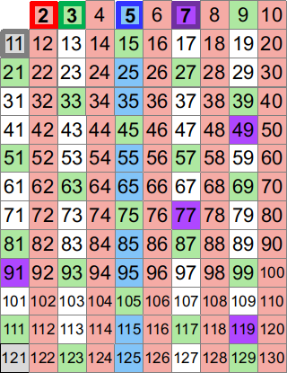

Eratostena process notiek vairākos soļos. 

* Skaitļu tabuliņā atzīmē mazāko skaitli 
  (pirmskaitli :math:`\textcolor{red}{2}`) un visus
  tā dalāmos/daudzkārtņus izsvītro. 
* Atzīmē mazāko neizsvītroto 
  (pirmskaitli :math:`\textcolor{green}{3}`) un 
  visus tā daudzkārtņus izsvītro.
* Atzīmē mazāko neizsvītroto 
  (pirmskaitli :math:`\textcolor{blue}5`) un 
  visus tā daudzkārtņus izsvītro.

**Apgalvojums:** 
  Minētais process nekad nebeigsies; pēc katra soļa paliks 
  neizsvītroti skaitļi. 

.. note::
  Vai Eratostena režģis ir efektīvs algoritms, 
  ja jāatrod visi pirmskaitļi intervālā :math:`[1,N]`? 

  Eratostens (276. g. p.m.ē –194. g. p.m.ē.) 
  pazīstams arī ar to, ka diezgan precīzi 
  noteicis Zemeslodes apkārtmēru. 
  Viņa eksperiments balstījās uz novērojumu, 
  ka divās Ēģiptes pilsētās, kas abas atrodas 
  uz tā paša meridiāna (mūsdienās tās 
  sauc Asuāna un Aleksandrija), 
  ir atšķirīgs Saules augstums virs horizonta 
  vasaras saulgriežos. Asuāna atrodas 
  uz Ziemeļu tropiskā loka – Saule tur 
  nonāk tieši zenītā, savukārt Aleksandrijā 
  tā pat saulgriežos atrodas 
  noteiktā leņķī no zenīta – un leņķi var izmērīt, 
  piemēram, kā vertikāla staba ēnas garumu. 
  Attālums no Asuānas līdz Aleksandrijai 
  Eratostenam bija zināms; Zemeslodes apkārtmēru 
  tad noteica ar trigonometrisku sakarību

  Eratostena režģis ir dinamiskās programmēšanas 
  piemērs. Šie algoritmi aizpilda apjomīgas 
  datu struktūras (piemēram, masīvus, tabulas). 
  Dinamiskā programmēšana ir efektīva, piemēram, 
  kāpinot skaitļus lielās pakāpēs (atceroties agrāk 
  iegūtus starprezultātus), vai arī, aprēķinot 
  Fibonači skaitļus. 

  Lai noskaidrotu, vai konkrēts skaitlis :math:`n`
  ir pirmskaitlis, Eratostena režģis nav praktisks
  algoritms (jo tas meklē visus pirmskaitļus, kas
  par to mazāki).

**Piemērs:** 
  Kādā no Eratostena režģa veidošanas 
  soļiem tiek izsvītroti visi tie saliktie skaitļi, kuri 
  ir pirmskaitļa :math:`13`
  daudzkārtņi. Kurš no šajā solī 
  izsvītrotajiem skaitļiem ir pirmais?

**Risinājums:**
  Skaitļa :math:`13` daudzkārtņi, kas tiek izsvītroti 
  ir :math:`26,39,52,\ldots`. Mazākais no šiem skaitļiem, 
  kas nedalās ar nevienu citu pirmskaitli :math:`p < 13`
  ir :math:`13^2 = 169`. Tam seko arī :math:`13 \cdot 17` un 
  daudzi citi piemēri, kurus šajā solī izsvītro
  pirmoreiz.

Pirmskaitļu ir bezgalīgi daudz
^^^^^^^^^^^^^^^^^^^^^^^^^^^^^^^^^^

**Teorēma (Eiklīds):** 
  Pirmskaitļu ir bezgalīgi daudz.

**Pierādījums:** 
  No pretējā. Ja pirmskaitļu būtu 
  galīgs skaits, tad eksistētu lielākais pirmskaitlis 
  :math:`p_K`. Sareizinām visus pirmskaitļus, pieskaitām :math:`1`:

  .. math::

    P = p_1 \cdot p_2 \cdot p_3 \cdot \ldots \cdot p_K + 1. 

  :math:`P` nedalās ne ar vienu no pirmskaitļiem, kuri ir galīgajā 
  sarakstā: vienmēr atlikums :math:`1`. Vai nu :math:`P` pats ir pirmskaitlis 
  vai kādu (sarakstā neesošu) pirmskaitļu reizinājums. Pretruna. 
  :math:`\blacksquare`

Pilnās pārlases algoritms
^^^^^^^^^^^^^^^^^^^^^^^^^^^

Ir iespējams, pārbaudīt, vai skaitlis :math:`n` ir pirmskaitlis, 
to dalot ar :math:`2,3,\ldots` -- visiem skaitļiem līdz :math:`\sqrt{n}`. 

.. code-block:: python
  
  import math 
  def isPrime(n):
      result = True
      ROOT = int(math.sqrt(n))
      for d in range(2,ROOT+1):
          if n % d == 0:
              result = False
              break
      return result

  print(isPrime(10000000019))

.. note::
  Pilnā pārlase ir ļoti neefektīva (slikti strādā jau pie :math:`n = 10^{30}`). 
  Tam par iemeslu ir nepieciešamība kriptogrāfijā un citos lietojumos pārbaudīt 
  vai ir pirmskaitlis kāds ļoti liels skaitlis, piemēram :math:`p \approx 10^{100}`
  (skaitlis ar aptuveni :math:`100` cipariem). 

  Tad pilnajai pārlasei jāpārbauda aptuveni :math:`\sqrt{p} \approx 10^{50}` dalīšanās darbības -- 
  šis ir jau divreiz īsāks skaitlis, kura pierakstā ir tikai :math:`50` cipari, bet joprojām tik liels, 
  lai visas šīs pārbaudes praksē nevarētu izdarīt.
  Ja kopš Visuma rašanās (Lielā sprādziena) pagājuši aptuveni 13.8 miljardi gadu, 
  tās ir tikai :math:`4.35 \cdot 10^{23}` mikrosekundes.

Ātrāki pirmskaitļu testi
^^^^^^^^^^^^^^^^^^^^^^^^^^

  Ir algoritmi, kuri darbojas pietiekami efektīvi arī pie :math:`p \approx 10^{100}` 
  un vēl daudz lielākiem skaitļiem. 
  Pirmais no tiem ir Millera-Rabina tests (ap 1982.g.), kas izmanto nejaušo skaitļu ģeneratoru un 
  var kļūdīties ar kaut kādu varbūtību. Nedaudz palielinot pārbaužu skaitu, 
  šo kļūdīšanās varbūtību var pēc patikas samazināt. Šo algoritmu vēl joprojām visvairāk 
  izmanto praksē. 
  Sk. teoriju `<https://bit.ly/3qOFLsS>`_ un arī 
  algoritma kodu dažās programmēšanas valodās -- `<https://bit.ly/3nNpKBo>`_.
    
  Cits svarīgs algoritms ir `<https://bit.ly/3FROhLN>`_, AKS algoritms 
  jeb Agrawal-Kayal-Saxena pirmskaitļu tests ap 2002.g.) Tas bija pirmais
  efektīvais algoritms, kas neizmanto nejaušos skaitļus un arī nepieļauj kļūdīšanās varbūtību.

**Piemērs:**
  Vai eksistē :math:`1000` pēc kārtas sekojoši skaitļi, kuri visi ir salikti?

Atstarpēm starp pirmskaitļiem ir tendence pieaugt, ja skaitļi kļūst lielāki; 
pastāv izvērsta teorija par **pirmskaitļu atstarpēm** (*prime gaps*). 
Sk. `<https://bit.ly/3nOnoSG>`_. 
Enciklopēdijas tabulā atrodam, ka pirmā vieta, kur attālums 
starp diviem pirmskaitļiem pārsniedz tūkstoti, sākas ar pirmskaitli :math:`p=1\,693\,182\,318\,746\,371`

.. code-block:: python

  >>> import sympy
  >>> p1 = 1693182318746371
  >>> p2 = p1 + 1132
  >>> set([sympy.isprime(n) for n in range(p1+1, p2)])
  {False}

No otras puses, ir arī zināms, ka starpība starp diviem pēc kārtas 
sekojošiem pirmskaitļiem bezgalīgi daudzas reizes nepārsniedz :math:`246`.
(T.i. eksistē cik patīk lieli pirmskaitļi :math:`p_1` un :math:`p_2`, 
kuriem :math:`|p_1 - p_2| \leq 246`.)
Jautājums, vai eksistē bezgalīgi daudzi dvīņu pirmskaitļi (starp kuriem 
attālums ir :math:`2`), joprojām ir atklāts. 

**Konstruktīvs pierādījums:**
  Ja mums nav pieejams dators, Internets vai citi palīglīdzekļi, 
  tad :math:`1000` pēc kārtas sekojošus saliktus skaitļus var 
  uzkonstruēt arī ar vienkāršiem algebriskiem spriedumiem. 
  
  Izvēlamies :math:`N = 1001!+2`, tad iegūstam, ka :math:`1000!+a` dalās ar 
  :math:`a` katram :math:`a \in \{2,\ldots 1001 \}`. :math:`\square`

Ievērojam, ka iegūtais :math:`N = 1001!+2` (vieta, kur sākas saliktie skaitļi) ir krietni lielāks nekā 
vērtība :math:`p_1 = 1693182318746371 + 1`, kas norādīta enciklopēdijā. 

**Uzdevums:**
  Pierādīt, ka ir bezgalīgi daudz nepāru pirmskaitļu, kas
  izsakāmi formā :math:`4k+3` (dod atlikumu :math:`3`, dalot ar :math:`4`). 

TODO: Pamatot līdzīgi kā pierādījumā par bezgalīgo pirmskaitļu skaitu. 

Dirihlē teorēma par pirmskaitļiem
^^^^^^^^^^^^^^^^^^^^^^^^^^^^^^^^^^^

**Dirihlē Teorēma (Dirichlet):** 
  Ja :math:`a` un :math:`d` ir savstarpēji pirmskaitļi, 
  tad bezgalīgā aritmētiskā progresijā

  .. math::

    a, a+d, a+2d, a+3d, \ldots
  
  ir bezgalīgi daudz pirmskaitļu. 

Dažām :math:`a` un :math:`d` vērtībām šo teorēmu var pierādīt ar elementārām 
metodēm (nupat redzējām pie :math:`a=3` un :math:`d=4`). Bet vispārīgajā 
gadījumā ir piemērotākas matemātiskās analīzes metodes, 
kas iziet ārpus mūsu kursa.

Ulama spirāle
^^^^^^^^^^^^^^^^

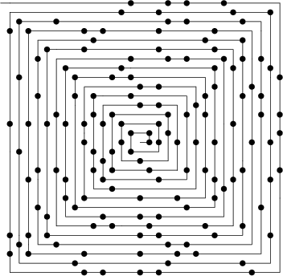

Ulama spirāli veido, uz rūtiņu papīra zīmējot 
attinošos spirāli, sākot ar skaitli :math:`1`. 
Pirmskaitļus, atzīmē ar melniem punktiņiem. 

Pirmskaitļi neveido viegli 
paredzamas likumsakarības, bet tie sablīvējas
uz dažām taisnēm.

**Piemērs:**
  Aplūkojam polinomu :math:`f(x) = x^2 + x + 41`. 
  Visiem argumentiem :math:`x = 0,1,\ldots,39`
  tas pieņem vērtības, kas ir pirmskaitļi.

Šī polinoma vērtību vidū arī lielākiem :math:`x`
ir neparasti  daudz pirmskaitļu. 
Ar modulāro aritmētiku iespējams
pamatot, ka :math:`x^2 + x + 41` (kur :math:`x \in \mathbb{N}`) 
nevar dalīties ne ar vienu pirmskaitli :math:`p < 41`. 

.. note::
  Joprojām nepastāv viegli uzrakstāma formula
  (piemēram, izmantojot elementārās funkcijas, 
  veselās daļas u.c.), kuras vērtību 
  kopa būtu bezgalīga un saturētu tikai pirmskaitļus. 

  Protams, nav jēgas meklēt tādas starp polinomiem. 
  Tomēr izrādās, ka daži polinomi 
  starp savām vērtībām satur neparasti daudz pirmskaitļu.

**TODO:** 
  Vizualizācija, kur :math:`x^2 + x + 41` vērtības
  atliktas uz Ulama spirāles.

Pirmskaitļu skaitīšanas funkcija
^^^^^^^^^^^^^^^^^^^^^^^^^^^^^^^^^^

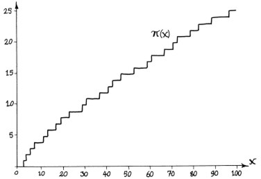

**Definīcija:** 
  Ar :math:`\pi(x)` apzīmējam 
  **pirmskaitļu skaitīšanas funkciju**
  (*prime-counting function*): Katram 
  reālam skaitlim :math:`x \in \mathbb{R}`, 
  :math:`\pi(x)` izsaka pirmskaitļu :math:`p_i` skaitu, 
  kuriem :math:`p_i \leq x`. 

  :math:`\pi(x)` definīcijas apgabals ir :math:`\mathbb{R}`, 
  vērtību apgabals ir :math:`\mathbb{Z}_{0+}` -- visi 
  veselie nenegatīvie skaitļi. 

**Piemēri:**
  :math:`\pi(1.99) = 0`, :math:`\pi(2) = 1`,
  :math:`\pi(3) = \pi(3.14) = \pi(4.99) = 2`,
  :math:`\pi(100) = 25`. 

Mersena un Fermā skaitļi
--------------------------

**Anotācija:** 
  Meklējot pirmskaitļus formā :math:`2^n \pm 1` (vai vispārīgāk - :math:`a^n \pm 1`) 
  saskaramies ar algebriskām likumsakarībām – bieži pastāv identitātes, kas ļauj izteiksmi 
  sadalīt reizinātājos. Toties situācijas, kad tas nav triviāli izdarāms ir pētītas 
  un novedušas pie Fermā un Mersena pirmskaitļu jēdziena. 
  Tās ļauj atrast ļoti lielus pirmskaitļus.

Algebriskas identitātes
^^^^^^^^^^^^^^^^^^^^^^^^^

* Pakāpju starpības formula (visiem :math:`n \geq 2`):

  .. math::

    \textcolor{red}{a^n - b^n} = 
    \textcolor{red}{(a-b)}\left( a^{n-1}+a^{n-2}b^1 + \ldots + 
    a^1b^{n-2} + b^{n-1} \right).

* Pakāpju summas formula (visiem :math:`n \geq 1`):

  .. math::

    \textcolor{red}{a^{2n+1} + b^{2n+1}} =     
    \textcolor{red}{(a+b)}\left( a^{2n} - a^{2n-1}b^1 + 
    a^{2n-2}b^2 - \cdots - a^1b^{2n-1} + b^{2n} \right).

Var pierādīt, atverot iekavas. (Iekavās ar daudzpunktiem ir galīgu ģeometrisku 
progresiju summas.)

Fermā skaitļu jēdziens
^^^^^^^^^^^^^^^^^^^^^^^^^^

Bijuši vairāki mēģinājumi uzrakstīt 
kompaktu formulu (bez `for` cikliem 
vai citiem programmēšanas paņēmieniem), kuras
visas vērtības ir pirmskaitļi. 

**Definīcija:** 
  Par :math:`n`-to Fermā skaitli 
  (:math:`n \geq 0`) sauc :math:`F_n = 2^{2^n}+1`. 

P.Fermā (*Pierre de Fermat*, 1607--1665) izteica hipotēzi, 
ka visi :math:`F_n` ir pirmskaitļi.

:math:`F_0,F_1,F_2,F_3,F_4` ir vienīgie
zināmie pirmskaitļi: 

* :math:`F_0 = 2^{2^0} + 1 = 2^1 + 1 = 3`,
* :math:`F_1 = 2^{2^1} + 1 = 2^2 + 1 = 5`,
* :math:`F_2 = 2^{2^2} + 1 = 2^4 + 1 = 17`,
* :math:`F_3 = 2^{2^3} + 1 = 2^8 + 1 = 257`,
* :math:`F_4 = 2^{2^4} + 1 = 2^{16} + 1 = 65537`.

Jau :math:`F_5 = 2^{2^5} + 1 = 2^{32} + 1 =`
:math:`=4\,294\,967\,297 = 641 \cdot 6\,700\,417` nav pirmskaitlis.  
(Leonards Eilers (Leonhard Euler), 1707-1783). 

.. note::
  Izņemot pirmos 5 Fermā skaitļus 
  (no :math:`F_0` līdz :math:`F_4`), nav zināms neviens cits
  pirmskaitlis. Ir pilnībā sadalīti pirmreizinātājos 
  pirmie :math:`12` šādi skaitļi – no :math:`F_0` līdz :math:`F_11`. 
  Daudziem citiem ir zināmi daži dalītāji; 
  atklāto/zināmo dalītāju skaits tiek 
  regulāri papildināts.

Skaitļi formā :math:`2^N + 1` nevar būt pirmskaitļi, 
ja kāpinātājam :math:`N` ir kāds nepāru dalītājs, kas lielāks par :math:`1`, jo 
šajā gadījumā var dalīt reizinātājos, izmantojot
algebriskas identitātes :math:`a^3 + 1^3`, :math:`a^5 + 1^5` utml.

Tātad pats kāpinātājs :math:`N` (lai sanāktu kaut kas interesants, 
kas nedalās reizinātājos pavisam triviāli)
noteikti ir divnieka pakāpe jeb :math:`2^N + 1` ir faktiski 
pierakstāms kā :math:`2^{2^k}+1`.
Fermā pirmskaitļi :math:`2^n+1` ir iespējami vien tad, ja skaitlim :math:`n` nav nepāru dalītāju 
(pretējā gadījumā tos var sadalīt reizinātājos, izmantojot kubu summu, piekto pakāpju summu vai līdzīgu identitāti). 
Tātad Fermā pirmskaitļi patiesībā izskatās šādi: :math:`2^{2^n}+1`. 

Mersenna skaitļi
^^^^^^^^^^^^^^^^^^

**Definīcija:** 
  Skaitli :math:`M_n` sauc par 
  **Mersenna skaitli** (*Mersenne number*), ja to var izteikt formā :math:`2^n - 1`.  
  Ja turklāt :math:`M_n` ir pirmskaitlis, tad to sauc par 
  **Mersenna pirmskaitli** (*Mersenne prime*). 

.. note::
  Kāda īpašība noteikti jāizpilda
  skaitlim :math:`n`, lai :math:`M_n = 2^n - 1` būtu 
  izredzes būt pirmskaitlim? 

  Ja :math:`n` nav pirmskaitlis un to var sadalīt kā :math:`n = ab`, tad :math:`2^n-1` 
  dalās reizinātājos kā divu :math:`a`-to (vai divu :math:`b`-to) pakāpju starpība un tātad nav pirmskaitlis. 
  Tātad vienīgie Mersena pirmskaitļi var būt formā :math:`2^p - 1`, kur :math:`p` ir pirmskaitlis. 
  Šādā formā parasti ir pirmskaitļi-rekordisti 
  (t.i. lielākie starp visiem pirmskaitļiem, kuri ikbrīd zināmi progresīvajai cilvēcei).

**Teorēma:** 
  Lai Mersena skaitlis :math:`M_n = 2^n - 1` 
  būtu pirmskaitlis, ir *nepieciešami*, lai pats
  :math:`n` būtu pirmskaitlis. 

**Pierādījums:** 
  Ja :math:`n = km` ir divu naturālu 
  skaitļu reizinājums (turklāt :math:`k>1` un :math:`m>1`), 
  tad var sadalīt reizinātājos kā :math:`a^m - b^m`: 

  .. math::

    M_n = 2^{km} - 1 = \left( 2^k \right)^m - 1^m = 

  .. math::

    = (2^k - 1) \left( (2^k)^{m-1} + \ldots + 1 \right).
    :math:`\blacksquare`

Nosacījums, ka :math:`p` ir pirmskaitlis ir 
*nepieciešams*, bet nav 
*pietiekams*, lai :math:`2^p - 1` būtu pirmskaitlis. 

**Piemēri:** 

  .. math::
  
  \begin{array}{l}
  :math:`M_{11} = 2^{11} - 1 = 2047 = 23 \cdot 89`,\\
  :math:`M_{23} = 2^{23} - 1 = 8388607 = 47 \cdot 178481`.\\
  \end{array}

Šādu piemēru ir tik daudz, ka Mersena skaitļi, kuri 
tiešām ir pirmskaitļi, ir tikai niecīga daļa no 
visiem :math:`2^p - 1` (pašlaik zināms tikai :math:`51` Mersena pirmskaitlis; 
vidēji katru gadu atrod pa vienam jaunam).

Mersena pirmskaitļu piemēri:

====================  ==========  ==========  ==========  ===========  =============  ================  ================  ========================
:math:`n`              :math:`2`   :math:`3`   :math:`5`    :math:`7`     :math:`13`        :math:`17`        :math:`19`                :math:`31`
:math:`M_n = 2^n-1`    :math:`3`   :math:`7`  :math:`31`  :math:`127`   :math:`8191`  :math:`131\,071`  :math:`524\,287`  :math:`2\,147\,483\,647`
====================  ==========  ==========  ==========  ===========  =============  ================  ================  ========================

Lielākais Mersena pirmskaitlis (un vispār - lielākais
zināmais pirmskaitlis) ir :math:`2^{82\,589\,933} - 1`. 
Tas atrasts 2018.g. decembrī.

Pavisam zināmi :math:`51` Mersena pirmskaitļi. Kopš 
1996.g. GIMPS (*Great Internet Mersenne Prime Search*) 
projekta ietvaros 23 gadu laikā atrasti jau 
17 pirmskaitļi. 

Sk. visu zināmo Mersenna pirmskaitļu sarakstu -- `<https://bit.ly/3nOYhzl>`_.

.. note::
  Šis GIMPS projekts parādījās kā prototips/iedvesma BitCoin un citu līdzīgu kriptovalūtu rēķināšanai. 
  Lielākā zināmā Mersena pirmskaitļa :math:`M_{82,589,933}` decimālpierakstā
  ir :math:`24,862,048` cipari – pilnībā izdrukāts tas aizņemtu vairākus grāmatplauktus. 

Perfektie skaitļi
^^^^^^^^^^^^^^^^^^^^

**Definīcija:** 
  Skaitli sauc par **perfektu** (*perfect number*), 
  ja tas vienāds ar visu savu dalītāju summu (izņemot sevi pašu). 

**Piemēri:** 
  :math:`6 = 1+2+3`; :math:`28 = 1 + 2 + 4 + 7 + 14`. 

**Teorēma (Eiklīds):** 
  Ja :math:`2^p - 1` ir pirmskaitlis, tad
  :math:`2^{p-1}(2^p - 1)` ir perfekts. 

**Teorēma (Eilers):** 
  Visi pāru perfektie skaitļi izsakāmi 
  formā :math:`2^{p-1}(2^p - 1)`. 

Izteiksim dažus perfektos skaitļus binārajā pierakstā:

=======================  =======================================================
Pirmskaitlis :math:`p`   :math:`2^{p-1}(2^p - 1)` vērtība
:math:`p = 2`            :math:`6_{10} = 110_{2}`
:math:`p = 3`            :math:`28_{10} = 11100_{2}`
:math:`p = 5`            :math:`496_{10} = 111110000_{2}`
:math:`p = 7`            :math:`8128_{10} = 1111111000000_{2}`
:math:`p = 13`           :math:`33550336_{10} = 1111111111111000000000000_{2}`
=======================  =======================================================

Ar :math:`p=11` Mersenna pirmskaitlis nesanāk, jo :math:`2^{11} - 1 = 2047 = 23 \cdot 89`. 

Jautājumi par Fermā un Mersena skaitļiem
^^^^^^^^^^^^^^^^^^^^^^^^^^^^^^^^^^^^^^^^^^^

**1.jautājums:**
  Vispārināt Fermā skaitļus, noskaidrojot, kuri no :math:`a^k+1` var būt pirmskaitļi 
  naturālām :math:`a` un :math:`k` vērtībām (ja :math:`a \neq 2`). 

.. Andreescu2006.1.77 

**2.jautāums:** 
  Pierādīt, ka naturāliem skaitļiem :math:`m` un :math:`n`, 
  kam :math:`m > n`, Fermā skaitlis :math:`F_m - 2` noteikti 
  dalās ar :math:`F_n`. 

.. only:: Internal

  **Atbilde:**
  
    Atkārtoti lietojam kvadrātu starpības formulu dalīšanai reizinātājos: 

    .. math::

      F_m - 2 = 2^{2^m} + 1 - 2 = 2^{2^m} - 1 = 

    .. math::

      =\left( 2^{2^{m-1}} - 1 \right) \left( 2^{2^{m-1}} + 1 \right) = 
      \left( F_{m-1} - 2 \right) F_{m-1}.

    Ja arī :math:`m - 1 > n`, tad līdzīgu spriedumu atkārto vēlreiz, 
    dalot reizinātājos :math:`F_{m-1} - 2` utt. Katrā 
    solī redzam, ka uzrodas reizinātāji :math:`F_{m-1}`, :math:`F_{m-2}` utt. 
    Kāds no šiem reizinātājiem būs tieši :math:`F_n`. 
    
  :math:`\square`
  
    

**3.jautājums:**
  Dažādiem naturāliem :math:`m` un :math:`n`, skaitļi :math:`F_m` un :math:`F_n` ir
  savstarpēji pirmskaitļi.  
  (Piemēram, :math:`F_5` dalās ar :math:`641`. Tātad neviens cits Fermā 
  skaitlis nevar dalīties ar :math:`641`.)

.. only:: Internal

  **Atbilde:**

    Pieņemsim, ka :math:`m>n`. Tad :math:`F_m - 2` dalās ar :math:`F_n`. Iegūstam: 

    .. math::

      \text{LKD}(F_m,F_n) = \text{LKD}((F_m -2) + 2,F_n) = \text{LKD}(2,F_n) = 1.

  :math:`\square`

**4.Jautājums:** 
  Atrast visus pirmskaitļus, kas izsakāmi formā 
  :math:`n^n + 1` un ir mazāki kā :math:`10^{19}`. 

.. only:: Internal

  **Atbilde:**
  
    Ja :math:`n` dalās ar kādu nepāru skaitli :math:`c>1`
    (t.i. :math:`n = cd`, kur :math:`c = 2k+1 \geq 3`),
    tad pirmskaitlis nesanāk, jo 

    .. math::

      n^n + 1 = \left( n^d \right)^c + 1^c = \left( n^d \right)^{2k+1} + 1^{2k+1},

    kas dalās reizinātājos pēc formulas
    :math:`a^{2k+1} + b^{2k+1} = (a+b)(a^{2k} - \ldots + b^{2k})`, 
    kur :math:`a = n^d` un :math:`b = 1`. 

    Ja :math:`n` ir divnieka pakāpe, šķirojam gadījumus: 

    * Ja :math:`n = 1`, tad :math:`n^n + 1 = 2` (der)
    * Ja :math:`n = 2`, tad :math:`n^n + 1 = 5` (der)
    * Ja :math:`n = 4`, tad :math:`n^n + 1 = 257` (der)

    Ja :math:`n=8`, tad 

    .. math::

      8^8 + 1 = \left( 2^8 \right)^3 + 1^3,

    kas dalās reizinātājos pēc formulas 
    :math:`a^3 + b^3 = (a+b)\left( a^2 - ab + b^2 \right)`:

    .. math::

      8^8 + 1 = \left( 2^8 + 1 \right)\left( 2^{16} - 2^8 + 1 \right).

    Pamatosim, ka pie :math:`n = 16` skaitlis :math:`n^n + 1 > 10^{19}`, 
    t.i. šāds skaitlis neder (neatkarīgi no tā, vai tas 
    ir pirmskaitlis). 

    .. math::

      16^{16} + 1 = 2^{64} + 1 = 

    .. math::

      2^4 \cdot 2^{60} + 1 = 16 \cdot \left( 2^{10} \right)^6 + 1 = 16 \cdot 1024^6 + 1 > 

      > 16 \cdot 1000^6 = 16 \cdot 10^{18}  = 1.6 \cdot 10^{19} > 10^{19}.

    .. note::
      Starp citu, :math:`16^{16} +1 = 2^{64} + 1 = 2^{2^6} + 1 = F_6`
      ir sestais Fermā skaitlis. Tas nav pirmskaitlis: 
      :math:`F_6 = 18\,446\,744\,073\,709\,551\,617` dalās ar 
      :math:`274177 = 1071 \cdot 2^8 + 1`. 

      To pamatoja Tomass Klausens (*Thomas Clausen*, 1855.g. 
      Tartu, tag. Igaunija). 

  :math:`\square`

Aritmētikas pamatteorēma
-------------------------

**Teorēma:** 
  Katrs naturāls skaitlis :math:`n > 1` ir vai nu pirmskaitlis, 
  vai arī ir izsakāms pirmskaitļu reizinājumā, pie tam šis reizinājums
  ir viens vienīgs (ja neņem vērā reizinātāju secību). 

**Eksistence:** 
  Pierādām ar indukciju:  
  Ja :math:`n=2`, tad apgalvojums ir spēkā, jo :math:`2` ir pirmskaitlis.  
  Pieņemam, ka apgalvojums ir spēkā visiem :math:`k < n`. Pamatosim, ka
  tas izpildās arī skaitlim :math:`n`.  
  Ja :math:`n` ir pirmskaitlis, tad tas jau ir šādi izteikts. Savukārt, ja
  :math:`n = ab` (kur :math:`a,b > 1`), tad abus :math:`a` un :math:`b` jau protam izteikt. 
  :math:`\square`  

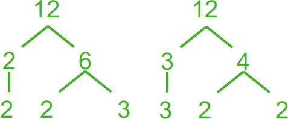

Kāpēc neatkarīgi no **faktorizēšanas**
secības, vienmēr sanāk tas pats?  (Par faktorizēšanu sauc dalīšanu reizinātājos.)

.. math::

  \begin{array}{l}
  12 = 2 \cdot 6= 2 \cdot 2 \cdot 3.\\
  12 = 3 \cdot 4 = 3 \cdot 2 \cdot 2.\\
  3 \cdot 2 \cdot 2 \cdot \textcolor{red}{1} \cdot \textcolor{red}{1} \cdot \textcolor{red}{1}.\\
  3 \cdot 2 \cdot 2 \cdot \textcolor{red}{(-1)} \cdot \textcolor{red}{(-1)}.\\
  \end{array}

.. note::
  Lielu skaitļu (100 un vairāk ciparu) dalīšana reizinātājos 
  ir datoram grūti veicams uzdevums. 
  Pirmskaitļu testi (kā Millera-Rabina tests u.c.) var salīdzinoši 
  ātri dot atbildi, vai skaitlis ir pirmskaitlis vai nē. 
  Bet neeksistē līdzīgs efektīvs algoritms, kas dalītu reizinātājos 
  tos skaitļus, kuri **nav** pirmskaitļi. 

  Pirmskaitļi te līdzinās atomiem ķīmijā. Ķīmiski tīra viela 
  (neatkarīgi no sadalīšanas veida un soļiem) 
  dod elementu atomus, kuru skaits attiecas kā 
  nelieli veseli skaitļi. Līdzīgi kā ūdens 
  molekulu veido divi ūdeņraža un viens skābekļa
  atoms, skaitli :math:`12` veido divi pirmskaitļa :math:`2` 
  atomi un viens pirmskaitļa :math:`3` atoms. 

**Skaitļa 90 faktorizācija**

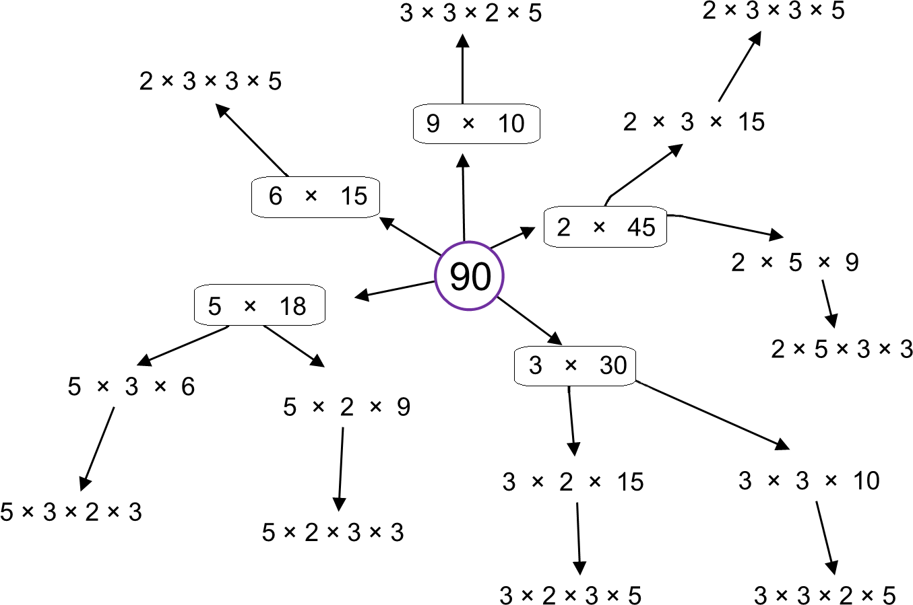

Ļoti dažādi veidi, kā nonākt līdz pirmskaitļu reizinājumam.

.. note::
  Fakts, ka ikvienu naturālu skaitli var tieši vienā veidā izteikt kā (viena vai vairāku) 
  pirmskaitļu reizinājumu, nav triviāls vai pašsaprotams. Tas izriet no vairākām naturālu skaitļu 
  aritmētikā esošām īpašībām (kas tieši **neizriet** no reizināšanas vai dalīšanas attiecības). 
  Pierādījums izmanto naturālu skaitļu sakārtojumu (starp skaitļiem var atrast vismazāko), 
  izmanto iespēju dalīt ar atlikumu. Ir iespējamas tādas īpatnēju "skaitļu" kopas, 
  kurās aritmētikas pamatteorēma neizpildās.

  Sk. *Factor trees* -- `<https://bit.ly/3KztiB5>`_.

**Viennozīmība:** 
  Pieņemsim, ka :math:`s > 1` izsakāms divos 
  dažādos veidos:

  .. math::

    s = p_1p_2\cdots{}p_m,

  .. math::

    s = q_1q_2\cdots{}q_n.
  
  Jāparāda, ka :math:`m=n` un :math:`q_j` ir tie paši, kas :math:`p_j`
  (iespējams, citā secībā). Pēc 
  **Eiklīda lemmas** :math:`p_1` dala vienu no :math:`q_j`. 
  Pārnumurējam tā, lai :math:`p_1` dalītu :math:`q_1`. 

  Tā kā :math:`q_1` arī ir pirmskaitlis, tad :math:`p_1 = q_1`. 
  Dalām abas vienādības ar :math:`p_1`. Iegūstam:

  .. math::

    s_1 = p_2\cdots{}p_m,

  .. math::

    s_1 = q_2\cdots{}q_n.

  Tagad tāpat var pamatot, ka :math:`p_2 = q_2`, utt. :math:`\blacksquare`

**Eiklīda lemma:** 
  Ja pirmskaitlis :math:`p` dala divu veselu skaitļu 
  reizinājumu :math:`ab`, tad :math:`p` dala vismaz vienu no skaitļiem :math:`a` vai :math:`b`. 

**Pierādījums:** 
  Pieņemsim, ka :math:`p` un :math:`a` ir savstarpēji pirmskaitļi. 
  (Ja :math:`\text{LKD}(p,a)>1`, tad :math:`p` dalītu :math:`a`). Pēc 
  **Eiklīda algoritma**
  jebkuriem savstarpējiem pirmskaitļiem 
  :math:`p,a` var atrast tādus veselus :math:`x` un :math:`y`, ka   
  :math:`px + ay = 1` (**Bezū identitāte**).

  Tā kā :math:`pxb` dalās ar :math:`p`
  un :math:`ayb = (ab)y` dalās ar :math:`p`, tad arī summa 
  :math:`pxb + ayb = (px+ay)b = 1 \cdot b = b` dalās ar :math:`p`. 
  :math:`\blacksquare`

**Kopsavilkums**
  Kā nupat redzējām:  
  Bezū identitāte :math:`\Rightarrow`  
  &nbsp;&nbsp;&nbsp;&nbsp;&nbsp;&nbsp;Eiklīda lemma :math:`\Rightarrow`  
  &nbsp;&nbsp;&nbsp;&nbsp;&nbsp;&nbsp;&nbsp;&nbsp;&nbsp;&nbsp;&nbsp;&nbsp;Aritmētikas pamatteorēma. 

  Aritmētikas pamatteorēma tātad izmanto ne vien pirmskaitļu jēdzienu, bet 
  arī iespēju sakārtot veselus pozitīvus skaitļus (atrast starp bezgalīgi 
  daudzajiem :math:`ax+by = d` vismazāko pozitīvo), gan arī iespēju dalīt
  skaitļus ar atlikumu, ka atlikums :math:`r` ir mazāks par dalītāju :math:`d`.

**Neparasts piemērs:**
  Ieviešam skaitļu kopu :math:`a + b\sqrt{-5}`, kur :math:`a,b` ir veseli skaitļi.  
  Divu skaitļu :math:`a_1 + b_1\sqrt{-5}` un :math:`a_2 + b_2\sqrt{-5}` reizinājums
  atkal ir skaitlis no šīs kopas. Tātad arī šajā kopā var
  dalīt skaitļus reizinātājos; definēt "pirmskaitļus" :math:`p` (kuriem 
  vienīgie dalītāji ir :math:`1`, :math:`-1`, :math:`p`, :math:`-p`).

.. math::

  6 = 2 \cdot 3.

.. math::

  6 = (1 - \sqrt{-5})(1 + \sqrt{-5}) = 1^2 - (\sqrt{5})^2 = 1-(-5)=6.

Skaitli :math:`6` var sadalīt pirmreizinātājos divos dažādos veidos!

Šajā komplekso skaitļu apakškopā var nodarboties ar skaitļu reizināšanu 
un pat definēt "pirmskaitļus". Bet tajā nepastāv iespēja skaitļus 
salīdzināt ar :math:`<` un :math:`>`, nevar dalīt ar atlikumu, nepastāv arī Eiklīda lemma.

**Uzdevums:**
  Pamatot, ka skaitļi :math:`p_1 = 2`, :math:`p_2 = 3`, :math:`p_3 = 1 - \sqrt{-5}` un 
  :math:`p_4 = 1 + \sqrt{-5}` 
  ir "pirmskaitļi" skaitļu kopā

  .. math::

    \left\{ a + b\sqrt{-5}\,\mid\,a,b \in \mathbb{Z} \right\}.

  Citiem vārdiem: Ja kādu no šiem :math:`p_i` (:math:`i=1,2,3,4`) var izteikt kā reizinājumu:

  .. math::

    p_i = (a + b\sqrt{-5})(c + d\sqrt{-5}),
  
  tad vai nu viens, vai otrs reizinātājs ir :math:`+1` vai :math:`-1`.

LKD un MKD
-------------

Intuīcija par LKD
^^^^^^^^^^^^^^^^^^^^^^

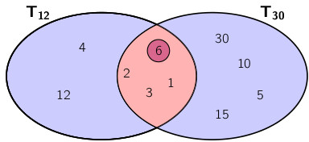

Aplūkojot visus divu skaitļu kopīgos dalītājus (vai dalāmos), izrādās, ka 
starp tiem vienmēr ir noteiktas sakarības, 
ko var ļoti kompakti aprakstīt, atrodot lielāko kopīgo dalītāju
(attiecīgi mazāko kopīgo dalāmo).

**Definīcija:** 
  Par veselu skaitļu :math:`m` un :math:`n`
  **lielāko kopīgo dalītāju (LKD)**
  (*greatest common divisor*, ko reizēm 
  pieraksta arī kā `gcd(m,n)`) sauc 
  lielāko naturālo skaitli, ar kuru dalās gan 
  :math:`m`, gan :math:`n`. To apzīmē ar :math:`\text{LKD}(m,n)`.  
  
*Piezīme:* 
  LKD var definēt arī vairāk nekā diviem 
  skaitļiem, bet tie nedrīkst visi reizē būt :math:`0`. 
  Pat ja :math:`m,n` ir negatīvi, :math:`\text{LKD}(m,n)` 
  vienmēr ir vesels pozitīvs jeb naturāls skaitlis.

**Piemēri:**

  .. math:: 
  
    \begin{array}{l}
    \text{LKD}(8,12)=4,\\
    \text{LKD}(21,34)=1,\\  
    \text{LKD}(0,-17)=17`.
    \end{array}

Savstarpēji pirmskaitļi
^^^^^^^^^^^^^^^^^^^^^^^^^

**Definīcija:** 
  Skaitļus :math:`m` un :math:`n` sauc 
  par **savstarpējiem pirmskaitļiem**
  (*mutual primes*, *co-primes*), ja 
  :math:`\text{LKD}(m,n)=1`. 

**Piemēri:** 

  1. Naturāli skaitļi :math:`n` un :math:`n+1` 
     vienmēr ir savstarpēji pirmskaitļi
     (piemēram, :math:`\text{LKD}(15,16)=1`.  
  2. Divi dažādi pirmskaitļi vienmēr ir arī 
     savstarpēji pirmskaitļi (piemēram, 
     :math:`\text{LKD}(13,17)=1`). 

LKD un citi kopīgie dalītāji
^^^^^^^^^^^^^^^^^^^^^^^^^^^^^^^^

**Apgalvojums:** 
  Ja :math:`a` un :math:`b` ir veseli 
  skaitļi, kas nav abi reizē vienādi ar :math:`0`, 
  tad to lielākais kopīgais 
  dalītājs :math:`d = \text{LKD}(a,b)` ir tāds, 
  ka jebkuram citam abu skaitļu kopīgam
  dalītājam :math:`d^{\ast}` (kur :math:`d^{\ast}|a` un 
  :math:`d^{\ast}|b`), šis :math:`d^{\ast}` būs arī 
  :math:`d` dalītājs.

Neformāli sakot, 
:math:`d = \text{LKD}(a,b)` ir nevis vienkārši 
lielākais skaitlis starp dažādiem :math:`a` un :math:`b`
kopīgajiem dalītājiem, bet tas ir visu šādu 
dalītāju režģa augšējais punkts. 

LKD, ja dots sadalījums pirmreizinātājos
^^^^^^^^^^^^^^^^^^^^^^^^^^^^^^^^^^^^^^^^^^^^^

:math:`\text{LKD}(m,n)` viegli atrast, ja :math:`m,n` 
sadalīti pirmreizinātājos. 

=======================  =============================  =============================  =============================  =============================  
Pirmreizinātājs          :math:`2`                      :math:`3`                      :math:`5`                      :math:`7`
:math:`300`              :math:`\textcolor{red}{2^2}`   :math:`\textcolor{blue}{3^1}`  :math:`\textcolor{red}{5^2}`   :math:`\textcolor{blue}{7^0}` 
:math:`300`              :math:`\textcolor{blue}{2^1}`  :math:`\textcolor{red}{3^2}`   :math:`\textcolor{blue}{5^1}`  :math:`\textcolor{red}{7^1}` 
=======================  =============================  =============================  =============================  =============================  

:math:`\text{LKD}(300,630) = \textcolor{blue}{2^1}\cdot \textcolor{blue}{3^1}\cdot\textcolor{blue}{5^1}\cdot\textcolor{blue}{7^0} = 30`. 

:math:`\text{LKD}(m,n)` satur tos pašus pirmreizinātājus, 
ko :math:`m` un :math:`n`, bet katra pirmreizinātāja pakāpe
ir minimums no pirmreizinātāja pakāpes skaitlī :math:`m`
un šī paša pirmreizinātāja pakāpes skaitlī :math:`n`.

Dažādas LKD īpašības
^^^^^^^^^^^^^^^^^^^^^

* Ja :math:`p` ir pirmskaitlis, tad :math:`\text{LKD}(p,m)` ir 
  :math:`p` vai :math:`1`. 
* Ja :math:`\text{LKD}(m,n) = d`, tad :math:`m/d` un :math:`n/d` ir
  savstarpēji pirmskaitļi. 
* Ja :math:`m/d^{\ast}` un :math:`n/d^{\ast}` abi ir veseli 
  un savstarpēji pirmskaitļi, tad :math:`\text{LKD}(m,n) = d^{\ast}`. 
* :math:`\text{LKD}(m,n) = \text{LKD}(m-n,n)`. LKD
  nemainās, ja no viena skaitļa atņem otru skaitli (vai 
  arī divkāršotu, trīskāršotu utt. otru skaitli).
* Ja :math:`m = nq + r`, tad 
  :math:`\text{LKD}(m,n) = \text{LKD}(r,n)` (skaitli :math:`m`
  var aizstāt ar tā atlikumu, dalot ar :math:`n`).

Kā praktiski atrast LKD?
^^^^^^^^^^^^^^^^^^^^^^^^^^

Varētu sadalīt pirmreizinātājos un atrast 
minimumus pa visām pirmskaitļu pakāpēm. 

**Piemērs:** 
  Ja :math:`m = 2^{10}3^85^9` un :math:`n = 2^{17}3^5`, tad 
  :math:`\text{LKD}(m,n) = 2^{10}3^5`. 

Faktiski ir ļoti grūti dalīt lielus skaitļus 
pirmreizinātājos. Piemēram,

.. math::

  \text{LKD}(73786976294838206463, 295147905179352825855) = ?

Eiklīda algoritms
^^^^^^^^^^^^^^^^^^^

.. code-block:: python

  def gcd(a, b):
      while b:
          a, b = b, a % b
      return a

**Pseidokods:**

| :math:`\text{\sc LielakaisKopigaisDalitajs}(a,b)`:
| 1. **while** :math:`b \neq 0`:
| 2. :math:`\;\;\;\;\;` :math:`(a,b)` ``:=`` :math:`(b, a\ \text{mod}\ b)`
| 3. **return** :math:`a`.

**Skaitlisks piemērs:**
  Atrast :math:`21` un :math:`30` lielāko kopīgo dalītāju. 

**Risinājums:** 
  .. math::

    \begin{array}{rcl}
    \text{LKD}(21,30) & = & \text{LKD}(30,21) = \\
    & = & \text{LKD}(21,9) = \\
    & = & \text{LKD}(9,3) = \\
    & = & \text{LKD}(3,0) = 3.\\
    \end{array}

* Eiklīda algoritmam nepieciešams, lai skaitļi :math:`a,b` būtu naturāli. 
* Lai atrastu :math:`\text{LKD}(a,b)`, kur :math:`a` vai :math:`b` ir negatīvi, 
  algoritmu izpilda absolūtajām vērtībām:  

.. math::

  \text{LKD}(a,b)=\text{LKD}\left( |a|,|b|\right).

**Uzdevums (BW.TST.2016.16):**
  Kāda ir izteiksmes

  .. math::

    \text{LKD}\left( n^2 + 3, (n+1)^2 + 3 \right)
  
  lielākā iespējamā vērtība naturāliem :math:`n`? 

**Risinājums:** 
  Lietojam Eiklīda algoritmu polinomiem no mainīgā :math:`n`: 

  .. math::

    \text{LKD}\left( n^2 + 3, (n+1)^2 + 3 \right) = \text{LKD}\left( n^2 + 3, n^2 + 2n + 4 \right) = 
  
  *no otrā argumenta atņem pirmo:*

  .. math::

    = \text{LKD}\left( n^2 + 3, 2n + 1 \right) = 

  *pirmo argumentu var piereizināt ar 2, jo otrais ir nepāru:*

  .. math::

     = \text{LKD}\left( 2n^2 + 6, 2n + 1 \right) = 

  *no pirmā argumenta atņem n-kāršotu otro:*

  .. math::

    = \text{LKD}\left( 2n^2 + 6 - n(2n+1), 2n + 1 \right) = \text{LKD}(6-n,2n+1) = 
   
  *otrajam argumentam pieskaita divkāršotu pirmo:*

  .. math::

    =\text{LKD}(6-n,2n+1 + 2(6-n)) = \text{LKD}(n-6,13).

  **Secinājums:** 
    :math:`\text{LKD}\left( n^2 + 3, (n+1)^2 + 3 \right) = \text{LKD}(n-6,13)` var būt vai nu :math:`1` vai :math:`13`. 

    Vērtību :math:`13` (vai kādu daudzkārtni) tas sasniedz, ja :math:`n-6` dalās ar :math:`13`, 
    piemēram, ja $n-6 = 0$ jeb $n=6$. 

  Pārbaude:
    Ievietojam :math:`n=6`:

    .. math::

      \text{LKD}\left( 6^2 + 3, (6+1)^2 + 3 \right) = \text{LKD}(39,52)=13.

MKD jēdziens
^^^^^^^^^^^^^^^^^

**Definīcija:** 
  Par veselu skaitļu 
  :math:`m` un :math:`n` **mazāko kopīgo dalāmo**
  (*least common multiple*, ko reizēm 
  pieraksta arī kā `lcm(m,n)`) sauc 
  mazāko naturālo skaitli, 
  kurš ir daudzkārtnis gan skaitlim :math:`m`, gan 
  skaitlim :math:`n`. To apzīmē ar 
  :math:`\text{MKD}(m,n)`.  
  
  *Piezīme:* 
    MKD definēts tikai tad, ja abi veselie skaitļi :math:`m,n \neq 0`. 

**MKD sadalījums pirmreizinātājos:**
  Arī :math:`\text{MKD}(m,n)` (līdzīgi kā :math:`\text{LKD}(m,n)`) 
  var tūlīt uzrakstīt, ja :math:`m,n` jau 
  sadalīti pirmreizinātājos:

=======================  =============================  =============================  =============================  =============================  
Pirmreizinātājs          :math:`2`                      :math:`3`                      :math:`5`                      :math:`7`
:math:`300`              :math:`\textcolor{red}{2^2}`   :math:`\textcolor{blue}{3^1}`  :math:`\textcolor{red}{5^2}`   :math:`\textcolor{blue}{7^0}` 
:math:`300`              :math:`\textcolor{blue}{2^1}`  :math:`\textcolor{red}{3^2}`   :math:`\textcolor{blue}{5^1}`  :math:`\textcolor{red}{7^1}` 
=======================  =============================  =============================  =============================  =============================  

:math:`\text{MKD}(300,630) = \textcolor{red}{2^2}\cdot \textcolor{red}{3^2}\cdot\textcolor{red}{5^2}\cdot\textcolor{red}{7^1} = 6300`. 

:math:`\text{MKD}(m,n)` satur tos pašus pirmreizinātājus, 
ko :math:`m` un :math:`n`, bet katra pirmreizinātāja pakāpe
ir maksimums no to pakāpēm skaitļos :math:`m` un :math:`n`.

LKD un MKD ir savstarpēji izsakāmi
^^^^^^^^^^^^^^^^^^^^^^^^^^^^^^^^^^^^

**Apgalvojums:**
  Tā kā :math:`\text{LKD}(a,b)` sareizina :math:`a` un :math:`b`
  pirmreizinātāju pakāpju minimumus, bet :math:`\text{MKD}(a,b)` - 
  maksimumus, tad 

  .. math::

    ab = \text{LKD}(a,b)\cdot\text{MKD}(a,b).

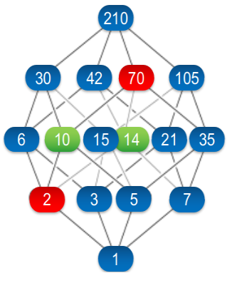

Zaļo un sarkano skaitļu reizinājumi sakrīt: 
:math:`2 \cdot 70 = 10 \cdot 14`.

* Dalāmības režģī LCD (skaitlis :math:`2` zīmējumā) 
  ir augstākā vieta, no kuras var nonākt gan skaitlī :math:`10`, 
  gan skaitlī :math:`14`. 
* MCD (skaitlis :math:`70`) ir zemākā vieta, kur satiekas augšupejošie
  ceļi no :math:`10` un :math:`14`. 

.. math::

  \text{MKD}(10,14) = \frac{10 \cdot 14}{\text{LCD}(10,14)}.

Dalāmības attiecības režģis un LKD, MKD
^^^^^^^^^^^^^^^^^^^^^^^^^^^^^^^^^^^^^^^^^

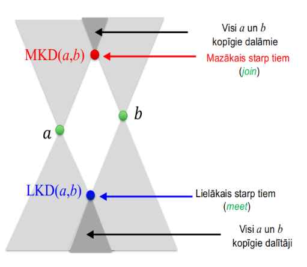

.. note:: 
  Vidusskolas aritmētikā bieži jānoskaidro gan LKD (lai noīsinātu daļskaitļus), 
  gan arī -- MKD (lai atrastu mazāko kopsaucēju). 
  Tomēr nereti skolu kursā koncentrējas vienīgi uz prasmi atrast šos 
  lielumus nelieliem skaitļiem, risinot aritmētikas piemērus, bet maz 
  pievēršas abu lielumu vispārīgajām īpašībām. 

**Teorēma:** 
  Naturāli skaitļi :math:`m` un :math:`n` abi ir 
  naturāla skaitļa :math:`a` dalītāji tad un tikai tad, ja 
  :math:`d = \text{MKD}(m,n)` ir skaitļa :math:`a` dalītājs. 

.. math::

  (\forall m,n,a \in \mathbb{N})\left( 
  (m \, \mid \, a) \& (n \,\mid\, a)\;\Leftrightarrow\;
  \text{MKD}(m,n)\,\mid\,a \right).
  
To lasa šādi: "Visiem naturā;iem :math:`m,n,a`, :math:`m` dala :math:`a` **UN**
:math:`n` dala :math:`a` tad un tikai tad (t.t.t.) ja 
:math:`\text{MKD}(m,n)` dala :math:`a`.

**Piemēri:** 
  Skaitlis :math:`a` dalās ar :math:`\textcolor{red}{7}`
  un :math:`\textcolor{red}{9}` t.t.t. 
  ja :math:`a` dalās ar :math:`\textcolor{red}{63}`.  
  Skaitlis :math:`a` dalās ar :math:`\textcolor{red}{4}` un :math:`\textcolor{red}{6}`
  t.t.t. ja :math:`a` dalās ar :math:`\textcolor{red}{12}`.

  Apzīmējums **t.t.t.** nozīmē 
  "tad un tikai tad" (:math:`\leftrightarrow`). Šajos gadījumos
  var secināt abos virzienos. (Sal. "Četrstūris ir
  paralelograms t.t.t. ja tā abas 
  diagonāles krustpunktā dalās uz pusēm.")

Tipisks piemērs
------------------

**Uzdevums (BW.TST.2018.14):**
  Par naturālu skaitļu virkni :math:`a_1,a_2,\ldots` zināms, 
  ka :math:`a_1 = 2` un visiem :math:`n>1` skaitlis :math:`a_{n+1}` ir 
  lielākais pirmskaitlis, ar ko dalās skaitlis 
  :math:`a_1\cdot{}a_2\cdot\ldots\cdot{}a_n+1`. 
  Pierādīt, ka neviens no šīs virknes locekļiem nav vienāds
  ne ar :math:`5`, ne ar :math:`11`. 

Uzdevums ir variācija par Eiklīda pazīstamo 
pierādījumu, ka pirmskaitļu ir bezgalīgi daudz: 
tiek konstruēta bezgalīga pirmskaitļu virkne :math:`a_1,a_2,\ldots`.  

Ievērojam, ka pirmskaitļi šajā virknē neatkārtojas.  
No pretējā: Ja pie :math:`m < n` izpildītos :math:`a_n = a_m`, tad 
:math:`a_n` būtu dalītājs gan skaitlim :math:`A_{n-1} = a_1a_2\cdots{}a_{n-1}`
(jo šajā garajā reizinājumā ietilpst :math:`a_m = a_n`), gan 
arī skaitlim :math:`A_{n-1}+1`.  
Tā ir pretruna, jo :math:`A_{n-1}` un :math:`A_{n-1} + 1` ir viens otram sekojoši - 
tātad ir savstarpēji pirmskaitļi. 

Lai gan virknē :math:`a_1,a_2,\ldots` ir bezgalīgi daudz pirmskaitļu 
(kā jau pamatoja Eiklīds), šī virkne tomēr nesatur **visus** pirmskaitļus. 
Piemēram, tā nesatur pirmskaitli :math:`5` (un arī :math:`11`). 

Pierakstām ar kvantoriem pierādāmo apgalvojumu par :math:`5`:

.. math::

  (\forall n \in \mathbb{N})(a_n \neq 5).
  
(Jebkuram naturālam :math:`n`, :math:`a_n \neq 5`.)

Ja gribam pierādīt no pretējā, tad pretējais apgalvojums (kas izrādīsies aplams): 

.. math::

  (\exists n \in \mathbb{N})(a_n = 5).
  
(Eksistē tāds naturāls :math:`n`, ka :math:`a_n = 5`.)

Mūsu metode ir nepilnā indukcija -- vienkārši izrakstām 
dažus virknes locekļus un meklējam likumsakarības.

.. math::

  a_1 = 2,\; a_2 = 3,\; a_3 = 7,\;a_4 = 43,\;a_5 = 139,\ldots
  
jo :math:`a_1a_2a_3a_4 + 1 = 1807 = 139 \cdot 13`. 

Pieņemsim no pretējā, ka eksistē virknes loceklis :math:`a_n`, kurš 
vienāds ar :math:`5`. 

Apzīmējam :math:`A_n = a_1\cdot{}a_2\cdot\ldots\cdot{}a_n+1`.   
Tas nedalās ar :math:`2` vai :math:`3` (jo dod atlikumu :math:`1`). 
:math:`A_n` nevar dalīties ar pirmskaitļiem, kas lielāki par :math:`5`, 
jo katrā solī par :math:`a_{n+1}` izvēlamies lielāko :math:`A_n` dalītāju.

Tātad, lai virknē :math:`(a_n)` būtu skaitlis :math:`5`, jāizpildās

.. math::

  A_n = a_1a_2\cdots{}a_n + 1 = 5^m.

**Apgalvojums:** 
  Skaitlis :math:`5^n` katram :math:`n` dod atlikumu :math:`1`, 
  dalot ar :math:`4`. 

**Pierādījums:** 
  Reizinot divus vai vairāk skaitļus, 
  kuri dod atlikumu :math:`1`, dalot ar :math:`5`, rodas rezultāts, 
  kurš arī dod atlikumu :math:`1`, dalot ar :math:`5`. :math:`\blacksquare`

Pēc mūsu pieņēmuma, eksistē :math:`A_n = 5^m`. Tas dod atlikumu :math:`1`, 
dalot ar :math:`4` jeb 

.. math::

  A_n - 1 = a_1a_2\cdots{}a_n

dalās ar :math:`4`. 

Tas nav iespējams, jo :math:`a_1 = 2`, bet visi citi :math:`a_i` ir 
pirmskaitļi (tātad nepāru skaitļi). :math:`\blacksquare`

**Apgalvojums:** 
  Virknē :math:`a_n` nav locekļa, kas vienāds ar :math:`11`. 

**Ieteikums:** 
  Līdzīgi kā iepriekš - var pamatot, ka rodas
  pretruna no pieņēmuma, ka :math:`A_n = 5^k\cdot{}11^{\ell}`. 

Vispirms parāda, ka :math:`\ell = 2\ell_1 + 1` ir nepāru skaitlis.  
Tad parāda, ka var izteikt arī :math:`k = 2k_1+1` un arī :math:`k` ir nepāru.  
Visbeidzot var parādīt, ka neviens skaitlis formā

.. math::

  55 \cdot 5^{2k_1} \cdot 11^{2\ell_1} = 55 \cdot 25^{k_1} \cdot 121^{\ell_1} 

nevar dot atlikumu :math:`1`, dalot ar :math:`7`.

No otras puses, :math:`A_n = a_1a_2a_3\cdots{}a_n+1` noteikti dod atlikumu 
:math:`1`, dalot ar :math:`7`, jo :math:`a_3 = 7`. Iegūta pretruna.

Sacensību uzdevumi
----------------------

**1.Uzdevums**
  Dota kopa :math:`S = \{ 105,106,\ldots,210 \}`. Noteikt mazāko 
  naturālo :math:`n` vērtību, ka, izvēloties jebkuru :math:`n` skaitļu 
  apakškopu :math:`T` no kopas :math:`S`, tajā būs vismaz divi skaitļi, kuri nav 
  savstarpēji pirmskaitļi.

**Ieteikumi:** 
  
  * Kurā kopā meklējam skaitļus, kuri nav savstarpēji pirmskaitļi? 
  * Kas notiek, ja izraudzītā kopa satur ļoti nedaudzus skaitļus 
    (divus, trīs, četrus)? Ja tā satur gandrīz visus kopas :math:`S` elementus?
  * Ja :math:`n` ir mazākā vērtība, kas apmierina uzdevuma nosacījumu, 
    ko var apgalvot par vēl mazāku skaitli: :math:`n-1`? Kādu īpašību tas apmierina?

  Monotonas funkcijas starp divām vērtībām. 
  Līdz kādai vietai eksistēs arvien lielākas kopas, kurās savstarpēju pirmskaitļu nav.  
  Sākot ar noteiktu mazāko :math:`n` (kurš uzdevumā jāatrod) - 
  savstarpēji pirmskaitļi būs neatkarīgi no :math:`T` izvēles, 
  ja vien :math:`|T|=n`.

**2.Uzdevums**
  Visiem veseliem pozitīviem skaitļiem :math:`m > n` pierādīt, ka 

  .. math::

    \mbox{MKD}(m,n) + \mbox{MKD}(m+1,n+1) > \frac{2mn}{\sqrt{m-n}}.

**Ieteikumi:**
  
  * Vai prasība :math:`m > n` ir būtiska? Vai bez tās šāda veida nevienādība pārstāj
    būt spēkā?
  * Kas notiek robežgadījumos: Ja viens no skaitļiem ir :math:`1`? Ja :math:`n, m` 
    un arī :math:`m+1,n+1` ir savstarpēji pirmskaitļi? Ja :math:`m = 2n`?
  * Kuras nevienādības mums atgādina nevienādība ar kvadrātsakni?
 
  Sākam zīmēt :math:`\text{MKD}(m,n)` tabuliņā (:math:`m` ass pa labi, :math:`n` ass uz leju).  
  Mums interesē divu MKD summa pa diagonāli. 
  Var tai vietā skatīties 

  .. math::

    \mbox{MKD}(m,n) + \mbox{MKD}(m,n+1),\;\mbox{ja $m >> n$}.

**3.Uzdevums**
  Vai eksistē bezgalīga 
  stingri augoša naturālu skaitļu virkne :math:`a_1 < a_2 < a_3 <\ldots`, 
  ka jebkuram fiksētam naturālam skaitlim :math:`a` virknē :math:`a_1+a < a_2+a < a_3 + a,\ldots` 
  ir tikai galīgs skaits pirmskaitļu? 

**Ieteikumi:**
  Attēlot neregulāru virkni, kuru nobīda pa :math:`a` (kur :math:`a` pieņem dažādas
  vērtības).  
  Izskaidrot vārdkopu "ne vairāk kā galīgs skaits" - drīkst būt arī :math:`0` pirmskaitļu. 

  * Vai eksistē bezgalīgi gari gabali bez pirmskaitļiem? 
  * Vai faktoriālu var lietot tīrā veidā? 

**4.Uzdevums**
  Pierādīt, ka virkne :math:`1,11,111,\ldots` satur bezgalīgu apakšvirkni, 
  kuras katri divi locekļi ir savstarpēji pirmskaitļi.

.. only:: Internal

  **Atbilde:**
  
    Skaitļi, ko pieraksta ar daudziem vieniniekiem: 
    Virkne :math:`1,11,111,\ldots` jebkuram skaitlim :math:`a` (kurš nedalās 
    ar :math:`3`) ļauj atrast īsāko periodu, ja :math:`1/a` pieraksta
    kā bezgalīgu decimāldaļu. 

    Piemēram, :math:`111111` dalās ar :math:`7`. Tātad :math:`1/7` būs :math:`6`-ciparu periods.

    .. math::

      1/7 = 0.(142857) = 0.142857142857142857\ldots.

    :math:`111\ldots{}111` (tieši :math:`40` vieninieki) dalās ar :math:`41`. 
    (Tas izriet no Mazās Fermā teorēmas, ko skatīsimies nākamreiz.)  
    Bet jau :math:`11111` dalās ar :math:`41`. Tātad :math:`1/41` decimālpierakstā ir 
    daudz īsāks - :math:`5`-ciparu periodds. 

    .. math::

      1/41 = 0.(02439) = 0.024390243902439\ldots.

  :math:`\square`

Norādes
-------------

1. T.Andreescu, D.Andrica, Z.Feng. 104 Number Theory Problems. Birkhäuser. 

Lai attīstītu intuīciju par dalāmību, var pievienot attēlus vai animācijas par sekojošo: 

  1. Ūdens laistīšanas uzdevums un/vai "atstarošanās uzdevums" (kā ar 8L un 13L krūzēm nomērīt tieši 1L).
  2. Skapīšu durvju vai slēdžu pārslēgšanas animācija (sk. NT.JUN01.1).
  3. Eratostena režģa animācija.
  4. Eiklīda algoritma animācija jebkādiem skaitļiem.
  5. Tipiska un vissliktākā Eiklīda algoritma ātrdarbība, rekursīvo izsaukumu skaits šajā algoritmā.
  6. Dalītāju režģis 3 vai 4 dimensijās - kā lielam skaitlim, piemēram, formā :math:`p^aq^br^c`
     pamazām (augošā secībā) atklājas visu tā dalītāju kopums.

