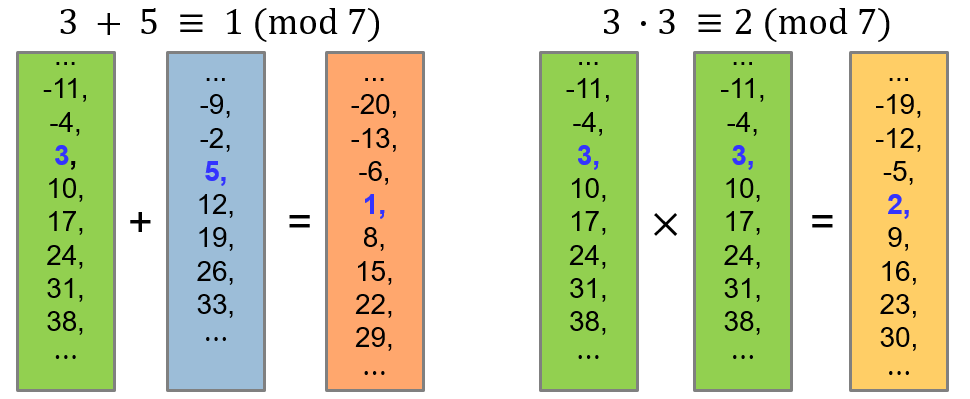
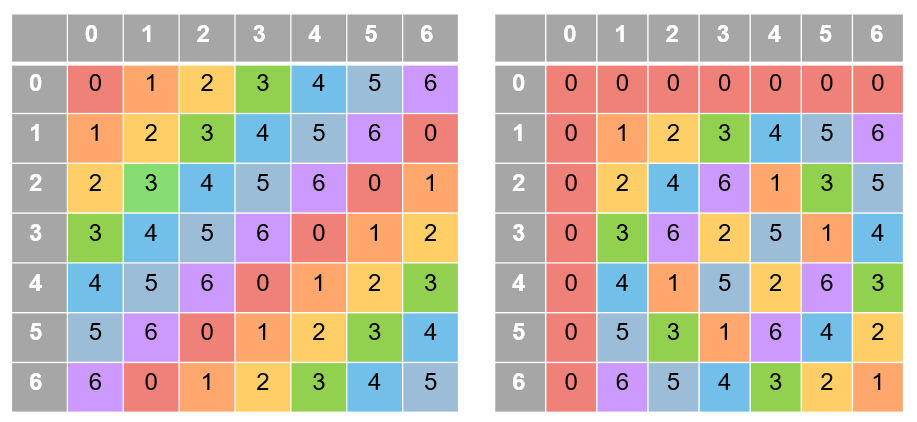
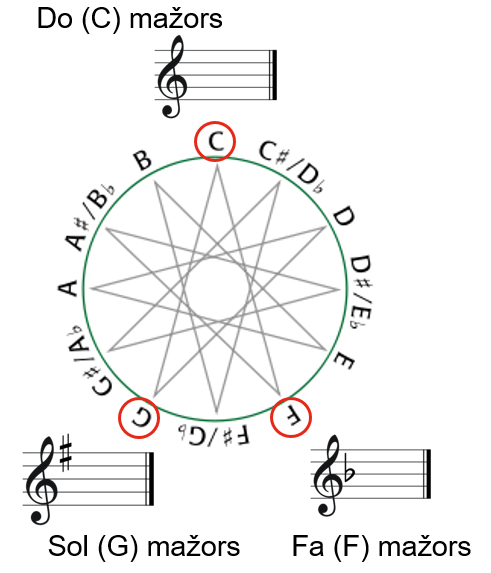
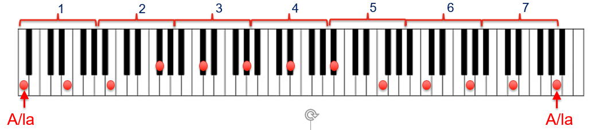

NMS Skaitļu teorija #2: Modulārā aritmētika
=================================================

Skaitļu teorijā daudzi rezultāti ir iegūstami galīgās atlikumu kopās. 
Tie izmanto kombinatoriskas metodes, jo bezgalīgi daudzo skaitļu vietā 
šķiro gadījumus. Piemēram, aplūkojot atlikumus, dalot ar :math:`2`, iegūstam 
divus gadījumus -- pāra skaitlis un nepāra skaitlis, kur rezultāta paritātei
vairs nevajag zināt pašu skaitli, bet tikai atlikumu.

Šādas idejas iespējams vispārināt arī atlikumiem, dalot ar lielākiem skaitļiem. 
Skaitļu teorijas algoritmus, kas uz skaitļiem raugās \"ar atlikumu brillēm\"
sauc par *modulāro aritmētiku*. Šajā nodaļā aplūkosim sekojošas tēmas:

* Kongruenču klases, modulārā aritmētika. 
* Dalāmības pazīmes ar :math:`3,9,2^k,5^k` kongruenču klašu atrašanai. 
* Mazā Fermā teorēma. Periodiskas decimāldaļas.
* Eilera funkcija un Eilera teorēma.
* Cikliski procesi . Periodiskas atlikumu virknes. 
* Periodi un priekšperiodi virknēs.

Ievaduzdevums
---------------

**Uzdevums (Valsts4Posms-2012.P1):** 
  Ar :math:`S(x)` apzīmēsim skaitļa :math:`x` ciparu summu. 
  Aprēķināt :math:`S(S(S(2012^{2012})))`.

**Risinājuma plāns:** 
  Skaitlis :math:`2012^{2012}` ir ļoti liels; aprēķināt visus šos ciparus ir 
  praktiski neiespējami. Toties skaitļa ciparu summa apmierina svarīgu invariantu 
  (atlikums, dalot ar :math:`9` saglabājas. 
  Risinājuma pirmajā daļā meklēsim vienīgi skaitļu :math:`S(S(S(2012^{2012})))`, 
  :math:`S(S(2012^{2012}))`, :math:`S(2012^{2012})` un :math:`2012^{2012}` atlikumu, 
  dalot ar :math:`9` (visiem tiem jābūt vienādiem). 
  Risinājuma otrajā daļā noskaidrosim, kurš no skaitļiem ar atrasto atlikumu 
  ir konkrēti :math:`S(S(S(2012^{2012})))` (novērtējot to ar nevienādībām). 

**Apgalvojums 1:**
  Ja :math:`n` ir naturāls skaitlis, tad tā ciparu summa :math:`S(n)`
  un pats skaitlis :math:`n` dod vienādus atlikumus, dalot ar :math:`9`. 
  (Šis apgalvojums pazīstams kā vispārināta dalāmības pazīme ar :math:`9`.) 
  
**Pierādījums:** 
  Skaitlis :math:`n = \overline{c_1c_2\ldots{}c_{k-1}c_k}`, kur :math:`c_i` ir decimālcipari, 
  ir pierakstāms kā polinoms, kur mainīgā vietā ir decimālsistēmas bāze :math:`x = 10`: 
  
  .. math:: 
  
    n = c_1 \cdot 10^{k-1} + c_2 \cdot 10^{k-2} + \ldots + c_{k-1} \cdot 10^{1} + c_k \cdot 10^{0}). 
    
  Ja aprēķinām ciparu summu :math:`S(n) = c_1 + c_2 + \ldots + c_{k-1} + c_k`, 
  tad tā atšķiras no :math:`n` ar to, ka saskaitāmo :math:`c_i \cdot 10^{k-i}` vietā 
  ir saskaitāmie :math:`c_i`. (Piemēram, ja ceturtais cipars no skaitļa beigām jeb *tūkstošu cipars* 
  ir :math:`c_{k-3} = 7`, tad vērtības :math:`7 \cdot 1000` vietā pieskaitām vienkārši vērtību :math:`7`.)
  
  Starpība abām vērtībām ir :math:`c_i \cdot 10^{k-i} - c_i = c_i \cdot \overline{99\ldots99}`, kur
  cipars :math:`c_i` ir pareizināts ar skaitli kas sastāv no daudziem deviņniekiem. 
  Šis skaitlis, acīmredzot dalās ar :math:`9`. Tāpēc atlikums, dalot ar :math:`9` (ja 
  skaitli :math:`n` aizstāj ar :math:`S(n)` jeb katru ciparu :math:`c_i` piesummē vienkārši, 
  nevis reizina ar :math:`10` pakāpi :math:`c_i \cdot 10^{k-i}`) nemainās. :math:`\square`

  
**Apgalvojums 2:** 
  Pamatosim, ka :math:`2012^{2012}` dod atlikumu :math:`7`, dalot ar :math:`9`. 
  

**Pierādījums:** 
  Aplūkojot pakāpju :math:`a^b` atlikumus, dalot ar :math:`9`, 
  ievērojam, ka tie atkarīgi vienīgi
  no :math:`a` atlikuma, dalot ar :math:`9`, jo reizinot (un kāpinot)
  skaitļus ar vienādiem atlikumiem, arī rezultāti dos vienādus atlikumus. 
  Tātad :math:`a^b` atlikumi dalīšanā ar :math:`9`
  atkārtojas ar ciklu :math:`9`, ja pakāpes bāze :math:`a` aug.
  Izsakām :math:`(2012)^{2012} = (223 \cdot 9 + 5)^{2012}`. 
  Tātad jāmeklē atlikums, dalot :math:`5^{2012}` ar :math:`9`. 
  
  Otrs novērojums -- pakāpju :math:`a^b` atlikumi, dalot ar :math:`9`, 
  cikliski atkārtojas ik pēc :math:`6`, ja kāpinātājs :math:`b` aug.
  
  ================   ================   =====================
  :math:`n`          :math:`5^n`        Atlikums, dalot ar 9
  :math:`5^0`        :math:`1`          :math:`1`
  :math:`5^1`        :math:`5`          :math:`5`
  :math:`5^2`        :math:`25`         :math:`7`
  :math:`5^3`        :math:`125`        :math:`8`
  :math:`5^4`        :math:`625`        :math:`4`
  :math:`5^5`        :math:`3125`       :math:`2`
  :math:`5^6`        :math:`15625`      :math:`1`
  ================   ================   =====================

  Vēl lielākām pakāpēm atlikumi, dalot ar :math:`9` labajā kolonnā sāk atkārtoties: :math:`5^7` dod tādu pašu atlikumu kā :math:`5^1`, 
  :math:`5^8` dod tādu pašu atlikumu kā :math:`5^2`, utt. 
  Arī šīs tabulas aizpildīšanai var godīgi nekāpināt. Ja, teiksim, :math:`5^2 = 25` dod atlikumu :math:`7`, dalot ar :math:`9`, 
  tad nākamā atlikuma iegūšanai pietiek ar :math:`5` pareizināt nevis visu :math:`25`, bet gan tikai šo atlikumu :math:`7` -- rezultāts
  jeb atlikums skaitlim :math:`35` būs tas pats, kas atlikums skaitlim :math:`125`. 
  
  Tā kā :math:`5^6` dod atlikumu :math:`1`, dalot ar :math:`9`, 
  tad arī :math:`(5^6)^{335} = 5^{2010}` dod atlikumu :math:`1`. 

  Visbeidzot, :math:`5^{2012} = 5^{2010} \cdot 5^2 = 1 \cdot 25`, kas dod atlikumu :math:`7`, dalot ar :math:`9`.  
  :math:`\square`
  

**Secinājums:**
  Arī skaitlis :math:`S(S(S(2012^{2012})))` dod atlikumu :math:`7`, dalot ar :math:`9`. 
  :math:`\square`. (Apvienojam Apgalvojumu 1 un Apgalvojumu 2.) 

**Apgalvojums 3:** 
  :math:`S(S(S(2012^{2012}))) = 7`. 
  
**Pierādījums:** 
  Mums jāpārbauda, vai :math:`S(S(S(2012^{2012})))` nevar būt vienāds ar kādu citu skaitli, kas arī 
  dod atlikumu :math:`7`, dalot ar :math:`9`. Mazākais šāds skaitlis ir :math:`7+9 = 16`. 
  Pamatosim nevienādības: 
  
  .. math::
  
    \begin{array}{rl}
    (1) & S(S(S(2012^{2012}))) < 16,\\
    (2) & S(S(2012^{2012})) < 79,\\
    (3) & S(2012^{2012}) < 799999999.\\
    \end{array}

  Skaitlis :math:`79` ir mazākais, kurš dod atlikumu :math:`7` dalot ar :math:`9`, bet kura ciparu summa ir :math:`16`. 
  Skaitlis :math:`799999999` ir mazākais, kurš dod atlikumu :math:`7` dalot ar :math:`9`, bet kura ciparu summa ir :math:`79`. 
  Tāpēc :math:`(3) \rightarrow (2) \rightarrow (1)`. 
  
  Pierādīsim pašu pēdējo no minētajām nevienādībām, novērtējot pašu skaitli :math:`2012^{2012}`.
  
  .. math::
  
    2012^{2012} < 2100^{2100} = ((2.1)^3)^{700} \cdot (1000)^{2100} = (9.261)^{700} \cdot (1000)^{2100} < 10^{700} \cdot 10^{6300} = 10^{7000}.
    
  Iegūstam, ka skaitļa :math:`2012^{2012}` decimālpierakstā ir ne vairāk kā :math:`7000` cipari. 
  Pat ja tie visi būtu deviņnieki, tad to summa nepārsniedz :math:`63000`, kas ir mazāk nekā :math:`799999999`. 
  Tātad nevienādība (3) ir pierādīta (un tātad arī nevienādības (2) un (1)). :math:`\square`
    

Var pārbaudīt iegūto rezultātu (skaitli :math:`7`) ar aprēķinu valodā Python: 

.. code-block:: python

  def S(num):
      return sum(int(digit) for digit in str(num))

  S(S(S(2012**2012)))

  

Kongruenču klases
--------------------

Viena mēneša ietvaros var ievērot, ka datumi :math:`1,8,15,22,29` nonāk tanī pašā nedēļas dienā -- 
tādā ziņā tie ir ekvivalenti. Tāpat arī
datumi :math:`2,9,16,23,30` visi nonāk (citā) nedēļas dienā utml. 
Vispārīgāk -- visus veselos skaitļus (arī tos, kuri nevar būt kalendāra datumi) var 
sadalīt :math:`7` ekvivalences klasēs. 

**Apgalvojums:** 
  Dots naturāls skaitlis :math:`m`. 
  Tad katru veselu skaitli :math:`n` var vienā vienīgā veidā izteikt :math:`n = qm + r`, 
  kur :math:`q \in \mathbb{Z}`, bet :math:`r \in \{ 0, \ldots, m-1 \}`. 
  Šajā izteiksmē :math:`q` ir (veselo skaitļu dalīšanas) dalījums, bet 
  :math:`r \in \{ 0, 1, \ldots, m-1 \}` ir *atlikums*. 
  
**Definīcija:** 
  Ja divi veseli skaitļi :math:`n_1, n_2 \in \mathbb{Z}` dod vienādus atlikumus, dalot ar :math:`m`, 
  tad sauksim tos par *kongruentiem* pēc :math:`m` moduļa. Pieraksts: :math:`n_1 \equiv n_2 \pmod {m}`. 

**Piemērs:** 
  Kongruence pēc moduļa :math:`7` sadala visus veselos skaitļus :math:`n = 7` klasēs. 
  Katrā klasē ietilpst skaitļi, kas dod vienādus atlikumus pēc moduļa :math:`7`. Katru šādu klasi var aprakstīt šādi:

  .. math::
  
    \big\{ qk + r \,\mid\, q \in \mathbb{Z},\, r \in \{ 0,1,\ldots,6 \} \big\}.

.. image:: figs-ntjun02-modular-arithmetic/z7-congruence-classes.png
   :width: 3.5in 
   

**Definīcija:** 
  Dots vesels skaitlis :math:`m > 1`.
  Ar :math:`\mathbb{Z}_m` apzīmēsim skaitļu kopu ar :math:`m` elementiem
  :math:`\mathbb{Z}_m = \{ 0,1,2,\ldots,m-1\}`, kurā var veikt 
  saskaitīšanas, atņemšanas, reizināšanas un kāpināšanas darbības, kuru 
  rezultāti ir atlikumi, dalot ar :math:`m`.   

**Piemērs:** 
  :math:`a + b` šajā kopā dod rezultātu :math:`c`, ja :math:`c = (a + b)\,\text{mod}\,m`, kas
  ir atlikums, dalot :math:`(a+b)` ar :math:`m`.
  
**Apgalvojums:** 
  Veicot aritmētiskas darbības kopā :math:`\mathbb{Z}_m`, skaitļu :math:`a,b \in \mathbb{Z}_m`
  vietā var izvēlēties jebkurus veselus skaitļus :math:`a'` un :math:`b'`, 
  kuri dod atlikumus attiecīgi :math:`a` un :math:`b`, dalot ar :math:`m`. 
  
Šis apgalvojums ir spēkā, jo saskaitīšanas, atņemšanas un reizināšanas darbību atlikumu, dalot ar :math:`m`,
nosaka vienīgi operandu atlikumi, dalot ar :math:`m`. 
Šajā zīmējumā parādīts, kā var saskaitīt un sareizināt kopā :math:`\mathbb{Z}_7`. 
Saskaitāmo un reizinātāju :math:`3` un :math:`5` vietā var izvēlēties jebkuru 
pārstāvi no attiecīgās kongruenču klases. 

Citiem vārdiem, modulārā aritmētika kongruences klašu kopā :math:`\mathbb{Z}_7` izkrāso visus skaitļus
:math:`7` krāsās. Un balstās uz faktu, ka saskaitot divus skaitļus ar noteiktu krāsu, rezultāta krāsa
arī būs viennozīmīgi noteikta.
  

   

   
   Saskaitīšanas un reizināšanas tabulas :math:`7` kongruenču klasēm no :math:`\mathbb{Z}_7`.

Paritāte
^^^^^^^^^^

Apakšgadījums kongruencēm pēc moduļa ir *paritāte*, kas visus veselos skaitļus iedala pāra 
skaitļos (:math:`\equiv 0 \pmod 2`) un nepāra skaitļos (:math:`\equiv 1 \pmod 2`).

.. code-block::

  p + p = p         p * p = p
  p + n = n         p * n = p
  n + p = n         n * p = p
  n + n = p         n * n = n
  

Šajos apzīmējumos :math:`\mathtt{p} = [0]_2` and :math:`\mathtt{n} = [1]_2` ir
abas ekvivalences klases pēc :math:`2` moduļa.

  

Lietojums mūzikas teorijā
^^^^^^^^^^^^^^^^^^^^^^^^^^^

Modulāro aritmētiku var viegli iztēloties kā aritmētiku uz pulksteņa 
ciparnīcas. Piemēram, :math:`14 \equiv 2 \pmod {12}` (pulksten ``2:00`` 
un ``14:00`` uz ciparnīcas izskatās vienādi). 
Savukārt, pieskaitot :math:`9` pie :math:`22` (pēc :math:`12` moduļa) 
iegūstam 7, jo :math:`22 + 9 \equiv 7 \pmod {12}`. 
Ja kopš laika momenta ``22:00`` paiet :math:`9` stundas, tad parasti saka, ka 
pulkstenis ir ``7:00``, nevis ``31:00``. Kaut arī ``31:00`` pauž to pašu
informāciju. 

   
   "Kvintu aplis" zvaigznītes formā savieno "radniecīgus" nošu augstumus.

Līdzīgi \"pulksteņa ciparnīcas aritmētikai\" ir arī riņķošana pa nošu augstumiem,  
pārejot no vienas toņkārtas uz citu.
Zīmējumā dots mūzikas teorijā pazīstamais *kvintu aplis*. Apļa augšā atrodas skaņa DO (jeb C), 
kuras mažora gammā nav nevienas alterācijas zīmes (diēza vai bemola). Pārlecot par kvintu 
(jeb :math:`7` pustoņiem) uz priekšu, nonākam pie SOL (jeb G), kuras mažora gammā ir viens diēzs. 
Pēc sešiem pārlēcieniem par kvintu būsim nonākuši līdz FA diēzam (vienu pustoni uz augšu, salīdzinot ar C).
Virzoties pretējā virzienā, gammai nāk klāt pa vienam bemolam. 
Pašu FA diēza mažoru var uzrakstīt divos veidos -- vai nu kā FA diēza mažoru (kur sešas skaņas gammā ir paaugstinātas), 
vai arī kā SOL bemol minoru (kur sešas skaņas gammā ir pazeminātas).

   
   Kvintu aplis uz klavierēm, aptver :math:`7` oktāvas.

Kvintu aplis faktiski ir aritmētiska progresija ar diferenci :math:`7` pustoņi 
pēc moduļa :math:`12`. Šajā progresijā apzīmējam skaņas augstumu A(la) ar :math:`9`, jo tas ir 
:math:`9` pustoņus augstāk par C(do). Pēc divpadsmit soļiem virkne atgriežas sākumpunktā.

.. math::

  \textcolor{red}{9},\, 4,\, 11,\, 6,\, 1,\, 8,\, 3,\, 10,\, 5,\, 0,\, 7,\, 2,\, \textcolor{red}{9}\, \pmod {12}

Mūzikā skaitlim :math:`12` ir īpaša loma, jo oktāvu dala divpadsmit pustoņos. 
Savukārt skaitļu teorijas lietojumos modulārā aritmētika pēc :math:`12` moduļa
ir iespējama, bet bieži vien neērta, jo skaitļi, 
kuriem ir kopīgi dalītāji ar :math:`12` (pāru skaitļi, 
:math:`3` un :math:`9`) pēc šī moduļa uzvedas atšķirīgi no citiem skaitļiem. 
Minēto iemeslu dēļ matemātikā populārākā modulārā aritmētika ir :math:`\pmod p`, 
kur :math:`p` ir jebkurš pirmskaitlis. Dažos gadījumos arī :math:`\pmod {p^k}` -- 
kongruences pēc pirmskaitļu pakāpju moduļiem. 

Kongruenču īpašības
--------------------

**Apgalvojums:** 
  Saskaitīšanas, atņemšanas un reizināšanas izteiksmēs veseliem skaitļiem 
  rezultāta pēdējo ciparu nosaka izteiksmē ietilpstošo skaitļu pēdējie cipari.
  
**Piemērs:** 
  Ar kādu ciparu beidzas :math:`2022^{2022}``? 
  
**Risinājums:**
  Saskaņā ar apgalvojumu, pietiek atrast izteiksmes :math:`2^{2022}` pēdējo ciparu. 
  Izrakstot skaitļa :math:`2` pakāpes (:math:`1,2,4,8,16,32,64,\ldots`) secinām, 
  ka pakāpe vienmēr beidzas ar ciparu :math:`4` tad, ja kāpinātājs dod atlikumu 
  :math:`2`, dalot ar :math:`4`. (Piemēram, :math:`2^2 = 4`, :math:`2^6 = 64`, utt.)
  Tāpēc arī :math:`2^{2022}` beigsies ar ciparu :math:`4`. 

Modulārā kāpināšana
^^^^^^^^^^^^^^^^^^^^

Ja pakāpes bāze :math:`a` un kāpinātājs :math:`k` ir nelieli skaitļi 
tad pakāpes :math:`a^k` atlikumu dalot ar nelielu skaitli :math:`m`, aprēķinus bieži 
var veikt uz papīra -- pat ja skaitlis :math:`a^k` ir tik liels, lai 
to tieši izrēķināt nevarētu. 

**Piemērs 1:** 
  Atrast atlikumu, dalot :math:`2^{1000}` ar :math:`17`. 
  
**Risinājums:** 
  Ievērojam, ka :math:`2^4=16 \equiv -1 \pmod {17}`. 
  Tad :math:`2^{1000} = (2^4)^{250}  \equiv (-1)^{250} \equiv 1 \pmod {17}`. 

**Piemērs 2:** 
  Atrast atlikumu, dalot :math:`10^6=1000000` ar 7.
  
**Risinājums:**
  Pārveidojam šo pakāpi:
  
  .. math::
  
    10 \cdot 10 \cdot 10 \cdot 10 \cdot 10 \cdot 10 \equiv (3 \cdot 3) \cdot (3 \cdot 3) \cdot (3 \cdot 3) \equiv 2 \cdot 2 \cdot 2 \equiv 1 \pmod {7}.
    

**Piemērs 3:**
   Atrast atlikumu, dalot :math:`8^{1834}` ar :math:`7`.

**Piemērs 4:** 
  Atrast atlikumu, dalot :math:`6^{2022}` ar :math:`7`.

**Piemērs 5:** 
  Zināms, ka skaitlis :math:`1001` dalās ar :math:`13`. 
  Atrast atlikumu, dalot :math:`10^{100}` ar :math:`13`.

Visos šajos piemēros pakāpes var pārveidot, izmantojot kāpināšanas identitātes, 
izrēķināt dažas apakšizteiksmes, aizstāt lielākus skaitļus ar kongruentiem, bet mazākiem skaitļiem.

Augstāk aprakstītās metodes noder, risinot nelielus piemērus uz papīra. 
Tomēr izrādās, ka arī visai lieliem skaitļiem kāpināšanu pēc moduļa var veikt efektīvi uz datora --
un nepieciešamais darbību skaits ir nesalīdzināmi mazāks par to, kas būtu 
aprēķinot pašu pakāpi (nevis tās atlikumu) un arī nesalīdzināmi mazāks par to, kāds būtu, ja 
ar "godīgu ciklu" veiktu kāpināšanu -- pat ar modulāro aritmētiku. 

**Piemērs 6:** 
  Aprēķināt :math:`51188956640349341003^{48037453520941872361}` pēc moduļa 
  :math:`15522299127691416427`.
  
  
.. code-block:: python

  >>> a = 51188956640349341003
  >>> k = 48037453520941872361
  >>> m = 15522299127691416427
  >>> pow(a,k,m)
  1288083363532019064
  >>> bin(k)
  '0b101001101010100111010100010111011011000110000100111111010011101001'
  

Rezultātu :math:`1288083363532019064` Python programma izrēķina acumirklī -- tur nenotiek reizināšana 
:math:`k=48037453520941872361` reizes (pat pēc :math:`m` moduļa).
Tai vietā kāpinātāju :math:`k` pieraksta bināri - izsaka kā divnieka pakāpju summu; 
pēc tam skaitli :math:`a` atkārtoti kāpina kvadrātā, iegūstot :math:`a^0, a^1, a^2, a^4, a^8, a^{16},\ldots`. 
Un pēc tam sareizina tās pakāpes, kuras nepieciešamas, lai saliktu skaitli :math:`k`. 

Ja, piemēram, :math:`k` binārajā pierakstā ir :math:`66` cipari (un :math:`35` no tiem ir vieninieki), 
tad šādai kāpināšanai :math:`a^k \pmod{m}` vajag veikt tikai :math:`66 - 1 + 35 = 100` reizināšanas pēc moduļa :math:`m`. 
Ievērosim, ka :math:`100` reizināšanas darbības (pēc :math:`m` moduļa) 
ir liels uzlabojums, salīdzinot ar :math:`\approx 48 \cdot 10^{18}` jeb :math:`48` 
kvintiljoniem reizināšanas darbību, kas prasītu ievērojamu laiku arī uz ļoti ātra datora.
  

Mazā Fermā teorēma
---------------------

Pretrunas moduļa metode
-------------------------

Eilera teorēma
------------------

Ja :math:`n` nav pirmskaitlis, tad arī iespējama
Mazajai Fermā teorēmai līdzīga analīze, ko drīz aplūkosim. 
Vispirms definējam jaunu funkciju. 

**Definīcija:**
  Funkciju :math:`\varphi(n)` no naturāliem skaitļiem uz naturālām vērtībām 
  saucam par *Eilera funkciju*, 
  ja tā saskaita, cik ir tādu naturālu skaitļu :math:`j` 
  intervālā :math:`[1;n]`, kas ir savstarpēji pirmskaitļi ar :math:`n`. 

Ja zināms skaitļa sadalījums pirmreizinātājos, Eilera funkcijas aprēķināšana
ir vienkārša.

**Apgalvojums:** 
  Ja :math:`n = p_1^{k_1}p_2^{k_2} \cdots p_m^{k_m}` 
  ir skaitļa :math:`n` sadalījums pirmskaitļa pakāpju reizinājumā 
  (sadalījums pirmreizinātājos), tad 
  Eilera funkcija: 
  
  .. math:: 
  
    \varphi(n) = n\left( 1 - \frac{1}{p_1} \right)\left( 1 - \frac{1}{p_2} \right) \cdots \left( 1 - \frac{1}{p_m} \right). 
    
Šo apgalvojumu pamatosim nodaļā *Multiplikatīvas funkcijas*. 
Pagaidām pieņemsim bez pierādījuma šo formulu, kas :math:`\varphi(n)` atrod, izmantojot :math:`n` pirmreizinātājus. 
  
  
**Apgalvojums:** 
  Par Eilera funkciju ir spēkā šādi apgalvojumi:

  * Ja :math:`p` ir pirmskaitlis, tad :math:`\varphi(p) = p-1`. 
  * Ja :math:`p^k` ir pirmskaitļa pakāpe, tad :math:`\varphi(p^k) = p^k - p^{k-1}`. 

  
**Piemērs:**
  Ja :math:`m = 70 = 2 \cdot 5 \cdot 7`, tad
  :math:`\varphi(70)=70 \cdot \frac{1}{2} \cdot \frac{4}{5} \cdot \frac{6}{7}=24`. 
  
**Piemērs:** 
  Ja :math:`m = 144 = 2^4 \cdot 3^2`. 
  Iegūstam, ka :math:`\varphi(144) = 144 \cdot \frac{1}{2} \cdot \frac{2}{3} = 48`. 
  

**Piemērs:** 
  Ja :math:`m = 2022 = 2^1 \cdot 3^1 \cdot 337^1`. 
  Iegūstam, ka :math:`\varphi(2022) = 2022 \cdot \frac{1}{2} \cdot \frac{2}{3} \cdot \frac{336}{337} = (2-1)(3-1)(337 - 1) = 672`. 
  

**Teorēma:** 
  Ja :math:`a` un `n` ir savstarpēji pirmskaitļi, tad 
  
  .. math::

    a^{\varphi(n)} \equiv 1 \pmod n. 

**Pierādījums:**
  Līdzīgi kā Mazajai Fermā teorēmai -- izraksta visas kongruenču klases: 
  
  .. math:: 
  
    S = \{ b_1, \ldots, b_{\varphi(n)} \}, \mbox{kam $\gcd(b_i, n) = 1$.}
    
  Pēc tam reizina tās visas ar kongruenču klasi :math:`a`. 
  Pārliecinās, ka šī reizināšana ir injektīva, tātad tas ir kopas :math:`S` bijektīvs attēlojums pašai 
  par sevi. Sareizinot visas kongruenču klases abās vienādībās, iegūsim 
  
  .. math:: 
  
    \prod_{i = 1}^{\varphi(n)} b_{i} \equiv \prod_{i = 1}^{\varphi(n)} (a \cdot b_{i}) \pmod {n}.
    
  Pēc noīsināšanas ar visu kongruenču klašu reizinājumu, iegūstam Eilera teorēmas identitāti. 
  :math:`\square`

**Piemērs.** 
  :math:`\varphi(10) = 4`, tādēļ katram no skaitļiem :math:`1,3,7,9` ir spēkā sakarība 
  :math:`a^4 \equiv 1\;(\operatorname{mod} 10)`. 
  Teiksim, skaitļa :math:`3` pakāpes ir :math:`1, 3, 9, 27, 81,\ldots`. 
  Iegūstam, ka :math:`3^4` beidzas ar to pašu ciparu, ar ko :math:`3^0 = 1`. 

  Protams, cikls var iestāties arī ātrāk. Piemēram, kāpinot skaitļus, kuri beidzas ar ciparu :math:`1`, 
  periods (pēdējā cipara atkārtošanās) vienāds ar :math:`1`. Bet tas nemaina faktu, ka :math:`a^4 \equiv 1 \pmod {10}`. 
  Pēdējā cipara periods var būt :math:`1`, :math:`2` vai :math:`4` 
  (jo Eilera teorēma neapgalvo, ka :math:`\varphi(n)` būs **mazākais** kāpinātājs :math:`k`, 
  kuram :math:`a^k` ir kontruents ar :math:`1`. 
  Toties Eilera teorēma apgalvo, ka mazākajam periodam ir jābūt :math:`\varphi(n)` dalītājam. 

**Piemērs:** 
  Zināms, ka :math:`\varphi(100)=\varphi(25) \cdot \varphi(4)=(25-5)(4-2)=40`. 
  Iedomāsimies, ka :math:`a` ir skaitlis, kas nedalās ne ar :math:`2`, ne ar :math:`5`, turklāt :math:`k` 
  ir mazākais naturālais skaitlis, kuram :math:`a^k` beidzas ar cipariem ":math:`\mathtt{01}`" . 
  Kāda noteikti nevar būt :math:`k` vērtība?
  
  Atbilžu varianti: **(A)** :math:`5`, **(B)** :math:`10`, **(C)** :math:`15`, **(D)** :math:`20`. 

Dalāmības pazīmes
--------------------

Cikliski procesi
-------------------

Pamatapgalvojums
^^^^^^^^^^^^^^^^^^^^

Cikli ar priekšperiodu un bez tā
^^^^^^^^^^^^^^^^^^^^^^^^^^^^^^^^^^

